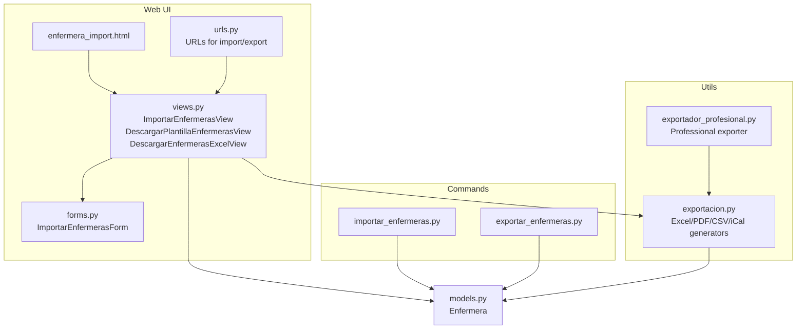
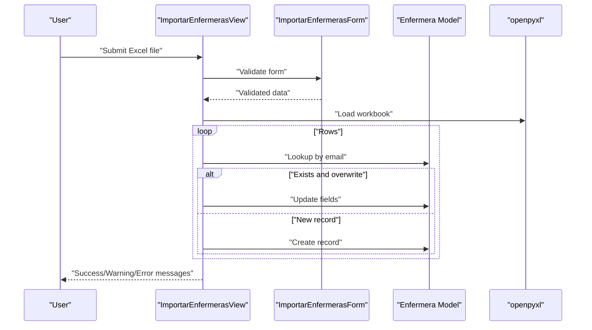
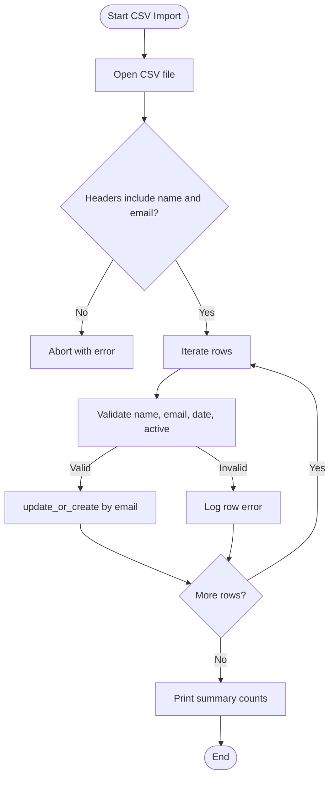
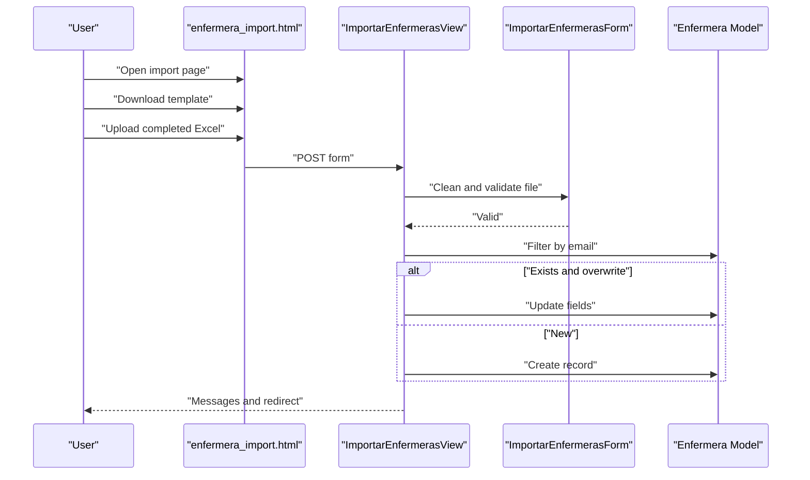
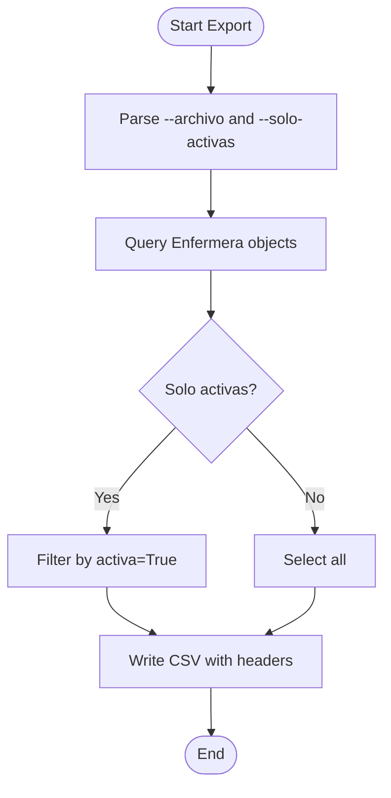
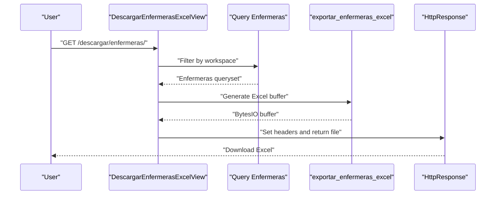
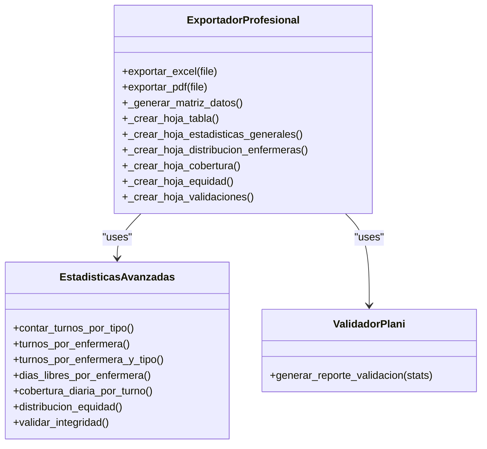
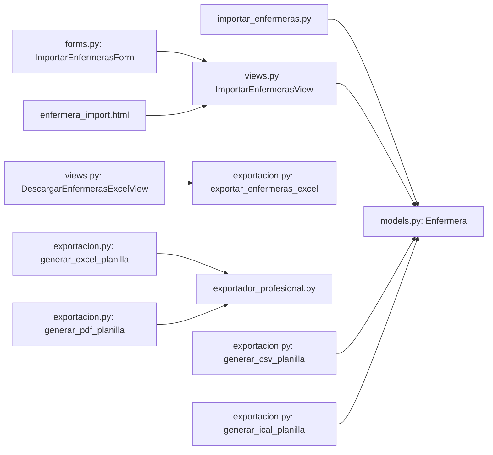

# Staff Import and Export

<cite>
**Referenced Files in This Document**
- [importar_enfermeras.py](file://turnos/management/commands/importar_enfermeras.py)
- [exportar_enfermeras.py](file://turnos/management/commands/exportar_enfermeras.py)
- [exportacion.py](file://turnos/utils/exportacion.py)
- [exportador_profesional.py](file://turnos/utils/exportador_profesional.py)
- [enfermera_import.html](file://turnos/templates/turnos/enfermera_import.html)
- [views.py](file://turnos/views.py)
- [forms.py](file://turnos/forms.py)
- [urls.py](file://turnos/urls.py)
- [models.py](file://turnos/models.py)
</cite>

## Table of Contents
1. [Introduction](#introduction)
2. [Project Structure](#project-structure)
3. [Core Components](#core-components)
4. [Architecture Overview](#architecture-overview)
5. [Detailed Component Analysis](#detailed-component-analysis)
6. [Dependency Analysis](#dependency-analysis)
7. [Performance Considerations](#performance-considerations)
8. [Troubleshooting Guide](#troubleshooting-guide)
9. [Conclusion](#conclusion)
10. [Appendices](#appendices)

## Introduction
This document explains the staff import and export capabilities for managing nurse profiles and planification outputs. It covers supported import formats (CSV and Excel), validation rules, error handling during batch operations, and export formats (PDF, Excel, CSV, iCalendar). It also documents import templates, data mapping requirements, validation workflows, examples of bulk operations, and data quality checks. Finally, it outlines export customization options and automated export scheduling.

## Project Structure
The import/export functionality spans command-line tools, Django views, forms, templates, and utility modules:
- Management commands for CSV import/export of staff records
- Web-based Excel import via a dedicated view and form
- Utility modules for generating Excel/PDF/CSV/iCalendar exports of planifications and staff lists
- Templates and URLs enabling user-driven workflows

**Diagram sources**
- [enfermera_import.html:1-86](file://turnos/templates/turnos/enfermera_import.html#L1-L86)
- [views.py:971-1067](file://turnos/views.py#L971-L1067)
- [forms.py:601-633](file://turnos/forms.py#L601-L633)
- [urls.py:50-108](file://turnos/urls.py#L50-L108)
- [importar_enfermeras.py:1-167](file://turnos/management/commands/importar_enfermeras.py#L1-L167)
- [exportar_enfermeras.py:1-58](file://turnos/management/commands/exportar_enfermeras.py#L1-L58)
- [exportacion.py:1-665](file://turnos/utils/exportacion.py#L1-L665)
- [exportador_profesional.py:1-990](file://turnos/utils/exportador_profesional.py#L1-L990)
- [models.py:30-58](file://turnos/models.py#L30-L58)

**Section sources**
- [urls.py:50-108](file://turnos/urls.py#L50-L108)
- [views.py:971-1067](file://turnos/views.py#L971-L1067)
- [forms.py:601-633](file://turnos/forms.py#L601-L633)
- [enfermera_import.html:1-86](file://turnos/templates/turnos/enfermera_import.html#L1-L86)
- [models.py:30-58](file://turnos/models.py#L30-L58)

## Core Components
- CSV import/export for staff records via Django management commands
- Excel import/export for staff via web interface and CLI
- Professional export of planifications to Excel/PDF/CSV/iCalendar
- Validation and error reporting for batch operations
- Export filtering and customization options

Key capabilities:
- Import staff from CSV or Excel
- Export staff list to Excel
- Export planifications to Excel (7 sheets), PDF, CSV, iCalendar
- Duplicate detection and conflict resolution
- Logging and messaging for auditability

**Section sources**
- [importar_enfermeras.py:1-167](file://turnos/management/commands/importar_enfermeras.py#L1-L167)
- [exportar_enfermeras.py:1-58](file://turnos/management/commands/exportar_enfermeras.py#L1-L58)
- [views.py:971-1067](file://turnos/views.py#L971-L1067)
- [exportacion.py:1-665](file://turnos/utils/exportacion.py#L1-L665)
- [exportador_profesional.py:1-990](file://turnos/utils/exportador_profesional.py#L1-L990)

## Architecture Overview
The system supports two primary import paths and multiple export paths:
- Web-based Excel import with validation and feedback
- CLI CSV import/export for automation
- Professional planification exports with quality checks and visual reports

**Diagram sources**
- [views.py:971-1067](file://turnos/views.py#L971-L1067)
- [forms.py:601-633](file://turnos/forms.py#L601-L633)
- [models.py:30-58](file://turnos/models.py#L30-L58)

**Section sources**
- [views.py:971-1067](file://turnos/views.py#L971-L1067)
- [forms.py:601-633](file://turnos/forms.py#L601-L633)
- [models.py:30-58](file://turnos/models.py#L30-L58)

## Detailed Component Analysis

### CSV Import (CLI)
- Purpose: Batch import of staff from CSV
- Supported arguments:
  - File path
  - Optional overwrite flag (update existing records by email)
  - Example format flag
- Validation:
  - Required headers: name and email
  - Email validation
  - Date parsing (YYYY-MM-DD or DD/MM/YYYY)
  - Boolean parsing for active flag
- Error handling:
  - Row-level errors reported with row number
  - Summary counts for created/updated/errors
- Output:
  - Console feedback and summary

**Diagram sources**
- [importar_enfermeras.py:29-151](file://turnos/management/commands/importar_enfermeras.py#L29-L151)

**Section sources**
- [importar_enfermeras.py:1-167](file://turnos/management/commands/importar_enfermeras.py#L1-L167)

### Excel Import (Web)
- Purpose: Upload Excel file via web UI
- Template: Downloadable Excel template with required columns
- Validation:
  - File extension check (.xlsx, .xls)
  - Size limit (≤5MB)
  - Required fields: name, email
  - Active flag normalization
- Behavior:
  - Overwrite option updates existing records by email
  - Success/warning/error messages with counts

**Diagram sources**
- [enfermera_import.html:1-86](file://turnos/templates/turnos/enfermera_import.html#L1-L86)
- [views.py:971-1067](file://turnos/views.py#L971-L1067)
- [forms.py:601-633](file://turnos/forms.py#L601-L633)
- [models.py:30-58](file://turnos/models.py#L30-L58)

**Section sources**
- [enfermera_import.html:1-86](file://turnos/templates/turnos/enfermera_import.html#L1-L86)
- [views.py:971-1067](file://turnos/views.py#L971-L1067)
- [forms.py:601-633](file://turnos/forms.py#L601-L633)
- [models.py:30-58](file://turnos/models.py#L30-L58)

### Staff Export (CLI)
- Purpose: Export all staff to CSV
- Filters:
  - Option to export only active staff
- Output:
  - CSV file with selected fields and timestamps

**Diagram sources**
- [exportar_enfermeras.py:23-57](file://turnos/management/commands/exportar_enfermeras.py#L23-L57)

**Section sources**
- [exportar_enfermeras.py:1-58](file://turnos/management/commands/exportar_enfermeras.py#L1-L58)

### Staff Export (Web)
- Purpose: Download staff list as Excel
- Filtering:
  - Workspace-aware query
- Output:
  - Excel with styled headers and data

**Diagram sources**
- [views.py:2459-2479](file://turnos/views.py#L2459-L2479)
- [exportacion.py:629-664](file://turnos/utils/exportacion.py#L629-L664)

**Section sources**
- [views.py:2459-2479](file://turnos/views.py#L2459-L2479)
- [exportacion.py:629-664](file://turnos/utils/exportacion.py#L629-L664)

### Planification Export (Professional)
- Formats:
  - Excel (7 sheets: Vertical, Horizontal, Statistics, By Nurse, Coverage, Equity, Validations)
  - PDF (horizontal matrix with statistics)
  - CSV (vertical format)
  - iCalendar (.ics)
- Features:
  - Color-coded cells per shift type
  - Statistical summaries and validation reports
  - Graceful handling of missing libraries (optional dependencies)

**Diagram sources**
- [exportador_profesional.py:80-250](file://turnos/utils/exportador_profesional.py#L80-L250)
- [exportador_profesional.py:256-741](file://turnos/utils/exportador_profesional.py#L256-L741)

**Section sources**
- [exportacion.py:135-467](file://turnos/utils/exportacion.py#L135-L467)
- [exportador_profesional.py:1-990](file://turnos/utils/exportador_profesional.py#L1-L990)

## Dependency Analysis
- Import paths:
  - CSV import depends on Django’s CSV reader and model update_or_create
  - Excel import depends on openpyxl and Enfermera model
- Export paths:
  - Excel/PDF/CSV/iCalendar depend on optional libraries (openpyxl, reportlab, icalendar)
  - Web downloads stream BytesIO buffers
- Data integrity:
  - Unique constraints enforced at model level (email, DNI)
  - Validation ensures required fields and normalized booleans

**Diagram sources**
- [importar_enfermeras.py:1-167](file://turnos/management/commands/importar_enfermeras.py#L1-L167)
- [views.py:971-1067](file://turnos/views.py#L971-L1067)
- [forms.py:601-633](file://turnos/forms.py#L601-L633)
- [enfermera_import.html:1-86](file://turnos/templates/turnos/enfermera_import.html#L1-L86)
- [exportacion.py:135-467](file://turnos/utils/exportacion.py#L135-L467)
- [exportador_profesional.py:1-990](file://turnos/utils/exportador_profesional.py#L1-L990)
- [models.py:30-58](file://turnos/models.py#L30-L58)

**Section sources**
- [models.py:30-58](file://turnos/models.py#L30-L58)
- [exportacion.py:1-665](file://turnos/utils/exportacion.py#L1-L665)
- [exportador_profesional.py:1-990](file://turnos/utils/exportador_profesional.py#L1-L990)

## Performance Considerations
- Prefer batch operations via CLI commands for large datasets to avoid web timeouts.
- Limit Excel file sizes (<5MB) to reduce memory usage.
- Use filtering options (e.g., export only active staff) to minimize output size.
- For planification exports, spreadsheet generation can be resource-intensive; schedule during off-peak hours.

## Troubleshooting Guide
Common issues and resolutions:
- Excel upload fails:
  - Ensure .xlsx/.xls extension and file size ≤5MB
  - Verify required columns present in uploaded file
- Email conflicts:
  - Enfermera email must be unique; resolve duplicates before import
- CSV import errors:
  - Confirm headers include name and email
  - Validate date formats and boolean values
- Missing optional libraries:
  - Excel/PDF/iCalendar exports require respective packages; install to enable formats

Operational tips:
- Use the example CSV format to validate structure
- Review console logs for row-level errors during CSV import
- Monitor message notifications after Excel import

**Section sources**
- [forms.py:621-632](file://turnos/forms.py#L621-L632)
- [importar_enfermeras.py:42-48](file://turnos/management/commands/importar_enfermeras.py#L42-L48)
- [exportacion.py:22-48](file://turnos/utils/exportacion.py#L22-L48)

## Conclusion
The system provides robust, multi-format import/export capabilities for staff and planifications. Web-based Excel import offers guided workflows with validation and feedback, while CLI tools support scalable batch operations. Professional planification exports deliver comprehensive analytics and quality checks across multiple formats, enabling informed decision-making and compliance reporting.

## Appendices

### Supported Import Formats
- CSV: CLI command for batch import with overwrite option
- Excel: Web upload with template and validation

**Section sources**
- [importar_enfermeras.py:1-167](file://turnos/management/commands/importar_enfermeras.py#L1-L167)
- [views.py:971-1067](file://turnos/views.py#L971-L1067)
- [enfermera_import.html:1-86](file://turnos/templates/turnos/enfermera_import.html#L1-L86)

### Import Validation Rules
- CSV:
  - Required headers: name, email
  - Email validation and uniqueness
  - Date parsing for hire date
  - Boolean normalization for active flag
- Excel:
  - File type and size limits
  - Required fields: name, email
  - Active flag normalization

**Section sources**
- [importar_enfermeras.py:42-98](file://turnos/management/commands/importar_enfermeras.py#L42-L98)
- [forms.py:621-632](file://turnos/forms.py#L621-L632)
- [views.py:1003-1008](file://turnos/views.py#L1003-L1008)

### Error Handling During Batch Operations
- CSV:
  - Row-level error reporting with row number
  - Summary counts for created/updated/errors
- Excel:
  - Messages for success/warnings/errors
  - Logging with row data for diagnostics

**Section sources**
- [importar_enfermeras.py:134-146](file://turnos/management/commands/importar_enfermeras.py#L134-L146)
- [views.py:1034-1067](file://turnos/views.py#L1034-L1067)

### Export Capabilities
- Staff:
  - Excel: Web download with workspace filtering
  - CSV: CLI export with optional active-only filter
- Planifications:
  - Excel: 7-sheet professional report
  - PDF: Horizontal matrix with statistics
  - CSV: Vertical format
  - iCalendar: Shift events

**Section sources**
- [exportar_enfermeras.py:1-58](file://turnos/management/commands/exportar_enfermeras.py#L1-L58)
- [views.py:2459-2479](file://turnos/views.py#L2459-L2479)
- [exportacion.py:135-467](file://turnos/utils/exportacion.py#L135-L467)
- [exportador_profesional.py:256-741](file://turnos/utils/exportador_profesional.py#L256-L741)

### Export Filters and Customization
- Staff export:
  - Active-only filter for CSV
  - Workspace-aware filtering for Excel
- Planification export:
  - Color-coded sheets
  - Statistical summaries and validation reports
  - Customizable output via professional exporter

**Section sources**
- [exportar_enfermeras.py:18-21](file://turnos/management/commands/exportar_enfermeras.py#L18-L21)
- [views.py:2467-2478](file://turnos/views.py#L2467-L2478)
- [exportacion.py:135-467](file://turnos/utils/exportacion.py#L135-L467)

### Import Templates and Data Mapping
- Excel template:
  - Columns: Name, Email, Phone, ID, Active
  - Downloadable from import page
- CSV format:
  - Fields: name, email, phone, dni, hire date, active, notes
  - Example provided by CLI command

**Section sources**
- [enfermera_import.html:32-70](file://turnos/templates/turnos/enfermera_import.html#L32-L70)
- [importar_enfermeras.py:153-167](file://turnos/management/commands/importar_enfermeras.py#L153-L167)

### Examples of Bulk Operations
- CSV import:
  - Run CLI command with CSV file and optional overwrite flag
  - Review console summary for created/updated/errors
- Excel import:
  - Download template, fill data, upload via web form
  - Receive success/warning/error messages

**Section sources**
- [importar_enfermeras.py:29-32](file://turnos/management/commands/importar_enfermeras.py#L29-L32)
- [views.py:977-1067](file://turnos/views.py#L977-L1067)

### Data Quality Checks
- Unique constraints:
  - Email and DNI uniqueness enforced at model level
- Validation:
  - CSV email validation and date parsing
  - Excel file validation and required fields
- Professional export validation:
  - Integrity checks and coverage reports

**Section sources**
- [models.py:40-46](file://turnos/models.py#L40-L46)
- [importar_enfermeras.py:69-98](file://turnos/management/commands/importar_enfermeras.py#L69-L98)
- [exportador_profesional.py:181-209](file://turnos/utils/exportador_profesional.py#L181-L209)

### Automated Export Scheduling
- CLI commands support scripted automation for periodic exports
- Web exports are user-triggered; integrate with external schedulers for recurring tasks

**Section sources**
- [exportar_enfermeras.py:10-16](file://turnos/management/commands/exportar_enfermeras.py#L10-L16)
- [exportacion.py:135-467](file://turnos/utils/exportacion.py#L135-L467)