# Staff Management

<cite>
**Referenced Files in This Document**
- [models.py](file://turnos/models.py)
- [admin.py](file://turnos/admin.py)
- [views.py](file://turnos/views.py)
- [forms.py](file://turnos/forms.py)
- [mixins.py](file://turnos/mixins.py)
- [urls.py](file://turnos/urls.py)
- [enfermera_list.html](file://turnos/templates/turnos/enfermera_list.html)
- [enfermera_detail.html](file://turnos/templates/turnos/enfermera_detail.html)
- [enfermera_form.html](file://turnos/templates/turnos/enfermera_form.html)
- [enfermera_import.html](file://turnos/templates/turnos/enfermera_import.html)
- [exportacion.py](file://turnos/utils/exportacion.py)
- [exportador_profesional.py](file://turnos/utils/exportador_profesional.py)
- [importar_enfermeras.py](file://turnos/management/commands/importar_enfermeras.py)
- [exportar_enfermeras.py](file://turnos/management/commands/exportar_enfermeras.py)
</cite>

## Table of Contents
1. [Introduction](#introduction)
2. [Project Structure](#project-structure)
3. [Core Components](#core-components)
4. [Architecture Overview](#architecture-overview)
5. [Detailed Component Analysis](#detailed-component-analysis)
6. [Dependency Analysis](#dependency-analysis)
7. [Performance Considerations](#performance-considerations)
8. [Troubleshooting Guide](#troubleshooting-guide)
9. [Conclusion](#conclusion)
10. [Appendices](#appendices)

## Introduction
This document explains the staff management capabilities centered on the Enfermera (Registered Nurse) entity. It covers staff registration, profile management, preference handling, import/export functionality, preference-based scheduling adjustments, availability management, skills/qualifications via contracts, and lifecycle management from onboarding to offboarding. It also documents filtering, search, and bulk operations, along with practical workflows and capacity planning considerations.

## Project Structure
Staff management spans models, admin, views, forms, templates, utilities, and management commands. The Enfermera model is central, with supporting models for contracts, rotations, incidents, and historical balances. Views implement CRUD, filtering, search, and export. Templates provide user-facing screens for listing, creating, editing, importing, and viewing staff profiles. Utilities and commands enable exporting and importing staff data.

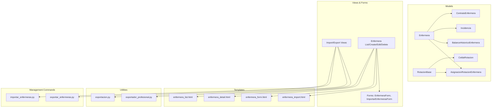

**Diagram sources**
- [models.py:30-825](file://turnos/models.py#L30-L825)
- [views.py:1-800](file://turnos/views.py#L1-L800)
- [forms.py:1-905](file://turnos/forms.py#L1-L905)
- [enfermera_list.html:1-216](file://turnos/templates/turnos/enfermera_list.html#L1-L216)
- [enfermera_detail.html:1-224](file://turnos/templates/turnos/enfermera_detail.html#L1-L224)
- [enfermera_form.html:1-218](file://turnos/templates/turnos/enfermera_form.html#L1-L218)
- [enfermera_import.html:1-86](file://turnos/templates/turnos/enfermera_import.html#L1-L86)
- [exportacion.py:1-665](file://turnos/utils/exportacion.py#L1-L665)
- [exportador_profesional.py:1-990](file://turnos/utils/exportador_profesional.py#L1-L990)
- [importar_enfermeras.py:1-167](file://turnos/management/commands/importar_enfermeras.py#L1-L167)
- [exportar_enfermeras.py:1-58](file://turnos/management/commands/exportar_enfermeras.py#L1-L58)

**Section sources**
- [models.py:30-825](file://turnos/models.py#L30-L825)
- [views.py:1-800](file://turnos/views.py#L1-L800)
- [forms.py:1-905](file://turnos/forms.py#L1-L905)
- [enfermera_list.html:1-216](file://turnos/templates/turnos/enfermera_list.html#L1-L216)
- [enfermera_detail.html:1-224](file://turnos/templates/turnos/enfermera_detail.html#L1-L224)
- [enfermera_form.html:1-218](file://turnos/templates/turnos/enfermera_form.html#L1-L218)
- [enfermera_import.html:1-86](file://turnos/templates/turnos/enfermera_import.html#L1-L86)
- [exportacion.py:1-665](file://turnos/utils/exportacion.py#L1-L665)
- [exportador_profesional.py:1-990](file://turnos/utils/exportador_profesional.py#L1-L990)
- [importar_enfermeras.py:1-167](file://turnos/management/commands/importar_enfermeras.py#L1-L167)
- [exportar_enfermeras.py:1-58](file://turnos/management/commands/exportar_enfermeras.py#L1-L58)

## Core Components
- Enfermera model: Stores personal info, contact details, employment status, hire date, preferences, and notes. Preferences are stored as JSON for flexible configuration.
- Contract model: Defines contractual hours and workload targets per nurse.
- Rotation models: Define recurring weekly cycles and assign them to nurses with offsets.
- Incidents: Track planned leaves, training, and fixed assignments impacting schedule.
- Historical balances: Accumulated metrics aiding contextual planning.
- Admin: Provides list/search/filter UI and inline editing for advanced models.
- Views: Implement CRUD, filtering, search, and export for staff and plan data.
- Forms: Validate staff creation/editing and import operations.
- Templates: Provide UI for listing, viewing, editing, importing, and creating staff records.
- Utilities: Export plan data to Excel/PDF/CSV/JSON and iCal; professional exporter with analytics.
- Management commands: Import/export staff from/to CSV.

**Section sources**
- [models.py:30-825](file://turnos/models.py#L30-L825)
- [admin.py:1-449](file://turnos/admin.py#L1-L449)
- [views.py:1-800](file://turnos/views.py#L1-L800)
- [forms.py:1-905](file://turnos/forms.py#L1-L905)
- [exportacion.py:1-665](file://turnos/utils/exportacion.py#L1-L665)
- [exportador_profesional.py:1-990](file://turnos/utils/exportador_profesional.py#L1-L990)
- [importar_enfermeras.py:1-167](file://turnos/management/commands/importar_enfermeras.py#L1-L167)
- [exportar_enfermeras.py:1-58](file://turnos/management/commands/exportar_enfermeras.py#L1-L58)

## Architecture Overview
Staff management follows a layered Django architecture:
- Presentation: Templates render staff lists, forms, and detail views.
- Business logic: Views orchestrate queries, validations, and exports.
- Data access: Models define relationships and constraints.
- Utilities: Exporters and commands encapsulate cross-cutting concerns.

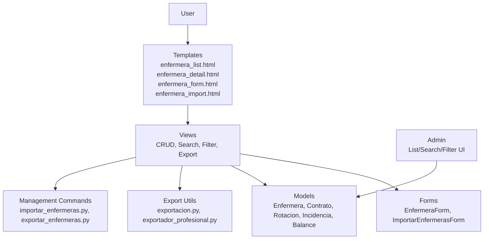

**Diagram sources**
- [urls.py:1-108](file://turnos/urls.py#L1-L108)
- [views.py:1-800](file://turnos/views.py#L1-L800)
- [forms.py:1-905](file://turnos/forms.py#L1-L905)
- [models.py:30-825](file://turnos/models.py#L30-L825)
- [admin.py:1-449](file://turnos/admin.py#L1-L449)
- [exportacion.py:1-665](file://turnos/utils/exportacion.py#L1-L665)
- [exportador_profesional.py:1-990](file://turnos/utils/exportador_profesional.py#L1-L990)
- [importar_enfermeras.py:1-167](file://turnos/management/commands/importar_enfermeras.py#L1-L167)
- [exportar_enfermeras.py:1-58](file://turnos/management/commands/exportar_enfermeras.py#L1-L58)

## Detailed Component Analysis

### Enfermera Model Structure
Key attributes and behaviors:
- Identity and contact: name, email (unique), phone, DNI (optional).
- Status and metadata: active flag, hire date, notes.
- Preferences: JSON field for flexible configuration (e.g., preferred shifts, free days).
- Related models: OneToOne contract, many-to-many assignments, many-to-many rotations, many-to-many incidents, many-to-many balances.

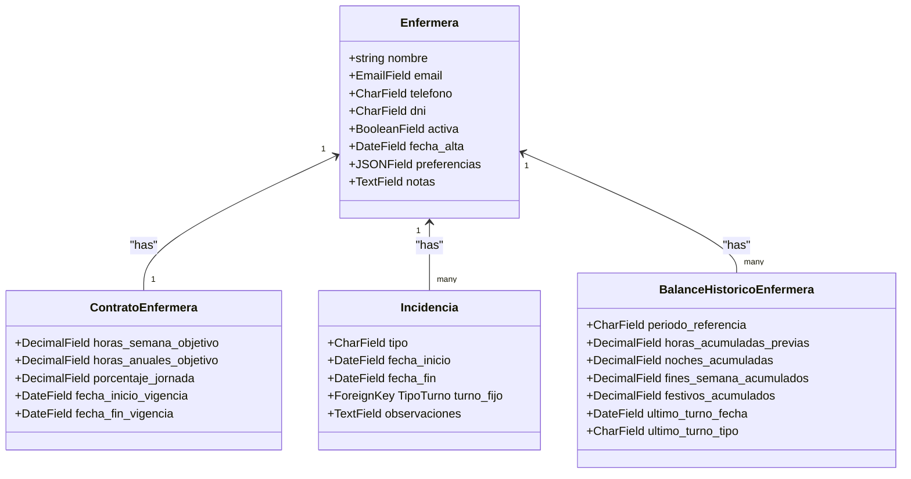

**Diagram sources**
- [models.py:30-825](file://turnos/models.py#L30-L825)

**Section sources**
- [models.py:30-825](file://turnos/models.py#L30-L825)

### Staff Registration and Profile Management
- Registration: Create new staff via the form with validation for unique email and optional DNI format.
- Editing: Update profile details, status, and notes; preferences are stored as JSON.
- Deactivation: Toggle active status to mark staff as offboarded or temporarily unavailable.

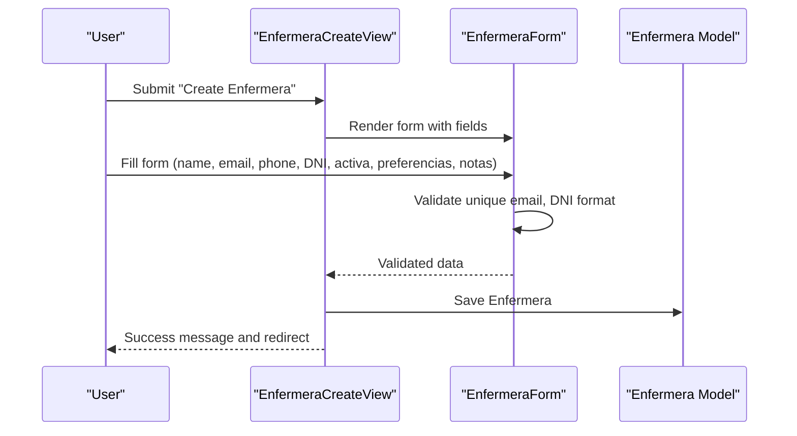

**Diagram sources**
- [views.py:1-800](file://turnos/views.py#L1-L800)
- [forms.py:1-905](file://turnos/forms.py#L1-L905)
- [enfermera_form.html:1-218](file://turnos/templates/turnos/enfermera_form.html#L1-L218)

**Section sources**
- [views.py:1-800](file://turnos/views.py#L1-L800)
- [forms.py:1-905](file://turnos/forms.py#L1-L905)
- [enfermera_form.html:1-218](file://turnos/templates/turnos/enfermera_form.html#L1-L218)

### Preference Handling and Scheduling Adjustments
- Preferences storage: JSON field supports arrays/lists for preferred shifts and free days.
- Preference-based soft constraints: Preferences integrate with soft constraints in configuration to improve satisfaction.
- Viewing preferences: Detail view renders structured preference data for transparency.

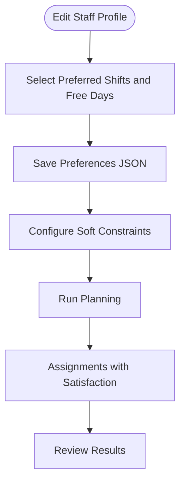

**Diagram sources**
- [enfermera_form.html:133-195](file://turnos/templates/turnos/enfermera_form.html#L133-L195)
- [enfermera_detail.html:123-157](file://turnos/templates/turnos/enfermera_detail.html#L123-L157)
- [views.py:1-800](file://turnos/views.py#L1-L800)

**Section sources**
- [enfermera_form.html:133-195](file://turnos/templates/turnos/enfermera_form.html#L133-L195)
- [enfermera_detail.html:123-157](file://turnos/templates/turnos/enfermera_detail.html#L123-L157)
- [views.py:1-800](file://turnos/views.py#L1-L800)

### Staff Availability Management, Skills, and Qualifications
- Availability: Managed via Incidencia entries (vacation, leave, training, fixed assignment).
- Rotations: Weekly cycles (RotacionBase) with cells (CeldaRotacion) and assignments (AsignacionRotacionEnfermera) to enforce recurring schedules.
- Contracts: Define workload targets and percentages to guide capacity planning.
- Historical balances: Accumulated metrics support fairness and compliance checks.

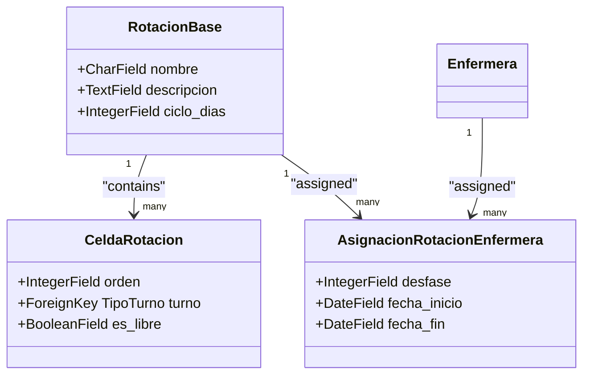

**Diagram sources**
- [models.py:666-747](file://turnos/models.py#L666-L747)

**Section sources**
- [models.py:666-747](file://turnos/models.py#L666-L747)

### Staff Import/Export Functionality
- Import (CSV CLI): Bulk-create/update staff from CSV with validation for headers, email uniqueness, dates, and activity status.
- Export (CSV CLI): Export all staff to CSV with selected fields.
- Export (Excel): Dedicated exporter for staff list with styling and headers.
- Web import: Upload Excel via UI with guidance and required columns.

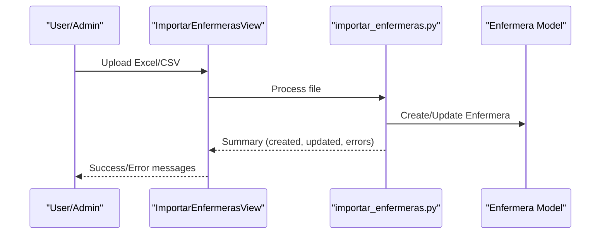

**Diagram sources**
- [urls.py:52-60](file://turnos/urls.py#L52-L60)
- [views.py:1-800](file://turnos/views.py#L1-L800)
- [importar_enfermeras.py:1-167](file://turnos/management/commands/importar_enfermeras.py#L1-L167)
- [exportar_enfermeras.py:1-58](file://turnos/management/commands/exportar_enfermeras.py#L1-L58)
- [exportacion.py:629-665](file://turnos/utils/exportacion.py#L629-L665)

**Section sources**
- [urls.py:52-60](file://turnos/urls.py#L52-L60)
- [views.py:1-800](file://turnos/views.py#L1-L800)
- [importar_enfermeras.py:1-167](file://turnos/management/commands/importar_enfermeras.py#L1-L167)
- [exportar_enfermeras.py:1-58](file://turnos/management/commands/exportar_enfermeras.py#L1-L58)
- [exportacion.py:629-665](file://turnos/utils/exportacion.py#L629-L665)
- [enfermera_import.html:1-86](file://turnos/templates/turnos/enfermera_import.html#L1-L86)

### Filtering, Search, and Bulk Operations
- Filtering and search: Generic mixins enable search across configured fields and filter by parameters.
- Staff list: Supports search by name/email/DNI, filter by active status, and sort by name/date.
- Bulk operations: Export staff to Excel/CSV/PDF/JSON; import via CLI or web upload.

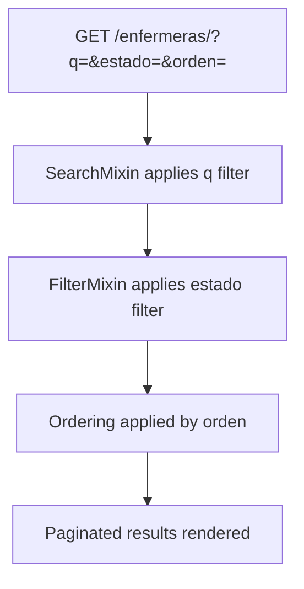

**Diagram sources**
- [mixins.py:102-138](file://turnos/mixins.py#L102-L138)
- [enfermera_list.html:25-70](file://turnos/templates/turnos/enfermera_list.html#L25-L70)

**Section sources**
- [mixins.py:102-138](file://turnos/mixins.py#L102-L138)
- [enfermera_list.html:25-70](file://turnos/templates/turnos/enfermera_list.html#L25-L70)

### Staff Lifecycle Management
- Onboarding: Create profile, set active status, configure contract and rotation.
- Active period: Assign to plans, track assignments, maintain preferences and incidents.
- Offboarding: Deactivate profile; historical balances and past incidents remain for reporting.

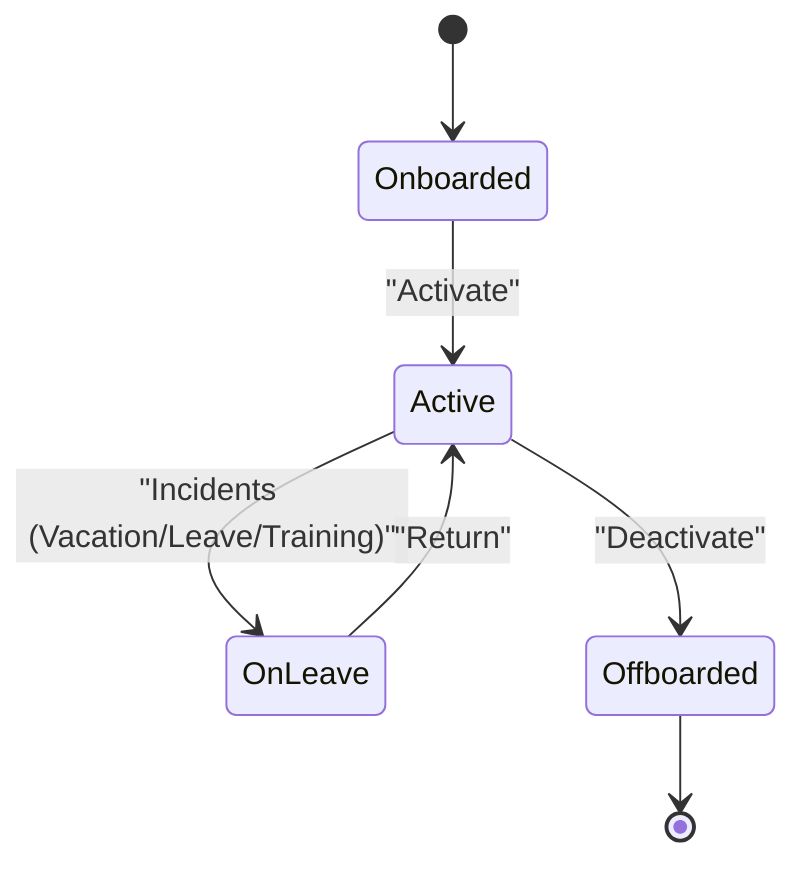

**Diagram sources**
- [models.py:30-825](file://turnos/models.py#L30-L825)
- [enfermera_detail.html:159-203](file://turnos/templates/turnos/enfermera_detail.html#L159-L203)

**Section sources**
- [models.py:30-825](file://turnos/models.py#L30-L825)
- [enfermera_detail.html:159-203](file://turnos/templates/turnos/enfermera_detail.html#L159-L203)

### Capacity Planning and Preference-Based Scheduling
- Capacity planning: Contracts define weekly/yearly targets and percentage of full-time; historical balances inform fairness.
- Preference-based scheduling: Soft constraints incorporate preferences to optimize satisfaction while meeting hard constraints.
- Reporting: Professional exporter and standard exporters provide distribution, equity, and validation reports.

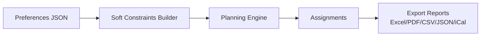

**Diagram sources**
- [exportador_profesional.py:1-990](file://turnos/utils/exportador_profesional.py#L1-L990)
- [exportacion.py:1-665](file://turnos/utils/exportacion.py#L1-L665)
- [views.py:1-800](file://turnos/views.py#L1-L800)

**Section sources**
- [exportador_profesional.py:1-990](file://turnos/utils/exportador_profesional.py#L1-L990)
- [exportacion.py:1-665](file://turnos/utils/exportacion.py#L1-L665)
- [views.py:1-800](file://turnos/views.py#L1-L800)

## Dependency Analysis
- Views depend on models, forms, and mixins for search/filter/pagination.
- Templates depend on views for context and on forms for rendering.
- Utilities depend on models for data extraction and export formats.
- Management commands depend on models for ORM operations.

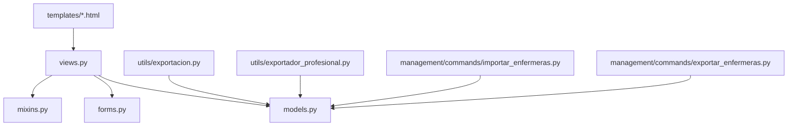

**Diagram sources**
- [views.py:1-800](file://turnos/views.py#L1-L800)
- [models.py:30-825](file://turnos/models.py#L30-L825)
- [forms.py:1-905](file://turnos/forms.py#L1-L905)
- [mixins.py:1-229](file://turnos/mixins.py#L1-L229)
- [exportacion.py:1-665](file://turnos/utils/exportacion.py#L1-L665)
- [exportador_profesional.py:1-990](file://turnos/utils/exportador_profesional.py#L1-L990)
- [importar_enfermeras.py:1-167](file://turnos/management/commands/importar_enfermeras.py#L1-L167)
- [exportar_enfermeras.py:1-58](file://turnos/management/commands/exportar_enfermeras.py#L1-L58)

**Section sources**
- [views.py:1-800](file://turnos/views.py#L1-L800)
- [models.py:30-825](file://turnos/models.py#L30-L825)
- [forms.py:1-905](file://turnos/forms.py#L1-L905)
- [mixins.py:1-229](file://turnos/mixins.py#L1-L229)
- [exportacion.py:1-665](file://turnos/utils/exportacion.py#L1-L665)
- [exportador_profesional.py:1-990](file://turnos/utils/exportador_profesional.py#L1-L990)
- [importar_enfermeras.py:1-167](file://turnos/management/commands/importar_enfermeras.py#L1-L167)
- [exportar_enfermeras.py:1-58](file://turnos/management/commands/exportar_enfermeras.py#L1-L58)

## Performance Considerations
- Efficient queries: Use select_related/prefetch_related in views to reduce database hits.
- Pagination: Built-in pagination mixin limits result sets for large datasets.
- JSON fields: Store preferences as JSON to avoid normalization overhead; validate structure server-side.
- Export performance: Batch operations and streaming buffers minimize memory usage for large exports.

[No sources needed since this section provides general guidance]

## Troubleshooting Guide
- Unique email validation: Creating or editing a staff member fails if email exists; ensure uniqueness.
- DNI format validation: Enforce Spanish DNI format; otherwise raises validation error.
- CSV import issues: Verify headers, encoding, and file size limits; use CLI command for large imports.
- Export failures: Confirm optional libraries (openpyxl, reportlab, icalendar) are installed if using Excel/PDF/iCal exports.

**Section sources**
- [forms.py:52-73](file://turnos/forms.py#L52-L73)
- [forms.py:621-633](file://turnos/forms.py#L621-L633)
- [importar_enfermeras.py:1-167](file://turnos/management/commands/importar_enfermeras.py#L1-L167)
- [exportacion.py:22-49](file://turnos/utils/exportacion.py#L22-L49)

## Conclusion
The staff management subsystem centers on the Enfermera model with robust support for registration, profile maintenance, preference handling, import/export, availability/incidents, contracts, rotations, and historical balances. The combination of generic mixins, strong validation, and professional export/reporting utilities enables efficient onboarding, lifecycle management, and capacity planning aligned with organizational needs.

## Appendices
- Example workflows:
  - Onboarding: Create profile → Configure contract → Assign rotation → Activate → Run planning.
  - Preference configuration: Edit profile → Set preferred shifts/free days → Add soft constraints → Re-run planning.
  - Capacity planning: Review historical balances → Adjust contract targets → Validate equity and coverage → Export reports.

[No sources needed since this section summarizes without analyzing specific files]