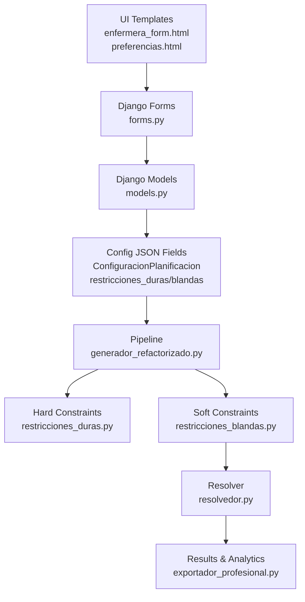
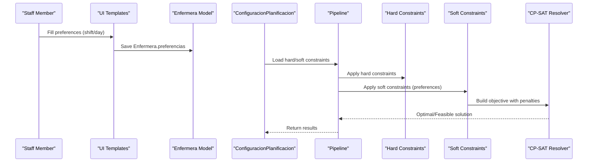
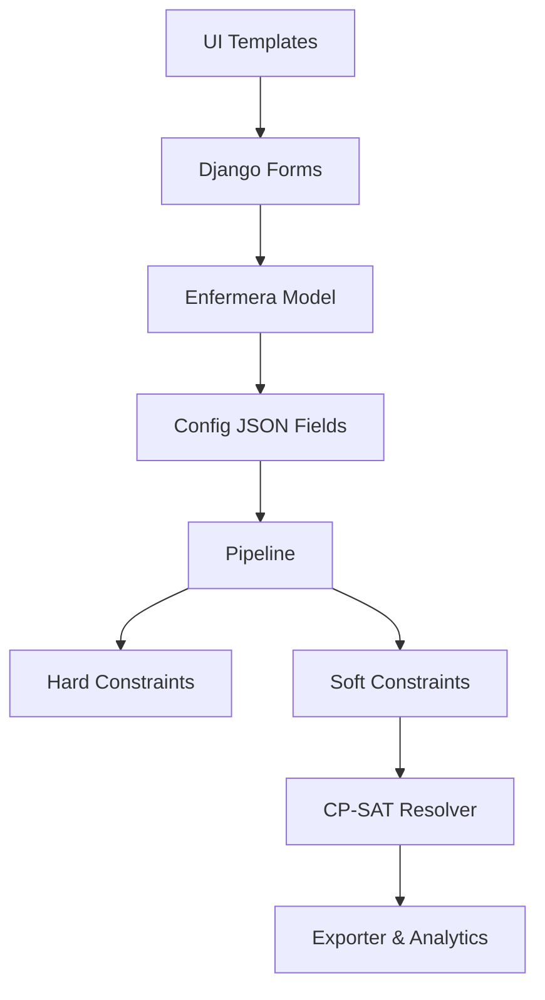

# Staff Preferences and Availability

<cite>
**Referenced Files in This Document**
- [models.py](file://turnos/models.py)
- [enfermera_form.html](file://turnos/templates/turnos/enfermera_form.html)
- [preferencias.html](file://turnos/templates/turnos/preferencias.html)
- [restricciones.js](file://static/js/restricciones.js)
- [vocabulario.py](file://turnos/dominio/vocabulario.py)
- [restricciones_blandas.py](file://turnos/restricciones_blandas.py)
- [restricciones_duras.py](file://turnos/restricciones_duras.py)
- [generador_refactorizado.py](file://turnos/generador_refactorizado.py)
- [resolvedor.py](file://turnos/resolvedor.py)
- [exportador_profesional.py](file://turnos/utils/exportador_profesional.py)
</cite>

## Table of Contents
1. [Introduction](#introduction)
2. [Project Structure](#project-structure)
3. [Core Components](#core-components)
4. [Architecture Overview](#architecture-overview)
5. [Detailed Component Analysis](#detailed-component-analysis)
6. [Dependency Analysis](#dependency-analysis)
7. [Performance Considerations](#performance-considerations)
8. [Troubleshooting Guide](#troubleshooting-guide)
9. [Conclusion](#conclusion)
10. [Appendices](#appendices)

## Introduction
This document explains staff preference management and availability handling in the turn scheduling system. It covers the preferencias JSON field structure, supported preference types (shift preferences, day preferences, scheduling constraints), configuration workflows, validation rules, integration with the constraint satisfaction solver, preference-based scheduling adjustments, conflict resolution, and preference impact on generated schedules. It also documents preference import/export capabilities and analytics.

## Project Structure
The preference system spans UI forms, domain models, configuration JSON fields, and the constraint satisfaction pipeline:
- UI: HTML templates define optional preference sections for staff profiles and general user preferences.
- Domain: The Enfermera model stores preferences as a JSON field.
- Configuration: ConfiguracionPlanificacion holds hard constraints (duras) and soft constraints (blandas) as JSON arrays.
- Solver: The pipeline applies hard constraints first, then soft constraints (including preferences), and finally resolves the model.

**Diagram sources**
- [enfermera_form.html](file://turnos/templates/turnos/enfermera_form.html)
- [preferencias.html](file://turnos/templates/turnos/preferencias.html)
- [models.py](file://turnos/models.py)
- [generador_refactorizado.py](file://turnos/generador_refactorizado.py)
- [restricciones_duras.py](file://turnos/restricciones_duras.py)
- [restricciones_blandas.py](file://turnos/restricciones_blandas.py)
- [resolvedor.py](file://turnos/resolvedor.py)
- [exportador_profesional.py](file://turnos/utils/exportador_profesional.py)

**Section sources**
- [enfermera_form.html:133-195](file://turnos/templates/turnos/enfermera_form.html#L133-L195)
- [preferencias.html:46-150](file://turnos/templates/turnos/preferencias.html#L46-L150)
- [models.py:30-57](file://turnos/models.py#L30-L57)
- [generador_refactorizado.py:105-140](file://turnos/generador_refactorizado.py#L105-L140)

## Core Components
- Enfermera model with a JSONField for preferences.
- HTML templates for capturing staff preferences and general user preferences.
- Configuration JSON fields for hard and soft constraints.
- Constraint applicators for hard and soft constraints.
- Constraint Satisfaction Solver using OR-Tools CP-SAT.
- Export and analytics utilities.

Key preference-related artifacts:
- Enfermera.preferencias JSON field definition.
- UI preference sections for shift and day preferences.
- Soft constraint definitions for preferences.
- Preference integration in the solver pipeline.

**Section sources**
- [models.py:30-57](file://turnos/models.py#L30-L57)
- [enfermera_form.html:133-195](file://turnos/templates/turnos/enfermera_form.html#L133-L195)
- [preferencias.html:46-150](file://turnos/templates/turnos/preferencias.html#L46-L150)
- [restricciones.js:173-185](file://static/js/restricciones.js#L173-L185)
- [restricciones_blandas.py:36-47](file://turnos/restricciones_blandas.py#L36-L47)

## Architecture Overview
The preference lifecycle:
1. Staff enter preferences in the UI; these are stored in Enfermera.preferencias.
2. Administrators configure hard and soft constraints in ConfiguracionPlanificacion.
3. The pipeline applies hard constraints, then soft constraints (including preferences), and resolves the model.
4. Results are validated and exported with analytics.

**Diagram sources**
- [enfermera_form.html:133-195](file://turnos/templates/turnos/enfermera_form.html#L133-L195)
- [models.py:30-57](file://turnos/models.py#L30-L57)
- [generador_refactorizado.py:105-140](file://turnos/generador_refactorizado.py#L105-L140)
- [restricciones_duras.py:37-44](file://turnos/restricciones_duras.py#L37-L44)
- [restricciones_blandas.py:36-47](file://turnos/restricciones_blandas.py#L36-L47)
- [resolvedor.py:21-51](file://turnos/resolvedor.py#L21-L51)

## Detailed Component Analysis

### Enfermera Model and Preferences JSON Field
- Enfermera has a JSONField named preferencias for storing staff preferences.
- The field is optional and initialized as an empty dict.
- The field is included in the EnfermeraForm for editing.

Preference storage characteristics:
- Type: JSON object.
- Purpose: Store staff preferences such as preferred shifts and days off.
- Validation: Stored as-is; interpretation is handled by configuration and constraint logic.

**Section sources**
- [models.py:30-57](file://turnos/models.py#L30-L57)
- [models.py:14-19](file://turnos/models.py#L14-L19)
- [forms.py:14-50](file://turnos/forms.py#L14-L50)

### UI Preference Sections
- Staff profile form includes an optional “Preferences” section for shift preferences (morning, afternoon, night) and preferred days off (Saturday, Sunday).
- General user preferences include interface settings and notifications.

Preference capture:
- Shift preferences: checkboxes for morning, afternoon, night.
- Day preferences: checkboxes for Saturday and Sunday off.
- General preferences: theme, language, browser notifications.

**Section sources**
- [enfermera_form.html:133-195](file://turnos/templates/turnos/enfermera_form.html#L133-L195)
- [preferencias.html:46-150](file://turnos/templates/turnos/preferencias.html#L46-L150)

### Supported Preference Types and Configuration Workflows
Supported preference categories:
- Shift preferences: Preferred shift types (morning, afternoon, night).
- Day preferences: Preferred days off (e.g., weekends).
- Scheduling constraints: Can be represented via hard constraints (e.g., minimum weekly days off) and soft constraints (e.g., preference penalties).

Configuration workflows:
- Define hard constraints (duras) and soft constraints (blandas) in the configuration JSON fields.
- Soft constraints include preference-related items such as “Preferencias de Turno” and “Preferencias de Días Libres.”
- Weights can be configured per soft constraint to tune preference impact.

**Section sources**
- [restricciones.js:173-185](file://static/js/restricciones.js#L173-L185)
- [restricciones_blandas.py:36-47](file://turnos/restricciones_blandas.py#L36-L47)
- [vocabulario.py:24-32](file://turnos/dominio/vocabulario.py#L24-L32)

### Preference Validation Rules
- Enfermera.preferencias is a JSON object; no server-side schema validation is enforced.
- Preference interpretation is delegated to configuration and constraint logic.
- Hard constraints (e.g., maximum consecutive shifts) are validated during pipeline execution.
- Soft constraints (preferences) are applied as penalties in the objective function.

Validation implications:
- Invalid preference structures are not rejected at input; misconfigurations surface as unexpected schedule outcomes.
- Prefer validating preference keys and values at the UI level or via configuration builders.

**Section sources**
- [models.py:30-57](file://turnos/models.py#L30-L57)
- [restricciones_duras.py:140-156](file://turnos/restricciones_duras.py#L140-L156)
- [restricciones_blandas.py:120-138](file://turnos/restricciones_blandas.py#L120-L138)

### Integration with the Constraint Satisfaction Solver
Preference integration occurs in two stages:
1. Hard constraints (duras) are enforced as mandatory conditions.
2. Soft constraints (blandas) including preferences are translated into penalties added to the objective function.

Preference-specific soft constraints:
- “Preferencias de Turno”: Penalize deviations from staff shift preferences.
- “Preferencias de Días Libres”: Penalize assignments conflicting with preferred days off.

Solver behavior:
- Uses OR-Tools CP-SAT to minimize the total objective (hard constraints + soft penalties).
- Results indicate whether an optimal or feasible solution was found.

**Section sources**
- [restricciones.js:173-185](file://static/js/restricciones.js#L173-L185)
- [restricciones_blandas.py:36-47](file://turnos/restricciones_blandas.py#L36-L47)
- [generador_refactorizado.py:105-140](file://turnos/generador_refactorizado.py#L105-L140)
- [resolvedor.py:21-51](file://turnos/resolvedor.py#L21-L51)

### Preference-Based Scheduling Adjustments and Conflict Resolution
Preference adjustments:
- Soft constraints convert preferences into penalties; higher weights increase preference adherence.
- The solver attempts to satisfy hard constraints first, then minimize soft penalties, including preference violations.

Conflict resolution:
- Conflicts between preferences and hard constraints are resolved by prioritizing hard constraints.
- Preference conflicts among staff are balanced by minimizing total penalties across the population.

Outcome:
- Generated schedules reflect hard constraints plus weighted preference adherence.

**Section sources**
- [restricciones_blandas.py:120-138](file://turnos/restricciones_blandas.py#L120-L138)
- [restricciones_duras.py:37-44](file://turnos/restricciones_duras.py#L37-L44)
- [resolvedor.py:92-113](file://turnos/resolvedor.py#L92-L113)

### Preference Impact on Generated Schedules
- Preference impact is proportional to soft constraint weights.
- Higher weights reduce assignments that violate preferences.
- The solver’s objective minimization ensures preference adherence within feasibility bounds.

Analytics:
- Exporter computes distribution metrics, equity, coverage, and validation reports.
- These reports help assess preference impact across teams and time periods.

**Section sources**
- [restricciones_blandas.py:120-138](file://turnos/restricciones_blandas.py#L120-L138)
- [exportador_profesional.py:80-210](file://turnos/utils/exportador_profesional.py#L80-L210)

### Examples of Common Preference Scenarios
- Scenario A: Staff prefers night shifts; weight for “Preferencias de Turno” is increased to encourage night assignments.
- Scenario B: Staff prefers Saturdays and Sundays off; “Preferencias de Días Libres” reduces penalties for weekend work.
- Scenario C: Mixed preferences across staff; solver minimizes total penalties while satisfying hard constraints.

Note: These scenarios illustrate how preferences are encoded and weighted in the configuration JSON fields and how they influence the solver’s objective.

**Section sources**
- [restricciones.js:173-185](file://static/js/restricciones.js#L173-L185)
- [restricciones_blandas.py:36-47](file://turnos/restricciones_blandas.py#L36-L47)

### Preference Import/Export Functionality
- Staff preferences are stored in Enfermera.preferencias as JSON.
- The system supports importing staff records via Excel and exporting plan results with analytics.
- While explicit preference import/export endpoints are not present, the existing import/export infrastructure can be extended to handle preference data alongside staff records.

Import/export capabilities:
- Import staff from Excel (enfermeras).
- Export plan to Excel/PDF with analytics and validation reports.

**Section sources**
- [models.py:30-57](file://turnos/models.py#L30-L57)
- [exportador_profesional.py:256-330](file://turnos/utils/exportador_profesional.py#L256-L330)

### Preference Analytics
- The exporter computes:
  - Turn distribution by type.
  - Distribution per staff member.
  - Daily coverage per shift.
  - Equity metrics (mean, min, max, deviation).
  - Validation report (coverage, equity, missing assignments).
- These analytics help evaluate preference impact and schedule fairness.

**Section sources**
- [exportador_profesional.py:80-210](file://turnos/utils/exportador_profesional.py#L80-L210)
- [exportador_profesional.py:256-330](file://turnos/utils/exportador_profesional.py#L256-L330)

### Preference Inheritance, Defaults, and Overrides
- There is no explicit preference inheritance mechanism; preferences are attached to individual staff members.
- Default preference weights are defined in the frontend constraint definitions and can be overridden in configuration JSON.
- Overrides occur by adjusting soft constraint weights in the configuration JSON fields.

**Section sources**
- [restricciones.js:173-185](file://static/js/restricciones.js#L173-L185)
- [restricciones_blandas.py:36-47](file://turnos/restricciones_blandas.py#L36-L47)

## Dependency Analysis
Preference-related dependencies:
- UI templates depend on Django forms and models.
- Configuration JSON fields depend on vocabulary identifiers for canonical constraint names.
- The pipeline depends on constraint applicators and the solver.

**Diagram sources**
- [enfermera_form.html:133-195](file://turnos/templates/turnos/enfermera_form.html#L133-L195)
- [preferencias.html:46-150](file://turnos/templates/turnos/preferencias.html#L46-L150)
- [models.py:30-57](file://turnos/models.py#L30-L57)
- [vocabulario.py:10-32](file://turnos/dominio/vocabulario.py#L10-L32)
- [generador_refactorizado.py:105-140](file://turnos/generador_refactorizado.py#L105-L140)
- [restricciones_duras.py:37-44](file://turnos/restricciones_duras.py#L37-L44)
- [restricciones_blandas.py:36-47](file://turnos/restricciones_blandas.py#L36-L47)
- [resolvedor.py:21-51](file://turnos/resolvedor.py#L21-L51)
- [exportador_profesional.py:256-330](file://turnos/utils/exportador_profesional.py#L256-L330)

**Section sources**
- [vocabulario.py:10-32](file://turnos/dominio/vocabulario.py#L10-L32)
- [generador_refactorizado.py:105-140](file://turnos/generador_refactorizado.py#L105-L140)

## Performance Considerations
- Preference weights directly influence solver runtime by increasing objective complexity.
- Larger staff counts and longer planning horizons increase variable and constraint counts.
- Tuning weights and limiting preference scope can improve solver performance.

## Troubleshooting Guide
Common issues and resolutions:
- Preferences not reflected:
  - Verify soft constraints include preference entries and appropriate weights.
  - Confirm Enfermera.preferencias contains expected keys/values.
- Conflicts with hard constraints:
  - Hard constraints take precedence; adjust hard constraints or relax weights.
- Unexpected schedule outcomes:
  - Review configuration JSON for typos or invalid identifiers.
  - Use analytics exports to identify imbalances.

**Section sources**
- [restricciones_duras.py:37-44](file://turnos/restricciones_duras.py#L37-L44)
- [restricciones_blandas.py:120-138](file://turnos/restricciones_blandas.py#L120-L138)
- [exportador_profesional.py:212-250](file://turnos/utils/exportador_profesional.py#L212-L250)

## Conclusion
The preference system integrates staff preferences into the scheduling pipeline through JSON-based staff profiles and configurable soft constraints. Preferences are enforced as penalties in the solver’s objective, balancing hard constraints and team satisfaction. Analytics support ongoing evaluation and adjustment of preference impact.

## Appendices
- Preference field location: [models.py:45](file://turnos/models.py#L45)
- UI preference sections: [enfermera_form.html:133-195](file://turnos/templates/turnos/enfermera_form.html#L133-L195), [preferencias.html:46-150](file://turnos/templates/turnos/preferencias.html#L46-L150)
- Soft constraint definitions: [restricciones.js:173-185](file://static/js/restricciones.js#L173-L185)
- Canonical constraint names: [vocabulario.py:24-32](file://turnos/dominio/vocabulario.py#L24-L32)
- Pipeline and solver: [generador_refactorizado.py:105-140](file://turnos/generador_refactorizado.py#L105-L140), [resolvedor.py:21-51](file://turnos/resolvedor.py#L21-L51)
- Analytics: [exportador_profesional.py:80-210](file://turnos/utils/exportador_profesional.py#L80-L210)