# Staff Profiles and Registration

<cite>
**Referenced Files in This Document**
- [models.py](file://turnos/models.py)
- [forms.py](file://turnos/forms.py)
- [views.py](file://turnos/views.py)
- [urls.py](file://turnos/urls.py)
- [enfermera_list.html](file://turnos/templates/turnos/enfermera_list.html)
- [enfermera_detail.html](file://turnos/templates/turnos/enfermera_detail.html)
- [enfermera_form.html](file://turnos/templates/turnos/enfermera_form.html)
- [mixins.py](file://turnos/mixins.py)
- [admin.py](file://turnos/admin.py)
- [importar_enfermeras.py](file://turnos/management/commands/importar_enfermeras.py)
- [exportar_enfermeras.py](file://turnos/management/commands/exportar_enfermeras.py)
- [demo_enfermeras.json](file://turnos/fixtures/demo_enfermeras.json)
- [workspace_selector.html](file://turnos/templates/includes/workspace_selector.html)
</cite>

## Table of Contents
1. [Introduction](#introduction)
2. [Project Structure](#project-structure)
3. [Core Components](#core-components)
4. [Architecture Overview](#architecture-overview)
5. [Detailed Component Analysis](#detailed-component-analysis)
6. [Dependency Analysis](#dependency-analysis)
7. [Performance Considerations](#performance-considerations)
8. [Troubleshooting Guide](#troubleshooting-guide)
9. [Conclusion](#conclusion)

## Introduction
This document describes the staff profile management and registration functionality for the nursing staff (enfermeras) within the turnos application. It covers the Enfermera model structure, validation rules, registration and editing workflows, status management (active/inactive), filtering and search capabilities, import/export operations, and workspace isolation and permissions. It also provides practical examples for onboarding, profile updates, and lifecycle management from registration to deactivation.

## Project Structure
The staff profile system spans models, forms, views, templates, and management commands:

- Model layer defines the Enfermera entity and its fields and constraints
- Forms encapsulate validation and user input handling
- Views orchestrate CRUD operations, filtering, and search
- Templates render lists, forms, and details
- Management commands enable bulk import/export
- Mixins provide shared functionality like search and pagination
- Admin integrates with Django admin for administrative operations

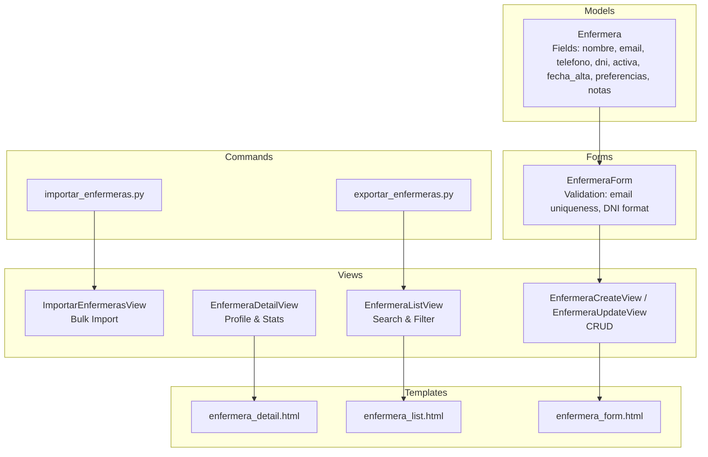

**Diagram sources**
- [models.py:30-57](file://turnos/models.py#L30-L57)
- [forms.py:14-73](file://turnos/forms.py#L14-L73)
- [views.py:814-951](file://turnos/views.py#L814-L951)
- [enfermera_list.html:1-216](file://turnos/templates/turnos/enfermera_list.html#L1-L216)
- [enfermera_detail.html:1-224](file://turnos/templates/turnos/enfermera_detail.html#L1-L224)
- [enfermera_form.html:1-218](file://turnos/templates/turnos/enfermera_form.html#L1-L218)
- [importar_enfermeras.py:1-167](file://turnos/management/commands/importar_enfermeras.py#L1-L167)
- [exportar_enfermeras.py:1-58](file://turnos/management/commands/exportar_enfermeras.py#L1-L58)

**Section sources**
- [models.py:30-57](file://turnos/models.py#L30-L57)
- [forms.py:14-73](file://turnos/forms.py#L14-L73)
- [views.py:814-951](file://turnos/views.py#L814-L951)
- [urls.py:52-60](file://turnos/urls.py#L52-L60)

## Core Components
- Enfermera model: Defines staff identity, contact, identification, status, metadata, preferences, and notes
- EnfermeraForm: Validates uniqueness of email and format of DNI; renders optional preferences
- Enfermera views: List, detail, create, update, delete; search and filter support
- Templates: List, detail, and form pages for staff management
- Management commands: Bulk import and export of staff records
- Mixins: SearchMixin, PaginationMixin, FilterMixin for reusable list behaviors

**Section sources**
- [models.py:30-57](file://turnos/models.py#L30-L57)
- [forms.py:14-73](file://turnos/forms.py#L14-L73)
- [views.py:814-951](file://turnos/views.py#L814-L951)
- [mixins.py:102-138](file://turnos/mixins.py#L102-L138)

## Architecture Overview
The staff profile system follows a layered MVC pattern:
- Presentation: Templates render lists, forms, and details
- Control: Views handle requests, apply mixins for search/filter/pagination, and delegate to forms/models
- Persistence: Models define fields and constraints; forms validate data; management commands operate on bulk datasets

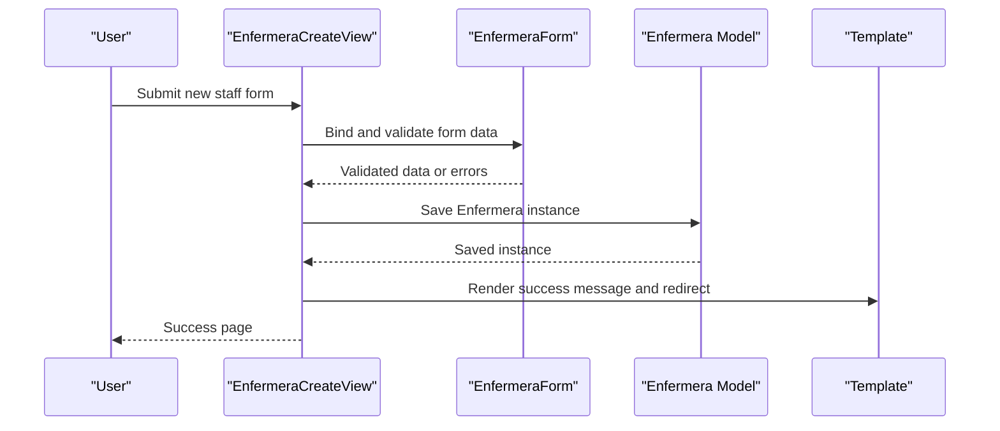

**Diagram sources**
- [views.py:878-920](file://turnos/views.py#L878-L920)
- [forms.py:14-73](file://turnos/forms.py#L14-L73)
- [models.py:30-57](file://turnos/models.py#L30-L57)
- [enfermera_form.html:1-218](file://turnos/templates/turnos/enfermera_form.html#L1-L218)

## Detailed Component Analysis

### Enfermera Model Structure and Validation Rules
The Enfermera model defines the staff record with the following fields and constraints:
- workspace: ForeignKey to Workspace (optional) enabling workspace isolation
- nombre: CharField, required
- email: EmailField, unique
- telefono: CharField, optional
- dni: CharField, unique, nullable
- activa: BooleanField, default True
- fecha_alta: DateField, auto-assigned on creation
- preferencias: JSONField, default empty dict, optional
- notas: TextField, optional

Validation rules enforced:
- Email uniqueness via model-level constraint
- DNI uniqueness via model-level constraint
- DNI format validation in form (8 digits + 1 letter)
- Optional preferencias JSON structure for soft constraints

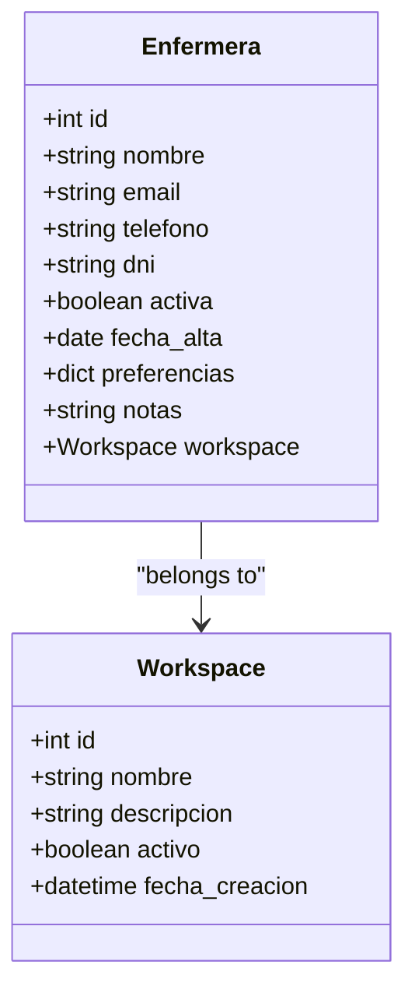

**Diagram sources**
- [models.py:12-28](file://turnos/models.py#L12-L28)
- [models.py:30-57](file://turnos/models.py#L30-L57)

**Section sources**
- [models.py:30-57](file://turnos/models.py#L30-L57)
- [forms.py:52-72](file://turnos/forms.py#L52-L72)

### Staff Registration Workflow
End-to-end process for adding a new staff member:
1. Navigate to the new staff form
2. Fill basic details (name, email, phone, DNI, notes)
3. Toggle active status
4. Optionally set preferences (preferred shifts and free days)
5. Submit form
6. Validation checks occur (email uniqueness, DNI format)
7. On success, redirect to staff list with success message

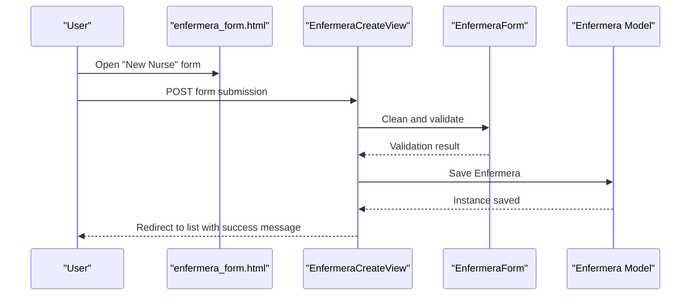

**Diagram sources**
- [enfermera_form.html:37-212](file://turnos/templates/turnos/enfermera_form.html#L37-L212)
- [views.py:878-920](file://turnos/views.py#L878-L920)
- [forms.py:14-73](file://turnos/forms.py#L14-L73)
- [models.py:30-57](file://turnos/models.py#L30-L57)

**Section sources**
- [urls.py:54](file://turnos/urls.py#L54)
- [views.py:878-920](file://turnos/views.py#L878-L920)
- [enfermera_form.html:37-131](file://turnos/templates/turnos/enfermera_form.html#L37-L131)

### Profile Editing Process
Editing an existing staff profile:
1. Access staff detail page
2. Click Edit button to open the form
3. Modify fields as needed (contact, DNI, notes, status)
4. Submit changes
5. Validation ensures email uniqueness and DNI format
6. Success message confirms update

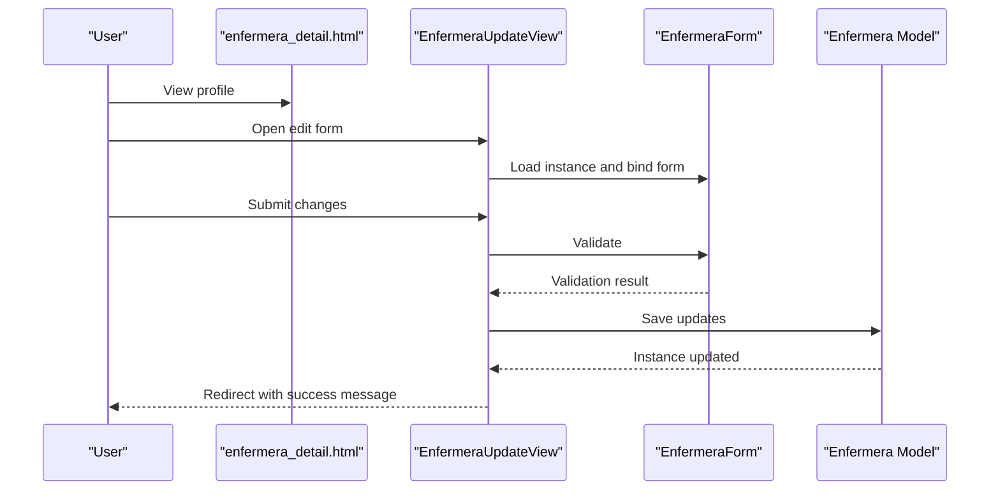

**Diagram sources**
- [enfermera_detail.html:37-44](file://turnos/templates/turnos/enfermera_detail.html#L37-L44)
- [views.py:920-938](file://turnos/views.py#L920-L938)
- [forms.py:14-73](file://turnos/forms.py#L14-L73)
- [models.py:30-57](file://turnos/models.py#L30-L57)

**Section sources**
- [urls.py:56](file://turnos/urls.py#L56)
- [views.py:920-938](file://turnos/views.py#L920-L938)
- [enfermera_detail.html:37-44](file://turnos/templates/turnos/enfermera_detail.html#L37-L44)

### Staff Status Management (Active/Inactive)
- Status is controlled via a boolean toggle on the form
- The list supports filtering by active/inactive status
- The detail page displays current status prominently

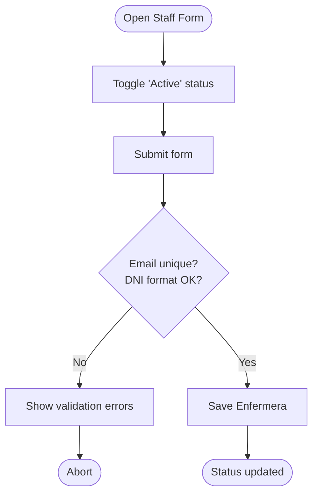

**Diagram sources**
- [enfermera_form.html:68-76](file://turnos/templates/turnos/enfermera_form.html#L68-L76)
- [views.py:878-920](file://turnos/views.py#L878-L920)
- [forms.py:52-72](file://turnos/forms.py#L52-L72)

**Section sources**
- [enfermera_list.html:38-47](file://turnos/templates/turnos/enfermera_list.html#L38-L47)
- [enfermera_detail.html:25-33](file://turnos/templates/turnos/enfermera_detail.html#L25-L33)

### Filtering and Search Functionality
- Search: By name, email, and DNI across the staff list
- Filters: Active/inactive status
- Sorting: Name, email, or hire date
- Pagination: Built-in pagination mixin

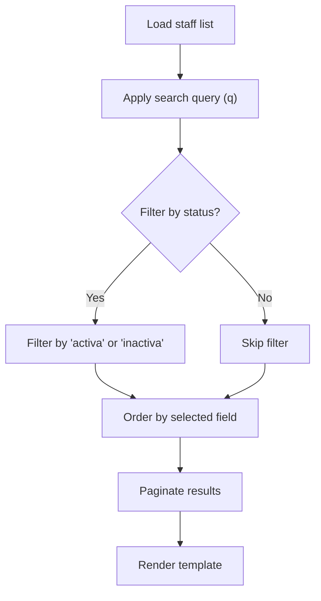

**Diagram sources**
- [mixins.py:102-138](file://turnos/mixins.py#L102-L138)
- [views.py:814-837](file://turnos/views.py#L814-L837)
- [enfermera_list.html:28-68](file://turnos/templates/turnos/enfermera_list.html#L28-L68)

**Section sources**
- [mixins.py:102-138](file://turnos/mixins.py#L102-L138)
- [views.py:814-837](file://turnos/views.py#L814-L837)
- [enfermera_list.html:28-68](file://turnos/templates/turnos/enfermera_list.html#L28-L68)

### Bulk Operations: Import and Export
- Import: CSV upload with flexible date formats and optional update mode
- Export: CSV download of all or active-only staff
- Both operations leverage management commands for robustness

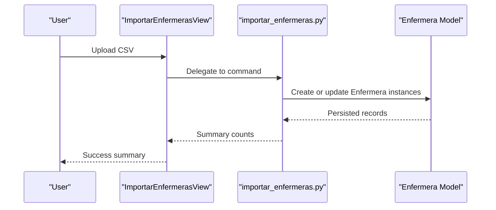

**Diagram sources**
- [views.py:940-951](file://turnos/views.py#L940-L951)
- [importar_enfermeras.py:29-167](file://turnos/management/commands/importar_enfermeras.py#L29-L167)
- [models.py:30-57](file://turnos/models.py#L30-L57)

**Section sources**
- [urls.py:58-59](file://turnos/urls.py#L58-L59)
- [importar_enfermeras.py:29-167](file://turnos/management/commands/importar_enfermeras.py#L29-L167)
- [exportar_enfermeras.py:23-58](file://turnos/management/commands/exportar_enfermeras.py#L23-L58)

### Examples and Lifecycle Management
- Onboarding: Create profile, set active status, optionally add preferences
- Profile updates: Edit contact info, DNI, notes, and status
- Deactivation: Set inactive status; appears filtered in list
- Bulk onboarding: Import CSV with headers for name, email, phone, DNI, hire date, active status, notes

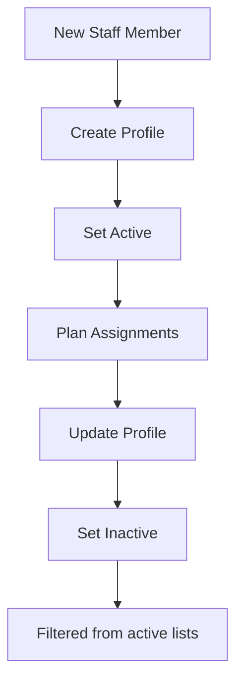

[No sources needed since this diagram shows conceptual workflow, not actual code structure]

**Section sources**
- [demo_enfermeras.json:143-197](file://turnos/fixtures/demo_enfermeras.json#L143-L197)
- [enfermera_list.html:38-47](file://turnos/templates/turnos/enfermera_list.html#L38-L47)

### Workspace Isolation and Permissions
- Workspace association: Enfermera belongs to a Workspace (optional) for data isolation
- Workspace selector: Users can switch workspaces via a selector that posts to a dedicated view
- Ownership and permissions: Admin integration currently excludes workspace field until migrations are applied; future admin lists will include workspace and owner filters

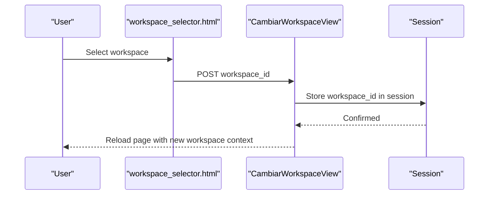

**Diagram sources**
- [workspace_selector.html:1-18](file://turnos/templates/includes/workspace_selector.html#L1-L18)
- [views.py:2084](file://turnos/views.py#L2084)
- [models.py:12-28](file://turnos/models.py#L12-L28)

**Section sources**
- [models.py:30-57](file://turnos/models.py#L30-L57)
- [workspace_selector.html:1-18](file://turnos/templates/includes/workspace_selector.html#L1-L18)
- [admin.py:278-287](file://turnos/admin.py#L278-L287)

## Dependency Analysis
Key dependencies and relationships:
- Enfermera depends on Workspace for isolation
- Forms depend on models for validation and rendering
- Views depend on forms and mixins for behavior
- Templates depend on views for context
- Commands depend on models for bulk operations

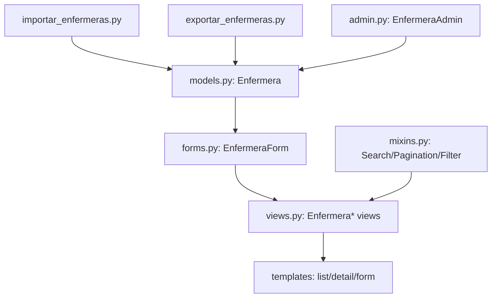

**Diagram sources**
- [models.py:30-57](file://turnos/models.py#L30-L57)
- [forms.py:14-73](file://turnos/forms.py#L14-L73)
- [views.py:814-951](file://turnos/views.py#L814-L951)
- [mixins.py:102-138](file://turnos/mixins.py#L102-L138)
- [admin.py:278-287](file://turnos/admin.py#L278-L287)
- [importar_enfermeras.py:1-167](file://turnos/management/commands/importar_enfermeras.py#L1-L167)
- [exportar_enfermeras.py:1-58](file://turnos/management/commands/exportar_enfermeras.py#L1-L58)

**Section sources**
- [models.py:30-57](file://turnos/models.py#L30-L57)
- [forms.py:14-73](file://turnos/forms.py#L14-L73)
- [views.py:814-951](file://turnos/views.py#L814-L951)
- [mixins.py:102-138](file://turnos/mixins.py#L102-L138)
- [admin.py:278-287](file://turnos/admin.py#L278-L287)
- [importar_enfermeras.py:1-167](file://turnos/management/commands/importar_enfermeras.py#L1-L167)
- [exportar_enfermeras.py:1-58](file://turnos/management/commands/exportar_enfermeras.py#L1-L58)

## Performance Considerations
- Use select_related and prefetch_related in list/detail views to minimize database queries
- Leverage pagination for large staff lists
- Keep preferencias JSON lightweight for efficient storage and retrieval
- Consider indexing frequently searched fields (email, dni) if growth warrants

[No sources needed since this section provides general guidance]

## Troubleshooting Guide
Common issues and resolutions:
- Duplicate email or DNI: Validation prevents duplicates; adjust input or contact administrator
- Invalid DNI format: Ensure 8 digits followed by 1 letter
- Import errors: Verify CSV headers and date formats; check command output for row-specific errors
- Workspace switching: Ensure user belongs to the selected workspace; verify session storage

**Section sources**
- [forms.py:52-72](file://turnos/forms.py#L52-L72)
- [importar_enfermeras.py:42-48](file://turnos/management/commands/importar_enfermeras.py#L42-L48)
- [importar_enfermeras.py:82-93](file://turnos/management/commands/importar_enfermeras.py#L82-L93)

## Conclusion
The staff profile management system provides a robust foundation for onboarding, maintaining, and operating with nurse records. It combines strong validation, flexible filtering, bulk import/export capabilities, and workspace isolation to support scalable team management. Following the documented workflows and best practices ensures reliable operations from registration to lifecycle transitions.