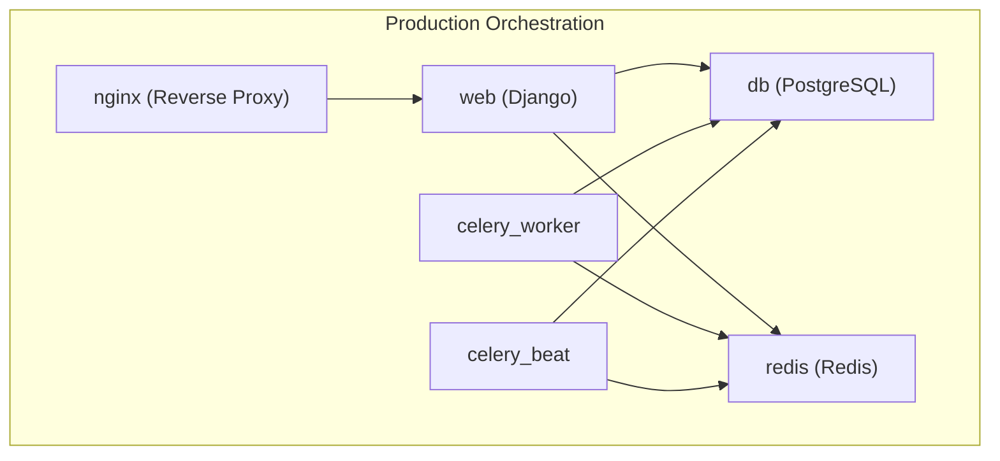
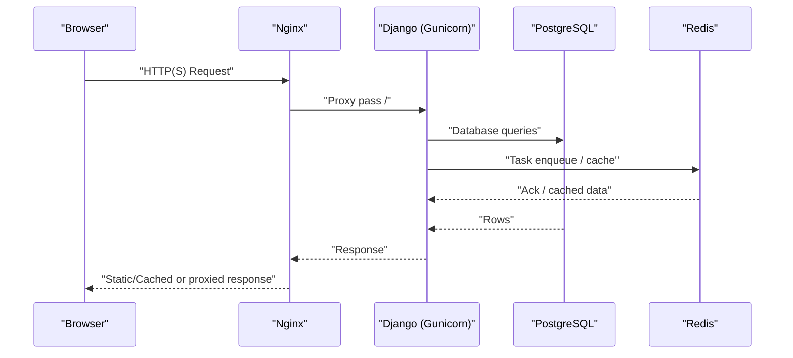
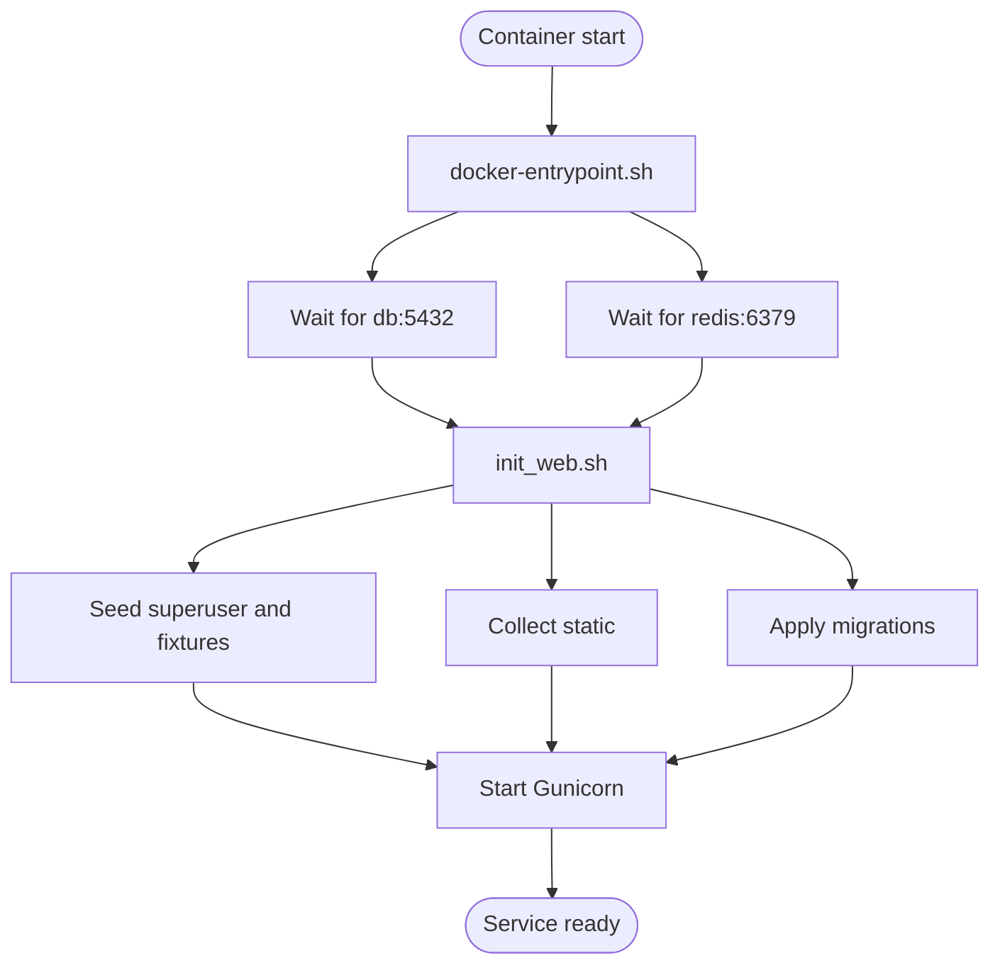

# Containerization and Environment Setup

<cite>
**Referenced Files in This Document**
- [Dockerfile](file://Dockerfile)
- [docker-compose.yml](file://docker-compose.yml)
- [docker-compose.dev.yml](file://docker-compose.dev.yml)
- [docker-entrypoint.sh](file://docker-entrypoint.sh)
- [init_web.sh](file://init_web.sh)
- [wait-for-it.sh](file://wait-for-it.sh)
- [start.sh](file://start.sh)
- [proyecto_turnos/settings.py](file://proyecto_turnos/settings.py)
- [requirements.txt](file://requirements.txt)
- [docker/nginx/nginx.conf](file://docker/nginx/nginx.conf)
- [docker/nginx/default.conf](file://docker/nginx/default.conf)
- [docker/postgres/init.sql](file://docker/postgres/init.sql)
</cite>

## Table of Contents
1. [Introduction](#introduction)
2. [Project Structure](#project-structure)
3. [Core Components](#core-components)
4. [Architecture Overview](#architecture-overview)
5. [Detailed Component Analysis](#detailed-component-analysis)
6. [Dependency Analysis](#dependency-analysis)
7. [Performance Considerations](#performance-considerations)
8. [Troubleshooting Guide](#troubleshooting-guide)
9. [Conclusion](#conclusion)
10. [Appendices](#appendices)

## Introduction
This document explains how to containerize and run the project using Docker and Podman, with a focus on production-grade orchestration via docker-compose and a streamlined development experience. It covers multi-stage build considerations, environment configuration, service dependencies, networking, volume mounting, entrypoints, initialization scripts, and operational best practices for both development and production.

## Project Structure
The containerization stack consists of:
- A single Dockerfile that builds the Django application image with Python 3.11 slim, system dependencies, and Gunicorn.
- A production docker-compose configuration orchestrating PostgreSQL, Redis, the Django web app, Celery worker and beat, and Nginx reverse proxy.
- A development docker-compose override that runs Django’s development server and mounts the source tree for rapid iteration.
- Entrypoint and initialization scripts ensuring readiness checks, migrations, static collection, and process startup.
- Nginx configuration optimized for static delivery, caching, compression, and security.
- PostgreSQL initialization SQL setting up extensions, functions, views, and database defaults.



**Diagram sources**
- [docker-compose.yml:44-127](file://docker-compose.yml#L44-L127)

**Section sources**
- [Dockerfile:1-87](file://Dockerfile#L1-L87)
- [docker-compose.yml:1-168](file://docker-compose.yml#L1-L168)
- [docker-compose.dev.yml:1-68](file://docker-compose.dev.yml#L1-L68)

## Core Components
- Application image built from a Python 3.11 slim base, installing OS-level dependencies for PostgreSQL, Cairo/Pango for PDF generation, and OR-Tools prerequisites. The image installs Python dependencies, sets up non-root user permissions, exposes port 8000, and defines a health check and entrypoint.
- Production compose defines services for db, redis, web, celery_worker, celery_beat, and nginx, with explicit network isolation and persistent volumes for data and static/media artifacts.
- Development compose overrides the web service to run Django’s development server with hot reload and mounts the project directory, plus adds a local mailhog service for email testing.
- Entrypoint and initialization scripts coordinate readiness checks against db and redis, apply migrations, collect static assets, optionally seed data, and start Gunicorn.

**Section sources**
- [Dockerfile:1-87](file://Dockerfile#L1-L87)
- [docker-compose.yml:44-127](file://docker-compose.yml#L44-L127)
- [docker-compose.dev.yml:4-51](file://docker-compose.dev.yml#L4-L51)
- [docker-entrypoint.sh:1-15](file://docker-entrypoint.sh#L1-L15)
- [init_web.sh:1-26](file://init_web.sh#L1-L26)

## Architecture Overview
The production architecture uses Nginx as a reverse proxy and static file server, delegating dynamic requests to the Django application served by Gunicorn. PostgreSQL persists relational data, while Redis provides a message broker for Celery tasks and caching. The development setup replaces the Django server with runserver and mounts the source tree for live editing.



**Diagram sources**
- [docker-compose.yml:129-151](file://docker-compose.yml#L129-L151)
- [docker/nginx/default.conf:150-185](file://docker/nginx/default.conf#L150-L185)
- [proyecto_turnos/settings.py:62-76](file://proyecto_turnos/settings.py#L62-L76)

## Detailed Component Analysis

### Dockerfile: Build, Dependencies, and Runtime
- Base image: Python 3.11 slim bookworm.
- Non-root user creation and ownership of application directories.
- System packages for PostgreSQL client, compilation tools, Cairo/Pango for PDFs, and OR-Tools.
- Python dependencies installed from requirements.txt, plus Gunicorn pinned to a specific version.
- Working directory set to /app, with logs, media, and staticfiles directories created and owned by the non-root user.
- Health check invokes Django’s check command.
- Entrypoint delegates to a shell script that waits for db and redis, then executes the provided command.
- Default CMD starts Gunicorn with workers, threads, and timeouts tuned for typical deployments.

Optimization highlights:
- Single-layer pip install reduces image size and rebuild time.
- Non-root execution improves security posture.
- Health checks enable container orchestration resiliency.

**Section sources**
- [Dockerfile:1-87](file://Dockerfile#L1-L87)
- [requirements.txt:1-67](file://requirements.txt#L1-L67)

### Entrypoint and Initialization Scripts
- docker-entrypoint.sh performs readiness checks against db:5432 and redis:6379 using wait-for-it.sh, then execs the provided command.
- init_web.sh applies migrations, collects static files, seeds a default superuser if missing, loads fixtures, and starts Gunicorn.

Operational benefits:
- Ensures dependent services are reachable before launching the app.
- Automates bootstrap steps for a fresh deployment.

**Section sources**
- [docker-entrypoint.sh:1-15](file://docker-entrypoint.sh#L1-L15)
- [init_web.sh:1-26](file://init_web.sh#L1-L26)
- [wait-for-it.sh:1-105](file://wait-for-it.sh#L1-L105)

### Production docker-compose: Services, Networking, and Volumes
- db: PostgreSQL 16 Alpine with init.sql mounted under /docker-entrypoint-initdb.d, health-checked via pg_isready.
- redis: Redis 7 Alpine with AOF persistence and optional password.
- web: Builds from Dockerfile, runs initialization via init_web.sh, mounts staticfiles, media, and logs volumes, exposes 8000, sets environment variables for Django and Celery, and depends on healthy db and redis.
- celery_worker and celery_beat: Build from Dockerfile, configured via env_file and environment variables, depend on db, redis, and web.
- nginx: Reverse proxy and static file server, mounts Nginx configs and static/media volumes, exposes 8080/8443, depends on web, health-checked via internal /health endpoint.

Volumes:
- Persistent storage for PostgreSQL, Redis, staticfiles, media, and logs.

Networks:
- A dedicated bridge network isolates services.

**Section sources**
- [docker-compose.yml:1-168](file://docker-compose.yml#L1-L168)
- [docker/postgres/init.sql:1-508](file://docker/postgres/init.sql#L1-L508)

### Development docker-compose: Local Iteration
- web: Runs Django runserver with DEBUG enabled, mounts the project directory for live reload, and depends on db and redis.
- db: Dedicated dev database with explicit credentials.
- redis: Local Redis for development.
- celery_worker: Runs with concurrency tuned for local CPUs, shares the mount.
- mailhog: Optional SMTP/HTTP UI for email testing.

Environment:
- Uses .env.dev for development-specific variables.

**Section sources**
- [docker-compose.dev.yml:1-68](file://docker-compose.dev.yml#L1-L68)

### Nginx Configuration: Performance, Security, and Static Delivery
Key aspects:
- Event model and worker tuning for high concurrency.
- Gzip compression and optional Brotli support.
- Static asset caching and immutable headers.
- Media directory protection and deny rules for sensitive files.
- Rate limiting zones for login, API, and general traffic.
- Health check endpoint proxying to Django.
- SSL/TLS configuration placeholders for production certificates and HSTS.

Security and performance:
- Strict transport security, XSS/CSRF protections, and referrer policy headers.
- Keepalive tuning and buffer sizing for throughput.

**Section sources**
- [docker/nginx/nginx.conf:1-95](file://docker/nginx/nginx.conf#L1-L95)
- [docker/nginx/default.conf:1-339](file://docker/nginx/default.conf#L1-L339)

### PostgreSQL Initialization: Extensions, Functions, Views, and Defaults
- Installs and comments useful PostgreSQL extensions (UUID, pg_trgm, unaccent, pgcrypto, etc.).
- Creates helper functions for timestamps, slug generation, fuzzy search, cleanup, and statistics.
- Defines helpful views for active nurses, configuration stats, and execution details.
- Sets database-level defaults for text search, timezone, similarity threshold, and maintenance parameters.
- Seeds default shift types if the related table exists.
- Adds auditing trigger framework and sets up read-only role example.
- Enables slow query logging and tracks DB version.

**Section sources**
- [docker/postgres/init.sql:1-508](file://docker/postgres/init.sql#L1-L508)

### Environment Configuration and Secrets Management
- Django reads environment variables via python-dotenv and dj-database-url. Critical variables include SECRET_KEY, DEBUG, ALLOWED_HOSTS, DATABASE_URL, EMAIL_BACKEND, SITE_URL, and Celery settings.
- Compose files inject environment variables via env_file and inline environment blocks. Production compose passes DATABASE_URL and REDIS_URL derived from service names and credentials.
- Development compose uses .env.dev for local overrides.

Best practices:
- Store secrets outside the image (env files, external secret stores).
- Use DATABASE_URL for seamless Postgres configuration.
- Set ALLOWED_HOSTS appropriately per environment.

**Section sources**
- [proyecto_turnos/settings.py:1-160](file://proyecto_turnos/settings.py#L1-L160)
- [docker-compose.yml:59-66](file://docker-compose.yml#L59-L66)
- [docker-compose.dev.yml:13-18](file://docker-compose.dev.yml#L13-L18)

### Multi-stage Builds and Optimization
Current Dockerfile is a single-stage build. To reduce image size and attack surface:
- Split into builder stage installing build-essential and compiling dependencies, then copy only necessary artifacts to a minimal runtime stage.
- Pin dependency versions and use --no-cache-dir and pip install flags to minimize layers.
- Consolidate RUN commands to reduce intermediate layers.

Note: The existing image already installs Python dependencies efficiently and uses a slim base. Multi-stage build would further shrink size and improve reproducibility.

**Section sources**
- [Dockerfile:49-66](file://Dockerfile#L49-L66)

### Entrypoint and Startup Flow


**Diagram sources**
- [docker-entrypoint.sh:1-15](file://docker-entrypoint.sh#L1-L15)
- [init_web.sh:1-26](file://init_web.sh#L1-L26)

## Dependency Analysis
Runtime dependencies and their roles:
- Django application depends on PostgreSQL for persistence and Redis for task queue/cache.
- Celery worker and beat depend on Redis and database connectivity.
- Nginx depends on the web service for proxying and serves static/media from mounted volumes.
- Entrypoint scripts coordinate readiness checks across db and redis.

```mermaid
graph LR
DB["PostgreSQL"] <- --> Web["Django App"]
Redis["Redis"] <- --> Web
Redis <- --> CeleryWorker["Celery Worker"]
Redis <- --> CeleryBeat["Celery Beat"]
Web <- --> Nginx["Nginx"]
Nginx --> Clients["Clients"]
```

**Diagram sources**
- [docker-compose.yml:44-127](file://docker-compose.yml#L44-L127)

**Section sources**
- [docker-compose.yml:44-127](file://docker-compose.yml#L44-L127)

## Performance Considerations
- Gunicorn workers and threads: Adjust based on CPU cores and workload characteristics.
- Nginx worker connections and epoll usage: Tune for concurrent clients.
- Static delivery: Immutable caching headers and gzip_static for optimal bandwidth.
- Database tuning: Extensions and indexes in init.sql improve search performance; maintain statistics regularly.
- Health checks: Enable periodic checks to detect unhealthy containers early.

[No sources needed since this section provides general guidance]

## Troubleshooting Guide
Common issues and resolutions:
- Django not starting due to unmet dependencies:
  - Verify Python dependencies were installed during build and that the image runs as non-root.
  - Confirm health checks pass and logs show migration and static collection completion.
- Database connection failures:
  - Ensure db service is healthy and init.sql executed successfully.
  - Confirm DATABASE_URL and credentials match compose environment.
- Redis connectivity problems:
  - Validate REDIS_URL and password; confirm health check succeeds.
- Nginx returning errors:
  - Check static/media volume mounts and permissions.
  - Review Nginx logs and health check endpoint.
- Celery tasks not processed:
  - Confirm Redis availability and broker URL.
  - Inspect worker/beat logs for exceptions.

Operational commands:
- Production with Podman: Use start.sh to orchestrate services and verify logs and container status.

**Section sources**
- [docker-compose.yml:129-151](file://docker-compose.yml#L129-L151)
- [docker-entrypoint.sh:1-15](file://docker-entrypoint.sh#L1-L15)
- [init_web.sh:1-26](file://init_web.sh#L1-L26)
- [start.sh:213-255](file://start.sh#L213-L255)

## Conclusion
The project provides a robust, production-ready containerization setup with clear separation of concerns across services, strong security headers, and optimized static delivery. The development configuration accelerates iteration with hot reload and local mail testing. Adhering to environment-driven configuration and readiness checks ensures reliable deployments across environments.

[No sources needed since this section summarizes without analyzing specific files]

## Appendices

### Environment Variable Reference
- Django settings:
  - SECRET_KEY, DEBUG, ALLOWED_HOSTS, DATABASE_URL, EMAIL_BACKEND, SITE_URL, MAINTENANCE_MODE.
- Celery:
  - CELERY_BROKER_URL, CELERY_RESULT_BACKEND, serialization and timezone settings.
- Application services:
  - POSTGRES_DB, POSTGRES_USER, POSTGRES_PASSWORD for db.
  - REDIS_PASSWORD for redis.
  - DJANGO_SETTINGS_MODULE, ALLOWED_HOSTS, and port exposure for web.

**Section sources**
- [proyecto_turnos/settings.py:10-160](file://proyecto_turnos/settings.py#L10-L160)
- [docker-compose.yml:59-66](file://docker-compose.yml#L59-L66)
- [docker-compose.dev.yml:13-18](file://docker-compose.dev.yml#L13-L18)

### Development vs Production Differences
- Web service:
  - Production: Gunicorn behind Nginx, migrations and static collection on startup.
  - Development: Django runserver with DEBUG enabled and mounted source code.
- Databases:
  - Production: PostgreSQL with init.sql and persistent volumes.
  - Development: Separate dev database with explicit credentials.
- Task processing:
  - Both environments use Redis; development worker concurrency is reduced.
- Additional services:
  - Development includes MailHog for email testing.

**Section sources**
- [docker-compose.yml:44-127](file://docker-compose.yml#L44-L127)
- [docker-compose.dev.yml:4-51](file://docker-compose.dev.yml#L4-L51)