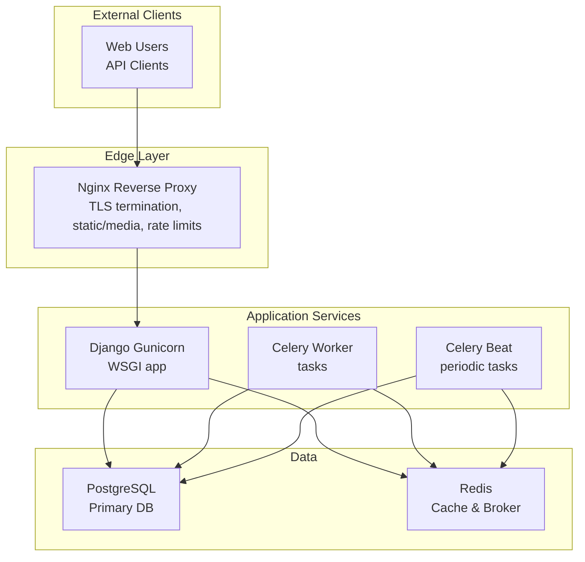
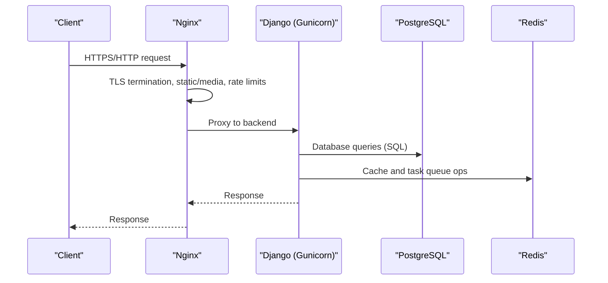
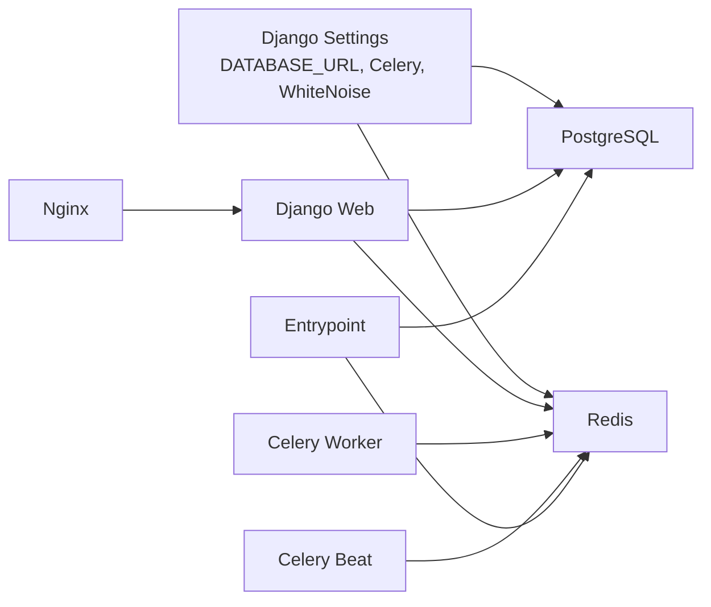
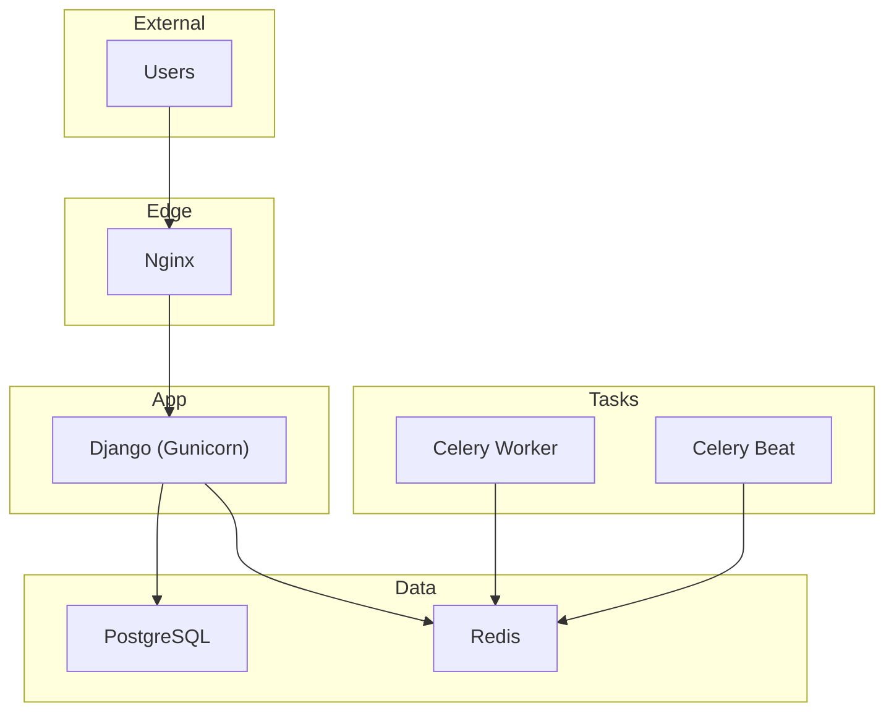

# Deployment and Operations

<cite>
**Referenced Files in This Document**
- [docker-compose.yml](file://docker-compose.yml)
- [Dockerfile](file://Dockerfile)
- [proyecto_turnos/settings.py](file://proyecto_turnos/settings.py)
- [proyecto_turnos/wsgi.py](file://proyecto_turnos/wsgi.py)
- [proyecto_turnos/asgi.py](file://proyecto_turnos/asgi.py)
- [docker/nginx/nginx.conf](file://docker/nginx/nginx.conf)
- [docker/nginx/default.conf](file://docker/nginx/default.conf)
- [docker/postgres/init.sql](file://docker/postgres/init.sql)
- [docker-entrypoint.sh](file://docker-entrypoint.sh)
- [init_web.sh](file://init_web.sh)
- [requirements.txt](file://requirements.txt)
- [manage.py](file://manage.py)
- [restart_celery.sh](file://restart_celery.sh)
- [start.sh](file://start.sh)
- [stop.sh](file://stop.sh)
</cite>

## Table of Contents
1. [Introduction](#introduction)
2. [Project Structure](#project-structure)
3. [Core Components](#core-components)
4. [Architecture Overview](#architecture-overview)
5. [Detailed Component Analysis](#detailed-component-analysis)
6. [Dependency Analysis](#dependency-analysis)
7. [Performance Considerations](#performance-considerations)
8. [Troubleshooting Guide](#troubleshooting-guide)
9. [Conclusion](#conclusion)
10. [Appendices](#appendices)

## Introduction
This document provides comprehensive deployment and operations guidance for the Nursing Shift Scheduler application. It covers production setup with containerization using Podman (with Docker compatibility), environment configuration, service orchestration, reverse proxy and WSGI server configuration, database deployment and maintenance, monitoring and logging, security hardening, performance tuning, operational procedures for updates and maintenance windows, disaster recovery, and scalability considerations.

## Project Structure
The deployment stack consists of:
- Django application containerized via a multi-stage-like Dockerfile
- Nginx reverse proxy serving static/media and terminating TLS
- PostgreSQL database with initialization scripts
- Redis for caching and Celery broker/result backend
- Celery workers and periodic tasks (Beat)
- Optional development mode using SQLite and runserver

**Diagram sources**
- [docker-compose.yml:1-168](file://docker-compose.yml#L1-L168)
- [Dockerfile:1-87](file://Dockerfile#L1-L87)
- [docker/nginx/default.conf:1-339](file://docker/nginx/default.conf#L1-L339)
- [docker/postgres/init.sql:1-508](file://docker/postgres/init.sql#L1-L508)

**Section sources**
- [docker-compose.yml:1-168](file://docker-compose.yml#L1-L168)
- [Dockerfile:1-87](file://Dockerfile#L1-L87)

## Core Components
- Container Orchestration: Podman Compose (with Docker Compose compatibility) orchestrates containers, volumes, networking, and environment variables.
- Application: Django with Gunicorn WSGI server configured in the Dockerfile and managed by init scripts.
- Reverse Proxy: Nginx handles TLS, static/media delivery, rate limiting, and forwards requests to the Django backend.
- Database: PostgreSQL with extensions, functions, views, and maintenance routines initialized via SQL.
- Task Queue: Redis-backed Celery for background tasks and scheduled jobs.
- Entrypoints: Custom entrypoint waits for dependent services before launching the main process.

**Section sources**
- [docker-compose.yml:1-168](file://docker-compose.yml#L1-L168)
- [Dockerfile:1-87](file://Dockerfile#L1-L87)
- [docker/nginx/default.conf:1-339](file://docker/nginx/default.conf#L1-L339)
- [docker/postgres/init.sql:1-508](file://docker/postgres/init.sql#L1-L508)
- [docker-entrypoint.sh:1-15](file://docker-entrypoint.sh#L1-L15)
- [init_web.sh:1-26](file://init_web.sh#L1-L26)

## Architecture Overview
Production deployment topology:
- Edge: Nginx container serves HTTP/HTTPS, static assets, and proxies to Django.
- Application: Django container runs Gunicorn; manages migrations, static collection, and starts the WSGI app.
- Background: Celery worker and beat containers consume tasks from Redis and schedule periodic jobs.
- Data: PostgreSQL persists application data; Redis caches and brokers tasks.

**Diagram sources**
- [docker-compose.yml:129-151](file://docker-compose.yml#L129-L151)
- [docker/nginx/default.conf:150-185](file://docker/nginx/default.conf#L150-L185)
- [Dockerfile:82-86](file://Dockerfile#L82-L86)

## Detailed Component Analysis

### Containerization and Multi-stage Build
- Base image: Python slim bookworm with non-root user for security.
- System dependencies: PostgreSQL client, compilation tools, Cairo/Pango for PDF reports, OR-Tools support.
- Application packaging: Copies Django code, installs Python dependencies, adds Gunicorn, sets working directory, and creates non-root user directories.
- Entrypoint and health checks: Custom entrypoint waits for DB and Redis; container health checks use Django’s built-in check and Nginx health endpoint.
- Default command: Gunicorn with tuned workers, threads, and timeouts.

Operational notes:
- Use podman-compose for production; docker-compose is compatible.
- Environment variables are injected via .env and compose env_file/environment blocks.

**Section sources**
- [Dockerfile:1-87](file://Dockerfile#L1-L87)
- [docker-entrypoint.sh:1-15](file://docker-entrypoint.sh#L1-L15)
- [docker-compose.yml:44-80](file://docker-compose.yml#L44-L80)

### Environment Configuration and Secrets
Key environment variables:
- Django: SECRET_KEY, DEBUG, ALLOWED_HOSTS, SITE_URL, MAINTENANCE_MODE, EMAIL_BACKEND.
- Database: DATABASE_URL parsed by dj-database-url; defaults to SQLite when absent.
- Celery: CELERY_BROKER_URL, CELERY_RESULT_BACKEND, serialization, timezone, task limits.
- Redis: REDIS_PASSWORD used for requirepass and connection URLs.
- Nginx: Ports mapped externally (8080:80, 8443:443) and static/media volumes mounted.

Security and hardening:
- Non-root user for application and static/media/logs directories.
- Whitenoise for static files in production.
- Strict security headers in Nginx (X-Frame-Options, X-Content-Type-Options, XSS protection, HSTS).
- Rate limiting zones for login, API, and general traffic.
- TLS 1.2/1.3 ciphers and stapled OCSP.

**Section sources**
- [proyecto_turnos/settings.py:10-130](file://proyecto_turnos/settings.py#L10-L130)
- [docker-compose.yml:12-66](file://docker-compose.yml#L12-L66)
- [docker/nginx/default.conf:260-271](file://docker/nginx/default.conf#L260-L271)

### Service Orchestration with Podman Compose
Compose services:
- db: PostgreSQL 16 with init SQL, health checks, persistent volumes.
- redis: Redis 7 with AOF persistence and requirepass.
- web: Django with Gunicorn, migrations, static collection, superuser creation, and startup script.
- celery_worker: Celery worker with concurrency.
- celery_beat: Celery Beat scheduler backed by database.
- nginx: Nginx with custom configs for static/media, rate limits, and TLS.

Networks and volumes:
- Bridge network isolates services.
- Named volumes for PostgreSQL, Redis, staticfiles, media, logs.

Health checks:
- Django app, Redis, and Nginx health endpoints ensure readiness.

**Section sources**
- [docker-compose.yml:1-168](file://docker-compose.yml#L1-L168)

### Reverse Proxy and Static Assets (Nginx)
Nginx configuration highlights:
- Global performance: worker connections, epoll, keepalive, gzip/brotli toggles, open file cache.
- Security headers: X-Frame-Options, X-Content-Type-Options, XSS-protection, Referrer-Policy, Permissions-Policy.
- Static assets: long-lived caching, immutable for JS/CSS, font CORS, gzip_static.
- Media: cache-control, deny dangerous file types.
- Rate limiting: zones for login, API, general traffic; connection limits.
- Health check: internal endpoint proxied to Django.
- TLS: Let’s Encrypt challenge, certificate paths, strong protocols/ciphers, HSTS, OCSP stapling.
- Backend proxy: preserves X-Forwarded-* headers, timeouts, buffering, WebSocket upgrade.

**Section sources**
- [docker/nginx/nginx.conf:1-95](file://docker/nginx/nginx.conf#L1-L95)
- [docker/nginx/default.conf:1-339](file://docker/nginx/default.conf#L1-L339)

### Gunicorn WSGI Server Setup
- Production WSGI: Gunicorn launched by Dockerfile CMD and init_web.sh with:
  - Workers and threads tuned for CPU cores.
  - Timeout and logging to stdout/stderr.
  - Static files served via WhiteNoise in WSGI wrapper.

Operational tips:
- Adjust workers and threads based on CPU and memory resources.
- Monitor access/error logs via container logs.

**Section sources**
- [Dockerfile:82-86](file://Dockerfile#L82-L86)
- [init_web.sh:24-26](file://init_web.sh#L24-L26)
- [proyecto_turnos/wsgi.py:1-28](file://proyecto_turnos/wsgi.py#L1-L28)

### Database Deployment and Initialization
PostgreSQL deployment:
- Image: postgres:16-alpine.
- Persistence: named volume for data.
- Init scripts: extensions (UUID, pg_trgm, unaccent, pgcrypto), text search configuration, utility functions, views, indices, audit triggers, maintenance functions, role setup, seed data, logging thresholds, and version table.

Maintenance and monitoring:
- Functions for cleanup, statistics, reindexing, and vacuum tuning.
- Extensions and indices improve search and performance.
- Logging thresholds enabled for slow statements.

**Section sources**
- [docker-compose.yml:4-25](file://docker-compose.yml#L4-L25)
- [docker/postgres/init.sql:1-508](file://docker/postgres/init.sql#L1-L508)

### Celery and Task Queue
- Redis as broker and result backend.
- Worker: concurrency set; autoscaling supported via restart script.
- Beat: DatabaseScheduler for periodic tasks.
- Environment variables passed via compose and .env.

Operational tips:
- Use restart_celery.sh to cleanly restart workers and beat with cache clearing.
- Scale workers horizontally by increasing concurrency or running multiple replicas.

**Section sources**
- [docker-compose.yml:81-127](file://docker-compose.yml#L81-L127)
- [restart_celery.sh:1-45](file://restart_celery.sh#L1-L45)
- [proyecto_turnos/settings.py:134-160](file://proyecto_turnos/settings.py#L134-L160)

### Operational Scripts
- start.sh: Production mode with podman-compose; development mode with SQLite, runserver, and local Redis/Celery.
- stop.sh: Stops development runserver and Celery; stops podman-compose stack.
- init_web.sh: Applies migrations, collects static, seeds admin user, loads fixtures, then starts Gunicorn.
- docker-entrypoint.sh: Waits for DB and Redis before executing the main command.

**Section sources**
- [start.sh:1-256](file://start.sh#L1-L256)
- [stop.sh:1-116](file://stop.sh#L1-L116)
- [init_web.sh:1-26](file://init_web.sh#L1-L26)
- [docker-entrypoint.sh:1-15](file://docker-entrypoint.sh#L1-L15)

## Dependency Analysis
Runtime dependencies and relationships:
- Django depends on PostgreSQL (via DATABASE_URL or SQLite fallback) and Redis (for cache and Celery).
- Nginx depends on Django being healthy and serving the health endpoint.
- Celery workers and beat depend on Redis availability.
- Entrypoint ensures DB and Redis readiness before starting the main process.

**Diagram sources**
- [proyecto_turnos/settings.py:62-160](file://proyecto_turnos/settings.py#L62-L160)
- [docker-compose.yml:44-127](file://docker-compose.yml#L44-L127)
- [docker-entrypoint.sh:4-11](file://docker-entrypoint.sh#L4-L11)

**Section sources**
- [proyecto_turnos/settings.py:62-160](file://proyecto_turnos/settings.py#L62-L160)
- [docker-compose.yml:44-127](file://docker-compose.yml#L44-L127)

## Performance Considerations
- Gunicorn: Tune workers and threads according to CPU cores and memory; adjust timeout for long-running tasks.
- Nginx: Enable gzip/brotli, tune worker connections and keepalive; leverage static caching and immutable headers.
- PostgreSQL: Use provided extensions and indices; monitor slow queries via logging thresholds; periodically run maintenance functions.
- Redis: Enable AOF and requirepass; monitor memory usage and eviction policies.
- Celery: Autoscale workers; set task soft/hard limits; monitor result backend retries.

[No sources needed since this section provides general guidance]

## Troubleshooting Guide
Common issues and resolutions:
- Django health failures: Check container logs for migration errors or missing environment variables.
- Nginx 502/504: Verify Django is healthy and reachable; confirm health endpoint responds.
- Database connectivity: Ensure DB is healthy and credentials match compose environment.
- Redis connectivity: Confirm Redis is healthy and password matches.
- Static/media not served: Verify volume mounts and Nginx alias paths.
- Celery tasks not processed: Check Redis connectivity and worker logs; restart with restart_celery.sh.

Operational commands:
- View logs: podman-compose logs -f
- Restart services: podman-compose restart
- Django shell: podman-compose exec web python manage.py shell

**Section sources**
- [docker-compose.yml:67-79](file://docker-compose.yml#L67-L79)
- [docker/nginx/default.conf:89-98](file://docker/nginx/default.conf#L89-L98)
- [restart_celery.sh:1-45](file://restart_celery.sh#L1-L45)

## Conclusion
The deployment leverages modern containerization with Podman, a robust reverse proxy with Nginx, a production-grade Django application with Gunicorn, and reliable data services with PostgreSQL and Redis. The provided scripts and configurations enable repeatable deployments, secure operations, and scalable architectures suitable for production environments.

[No sources needed since this section summarizes without analyzing specific files]

## Appendices

### A. Production Deployment Topology

**Diagram sources**
- [docker-compose.yml:1-168](file://docker-compose.yml#L1-L168)
- [docker/nginx/default.conf:1-339](file://docker/nginx/default.conf#L1-L339)

### B. Environment Variable Reference
- Django: SECRET_KEY, DEBUG, ALLOWED_HOSTS, SITE_URL, MAINTENANCE_MODE, EMAIL_BACKEND, DATABASE_URL, CELERY_BROKER_URL, CELERY_RESULT_BACKEND.
- Database: POSTGRES_DB, POSTGRES_USER, POSTGRES_PASSWORD.
- Redis: REDIS_PASSWORD.
- Nginx: Port mappings and static/media paths.

**Section sources**
- [proyecto_turnos/settings.py:10-130](file://proyecto_turnos/settings.py#L10-L130)
- [docker-compose.yml:12-66](file://docker-compose.yml#L12-L66)

### C. Backup and Recovery Procedures
- PostgreSQL backups: Use logical backups (e.g., pg_dump) and filesystem snapshots; automate retention and verification.
- Restore procedure: Stop services, restore data, apply migrations, restart services.
- Redis persistence: Leverage AOF; consider periodic snapshots for durability.

[No sources needed since this section provides general guidance]

### D. Monitoring and Log Management
- Application logs: Gunicorn access/error logs to stdout/stderr; configure centralized logging in production.
- Nginx logs: Access and error logs collected in the container; forward to log aggregation systems.
- Database logs: Enable slow query logging and review performance metrics.
- Health checks: Use compose health checks and external probes.

**Section sources**
- [Dockerfile:78-80](file://Dockerfile#L78-L80)
- [docker-compose.yml:20-24](file://docker-compose.yml#L20-L24)
- [docker/nginx/default.conf:16-27](file://docker/nginx/default.conf#L16-L27)
- [docker/postgres/init.sql:444-448](file://docker/postgres/init.sql#L444-L448)

### E. Security Hardening Checklist
- Rotate SECRET_KEY and database passwords regularly.
- Enforce HTTPS with strong TLS and HSTS.
- Apply strict ALLOWED_HOSTS and CSRF protections.
- Limit exposed ports; restrict SSH and DB access.
- Use non-root containers and least-privilege users.
- Audit database changes with provided audit triggers.

**Section sources**
- [proyecto_turnos/settings.py:10-130](file://proyecto_turnos/settings.py#L10-L130)
- [docker/nginx/default.conf:244-271](file://docker/nginx/default.conf#L244-L271)
- [docker/postgres/init.sql:281-347](file://docker/postgres/init.sql#L281-L347)

### F. Scaling and High Availability
- Horizontal scaling: Run multiple Django instances behind Nginx; ensure shared Redis and PostgreSQL.
- Load balancing: Use Nginx upstreams or external LB; sticky sessions if required.
- Database HA: Consider PostgreSQL replication or managed services.
- Redis HA: Use Redis Sentinel or managed Redis with failover.
- Background tasks: Scale Celery workers; monitor queues and backlogs.

[No sources needed since this section provides general guidance]