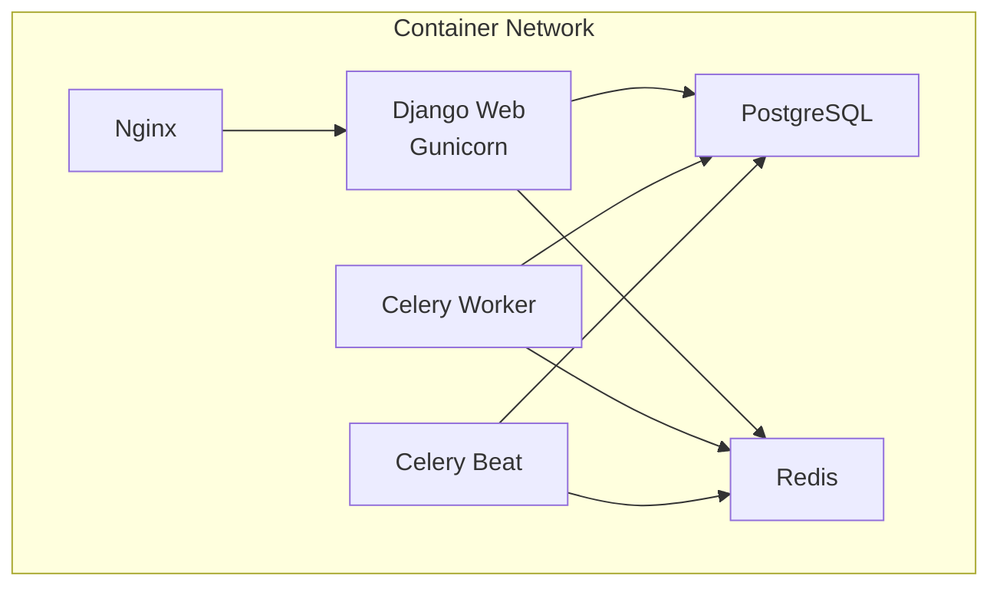
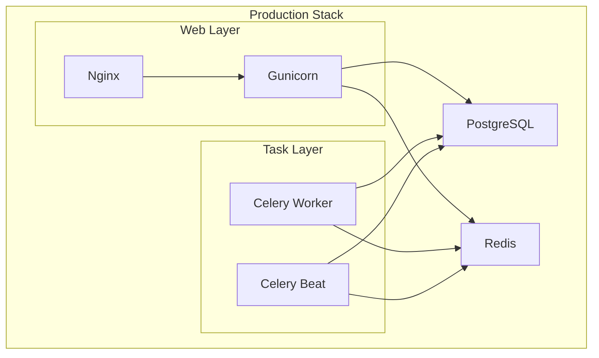

# Maintenance and Operational Procedures

<cite>
**Referenced Files in This Document**
- [README.md](file://README.md)
- [proyecto_turnos/settings.py](file://proyecto_turnos/settings.py)
- [proyecto_turnos/celery.py](file://proyecto_turnos/celery.py)
- [docker-compose.yml](file://docker-compose.yml)
- [docker/nginx/nginx.conf](file://docker/nginx/nginx.conf)
- [docker/postgres/init.sql](file://docker/postgres/init.sql)
- [init_web.sh](file://init_web.sh)
- [start.sh](file://start.sh)
- [stop.sh](file://stop.sh)
- [restart_celery.sh](file://restart_celery.sh)
- [wait-for-it.sh](file://wait-for-it.sh)
- [manage.py](file://manage.py)
- [turnos/management/commands/limpiar_base_datos.py](file://turnos/management/commands/limpiar_base_datos.py)
- [turnos/management/commands/estadisticas_sistema.py](file://turnos/management/commands/estadisticas_sistema.py)
</cite>

## Table of Contents
1. [Introduction](#introduction)
2. [Project Structure](#project-structure)
3. [Core Components](#core-components)
4. [Architecture Overview](#architecture-overview)
5. [Daily Operations](#daily-operations)
6. [Weekly Operations](#weekly-operations)
7. [Monthly Operations](#monthly-operations)
8. [Monitoring and Health Checks](#monitoring-and-health-checks)
9. [Backup and Recovery](#backup-and-recovery)
10. [Troubleshooting Guide](#troubleshooting-guide)
11. [Update and Rollback Procedures](#update-and-rollback-procedures)
12. [Capacity Planning and Scaling](#capacity-planning-and-scaling)
13. [Incident Response Protocols](#incident-response-protocols)
14. [Conclusion](#conclusion)

## Introduction
This document defines operational procedures for the Nursing Roster Scheduler, covering routine maintenance, monitoring, backup and recovery, troubleshooting, updates, capacity planning, and incident response. It leverages the production stack (Docker/Podman, Django, Celery/Redis, PostgreSQL, Nginx) and operational scripts included in the repository.

## Project Structure
The system runs as a containerized Django application with Celery workers and a scheduler, PostgreSQL for persistence, and Nginx as reverse proxy. Operational scripts automate startup, shutdown, and Celery lifecycle management.

**Diagram sources**
- [docker-compose.yml:44-127](file://docker-compose.yml#L44-L127)
- [docker/nginx/nginx.conf:1-95](file://docker/nginx/nginx.conf#L1-L95)
- [docker/postgres/init.sql:1-508](file://docker/postgres/init.sql#L1-L508)

**Section sources**
- [docker-compose.yml:1-168](file://docker-compose.yml#L1-L168)
- [README.md:45-56](file://README.md#L45-L56)

## Core Components
- Django application with Gunicorn serving static assets and requests.
- Celery workers and scheduler using Redis as broker/backend.
- PostgreSQL with preconfigured extensions, functions, views, and maintenance routines.
- Nginx with optimized logging and security headers.
- Operational scripts for lifecycle management and health checks.

**Section sources**
- [proyecto_turnos/settings.py:131-160](file://proyecto_turnos/settings.py#L131-L160)
- [proyecto_turnos/celery.py:1-14](file://proyecto_turnos/celery.py#L1-L14)
- [docker-compose.yml:44-127](file://docker-compose.yml#L44-L127)
- [docker/nginx/nginx.conf:15-95](file://docker/nginx/nginx.conf#L15-L95)
- [docker/postgres/init.sql:1-508](file://docker/postgres/init.sql#L1-L508)

## Architecture Overview
The production architecture relies on Docker/Podman orchestration with explicit health checks and persistent volumes for logs, static/media, and database data.

**Diagram sources**
- [docker-compose.yml:44-127](file://docker-compose.yml#L44-L127)
- [init_web.sh:24-26](file://init_web.sh#L24-L26)

## Daily Operations
- Verify service health via Docker health checks.
- Monitor Celery task queues and worker concurrency.
- Review application logs and Nginx access/error logs.
- Run database cleanup for old successful executions if needed.

Recommended steps:
- Confirm health checks pass for web, database, and Redis.
- Tail logs for web, Celery worker, and Celery beat.
- Optionally run the statistics command to check system health.
- If necessary, clean old successful executions using the database cleanup command.

**Section sources**
- [docker-compose.yml:74-79](file://docker-compose.yml#L74-L79)
- [docker-compose.yml:20-24](file://docker-compose.yml#L20-L24)
- [docker-compose.yml:38-42](file://docker-compose.yml#L38-L42)
- [turnos/management/commands/estadisticas_sistema.py:13-98](file://turnos/management/commands/estadisticas_sistema.py#L13-L98)
- [turnos/management/commands/limpiar_base_datos.py:70-94](file://turnos/management/commands/limpiar_base_datos.py#L70-L94)

## Weekly Operations
- Reindex critical tables and update table statistics to maintain query performance.
- Rotate and archive Nginx logs.
- Review long-running query logs configured in PostgreSQL.
- Validate fixture data and initial seeds.

Operational actions:
- Invoke database maintenance functions for reindexing and statistics updates.
- Archive rotated logs from the mounted logs volume.
- Confirm PostgreSQL slow query logging is capturing meaningful statements.

**Section sources**
- [docker/postgres/init.sql:352-381](file://docker/postgres/init.sql#L352-L381)
- [docker/nginx/nginx.conf:20-27](file://docker/nginx/nginx.conf#L20-L27)
- [docker/postgres/init.sql:444-447](file://docker/postgres/init.sql#L444-L447)

## Monthly Operations
- Perform full database vacuum and analyze cycles.
- Rotate and retain backups per retention policy.
- Review and prune unused Docker images and volumes.
- Audit roles and permissions if applicable.

Operational actions:
- Use PostgreSQL maintenance functions to update statistics and reindex.
- Back up persistent volumes and database dumps according to policy.
- Clean up Docker artifacts and review storage usage.

**Section sources**
- [docker/postgres/init.sql:367-381](file://docker/postgres/init.sql#L367-L381)
- [docker-compose.yml:153-163](file://docker-compose.yml#L153-L163)

## Monitoring and Health Checks
Health checks and metrics:
- Web service health check runs Django’s built-in check command.
- Database health check uses pg_isready.
- Redis health check uses redis-cli.
- Nginx health check probes internal endpoint.
- Celery worker and beat are managed via process supervision in containers.

Metrics and logging:
- Nginx access/error logs with structured log_format.
- PostgreSQL configured to log duration and mod statements.
- Celery task limits and extended results enabled for observability.

**Section sources**
- [docker-compose.yml:74-79](file://docker-compose.yml#L74-L79)
- [docker-compose.yml:20-24](file://docker-compose.yml#L20-L24)
- [docker-compose.yml:38-42](file://docker-compose.yml#L38-L42)
- [docker-compose.yml:147-151](file://docker-compose.yml#L147-L151)
- [docker/nginx/nginx.conf:20-27](file://docker/nginx/nginx.conf#L20-L27)
- [docker/postgres/init.sql:444-447](file://docker/postgres/init.sql#L444-L447)
- [proyecto_turnos/settings.py:148-155](file://proyecto_turnos/settings.py#L148-L155)

## Backup and Recovery
Backup strategy:
- Database dump: Use logical backup of PostgreSQL for point-in-time recovery.
- Persistent volumes: Back up logs, static, media, and Postgres data volumes.
- Application state: Capture environment variables and configuration files.

Recovery procedure:
- Restore database from latest dump.
- Restore persistent volumes if needed.
- Recreate containers and verify health checks.
- Validate application functionality and Celery task processing.

Note: The repository includes a database initialization script and maintenance functions; use them to validate schema and functions post-restore.

**Section sources**
- [docker-compose.yml:9-11](file://docker-compose.yml#L9-L11)
- [docker-compose.yml:53-56](file://docker-compose.yml#L53-L56)
- [docker/postgres/init.sql:1-508](file://docker/postgres/init.sql#L1-L508)

## Troubleshooting Guide
Common issues and resolutions:
- Celery task failures
  - Inspect worker and beat logs; verify Redis connectivity and credentials.
  - Restart Celery using the provided script to reload updated code.
- Database connectivity problems
  - Confirm database health check passes; verify credentials and network reachability.
  - Check PostgreSQL slow query logs for problematic statements.
- Performance bottlenecks
  - Use statistics command to assess execution success rate and average duration.
  - Trigger maintenance functions to update statistics and reindex critical tables.
  - Review Nginx access logs for latency spikes.

Operational scripts:
- Use the development startup script to provision Redis and Celery locally for testing.
- Use the stop script to cleanly terminate development services.
- Use the wait-for-it script to ensure dependent services are ready before launching.

**Section sources**
- [restart_celery.sh:1-45](file://restart_celery.sh#L1-L45)
- [start.sh:100-182](file://start.sh#L100-L182)
- [stop.sh:41-96](file://stop.sh#L41-L96)
- [wait-for-it.sh:1-105](file://wait-for-it.sh#L1-L105)
- [turnos/management/commands/estadisticas_sistema.py:61-81](file://turnos/management/commands/estadisticas_sistema.py#L61-L81)
- [docker/postgres/init.sql:352-381](file://docker/postgres/init.sql#L352-L381)

## Update and Rollback Procedures
Update process:
- Build and deploy new images via the compose file.
- Apply Django migrations automatically during container startup.
- Restart Celery worker and beat to pick up code changes.

Rollback strategy:
- Re-deploy previous image tag if issues arise.
- Downgrade database schema using migration history if necessary.
- Restore previous configuration and environment variables.

Maintenance windows:
- Schedule updates outside peak hours.
- Communicate planned downtime and expected impact.
- Validate health checks post-update.

**Section sources**
- [docker-compose.yml:46-52](file://docker-compose.yml#L46-L52)
- [init_web.sh:4-8](file://init_web.sh#L4-L8)
- [restart_celery.sh:20-30](file://restart_celery.sh#L20-L30)
- [start.sh:230-239](file://start.sh#L230-L239)

## Capacity Planning and Scaling
Scaling approaches:
- Scale Gunicorn workers and threads based on CPU and memory utilization.
- Adjust Celery concurrency and autoscaling parameters to match workload.
- Scale Redis and PostgreSQL resources independently as needed.

Observability:
- Track task durations and success rates via statistics command.
- Monitor Nginx request rates and upstream response times.
- Observe PostgreSQL vacuum/analyzer activity and index usage.

**Section sources**
- [proyecto_turnos/settings.py:148-155](file://proyecto_turnos/settings.py#L148-L155)
- [docker/nginx/nginx.conf:8-13](file://docker/nginx/nginx.conf#L8-L13)
- [turnos/management/commands/estadisticas_sistema.py:61-81](file://turnos/management/commands/estadisticas_sistema.py#L61-L81)

## Incident Response Protocols
Response framework:
- Define escalation tiers and communication channels.
- Automate detection via health checks and log alerts.
- Standardize remediation playbooks for common failure modes.

Playbook highlights:
- Immediate: Verify health checks; inspect logs; restart affected services.
- Short-term: Apply targeted maintenance (reindex, analyze); adjust concurrency.
- Long-term: Review schema, indexes, and configuration; implement preventive measures.

**Section sources**
- [docker-compose.yml:74-79](file://docker-compose.yml#L74-L79)
- [docker/postgres/init.sql:352-381](file://docker/postgres/init.sql#L352-L381)
- [restart_celery.sh:1-45](file://restart_celery.sh#L1-L45)

## Conclusion
These procedures provide a practical, repeatable framework for operating the Nursing Roster Scheduler in production. By leveraging health checks, automated scripts, and database maintenance functions, teams can sustain reliability, performance, and resilience across daily, weekly, and monthly cadences.