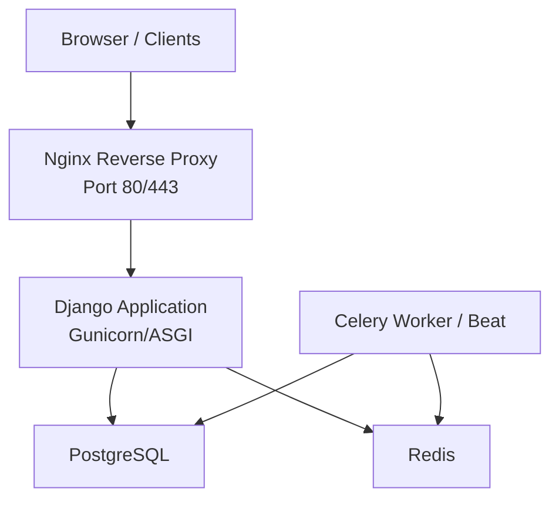
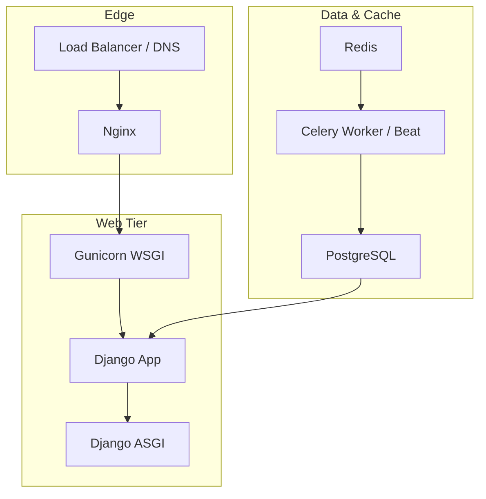
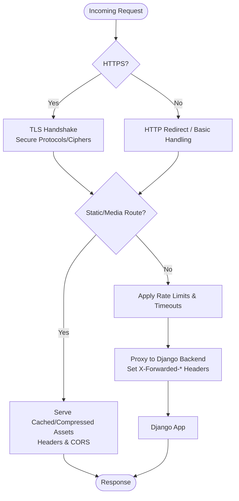
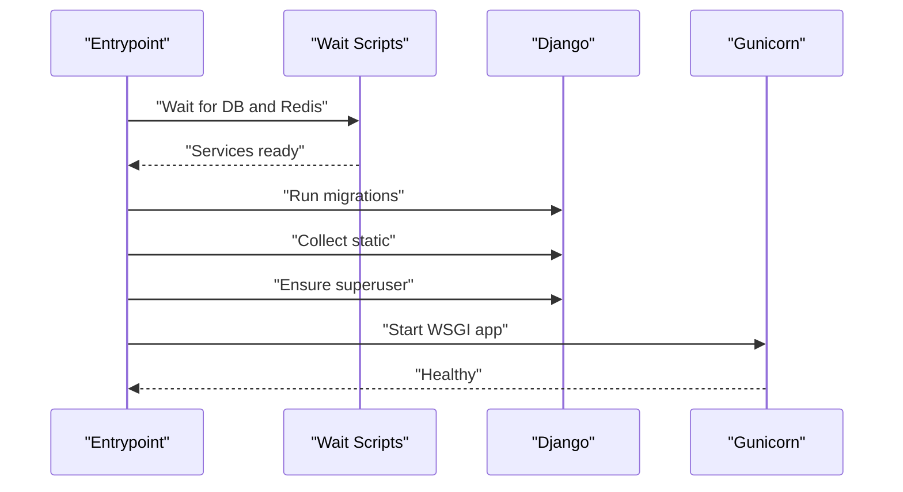
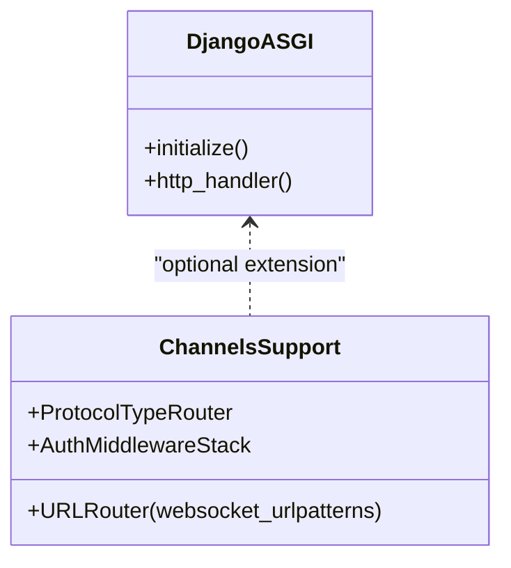
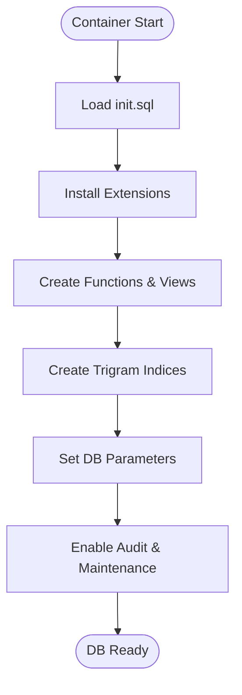
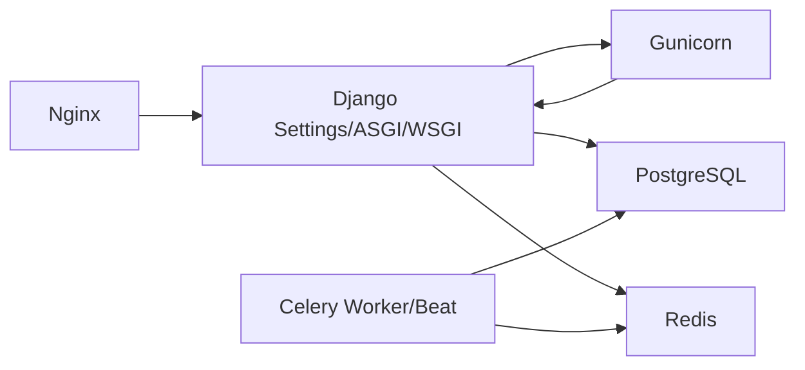

# Production Deployment

<cite>
**Referenced Files in This Document**
- [docker/nginx/nginx.conf](file://docker/nginx/nginx.conf)
- [docker/nginx/default.conf](file://docker/nginx/default.conf)
- [docker/postgres/init.sql](file://docker/postgres/init.sql)
- [Dockerfile](file://Dockerfile)
- [docker-entrypoint.sh](file://docker-entrypoint.sh)
- [init_web.sh](file://init_web.sh)
- [docker-compose.yml](file://docker-compose.yml)
- [proyecto_turnos/settings.py](file://proyecto_turnos/settings.py)
- [proyecto_turnos/wsgi.py](file://proyecto_turnos/wsgi.py)
- [proyecto_turnos/asgi.py](file://proyecto_turnos/asgi.py)
- [requirements.txt](file://requirements.txt)
- [proyecto_turnos/urls.py](file://proyecto_turnos/urls.py)
</cite>

## Table of Contents
1. [Introduction](#introduction)
2. [Project Structure](#project-structure)
3. [Core Components](#core-components)
4. [Architecture Overview](#architecture-overview)
5. [Detailed Component Analysis](#detailed-component-analysis)
6. [Dependency Analysis](#dependency-analysis)
7. [Performance Considerations](#performance-considerations)
8. [Security Hardening](#security-hardening)
9. [Monitoring and Alerting](#monitoring-and-alerting)
10. [Troubleshooting Guide](#troubleshooting-guide)
11. [Conclusion](#conclusion)

## Introduction
This document provides comprehensive production deployment guidance for the Nursing Shift Scheduler application. It covers reverse proxy configuration with Nginx (SSL termination, static file serving, load balancing), WSGI server setup with Gunicorn, ASGI server configuration, database deployment with PostgreSQL optimization and backup, security hardening, firewall and access control, monitoring and alerting, and performance tuning including caching and CDN integration.

## Project Structure
The deployment stack is containerized using Docker Compose and orchestrated across four primary services:
- Nginx reverse proxy and static asset server
- Django application (WSGI/ASGI)
- PostgreSQL database
- Redis for Celery and caching

**Diagram sources**
- [docker-compose.yml:1-168](file://docker-compose.yml#L1-L168)
- [docker/nginx/nginx.conf:1-95](file://docker/nginx/nginx.conf#L1-L95)
- [Dockerfile:1-87](file://Dockerfile#L1-L87)

**Section sources**
- [docker-compose.yml:1-168](file://docker-compose.yml#L1-L168)
- [docker/nginx/nginx.conf:1-95](file://docker/nginx/nginx.conf#L1-L95)
- [Dockerfile:1-87](file://Dockerfile#L1-L87)

## Core Components
- Reverse Proxy (Nginx): Handles SSL/TLS termination, static/media delivery, rate limiting, timeouts, security headers, and proxies requests to the Django application.
- WSGI Server (Gunicorn): Runs the Django WSGI application with configurable workers and threads.
- ASGI Server (Django ASGI app): Supports HTTP and can be extended for WebSockets via Channels.
- Database (PostgreSQL): Initialized with extensions, functions, views, indices, and logging tuned for performance and observability.
- Caching and Background Tasks (Redis): Used by Celery for task queues and caching.

**Section sources**
- [docker/nginx/default.conf:1-339](file://docker/nginx/default.conf#L1-L339)
- [docker/nginx/nginx.conf:1-95](file://docker/nginx/nginx.conf#L1-L95)
- [Dockerfile:82-87](file://Dockerfile#L82-L87)
- [proyecto_turnos/asgi.py:1-44](file://proyecto_turnos/asgi.py#L1-L44)
- [docker/postgres/init.sql:1-508](file://docker/postgres/init.sql#L1-L508)
- [docker-compose.yml:1-168](file://docker-compose.yml#L1-L168)

## Architecture Overview
The production architecture separates concerns across containers with explicit roles:
- Nginx terminates TLS, serves static assets, applies rate limits, and forwards traffic to the Django application.
- Django runs under Gunicorn for WSGI and supports ASGI for potential WebSocket needs.
- PostgreSQL is provisioned with performance-enhancing extensions and functions.
- Redis provides task queue and caching.

**Diagram sources**
- [docker/nginx/default.conf:1-339](file://docker/nginx/default.conf#L1-L339)
- [Dockerfile:82-87](file://Dockerfile#L82-L87)
- [docker-compose.yml:1-168](file://docker-compose.yml#L1-L168)
- [docker/postgres/init.sql:1-508](file://docker/postgres/init.sql#L1-L508)

## Detailed Component Analysis

### Nginx Reverse Proxy Configuration
Key responsibilities:
- SSL/TLS termination with secure protocols and cipher suites, OCSP stapling, and HSTS.
- Static file caching and compression.
- Rate limiting and connection limits for admin, API, and general routes.
- Health check endpoint proxying to the Django backend.
- Security headers and blocking of sensitive paths and file types.
- Proxy timeouts and buffering tuned for reliability.

Operational ports:
- HTTP: 8080 mapped to container port 80
- HTTPS: 8443 mapped to container port 443

Health checks:
- Nginx health check probes the internal /health/ endpoint.

Security hardening:
- Strict transport security, frame options, content type options, XSS protection, referrer policy, permissions policy, and CSP.
- Blocking hidden files, backups, and Python-related files.
- User agent filtering for known scrapers/bots.

**Diagram sources**
- [docker/nginx/default.conf:1-339](file://docker/nginx/default.conf#L1-L339)
- [docker/nginx/nginx.conf:1-95](file://docker/nginx/nginx.conf#L1-L95)

**Section sources**
- [docker/nginx/default.conf:1-339](file://docker/nginx/default.conf#L1-L339)
- [docker/nginx/nginx.conf:1-95](file://docker/nginx/nginx.conf#L1-L95)
- [docker-compose.yml:129-152](file://docker-compose.yml#L129-L152)

### Gunicorn WSGI Server Setup
Gunicorn is configured as the default CMD in the Dockerfile and executed during initialization:
- Binding to 0.0.0.0:8000
- Workers: 4
- Threads per worker: 2
- Timeout: 120 seconds
- Access and error logs streamed to stdout/stderr

Initialization flow:
- Entrypoint waits for PostgreSQL and Redis readiness.
- Applies Django migrations and collects static files.
- Creates a default superuser if not present.
- Starts Gunicorn.

**Diagram sources**
- [docker-entrypoint.sh:1-15](file://docker-entrypoint.sh#L1-L15)
- [init_web.sh:1-26](file://init_web.sh#L1-L26)
- [Dockerfile:82-87](file://Dockerfile#L82-L87)

**Section sources**
- [Dockerfile:82-87](file://Dockerfile#L82-L87)
- [init_web.sh:1-26](file://init_web.sh#L1-L26)
- [docker-entrypoint.sh:1-15](file://docker-entrypoint.sh#L1-L15)

### ASGI Server Configuration
The ASGI application initializes the Django ASGI app. The current configuration runs without Channels/WebSocket support. To enable WebSockets, the ASGI configuration can be extended to include Channels routing and middleware stacks.

**Diagram sources**
- [proyecto_turnos/asgi.py:1-44](file://proyecto_turnos/asgi.py#L1-L44)

**Section sources**
- [proyecto_turnos/asgi.py:1-44](file://proyecto_turnos/asgi.py#L1-L44)

### Database Deployment with PostgreSQL
PostgreSQL is initialized with:
- Extensions: uuid-ossp, pg_trgm, unaccent, hstore, pgcrypto
- Text search configuration for Spanish without accents
- Utility functions for timestamps, slugs, fuzzy search, cleanup, and statistics
- Useful views for active nurses, configuration stats, and completed executions
- Additional GIN indices for trigram search on key fields
- Parameter tuning: default text search config, timezone, similarity threshold
- Row Level Security guidance and audit triggers
- Maintenance functions: concurrent reindex and analyze
- Vacuum tuning for specific tables
- Optional read-only role creation
- Logging of slow statements and statement auditing
- Version tracking table

Backup and persistence:
- Persistent volumes for data and Redis AOF
- Initialization script mounted at container startup

**Diagram sources**
- [docker/postgres/init.sql:1-508](file://docker/postgres/init.sql#L1-L508)
- [docker-compose.yml:4-25](file://docker-compose.yml#L4-L25)

**Section sources**
- [docker/postgres/init.sql:1-508](file://docker/postgres/init.sql#L1-L508)
- [docker-compose.yml:4-25](file://docker-compose.yml#L4-L25)

### Security Hardening Measures
- Nginx:
  - TLSv1.2+/modern ciphers, OCSP stapling, HSTS, strict security headers, CSP, referrer policy, permissions policy.
  - Rate limiting zones for general, API, and login paths; connection limits.
  - Blocking hidden files, backups, and sensitive file types; user agent filtering.
- Django:
  - Security middleware, CSRF, X-Frame-Options via middleware, WhiteNoise for static files.
  - Environment-driven ALLOWED_HOSTS and SECRET_KEY.
- Containers:
  - Non-root user, minimal base image, health checks, and dependency pinning.

**Section sources**
- [docker/nginx/default.conf:245-271](file://docker/nginx/default.conf#L245-L271)
- [docker/nginx/default.conf:103-147](file://docker/nginx/default.conf#L103-L147)
- [docker/nginx/nginx.conf:85-91](file://docker/nginx/nginx.conf#L85-L91)
- [proyecto_turnos/settings.py:29-39](file://proyecto_turnos/settings.py#L29-L39)
- [Dockerfile:16-17](file://Dockerfile#L16-L17)

### Monitoring Setup
- Nginx:
  - Access and error logs; main log format with timing and upstream metrics.
  - Health check endpoint proxying to Django backend.
- Django:
  - Built-in health check via manage.py check.
- Compose:
  - Health checks for db, redis, web, and nginx.

Recommended additions:
- Centralized logging (e.g., ELK or Loki).
- Metrics scraping (e.g., Prometheus exporter for Nginx and application).
- Alerting on failing health checks and elevated error rates.

**Section sources**
- [docker/nginx/nginx.conf:20-28](file://docker/nginx/nginx.conf#L20-L28)
- [docker/nginx/default.conf:91-98](file://docker/nginx/default.conf#L91-L98)
- [docker-compose.yml:74-79](file://docker-compose.yml#L74-L79)
- [docker-compose.yml:20-24](file://docker-compose.yml#L20-L24)
- [docker-compose.yml:147-151](file://docker-compose.yml#L147-L151)

## Dependency Analysis
Runtime dependencies and their roles:
- Django: WSGI and ASGI applications, settings, URLs, and storage.
- Gunicorn: WSGI server for Django.
- Nginx: Reverse proxy, SSL termination, static/media serving.
- PostgreSQL: Primary relational database with extensions and maintenance functions.
- Redis: Celery broker/backend and caching.

**Diagram sources**
- [proyecto_turnos/settings.py:60-76](file://proyecto_turnos/settings.py#L60-L76)
- [Dockerfile:53-53](file://Dockerfile#L53-L53)
- [docker-compose.yml:1-168](file://docker-compose.yml#L1-L168)

**Section sources**
- [requirements.txt:29-29](file://requirements.txt#L29-L29)
- [docker-compose.yml:1-168](file://docker-compose.yml#L1-L168)

## Performance Considerations
- Nginx:
  - Keepalive, epoll, multi_accept, gzip/brotli, open file cache, and optimized buffer sizes.
  - Static asset caching with long expirations and immutable hints.
- Django:
  - WhiteNoise compressed static files storage.
  - Environment-driven DEBUG and ALLOWED_HOSTS.
- PostgreSQL:
  - Extensions and indices for trigram search and fuzzy matching.
  - Logging of slow statements and periodic maintenance functions.
- Gunicorn:
  - Worker and thread counts tuned for CPU cores and workload characteristics.
  - Timeouts configured to prevent resource exhaustion.

**Section sources**
- [docker/nginx/nginx.conf:33-34](file://docker/nginx/nginx.conf#L33-L34)
- [docker/nginx/nginx.conf:52-72](file://docker/nginx/nginx.conf#L52-L72)
- [docker/nginx/default.conf:42-56](file://docker/nginx/default.conf#L42-L56)
- [proyecto_turnos/settings.py:103-110](file://proyecto_turnos/settings.py#L103-L110)
- [docker/postgres/init.sql:233-249](file://docker/postgres/init.sql#L233-L249)
- [Dockerfile:82-87](file://Dockerfile#L82-L87)

## Security Hardening
- Network:
  - Restrict inbound ports to 80/443 at the host level; internal services communicate via Docker networks.
- Application:
  - Environment variables for secrets and configuration; ALLOWED_HOSTS set via environment.
  - Security middleware and strict headers enforced by Nginx and Django.
- Database:
  - Optional read-only role and audit triggers; maintenance functions for index and statistics updates.
- Container:
  - Non-root user, minimal base image, health checks, and dependency pinning.

**Section sources**
- [docker-compose.yml:165-168](file://docker-compose.yml#L165-L168)
- [proyecto_turnos/settings.py:10-12](file://proyecto_turnos/settings.py#L10-L12)
- [docker/postgres/init.sql:401-417](file://docker/postgres/init.sql#L401-L417)
- [Dockerfile:16-17](file://Dockerfile#L16-L17)

## Monitoring and Alerting
- Built-in health checks:
  - Nginx health check probes /health/.
  - Django health check via manage.py check.
  - Database and Redis health checks via compose exec probes.
- Logs:
  - Nginx access/error logs; Django application logs via Gunicorn.
- Recommendations:
  - Centralized logging and metrics collection.
  - Alerting on failing health checks and increased error rates.

**Section sources**
- [docker/nginx/default.conf:91-98](file://docker/nginx/default.conf#L91-L98)
- [docker-compose.yml:74-79](file://docker-compose.yml#L74-L79)
- [docker-compose.yml:20-24](file://docker-compose.yml#L20-L24)
- [docker-compose.yml:147-151](file://docker-compose.yml#L147-L151)

## Troubleshooting Guide
Common issues and resolutions:
- Django not starting:
  - Verify migrations and static collection steps in init_web.sh.
  - Confirm database connectivity and credentials.
- Nginx returning errors:
  - Review access/error logs and health check endpoint.
  - Validate SSL certificate paths and permissions.
- Database initialization:
  - Ensure init.sql is mounted and executed at first run.
  - Check for missing extensions or indices after schema changes.
- Celery tasks not processed:
  - Confirm Redis availability and credentials.
  - Verify broker and result backend URLs.

**Section sources**
- [init_web.sh:4-25](file://init_web.sh#L4-L25)
- [docker-entrypoint.sh:4-11](file://docker-entrypoint.sh#L4-L11)
- [docker/nginx/default.conf:233-236](file://docker/nginx/default.conf#L233-L236)
- [docker/postgres/init.sql:1-12](file://docker/postgres/init.sql#L1-L12)
- [docker-compose.yml:88-88](file://docker-compose.yml#L88-L88)
- [docker-compose.yml:112-112](file://docker-compose.yml#L112-L112)

## Conclusion
The deployment leverages a robust, containerized stack with Nginx handling SSL and static assets, Gunicorn serving Django, PostgreSQL optimized with extensions and maintenance routines, and Redis powering Celery and caching. Security is strengthened through modern TLS, strict headers, rate limiting, and least-privilege containers. Extending monitoring, centralized logging, and CDN integration would further improve production readiness.