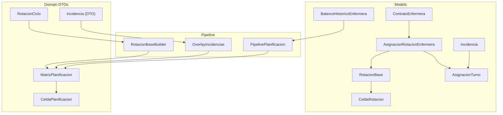
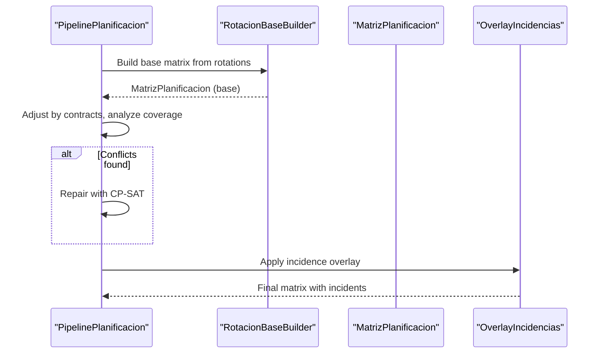
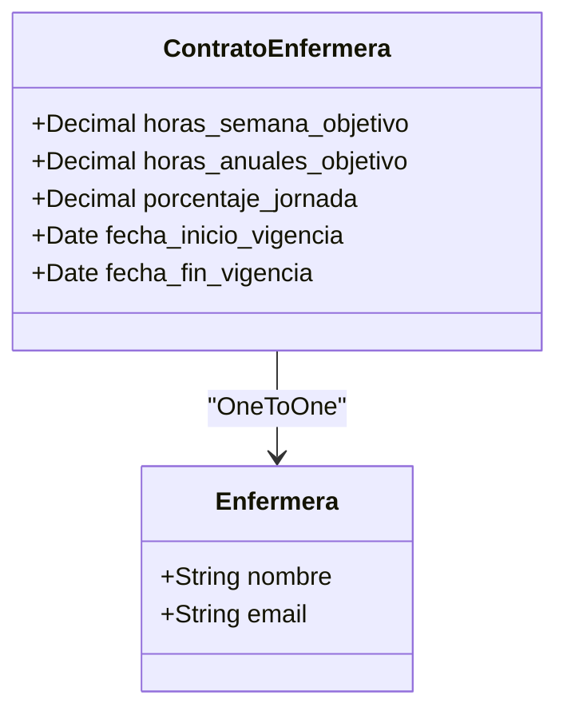
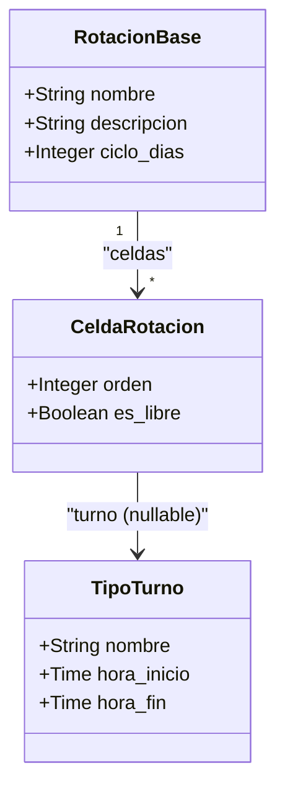
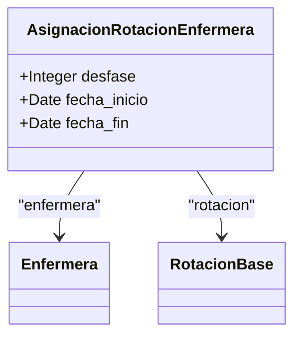
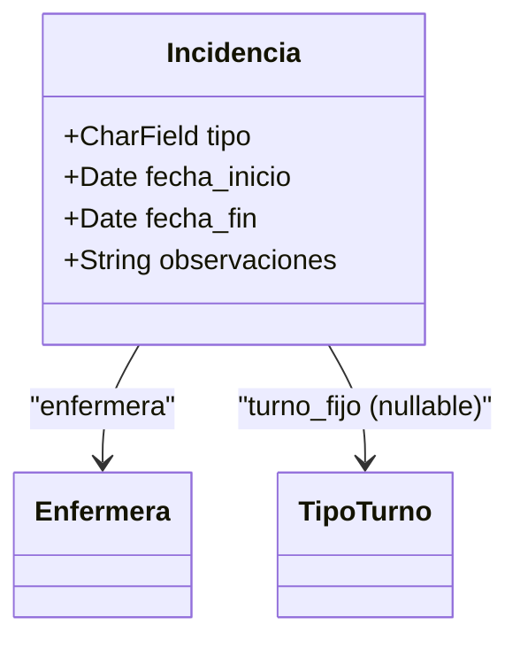
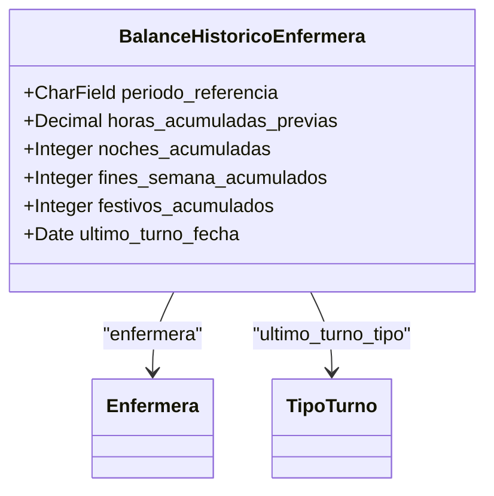
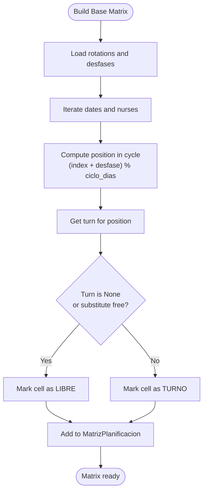
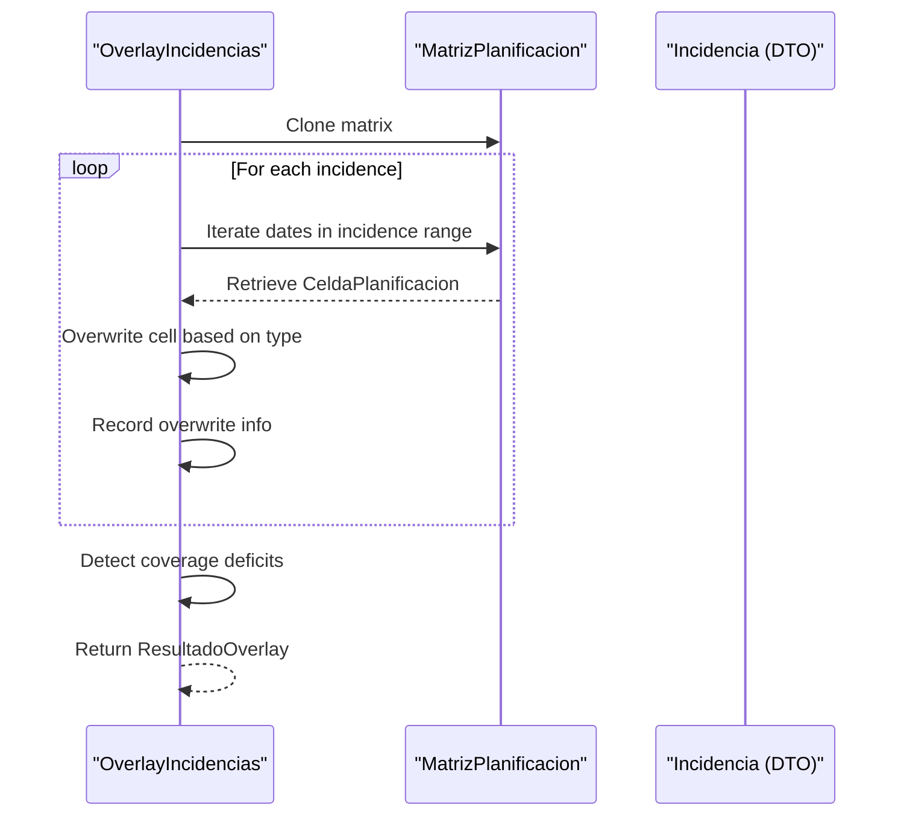
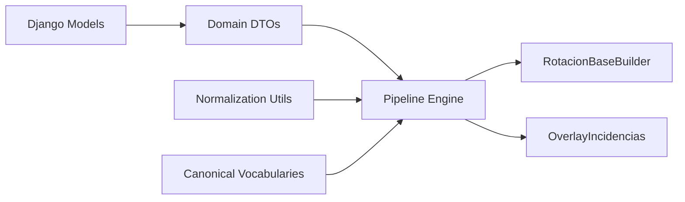

# Advanced Domain Models

<cite>
**Referenced Files in This Document**
- [models.py](file://turnos/models.py)
- [rotacion_base.py](file://turnos/motor/rotacion_base.py)
- [incidencias.py](file://turnos/motor/incidencias.py)
- [overlay_incidencias.py](file://turnos/motor/overlay_incidencias.py)
- [pipeline.py](file://turnos/motor/pipeline.py)
- [dtos.py](file://turnos/dominio/dtos.py)
- [vocabulario.py](file://turnos/dominio/vocabulario.py)
- [normalizacion.py](file://turnos/dominio/normalizacion.py)
- [0009_add_domain_models.py](file://turnos/migrations/0009_add_domain_models.py)
- [ARQUITECTURA.md](file://docs/ARQUITECTURA.md)
- [REFACTORIZACION_COMPLETADA.md](file://docs/REFACTORIZACION_COMPLETADA.md)
</cite>

## Table of Contents
1. [Introduction](#introduction)
2. [Project Structure](#project-structure)
3. [Core Components](#core-components)
4. [Architecture Overview](#architecture-overview)
5. [Detailed Component Analysis](#detailed-component-analysis)
6. [Dependency Analysis](#dependency-analysis)
7. [Performance Considerations](#performance-considerations)
8. [Troubleshooting Guide](#troubleshooting-guide)
9. [Conclusion](#conclusion)
10. [Appendices](#appendices)

## Introduction
This document explains the advanced domain models that define the contract management system for nurse work schedules, explicit rotation cycles, and incident handling mechanisms. It documents how rotation cycles relate to individual nurse assignments, and how the historical balance tracking system supports workload analysis. It also covers the integration of these models into the main planning workflow, including deterministic base generation, overlay-based incident application, and validation.

## Project Structure
The advanced domain models are implemented as Django ORM models and complemented by a pipeline-driven engine that orchestrates deterministic base generation, optional solver-based repair, and post-generation overlays for incidents. Supporting DTOs and normalization utilities ensure consistent interpretation of constraints and patterns.

**Diagram sources**
- [models.py:629-825](file://turnos/models.py#L629-L825)
- [rotacion_base.py:21-94](file://turnos/motor/rotacion_base.py#L21-L94)
- [overlay_incidencias.py:24-205](file://turnos/motor/overlay_incidencias.py#L24-L205)
- [pipeline.py:31-267](file://turnos/motor/pipeline.py#L31-L267)
- [dtos.py:197-274](file://turnos/dominio/dtos.py#L197-L274)

**Section sources**
- [ARQUITECTURA.md:103-143](file://docs/ARQUITECTURA.md#L103-L143)
- [REFACTORIZACION_COMPLETADA.md:246-296](file://docs/REFACTORIZACION_COMPLETADA.md#L246-L296)

## Core Components
- ContratoEnfermera: Defines a nurse’s contractual schedule targets (weekly, annual hours, and percentage of full-time).
- RotacionBase: Explicit rotation cycle definition with a fixed duration in days.
- CeldaRotacion: Individual cell within a rotation cycle indicating a specific shift or a free day.
- AsignacionRotacionEnfermera: Assigns a rotation to a nurse with a positional offset (desfase) within the cycle.
- Incidencia: Events modifying the normal schedule (e.g., vacations, permission, illness, training, fixed assignment).
- BalanceHistoricoEnfermera: Historical accumulation metrics for contextual planning (previous hours, accumulated nights/weekends/holidays, last shift).

These models integrate with the planning pipeline to generate a deterministic base schedule, optionally adjust for contracts and coverage, and apply incidents as a post-generation overlay.

**Section sources**
- [models.py:629-825](file://turnos/models.py#L629-L825)
- [ARQUITECTURA.md:115-142](file://docs/ARQUITECTURA.md#L115-L142)

## Architecture Overview
The planning workflow is a five-phase pipeline:
1. Deterministic base generation from explicit rotations.
2. Contract-based hour adjustment.
3. Coverage analysis and deviation calculation.
4. Optional CP-SAT repair for conflicts.
5. Validation of the final matrix.

Incidences are applied as a sixth phase overlay after the solver completes, ensuring the generated solution remains optimal while reflecting planned absences or fixed assignments.

**Diagram sources**
- [pipeline.py:92-235](file://turnos/motor/pipeline.py#L92-L235)
- [rotacion_base.py:41-94](file://turnos/motor/rotacion_base.py#L41-L94)
- [overlay_incidencias.py:45-75](file://turnos/motor/overlay_incidencias.py#L45-L75)

**Section sources**
- [pipeline.py:31-116](file://turnos/motor/pipeline.py#L31-L116)
- [ARQUITECTURA.md:297-302](file://docs/ARQUITECTURA.md#L297-L302)

## Detailed Component Analysis

### ContratoEnfermera
- Purpose: Encapsulates a nurse’s contractual schedule targets and working regime.
- Key attributes:
  - Weekly and annual hours targets.
  - Percentage of full-time (e.g., 100%, 50%).
  - Validity period (start/end dates).
- Business impact: Guides the second phase of the pipeline to adjust deviations from contractual hours.

**Diagram sources**
- [models.py:629-664](file://turnos/models.py#L629-L664)

**Section sources**
- [models.py:629-664](file://turnos/models.py#L629-L664)
- [ARQUITECTURA.md:117-122](file://docs/ARQUITECTURA.md#L117-L122)

### RotacionBase and CeldaRotacion
- RotacionBase: Defines a repeating cycle of days (ciclo_dias) and ties to a workspace.
- CeldaRotacion: Ordered cells within the cycle, each pointing to a shift type or being free.
- Behavior: If a cell has no shift, it represents a free day; if the assigned shift is a “substitute free,” it is treated as free.

**Diagram sources**
- [models.py:666-720](file://turnos/models.py#L666-L720)

**Section sources**
- [models.py:666-720](file://turnos/models.py#L666-L720)
- [rotacion_base.py:67-88](file://turnos/motor/rotacion_base.py#L67-L88)

### AsignacionRotacionEnfermera
- Purpose: Assigns a specific rotation to a nurse with a positional offset (desfase) within the cycle.
- Period: Effective date range (fecha_inicio to fecha_fin).
- Impact: Enables different nurses to start at different positions in the same rotation cycle.

**Diagram sources**
- [models.py:722-747](file://turnos/models.py#L722-L747)

**Section sources**
- [models.py:722-747](file://turnos/models.py#L722-L747)
- [rotacion_base.py:67-88](file://turnos/motor/rotacion_base.py#L67-L88)

### Incidencia
- Purpose: Captures planned events that alter the normal schedule.
- Types: Vacations, Permission, Illness/Benefit, Training, Blocked availability, Fixed assignment.
- Application: Applied as an overlay after the solver completes, marking affected cells as non-modifiable and setting the appropriate cell type.

**Diagram sources**
- [models.py:749-785](file://turnos/models.py#L749-L785)

**Section sources**
- [models.py:749-785](file://turnos/models.py#L749-L785)
- [incidencias.py:21-98](file://turnos/motor/incidencias.py#L21-L98)
- [overlay_incidencias.py:24-164](file://turnos/motor/overlay_incidencias.py#L24-L164)

### BalanceHistoricoEnfermera
- Purpose: Stores historical accumulations to inform contextual planning.
- Fields: Previous hours, accumulated nights, weekends, holidays, last shift date/type, and update timestamp.
- Integration: Used by the pipeline to guide fairness and equity objectives and to compute deviations.

**Diagram sources**
- [models.py:787-825](file://turnos/models.py#L787-L825)

**Section sources**
- [models.py:787-825](file://turnos/models.py#L787-L825)
- [dtos.py:135-166](file://turnos/dominio/dtos.py#L135-L166)

### Rotation Base Generation
- Builder constructs a deterministic base matrix using explicit rotations, desfases, and the cycle length.
- Free days and “substitute free” shifts are marked as LIBRE cells.
- The builder populates a MatrizPlanificacion with CeldaPlanificacion entries.

**Diagram sources**
- [rotacion_base.py:41-94](file://turnos/motor/rotacion_base.py#L41-L94)

**Section sources**
- [rotacion_base.py:21-94](file://turnos/motor/rotacion_base.py#L21-L94)
- [dtos.py:197-238](file://turnos/dominio/dtos.py#L197-L238)

### Overlay Incidence Application
- Overlay applies planned absences and fixed assignments after the solver completes.
- Each affected cell is recorded with original and new state, and deficits in coverage are detected.

**Diagram sources**
- [overlay_incidencias.py:45-205](file://turnos/motor/overlay_incidencias.py#L45-L205)
- [dtos.py:241-248](file://turnos/dominio/dtos.py#L241-L248)

**Section sources**
- [overlay_incidencias.py:24-205](file://turnos/motor/overlay_incidencias.py#L24-L205)
- [incidencias.py:21-98](file://turnos/motor/incidencias.py#L21-L98)

## Dependency Analysis
- Models depend on each other through foreign keys and one-to-one relationships, enabling explicit rotation definitions and nurse-specific assignments.
- The pipeline orchestrator coordinates builders, solvers, and overlays, operating on DTOs that decouple domain logic from Django models.
- Normalization utilities ensure legacy configuration names map to canonical identifiers consistently across the system.

**Diagram sources**
- [models.py:629-825](file://turnos/models.py#L629-L825)
- [dtos.py:1-274](file://turnos/dominio/dtos.py#L1-L274)
- [pipeline.py:31-267](file://turnos/motor/pipeline.py#L31-L267)
- [normalizacion.py:68-190](file://turnos/dominio/normalizacion.py#L68-L190)
- [vocabulario.py:10-112](file://turnos/dominio/vocabulario.py#L10-L112)

**Section sources**
- [models.py:629-825](file://turnos/models.py#L629-L825)
- [dtos.py:1-274](file://turnos/dominio/dtos.py#L1-L274)
- [pipeline.py:31-267](file://turnos/motor/pipeline.py#L31-L267)
- [normalizacion.py:68-190](file://turnos/dominio/normalizacion.py#L68-L190)
- [vocabulario.py:10-112](file://turnos/dominio/vocabulario.py#L10-L112)

## Performance Considerations
- Deterministic base generation avoids solver overhead for the rotation phase, improving scalability for large periods.
- Overlay application operates on a cloned matrix and scans per-day counts, keeping complexity proportional to the number of affected cells and dates.
- Historical balances enable targeted fairness objectives, reducing solver iterations by guiding feasible regions.

[No sources needed since this section provides general guidance]

## Troubleshooting Guide
- Rotation mismatches: Verify that the rotation cycle length matches the number of defined cells and that desfases align with the intended offsets.
- Incident application anomalies: Confirm that incidence types map to canonical values and that overlay runs after solver completion.
- Coverage deficits: Review minimum coverage requirements and the resulting deficits reported by the overlay.
- Contract adjustments: Ensure contractual hours targets are set and that the pipeline’s hour adjustment phase executes before validation.

**Section sources**
- [overlay_incidencias.py:166-205](file://turnos/motor/overlay_incidencias.py#L166-L205)
- [pipeline.py:170-200](file://turnos/motor/pipeline.py#L170-L200)
- [normalizacion.py:68-93](file://turnos/dominio/normalizacion.py#L68-L93)

## Conclusion
The advanced domain models formalize contract-driven scheduling, explicit rotation cycles, and incident overlays. Together with the pipeline orchestration, they deliver a deterministic base, optional solver repair, and a robust overlay mechanism that preserves optimality while incorporating planned absences and fixed assignments. Historical balances further refine fairness and equity objectives, supporting long-term workload analysis and compliance with contractual obligations.

[No sources needed since this section summarizes without analyzing specific files]

## Appendices

### Migration Reference
- Creation of the advanced domain models and addition of the explicit cell type to assignments are captured in the migration that adds the models and the new field.

**Section sources**
- [0009_add_domain_models.py:14-123](file://turnos/migrations/0009_add_domain_models.py#L14-L123)

### Canonical Names and Types
- Restriction and pattern names are normalized to canonical identifiers to ensure consistent interpretation across the pipeline and validator.
- Cell and incidence types are standardized for reliable classification and reporting.

**Section sources**
- [normalizacion.py:68-190](file://turnos/dominio/normalizacion.py#L68-L190)
- [vocabulario.py:10-112](file://turnos/dominio/vocabulario.py#L10-L112)