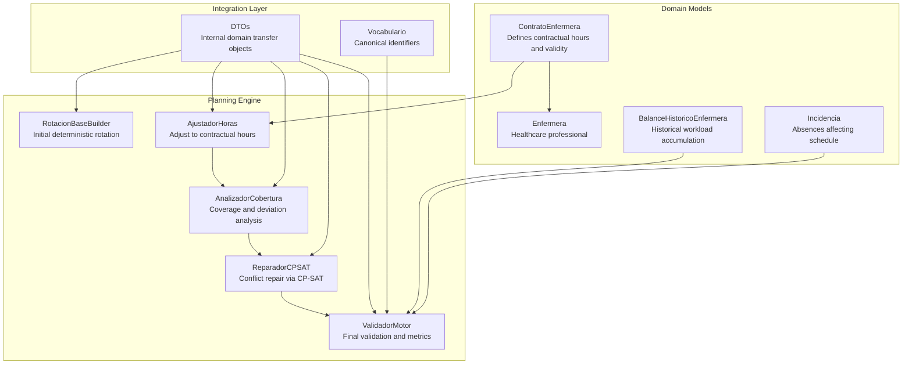
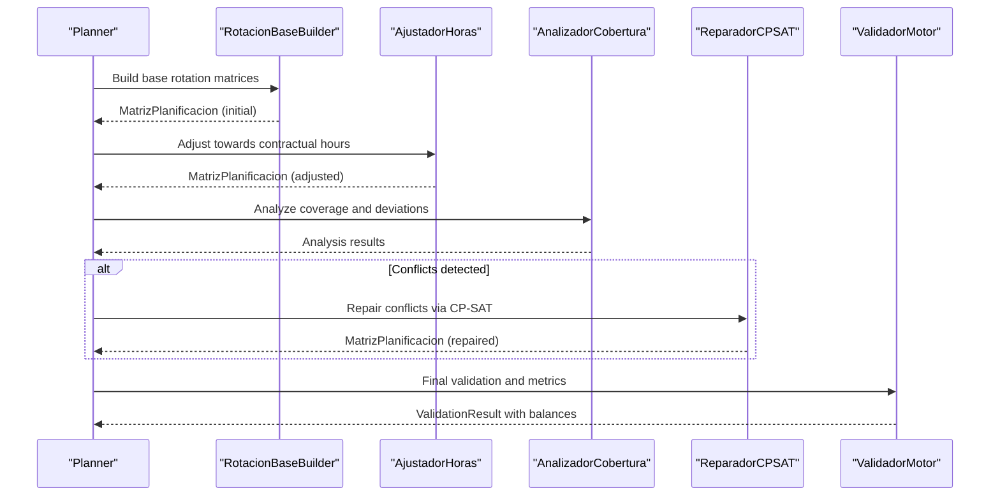
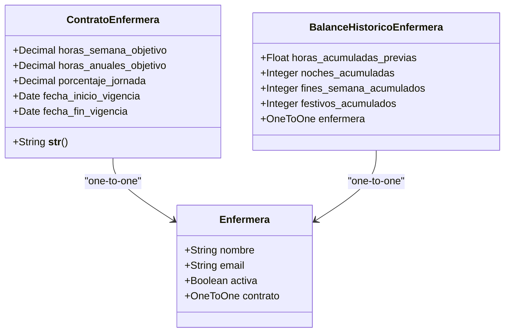
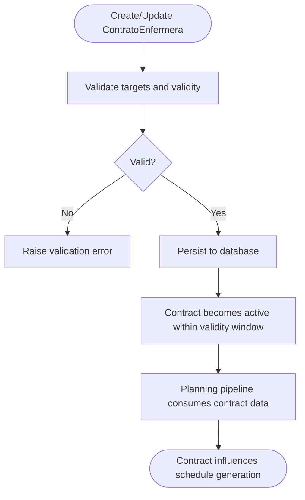
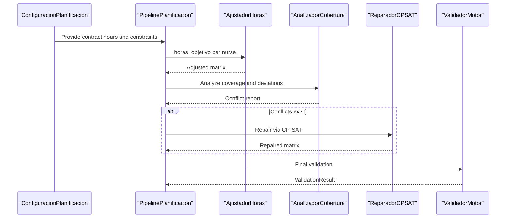
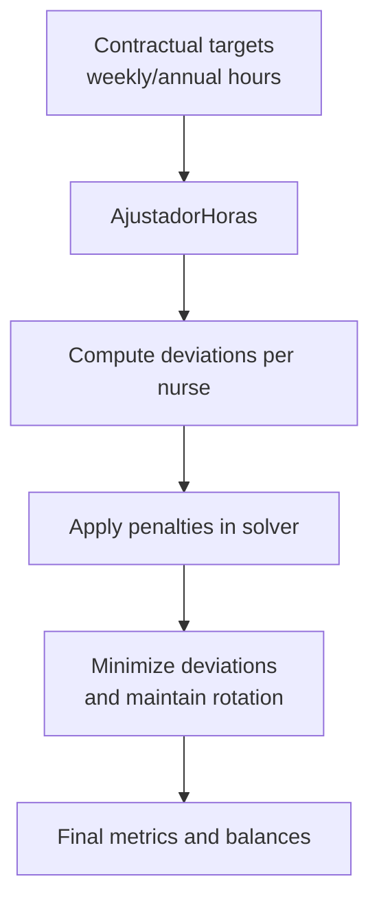
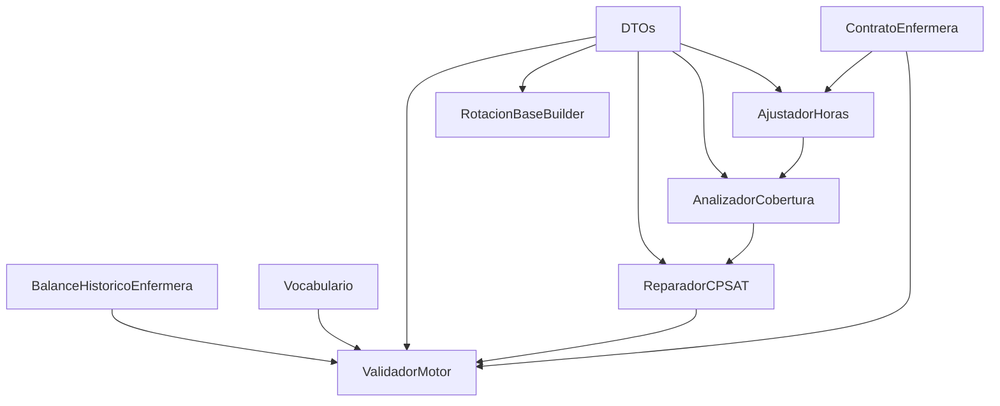

# Contract Management System

<cite>
**Referenced Files in This Document**
- [models.py](file://turnos/models.py)
- [0009_add_domain_models.py](file://turnos/migrations/0009_add_domain_models.py)
- [pipeline.py](file://turnos/motor/pipeline.py)
- [ajuste_horas.py](file://turnos/motor/ajuste_horas.py)
- [cobertura.py](file://turnos/motor/cobertura.py)
- [reparador.py](file://turnos/motor/reparador.py)
- [validador_motor.py](file://turnos/motor/validador_motor.py)
- [dtos.py](file://turnos/dominio/dtos.py)
- [vocabulario.py](file://turnos/dominio/vocabulario.py)
- [rotacion_base.py](file://turnos/motor/rotacion_base.py)
- [views.py](file://turnos/views.py)
- [admin.py](file://turnos/admin.py)
</cite>

## Table of Contents
1. [Introduction](#introduction)
2. [Project Structure](#project-structure)
3. [Core Components](#core-components)
4. [Architecture Overview](#architecture-overview)
5. [Detailed Component Analysis](#detailed-component-analysis)
6. [Dependency Analysis](#dependency-analysis)
7. [Performance Considerations](#performance-considerations)
8. [Troubleshooting Guide](#troubleshooting-guide)
9. [Conclusion](#conclusion)

## Introduction
This document provides comprehensive documentation for the contract management system focused on the ContratoEnfermera model. It explains how nurse contracts define working hours, weekly and annual targets, and work percentage, documents the contract lifecycle from creation to expiration, details validation rules and business constraints, and describes the integration with the planning system for workload balancing and overtime calculations. It also includes examples of contract configurations for different employment scenarios and addresses contract inheritance patterns and their impact on shift assignments and penalty calculations.

## Project Structure
The contract management system is implemented within the turnos Django application and integrates closely with the planning engine. Key areas include:
- Domain models defining contracts and related entities
- Planning pipeline modules that consume contract data
- Validation and repair mechanisms that enforce contract constraints
- Administrative interface for managing contracts

**Diagram sources**
- [models.py:629-663](file://turnos/models.py#L629-L663)
- [rotacion_base.py:21-94](file://turnos/motor/rotacion_base.py#L21-L94)
- [ajuste_horas.py:21-88](file://turnos/motor/ajuste_horas.py#L21-L88)
- [cobertura.py:21-73](file://turnos/motor/cobertura.py#L21-L73)
- [reparador.py:24-96](file://turnos/motor/reparador.py#L24-L96)
- [validador_motor.py:23-86](file://turnos/motor/validador_motor.py#L23-L86)
- [dtos.py:43-238](file://turnos/dominio/dtos.py#L43-L238)
- [vocabulario.py:10-112](file://turnos/dominio/vocabulario.py#L10-L112)

**Section sources**
- [models.py:629-663](file://turnos/models.py#L629-L663)
- [0009_add_domain_models.py:24-39](file://turnos/migrations/0009_add_domain_models.py#L24-L39)

## Core Components
This section focuses on the ContratoEnfermera model and its role in the system.

- ContratoEnfermera defines:
  - Weekly and annual target hours
  - Work percentage representing full-time or part-time status
  - Validity period (start and optional end date)
  - One-to-one relationship with Enfermera

- Integration points:
  - Used by AjustadorHoras to adjust generated schedules toward contractual targets
  - Consumed by AnalizadorCobertura and ReparadorCPSAT for workload balancing
  - Validated by ValidadorMotor to ensure compliance with hard constraints

**Section sources**
- [models.py:629-663](file://turnos/models.py#L629-L663)
- [ajuste_horas.py:32-44](file://turnos/motor/ajuste_horas.py#L32-L44)
- [cobertura.py:30-44](file://turnos/motor/cobertura.py#L30-L44)
- [reparador.py:47-55](file://turnos/motor/reparador.py#L47-L55)
- [validador_motor.py:34-44](file://turnos/motor/validador_motor.py#L34-L44)

## Architecture Overview
The contract management system participates in the planning pipeline as follows:

**Diagram sources**
- [pipeline.py:92-245](file://turnos/motor/pipeline.py#L92-L245)
- [rotacion_base.py:41-94](file://turnos/motor/rotacion_base.py#L41-L94)
- [ajuste_horas.py:46-88](file://turnos/motor/ajuste_horas.py#L46-L88)
- [cobertura.py:46-73](file://turnos/motor/cobertura.py#L46-L73)
- [reparador.py:63-96](file://turnos/motor/reparador.py#L63-L96)
- [validador_motor.py:48-86](file://turnos/motor/validador_motor.py#L48-L86)

## Detailed Component Analysis

### ContratoEnfermera Model
The ContratoEnfermera model encapsulates contractual obligations for nurses and serves as the foundation for workload management.

Key characteristics:
- Target hours: Weekly and annual targets guide the planner to approximate contractual expectations.
- Work percentage: Indicates full-time (100%), half-time (50%), etc., influencing scheduling density.
- Validity period: Ensures contracts apply only during their effective dates.
- Historical integration: Balances incorporate accumulated hours to maintain long-term equity.

**Diagram sources**
- [models.py:629-663](file://turnos/models.py#L629-L663)
- [models.py:787-800](file://turnos/models.py#L787-L800)

**Section sources**
- [models.py:629-663](file://turnos/models.py#L629-L663)
- [0009_add_domain_models.py:24-39](file://turnos/migrations/0009_add_domain_models.py#L24-L39)

### Contract Lifecycle and Validation
The lifecycle spans creation, validation, and enforcement:

- Creation and persistence: Contracts are stored with validity dates and target hours.
- Admin interface: Provides filtering by percentage and date ranges, with a "Vigente" indicator.
- Validation rules:
  - Weekly and annual targets must be positive decimals.
  - Work percentage should reflect realistic full-time or part-time values.
  - Validity period must be coherent with configured planning windows.

**Diagram sources**
- [admin.py:358-383](file://turnos/admin.py#L358-L383)
- [models.py:629-663](file://turnos/models.py#L629-L663)

**Section sources**
- [admin.py:358-383](file://turnos/admin.py#L358-L383)
- [models.py:629-663](file://turnos/models.py#L629-L663)

### Integration with Planning System
Contracts influence the planning process through several pipeline stages:

- Rotation base construction: Initial deterministic assignment based on rotation cycles.
- Hours adjustment: Adjustments to align generated hours with contractual targets.
- Coverage analysis: Detects conflicts against minimum coverage and consecutive work limits.
- Conflict repair: Uses CP-SAT to resolve conflicts while minimizing deviations from the base rotation.
- Final validation: Ensures hard constraints are satisfied and computes final balances.

**Diagram sources**
- [pipeline.py:92-245](file://turnos/motor/pipeline.py#L92-L245)
- [ajuste_horas.py:46-88](file://turnos/motor/ajuste_horas.py#L46-L88)
- [cobertura.py:46-73](file://turnos/motor/cobertura.py#L46-L73)
- [reparador.py:63-96](file://turnos/motor/reparador.py#L63-L96)
- [validador_motor.py:48-86](file://turnos/motor/validador_motor.py#L48-L86)

**Section sources**
- [pipeline.py:92-245](file://turnos/motor/pipeline.py#L92-L245)
- [ajuste_horas.py:46-88](file://turnos/motor/ajuste_horas.py#L46-L88)
- [cobertura.py:46-73](file://turnos/motor/cobertura.py#L46-L73)
- [reparador.py:63-96](file://turnos/motor/reparador.py#L63-L96)
- [validador_motor.py:48-86](file://turnos/motor/validador_motor.py#L48-L86)

### Workload Balancing and Overtime Calculations
The system balances workload using:
- Contractual hours as targets for monthly and annual totals.
- Historical balances to prevent excessive accumulation for some nurses.
- Penalty functions in the CP-SAT solver to minimize deviations from the base rotation and contractual targets.

**Diagram sources**
- [ajuste_horas.py:46-88](file://turnos/motor/ajuste_horas.py#L46-L88)
- [reparador.py:297-446](file://turnos/motor/reparador.py#L297-L446)
- [validador_motor.py:389-438](file://turnos/motor/validador_motor.py#L389-L438)

**Section sources**
- [ajuste_horas.py:46-88](file://turnos/motor/ajuste_horas.py#L46-L88)
- [reparador.py:297-446](file://turnos/motor/reparador.py#L297-L446)
- [validador_motor.py:389-438](file://turnos/motor/validador_motor.py#L389-L438)

### Examples of Contract Configurations
Below are typical contract setups aligned with employment scenarios:

- Full-time permanent:
  - Weekly target: 40.0 hours
  - Annual target: 1800.0 hours
  - Work percentage: 100.0%
  - Validity: Defined start date with no end date

- Part-time permanent (0.5 FTE):
  - Weekly target: 20.0 hours
  - Annual target: 900.0 hours
  - Work percentage: 50.0%
  - Validity: Defined start date with no end date

- Temporary contract (fixed term):
  - Weekly target: 35.0 hours
  - Annual target: 1575.0 hours
  - Work percentage: 87.5%
  - Validity: Defined start and end dates

These configurations guide the planner to approximate contractual expectations while maintaining fairness across the team.

**Section sources**
- [models.py:636-656](file://turnos/models.py#L636-L656)

### Contract Inheritance Patterns and Impact on Shift Assignments
- One-to-one relationship: Each Enfermera has exactly one active ContratoEnfermera.
- Historical balance: Accumulated hours and counts influence future scheduling to avoid overburdening specific nurses.
- Penalty calculations: The solver penalizes deviations from the base rotation and contractual targets, ensuring shifts align with contracts while minimizing disruptions.

**Section sources**
- [models.py:631-635](file://turnos/models.py#L631-L635)
- [dtos.py:134-166](file://turnos/dominio/dtos.py#L134-L166)
- [reparador.py:315-374](file://turnos/motor/reparador.py#L315-L374)

## Dependency Analysis
The following diagram illustrates dependencies among contract-related components and the planning pipeline:

**Diagram sources**
- [models.py:629-663](file://turnos/models.py#L629-L663)
- [ajuste_horas.py:32-44](file://turnos/motor/ajuste_horas.py#L32-L44)
- [cobertura.py:30-44](file://turnos/motor/cobertura.py#L30-L44)
- [reparador.py:47-55](file://turnos/motor/reparador.py#L47-L55)
- [validador_motor.py:34-44](file://turnos/motor/validador_motor.py#L34-L44)
- [dtos.py:43-238](file://turnos/dominio/dtos.py#L43-L238)
- [vocabulario.py:10-112](file://turnos/dominio/vocabulario.py#L10-L112)
- [rotacion_base.py:29-40](file://turnos/motor/rotacion_base.py#L29-L40)

**Section sources**
- [models.py:629-663](file://turnos/models.py#L629-L663)
- [ajuste_horas.py:32-44](file://turnos/motor/ajuste_horas.py#L32-L44)
- [cobertura.py:30-44](file://turnos/motor/cobertura.py#L30-L44)
- [reparador.py:47-55](file://turnos/motor/reparador.py#L47-L55)
- [validador_motor.py:34-44](file://turnos/motor/validador_motor.py#L34-L44)
- [dtos.py:43-238](file://turnos/dominio/dtos.py#L43-L238)
- [vocabulario.py:10-112](file://turnos/dominio/vocabulario.py#L10-L112)
- [rotacion_base.py:29-40](file://turnos/motor/rotacion_base.py#L29-L40)

## Performance Considerations
- Contract data is consumed early in the pipeline to reduce solver complexity by limiting candidate assignments to valid turns.
- Historical balances mitigate extreme imbalances, reducing the need for extensive repairs later.
- Tolerances in hours adjustment prevent excessive churn in the schedule.

## Troubleshooting Guide
Common issues and resolutions:

- Contract not applied:
  - Verify validity dates and that the contract exists for the targeted nurse.
  - Confirm the planning configuration includes the nurse and that contract targets are set.

- Excessive deviations:
  - Review contract weekly/annual targets and work percentage.
  - Check historical balances; very high accumulated hours may require adjusting targets.

- Solver failures:
  - Ensure hard constraints (coverage, consecutive work limits) are feasible given the number of nurses and turn types.
  - Validate that the solver timeout and worker settings are appropriate for the problem size.

**Section sources**
- [validador_motor.py:88-105](file://turnos/motor/validador_motor.py#L88-L105)
- [reparador.py:63-96](file://turnos/motor/reparador.py#L63-L96)

## Conclusion
The ContratoEnfermera model provides a robust foundation for managing nurse contracts within the planning system. By integrating with the planning pipeline—rotation building, hours adjustment, coverage analysis, conflict repair, and final validation—the system ensures schedules align with contractual obligations while maintaining fairness and operational feasibility. Proper configuration of contract targets and work percentages, combined with historical balance considerations, enables effective workload management and reduces the likelihood of conflicts requiring solver intervention.