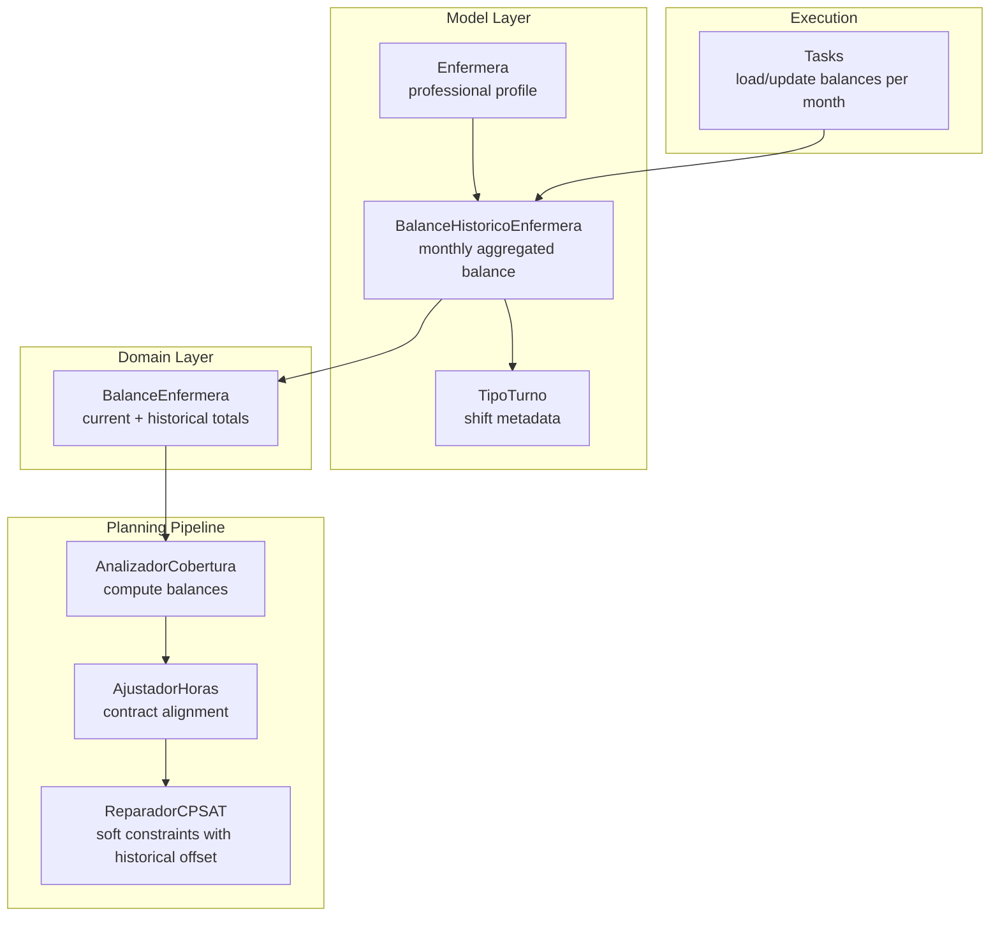
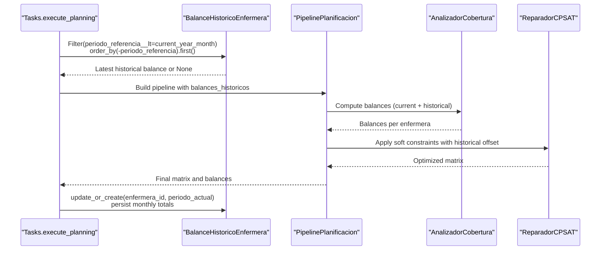
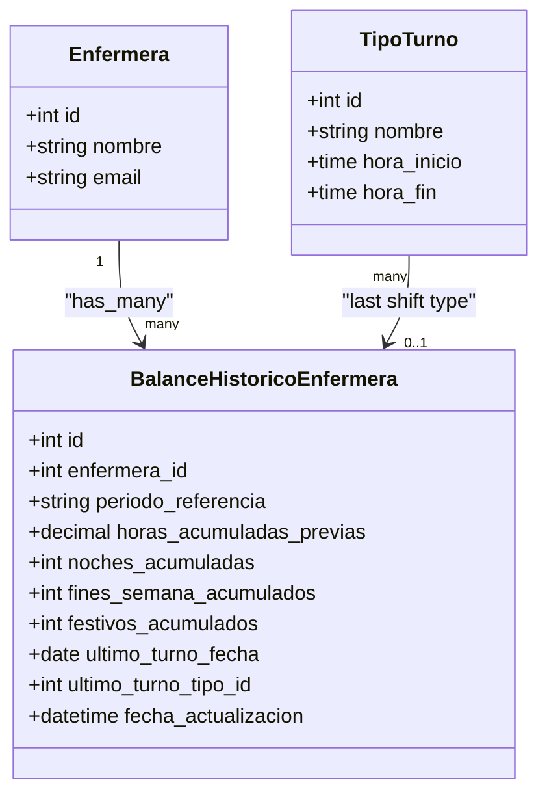
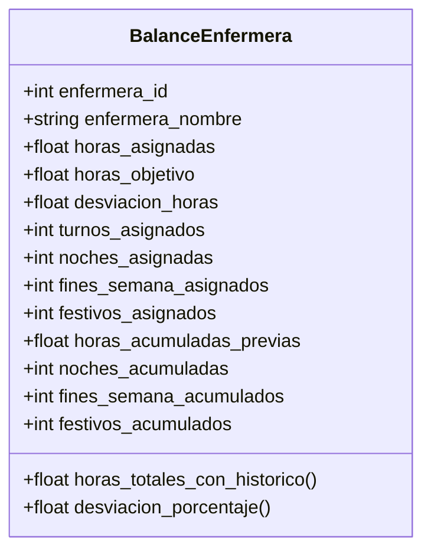
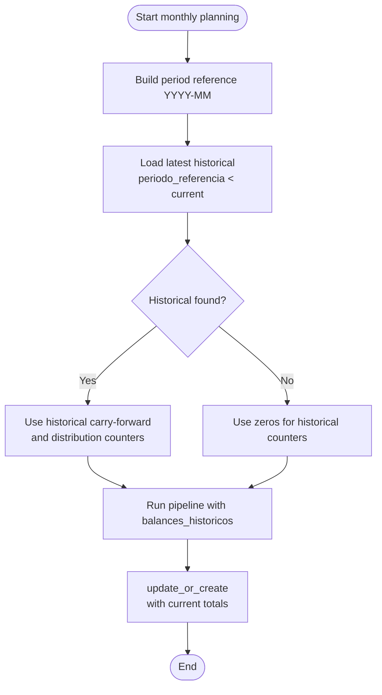
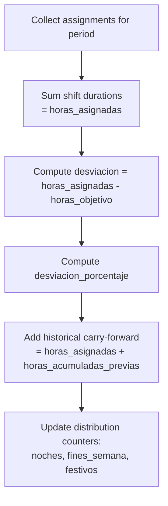
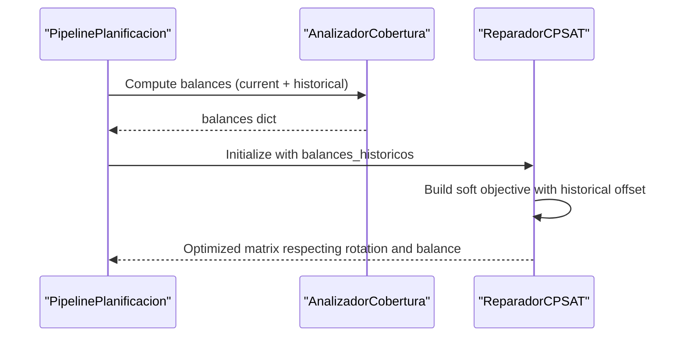

# Historical Balance Tracking

<cite>
**Referenced Files in This Document**
- [models.py](file://turnos/models.py)
- [tasks.py](file://turnos/tasks.py)
- [admin.py](file://turnos/admin.py)
- [dtos.py](file://turnos/dominio/dtos.py)
- [pipeline.py](file://turnos/motor/pipeline.py)
- [cobertura.py](file://turnos/motor/cobertura.py)
- [ajuste_horas.py](file://turnos/motor/ajuste_horas.py)
- [reparador.py](file://turnos/motor/reparador.py)
- [test_integracion_final.py](file://turnos/tests/test_motor/test_integracion_final.py)
- [test_reparador.py](file://turnos/tests/test_motor/test_reparador.py)
- [test_dtos.py](file://turnos/tests/test_dominio/test_dtos.py)
- [0011_alter_balancehistoricoenfermera_periodo_referencia.py](file://turnos/migrations/0011_alter_balancehistoricoenfermera_periodo_referencia.py)
- [README.md](file://README.md)
</cite>

## Table of Contents
1. [Introduction](#introduction)
2. [Project Structure](#project-structure)
3. [Core Components](#core-components)
4. [Architecture Overview](#architecture-overview)
5. [Detailed Component Analysis](#detailed-component-analysis)
6. [Dependency Analysis](#dependency-analysis)
7. [Performance Considerations](#performance-considerations)
8. [Troubleshooting Guide](#troubleshooting-guide)
9. [Conclusion](#conclusion)
10. [Appendices](#appendices)

## Introduction
This document explains the historical balance tracking system centered on the BalanceHistoricoEnfermera model. It details how accumulated work hours and shift distributions are tracked over time to support workload analysis and future planning. The system implements:
- Monthly aggregation of historical balances keyed by period_reference (YYYY-MM)
- Contextual balance calculation integrated into planning metrics and solver objectives
- Influence on scheduling decisions to prevent over/under working conditions
- Examples for different scenarios (new hires, contract changes, career transitions)
- Data retention considerations and integration with soft constraints in the planning algorithm

## Project Structure
The historical balance system spans models, domain DTOs, planning pipeline stages, and persistence logic:
- Model layer: BalanceHistoricoEnfermera persists monthly aggregated balances
- Domain layer: BalanceEnfermera DTO aggregates current-period metrics and historical offsets
- Planning pipeline: Cobertura computes balances, AjusteHoras aligns with contractual targets, ReparadorCPSAT incorporates historical offsets into soft objectives
- Execution layer: Tasks orchestrates monthly balance retrieval and updates

**Diagram sources**
- [models.py:787-824](file://turnos/models.py#L787-L824)
- [dtos.py:134-166](file://turnos/dominio/dtos.py#L134-L166)
- [cobertura.py:75-124](file://turnos/motor/cobertura.py#L75-L124)
- [ajuste_horas.py:46-88](file://turnos/motor/ajuste_horas.py#L46-L88)
- [reparador.py:376-438](file://turnos/motor/reparador.py#L376-L438)
- [tasks.py:522-673](file://turnos/tasks.py#L522-L673)

**Section sources**
- [models.py:787-824](file://turnos/models.py#L787-L824)
- [dtos.py:134-166](file://turnos/dominio/dtos.py#L134-L166)
- [pipeline.py:92-234](file://turnos/motor/pipeline.py#L92-L234)
- [tasks.py:522-673](file://turnos/tasks.py#L522-L673)

## Core Components
- BalanceHistoricoEnfermera: Monthly snapshot of accumulated hours and distribution counters for a professional
- BalanceEnfermera: DTO combining current-period assignments with historical offsets for reporting and solver objectives
- Pipeline stages: Cobertura calculates per-period metrics; AjustadorHoras aligns with contractual targets; ReparadorCPSAT applies historical offsets as soft penalties
- Execution orchestration: Tasks loads the latest historical balance before planning and persists the computed monthly totals after completion

Key behaviors:
- Period reference format: YYYY-MM (lexicographic ordering enables previous-period selection)
- Historical hours influence solver soft objectives but do not alter monthly target comparisons
- Distribution counters (nights, weekends, holidays) support balanced scheduling across categories

**Section sources**
- [models.py:787-824](file://turnos/models.py#L787-L824)
- [dtos.py:134-166](file://turnos/dominio/dtos.py#L134-L166)
- [cobertura.py:75-124](file://turnos/motor/cobertura.py#L75-L124)
- [reparador.py:376-438](file://turnos/motor/reparador.py#L376-L438)
- [tasks.py:522-673](file://turnos/tasks.py#L522-L673)

## Architecture Overview
The historical balance system integrates across three planes:
- Persistence plane: BalanceHistoricoEnfermera stores monthly balances with unique constraint on (enfermera, periodo_referencia)
- Planning plane: BalanceEnfermera DTOs carry current and historical metrics; pipeline stages compute and apply them
- Execution plane: Tasks coordinates monthly balance retrieval and updates

**Diagram sources**
- [tasks.py:522-673](file://turnos/tasks.py#L522-L673)
- [pipeline.py:92-234](file://turnos/motor/pipeline.py#L92-L234)
- [cobertura.py:46-73](file://turnos/motor/cobertura.py#L46-L73)
- [reparador.py:376-438](file://turnos/motor/reparador.py#L376-L438)

## Detailed Component Analysis

### BalanceHistoricoEnfermera Model
- Purpose: Store monthly aggregated work metrics for contextual planning
- Fields:
  - periodo_referencia: monthly key in YYYY-MM format
  - horas_acumuladas_previas: accumulated hours carried forward
  - noches_acumuladas, fines_semana_acumulados, festivos_acumulados: distribution counters
  - ultimo_turno_fecha, ultimo_turno_tipo: last shift metadata
  - fecha_actualizacion: auto-updated timestamp
- Constraints: unique_together(enfermera, periodo_referencia)

**Diagram sources**
- [models.py:30-58](file://turnos/models.py#L30-L58)
- [models.py:60-107](file://turnos/models.py#L60-L107)
- [models.py:787-824](file://turnos/models.py#L787-L824)

**Section sources**
- [models.py:787-824](file://turnos/models.py#L787-L824)
- [0011_alter_balancehistoricoenfermera_periodo_referencia.py:13-17](file://turnos/migrations/0011_alter_balancehistoricoenfermera_periodo_referencia.py#L13-L17)

### BalanceEnfermera DTO
- Purpose: Internal representation combining current-period metrics with historical offsets
- Key properties:
  - horas_totales_con_historico: current hours plus historical carry-forward
  - desviacion_porcentaje: deviation percentage against monthly target
- Used across pipeline stages for reporting and solver objectives

**Diagram sources**
- [dtos.py:134-166](file://turnos/dominio/dtos.py#L134-L166)

**Section sources**
- [dtos.py:134-166](file://turnos/dominio/dtos.py#L134-L166)
- [test_dtos.py:93-126](file://turnos/tests/test_dominio/test_dtos.py#L93-L126)

### Monthly Aggregation and Period Reference
- Period reference format: YYYY-MM (supports lexicographic ordering)
- Retrieval logic selects the most recent historical record strictly before the current planning period
- After planning, the system persists a new monthly record with updated totals

**Diagram sources**
- [tasks.py:522-545](file://turnos/tasks.py#L522-L545)
- [tasks.py:668-673](file://turnos/tasks.py#L668-L673)

**Section sources**
- [tasks.py:522-545](file://turnos/tasks.py#L522-L545)
- [tasks.py:668-673](file://turnos/tasks.py#L668-L673)
- [0011_alter_balancehistoricoenfermera_periodo_referencia.py:13-17](file://turnos/migrations/0011_alter_balancehistoricoenfermera_periodo_referencia.py#L13-L17)

### Balance Calculation Methodologies
- Current-period hours: sum of assigned shifts’ durations
- Historical offset: added to total workload for reporting and solver soft objectives
- Deviation metrics: current hours minus monthly target; percentage derived from target
- Distribution counters: nights, weekend days, and holidays are tallied for balanced scheduling

**Diagram sources**
- [cobertura.py:75-124](file://turnos/motor/cobertura.py#L75-L124)
- [dtos.py:157-166](file://turnos/dominio/dtos.py#L157-L166)

**Section sources**
- [cobertura.py:75-124](file://turnos/motor/cobertura.py#L75-L124)
- [dtos.py:157-166](file://turnos/dominio/dtos.py#L157-L166)

### Integration with Planning Soft Constraints
- Historical hours influence solver soft objectives by acting as an offset that encourages balancing inter-monthly workload
- Monthly targets remain independent of historical totals; solver compares current-period assignments against the monthly objective
- Weights in the solver emphasize maintaining rotation patterns while balancing hours and distributions

**Diagram sources**
- [pipeline.py:156-186](file://turnos/motor/pipeline.py#L156-L186)
- [reparador.py:376-438](file://turnos/motor/reparador.py#L376-L438)

**Section sources**
- [pipeline.py:156-186](file://turnos/motor/pipeline.py#L156-L186)
- [reparador.py:376-438](file://turnos/motor/reparador.py#L376-L438)
- [test_integracion_final.py:942-1007](file://turnos/tests/test_motor/test_integracion_final.py#L942-L1007)

### Scenario Examples

#### New Hire
- Initial state: no historical balance
- Behavior: pipeline runs with zero historical counters; monthly objective is met purely by current-period assignments
- Outcome: first monthly record captures actual hours worked and distribution counts

**Section sources**
- [tasks.py:522-545](file://turnos/tasks.py#L522-L545)
- [test_integracion_final.py:597-605](file://turnos/tests/test_motor/test_integracion_final.py#L597-L605)

#### Contract Change
- Scenario: change in monthly target hours (e.g., from 160 to 180)
- Behavior: historical carry-forward remains unchanged; solver targets new monthly objective
- Outcome: historical offset continues to influence soft balance objectives; deviations reflect current-period adjustments

**Section sources**
- [reparador.py:427-438](file://turnos/motor/reparador.py#L427-L438)
- [test_integracion_final.py:942-1007](file://turnos/tests/test_motor/test_integracion_final.py#L942-L1007)

#### Career Transition
- Scenario: change in shift pattern affecting distribution counters (nights, weekends, holidays)
- Behavior: distribution counters are recomputed monthly; historical counters inform balanced scheduling
- Outcome: solver soft constraints promote equitable distribution across categories

**Section sources**
- [cobertura.py:75-124](file://turnos/motor/cobertura.py#L75-L124)
- [reparador.py:301-307](file://turnos/motor/reparador.py#L301-L307)

### Data Retention Policies
- Historical balances are stored per month; there is no automated cleanup policy in the referenced code
- Administrative interface exposes list filters by period and update timestamp
- Recommendation: implement periodic archival or pruning based on organizational policy to control storage growth

**Section sources**
- [admin.py:417-448](file://turnos/admin.py#L417-L448)

## Dependency Analysis
The historical balance system exhibits clear separation of concerns:
- Models define persistence and uniqueness constraints
- DTOs encapsulate computation and reporting logic
- Pipeline stages coordinate planning and solver integration
- Tasks orchestrate end-to-end monthly lifecycle

**Diagram sources**
- [models.py:787-824](file://turnos/models.py#L787-L824)
- [dtos.py:134-166](file://turnos/dominio/dtos.py#L134-L166)
- [cobertura.py:46-73](file://turnos/motor/cobertura.py#L46-L73)
- [ajuste_horas.py:46-88](file://turnos/motor/ajuste_horas.py#L46-L88)
- [reparador.py:376-438](file://turnos/motor/reparador.py#L376-L438)
- [tasks.py:522-673](file://turnos/tasks.py#L522-L673)

**Section sources**
- [models.py:787-824](file://turnos/models.py#L787-L824)
- [dtos.py:134-166](file://turnos/dominio/dtos.py#L134-L166)
- [pipeline.py:92-234](file://turnos/motor/pipeline.py#L92-L234)
- [tasks.py:522-673](file://turnos/tasks.py#L522-L673)

## Performance Considerations
- Monthly retrieval leverages lexicographic ordering; ensure appropriate indexing on periodo_referencia for efficient lookups
- Historical updates use update_or_create; batch operations during bulk planning can reduce database round-trips
- Solver soft objectives scale with problem size; monitor solver runtime and adjust weights as needed

## Troubleshooting Guide
Common issues and resolutions:
- Missing historical balance: pipeline gracefully handles absence; verify periodo_referencia format and ensure prior month records exist
- Incorrect period reference: confirm YYYY-MM format; lexicographic comparison requires consistent formatting
- Unexpected deviations: check monthly target configuration and verify that historical offset does not inadvertently bias monthly comparisons
- Admin filtering: use period filters and update timestamps to locate problematic entries

**Section sources**
- [tasks.py:522-545](file://turnos/tasks.py#L522-L545)
- [admin.py:417-448](file://turnos/admin.py#L417-L448)
- [test_integracion_final.py:597-605](file://turnos/tests/test_motor/test_integracion_final.py#L597-L605)

## Conclusion
The historical balance tracking system provides a robust foundation for workload analysis and future planning. By separating monthly targets from cumulative carry-forward, it ensures fair and predictable scheduling while leveraging historical context to maintain balanced distributions. The integration across models, DTOs, pipeline stages, and execution tasks delivers a cohesive solution that supports diverse operational scenarios.

## Appendices

### API and Field Definitions
- BalanceHistoricoEnfermera
  - enfermera: ForeignKey(Enfermera)
  - periodo_referencia: CharField(YYYY-MM)
  - horas_acumuladas_previas: DecimalField
  - noches_acumuladas: IntegerField
  - fines_semana_acumulados: IntegerField
  - festivos_acumulados: IntegerField
  - ultimo_turno_fecha: DateField
  - ultimo_turno_tipo: ForeignKey(TipoTurno)
  - fecha_actualizacion: DateTimeField

**Section sources**
- [models.py:787-824](file://turnos/models.py#L787-L824)

### Example Workflows
- New hire: no historical balance; first month establishes baseline
- Contract change: monthly target updates; historical offset preserved
- Career transition: distribution counters evolve; solver adapts to new patterns

**Section sources**
- [tasks.py:522-545](file://turnos/tasks.py#L522-L545)
- [reparador.py:376-438](file://turnos/motor/reparador.py#L376-L438)
- [test_integracion_final.py:942-1007](file://turnos/tests/test_motor/test_integracion_final.py#L942-L1007)