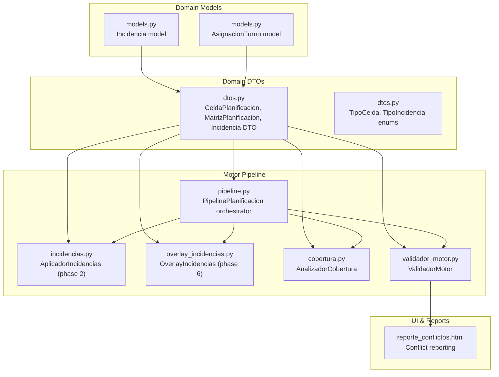
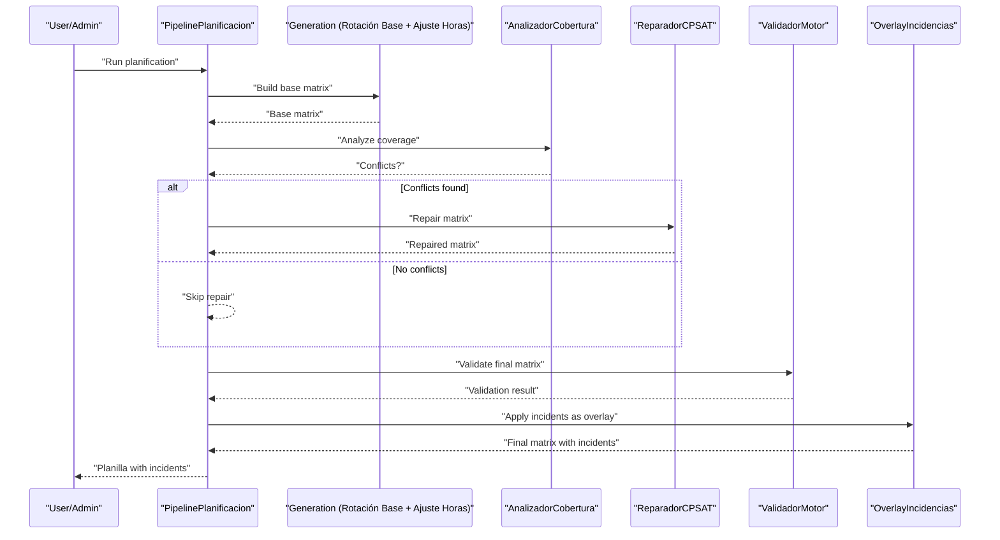
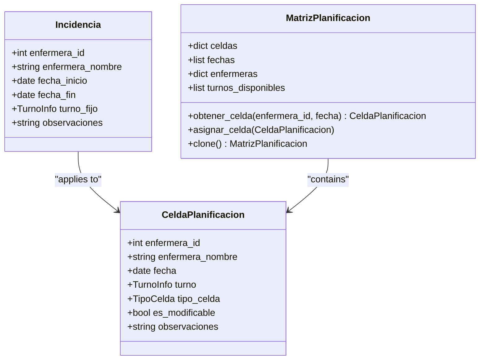
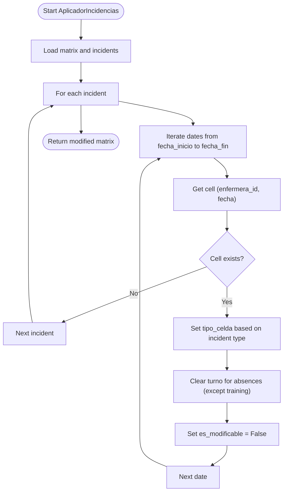
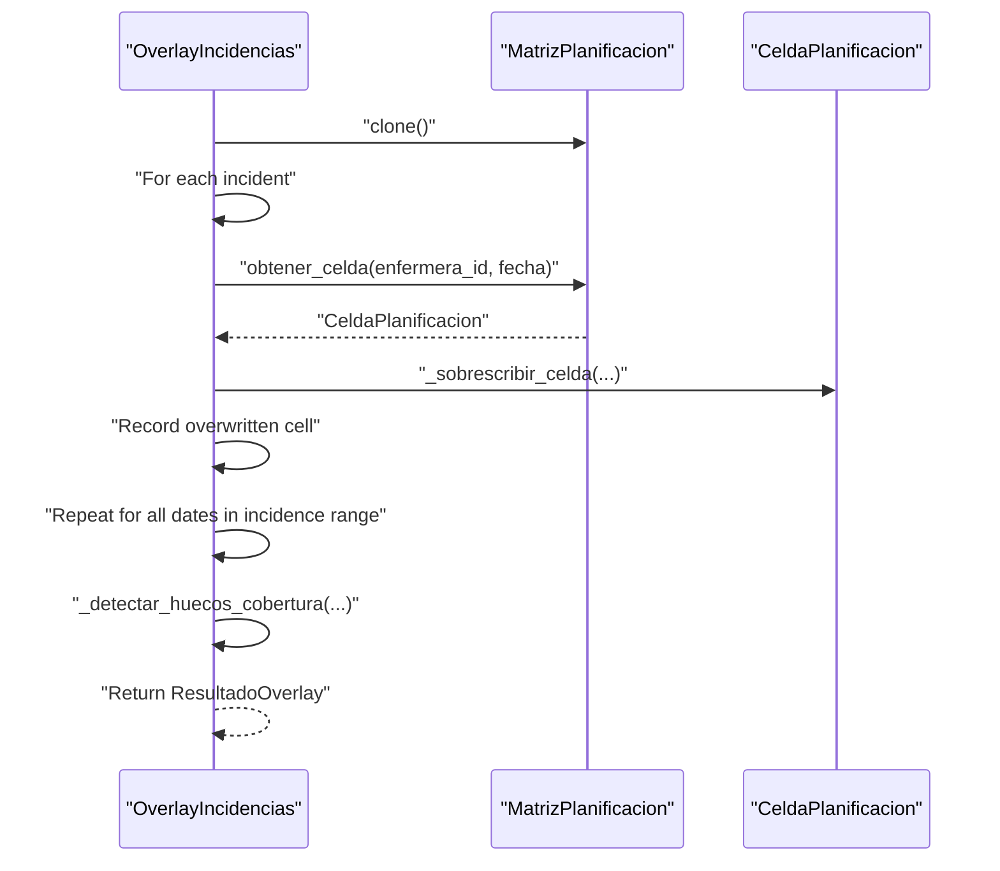
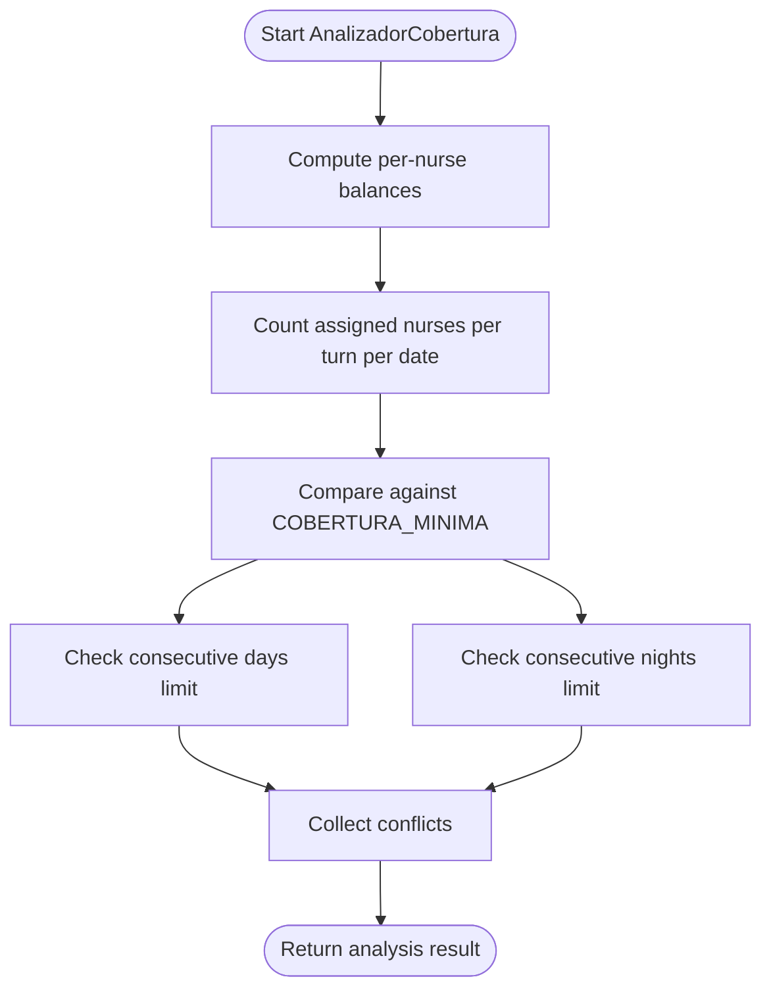
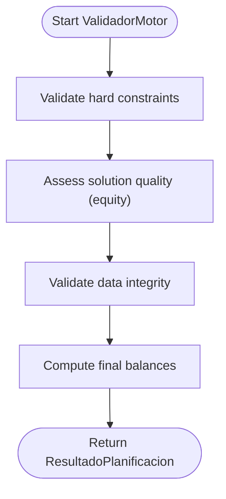
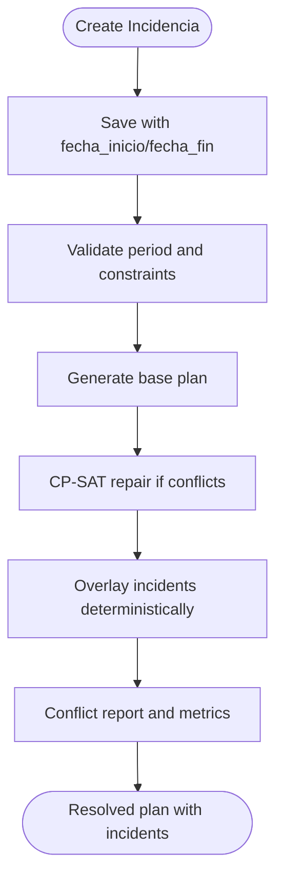
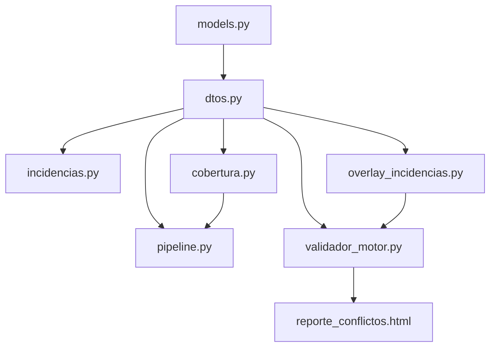

# Incident Management System

<cite>
**Referenced Files in This Document**
- [models.py](file://turnos/models.py)
- [incidencias.py](file://turnos/motor/incidencias.py)
- [overlay_incidencias.py](file://turnos/motor/overlay_incidencias.py)
- [dtos.py](file://turnos/dominio/dtos.py)
- [vocabulario.py](file://turnos/dominio/vocabulario.py)
- [pipeline.py](file://turnos/motor/pipeline.py)
- [cobertura.py](file://turnos/motor/cobertura.py)
- [validador_motor.py](file://turnos/motor/validador_motor.py)
- [simular_planificacion.py](file://turnos/management/commands/simular_planificacion.py)
- [reporte_conflictos.html](file://turnos/templates/turnos/reporte_conflictos.html)
</cite>

## Table of Contents
1. [Introduction](#introduction)
2. [Project Structure](#project-structure)
3. [Core Components](#core-components)
4. [Architecture Overview](#architecture-overview)
5. [Detailed Component Analysis](#detailed-component-analysis)
6. [Dependency Analysis](#dependency-analysis)
7. [Performance Considerations](#performance-considerations)
8. [Troubleshooting Guide](#troubleshooting-guide)
9. [Conclusion](#conclusion)

## Introduction
This document explains the incident management system within the scheduling platform, focusing on the Incidencia model and its integration with the constraint satisfaction pipeline. It covers how different absence types (vacations, sick leave, training, fixed assignments) are modeled and applied, how the incident lifecycle interacts with the solver, and how conflicts with planned shifts are resolved. It also documents date range validation, overlap detection, and practical examples of incident configurations.

## Project Structure
The incident management system spans domain models, DTOs, and the execution pipeline:
- Domain models define Incidencia and related enumerations and types.
- DTOs define the internal representation of cells, matrices, and incident data used by the solver.
- Motor modules orchestrate generation, overlay, and validation phases.
- Templates present conflict reports and summaries.

**Diagram sources**
- [models.py:749-785](file://turnos/models.py#L749-L785)
- [dtos.py:61-274](file://turnos/dominio/dtos.py#L61-L274)
- [pipeline.py:31-267](file://turnos/motor/pipeline.py#L31-L267)
- [incidencias.py:21-98](file://turnos/motor/incidencias.py#L21-L98)
- [overlay_incidencias.py:24-205](file://turnos/motor/overlay_incidencias.py#L24-L205)
- [cobertura.py:21-208](file://turnos/motor/cobertura.py#L21-L208)
- [validador_motor.py:23-451](file://turnos/motor/validador_motor.py#L23-L451)
- [reporte_conflictos.html:84-186](file://turnos/templates/turnos/reporte_conflictos.html#L84-L186)

**Section sources**
- [models.py:749-785](file://turnos/models.py#L749-L785)
- [dtos.py:61-274](file://turnos/dominio/dtos.py#L61-L274)
- [pipeline.py:31-267](file://turnos/motor/pipeline.py#L31-L267)

## Core Components
- Incidencia model: Stores absence/fixed-assignment events per nurse with date range and type.
- DTO Incidencia: Internal representation for solver pipeline stages.
- AplicadorIncidencias: Phase 2 modifier that marks cells as non-modifiable and sets cell types for active incidents.
- OverlayIncidencias: Phase 6 post-generation overlay that applies incidents deterministically after solver completion.
- AnalizadorCobertura: Computes coverage and detects conflicts before solver repair.
- ValidadorMotor: Final validation ensuring hard constraints are satisfied and generating balances.

**Section sources**
- [models.py:749-785](file://turnos/models.py#L749-L785)
- [dtos.py:169-181](file://turnos/dominio/dtos.py#L169-L181)
- [incidencias.py:21-98](file://turnos/motor/incidencias.py#L21-L98)
- [overlay_incidencias.py:24-205](file://turnos/motor/overlay_incidencias.py#L24-L205)
- [cobertura.py:21-208](file://turnos/motor/cobertura.py#L21-L208)
- [validador_motor.py:23-451](file://turnos/motor/validador_motor.py#L23-L451)

## Architecture Overview
The system separates automatic generation from incident application:
- Automatic generation produces regular shifts using rotation base, hours adjustment, and solver repair.
- Incidents are applied as overlays after generation, preserving solver optimality while reflecting planned absences.

**Diagram sources**
- [pipeline.py:92-246](file://turnos/motor/pipeline.py#L92-L246)
- [cobertura.py:46-73](file://turnos/motor/cobertura.py#L46-L73)
- [validador_motor.py:48-86](file://turnos/motor/validador_motor.py#L48-L86)
- [overlay_incidencias.py:45-75](file://turnos/motor/overlay_incidencias.py#L45-L75)

## Detailed Component Analysis

### Incidencia Model and Types
- Supported types include vacations, permission, sick leave, training, blocked assignment, and fixed assignment.
- Each Incidencia defines a date range and optionally a fixed shift for fixed assignment.
- AsignacionTurno integrates cell types to reflect incident outcomes (e.g., VACACIONES, PERMISO, BAJA, FORMACION, ASIGNACION_FIJA).

**Diagram sources**
- [models.py:749-785](file://turnos/models.py#L749-L785)
- [dtos.py:61-238](file://turnos/dominio/dtos.py#L61-L238)

**Section sources**
- [models.py:749-785](file://turnos/models.py#L749-L785)
- [dtos.py:169-181](file://turnos/dominio/dtos.py#L169-L181)

### Incident Application Phases

#### Phase 2: AplicadorIncidencias (during generation)
- Iterates over the date range of each incident and marks affected cells as non-modifiable.
- Sets cell type according to incident type (e.g., VACACIONES, PERMISO, BAJA, FORMACION, ASIGNACION_FIJA).
- Clears turnos for most absence types to prevent solver interference during generation.

**Diagram sources**
- [incidencias.py:37-98](file://turnos/motor/incidencias.py#L37-L98)

**Section sources**
- [incidencias.py:21-98](file://turnos/motor/incidencias.py#L21-L98)

#### Phase 6: OverlayIncidencias (post-generation)
- Creates a deep clone of the finalized matrix and applies incidents deterministically.
- Tracks overwritten cells and computes coverage deficits caused by incidents.
- Preserves solver optimality while reflecting planned absences.

**Diagram sources**
- [overlay_incidencias.py:45-205](file://turnos/motor/overlay_incidencias.py#L45-L205)

**Section sources**
- [overlay_incidencias.py:24-205](file://turnos/motor/overlay_incidencias.py#L24-L205)

### Coverage Analysis and Conflict Detection
- AnalizadorCobertura computes per-turno counts and compares against configured minimums.
- Detects consecutive day violations and consecutive night violations.
- Provides conflict lists for downstream repair or validation.

**Diagram sources**
- [cobertura.py:46-208](file://turnos/motor/cobertura.py#L46-L208)

**Section sources**
- [cobertura.py:21-208](file://turnos/motor/cobertura.py#L21-L208)

### Validation and Post-Processing
- ValidadorMotor ensures hard constraints are met: one shift per day, consecutive limits, rest periods, and minimum coverage.
- Calculates final balances including historical accumulations.
- Generates warnings for equity metrics and persists validation results.

**Diagram sources**
- [validador_motor.py:48-451](file://turnos/motor/validador_motor.py#L48-L451)

**Section sources**
- [validador_motor.py:23-451](file://turnos/motor/validador_motor.py#L23-L451)

### Incident Lifecycle and Overlap Handling
- Creation: Incidencia saved with date range and type.
- Date Range Validation: Occurs at model level and during configuration save; pipeline validates period length and boundaries.
- Overlap Detection: Covered by coverage analyzer and validator; overlapping absences create holes that overlay detects and reports.
- Resolution: Solver repairs coverage deficits; overlay then applies incidents deterministically.

**Diagram sources**
- [models.py:425-456](file://turnos/models.py#L425-L456)
- [pipeline.py:92-246](file://turnos/motor/pipeline.py#L92-L246)
- [overlay_incidencias.py:166-205](file://turnos/motor/overlay_incidencias.py#L166-L205)
- [reporte_conflictos.html:84-186](file://turnos/templates/turnos/reporte_conflictos.html#L84-L186)

**Section sources**
- [models.py:425-456](file://turnos/models.py#L425-L456)
- [pipeline.py:92-246](file://turnos/motor/pipeline.py#L92-L246)
- [overlay_incidencias.py:166-205](file://turnos/motor/overlay_incidencias.py#L166-L205)
- [reporte_conflictos.html:84-186](file://turnos/templates/turnos/reporte_conflictos.html#L84-L186)

### Examples of Incident Configurations
- Vacations: Full-day absence; cell becomes non-modifiable and type is VACACIONES.
- Sick Leave: Full-day absence; cell becomes non-modifiable and type is BAJA.
- Permission: Full-day absence; cell becomes non-modifiable and type is PERMISO.
- Training: May retain existing shift; cell becomes non-modifiable and type is FORMACION.
- Fixed Assignment: Assigns a specific shift; cell becomes non-modifiable and type is ASIGNACION_FIJA.
- Blocked Assignment: Treats as a free day; cell becomes non-modifiable and type is LIBRE.

These behaviors are implemented consistently across AplicadorIncidencias (phase 2) and OverlayIncidencias (phase 6).

**Section sources**
- [incidencias.py:57-91](file://turnos/motor/incidencias.py#L57-L91)
- [overlay_incidencias.py:109-151](file://turnos/motor/overlay_incidencias.py#L109-L151)
- [vocabulario.py:63-70](file://turnos/dominio/vocabulario.py#L63-L70)

### Interaction with the Constraint Satisfaction Solver
- Generation phase produces regular shifts only; incidents are not part of solver constraints.
- OverlayIncidencias applies incidents after solver completion, ensuring optimality remains intact while reflecting planned absences.
- Coverage analyzer and validator enforce hard constraints; solver handles soft objectives.

**Section sources**
- [pipeline.py:42-99](file://turnos/motor/pipeline.py#L42-L99)
- [overlay_incidencias.py:24-75](file://turnos/motor/overlay_incidencias.py#L24-L75)
- [validador_motor.py:88-105](file://turnos/motor/validador_motor.py#L88-L105)

## Dependency Analysis
- Domain models depend on Django ORM and define constraints for turn types and incidence semantics.
- DTOs decouple the solver from Django models and define canonical types for cells, incidents, and matrices.
- Pipeline orchestrates phases and passes DTOs between components.
- OverlayIncidencias depends on turn metadata and coverage configuration to compute deficits.

**Diagram sources**
- [models.py:749-785](file://turnos/models.py#L749-L785)
- [dtos.py:61-274](file://turnos/dominio/dtos.py#L61-L274)
- [pipeline.py:31-267](file://turnos/motor/pipeline.py#L31-L267)
- [incidencias.py:21-98](file://turnos/motor/incidencias.py#L21-L98)
- [overlay_incidencias.py:24-205](file://turnos/motor/overlay_incidencias.py#L24-L205)
- [cobertura.py:21-208](file://turnos/motor/cobertura.py#L21-L208)
- [validador_motor.py:23-451](file://turnos/motor/validador_motor.py#L23-L451)
- [reporte_conflictos.html:84-186](file://turnos/templates/turnos/reporte_conflictos.html#L84-L186)

**Section sources**
- [models.py:749-785](file://turnos/models.py#L749-L785)
- [dtos.py:61-274](file://turnos/dominio/dtos.py#L61-L274)
- [pipeline.py:31-267](file://turnos/motor/pipeline.py#L31-L267)
- [overlay_incidencias.py:24-205](file://turnos/motor/overlay_incidencias.py#L24-L205)
- [validador_motor.py:23-451](file://turnos/motor/validador_motor.py#L23-L451)

## Performance Considerations
- OverlayIncidencias clones the matrix; memory usage scales with number of nurses × days.
- Coverage analysis iterates over all dates and cells; keep date ranges reasonable.
- Solver repair is invoked only when conflicts are detected; avoid unnecessary long ranges.

[No sources needed since this section provides general guidance]

## Troubleshooting Guide
- Incidences not appearing: Verify overlay phase executed and matrix was cloned before applying.
- Coverage deficits after overlay: Review huecos_cobertura reported by overlay and adjust coverage minimums or planned absences.
- Violations after validation: Check hard constraint violations reported by ValidadorMotor and adjust restrictions or distribution.
- Conflict reports: Use the conflict report template to review severities and suggested resolutions.

**Section sources**
- [overlay_incidencias.py:166-205](file://turnos/motor/overlay_incidencias.py#L166-L205)
- [validador_motor.py:88-105](file://turnos/motor/validador_motor.py#L88-L105)
- [reporte_conflictos.html:84-186](file://turnos/templates/turnos/reporte_conflictos.html#L84-L186)

## Conclusion
The incident management system cleanly separates automatic shift generation from incident application. Incidencias are modeled consistently across DTOs and applied deterministically via overlay after solver completion. Coverage analysis and validation ensure hard constraints remain satisfied, while reporting provides actionable insights for conflict resolution and planning adjustments.