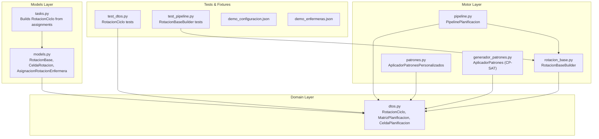
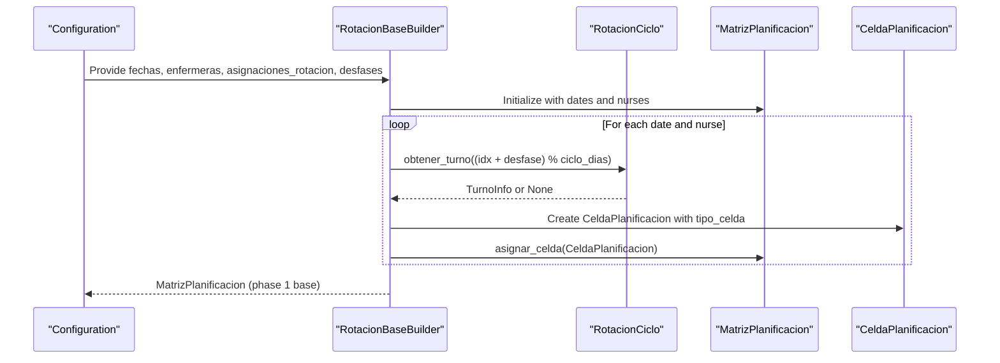
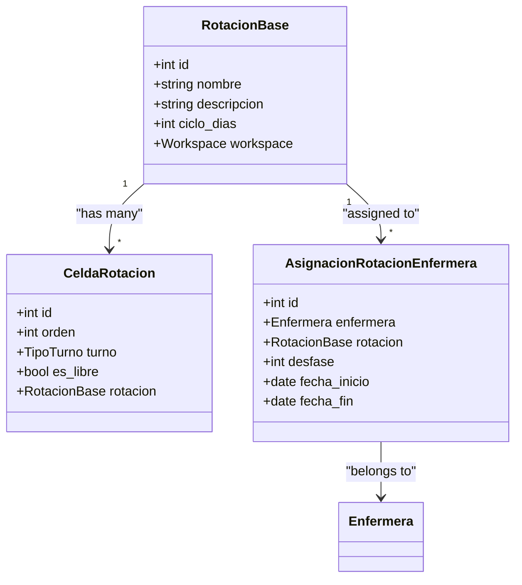
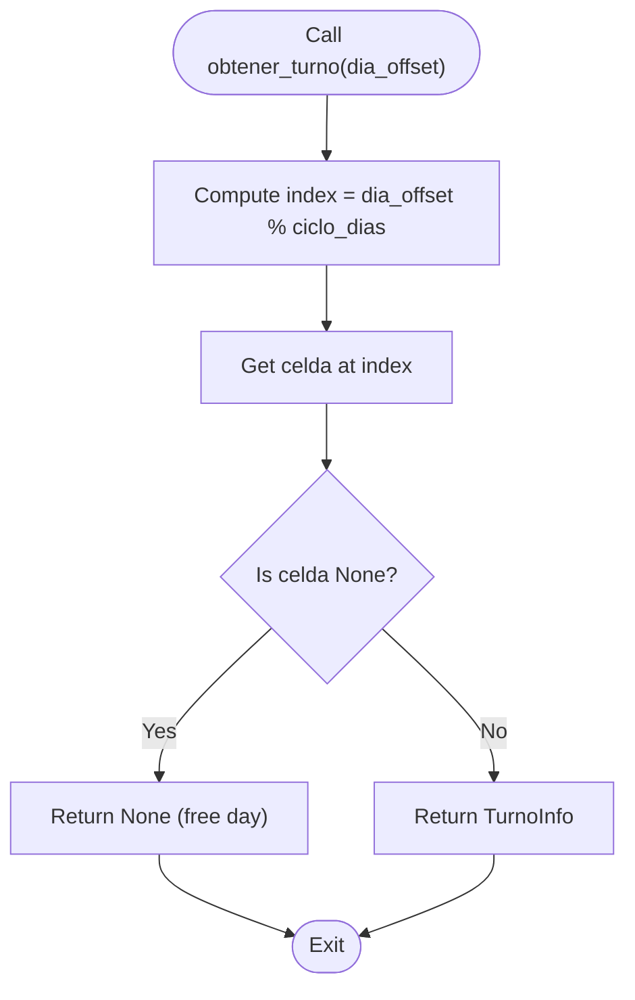
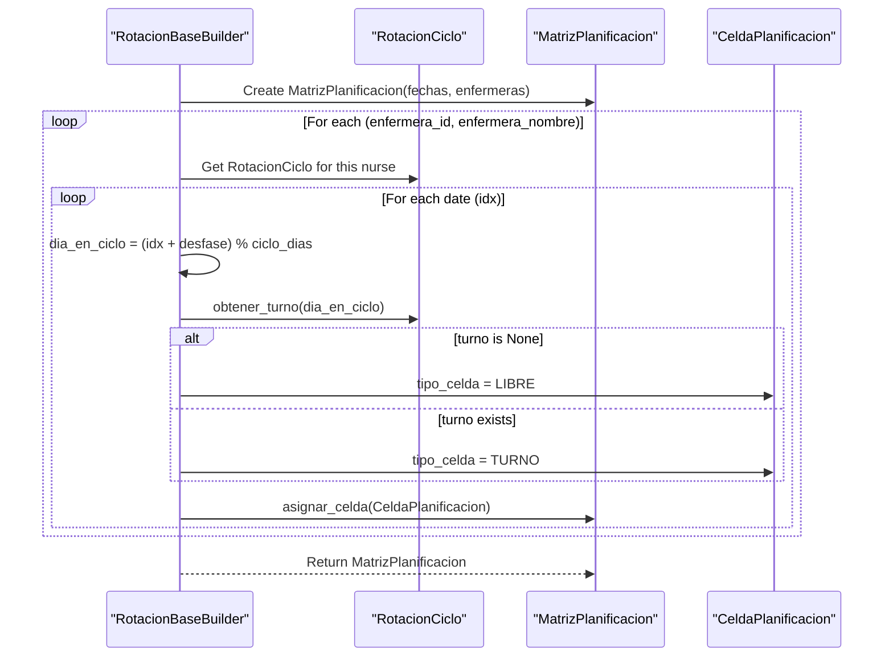
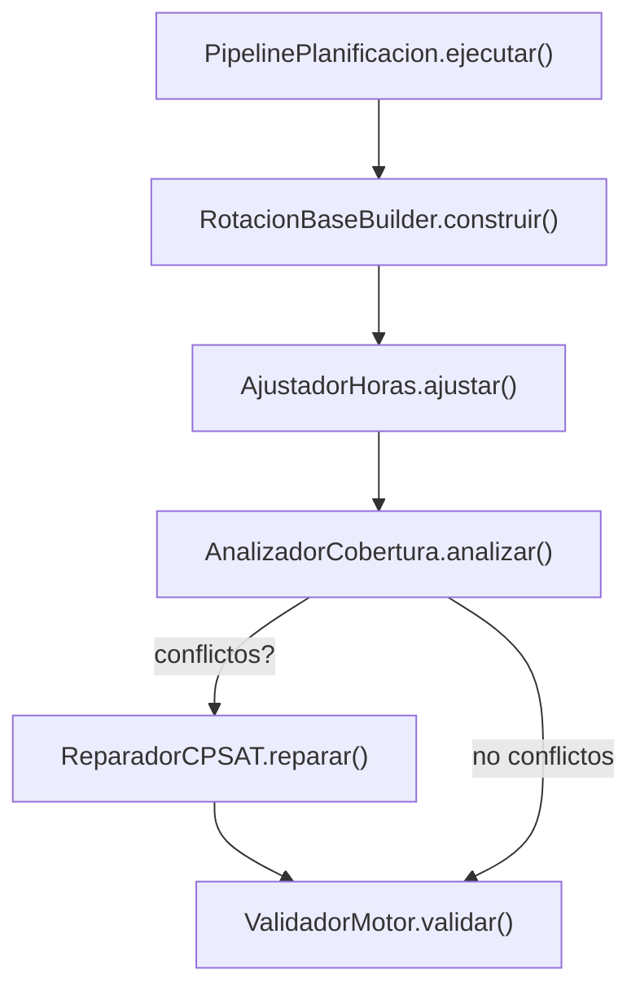
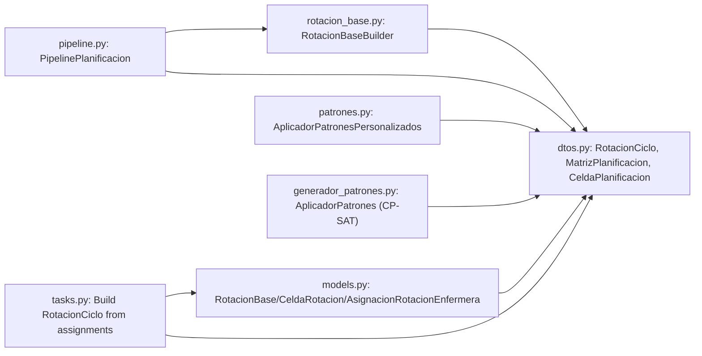

# Rotation Cycle System

<cite>
**Referenced Files in This Document**
- [rotacion_base.py](file://turnos/motor/rotacion_base.py)
- [models.py](file://turnos/models.py)
- [dtos.py](file://turnos/dominio/dtos.py)
- [pipeline.py](file://turnos/motor/pipeline.py)
- [patrones.py](file://turnos/patrones.py)
- [generador_patrones.py](file://turnos/generador_patrones.py)
- [tasks.py](file://turnos/tasks.py)
- [test_dtos.py](file://turnos/tests/test_dominio/test_dtos.py)
- [test_pipeline.py](file://turnos/tests/test_motor/test_pipeline.py)
- [demo_configuracion.json](file://turnos/fixtures/demo_configuracion.json)
- [demo_enfermeras.json](file://turnos/fixtures/demo_enfermeras.json)
</cite>

## Table of Contents
1. [Introduction](#introduction)
2. [Project Structure](#project-structure)
3. [Core Components](#core-components)
4. [Architecture Overview](#architecture-overview)
5. [Detailed Component Analysis](#detailed-component-analysis)
6. [Dependency Analysis](#dependency-analysis)
7. [Performance Considerations](#performance-considerations)
8. [Troubleshooting Guide](#troubleshooting-guide)
9. [Conclusion](#conclusion)

## Introduction
This document explains the rotation cycle system that defines deterministic, cyclic shift patterns for nurses and generates the base schedule matrix. It focuses on three core domain constructs:
- RotacionBase: database model representing explicit repeating cycles
- CeldaRotacion: per-cycle cells mapping days to turns or free days
- AsignacionRotacionEnfermera: assignment of a specific cycle to a nurse with a day offset (desfase)

It also documents how the system computes day offsets within cycles, how cycle durations are managed, and how the assignment mechanism enables nurses to start at different positions within the rotation cycle. Examples include day-night alternation and three-shift rotating patterns, along with guidance for configuring complex multi-pattern rotations. Finally, it covers performance considerations for large-scale deployments.

## Project Structure
The rotation system spans domain DTOs, motor builders, Django models, and pipeline orchestration:

**Diagram sources**
- [rotacion_base.py:21-94](file://turnos/motor/rotacion_base.py#L21-L94)
- [models.py:666-747](file://turnos/models.py#L666-L747)
- [dtos.py:184-238](file://turnos/dominio/dtos.py#L184-L238)
- [pipeline.py:31-267](file://turnos/motor/pipeline.py#L31-L267)
- [patrones.py:8-276](file://turnos/patrones.py#L8-L276)
- [generador_patrones.py:7-231](file://turnos/generador_patrones.py#L7-L231)
- [tasks.py:465-496](file://turnos/tasks.py#L465-L496)
- [test_dtos.py:145-184](file://turnos/tests/test_dominio/test_dtos.py#L145-L184)
- [test_pipeline.py:84-141](file://turnos/tests/test_motor/test_pipeline.py#L84-L141)

**Section sources**
- [rotacion_base.py:1-94](file://turnos/motor/rotacion_base.py#L1-L94)
- [models.py:666-747](file://turnos/models.py#L666-L747)
- [dtos.py:184-238](file://turnos/dominio/dtos.py#L184-L238)
- [pipeline.py:31-267](file://turnos/motor/pipeline.py#L31-L267)
- [patrones.py:8-276](file://turnos/patrones.py#L8-L276)
- [generador_patrones.py:7-231](file://turnos/generador_patrones.py#L7-L231)
- [tasks.py:465-496](file://turnos/tasks.py#L465-L496)
- [test_dtos.py:145-184](file://turnos/tests/test_dominio/test_dtos.py#L145-L184)
- [test_pipeline.py:84-141](file://turnos/tests/test_motor/test_pipeline.py#L84-L141)

## Core Components
- RotacionBase (Django model): Defines an explicit repeating cycle with a fixed number of days (ciclo_dias). It serves as the canonical definition of the pattern stored in the database.
- CeldaRotacion (Django model): Represents each position within the cycle, mapping an integer order (0-based) to either a specific turn or a free day (es_libre).
- AsignacionRotacionEnfermera (Django model): Assigns a specific RotacionBase to a nurse, with a desfase (offset in days) indicating where in the cycle the nurse starts.
- RotacionCiclo (DTO): A domain object that encapsulates the cycle semantics: a name, cycle length (ciclo_dias), and a list of TurnoInfo entries or None for free days. It exposes obtaining a turn by day offset within the cycle.
- RotacionBaseBuilder: The deterministic builder that creates the initial MatrizPlanificacion by iterating dates and assigning CeldaPlanificacion entries based on the cycle and nurse-specific desfase.
- PipelinePlanificacion: Orchestrates the five-phase pipeline, including the base rotation construction as phase 1.

Key behaviors:
- Day offset calculation: For each date index idx, the builder computes dia_en_ciclo = (idx + desfase) % ciclo_dias and retrieves the corresponding TurnoInfo from RotacionCiclo.
- Cycle duration management: ciclo_dias determines the modulus used for cycling and the length of the repeating pattern.
- Assignment mechanism: Each nurse’s desfase allows her to start at a different position within the cycle, enabling staggered starts across the workforce.

**Section sources**
- [models.py:666-747](file://turnos/models.py#L666-L747)
- [dtos.py:184-194](file://turnos/dominio/dtos.py#L184-L194)
- [rotacion_base.py:41-94](file://turnos/motor/rotacion_base.py#L41-L94)
- [pipeline.py:92-116](file://turnos/motor/pipeline.py#L92-L116)

## Architecture Overview
The rotation cycle system follows a deterministic-first approach:

**Diagram sources**
- [rotacion_base.py:41-94](file://turnos/motor/rotacion_base.py#L41-L94)
- [dtos.py:184-238](file://turnos/dominio/dtos.py#L184-L238)
- [pipeline.py:108-116](file://turnos/motor/pipeline.py#L108-L116)

## Detailed Component Analysis

### RotacionBase, CeldaRotacion, AsignacionRotacionEnfermera
These Django models define the persistent representation of rotation cycles and assignments:

- RotacionBase stores the cycle definition and its duration.
- CeldaRotacion encodes the ordered sequence of turns/free days within the cycle.
- AsignacionRotacionEnfermera links a nurse to a cycle and sets her starting offset.

**Diagram sources**
- [models.py:666-747](file://turnos/models.py#L666-L747)

**Section sources**
- [models.py:666-747](file://turnos/models.py#L666-L747)

### RotacionCiclo (DTO) and Day Offset Calculation
RotacionCiclo encapsulates the cycle logic:

- The modulo operation ensures the cycle repeats seamlessly.
- Free days are represented by None in the celdas list.

**Diagram sources**
- [dtos.py:190-193](file://turnos/dominio/dtos.py#L190-L193)

**Section sources**
- [dtos.py:184-194](file://turnos/dominio/dtos.py#L184-L194)
- [test_dtos.py:145-184](file://turnos/tests/test_dominio/test_dtos.py#L145-L184)

### RotacionBaseBuilder: Building the Base Matrix
RotacionBaseBuilder performs the deterministic assignment:

- The builder marks cells as LIBRE when the cycle specifies a free day or when the TurnoInfo indicates a substitute-free type.
- Cells are flagged as pertenece_rotacion_base to distinguish base assignments from later adjustments.

**Diagram sources**
- [rotacion_base.py:41-94](file://turnos/motor/rotacion_base.py#L41-L94)
- [dtos.py:61-132](file://turnos/dominio/dtos.py#L61-L132)

**Section sources**
- [rotacion_base.py:41-94](file://turnos/motor/rotacion_base.py#L41-L94)
- [test_pipeline.py:128-141](file://turnos/tests/test_motor/test_pipeline.py#L128-L141)

### Pipeline Integration
PipelinePlanificacion orchestrates the generation pipeline and invokes the base rotation builder as the first phase:

- Base rotation is generated deterministically without the solver.
- Subsequent phases adjust hours, analyze coverage, repair conflicts with CP-SAT if needed, and validate the result.

**Diagram sources**
- [pipeline.py:92-234](file://turnos/motor/pipeline.py#L92-L234)

**Section sources**
- [pipeline.py:92-234](file://turnos/motor/pipeline.py#L92-L234)

### Pattern Application and Multi-Pattern Rotations
While the base rotation is deterministic, the system supports additional patterns that can be applied during the CP-SAT phase:

- AplicadorPatronesPersonalizados (domain) applies patterns like rest after consecutive shifts, sequence constraints, equitable distribution, and rotation windows.
- AplicadorPatrones (CP-SAT) applies similar patterns to the CP-SAT model, including hard and soft constraints.

These patterns complement the base rotation by enforcing additional rules (e.g., ensuring minimum rest after consecutive night shifts) while the base rotation maintains the core cyclic structure.

**Section sources**
- [patrones.py:8-276](file://turnos/patrones.py#L8-L276)
- [generador_patrones.py:7-231](file://turnos/generador_patrones.py#L7-L231)

### Example Patterns and Configuration
Common rotation patterns:
- Day-Night alternating: Define a cycle with two cells (e.g., MAÑANA, NOCHE) repeated as needed, with ciclo_dias = 2.
- Three-shift rotating: Define a cycle with three distinct turns (e.g., MAÑANA, TARDE, NOCHE) repeated, with ciclo_dias = 3.
- Mixed patterns: Include free days by inserting None in the cycle list; the builder treats None as LIBRE.

Complex multi-pattern rotations:
- Combine base cycle with CP-SAT patterns (e.g., limit consecutive night shifts, enforce weekly rest, distribute workload equitably).
- Use the JSON-based configuration to specify patterns and weights, then apply them through the pipeline.

Note: The demo configuration demonstrates typical hard and soft constraints; rotation-specific patterns are applied via the pattern applicators.

**Section sources**
- [test_dtos.py:145-184](file://turnos/tests/test_dominio/test_dtos.py#L145-L184)
- [demo_configuracion.json:1-152](file://turnos/fixtures/demo_configuracion.json#L1-L152)

## Dependency Analysis
The rotation system exhibits clear separation of concerns:

- Models depend on DTOs conceptually (they share the same semantics).
- Builder depends on DTOs to construct the base matrix.
- Pipeline orchestrates builder and DTOs.
- Pattern applicators operate on DTOs and CP-SAT variables.

**Diagram sources**
- [models.py:666-747](file://turnos/models.py#L666-L747)
- [dtos.py:184-238](file://turnos/dominio/dtos.py#L184-L238)
- [rotacion_base.py:21-94](file://turnos/motor/rotacion_base.py#L21-L94)
- [pipeline.py:31-267](file://turnos/motor/pipeline.py#L31-L267)
- [patrones.py:8-276](file://turnos/patrones.py#L8-L276)
- [generador_patrones.py:7-231](file://turnos/generador_patrones.py#L7-L231)
- [tasks.py:465-496](file://turnos/tasks.py#L465-L496)

**Section sources**
- [models.py:666-747](file://turnos/models.py#L666-L747)
- [dtos.py:184-238](file://turnos/dominio/dtos.py#L184-L238)
- [rotacion_base.py:21-94](file://turnos/motor/rotacion_base.py#L21-L94)
- [pipeline.py:31-267](file://turnos/motor/pipeline.py#L31-L267)
- [patrones.py:8-276](file://turnos/patrones.py#L8-L276)
- [generador_patrones.py:7-231](file://turnos/generador_patrones.py#L7-L231)
- [tasks.py:465-496](file://turnos/tasks.py#L465-L496)

## Performance Considerations
- Complexity: The base rotation builder iterates over nurses and dates, performing constant-time modulo arithmetic and O(1) list indexing per cell. Overall complexity is O(N × D) where N is the number of nurses and D is the number of days.
- Memory: MatrizPlanificacion stores a dictionary mapping nurse_id to a dictionary of date to CeldaPlanificacion. Memory usage scales linearly with N × D.
- Scalability tips:
  - Precompute TurnoInfo lists and RotacionCiclo objects to avoid repeated lookups.
  - Use efficient date iteration and avoid unnecessary intermediate collections.
  - For very large periods, consider batching or streaming matrix writes if needed.
  - Keep ciclo_dias small to reduce cycle lookup overhead; long cycles increase memory footprint of the cycle definition.
  - Apply hard constraints early (e.g., unicity of one shift per day) to reduce solver work in later phases.

[No sources needed since this section provides general guidance]

## Troubleshooting Guide
Common issues and resolutions:
- Empty or missing rotation assignments: The builder logs a warning when a nurse has no rotation assigned and skips her. Verify AsignacionRotacionEnfermera entries.
- Unexpected LIBRE cells: LIBRE is set when TurnoInfo is None or when the turn is marked as a substitute-free type. Confirm the cycle definition and turn properties.
- Inconsistent desfase: Ensure desfase values are integers and within reasonable bounds relative to ciclo_dias.
- Reproducibility: The base rotation is deterministic; identical inputs should yield identical outputs. Tests confirm reproducibility and that all cells mark pertenece_rotacion_base.

Validation and testing:
- Unit tests for RotacionCiclo verify correct modulo-based retrieval and free-day handling.
- Pipeline tests verify deterministic matrix generation and that all cells belong to the base rotation.

**Section sources**
- [rotacion_base.py:62-64](file://turnos/motor/rotacion_base.py#L62-L64)
- [dtos.py:74-81](file://turnos/dominio/dtos.py#L74-L81)
- [test_dtos.py:145-184](file://turnos/tests/test_dominio/test_dtos.py#L145-L184)
- [test_pipeline.py:84-141](file://turnos/tests/test_motor/test_pipeline.py#L84-L141)

## Conclusion
The rotation cycle system combines explicit cycle definitions (RotacionBase and CeldaRotacion) with nurse-specific assignments (AsignacionRotacionEnfermera) to produce a deterministic base schedule. The RotacionBaseBuilder computes day offsets using modular arithmetic, respects free days, and flags base cells for downstream adjustments. While the base phase remains deterministic, the pipeline integrates hard and soft constraints via CP-SAT and pattern applicators to refine the schedule. This design supports common patterns like day-night alternation and three-shift rotations, and can be extended to complex multi-pattern configurations through JSON-based pattern definitions.