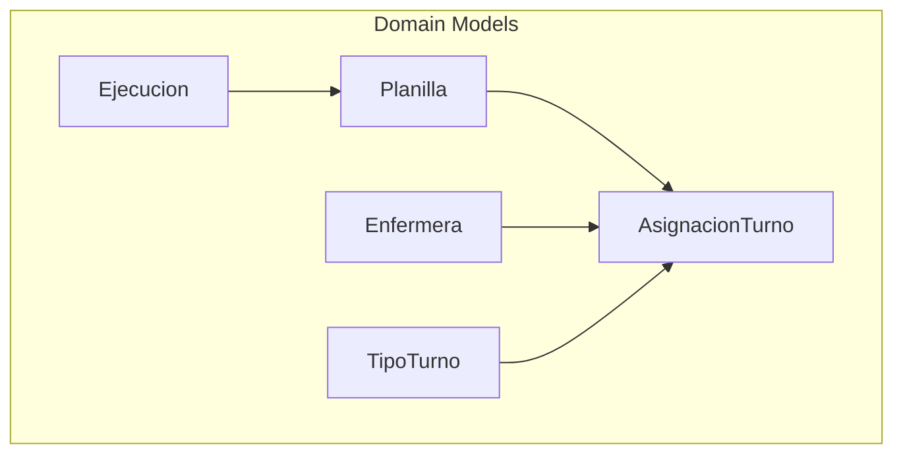
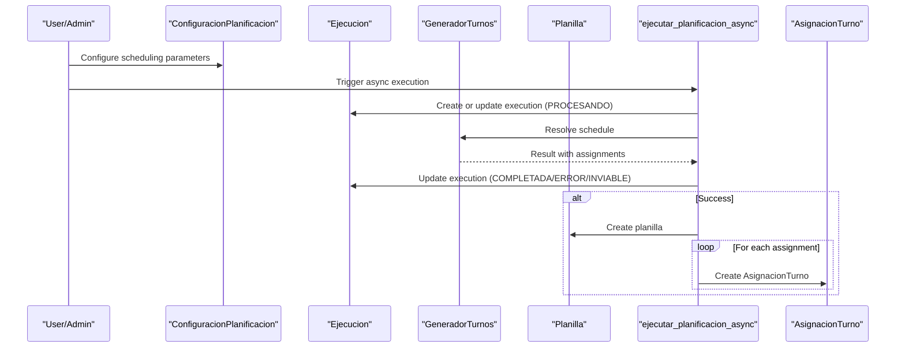
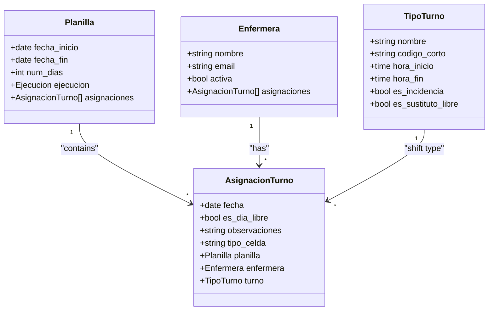
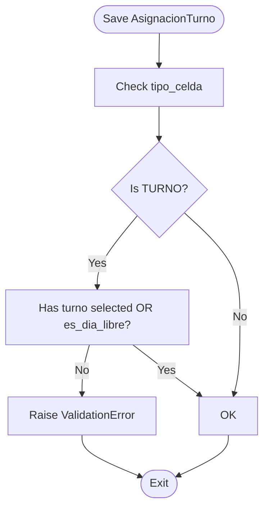
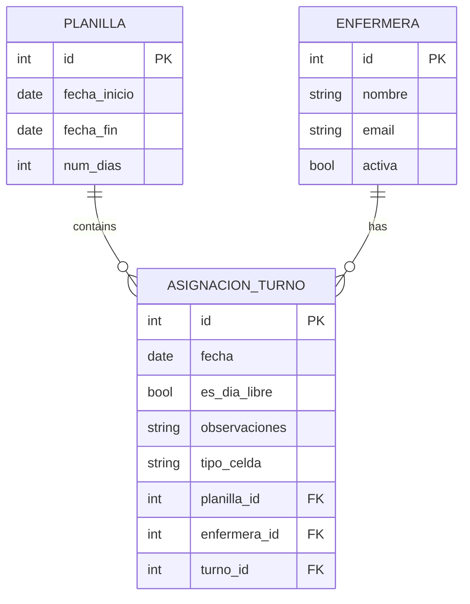
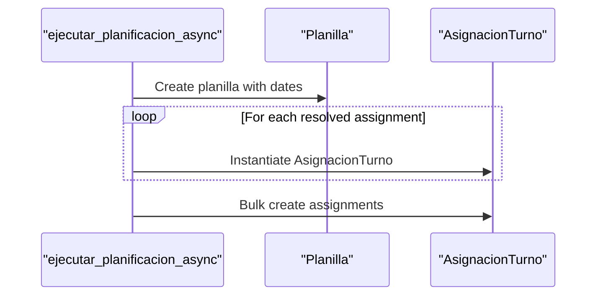
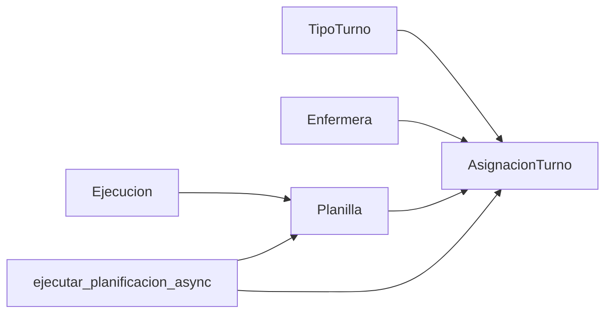

# Assignment Model

<cite>
**Referenced Files in This Document**
- [models.py](file://turnos/models.py)
- [vocabulario.py](file://turnos/dominio/vocabulario.py)
- [admin.py](file://turnos/admin.py)
- [tasks.py](file://turnos/tasks.py)
- [0001_initial.py](file://turnos/migrations/0001_initial.py)
- [0009_add_domain_models.py](file://turnos/migrations/0009_add_domain_models.py)
- [test_models.py](file://turnos/tests/test_models.py)
</cite>

## Table of Contents
1. [Introduction](#introduction)
2. [Project Structure](#project-structure)
3. [Core Components](#core-components)
4. [Architecture Overview](#architecture-overview)
5. [Detailed Component Analysis](#detailed-component-analysis)
6. [Dependency Analysis](#dependency-analysis)
7. [Performance Considerations](#performance-considerations)
8. [Troubleshooting Guide](#troubleshooting-guide)
9. [Conclusion](#conclusion)

## Introduction
This document provides comprehensive documentation for the AsignacionTurno model, which represents individual shift assignments within the scheduling system. It explains the assignment structure, date-based scheduling, assignment types (regular shifts, free days, leaves, training), validation rules, relationships with planillas and nurses, and the unique constraint system preventing duplicate assignments. It also covers the assignment lifecycle, modification patterns, and integration with the broader scheduling pipeline.

## Project Structure
The AsignacionTurno model resides in the turnos app alongside related models that define the scheduling domain. It integrates with:
- Planilla: the generated schedule container
- Enfermera: the nurse resource
- TipoTurno: the type of shift or special cell (e.g., Libre, Vacaciones)
- Ejecucion: the execution context that produces planillas
- Admin interface: administrative controls for assignments
- Tasks: asynchronous orchestration of planification and assignment creation

**Diagram sources**
- [models.py:534-625](file://turnos/models.py#L534-L625)
- [models.py:568-610](file://turnos/models.py#L568-L610)

**Section sources**
- [models.py:534-625](file://turnos/models.py#L534-L625)

## Core Components
- AsignacionTurno: encapsulates a single nurse’s assignment for a given date within a planilla. It supports explicit assignment types via a dedicated field and maintains uniqueness per planilla/nurse/date.
- Planilla: holds the schedule period and links to all AsignacionTurno instances.
- Enfermera: the healthcare worker resource being scheduled.
- TipoTurno: defines shift types, including special categories like Libre and sustituto_libre, and influences assignment semantics.
- Ejecucion: execution context that generates planillas and, subsequently, assignments.

Key characteristics:
- Unique constraint ensures one assignment per nurse per date within a planilla.
- Explicit assignment types enable representing regular shifts, free days, leaves, training, and fixed assignments.
- Validation logic enforces semantic correctness for assignment types.

**Section sources**
- [models.py:568-610](file://turnos/models.py#L568-L610)
- [models.py:534-566](file://turnos/models.py#L534-L566)
- [models.py:30-57](file://turnos/models.py#L30-L57)
- [models.py:60-125](file://turnos/models.py#L60-L125)
- [models.py:482-532](file://turnos/models.py#L482-L532)

## Architecture Overview
The assignment lifecycle spans configuration, execution, planilla generation, and assignment creation. AsignacionTurno instances are produced during the execution phase and attached to a Planilla.

**Diagram sources**
- [tasks.py:17-200](file://turnos/tasks.py#L17-L200)
- [models.py:482-532](file://turnos/models.py#L482-L532)
- [models.py:534-566](file://turnos/models.py#L534-L566)
- [models.py:568-610](file://turnos/models.py#L568-L610)

## Detailed Component Analysis

### AsignacionTurno Model
AsignacionTurno captures a nurse’s daily assignment within a planilla. It supports:
- Date-based scheduling: each assignment is bound to a specific calendar date.
- Nurse linkage: ties to Enfermera via foreign key.
- Shift linkage: optional reference to TipoTurno for regular shifts.
- Free day representation: either via a dedicated flag or via explicit assignment type.
- Special assignment types: Libre, Vacaciones, Permiso, Baja, Formación, Asignación Fija.
- Uniqueness: enforced per planilla, nurse, and date.

Validation rules:
- If the assignment type is TURNO, either a shift must be selected or the “es día libre” flag must be set.
- Integrity with planilla boundaries and date range is maintained by the unique constraint and planilla metadata.

**Diagram sources**
- [models.py:534-566](file://turnos/models.py#L534-L566)
- [models.py:568-610](file://turnos/models.py#L568-L610)
- [models.py:30-57](file://turnos/models.py#L30-L57)
- [models.py:60-125](file://turnos/models.py#L60-L125)

Assignment types and semantics:
- TURNO: Regular shift; requires a valid TipoTurno unless marked as es_dia_libre.
- LIBRE: Explicitly indicates a free day; can coexist with es_dia_libre.
- VACACIONES, PERMISO, BAJA, FORMACION: Leave or training events.
- ASIGNACION_FIJA: Fixed assignment, often used for mandatory coverage.

These types are defined in the vocabulary module and surfaced in the admin and UI.

**Section sources**
- [models.py:568-610](file://turnos/models.py#L568-L610)
- [vocabulario.py:48-70](file://turnos/dominio/vocabulario.py#L48-L70)
- [admin.py:249-267](file://turnos/admin.py#L249-L267)

### Assignment Types and Validation
- Assignment type selection governs whether a shift is assigned, whether the day is free, or whether the cell represents leave/training/fixed assignment.
- Validation ensures that TURNO assignments are semantically sound: either a shift is chosen or the free-day flag is set.
- The model leverages Django’s built-in validation framework to enforce these rules.

**Diagram sources**
- [models.py:617-623](file://turnos/models.py#L617-L623)

**Section sources**
- [models.py:617-623](file://turnos/models.py#L617-L623)

### Relationship with Planillas and Nurses
- Each AsignacionTurno belongs to a Planilla and a specific Enfermera for a given date.
- Planilla stores the schedule period and links to all contained assignments.
- The unique_together constraint on planilla, enfermera, and fecha prevents duplicate assignments.

**Diagram sources**
- [models.py:534-566](file://turnos/models.py#L534-L566)
- [models.py:568-610](file://turnos/models.py#L568-L610)

**Section sources**
- [models.py:534-566](file://turnos/models.py#L534-L566)
- [models.py:568-610](file://turnos/models.py#L568-L610)

### Assignment Lifecycle and Integration
- Creation: AsignacionTurno instances are created during the execution pipeline and attached to a Planilla.
- Execution context: Ejecucion tracks the state of planification runs and results.
- Bulk creation: Assignments are inserted efficiently using bulk operations.

**Diagram sources**
- [tasks.py:128-170](file://turnos/tasks.py#L128-L170)
- [models.py:534-566](file://turnos/models.py#L534-L566)
- [models.py:568-610](file://turnos/models.py#L568-L610)

**Section sources**
- [tasks.py:128-170](file://turnos/tasks.py#L128-L170)
- [models.py:482-532](file://turnos/models.py#L482-L532)

### Unique Constraint System
- The unique_together constraint on planilla, enfermera, and fecha prevents duplicate assignments for the same nurse on the same date within a planilla.
- This constraint is foundational to maintaining schedule integrity and enabling predictable lookups.

**Section sources**
- [models.py:606-610](file://turnos/models.py#L606-L610)
- [0001_initial.py:132-137](file://turnos/migrations/0001_initial.py#L132-L137)

### Administrative and UI Integration
- Admin interface exposes fields for planilla, nurse, date, shift, and free-day flag, aiding manual edits and oversight.
- Vocabulary constants define canonical assignment types for consistent usage across the system.

**Section sources**
- [admin.py:249-267](file://turnos/admin.py#L249-L267)
- [vocabulario.py:48-70](file://turnos/dominio/vocabulario.py#L48-L70)

## Dependency Analysis
AsignacionTurno depends on Planilla, Enfermera, and TipoTurno. Its lifecycle is orchestrated by Ejecucion and managed via tasks. The model’s validation interacts with TipoTurno attributes to ensure semantic correctness.

**Diagram sources**
- [models.py:60-125](file://turnos/models.py#L60-L125)
- [models.py:30-57](file://turnos/models.py#L30-L57)
- [models.py:534-566](file://turnos/models.py#L534-L566)
- [models.py:568-610](file://turnos/models.py#L568-L610)
- [models.py:482-532](file://turnos/models.py#L482-L532)
- [tasks.py:128-170](file://turnos/tasks.py#L128-L170)

**Section sources**
- [models.py:60-125](file://turnos/models.py#L60-L125)
- [models.py:30-57](file://turnos/models.py#L30-L57)
- [models.py:534-566](file://turnos/models.py#L534-L566)
- [models.py:568-610](file://turnos/models.py#L568-L610)
- [models.py:482-532](file://turnos/models.py#L482-L532)
- [tasks.py:128-170](file://turnos/tasks.py#L128-L170)

## Performance Considerations
- Bulk creation: Assignments are inserted in bulk to minimize database round-trips during planilla generation.
- Unique constraint: The three-way unique constraint is indexed by the database, ensuring efficient enforcement and lookups.
- Validation cost: Validation occurs at save-time; keep assignment batches coherent to avoid repeated validations.

[No sources needed since this section provides general guidance]

## Troubleshooting Guide
Common issues and resolutions:
- Duplicate assignment error: Verify that the combination of planilla, nurse, and date is unique before saving.
- Invalid TURNO assignment: Ensure either a shift is selected or the free-day flag is set.
- Unexpected free day vs. shift: Confirm the intended assignment type and the corresponding flags.

Administrative checks:
- Use the admin interface to inspect assignments by date, nurse, and planilla.
- Review Ejecucion state and messages for errors or warnings.

**Section sources**
- [models.py:617-623](file://turnos/models.py#L617-L623)
- [admin.py:249-267](file://turnos/admin.py#L249-L267)
- [tasks.py:106-126](file://turnos/tasks.py#L106-L126)

## Conclusion
AsignacionTurno is the cornerstone of the scheduling system, encapsulating daily assignments with robust validation, flexible assignment types, and strong integrity guarantees via unique constraints. Its integration with Planilla, Enfermera, and TipoTurno enables precise, maintainable scheduling. The lifecycle—from configuration and execution to planilla generation and assignment creation—is streamlined through the tasks module, ensuring scalability and reliability.