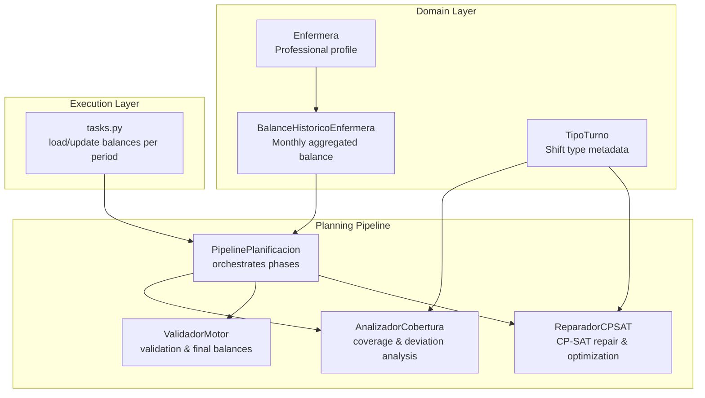
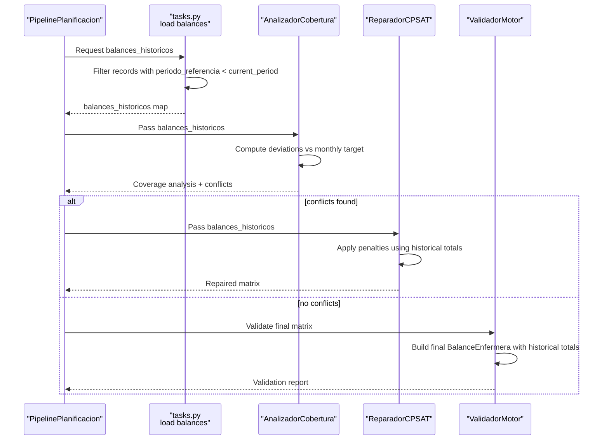
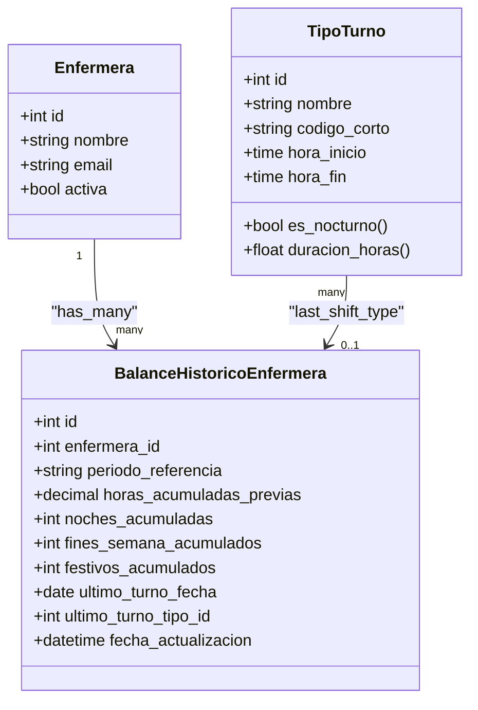
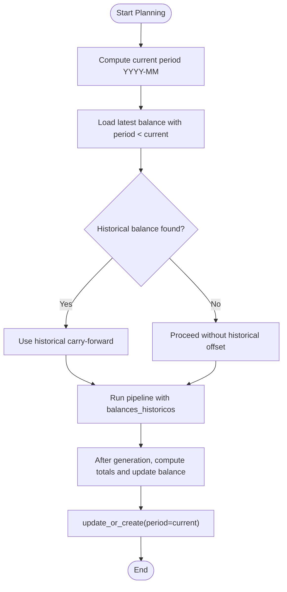
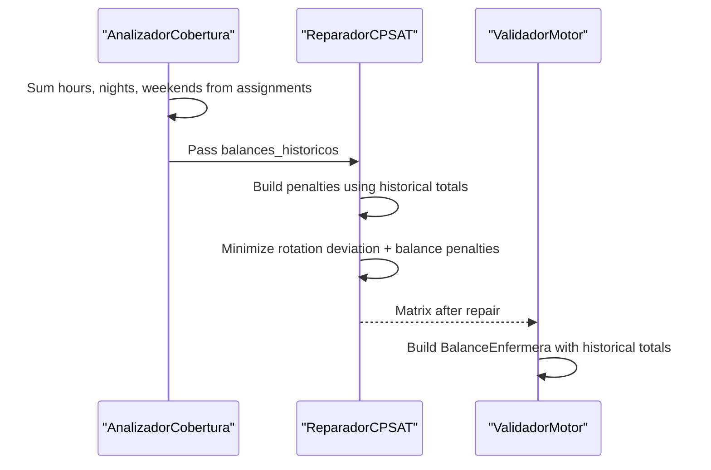
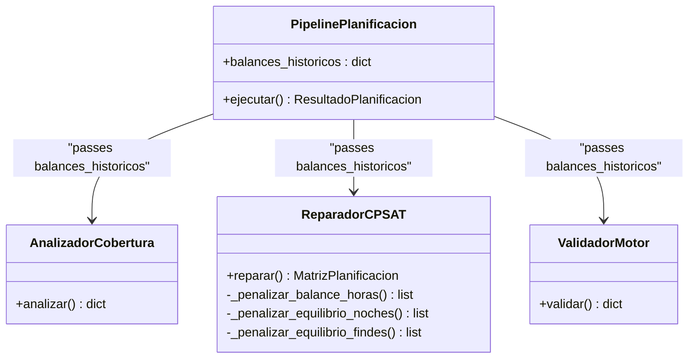
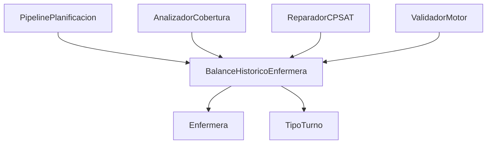

# Balance History Model

<cite>
**Referenced Files in This Document**
- [models.py](file://turnos/models.py)
- [tasks.py](file://turnos/tasks.py)
- [pipeline.py](file://turnos/motor/pipeline.py)
- [cobertura.py](file://turnos/motor/cobertura.py)
- [validador_motor.py](file://turnos/motor/validador_motor.py)
- [reparador.py](file://turnos/motor/reparador.py)
- [dtos.py](file://turnos/dominio/dtos.py)
- [0011_alter_balancehistoricoenfermera_periodo_referencia.py](file://turnos/migrations/0011_alter_balancehistoricoenfermera_periodo_referencia.py)
- [test_integracion_final.py](file://turnos/tests/test_motor/test_integracion_final.py)
</cite>

## Table of Contents
1. [Introduction](#introduction)
2. [Project Structure](#project-structure)
3. [Core Components](#core-components)
4. [Architecture Overview](#architecture-overview)
5. [Detailed Component Analysis](#detailed-component-analysis)
6. [Dependency Analysis](#dependency-analysis)
7. [Performance Considerations](#performance-considerations)
8. [Troubleshooting Guide](#troubleshooting-guide)
9. [Conclusion](#conclusion)

## Introduction
This document explains the BalanceHistoricoEnfermera model that maintains historical workload balances to support fair, long-term scheduling. It covers the monthly aggregation system, accumulated hours tracking, historical context for scheduling, and integration with the constraint satisfaction system. It also provides examples of balance calculations, historical trend analysis, and the impact on future scheduling decisions.

## Project Structure
The BalanceHistoricoEnfermera model resides in the domain layer alongside other planning models and is consumed by the planning pipeline and constraint satisfaction solver.

**Diagram sources**
- [models.py:787-824](file://turnos/models.py#L787-L824)
- [pipeline.py:31-246](file://turnos/motor/pipeline.py#L31-L246)
- [cobertura.py:86-114](file://turnos/motor/cobertura.py#L86-L114)
- [validador_motor.py:414-443](file://turnos/motor/validador_motor.py#L414-L443)
- [reparador.py:24-96](file://turnos/motor/reparador.py#L24-L96)
- [tasks.py:522-673](file://turnos/tasks.py#L522-L673)

**Section sources**
- [models.py:787-824](file://turnos/models.py#L787-L824)
- [pipeline.py:31-246](file://turnos/motor/pipeline.py#L31-L246)

## Core Components
- BalanceHistoricoEnfermera: Stores monthly aggregated metrics for each nurse, enabling fair scheduling across periods.
- Period reference format: YYYY-MM (lexicographic ordering enables previous-period selection).
- Accumulated hours tracking: Historical hours, nights, weekends, and holidays are carried forward.
- Integration points: Loaded at planning start and injected into coverage analysis, solver penalties, and final validation.

Key attributes and behaviors:
- Unique composite key: (enfermera, periodo_referencia)
- Monthly aggregation: One record per month per nurse
- Historical context: Used to compute deviations and fairness penalties
- Last shift tracking: Supports continuity-aware decisions

**Section sources**
- [models.py:787-824](file://turnos/models.py#L787-L824)
- [0011_alter_balancehistoricoenfermera_periodo_referencia.py:13-17](file://turnos/migrations/0011_alter_balancehistoricoenfermera_periodo_referencia.py#L13-L17)

## Architecture Overview
The balance history integrates across the planning pipeline:

**Diagram sources**
- [tasks.py:522-545](file://turnos/tasks.py#L522-L545)
- [tasks.py:651-673](file://turnos/tasks.py#L651-L673)
- [pipeline.py:92-246](file://turnos/motor/pipeline.py#L92-L246)
- [cobertura.py:86-114](file://turnos/motor/cobertura.py#L86-L114)
- [validador_motor.py:414-443](file://turnos/motor/validador_motor.py#L414-L443)
- [reparador.py:297-446](file://turnos/motor/reparador.py#L297-L446)

## Detailed Component Analysis

### BalanceHistoricoEnfermera Model
- Purpose: Persist monthly aggregated workload metrics to inform fair scheduling.
- Fields:
  - periodo_referencia: Monthly identifier in YYYY-MM format
  - horas_acumuladas_previas: Carry-forward hours from prior months
  - noches_acumuladas, fines_semana_acumulados, festivos_acumulados: Long-term equity counters
  - ultimo_turno_fecha, ultimo_turno_tipo: Continuity anchor
  - fecha_actualizacion: Auto-updated timestamp
- Constraints:
  - UniqueTogether: (enfermera, periodo_referencia)
  - Period format validated by migration

**Diagram sources**
- [models.py:30-57](file://turnos/models.py#L30-L57)
- [models.py:60-208](file://turnos/models.py#L60-L208)
- [models.py:787-824](file://turnos/models.py#L787-L824)

**Section sources**
- [models.py:787-824](file://turnos/models.py#L787-L824)
- [0011_alter_balancehistoricoenfermera_periodo_referencia.py:13-17](file://turnos/migrations/0011_alter_balancehistoricoenfermera_periodo_referencia.py#L13-L17)

### Monthly Aggregation and Period Reference
- Period reference: YYYY-MM string; lexicographic ordering allows selecting the latest previous period (< current_period).
- Loading logic:
  - For each nurse, fetch the most recent historical record before the current planning period.
  - If none exists, proceed without historical offset.
- Updating logic:
  - After generating the current period’s schedule, compute:
    - horas_totales_con_historico = horas_asignadas + horas_acumuladas_previas
    - Aggregate nights, weekends, and holidays from current assignments
    - Preserve last shift info only if at least one work day occurred

**Diagram sources**
- [tasks.py:522-545](file://turnos/tasks.py#L522-L545)
- [tasks.py:651-673](file://turnos/tasks.py#L651-L673)

**Section sources**
- [tasks.py:522-545](file://turnos/tasks.py#L522-L545)
- [tasks.py:651-673](file://turnos/tasks.py#L651-L673)

### Accumulated Hours Tracking and Fairness
- Coverage analysis:
  - Computes deviations against monthly targets using current assignments only.
  - Incorporates historical totals for fairness penalties in the solver.
- Solver penalties:
  - Hours balance: minimize deviation from monthly target, weighted against historical totals.
  - Nights and weekend balance: minimize max-min difference across nurses, including historical counts.
- Final validation:
  - Builds final BalanceEnfermera combining current and historical totals for reporting.

**Diagram sources**
- [cobertura.py:86-114](file://turnos/motor/cobertura.py#L86-L114)
- [reparador.py:376-446](file://turnos/motor/reparador.py#L376-L446)
- [validador_motor.py:414-443](file://turnos/motor/validador_motor.py#L414-L443)
- [dtos.py:134-166](file://turnos/dominio/dtos.py#L134-L166)

**Section sources**
- [cobertura.py:86-114](file://turnos/motor/cobertura.py#L86-L114)
- [reparador.py:376-446](file://turnos/motor/reparador.py#L376-L446)
- [validador_motor.py:414-443](file://turnos/motor/validador_motor.py#L414-L443)
- [dtos.py:134-166](file://turnos/dominio/dtos.py#L134-L166)

### Integration with Constraint Satisfaction System
- Balances passed through:
  - Pipeline orchestration to coverage analyzer, solver, and validator.
  - Solver uses historical totals to bias solutions toward balanced distributions.
- Objective weights:
  - Rotation base preservation (highest weight)
  - Monthly hours balance (lower weight)
  - Night and weekend equity (medium weights)

**Diagram sources**
- [pipeline.py:60-74](file://turnos/motor/pipeline.py#L60-L74)
- [pipeline.py:156-163](file://turnos/motor/pipeline.py#L156-L163)
- [pipeline.py:177-186](file://turnos/motor/pipeline.py#L177-L186)
- [pipeline.py:206-211](file://turnos/motor/pipeline.py#L206-L211)
- [reparador.py:24-58](file://turnos/motor/reparador.py#L24-L58)
- [reparador.py:297-334](file://turnos/motor/reparador.py#L297-L334)

**Section sources**
- [pipeline.py:60-74](file://turnos/motor/pipeline.py#L60-L74)
- [pipeline.py:156-163](file://turnos/motor/pipeline.py#L156-L163)
- [pipeline.py:177-186](file://turnos/motor/pipeline.py#L177-L186)
- [pipeline.py:206-211](file://turnos/motor/pipeline.py#L206-L211)
- [reparador.py:297-334](file://turnos/motor/reparador.py#L297-L334)

### Examples and Use Cases

- Example: Historical trend analysis
  - Scenario: Two nurses with very different historical totals but identical monthly targets.
  - Behavior: The solver computes deviations against the monthly target (not historical totals), but uses historical totals to bias penalties toward equity across months.
  - Outcome: Over time, the system encourages balanced distribution without forcing identical absolute totals.

- Example: Impact on future scheduling
  - If a nurse has accumulated many night shifts historically, the solver will apply higher penalties to assigning additional night shifts this month, promoting fairness across months.

- Example: Persistence and updates
  - The system uses update_or_create keyed by (nurse, period) to ensure idempotent updates.
  - Tests confirm that updating the same period updates the record, while different periods create separate records.

**Section sources**
- [test_integracion_final.py:540-605](file://turnos/tests/test_motor/test_integracion_final.py#L540-L605)
- [test_integracion_final.py:950-1007](file://turnos/tests/test_motor/test_integracion_final.py#L950-L1007)

## Dependency Analysis
- Internal dependencies:
  - BalanceHistoricoEnfermera depends on Enfermera and optionally TipoTurno for last shift tracking.
  - The planning pipeline consumes balances_historicos across coverage analysis, solver, and validation.
- External dependencies:
  - CP-SAT solver for constraint optimization.
  - Django ORM for persistence and filtering.

**Diagram sources**
- [models.py:787-824](file://turnos/models.py#L787-L824)
- [pipeline.py:60-74](file://turnos/motor/pipeline.py#L60-L74)
- [cobertura.py:86-114](file://turnos/motor/cobertura.py#L86-L114)
- [reparador.py:24-58](file://turnos/motor/reparador.py#L24-L58)
- [validador_motor.py:414-443](file://turnos/motor/validador_motor.py#L414-L443)

**Section sources**
- [models.py:787-824](file://turnos/models.py#L787-L824)
- [pipeline.py:60-74](file://turnos/motor/pipeline.py#L60-L74)

## Performance Considerations
- Filtering by periodo_referencia < current_period leverages lexicographic ordering for efficient retrieval.
- update_or_create ensures idempotency and avoids redundant writes.
- Solver penalties scale with problem size; historical totals add constant offsets that do not increase complexity.

## Troubleshooting Guide
- Period format errors:
  - Ensure periodo_referencia follows YYYY-MM; migration validates the field.
- Missing historical records:
  - Absence is handled gracefully; the system proceeds without applying historical offsets.
- Unexpected zero deviations:
  - Verify that monthly targets are provided; otherwise, fallback values are used.
- Inconsistent last shift tracking:
  - Only updated when at least one work day occurs during the period.

**Section sources**
- [0011_alter_balancehistoricoenfermera_periodo_referencia.py:13-17](file://turnos/migrations/0011_alter_balancehistoricoenfermera_periodo_referencia.py#L13-L17)
- [tasks.py:651-673](file://turnos/tasks.py#L651-L673)
- [reparador.py:387-403](file://turnos/motor/reparador.py#L387-L403)

## Conclusion
BalanceHistoricoEnfermera provides a robust mechanism to maintain long-term fairness in scheduling by carrying forward monthly aggregates and integrating them into coverage analysis, solver penalties, and final validation. Its design supports idempotent updates, clear period boundaries, and seamless integration with the constraint satisfaction pipeline.