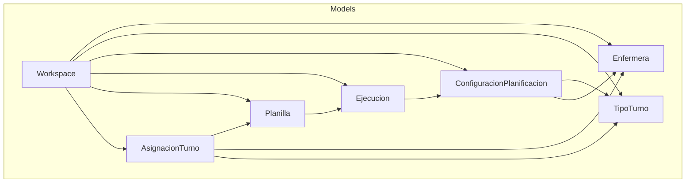
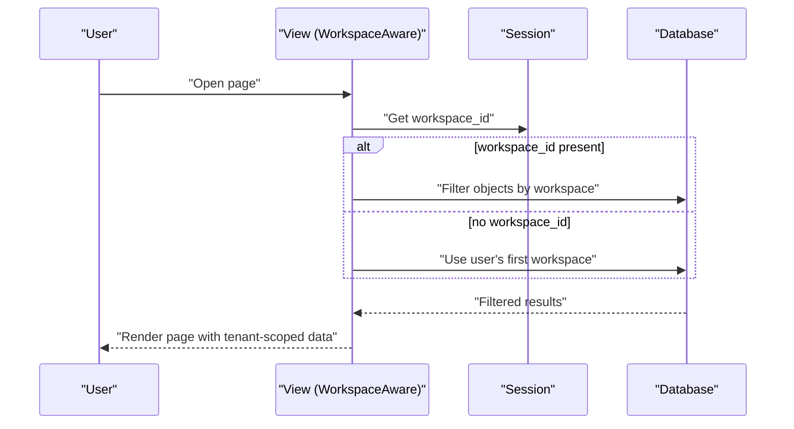

# Core Models

<cite>
**Referenced Files in This Document**
- [models.py](file://turnos/models.py)
- [admin.py](file://turnos/admin.py)
- [apps.py](file://turnos/apps.py)
- [0001_initial.py](file://turnos/migrations/0001_initial.py)
- [0009_add_domain_models.py](file://turnos/migrations/0009_add_domain_models.py)
- [0003_alter_configuracionplanificacion_num_dias_workspace_and_more.py](file://turnos/migrations/0003_alter_configuracionplanificacion_num_dias_workspace_and_more.py)
- [test_models.py](file://turnos/tests/test_models.py)
- [views.py](file://turnos/views.py)
- [urls.py](file://turnos/urls.py)
- [workspace_selector.html](file://turnos/templates/includes/workspace_selector.html)
</cite>

## Table of Contents
1. [Introduction](#introduction)
2. [Project Structure](#project-structure)
3. [Core Components](#core-components)
4. [Architecture Overview](#architecture-overview)
5. [Detailed Component Analysis](#detailed-component-analysis)
6. [Dependency Analysis](#dependency-analysis)
7. [Performance Considerations](#performance-considerations)
8. [Troubleshooting Guide](#troubleshooting-guide)
9. [Conclusion](#conclusion)
10. [Appendices](#appendices)

## Introduction
This document provides comprehensive data model documentation for the core domain entities of the turn scheduling system. It covers Workspace, Enfermera, TipoTurno, ConfiguracionPlanificacion, Ejecucion, Planilla, and AsignacionTurno. For each model, we define fields, data types, validation rules, business constraints, and explain how workspace-based multi-tenancy isolates data between organizations. We also describe model relationships, unique constraints, indexing strategies, validation patterns, clean() methods, property implementations, and meta options. Finally, we include examples of model relationships and query patterns.

## Project Structure
The data models are defined in the turnos app under models.py. Administrative interfaces and filters are configured in admin.py. The initial database schema was established by migration 0001_initial.py, while later migrations introduce workspace support and advanced domain models. Tests validate basic model behavior, and views implement workspace-aware filtering and selection.



**Diagram sources**
- [models.py:12-825](file://turnos/models.py#L12-L825)
- [0001_initial.py:18-140](file://turnos/migrations/0001_initial.py#L18-L140)
- [0009_add_domain_models.py:24-122](file://turnos/migrations/0009_add_domain_models.py#L24-L122)

**Section sources**
- [models.py:12-825](file://turnos/models.py#L12-L825)
- [0001_initial.py:1-140](file://turnos/migrations/0001_initial.py#L1-L140)
- [0009_add_domain_models.py:1-123](file://turnos/migrations/0009_add_domain_models.py#L1-L123)

## Core Components
- Workspace: Isolates data per organization and controls access via user membership.
- Enfermera: Represents a nurse with profile attributes and preferences.
- TipoTurno: Defines turn types with optional schedules and special flags.
- ConfiguracionPlanificacion: Stores planning configuration including period, participants, turn sets, demand, hard/soft constraints, and solver settings.
- Ejecucion: Tracks a single planning run with state, timing, and results.
- Planilla: Holds the generated schedule tied to an execution.
- AsignacionTurno: Assigns a specific turn or day off to a nurse on a given date within a schedule.

These models collectively implement a workspace-based multi-tenancy architecture, ensuring data isolation between organizations.

**Section sources**
- [models.py:12-825](file://turnos/models.py#L12-L825)
- [0001_initial.py:18-140](file://turnos/migrations/0001_initial.py#L18-L140)
- [0009_add_domain_models.py:24-122](file://turnos/migrations/0009_add_domain_models.py#L24-L122)

## Architecture Overview
The system uses workspace-based multi-tenancy:
- Each model optionally belongs to a Workspace.
- Views enforce tenant isolation by filtering querysets by the current workspace stored in the user’s session.
- Users can switch between workspaces via a selector that persists the chosen workspace in the session.



**Diagram sources**
- [views.py:2079-2092](file://turnos/views.py#L2079-L2092)
- [workspace_selector.html:1-18](file://turnos/templates/includes/workspace_selector.html#L1-L18)

**Section sources**
- [views.py:2079-2092](file://turnos/views.py#L2079-L2092)
- [workspace_selector.html:1-18](file://turnos/templates/includes/workspace_selector.html#L1-L18)

## Detailed Component Analysis

### Workspace
- Purpose: Isolate data between organizations and control access.
- Fields:
  - nombre: CharField, max_length=200
  - descripcion: TextField, blank=True
  - creado_por: ForeignKey(User, CASCADE, related_name='workspaces_creados')
  - usuarios: ManyToMany(User, related_name='workspaces', blank=True)
  - activo: BooleanField, default=True
  - fecha_creacion: DateTimeField, auto_now_add=True
- Meta:
  - verbose_name: "Espacio de Trabajo"
  - verbose_name_plural: "Espacios de Trabajo"
  - ordering: ['-fecha_creacion']
- Business constraints:
  - Multi-tenant boundary for all related models.
  - Access controlled by membership in usuarios.
- Validation patterns:
  - Not enforced at model level; access control is handled in views and admin.

**Section sources**
- [models.py:12-27](file://turnos/models.py#L12-L27)
- [0003_alter_configuracionplanificacion_num_dias_workspace_and_more.py:22-38](file://turnos/migrations/0003_alter_configuracionplanificacion_num_dias_workspace_and_more.py#L22-L38)

### Enfermera
- Purpose: Represents a nurse with profile and preferences.
- Fields:
  - workspace: ForeignKey(Workspace, CASCADE, related_name='enfermeras', null=True, blank=True)
  - nombre: CharField, max_length=200
  - email: EmailField, unique=True
  - telefono: CharField, max_length=20, blank=True
  - dni: CharField, max_length=20, blank=True, unique=True, null=True
  - activa: BooleanField, default=True
  - fecha_alta: DateField, auto_now_add=True
  - preferencias: JSONField, default=dict, blank=True
  - notas: TextField, blank=True
- Meta:
  - verbose_name: "Enfermera"
  - verbose_name_plural: "Enfermeras"
  - ordering: ['nombre']
- Validation patterns:
  - Unique constraints enforced by database (email, dni).
- Properties:
  - get_absolute_url(): reverse('turnos:enfermera_detalle', pk)

**Section sources**
- [models.py:30-58](file://turnos/models.py#L30-L58)
- [0001_initial.py:18-36](file://turnos/migrations/0001_initial.py#L18-L36)

### TipoTurno
- Purpose: Defines turn types with optional schedules and special flags.
- Fields:
  - workspace: ForeignKey(Workspace, CASCADE, related_name='tipos_turno', null=True, blank=True)
  - nombre: CharField, max_length=100
  - codigo_corto: CharField, max_length=5
  - hora_inicio: TimeField, null=True, blank=True
  - hora_fin: TimeField, null=True, blank=True
  - descripcion: TextField, blank=True
  - activo: BooleanField, default=True
  - es_incidencia: BooleanField, default=False
  - es_sustituto_libre: BooleanField, default=False
- Meta:
  - verbose_name: "Tipo de Turno"
  - verbose_name_plural: "Tipos de Turno"
  - ordering: ['nombre']
  - constraints:
    - UniqueConstraint(fields=['workspace','nombre'], condition=Q(workspace__isnull=False))
    - UniqueConstraint(fields=['workspace','codigo_corto'], condition=Q(workspace__isnull=False))
- Validation patterns:
  - clean():
    - If es_sustituto_libre: disallow hora_inicio/hora_fin and disallow es_incidencia
    - If not es_incidencia and not es_sustituto_libre: require hora_inicio and hora_fin
    - Require codigo_corto and ensure uniqueness within workspace
- Properties:
  - duracion_horas: computes duration considering midnight crossing
  - es_nocturno: determines if shift crosses midnight
  - num_configuraciones: counts related ConfiguracionPlanificacion entries

**Section sources**
- [models.py:60-208](file://turnos/models.py#L60-L208)
- [0001_initial.py:38-52](file://turnos/migrations/0001_initial.py#L38-L52)

### ConfiguracionPlanificacion
- Purpose: Stores planning configuration including period, participants, turn sets, demand, constraints, and solver settings.
- Fields:
  - workspace: ForeignKey(Workspace, CASCADE, related_name='configuraciones', null=True, blank=True)
  - nombre: CharField, max_length=200
  - descripcion: TextField, blank=True
  - activa: BooleanField, default=True
  - num_dias: IntegerField, validators=[MinValueValidator(7), MaxValueValidator(365)]
  - fecha_inicio: DateField
  - enfermeras: ManyToMany(Enfermera)
  - turnos: ManyToMany(TipoTurno)
  - turnos_por_dia: ManyToMany(TipoTurno, related_name='config_turnos_por_dia', blank=True)
  - demanda_por_turno: JSONField, default=dict, blank=True
  - restricciones_duras: JSONField, default=list, blank=True, null=True
  - restricciones_blandas: JSONField, default=list, blank=True, null=True
  - patrones_turnos_json: JSONField, default=list, blank=True
  - patrones_turnos: ManyToMany(PatronTurnos, blank=True, related_name='configuraciones')
  - num_trabajadores: IntegerField, default=4, validators=[MinValueValidator(1), MaxValueValidator(8)]
  - tiempo_maximo_segundos: IntegerField, default=60, validators=[MinValueValidator(10), MaxValueValidator(600)]
  - seed: IntegerField, null=True, blank=True
  - creado_por: ForeignKey(User, SET_NULL, null=True)
  - fecha_creacion: DateTimeField, auto_now_add=True, editable=False
  - fecha_modificacion: DateTimeField, auto_now=True, editable=False
- Meta:
  - verbose_name: "Configuración de Planificación"
  - verbose_name_plural: "Configuraciones de Planificación"
  - ordering: ['-fecha_inicio']
- Validation patterns:
  - clean(): validates period bounds via _validar_periodo()
  - save(): calls _validar_periodo() on creation
- Properties:
  - fecha_fin: computed from fecha_inicio + num_dias - 1
  - get_patrones_combinados(): merges patrones_turnos_json and active patrones_turnos into a unified list

**Section sources**
- [models.py:332-480](file://turnos/models.py#L332-L480)
- [0001_initial.py:54-79](file://turnos/migrations/0001_initial.py#L54-L79)

### Ejecucion
- Purpose: Tracks a single planning run with state, timing, and results.
- Fields:
  - workspace: ForeignKey(Workspace, CASCADE, related_name='ejecuciones', null=True, blank=True)
  - configuracion: ForeignKey(ConfiguracionPlanificacion, CASCADE, related_name='ejecuciones')
  - estado: CharField, choices=[('PENDIENTE','Procesando','COMPLETADA','INVIABLE','ERROR')], default='PENDIENTE'
  - fecha_inicio: DateTimeField, auto_now_add=True
  - fecha_fin: DateTimeField, null=True, blank=True
  - es_optima: BooleanField, default=False
  - penalizacion_total: FloatField, null=True, blank=True
  - resultado: JSONField, default=dict, blank=True
  - mensajes: JSONField, default=dict, blank=True
- Meta:
  - verbose_name: "Ejecución"
  - verbose_name_plural: "Ejecuciones"
  - ordering: ['-fecha_inicio']
- Properties:
  - duracion: computed difference between fecha_fin and fecha_inicio

**Section sources**
- [models.py:482-532](file://turnos/models.py#L482-L532)
- [0001_initial.py:80-98](file://turnos/migrations/0001_initial.py#L80-L98)

### Planilla
- Purpose: Holds the generated schedule tied to an execution.
- Fields:
  - workspace: ForeignKey(Workspace, CASCADE, related_name='planillas', null=True, blank=True)
  - nombre: CharField, max_length=200
  - descripcion: TextField, blank=True
  - ejecucion: OneToOneField(Ejecucion, CASCADE, related_name='planilla_generada')
  - fecha_inicio: DateField
  - fecha_fin: DateField
  - num_dias: IntegerField
- Meta:
  - verbose_name: "Planilla"
  - verbose_name_plural: "Planillas"
  - ordering: ['-fecha_inicio']

**Section sources**
- [models.py:534-566](file://turnos/models.py#L534-L566)
- [0001_initial.py:99-115](file://turnos/migrations/0001_initial.py#L99-L115)

### AsignacionTurno
- Purpose: Assigns a specific turn or day off to a nurse on a given date within a schedule.
- Fields:
  - planilla: ForeignKey(Planilla, CASCADE, related_name='asignaciones')
  - enfermera: ForeignKey(Enfermera, CASCADE, related_name='asignaciones')
  - fecha: DateField
  - turno: ForeignKey(TipoTurno, CASCADE, null=True, blank=True)
  - es_dia_libre: BooleanField, default=False
  - observaciones: TextField, blank=True
  - tipo_celda: ChoiceField with values including TURNO, LIBRE, VACACIONES, PERMISO, BAJA, FORMACION, ASIGNACION_FIJA, default='TURNO'
- Meta:
  - verbose_name: "Asignación de Turno"
  - verbose_name_plural: "Asignaciones de Turno"
  - ordering: ['fecha','enfermera']
  - unique_together: ['planilla','enfermera','fecha']
- Validation patterns:
  - clean(): raises ValidationError if tipo_celda=='TURNO' and turno is None and es_dia_libre is False

**Section sources**
- [models.py:568-624](file://turnos/models.py#L568-L624)
- [0001_initial.py:121-139](file://turnos/migrations/0001_initial.py#L121-L139)
- [0009_add_domain_models.py:14-18](file://turnos/migrations/0009_add_domain_models.py#L14-L18)

### Advanced Domain Models (added via migration 0009)
- ContratoEnfermera: Links to Enfermera via OneToOne; defines target hours and percentage of full-time.
- RotacionBase: Defines a repeating cycle of days with associated turn types.
- CeldaRotacion: A cell within a rotation cycle specifying a turn or free day.
- AsignacionRotacionEnfermera: Assigns a rotation to a nurse with offset and validity dates.
- Incidencia: Records events affecting a nurse’s schedule (vacations, permission, etc.).
- BalanceHistoricoEnfermera: Historical accumulation metrics for a nurse by reference period.

Constraints and relationships:
- Unique constraints:
  - BalanceHistoricoEnfermera: unique_together(['enfermera','periodo_referencia'])
  - CeldaRotacion: unique_together(['rotacion','orden'])

**Section sources**
- [0009_add_domain_models.py:24-122](file://turnos/migrations/0009_add_domain_models.py#L24-L122)
- [models.py:629-825](file://turnos/models.py#L629-L825)

## Dependency Analysis
Entity relationships and foreign keys:
- Workspace -> Enfermera, TipoTurno, ConfiguracionPlanificacion, Ejecucion, Planilla
- ConfiguracionPlanificacion -> Enfermera (many-to-many), TipoTurno (many-to-many)
- Ejecucion -> ConfiguracionPlanificacion (one-to-one via planilla_generada)
- Planilla -> Ejecucion (one-to-one)
- AsignacionTurno -> Planilla, Enfermera, TipoTurno

Indexing and constraints:
- Unique constraints:
  - Enfermera.email, Enfermera.dni
  - TipoTurno: unique(nombre, workspace), unique(codigo_corto, workspace)
  - AsignacionTurno: unique(planilla, enfermera, fecha)
  - BalanceHistoricoEnfermera: unique(enfermera, periodo_referencia)
- Ordering:
  - Workspace: ['-fecha_creacion']
  - Enfermera: ['nombre']
  - TipoTurno: ['nombre']
  - ConfiguracionPlanificacion: ['-fecha_inicio']
  - Ejecucion: ['-fecha_inicio']
  - Planilla: ['-fecha_inicio']
  - AsignacionTurno: ['fecha','enfermera']
  - BalanceHistoricoEnfermera: default ordering via Meta

```mermaid
erDiagram
WORKSPACE {
bigint id PK
varchar nombre
text descripcion
boolean activo
datetime fecha_creacion
}
ENFERMERA {
bigint id PK
bigint workspace_id FK
varchar nombre
varchar email UK
varchar telefono
varchar dni UK
boolean activa
date fecha_alta
json preferencias
text notas
}
TIPO_TURNO {
bigint id PK
bigint workspace_id FK
varchar nombre
varchar codigo_corto
time hora_inicio
time hora_fin
text descripcion
boolean activo
boolean es_incidencia
boolean es_sustituto_libre
}
CONFIGURACION_PLANIFICACION {
bigint id PK
bigint workspace_id FK
varchar nombre
text descripcion
boolean activa
int num_dias
date fecha_inicio
int num_trabajadores
int tiempo_maximo_segundos
int seed
datetime fecha_creacion
datetime fecha_modificacion
}
EJECUCION {
bigint id PK
bigint workspace_id FK
bigint configuracion_id FK
char estado
datetime fecha_inicio
datetime fecha_fin
boolean es_optima
float penalizacion_total
json resultado
json mensajes
}
PLANILLA {
bigint id PK
bigint workspace_id FK
varchar nombre
text descripcion
bigint ejecucion_id FK UK
date fecha_inicio
date fecha_fin
int num_dias
}
ASIGNACION_TURNO {
bigint id PK
bigint planilla_id FK
bigint enfermera_id FK
date fecha
bigint turno_id FK
boolean es_dia_libre
text observaciones
char tipo_celda
}
ENFERMERA }o--o{ CONFIGURACION_PLANIFICACION : "participates"
TIPO_TURNO }o--o{ CONFIGURACION_PLANIFICACION : "covers"
WORKSPACE ||--o{ ENFERMERA : "owns"
WORKSPACE ||--o{ TIPO_TURNO : "owns"
WORKSPACE ||--o{ CONFIGURACION_PLANIFICACION : "owns"
WORKSPACE ||--o{ EJECUCION : "owns"
WORKSPACE ||--o{ PLANILLA : "owns"
EJECUCION ||--|| PLANILLA : "generates"
PLANILLA ||--o{ ASIGNACION_TURNO : "contains"
ENFERMERA ||--o{ ASIGNACION_TURNO : "assigned"
TIPO_TURNO ||--o{ ASIGNACION_TURNO : "assigned"
```

**Diagram sources**
- [models.py:12-825](file://turnos/models.py#L12-L825)
- [0001_initial.py:18-140](file://turnos/migrations/0001_initial.py#L18-L140)
- [0009_add_domain_models.py:24-122](file://turnos/migrations/0009_add_domain_models.py#L24-L122)

**Section sources**
- [models.py:12-825](file://turnos/models.py#L12-L825)
- [0001_initial.py:18-140](file://turnos/migrations/0001_initial.py#L18-L140)
- [0009_add_domain_models.py:24-122](file://turnos/migrations/0009_add_domain_models.py#L24-L122)

## Performance Considerations
- Workspace filtering:
  - Views apply workspace filtering via WorkspaceMixin.get_queryset(), reducing dataset size early.
  - Ensure workspace_id is present in session to avoid fallback queries.
- Indexing:
  - Unique constraints on frequently filtered fields (email, dni, workspace+nombre, workspace+codigo_corto) improve lookup performance.
  - Ordering fields in Meta reduce sort costs during pagination.
- Query patterns:
  - Use select_related() and prefetch_related() in views to minimize N+1 queries (e.g., Ejecucion list view).
  - Prefer unique_together constraints to prevent duplicate assignments and simplify joins.
- JSON fields:
  - Store structured data in JSON fields (demanda_por_turno, restricciones_duras/blandas, patrones_turnos_json) to avoid normalization overhead, but validate with clean() to keep data consistent.

[No sources needed since this section provides general guidance]

## Troubleshooting Guide
Common validation errors and resolutions:
- TipoTurno.clean():
  - ValidationError if es_sustituto_libre has hora_inicio/hora_fin or is marked as es_incidencia.
  - ValidationError if regular turn lacks hora_inicio or hora_fin.
  - ValidationError if codigo_corto is missing or duplicated within a workspace.
- AsignacionTurno.clean():
  - ValidationError if tipo_celda is TURNO but turno is None and es_dia_libre is False.
- ConfiguracionPlanificacion.clean()/save():
  - ValidationError if num_dias is below 7 or above 366 relative to fecha_inicio.
- Workspace access:
  - If a user tries to access an object from another workspace, ensure session workspace_id is set and matches the user’s membership.

**Section sources**
- [models.py:126-168](file://turnos/models.py#L126-L168)
- [models.py:617-623](file://turnos/models.py#L617-L623)
- [models.py:425-456](file://turnos/models.py#L425-L456)
- [views.py:2079-2092](file://turnos/views.py#L2079-L2092)

## Conclusion
The core models implement a robust workspace-based multi-tenancy architecture, ensuring data isolation and access control. Strong validation rules in clean() methods and unique constraints maintain data integrity. The relationships among models clearly reflect the planning lifecycle from configuration to execution and schedule generation. Proper use of ordering, unique constraints, and select_related/prefetch_related patterns supports efficient querying and reporting.

[No sources needed since this section summarizes without analyzing specific files]

## Appendices

### Model Relationships and Query Patterns
- Workspace-aware lists:
  - WorkspaceMixin.get_queryset() filters by current workspace.
  - Example: EjecucionListView inherits WorkspaceMixin to scope results.
- Cross-model relationships:
  - ConfiguracionPlanificacion.enfermeras.all() and turnos.all() for planning scope.
  - Ejecucion.configuracion.ejecuciones.order_by('-fecha_inicio') for history.
  - Planilla.asignaciones.select_related('enfermera','turno') for rendering.
- Advanced patterns:
  - get_patrones_combinados() merges JSON and ManyToMany patterns for unified solver input.
  - BalanceHistoricoEnfermera unique_together ensures per-period aggregation integrity.

**Section sources**
- [views.py:2079-2092](file://turnos/views.py#L2079-L2092)
- [models.py:457-480](file://turnos/models.py#L457-L480)
- [0009_add_domain_models.py:106-122](file://turnos/migrations/0009_add_domain_models.py#L106-L122)

### Validation Patterns and Property Implementations
- Validation:
  - clean() methods enforce business rules (e.g., TipoTurno, AsignacionTurno, ConfiguracionPlanificacion).
  - Unique constraints in Meta and database-level uniqueness (email, dni).
- Properties:
  - TipoTurno.duracion_horas, es_nocturno, num_configuraciones.
  - Ejecucion.duracion.
  - ConfiguracionPlanificacion.fecha_fin, get_patrones_combinados().
  - AsignacionTurno.__str__() reflects es_dia_libre and tipo_celda.

**Section sources**
- [models.py:126-208](file://turnos/models.py#L126-L208)
- [models.py:522-532](file://turnos/models.py#L522-L532)
- [models.py:440-480](file://turnos/models.py#L440-L480)
- [models.py:612-616](file://turnos/models.py#L612-L616)

### Multi-Tenancy Implementation Details
- Workspace model and ManyToMany with User.
- WorkspaceMixin.get_current_workspace() selects the active workspace from session or defaults to user’s first workspace.
- Workspace selector UI updates session and reloads page.

**Section sources**
- [models.py:12-27](file://turnos/models.py#L12-L27)
- [views.py:2079-2099](file://turnos/views.py#L2079-L2099)
- [workspace_selector.html:1-18](file://turnos/templates/includes/workspace_selector.html#L1-L18)

### Admin Configuration Highlights
- WorkspaceAdmin: manages users and activation.
- EnfermeraAdmin: displays basic info; future enhancements include workspace column.
- ConfiguracionPlanificacionAdmin: horizontal filters for many-to-many relations and audit fields.
- EjecucionAdmin: badges for state and links to results.
- PlanillaAdmin: counts total assignments.
- AsignacionTurnoAdmin: date hierarchy and search by nurse/planilla.
- New domain models: dedicated admins with inline editing for rotations.

**Section sources**
- [admin.py:270-288](file://turnos/admin.py#L270-L288)
- [admin.py:133-180](file://turnos/admin.py#L133-L180)
- [admin.py:182-231](file://turnos/admin.py#L182-L231)
- [admin.py:233-247](file://turnos/admin.py#L233-L247)
- [admin.py:249-268](file://turnos/admin.py#L249-L268)
- [admin.py:308-330](file://turnos/admin.py#L308-L330)
- [admin.py:332-356](file://turnos/admin.py#L332-L356)
- [admin.py:358-384](file://turnos/admin.py#L358-L384)
- [admin.py:386-415](file://turnos/admin.py#L386-L415)
- [admin.py:417-449](file://turnos/admin.py#L417-L449)

### Tests
- Basic model tests validate creation and computed properties (e.g., TipoTurno.duracion_horas).

**Section sources**
- [test_models.py:1-36](file://turnos/tests/test_models.py#L1-L36)