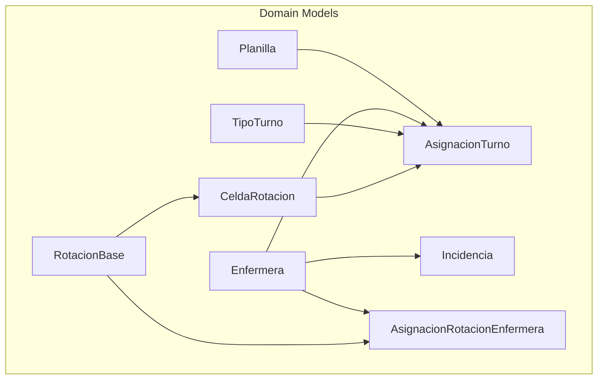
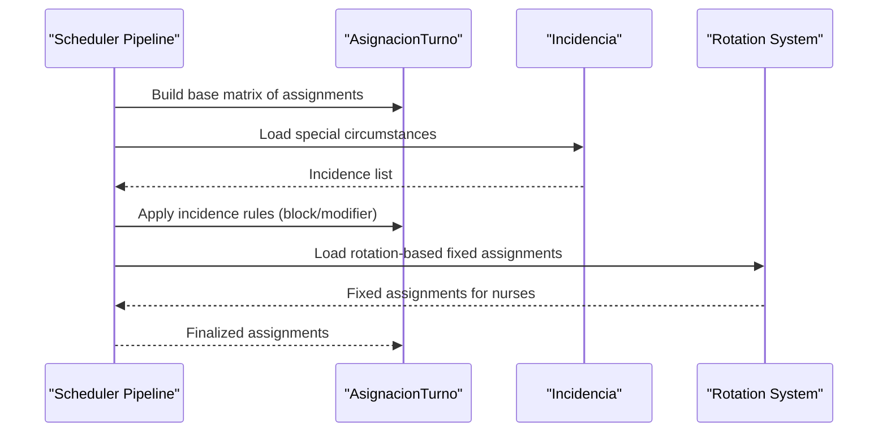
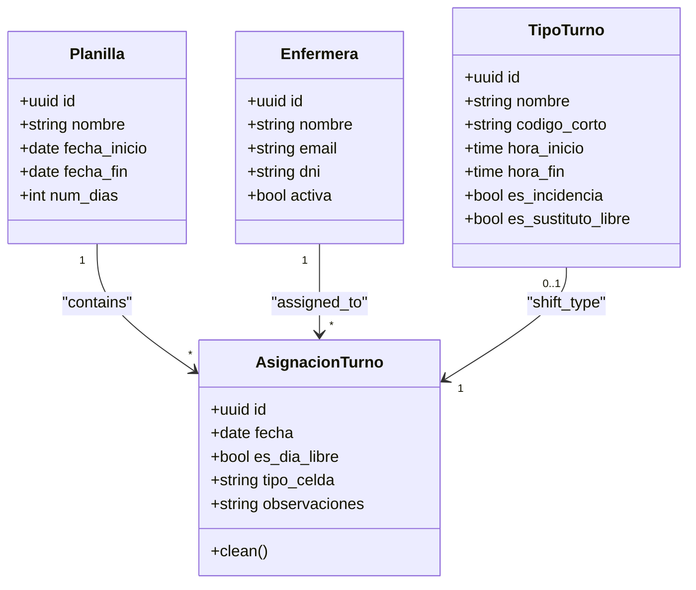
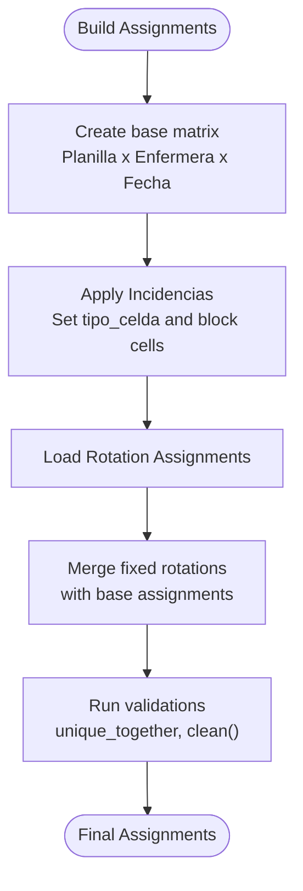
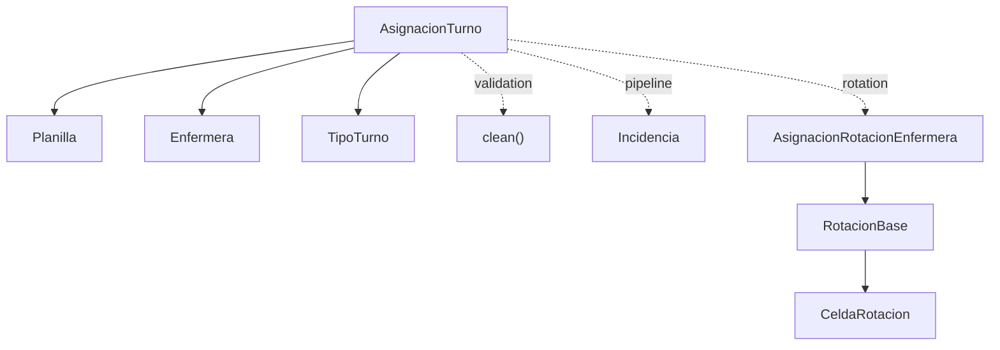

# Assignment Model

<cite>
**Referenced Files in This Document**
- [models.py](file://turnos/models.py)
- [admin.py](file://turnos/admin.py)
- [incidencias.py](file://turnos/motor/incidencias.py)
- [tasks.py](file://turnos/tasks.py)
- [0001_initial.py](file://turnos/migrations/0001_initial.py)
- [0009_add_domain_models.py](file://turnos/migrations/0009_add_domain_models.py)
- [test_dtos.py](file://turnos/tests/test_dominio/test_dtos.py)
- [analisis_solo_turnos_limpio.py](file://analisis_solo_turnos_limpio.py)
</cite>

## Table of Contents
1. [Introduction](#introduction)
2. [Project Structure](#project-structure)
3. [Core Components](#core-components)
4. [Architecture Overview](#architecture-overview)
5. [Detailed Component Analysis](#detailed-component-analysis)
6. [Dependency Analysis](#dependency-analysis)
7. [Performance Considerations](#performance-considerations)
8. [Troubleshooting Guide](#troubleshooting-guide)
9. [Conclusion](#conclusion)

## Introduction
This document describes the AsignacionTurno model, which represents individual shift assignments within a schedule. It explains how assignments link Planilla, Enfermera, and TipoTurno; how the date-based assignment system works; and the flexible cell typing system that supports various assignment categories. It also documents the unique constraint preventing duplicate assignments per planilla/enfermera/date, the es_dia_libre flag for free days, and the tipo_celda field for different assignment types. Validation rules, integration with Incidencia for special circumstances, and integration with the rotation system are covered, along with practical examples of assignment creation, type categorization, and validation scenarios.

## Project Structure
The AsignacionTurno model is part of the turnos app domain models. It integrates with related models (Planilla, Enfermera, TipoTurno) and participates in the broader scheduling pipeline alongside Incidencia and rotation components.

**Diagram sources**
- [models.py:534-566](file://turnos/models.py#L534-L566)
- [models.py:568-623](file://turnos/models.py#L568-L623)
- [models.py:749-784](file://turnos/models.py#L749-L784)
- [models.py:666-747](file://turnos/models.py#L666-L747)

**Section sources**
- [models.py:534-566](file://turnos/models.py#L534-L566)
- [models.py:568-623](file://turnos/models.py#L568-L623)
- [models.py:749-784](file://turnos/models.py#L749-L784)
- [models.py:666-747](file://turnos/models.py#L666-L747)

## Core Components
- AsignacionTurno: Represents a single assignment of a shift or day off to a nurse for a specific date within a schedule.
- Planilla: The schedule container that groups assignments.
- Enfermera: The nurse being assigned.
- TipoTurno: Defines the type of shift (including metadata like hours and whether it acts as a substitute for a free day).
- Incidencia: Records special circumstances (vacations, permission, medical leave, training, fixed assignment, blocked assignment) that override normal assignments.
- Rotation models: Support cyclic shift patterns and fixed assignments for nurses.

Key fields and constraints:
- unique_together: planilla, enfermera, fecha prevents duplicate assignments per nurse per day within the same schedule.
- es_dia_libre: Boolean flag indicating a free day.
- tipo_celda: Explicit cell type classification supporting TURNO, LIBRE, VACACIONES, PERMISO, BAJA, FORMACION, ASIGNACION_FIJA.

Validation rules:
- clean(): Ensures that a cell marked as TURNO either has a valid turno assigned or is marked as es_dia_libre.

**Section sources**
- [models.py:568-623](file://turnos/models.py#L568-L623)
- [models.py:534-566](file://turnos/models.py#L534-L566)
- [models.py:30-58](file://turnos/models.py#L30-L58)
- [models.py:60-125](file://turnos/models.py#L60-L125)
- [models.py:749-784](file://turnos/models.py#L749-L784)

## Architecture Overview
AsignacionTurno sits at the intersection of schedule composition and special circumstance handling. The system applies Incidencia to block or modify cells and integrates with rotation-based fixed assignments.

**Diagram sources**
- [incidencias.py:37-97](file://turnos/motor/incidencias.py#L37-L97)
- [tasks.py:448-467](file://turnos/tasks.py#L448-L467)
- [models.py:568-623](file://turnos/models.py#L568-L623)
- [models.py:749-784](file://turnos/models.py#L749-L784)
- [models.py:666-747](file://turnos/models.py#L666-L747)

## Detailed Component Analysis

### AsignacionTurno Model
AsignacionTurno encapsulates a single assignment within a Planilla for a given Enfermera on a specific date. It can represent a regular shift (via TipoTurno), a free day (es_dia_libre), or a special circumstance captured via tipo_celda.

**Diagram sources**
- [models.py:534-566](file://turnos/models.py#L534-L566)
- [models.py:30-58](file://turnos/models.py#L30-L58)
- [models.py:60-125](file://turnos/models.py#L60-L125)
- [models.py:568-623](file://turnos/models.py#L568-L623)

Assignment structure and relationships:
- Links Planilla (schedule container), Enfermera (assignee), and TipoTurno (shift type).
- Date-based assignment ensures one assignment per nurse per day within a schedule via unique_together.
- Free day representation via es_dia_libre or explicit tipo_celda = LIBRE.
- Special circumstances via tipo_celda values (VACACIONES, PERMISO, BAJA, FORMACION, ASIGNACION_FIJA).

Unique constraint system:
- unique_together = ['planilla', 'enfermera', 'fecha'] prevents duplicate assignments.

Flexible cell typing system:
- TIPO_CELDA_CHOICES includes TURNO, LIBRE, VACACIONES, PERMISO, BAJA, FORMACION, ASIGNACION_FIJA.
- tipo_celda allows explicit categorization independent of turno value.

Validation rules:
- clean(): If tipo_celda is TURNO, either turno must be set or es_dia_libre must be True.

Integration with Incidencia:
- Incidencia defines special circumstances that override normal assignments.
- The pipeline applies Incidencia to mark cells as non-modifiable and sets appropriate tipo_celda values.

Integration with rotation system:
- AsignacionRotacionEnfermera links nurses to RotacionBase cycles with a start date and offset.
- RotacionBase defines cyclic sequences of shifts or frees (CeldaRotacion), enabling fixed assignments over time.

**Section sources**
- [models.py:568-623](file://turnos/models.py#L568-L623)
- [models.py:534-566](file://turnos/models.py#L534-L566)
- [models.py:30-58](file://turnos/models.py#L30-L58)
- [models.py:60-125](file://turnos/models.py#L60-L125)
- [models.py:749-784](file://turnos/models.py#L749-L784)
- [models.py:666-747](file://turnos/models.py#L666-L747)
- [incidencias.py:37-97](file://turnos/motor/incidencias.py#L37-L97)
- [tasks.py:448-467](file://turnos/tasks.py#L448-L467)

### Assignment Creation Examples
Examples of creating assignments and categorizing them by tipo_celda:

- Regular shift assignment:
  - Set tipo_celda = TURNO and assign a valid turno.
  - Ensure es_dia_libre remains False.
  - Unique constraint allows one assignment per nurse per day within the same planilla.

- Free day assignment:
  - Set es_dia_libre = True or tipo_celda = LIBRE.
  - Leave turno unset or intentionally empty.

- Special circumstance assignments:
  - VACACIONES: Mark tipo_celda = VACACIONES; turno is cleared; cell becomes non-modifiable.
  - PERMISO: Mark tipo_celda = PERMISO; turno is cleared; cell becomes non-modifiable.
  - BAJA: Mark tipo_celda = BAJA; turno is cleared; cell becomes non-modifiable.
  - FORMACION: Mark tipo_celda = FORMACION; cell becomes non-modifiable.
  - ASIGNACION_FIJA: Mark tipo_celda = ASIGNACION_FIJA; assign a specific turno_fijo; cell becomes non-modifiable.

These examples reflect the behavior defined in the Incidencia pipeline and the explicit cell typing system.

**Section sources**
- [models.py:568-623](file://turnos/models.py#L568-L623)
- [models.py:749-784](file://turnos/models.py#L749-L784)
- [incidencias.py:57-91](file://turnos/motor/incidencias.py#L57-L91)

### Validation Scenarios
Common validation scenarios enforced by the model and pipeline:

- TURNO validation:
  - If tipo_celda = TURNO, either turno must be assigned or es_dia_libre must be True; otherwise, a validation error is raised.

- Incidence overlap:
  - Incidences define non-modifiable periods; the scheduler marks affected cells accordingly and clears turno when applicable.

- Rotation-based fixed assignments:
  - Fixed assignments derived from rotations are applied consistently across cycles and dates.

- Admin interface support:
  - Django admin displays assignment lists, filters by date and turn type, and supports quick editing.

**Section sources**
- [models.py:617-622](file://turnos/models.py#L617-L622)
- [incidencias.py:37-97](file://turnos/motor/incidencias.py#L37-L97)
- [admin.py:249-267](file://turnos/admin.py#L249-L267)

### Data Flow and Processing Logic
The assignment lifecycle involves building a base matrix, applying special circumstances, and integrating fixed assignments from rotations.

**Diagram sources**
- [incidencias.py:37-97](file://turnos/motor/incidencias.py#L37-L97)
- [tasks.py:448-467](file://turnos/tasks.py#L448-L467)
- [models.py:568-623](file://turnos/models.py#L568-L623)

## Dependency Analysis
AsignacionTurno depends on Planilla, Enfermera, and TipoTurno. It interacts with Incidencia during the scheduling pipeline and with rotation models for fixed assignments.

**Diagram sources**
- [models.py:568-623](file://turnos/models.py#L568-L623)
- [models.py:749-784](file://turnos/models.py#L749-L784)
- [models.py:666-747](file://turnos/models.py#L666-L747)

**Section sources**
- [models.py:568-623](file://turnos/models.py#L568-L623)
- [models.py:749-784](file://turnos/models.py#L749-L784)
- [models.py:666-747](file://turnos/models.py#L666-L747)

## Performance Considerations
- Indexing: Ensure database indexes exist on frequently queried fields (planilla, enfermera, fecha) to optimize assignment retrieval and validation.
- Batch operations: When generating assignments for long periods, batch updates and validations to minimize database round trips.
- Incidence application: Apply Incidencia in bulk to avoid repeated lookups and to leverage efficient date-range iteration.
- Rotation integration: Precompute rotation-derived assignments to reduce runtime computation during scheduling.

## Troubleshooting Guide
Common issues and resolutions:

- Duplicate assignment error:
  - Symptom: IntegrityError on unique_together constraint.
  - Resolution: Verify that no second assignment exists for the same planilla, enfermera, and fecha.

- Validation error for TURNO:
  - Symptom: ValidationError when tipo_celda = TURNO without a valid turno and es_dia_libre = False.
  - Resolution: Either assign a turno or set es_dia_libre = True.

- Incidence conflicts:
  - Symptom: Unexpected free days or missing shifts after applying Incidencia.
  - Resolution: Confirm incidence dates and types; verify that tipo_celda was set and turno cleared appropriately.

- Rotation mismatches:
  - Symptom: Incorrect fixed assignments overriding planned shifts.
  - Resolution: Review AsignacionRotacionEnfermera and RotacionBase configurations; confirm cycle length and offsets.

**Section sources**
- [models.py:617-622](file://turnos/models.py#L617-L622)
- [incidencias.py:37-97](file://turnos/motor/incidencias.py#L37-L97)
- [tasks.py:448-467](file://turnos/tasks.py#L448-L467)

## Conclusion
AsignacionTurno provides a robust foundation for representing daily assignments within a schedule. Its integration with Planilla, Enfermera, and TipoTurno, combined with the flexible cell typing system and strict validation rules, ensures accurate and conflict-free scheduling. The model’s compatibility with Incidencia and the rotation system enables comprehensive coverage of special circumstances and fixed patterns, making it suitable for real-world healthcare scheduling needs.