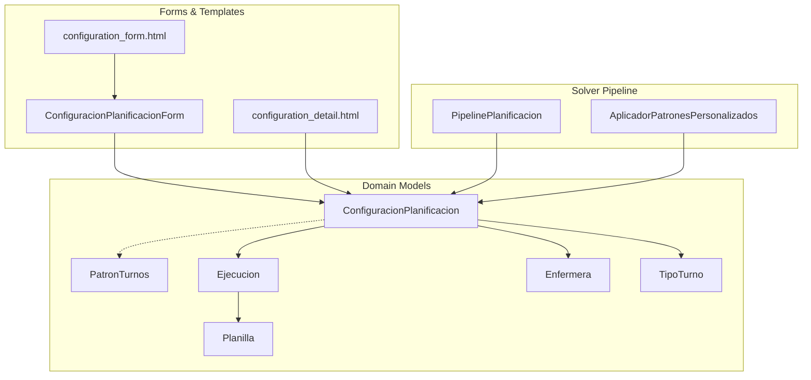
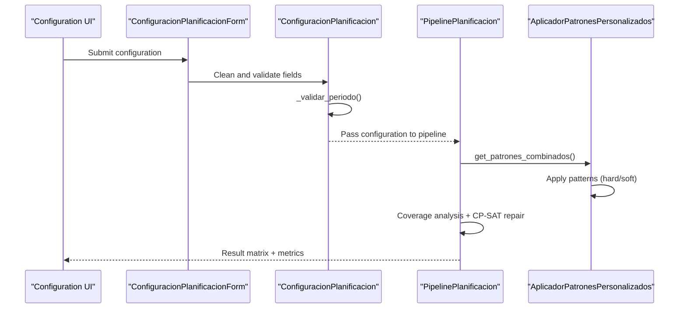
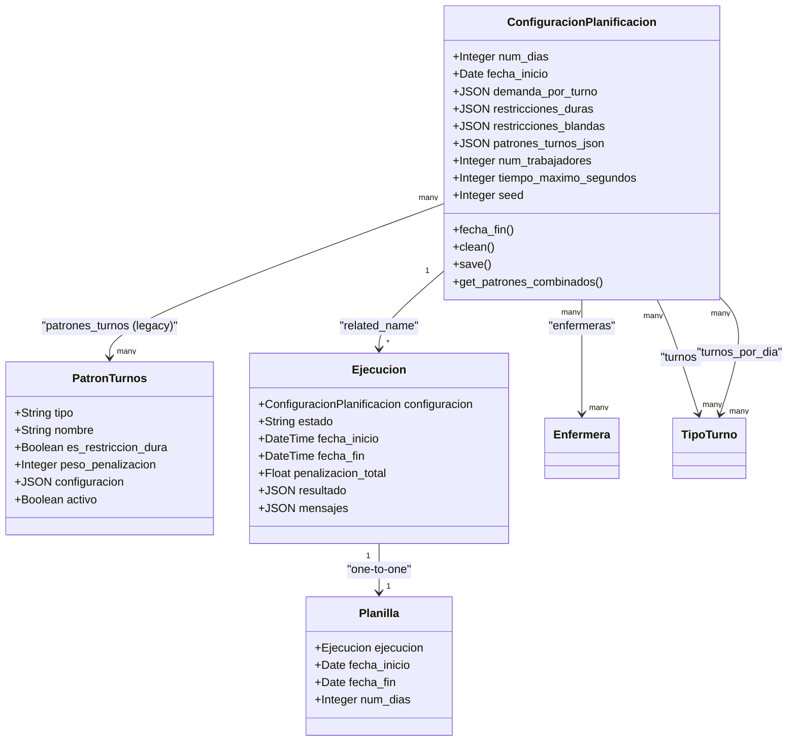
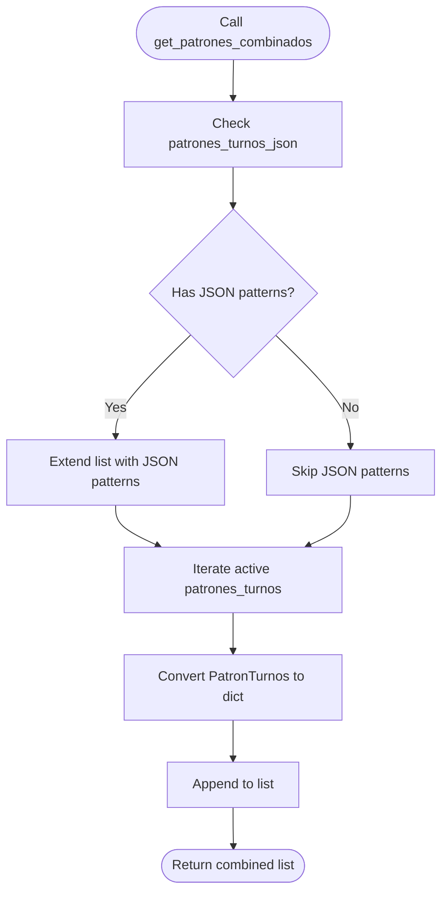
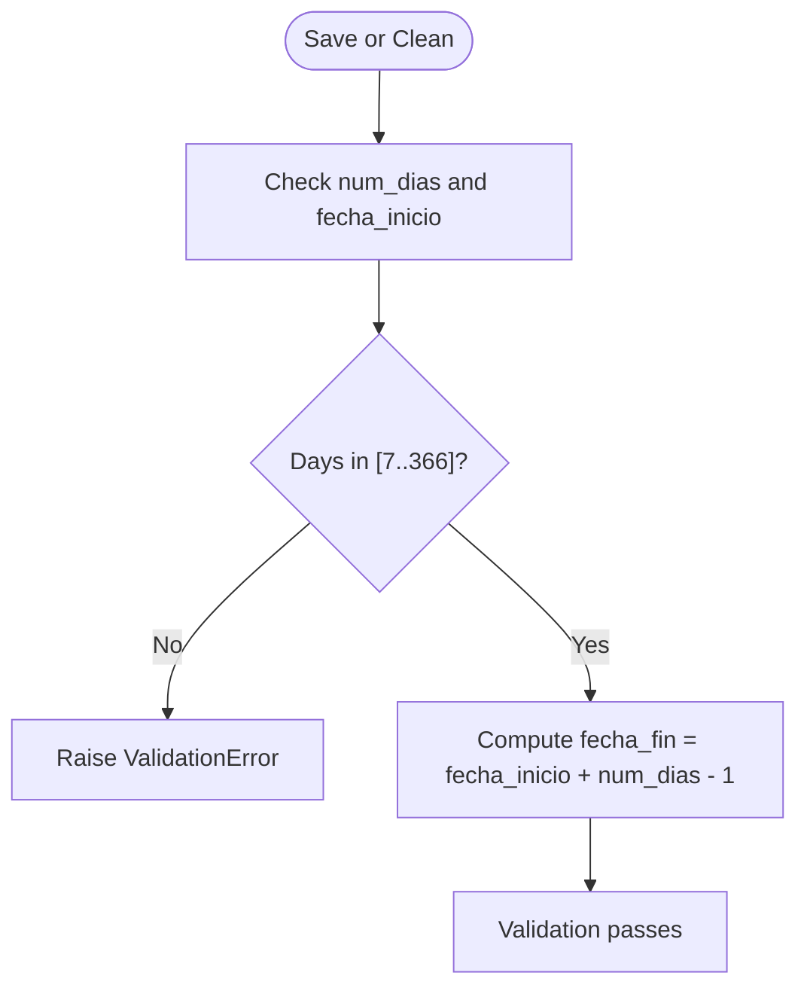
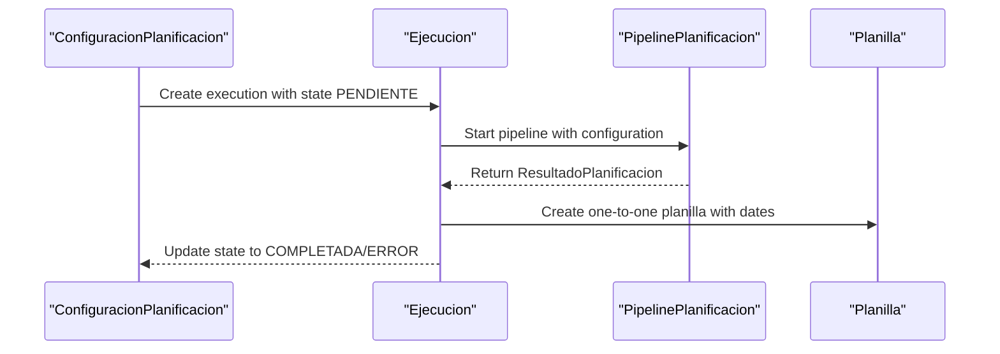
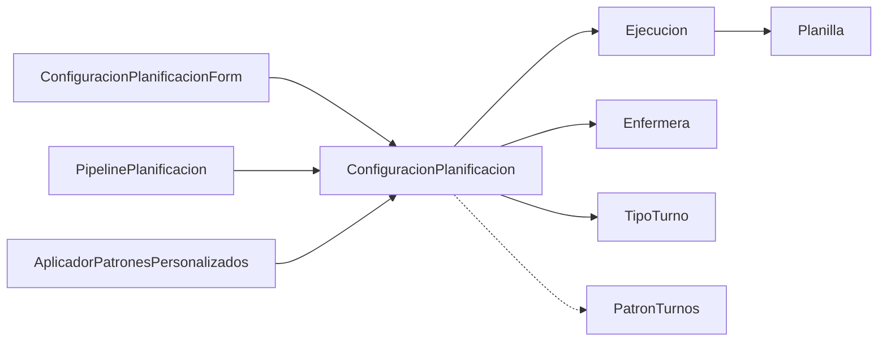

# Configuration Model

<cite>
**Referenced Files in This Document**
- [models.py](file://turnos/models.py)
- [forms.py](file://turnos/forms.py)
- [patrones.py](file://turnos/patrones.py)
- [pipeline.py](file://turnos/motor/pipeline.py)
- [tasks.py](file://turnos/tasks.py)
- [demo_configuracion.json](file://turnos/fixtures/demo_configuracion.json)
- [configuration_form.html](file://turnos/templates/turnos/configuration_form.html)
- [configuration_detail.html](file://turnos/templates/turnos/configuration_detail.html)
- [0008_configuracionplanificacion_patrones_turnos_json_and_more.py](file://turnos/migrations/0008_configuracionplanificacion_patrones_turnos_json_and_more.py)
- [0002_alter_configuracionplanificacion_demanda_por_turno_and_more.py](file://turnos/migrations/0002_alter_configuracionplanificacion_demanda_por_turno_and_more.py)
- [0007_alter_configuracionplanificacion_options_and_more.py](file://turnos/migrations/0007_alter_configuracionplanificacion_options_and_more.py)
</cite>

## Table of Contents
1. [Introduction](#introduction)
2. [Project Structure](#project-structure)
3. [Core Components](#core-components)
4. [Architecture Overview](#architecture-overview)
5. [Detailed Component Analysis](#detailed-component-analysis)
6. [Dependency Analysis](#dependency-analysis)
7. [Performance Considerations](#performance-considerations)
8. [Troubleshooting Guide](#troubleshooting-guide)
9. [Conclusion](#conclusion)

## Introduction
This document describes the ConfiguracionPlanificacion model, which defines the planning configuration system. It explains how the model stores scheduling parameters (planning period, staff, shift types, demand forecasts, hard and soft constraints, solver parameters), documents the dual pattern system combining JSON-form configured patterns with legacy ManyToMany relationships, and details validation rules for planning periods. It also covers the get_patrones_combinados method for unified pattern access and the relationships with Ejecucion and Planilla models.

## Project Structure
The configuration model lives in the domain layer alongside related models for staff, shift types, executions, and schedules. Forms handle validation and user input, while templates render configuration interfaces. Migrations evolve the model to support modernization (JSON patterns) and maintain backward compatibility (legacy ManyToMany).

**Diagram sources**
- [models.py:332-480](file://turnos/models.py#L332-L480)
- [forms.py:164-326](file://turnos/forms.py#L164-L326)
- [configuration_form.html:347-512](file://turnos/templates/turnos/configuration_form.html#L347-L512)
- [configuration_detail.html:303-338](file://turnos/templates/turnos/configuration_detail.html#L303-L338)
- [pipeline.py:31-267](file://turnos/motor/pipeline.py#L31-L267)
- [patrones.py:8-64](file://turnos/patrones.py#L8-L64)

**Section sources**
- [models.py:332-480](file://turnos/models.py#L332-L480)
- [forms.py:164-326](file://turnos/forms.py#L164-L326)
- [configuration_form.html:347-512](file://turnos/templates/turnos/configuration_form.html#L347-L512)
- [configuration_detail.html:303-338](file://turnos/templates/turnos/configuration_detail.html#L303-L338)
- [pipeline.py:31-267](file://turnos/motor/pipeline.py#L31-L267)
- [patrones.py:8-64](file://turnos/patrones.py#L8-L64)

## Core Components
- Planning period: num_dias (validated 7–365 days), fecha_inicio, computed fecha_fin
- Staff and shift types: enfermeras (ManyToMany), turnos (ManyToMany), turnos_por_dia (ManyToMany, optional subset)
- Demand forecasts: demanda_por_turno (JSON dict)
- Hard and soft constraints: restricciones_duras (JSON list), restricciones_blandas (JSON list)
- Pattern system: patrones_turnos_json (JSON list of patterns), patrones_turnos (legacy ManyToMany with PatronTurnos)
- Solver parameters: num_trabajadores (workers), tiempo_maximo_segundos (timeout), seed (randomness)
- Validation: _validar_periodo() enforced via form.clean() and model.save()

Key behaviors:
- get_patrones_combinados(): merges patrones_turnos_json (primary) with active patrones_turnos (legacy fallback)
- Relationship with Ejecucion: one-to-many via related_name
- Relationship with Planilla: one-to-one via Ejecucion

**Section sources**
- [models.py:346-480](file://turnos/models.py#L346-L480)
- [forms.py:210-326](file://turnos/forms.py#L210-L326)
- [patrones.py:23-48](file://turnos/patrones.py#L23-L48)

## Architecture Overview
The configuration drives the planning pipeline. The solver pipeline consumes configuration fields to construct matrices, apply coverage analysis, repair conflicts with CP-SAT, and validate results. Patterns are applied either from JSON-defined patterns or legacy database-backed patterns.

**Diagram sources**
- [forms.py:210-326](file://turnos/forms.py#L210-L326)
- [models.py:425-480](file://turnos/models.py#L425-L480)
- [pipeline.py:92-236](file://turnos/motor/pipeline.py#L92-L236)
- [patrones.py:23-64](file://turnos/patrones.py#L23-L64)

## Detailed Component Analysis

### ConfiguracionPlanificacion Model
- Fields:
  - Temporal: num_dias, fecha_inicio, computed fecha_fin
  - Staff/Shifts: enfermeras, turnos, turnos_por_dia
  - Demand: demanda_por_turno (JSON)
  - Constraints: restricciones_duras, restricciones_blandas (JSON)
  - Patterns: patrones_turnos_json (JSON), patrones_turnos (legacy ManyToMany)
  - Solver: num_trabajadores, tiempo_maximo_segundos, seed
- Validation:
  - _validar_periodo(): ensures minimum/maximum days and raises errors if invalid
  - clean(): delegates to _validar_periodo()
  - save(): validates during creation
- Accessor:
  - get_patrones_combinados(): returns unified list prioritizing JSON patterns, then legacy patterns

**Diagram sources**
- [models.py:332-566](file://turnos/models.py#L332-L566)

**Section sources**
- [models.py:332-480](file://turnos/models.py#L332-L480)

### Dual Pattern System
The model supports two sources of patterns:
- patrones_turnos_json: dynamic patterns configured via form JSON (primary source)
- patrones_turnos: legacy ManyToMany with PatronTurnos (fallback for compatibility)

get_patrones_combinados():
- Iterates patrones_turnos_json first (if present)
- Then iterates active patrones_turnos and converts them to dictionary format
- Returns unified list for consumption by the solver

**Diagram sources**
- [models.py:457-480](file://turnos/models.py#L457-L480)

**Section sources**
- [models.py:457-480](file://turnos/models.py#L457-L480)
- [0008_configuracionplanificacion_patrones_turnos_json_and_more.py:12-28](file://turnos/migrations/0008_configuracionplanificacion_patrones_turnos_json_and_more.py#L12-L28)

### Validation Rules for Planning Periods
- Minimum/maximum days enforced: 7–366 days
- Validation occurs in:
  - Form: clean_num_dias() and per-field validation
  - Model: _validar_periodo() called from clean() and save()
- Defensive validation also performed in Celery task runner

**Diagram sources**
- [models.py:425-456](file://turnos/models.py#L425-L456)
- [forms.py:210-216](file://turnos/forms.py#L210-L216)
- [tasks.py:385-393](file://turnos/tasks.py#L385-L393)

**Section sources**
- [models.py:425-456](file://turnos/models.py#L425-L456)
- [forms.py:210-216](file://turnos/forms.py#L210-L216)
- [tasks.py:385-393](file://turnos/tasks.py#L385-L393)

### Relationship with Ejecucion and Planilla
- Ejecucion: links a configuration to a single execution run; stores solver state and results
- Planilla: one-to-one with Ejecucion, representing the final schedule with dates and assignments
- The pipeline produces a ResultadoPlanificacion consumed by the execution and planilla generation

**Diagram sources**
- [models.py:482-566](file://turnos/models.py#L482-L566)
- [pipeline.py:92-236](file://turnos/motor/pipeline.py#L92-L236)

**Section sources**
- [models.py:482-566](file://turnos/models.py#L482-L566)
- [pipeline.py:92-236](file://turnos/motor/pipeline.py#L92-L236)

### Examples

#### Example: Configuration Creation
- Use the configuration form to set:
  - Basic info: nombre, descripcion, num_dias, fecha_inicio
  - Staff/shifts: enfermeras, turnos, turnos_por_dia
  - Demand: demanda_por_turno (JSON)
  - Constraints: restricciones_duras, restricciones_blandas (JSON)
  - Patterns: patrones_turnos_json (JSON list) or legacy patrones_turnos (ManyToMany)
  - Solver: num_trabajadores, tiempo_maximo_segundos, seed
- The form validates fields and persists to ConfiguracionPlanificacion

**Section sources**
- [forms.py:164-326](file://turnos/forms.py#L164-L326)
- [configuration_form.html:347-512](file://turnos/templates/turnos/configuration_form.html#L347-L512)

#### Example: Pattern Combinations
- JSON patterns (primary): define custom patterns with tipo, nombre, es_restriccion_dura, peso_penalizacion, configuracion
- Legacy patterns (fallback): PatronTurnos entries linked via ManyToMany
- get_patrones_combinados() merges both sources, ensuring JSON patterns take precedence

**Section sources**
- [models.py:457-480](file://turnos/models.py#L457-L480)
- [configuration_detail.html:303-338](file://turnos/templates/turnos/configuration_detail.html#L303-L338)

#### Example: Validation Scenarios
- Too few days (<7): ValidationError raised
- Too many days (>366): ValidationError raised
- Invalid JSON fields: ValidationError raised by form cleaners
- Celery task runner performs additional validation before execution

**Section sources**
- [models.py:425-456](file://turnos/models.py#L425-L456)
- [forms.py:231-326](file://turnos/forms.py#L231-L326)
- [tasks.py:385-393](file://turnos/tasks.py#L385-L393)

## Dependency Analysis
- ConfiguracionPlanificacion depends on:
  - Workspace (isolation), User (audit), Enfermera, TipoTurno (staff/shifts)
  - Ejecucion (execution lifecycle), Planilla (final schedule)
  - PatronTurnos (legacy patterns)
- Forms validate and normalize JSON fields before saving
- The solver pipeline consumes configuration to build and repair matrices

**Diagram sources**
- [forms.py:164-326](file://turnos/forms.py#L164-L326)
- [models.py:332-566](file://turnos/models.py#L332-L566)
- [pipeline.py:31-267](file://turnos/motor/pipeline.py#L31-L267)
- [patrones.py:8-64](file://turnos/patrones.py#L8-L64)

**Section sources**
- [forms.py:164-326](file://turnos/forms.py#L164-L326)
- [models.py:332-566](file://turnos/models.py#L332-L566)
- [pipeline.py:31-267](file://turnos/motor/pipeline.py#L31-L267)
- [patrones.py:8-64](file://turnos/patrones.py#L8-L64)

## Performance Considerations
- Solver parameters:
  - num_trabajadores controls parallel workers (1–8)
  - tiempo_maximo_segundos sets timeout (10–600 seconds)
  - seed enables deterministic runs
- Pattern complexity impacts solver runtime; keep JSON patterns concise and avoid excessive penalties
- Large num_dias increases matrix size; validate period bounds to prevent excessive computation

**Section sources**
- [forms.py:470-499](file://turnos/forms.py#L470-L499)
- [WIKI.md:940-959](file://docs/WIKI.md#L940-L959)

## Troubleshooting Guide
Common issues and resolutions:
- Planning period out of range: adjust num_dias to 7–366 days
- Invalid JSON fields: ensure demanda_por_turno, restricciones_duras/blandas, and patrones_turnos_json conform to expected formats
- Missing staff/shifts: select at least 2 enfermeras and 1 tipo de turno
- Legacy pattern conversion: if using patrones_turnos, ensure PatronTurnos entries are active and properly configured

**Section sources**
- [models.py:425-456](file://turnos/models.py#L425-L456)
- [forms.py:217-326](file://turnos/forms.py#L217-L326)
- [configuration_detail.html:303-338](file://turnos/templates/turnos/configuration_detail.html#L303-L338)

## Conclusion
ConfiguracionPlanificacion centralizes planning configuration with robust validation, flexible pattern sources (JSON plus legacy), and clear relationships to execution and schedule models. Its dual pattern system enables modern, dynamic configuration while preserving compatibility with existing database-backed patterns. Proper use of solver parameters and validation rules ensures reliable, efficient planning runs.