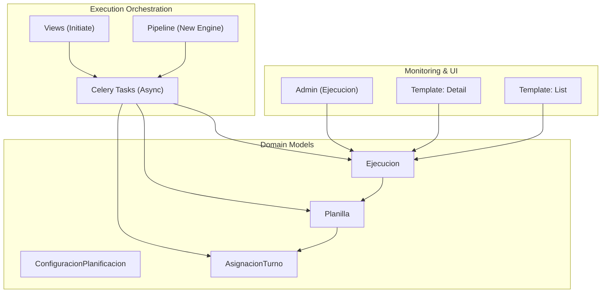
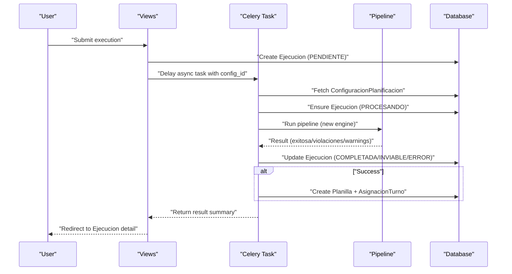
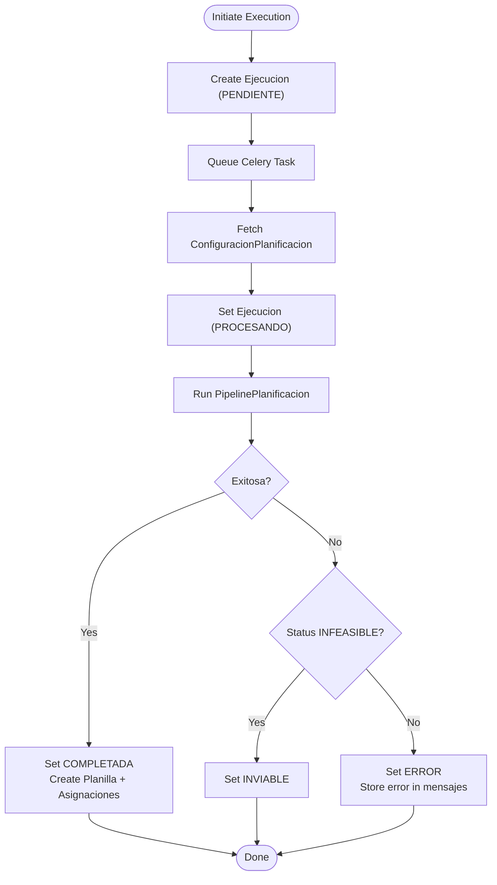
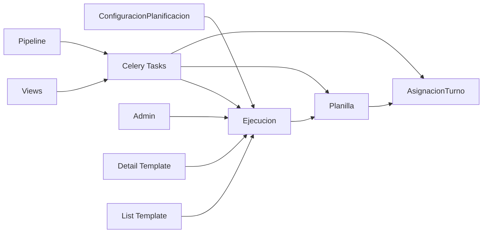

# Execution Model

<cite>
**Referenced Files in This Document**
- [models.py](file://turnos/models.py)
- [tasks.py](file://turnos/tasks.py)
- [views.py](file://turnos/views.py)
- [admin.py](file://turnos/admin.py)
- [ejecucion_detail.html](file://turnos/templates/turnos/ejecucion_detail.html)
- [ejecucion_list.html](file://turnos/templates/turnos/ejecucion_list.html)
- [pipeline.py](file://turnos/motor/pipeline.py)
- [run_planificacion.py](file://turnos/management/commands/run_planificacion.py)
</cite>

## Table of Contents
1. [Introduction](#introduction)
2. [Project Structure](#project-structure)
3. [Core Components](#core-components)
4. [Architecture Overview](#architecture-overview)
5. [Detailed Component Analysis](#detailed-component-analysis)
6. [Dependency Analysis](#dependency-analysis)
7. [Performance Considerations](#performance-considerations)
8. [Troubleshooting Guide](#troubleshooting-guide)
9. [Conclusion](#conclusion)

## Introduction
This document explains the Ejecucion model that tracks the planning execution lifecycle. It covers execution states, metadata, solver result tracking, the relationship with ConfiguracionPlanificacion, the end-to-end workflow from initiation to completion, error handling, result storage patterns, monitoring capabilities, performance metrics, and integration with the asynchronous task processing system. It also includes examples of execution tracking, state transitions, and result interpretation.

## Project Structure
The Ejecucion model lives in the domain layer alongside related models such as ConfiguracionPlanificacion, Planilla, and AsignacionTurno. Execution orchestration is handled by Django views and Celery tasks, while monitoring and reporting are exposed via Django admin and templates.



**Diagram sources**
- [models.py:332-531](file://turnos/models.py#L332-L531)
- [tasks.py:17-240](file://turnos/tasks.py#L17-L240)
- [pipeline.py:31-200](file://turnos/motor/pipeline.py#L31-L200)
- [admin.py:182-231](file://turnos/admin.py#L182-L231)
- [ejecucion_detail.html:1-391](file://turnos/templates/turnos/ejecucion_detail.html#L1-L391)
- [ejecucion_list.html:1-190](file://turnos/templates/turnos/ejecucion_list.html#L1-L190)

**Section sources**
- [models.py:332-531](file://turnos/models.py#L332-L531)
- [tasks.py:17-240](file://turnos/tasks.py#L17-L240)
- [admin.py:182-231](file://turnos/admin.py#L182-L231)
- [ejecucion_detail.html:1-391](file://turnos/templates/turnos/ejecucion_detail.html#L1-L391)
- [ejecucion_list.html:1-190](file://turnos/templates/turnos/ejecucion_list.html#L1-L190)

## Core Components
- Ejecucion: Tracks a single planning run with state, timestamps, solver results, and penalties.
- ConfiguracionPlanificacion: Defines the planning problem (period, participants, turn types, constraints).
- Planilla: Stores the generated schedule linked to an Ejecucion.
- AsignacionTurno: Individual assignments within a Planilla.
- Celery Tasks: Execute planning asynchronously and update Ejecucion state/results.
- Views: Initiate executions and handle errors.
- Admin and Templates: Monitor and visualize execution outcomes.

Key attributes of Ejecucion:
- State: PENDIENTE, PROCESANDO, COMPLETADA, INVIABLE, ERROR
- Metadata: fecha_inicio, fecha_fin, duracion
- Solver results: es_optima, penalizacion_total, resultado, mensajes
- Relationship: ForeignKey to ConfiguracionPlanificacion; OneToOne to Planilla via planilla_generada

**Section sources**
- [models.py:482-531](file://turnos/models.py#L482-L531)

## Architecture Overview
End-to-end execution flow from initiation to completion and monitoring.



**Diagram sources**
- [views.py:722-791](file://turnos/views.py#L722-L791)
- [tasks.py:333-696](file://turnos/tasks.py#L333-L696)
- [pipeline.py:92-200](file://turnos/motor/pipeline.py#L92-L200)
- [models.py:482-531](file://turnos/models.py#L482-L531)

## Detailed Component Analysis

### Ejecucion Model
- Purpose: Capture a single planning execution lifecycle.
- States:
  - PENDIENTE: Queued for processing.
  - PROCESANDO: Being executed.
  - COMPLETADA: Successful execution with a generated schedule.
  - INVIABLE: Problem is infeasible.
  - ERROR: Execution failed due to runtime exceptions.
- Metadata:
  - fecha_inicio: Auto-set when created.
  - fecha_fin: Set upon completion/error.
  - duracion: Calculated as difference between fecha_fin and fecha_inicio.
- Solver results:
  - es_optima: Boolean indicating optimality.
  - penalizacion_total: Numeric penalty score when applicable.
  - resultado: JSON payload containing solver diagnostics and matrices.
  - mensajes: JSON validation statistics (validaciones, violaciones).
- Relationships:
  - belongs to ConfiguracionPlanificacion.
  - OneToOne to Planilla via planilla_generada.

```mermaid
classDiagram
class ConfiguracionPlanificacion {
+int num_dias
+date fecha_inicio
+manyToMany enfermeras
+manyToMany turnos
+JSON demanda_por_turno
+JSON restricciones_duras
+JSON restricciones_blandas
}
class Ejecucion {
+charfield estado
+datetime fecha_inicio
+datetime fecha_fin
+boolean es_optima
+float penalizacion_total
+json resultado
+json mensajes
+duration()
}
class Planilla {
+date fecha_inicio
+date fecha_fin
+int num_dias
}
class AsignacionTurno {
+date fecha
+boolean es_dia_libre
+charfield tipo_celda
}
ConfiguracionPlanificacion "1" --> "many" Ejecucion : "has_many"
Ejecucion "1" --> "1" Planilla : "planilla_generada"
Planilla "1" "many" AsignacionTurno : "has_many"
```

**Diagram sources**
- [models.py:332-531](file://turnos/models.py#L332-L531)

**Section sources**
- [models.py:482-531](file://turnos/models.py#L482-L531)

### Execution Workflow and State Transitions
- Initiation:
  - View creates Ejecucion with estado PENDIENTE.
  - Celery task is delayed with the configuration id.
- Processing:
  - Task fetches ConfiguracionPlanificacion and ensures Ejecucion is in PROCESANDO.
  - New engine runs PipelinePlanificacion to compute the schedule.
- Completion:
  - On success: Ejecucion.estado set to COMPLETADA; Planilla and AsignacionTurno created.
  - On infeasibility: Ejecucion.estado set to INVIABLE.
  - On failure: Ejecucion.estado set to ERROR; error stored in mensajes.
- Monitoring:
  - Admin displays Ejecucion badges per state.
  - Templates show duration, optimality, penalties, and export actions.



**Diagram sources**
- [views.py:722-791](file://turnos/views.py#L722-L791)
- [tasks.py:333-696](file://turnos/tasks.py#L333-L696)
- [pipeline.py:92-200](file://turnos/motor/pipeline.py#L92-L200)

**Section sources**
- [views.py:722-791](file://turnos/views.py#L722-L791)
- [tasks.py:333-696](file://turnos/tasks.py#L333-L696)
- [pipeline.py:92-200](file://turnos/motor/pipeline.py#L92-L200)

### Result Storage Patterns
- resultado: JSON payload with solver diagnostics and matrices (e.g., violations, warnings, balances).
- mensajes: Validation statistics (validaciones, violaciones) when present.
- penalizacion_total: Stored when computed by the solver.
- Planilla and AsignacionTurno are created only on successful completion.

**Section sources**
- [tasks.py:106-125](file://turnos/tasks.py#L106-L125)
- [tasks.py:130-173](file://turnos/tasks.py#L130-L173)

### Execution Monitoring Capabilities
- Admin:
  - EjecucionAdmin shows estado badges, durations, optima flag, penalties, and links to results.
- Templates:
  - Ejecucion detail lists execution info, planilla stats, and export options.
  - Ejecucion list supports filtering by state and date range, and shows duration and penalties.
- Management command:
  - run_planificacion.py executes synchronously for testing and debugging.

**Section sources**
- [admin.py:182-231](file://turnos/admin.py#L182-L231)
- [ejecucion_detail.html:140-391](file://turnos/templates/turnos/ejecucion_detail.html#L140-L391)
- [ejecucion_list.html:20-190](file://turnos/templates/turnos/ejecucion_list.html#L20-L190)
- [run_planificacion.py:1-40](file://turnos/management/commands/run_planificacion.py#L1-L40)

### Integration with Asynchronous Task Processing
- Views trigger Celery tasks with ejecutar_planificacion_motor_async.
- Tasks handle retries, error logging, and atomic updates to Ejecucion.
- Statistics and cleanup tasks (e.g., limpiar_ejecuciones_antiguas) support long-term maintenance.

**Section sources**
- [views.py:722-791](file://turnos/views.py#L722-L791)
- [tasks.py:17-240](file://turnos/tasks.py#L17-L240)
- [tasks.py:242-268](file://turnos/tasks.py#L242-L268)

## Dependency Analysis
- Ejecucion depends on ConfiguracionPlanificacion for problem definition.
- Celery tasks depend on Ejecucion and Planilla creation for persistence.
- Templates depend on Ejecucion fields for rendering status, duration, and penalties.
- Pipeline orchestrates solver stages and returns structured results used to populate Ejecucion.



**Diagram sources**
- [models.py:332-531](file://turnos/models.py#L332-L531)
- [tasks.py:333-696](file://turnos/tasks.py#L333-L696)
- [pipeline.py:31-200](file://turnos/motor/pipeline.py#L31-L200)
- [admin.py:182-231](file://turnos/admin.py#L182-L231)
- [ejecucion_detail.html:1-391](file://turnos/templates/turnos/ejecucion_detail.html#L1-L391)
- [ejecucion_list.html:1-190](file://turnos/templates/turnos/ejecucion_list.html#L1-L190)

**Section sources**
- [models.py:332-531](file://turnos/models.py#L332-L531)
- [tasks.py:333-696](file://turnos/tasks.py#L333-L696)
- [pipeline.py:31-200](file://turnos/motor/pipeline.py#L31-L200)
- [admin.py:182-231](file://turnos/admin.py#L182-L231)
- [ejecucion_detail.html:1-391](file://turnos/templates/turnos/ejecucion_detail.html#L1-L391)
- [ejecucion_list.html:1-190](file://turnos/templates/turnos/ejecucion_list.html#L1-L190)

## Performance Considerations
- Duration calculation: Ejecucion.duracion is derived from fecha_fin - fecha_inicio, enabling quick sorting and reporting.
- Batch creation: AsignacionTurno uses bulk_create to minimize database overhead after successful execution.
- Cleanup task: limpiar_ejecuciones_antiguas removes old completed/error records to keep the database lean.
- Retry policy: Celery tasks retry up to a configured limit to handle transient failures.

[No sources needed since this section provides general guidance]

## Troubleshooting Guide
Common scenarios and how they are captured:
- Infeasible problem: Ejecucion.estado becomes INVIABLE; resultado includes status INFEASIBLE.
- Runtime error: Ejecucion.estado becomes ERROR; mensajes stores error details and retry count.
- Validation warnings: Ejecucion.mensajes captures validaciones and violaciones for post-execution review.
- Long-running tasks: Use Ejecucion.duracion and admin/list filters to monitor performance and diagnose bottlenecks.

Operational tips:
- Use Ejecucion list filters (state, date range) to locate problematic runs.
- Inspect Ejecucion detail for solver diagnostics and penalties.
- For persistent failures, check Celery task logs and retry counts.

**Section sources**
- [tasks.py:204-240](file://turnos/tasks.py#L204-L240)
- [tasks.py:106-125](file://turnos/tasks.py#L106-L125)
- [views.py:722-791](file://turnos/views.py#L722-L791)
- [ejecucion_list.html:20-190](file://turnos/templates/turnos/ejecucion_list.html#L20-L190)

## Conclusion
The Ejecucion model provides a robust, auditable record of each planning execution. Its state machine, metadata, and result storage enable clear monitoring, comparison, and troubleshooting. Combined with Celery’s asynchronous processing and the new pipeline engine, it delivers scalable, observable scheduling workflows suitable for production environments.