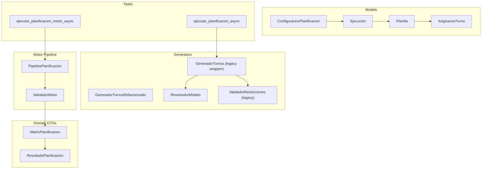
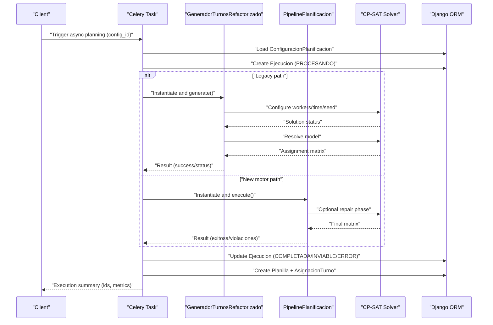
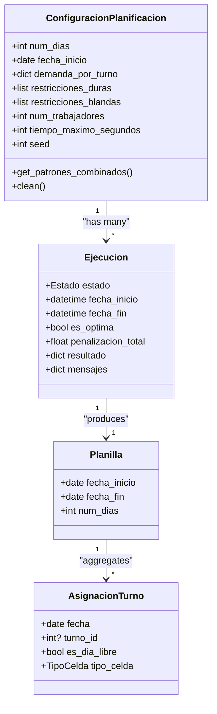
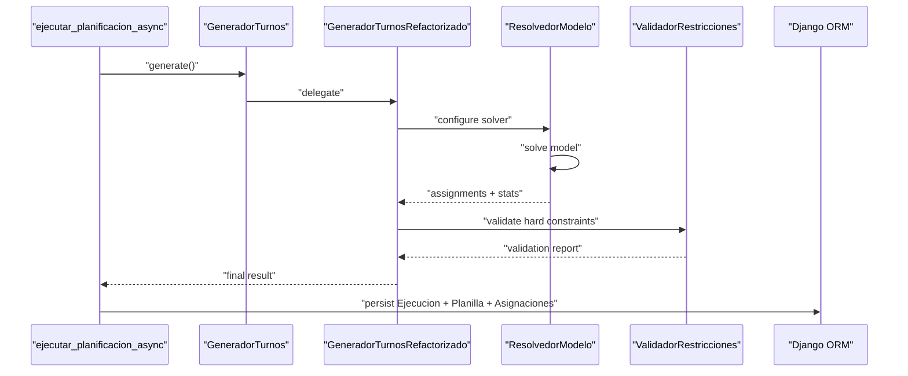
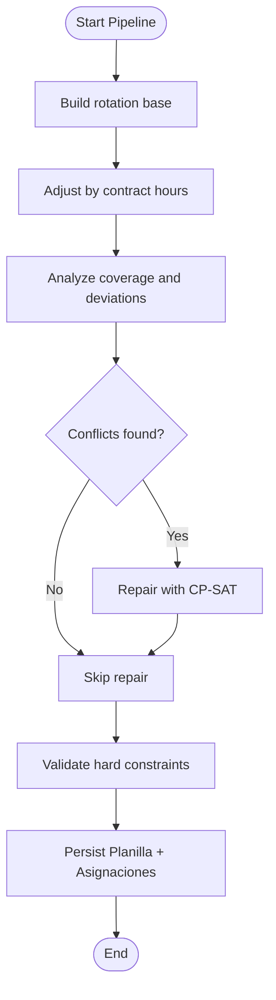
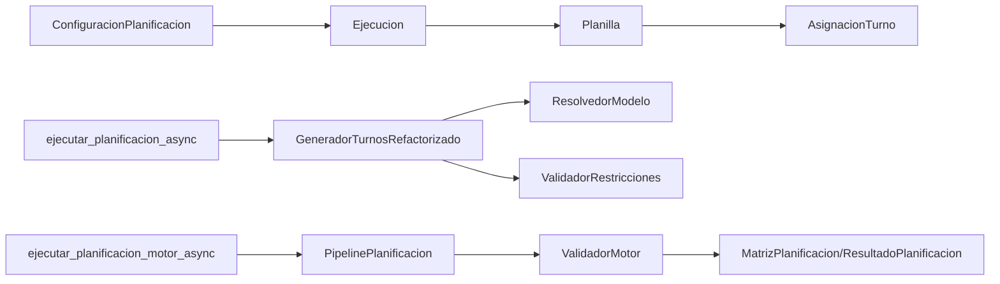

# Planning and Execution Models

<cite>
**Referenced Files in This Document**
- [models.py](file://turnos/models.py)
- [tasks.py](file://turnos/tasks.py)
- [generador.py](file://turnos/generador.py)
- [generador_refactorizado.py](file://turnos/generador_refactorizado.py)
- [resolvedor.py](file://turnos/resolvedor.py)
- [validador.py](file://turnos/validador.py)
- [pipeline.py](file://turnos/motor/pipeline.py)
- [validador_motor.py](file://turnos/motor/validador_motor.py)
- [dtos.py](file://turnos/dominio/dtos.py)
- [vocabulario.py](file://turnos/dominio/vocabulario.py)
- [forms.py](file://turnos/forms.py)
- [views.py](file://turnos/views.py)
- [0009_add_domain_models.py](file://turnos/migrations/0009_add_domain_models.py)
- [0010_remove_ejecucion_planilla_and_more.py](file://turnos/migrations/0010_remove_ejecucion_planilla_and_more.py)
</cite>

## Table of Contents
1. [Introduction](#introduction)
2. [Project Structure](#project-structure)
3. [Core Components](#core-components)
4. [Architecture Overview](#architecture-overview)
5. [Detailed Component Analysis](#detailed-component-analysis)
6. [Dependency Analysis](#dependency-analysis)
7. [Performance Considerations](#performance-considerations)
8. [Troubleshooting Guide](#troubleshooting-guide)
9. [Conclusion](#conclusion)
10. [Appendices](#appendices)

## Introduction
This document explains the planning workflow models and execution pipeline used to generate nurse schedules. It focuses on three core Django models—ConfiguracionPlanificacion (configuration), Ejecucion (execution), and Planilla (schedule)—and documents how scheduling parameters are configured, how solver runs are tracked, and how final schedules are stored. It also details validation rules for planning periods, solver parameters, and execution states, and provides examples of the planning lifecycle, execution monitoring, and schedule retrieval patterns.

## Project Structure
The planning workflow spans models, tasks, generators, validators, and domain DTOs:
- Models define the persisted entities and relationships.
- Tasks orchestrate asynchronous planning execution.
- Generators build and solve the optimization model.
- Validators check hard and soft constraints.
- Domain DTOs encapsulate the internal planning representation.

**Diagram sources**
- [models.py:332-566](file://turnos/models.py#L332-L566)
- [tasks.py:17-240](file://turnos/tasks.py#L17-L240)
- [generador.py:26-65](file://turnos/generador.py#L26-L65)
- [generador_refactorizado.py:17-140](file://turnos/generador_refactorizado.py#L17-L140)
- [resolvedor.py:11-113](file://turnos/resolvedor.py#L11-L113)
- [validador.py:11-200](file://turnos/validador.py#L11-L200)
- [pipeline.py:31-267](file://turnos/motor/pipeline.py#L31-L267)
- [validador_motor.py:23-451](file://turnos/motor/validador_motor.py#L23-L451)
- [dtos.py:197-274](file://turnos/dominio/dtos.py#L197-L274)

**Section sources**
- [models.py:332-566](file://turnos/models.py#L332-L566)
- [tasks.py:17-240](file://turnos/tasks.py#L17-L240)
- [generador.py:26-65](file://turnos/generador.py#L26-L65)
- [generador_refactorizado.py:17-140](file://turnos/generador_refactorizado.py#L17-L140)
- [resolvedor.py:11-113](file://turnos/resolvedor.py#L11-L113)
- [validador.py:11-200](file://turnos/validador.py#L11-L200)
- [pipeline.py:31-267](file://turnos/motor/pipeline.py#L31-L267)
- [validador_motor.py:23-451](file://turnos/motor/validador_motor.py#L23-L451)
- [dtos.py:197-274](file://turnos/dominio/dtos.py#L197-L274)

## Core Components
- ConfiguracionPlanificacion: Defines planning parameters (period, resources, demand, hard/soft constraints, solver settings, and patterns).
- Ejecucion: Tracks a single planning run’s state, timing, and outcome.
- Planilla: Stores the finalized schedule linked to an execution.
- AsignacionTurno: Holds daily assignments per nurse, including cell types (turn, free, leave, etc.).

Key relationships:
- One ConfiguracionPlanificacion can spawn many Ejecucion entries.
- Each Ejecucion produces one Planilla (OneToOne).
- Planilla aggregates many AsignacionTurno entries.

Validation highlights:
- Period bounds enforced during save and runtime.
- Solver parameters validated via model fields and task-level checks.
- Execution states are constrained to a closed set.

**Section sources**
- [models.py:332-566](file://turnos/models.py#L332-L566)
- [0009_add_domain_models.py:14-122](file://turnos/migrations/0009_add_domain_models.py#L14-L122)
- [0010_remove_ejecucion_planilla_and_more.py:14-23](file://turnos/migrations/0010_remove_ejecucion_planilla_and_more.py#L14-L23)

## Architecture Overview
The system supports two execution paths:
- Legacy path: Celery task builds and solves a CP-SAT model, validates hard constraints, persists results, and creates Planilla and AsignacionTurno entries.
- New motor path: Celery task orchestrates a five-phase pipeline (rotation base → hours adjustment → coverage analysis → CP-SAT repair → validation), producing a MatrizPlanificacion and then a Planilla.

**Diagram sources**
- [tasks.py:17-240](file://turnos/tasks.py#L17-L240)
- [generador_refactorizado.py:105-140](file://turnos/generador_refactorizado.py#L105-L140)
- [pipeline.py:92-246](file://turnos/motor/pipeline.py#L92-L246)

## Detailed Component Analysis

### ConfiguracionPlanificacion: Configuration System
Responsibilities:
- Define planning horizon (num_dias, fecha_inicio) with strict bounds.
- Select participating nurses and shift types.
- Specify demand per shift and constraints (hard and soft).
- Configure solver parameters (workers, timeout, seed).
- Manage dynamic patterns via JSON and legacy pattern relations.

Validation rules:
- Period length must be between minimum and maximum thresholds; enforced on save and in task-level guard.
- Solver parameters constrained by field validators.
- Patterns combined from JSON and legacy relations; JSON takes precedence.

**Diagram sources**
- [models.py:332-566](file://turnos/models.py#L332-L566)

**Section sources**
- [models.py:332-566](file://turnos/models.py#L332-L566)
- [forms.py:164-200](file://turnos/forms.py#L164-L200)

### Ejecucion: Execution Tracking
Responsibilities:
- Track a single planning run lifecycle.
- Record state transitions and timing.
- Store solver outcome and validation messages.
- Link to the resulting Planilla.

Execution states:
- PENDIENTE, PROCESANDO, COMPLETADA, INVIABLE, ERROR.

Monitoring:
- Durations computed from timestamps.
- Messages capture validation outcomes and penalties.

**Section sources**
- [models.py:482-532](file://turnos/models.py#L482-L532)
- [tasks.py:17-240](file://turnos/tasks.py#L17-L240)

### Planilla and AsignacionTurno: Final Schedule Storage
Responsibilities:
- Planilla captures the schedule metadata and links to Ejecucion.
- AsignacionTurno holds daily assignments with explicit cell types (turn, free, leave, etc.).

Storage pattern:
- After successful generation, Celery task creates Planilla and bulk inserts AsignacionTurno rows.

**Section sources**
- [models.py:534-624](file://turnos/models.py#L534-L624)
- [tasks.py:128-170](file://turnos/tasks.py#L128-L170)

### Legacy Generator and Validator Workflow
The legacy path uses:
- GeneradorTurnos (wrapper) delegating to GeneradorTurnosRefactorizado.
- ResolvedorModelo to configure and run CP-SAT with solver parameters from ConfiguracionPlanificacion.
- ValidadorRestricciones to enforce hard constraints after solution extraction.

**Diagram sources**
- [tasks.py:17-240](file://turnos/tasks.py#L17-L240)
- [generador.py:26-65](file://turnos/generador.py#L26-L65)
- [generador_refactorizado.py:105-140](file://turnos/generador_refactorizado.py#L105-L140)
- [resolvedor.py:21-113](file://turnos/resolvedor.py#L21-L113)
- [validador.py:20-34](file://turnos/validador.py#L20-L34)

**Section sources**
- [generador.py:26-65](file://turnos/generador.py#L26-L65)
- [generador_refactorizado.py:17-140](file://turnos/generador_refactorizado.py#L17-L140)
- [resolvedor.py:11-113](file://turnos/resolvedor.py#L11-L113)
- [validador.py:11-200](file://turnos/validador.py#L11-L200)

### New Motor Pipeline Workflow
The new path uses:
- PipelinePlanificacion orchestrating rotation base → hours adjustment → coverage → CP-SAT repair → validation.
- ValidadorMotor enforcing hard constraints and computing balances.
- MatrizPlanificacion and ResultadoPlanificacion DTOs for internal representation and results.

**Diagram sources**
- [pipeline.py:92-246](file://turnos/motor/pipeline.py#L92-L246)
- [validador_motor.py:48-87](file://turnos/motor/validador_motor.py#L48-L87)
- [dtos.py:197-274](file://turnos/dominio/dtos.py#L197-L274)

**Section sources**
- [pipeline.py:31-267](file://turnos/motor/pipeline.py#L31-L267)
- [validador_motor.py:23-451](file://turnos/motor/validador_motor.py#L23-L451)
- [dtos.py:197-274](file://turnos/dominio/dtos.py#L197-L274)

## Dependency Analysis
- Models depend on Django ORM and validators; Ejecucion depends on ConfiguracionPlanificacion; Planilla depends on Ejecucion.
- Tasks depend on models and generators; they coordinate transactions and persistence.
- Generators depend on CP-SAT solver and validators; they translate configuration into constraints and extract solutions.
- Pipeline depends on validators and DTOs; it orchestrates multiple phases and produces structured results.

**Diagram sources**
- [models.py:332-566](file://turnos/models.py#L332-L566)
- [tasks.py:17-240](file://turnos/tasks.py#L17-L240)
- [generador_refactorizado.py:17-140](file://turnos/generador_refactorizado.py#L17-L140)
- [resolvedor.py:11-113](file://turnos/resolvedor.py#L11-L113)
- [validador.py:11-200](file://turnos/validador.py#L11-L200)
- [pipeline.py:31-267](file://turnos/motor/pipeline.py#L31-L267)
- [validador_motor.py:23-451](file://turnos/motor/validador_motor.py#L23-L451)
- [dtos.py:197-274](file://turnos/dominio/dtos.py#L197-L274)

**Section sources**
- [models.py:332-566](file://turnos/models.py#L332-L566)
- [tasks.py:17-240](file://turnos/tasks.py#L17-L240)
- [generador_refactorizado.py:17-140](file://turnos/generador_refactorizado.py#L17-L140)
- [pipeline.py:31-267](file://turnos/motor/pipeline.py#L31-L267)

## Performance Considerations
- Solver tuning: num_trabajadores and tiempo_maximo_segundos directly impact solution quality and latency.
- Bulk creation: AsignacionTurno uses bulk_create to minimize database overhead.
- Transaction boundaries: Tasks wrap critical sections to maintain consistency.
- Logging: Extensive logging aids profiling and debugging of long-running tasks.

[No sources needed since this section provides general guidance]

## Troubleshooting Guide
Common issues and resolutions:
- Infeasible solution: The solver returns INFEASIBLE; review hard constraints and demand.
- Excessive violations: Validation reports highlight constraint failures; adjust restrictions or demand.
- Execution stuck in PROCESANDO: Verify Celery worker health and task routing.
- Missing schedule: Confirm Ejecucion completed and Planilla created; inspect task logs.

Operational checks:
- Validate period bounds and solver parameters before triggering tasks.
- Inspect Ejecucion.mensajes for validation summaries.
- Use dashboard and recent executions lists to monitor status.

**Section sources**
- [tasks.py:17-240](file://turnos/tasks.py#L17-L240)
- [validador.py:20-34](file://turnos/validador.py#L20-L34)
- [views.py:52-96](file://turnos/views.py#L52-L96)

## Conclusion
The planning workflow integrates configuration-driven scheduling, robust execution tracking, and validated schedule storage. Two execution paths support both legacy and modern planning engines, ensuring flexibility while maintaining strong validation and auditability. Proper configuration of planning periods, constraints, and solver parameters yields reliable, compliant schedules.

[No sources needed since this section summarizes without analyzing specific files]

## Appendices

### Validation Rules Summary
- Planning period: Minimum and maximum days enforced; saved instances validated.
- Solver parameters: Workers, timeout, and seed constrained by field validators.
- Execution states: Closed set with deterministic transitions.
- Hard constraints (legacy): Uniqueness of one shift per day, minimum 12h rest, max consecutive shifts, coverage targets.
- Hard constraints (motor): One shift/day, max consecutive shifts, max consecutive nights, minimum 12h rest, coverage targets.

**Section sources**
- [models.py:425-456](file://turnos/models.py#L425-L456)
- [resolvedor.py:21-51](file://turnos/resolvedor.py#L21-L51)
- [validador.py:20-34](file://turnos/validador.py#L20-L34)
- [validador_motor.py:88-105](file://turnos/motor/validador_motor.py#L88-L105)

### Examples: Lifecycle, Monitoring, Retrieval
- Lifecycle example: Create ConfiguracionPlanificacion → trigger Celery task → observe Ejecucion state → retrieve Planilla and AsignacionTurno.
- Monitoring example: Inspect Ejecucion.fecha_inicio/fecha_fin and duracion; review Ejecucion.mensajes for validation outcomes.
- Retrieval example: Use Planilla.get_absolute_url and AsignacionTurno filters by planilla and date range.

**Section sources**
- [tasks.py:17-240](file://turnos/tasks.py#L17-L240)
- [models.py:482-624](file://turnos/models.py#L482-L624)
- [views.py:130-146](file://turnos/views.py#L130-L146)