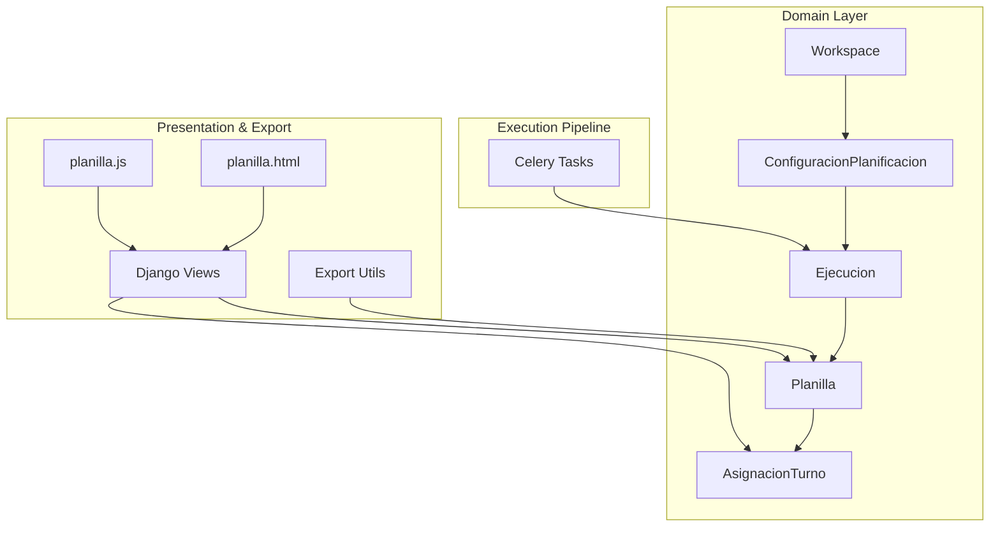
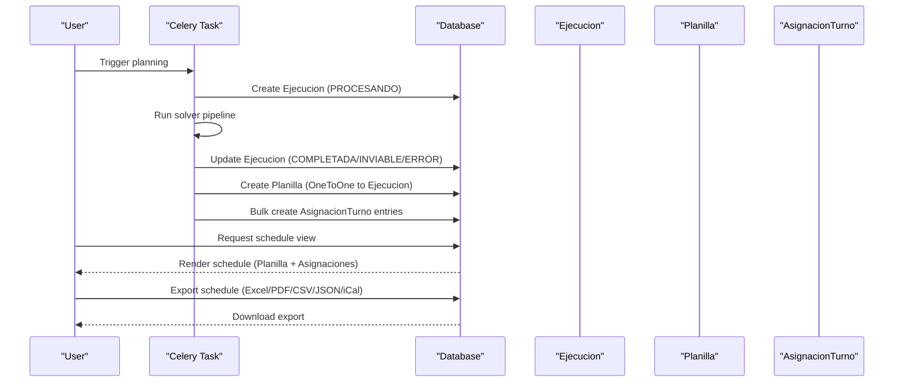
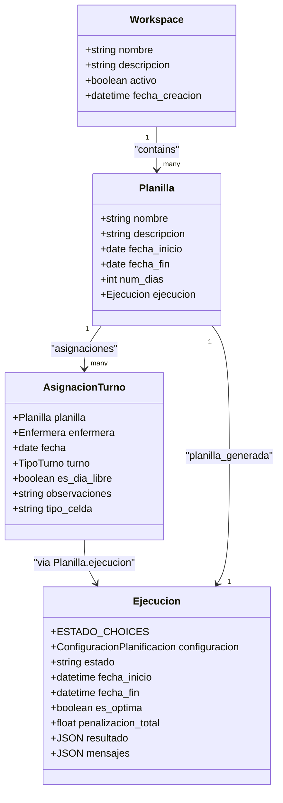
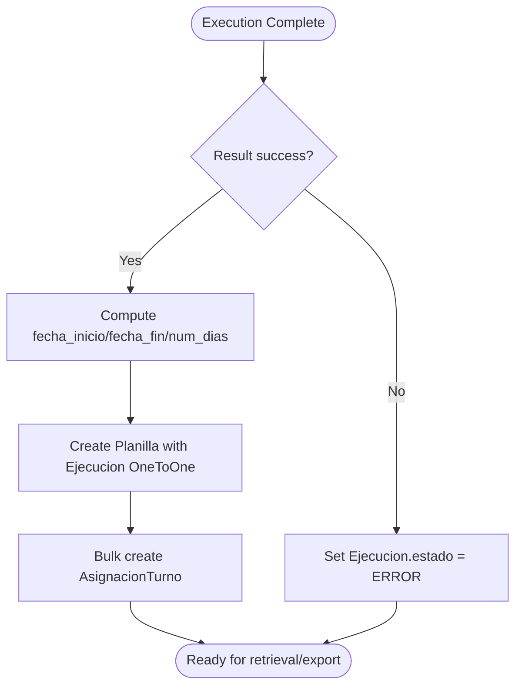
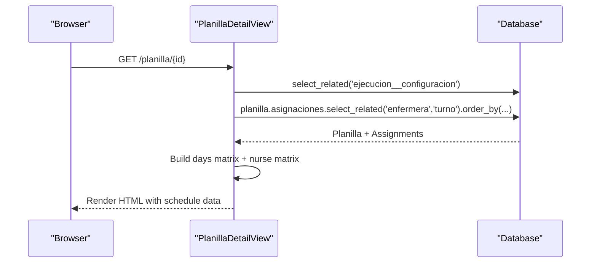
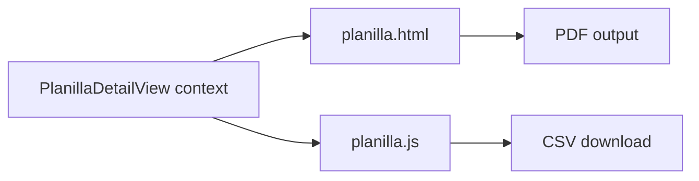
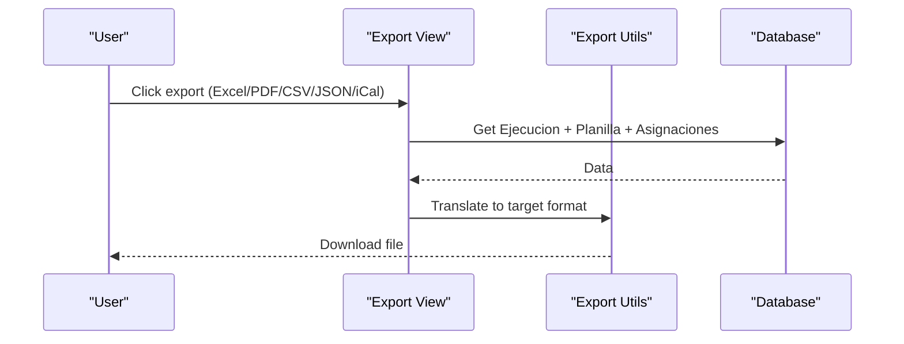
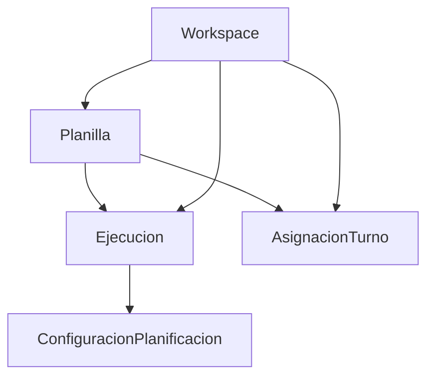

# Schedule Model

<cite>
**Referenced Files in This Document**
- [models.py](file://turnos/models.py)
- [tasks.py](file://turnos/tasks.py)
- [views.py](file://turnos/views.py)
- [exportacion.py](file://turnos/utils/exportacion.py)
- [planilla.js](file://turnos/static/js/planilla.js)
- [planilla.html](file://turnos/templates/turnos/pdf/planilla.html)
- [test_integracion_final.py](file://turnos/tests/test_motor/test_integracion_final.py)
- [admin.py](file://turnos/admin.py)
</cite>

## Table of Contents
1. [Introduction](#introduction)
2. [Project Structure](#project-structure)
3. [Core Components](#core-components)
4. [Architecture Overview](#architecture-overview)
5. [Detailed Component Analysis](#detailed-component-analysis)
6. [Dependency Analysis](#dependency-analysis)
7. [Performance Considerations](#performance-considerations)
8. [Troubleshooting Guide](#troubleshooting-guide)
9. [Conclusion](#conclusion)
10. [Appendices](#appendices)

## Introduction
This document explains the Planilla model, which represents the final generated schedule in the system. It details how Planilla links to Ejecucion via a OneToOne relationship, stores schedule metadata (nombre, descripcion, fecha_inicio, fecha_fin, num_dias), acts as the container for AsignacionTurno instances, and participates in the overall planning workflow. It also covers schedule lifecycle from execution completion to final storage, multi-tenant isolation via Workspace, retrieval patterns, display formatting, and export integration.

## Project Structure
The schedule model sits at the domain layer alongside related models and utilities:
- Domain models: Workspace, Ejecucion, Planilla, AsignacionTurno
- Execution pipeline: Celery tasks orchestrate creation of Ejecucion and Planilla
- Views and templates: Render schedules and drive exports
- Utilities: Exporters for Excel, PDF, CSV, JSON, iCal

**Diagram sources**
- [models.py:12-566](file://turnos/models.py#L12-566)
- [tasks.py:120-202](file://turnos/tasks.py#L120-202)
- [views.py:1208-1301](file://turnos/views.py#L1208-1301)
- [exportacion.py:78-128](file://turnos/utils/exportacion.py#L78-128)
- [planilla.js:195-244](file://turnos/static/js/planilla.js#L195-244)
- [planilla.html:1-283](file://turnos/templates/turnos/pdf/planilla.html#L1-L283)

**Section sources**
- [models.py:12-566](file://turnos/models.py#L12-566)
- [tasks.py:120-202](file://turnos/tasks.py#L120-202)
- [views.py:1208-1301](file://turnos/views.py#L1208-1301)
- [exportacion.py:78-128](file://turnos/utils/exportacion.py#L78-128)

## Core Components
- Workspace: Multi-tenant boundary isolating data per organization/team.
- Ejecucion: Tracks a single planning run (state machine: PENDIENTE → PROCESANDO → COMPLETADA/INVIABLE/ERROR).
- Planilla: Final schedule entity with metadata and a OneToOne link to Ejecucion.
- AsignacionTurno: Individual assignments of nurses to shifts or days off within a Planilla.

Key relationships:
- Workspace → Planilla (foreign key)
- Ejecucion → Planilla (OneToOne via planilla_generada)
- Planilla → AsignacionTurno (ForeignKey with related_name)
- AsignacionTurno → Enfermera (ForeignKey)
- AsignacionTurno → TipoTurno (ForeignKey, nullable for free days)

**Section sources**
- [models.py:12-566](file://turnos/models.py#L12-566)

## Architecture Overview
End-to-end lifecycle from planning execution to schedule storage and presentation:

**Diagram sources**
- [tasks.py:67-202](file://turnos/tasks.py#L67-202)
- [models.py:482-566](file://turnos/models.py#L482-566)

## Detailed Component Analysis

### Planilla Model
Planilla encapsulates the final schedule:
- Metadata: nombre, descripcion, fecha_inicio, fecha_fin, num_dias
- Relationship: OneToOne with Ejecucion via planilla_generada
- Container: holds AsignacionTurno instances for all nurses across the schedule period
- Multi-tenancy: belongs to Workspace

**Diagram sources**
- [models.py:12-566](file://turnos/models.py#L12-566)

**Section sources**
- [models.py:534-566](file://turnos/models.py#L534-566)

### Ejecucion to Planilla Creation
During successful execution, the Celery task creates Planilla and bulk inserts AsignacionTurno records. The canonical relationship is Ejecucion → Planilla (OneToOne), not vice versa.

**Diagram sources**
- [tasks.py:120-202](file://turnos/tasks.py#L120-202)

**Section sources**
- [tasks.py:120-202](file://turnos/tasks.py#L120-202)

### Schedule Retrieval Patterns
Views assemble schedule data for rendering:
- List view: retrieves Planilla with select_related('ejecucion__configuracion')
- Detail view: builds day matrix and nurse assignment matrix, grouping AsignacionTurno by date and nurse
- Uses related_name 'asignaciones' to fetch all assignments efficiently

**Diagram sources**
- [views.py:1222-1301](file://turnos/views.py#L1222-1301)

**Section sources**
- [views.py:1208-1301](file://turnos/views.py#L1208-1301)

### Display Formatting and Frontend Integration
- HTML template renders a horizontal matrix (nurses × days) with colored cells per shift type.
- JavaScript renderer supports CSV export from the browser.
- PDF template generates printable landscape layouts with legends and totals.

**Diagram sources**
- [views.py:1222-1301](file://turnos/views.py#L1222-1301)
- [planilla.html:1-283](file://turnos/templates/turnos/pdf/planilla.html#L1-L283)
- [planilla.js:195-244](file://turnos/static/js/planilla.js#L195-244)

**Section sources**
- [views.py:1222-1301](file://turnos/views.py#L1222-1301)
- [planilla.html:1-283](file://turnos/templates/turnos/pdf/planilla.html#L1-L283)
- [planilla.js:195-244](file://turnos/static/js/planilla.js#L195-244)

### Export Functionality Integration
Multiple export formats consume Planilla and AsignacionTurno data:
- Excel: 7 worksheets (vertical/horizontal matrices, stats, per-nurse, coverage, equity, validations)
- PDF: printable horizontal matrix via dedicated template
- CSV: vertical format aligned with Excel
- JSON: structured dictionary for programmatic consumption
- iCalendar: events per shift for calendar import

**Diagram sources**
- [views.py:1989-2033](file://turnos/views.py#L1989-2033)
- [exportacion.py:78-128](file://turnos/utils/exportacion.py#L78-128)
- [exportacion.py:135-467](file://turnos/utils/exportacion.py#L135-467)
- [exportacion.py:515-528](file://turnos/utils/exportacion.py#L515-528)
- [exportacion.py:531-556](file://turnos/utils/exportacion.py#L531-556)
- [exportacion.py:559-581](file://turnos/utils/exportacion.py#L559-581)
- [exportacion.py:584-626](file://turnos/utils/exportacion.py#L584-626)

**Section sources**
- [views.py:1989-2033](file://turnos/views.py#L1989-2033)
- [exportacion.py:78-128](file://turnos/utils/exportacion.py#L78-128)
- [exportacion.py:135-467](file://turnos/utils/exportacion.py#L135-467)
- [exportacion.py:515-528](file://turnos/utils/exportacion.py#L515-528)
- [exportacion.py:531-556](file://turnos/utils/exportacion.py#L531-556)
- [exportacion.py:559-581](file://turnos/utils/exportacion.py#L559-581)
- [exportacion.py:584-626](file://turnos/utils/exportacion.py#L584-626)

### Multi-Tenant Isolation with Workspace
- All domain entities (Workspace, Planilla, Ejecucion, AsignacionTurno, Enfermera, TipoTurno) carry a workspace foreign key.
- Administrative actions and reporting leverage workspace boundaries for filtering and access control.

**Section sources**
- [models.py:12-566](file://turnos/models.py#L12-566)
- [admin.py:270-276](file://turnos/admin.py#L270-276)

### Canonical Relationship Validation
Unit tests confirm the canonical direction: Planilla.ejecucion and Ejecucion.planilla_generada work reliably, while Ejecucion.planilla is intentionally not used.

**Section sources**
- [test_integracion_final.py:694-725](file://turnos/tests/test_motor/test_integracion_final.py#L694-725)

## Dependency Analysis
- Coupling: Planilla depends on Ejecucion (OneToOne) and contains AsignacionTurno (OneToMany).
- Cohesion: Schedule-related logic is centralized in Planilla and AsignacionTurno.
- External dependencies: Export utilities depend on optional libraries (openpyxl, reportlab, icalendar).

**Diagram sources**
- [models.py:12-566](file://turnos/models.py#L12-566)

**Section sources**
- [models.py:12-566](file://turnos/models.py#L12-566)

## Performance Considerations
- Bulk creation: Celery task uses bulk_create for AsignacionTurno to minimize database round trips.
- Select_related and prefetch_related: Views and exporters use select_related('turno','enfermera') to avoid N+1 queries.
- Indexing: Unique constraint on (planilla, enfermera, fecha) ensures fast lookups for daily assignments.
- Pagination: Planilla list view paginates results to limit memory footprint.

**Section sources**
- [tasks.py:148-169](file://turnos/tasks.py#L148-169)
- [views.py:1237-1240](file://turnos/views.py#L1237-1240)
- [models.py:609-611](file://turnos/models.py#L609-611)

## Troubleshooting Guide
Common issues and resolutions:
- Missing Planilla after execution: Verify Ejecucion.state is COMPLETADA and task completed successfully; check logs for errors.
- Empty schedule in exports: Confirm AsignacionTurno entries were created; inspect task result payload.
- Incorrect dates: Ensure Ejecucion.resultado contains correct fecha_inicio and num_dias; re-run pipeline if needed.
- Export failures: Check availability of optional libraries (openpyxl, reportlab, icalendar); install missing dependencies.

**Section sources**
- [tasks.py:204-239](file://turnos/tasks.py#L204-239)
- [exportacion.py:135-139](file://turnos/utils/exportacion.py#L135-139)
- [exportacion.py:515-520](file://turnos/utils/exportacion.py#L515-520)
- [exportacion.py:584-587](file://turnos/utils/exportacion.py#L584-587)

## Conclusion
Planilla is the definitive schedule artifact in the system, anchored to Ejecucion via a OneToOne relationship and serving as the container for AsignacionTurno entries. It integrates tightly with the execution pipeline, retrieval views, and export utilities, while maintaining multi-tenant isolation through Workspace. Proper use of select_related, bulk operations, and canonical relationships ensures efficient and reliable operation.

## Appendices

### Examples and Patterns

- Schedule creation and storage
  - Trigger execution → Celery task creates Ejecucion → On success, creates Planilla and bulk AsignacionTurno
  - Reference: [tasks.py:120-202](file://turnos/tasks.py#L120-202)

- Metadata management
  - Planilla stores nombre, descripcion, fecha_inicio, fecha_fin, num_dias derived from Ejecucion and ConfiguracionPlanificacion
  - Reference: [models.py:534-566](file://turnos/models.py#L534-566)

- Schedule access patterns
  - Retrieve Planilla with select_related('ejecucion__configuracion')
  - Fetch AsignacionTurno with select_related('enfermera','turno') ordered by date and nurse
  - Reference: [views.py:1218-1240](file://turnos/views.py#L1218-1240)

- Display formatting
  - Horizontal matrix rendering in HTML template with color-coded shift cells
  - Reference: [planilla.html:219-283](file://turnos/templates/turnos/pdf/planilla.html#L219-L283)

- Export integration
  - Excel: 7 worksheets including vertical/horizontal matrices and statistics
  - PDF: printable landscape layout
  - CSV/JSON/iCal: programmatic formats
  - Reference: [exportacion.py:135-467](file://turnos/utils/exportacion.py#L135-467), [exportacion.py:515-528](file://turnos/utils/exportacion.py#L515-528), [exportacion.py:531-556](file://turnos/utils/exportacion.py#L531-556), [exportacion.py:559-581](file://turnos/utils/exportacion.py#L559-581), [exportacion.py:584-626](file://turnos/utils/exportacion.py#L584-626)