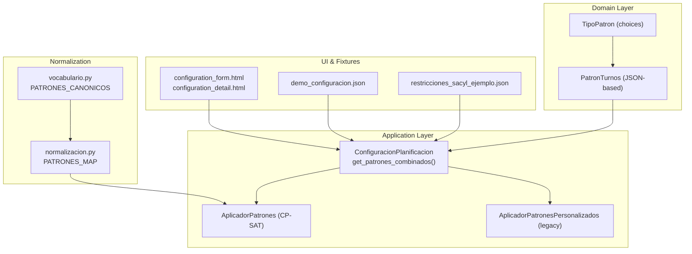
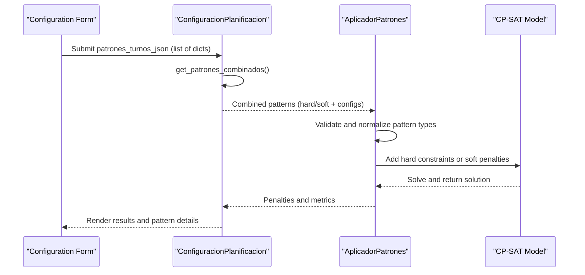
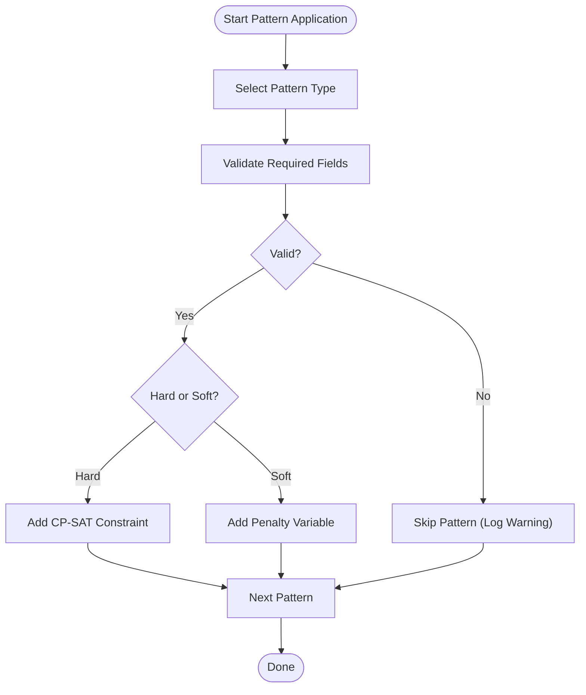
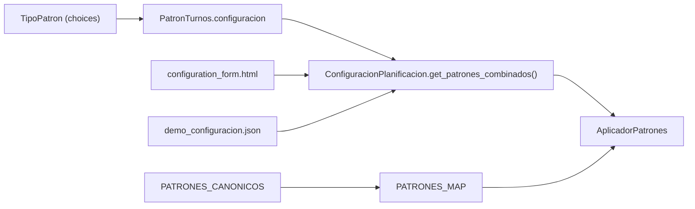

# PatronTurnos Model

<cite>
**Referenced Files in This Document**
- [models.py](file://turnos/models.py)
- [patrones.py](file://turnos/patrones.py)
- [generador_patrones.py](file://turnos/generador_patrones.py)
- [vocabulario.py](file://turnos/dominio/vocabulario.py)
- [normalizacion.py](file://turnos/dominio/normalizacion.py)
- [configuration_form.html](file://turnos/templates/turnos/configuration_form.html)
- [configuration_detail.html](file://turnos/templates/turnos/configuration_detail.html)
- [demo_configuracion.json](file://turnos/fixtures/demo_configuracion.json)
- [restricciones_sacyl_ejemplo.json](file://turnos/fixtures/restricciones_sacyl_ejemplo.json)
</cite>

## Table of Contents
1. [Introduction](#introduction)
2. [Project Structure](#project-structure)
3. [Core Components](#core-components)
4. [Architecture Overview](#architecture-overview)
5. [Detailed Component Analysis](#detailed-component-analysis)
6. [Dependency Analysis](#dependency-analysis)
7. [Performance Considerations](#performance-considerations)
8. [Troubleshooting Guide](#troubleshooting-guide)
9. [Conclusion](#conclusion)

## Introduction
This document explains the PatronTurnos model that defines customizable constraint patterns for shift scheduling. It covers the supported pattern types, their configuration requirements, validation logic, and the distinction between hard and soft constraints. It also documents the JSON-based configuration system, how patterns are applied during planning, and provides practical examples of pattern configurations and their effects on the scheduling solution.

## Project Structure
The PatronTurnos model and its associated systems are implemented across several modules:
- Domain model and pattern types are defined in the models module.
- Pattern application logic is implemented in dedicated modules for CP-SAT constraints.
- Canonical identifiers and normalization utilities ensure consistent handling across the system.
- Templates and fixtures demonstrate JSON configuration usage and UI rendering.

**Diagram sources**
- [models.py:210-281](file://turnos/models.py#L210-L281)
- [models.py:457-479](file://turnos/models.py#L457-L479)
- [patrones.py:8-39](file://turnos/patrones.py#L8-L39)
- [generador_patrones.py:7-64](file://turnos/generador_patrones.py#L7-L64)
- [vocabulario.py:37-45](file://turnos/dominio/vocabulario.py#L37-L45)
- [normalizacion.py:48-65](file://turnos/dominio/normalizacion.py#L48-L65)
- [configuration_form.html:807-824](file://turnos/templates/turnos/configuration_form.html#L807-L824)
- [configuration_detail.html:303-374](file://turnos/templates/turnos/configuration_detail.html#L303-L374)
- [demo_configuracion.json:1-152](file://turnos/fixtures/demo_configuracion.json#L1-L152)
- [restricciones_sacyl_ejemplo.json:1-21](file://turnos/fixtures/restricciones_sacyl_ejemplo.json#L1-L21)

**Section sources**
- [models.py:210-281](file://turnos/models.py#L210-L281)
- [models.py:457-479](file://turnos/models.py#L457-L479)
- [patrones.py:8-39](file://turnos/patrones.py#L8-L39)
- [generador_patrones.py:7-64](file://turnos/generador_patrones.py#L7-L64)
- [vocabulario.py:37-45](file://turnos/dominio/vocabulario.py#L37-L45)
- [normalizacion.py:48-65](file://turnos/dominio/normalizacion.py#L48-L65)
- [configuration_form.html:807-824](file://turnos/templates/turnos/configuration_form.html#L807-L824)
- [configuration_detail.html:303-374](file://turnos/templates/turnos/configuration_detail.html#L303-L374)
- [demo_configuracion.json:1-152](file://turnos/fixtures/demo_configuracion.json#L1-L152)
- [restricciones_sacyl_ejemplo.json:1-21](file://turnos/fixtures/restricciones_sacyl_ejemplo.json#L1-L21)

## Core Components
- PatronTurnos: A JSON-backed model that stores pattern definitions with type, activation flag, hard/soft mode, and a JSON configuration payload. It validates configuration fields per pattern type and supports legacy ManyToMany integration via ConfiguracionPlanificacion.
- ConfiguracionPlanificacion: Aggregates patterns from two sources: a modern JSON field (primary) and a legacy ManyToMany relationship. It exposes a combined accessor to unify pattern processing.
- AplicadorPatrones: Applies patterns to the CP-SAT model, supporting hard constraints and soft penalties. It handles pattern-specific logic and builds the solver objective when needed.
- AplicadorPatronesPersonalizados: Legacy pattern applicator with similar capabilities, used for compatibility.
- Canonical vocabularies and normalization: Define canonical pattern identifiers and normalize legacy names to canonical ones for consistent processing.

Key responsibilities:
- Pattern definition and validation
- JSON configuration parsing and validation
- Hard vs soft constraint enforcement
- CP-SAT modeling and objective construction

**Section sources**
- [models.py:221-330](file://turnos/models.py#L221-L330)
- [models.py:332-480](file://turnos/models.py#L332-L480)
- [patrones.py:8-39](file://turnos/patrones.py#L8-L39)
- [generador_patrones.py:7-64](file://turnos/generador_patrones.py#L7-L64)
- [vocabulario.py:37-45](file://turnos/dominio/vocabulario.py#L37-L45)
- [normalizacion.py:48-65](file://turnos/dominio/normalizacion.py#L48-L65)

## Architecture Overview
The pattern system integrates three layers:
- Domain model: Defines pattern metadata and validation rules.
- Application layer: Translates patterns into CP-SAT constraints and penalties.
- UI and fixtures: Provide JSON configuration examples and render patterns in the interface.

**Diagram sources**
- [models.py:457-479](file://turnos/models.py#L457-L479)
- [generador_patrones.py:21-64](file://turnos/generador_patrones.py#L21-L64)
- [configuration_form.html:807-824](file://turnos/templates/turnos/configuration_form.html#L807-L824)
- [configuration_detail.html:303-374](file://turnos/templates/turnos/configuration_detail.html#L303-L374)

## Detailed Component Analysis

### PatronTurnos Model and Validation
- Fields:
  - nombre, descripcion: identification and description
  - tipo: selection from TipoPatron choices
  - activo: enable/disable flag
  - es_restriccion_dura: hard vs soft mode
  - peso_penalizacion: penalty weight when soft
  - configuracion: JSON payload specific to each pattern type
- Validation:
  - validar_configuracion checks required keys per pattern type
  - clean raises validation errors if configuration is invalid
- Canonical pattern types:
  - SECUENCIA_OBLIGATORIA, DESCANSO_POST_TURNO, MAX_CONSECUTIVOS, ROTACION_CICLICA, COBERTURA_MINIMA, BLOQUEO_TRANSICION, DISTRIBUCION_EQUITATIVA

Practical implications:
- Hard constraints are enforced as mandatory CP-SAT clauses.
- Soft constraints introduce penalty variables into the objective.

**Section sources**
- [models.py:221-330](file://turnos/models.py#L221-L330)
- [models.py:210-219](file://turnos/models.py#L210-L219)

### Pattern Types and Configuration Requirements
Below are the supported pattern types, their purpose, and required configuration fields. The system validates presence of required fields per pattern type.

- SECUENCIA_OBLIGATORIA
  - Purpose: Enforce a required sequence of shifts for a worker.
  - Required fields:
    - secuencia: ordered list of shift names or acronyms
  - Notes:
    - Supports cyclic sequences depending on implementation
- DESCANSO_POST_TURNO
  - Purpose: After N consecutive shifts of a given type, require M days off.
  - Required fields:
    - turno_tipo: shift identifier
    - cantidad_consecutiva: number of consecutive shifts
    - dias_descanso_requeridos: number of required off-days after the sequence
- MAX_CONSECUTIVOS
  - Purpose: Limit the maximum number of consecutive shifts of a given type.
  - Required fields:
    - max_consecutivos: maximum allowed consecutive occurrences
- ROTACION_CICLICA
  - Purpose: Encourage balanced rotation among selected shifts over fixed windows.
  - Required fields:
    - turnos: list of shift identifiers
    - ventana_dias: rotation window size
- COBERTURA_MINIMA
  - Purpose: Ensure minimum coverage for specific shifts on targeted days.
  - Required fields:
    - turno_tipo: shift identifier
    - enfermeras_minimas: minimum number of workers
    - aplicar_dias: optional list of target weekdays
- BLOQUEO_TRANSICION
  - Purpose: Block specific transitions between shifts.
  - Required fields:
    - turno_origen: source shift
    - turno_destino: destination shift
- DISTRIBUCION_EQUITATIVA
  - Purpose: Keep distribution of a shift type equitable across workers.
  - Required fields:
    - turno_tipo: shift identifier
    - tolerancia: acceptable deviation threshold

Validation logic:
- Each pattern type defines required keys in the configuration dictionary.
- The model’s validator checks for presence of required keys and returns True otherwise.
- Clean method raises a validation error if configuration is invalid.

**Section sources**
- [models.py:247-281](file://turnos/models.py#L247-L281)
- [models.py:303-324](file://turnos/models.py#L303-L324)

### JSON-Based Configuration System
- Storage:
  - ConfiguracionPlanificacion maintains a JSON field for patterns (primary source) and a legacy ManyToMany relationship.
- Retrieval:
  - get_patrones_combinados merges JSON patterns with legacy patterns, prioritizing the JSON source.
- UI:
  - configuration_form.html renders pattern cards with toggles for hard/soft and weight inputs.
  - configuration_detail.html displays parsed configuration parameters.

Example JSON structure (conceptual):
- Each item includes:
  - tipo: canonical pattern type
  - nombre: human-readable label
  - es_restriccion_dura: boolean
  - peso_penalizacion: integer (when soft)
  - configuracion: object with required fields per pattern type

**Section sources**
- [models.py:380-394](file://turnos/models.py#L380-L394)
- [models.py:457-479](file://turnos/models.py#L457-L479)
- [configuration_form.html:807-824](file://turnos/templates/turnos/configuration_form.html#L807-L824)
- [configuration_detail.html:303-374](file://turnos/templates/turnos/configuration_detail.html#L303-L374)

### Hard vs Soft Constraints
- Hard constraints:
  - es_restriccion_dura = True
  - Enforced as mandatory CP-SAT constraints
  - Violations make solutions infeasible
- Soft constraints:
  - es_restriccion_dura = False
  - Translated into penalty variables weighted by peso_penalizacion
  - Integrated into the solver objective to minimize violations

Implementation highlights:
- AplicadorPatrones applies hard constraints directly and soft penalties via auxiliary variables.
- Penalty variables are aggregated into the objective function.

**Section sources**
- [models.py:238-245](file://turnos/models.py#L238-L245)
- [generador_patrones.py:21-64](file://turnos/generador_patrones.py#L21-L64)

### Pattern Application Logic (CP-SAT)
The AplicadorPatrones module translates each pattern into CP-SAT constraints or penalties:

- DESCANSO_POST_TURNO
  - Detects sequences of N consecutive shifts of a type
  - Enforces M consecutive off-days after the sequence (hard or soft)
- SECUENCIA_OBLIGATORIA
  - Ensures a required order of shifts across adjacent days
  - Uses implication logic to chain constraints
- MAX_CONSECUTIVOS
  - Sliding-window constraint to limit consecutive occurrences
  - Hard: sum ≤ max; Soft: penalty proportional to excess
- ROTACION_CICLICA
  - Validates required fields and applies rotation constraints per window
  - Note: Implementation placeholder indicates partial support
- COBERTURA_MINIMA
  - Enforces minimum staff counts for specific shifts on selected days
- BLOQUEO_TRANSICION
  - Prohibits specific shift-to-shift transitions
- DISTRIBUCION_EQUITATIVA
  - Computes differences between worker totals and enforces tolerance (hard or soft)

**Diagram sources**
- [generador_patrones.py:21-64](file://turnos/generador_patrones.py#L21-L64)
- [patrones.py:23-59](file://turnos/patrones.py#L23-L59)

**Section sources**
- [generador_patrones.py:66-230](file://turnos/generador_patrones.py#L66-L230)
- [patrones.py:60-276](file://turnos/patrones.py#L60-L276)

### Practical Examples and Effects
Below are example configurations and their expected effects. These illustrate how patterns influence the schedule.

- DESCANSO_POST_TURNO
  - Example: After 2 consecutive NOCHE shifts, require 3 consecutive off-days.
  - Effect: Prevents fatigue by ensuring adequate rest after extended night shifts.
- MAX_CONSECUTIVOS
  - Example: Maximum 3 consecutive MAÑANA shifts.
  - Effect: Balances workload distribution and reduces monotony.
- SECUENCIA_OBLIGATORIA
  - Example: Sequence MAÑANA → TARDE → NOCHE.
  - Effect: Standardizes shift transitions for predictable coverage.
- ROTACION_CICLICA
  - Example: Rotate among MAÑANA, TARDE, NOCHE every 14 days.
  - Effect: Ensures fair distribution of day/night shifts across workers.
- COBERTURA_MINIMA
  - Example: Minimum 2 NOCHE shifts on weekends.
  - Effect: Guarantees sufficient staffing for overnight periods.
- BLOQUEO_TRANSICION
  - Example: Block NOCHE → MAÑANA transition.
  - Effect: Prevents dangerous immediate shift changes.
- DISTRIBUCION_EQUITATIVA
  - Example: Keep difference in total NOCHE shifts ≤ 2 between workers.
  - Effect: Reduces inequity in workload distribution.

These examples are derived from the model’s configuration requirements and the CP-SAT application logic.

**Section sources**
- [models.py:247-281](file://turnos/models.py#L247-L281)
- [generador_patrones.py:66-230](file://turnos/generador_patrones.py#L66-L230)
- [patrones.py:60-276](file://turnos/patrones.py#L60-L276)

## Dependency Analysis
The pattern system relies on canonical identifiers and normalization to maintain consistency across legacy and modern configurations.

**Diagram sources**
- [models.py:210-219](file://turnos/models.py#L210-L219)
- [models.py:247-281](file://turnos/models.py#L247-L281)
- [models.py:457-479](file://turnos/models.py#L457-L479)
- [generador_patrones.py:7-64](file://turnos/generador_patrones.py#L7-L64)
- [vocabulario.py:37-45](file://turnos/dominio/vocabulario.py#L37-L45)
- [normalizacion.py:48-65](file://turnos/dominio/normalizacion.py#L48-L65)
- [configuration_form.html:807-824](file://turnos/templates/turnos/configuration_form.html#L807-L824)
- [demo_configuracion.json:1-152](file://turnos/fixtures/demo_configuracion.json#L1-L152)

**Section sources**
- [models.py:210-219](file://turnos/models.py#L210-L219)
- [models.py:247-281](file://turnos/models.py#L247-L281)
- [models.py:457-479](file://turnos/models.py#L457-L479)
- [generador_patrones.py:7-64](file://turnos/generador_patrones.py#L7-L64)
- [vocabulario.py:37-45](file://turnos/dominio/vocabulario.py#L37-L45)
- [normalizacion.py:48-65](file://turnos/dominio/normalizacion.py#L48-L65)
- [configuration_form.html:807-824](file://turnos/templates/turnos/configuration_form.html#L807-L824)
- [demo_configuracion.json:1-152](file://turnos/fixtures/demo_configuracion.json#L1-L152)

## Performance Considerations
- Pattern cardinality: Each pattern adds constraints or penalties to the CP-SAT model. Excessive patterns increase solving time.
- Window sizes: Sliding windows (e.g., MAX_CONSECUTIVOS) scale with the number of days and workers.
- Soft penalties: Higher weights increase solver emphasis on minimizing violations, potentially affecting convergence.
- Normalization overhead: Name normalization is lightweight but should be centralized to avoid repeated conversions.

## Troubleshooting Guide
Common issues and resolutions:
- Invalid configuration fields:
  - Symptom: Validation error when saving a pattern.
  - Cause: Missing required fields for the selected pattern type.
  - Resolution: Ensure all required fields are present in the configuration object.
- Unknown pattern type:
  - Symptom: Warning logged when applying patterns.
  - Cause: tipo not recognized by the applicator.
  - Resolution: Use canonical types defined in TipoPatron or PATRONES_CANONICOS.
- Legacy vs modern configuration:
  - Symptom: Confusion between JSON patterns and legacy ManyToMany.
  - Cause: Both sources are merged, but JSON takes precedence.
  - Resolution: Prefer JSON patterns for new configurations; legacy patterns remain for compatibility.
- Soft constraint not taking effect:
  - Symptom: Violations occur despite low weights.
  - Cause: Hard constraints may dominate the objective.
  - Resolution: Review hard constraints and adjust soft weights accordingly.

**Section sources**
- [models.py:326-330](file://turnos/models.py#L326-L330)
- [models.py:457-479](file://turnos/models.py#L457-L479)
- [generador_patrones.py:21-64](file://turnos/generador_patrones.py#L21-L64)
- [patrones.py:23-59](file://turnos/patrones.py#L23-L59)

## Conclusion
The PatronTurnos model provides a flexible, JSON-driven mechanism to define shift scheduling constraints. By distinguishing hard and soft constraints and integrating them into the CP-SAT solver, it enables precise control over scheduling outcomes. Canonical identifiers and normalization ensure robust handling of legacy and modern configurations. Properly configured patterns lead to schedules that meet operational needs while maintaining fairness and safety.