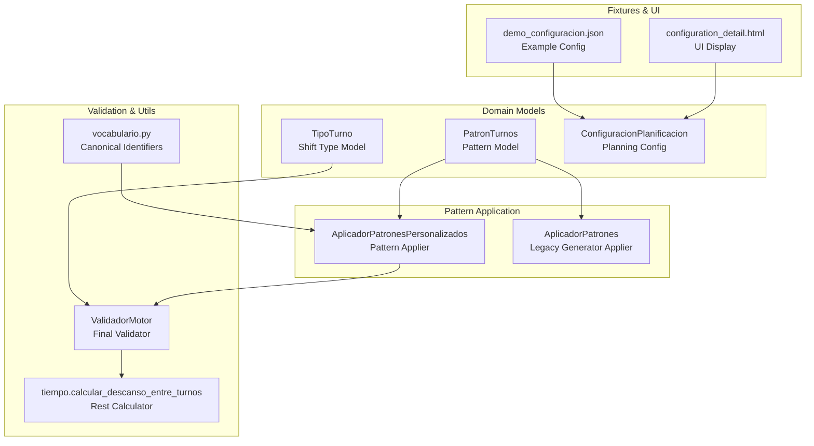
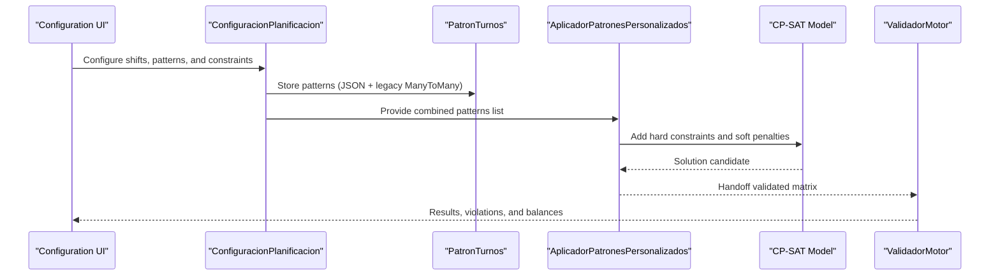
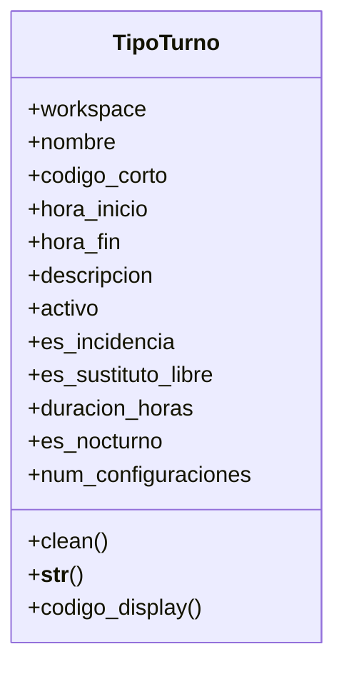
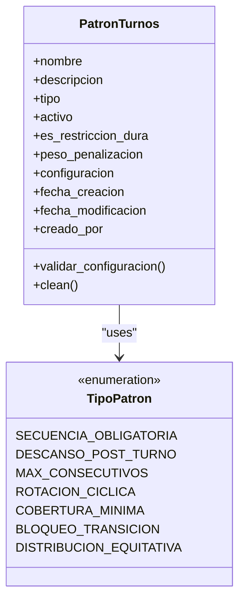
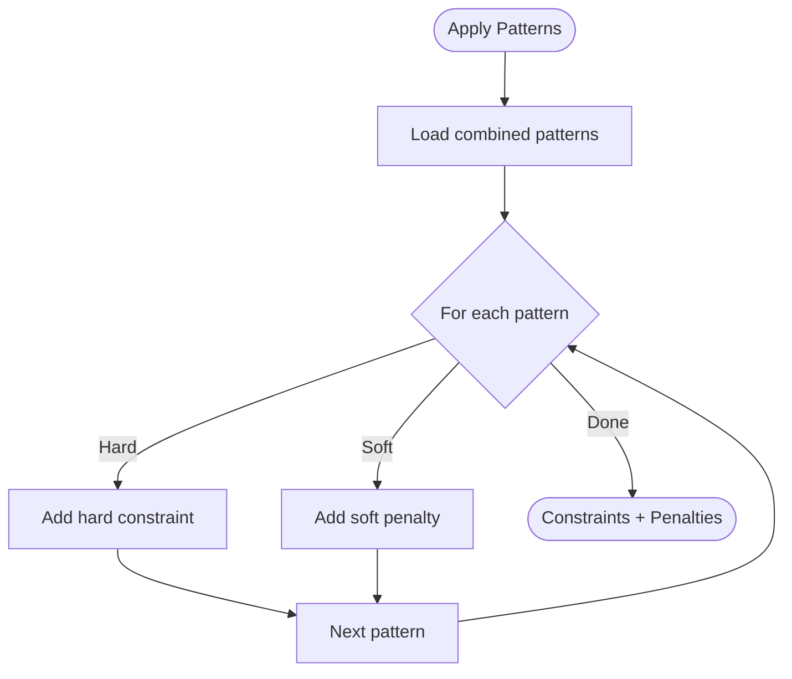
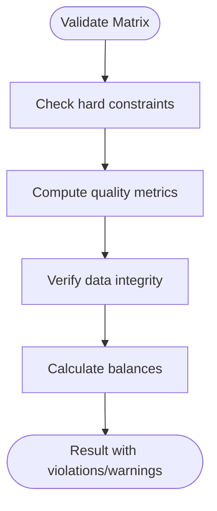
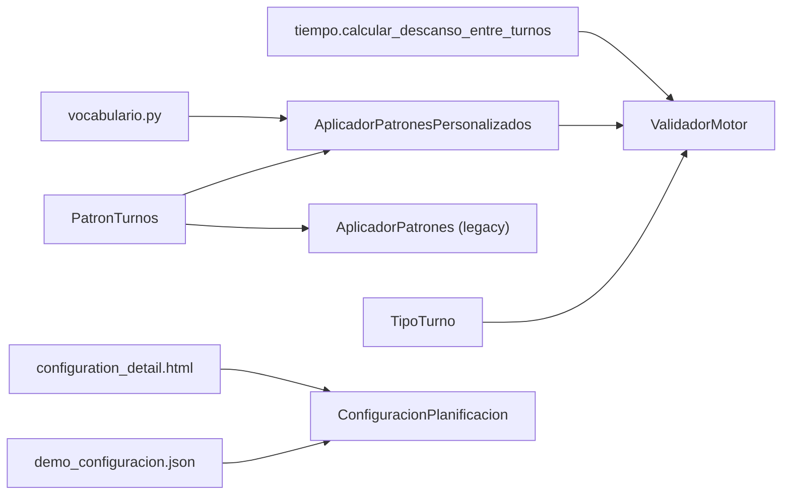

# Shift Types and Patterns

<cite>
**Referenced Files in This Document**
- [models.py](file://turnos/models.py)
- [patrones.py](file://turnos/patrones.py)
- [generador_patrones.py](file://turnos/generador_patrones.py)
- [vocabulario.py](file://turnos/dominio/vocabulario.py)
- [validador_motor.py](file://turnos/motor/validador_motor.py)
- [tiempo.py](file://turnos/utils/tiempo.py)
- [demo_configuracion.json](file://turnos/fixtures/demo_configuracion.json)
- [restricciones_sacyl_ejemplo.json](file://turnos/fixtures/restricciones_sacyl_ejemplo.json)
- [configuration_detail.html](file://turnos/templates/turnos/configuration_detail.html)
- [0012_tipoturno_codigo_corto.py](file://turnos/migrations/0012_tipoturno_codigo_corto.py)
- [0013_tipoturno_dinamico.py](file://turnos/migrations/0013_tipoturno_dinamico.py)
- [0014_tipoturno_sustituto_libre.py](file://turnos/migrations/0014_tipoturno_sustituto_libre.py)
</cite>

## Table of Contents
1. [Introduction](#introduction)
2. [Project Structure](#project-structure)
3. [Core Components](#core-components)
4. [Architecture Overview](#architecture-overview)
5. [Detailed Component Analysis](#detailed-component-analysis)
6. [Dependency Analysis](#dependency-analysis)
7. [Performance Considerations](#performance-considerations)
8. [Troubleshooting Guide](#troubleshooting-guide)
9. [Conclusion](#conclusion)
10. [Appendices](#appendices)

## Introduction
This document explains the shift type management and pattern system used by the nursing scheduling engine. It covers:
- The flexible shift type model (TipoTurno) supporting custom codes, time slots, and special categories (incidencias and substitute-free days)
- The pattern system (PatronTurnos) for defining rotation rules, coverage requirements, and constraint patterns
- Validation logic for shift types, duration calculations, and nocturnal shift detection
- Examples of pattern configurations and their impact on the scheduling algorithm

## Project Structure
The shift type and pattern system spans several modules:
- Domain models and validation for shift types and patterns
- Pattern application to the CP-SAT model
- Canonical vocabulary for patterns and constraints
- Utilities for time and rest calculations
- Fixtures and UI templates showcasing configuration examples

**Diagram sources**
- [models.py:60-394](file://turnos/models.py#L60-L394)
- [patrones.py:8-276](file://turnos/patrones.py#L8-L276)
- [generador_patrones.py:7-231](file://turnos/generador_patrones.py#L7-L231)
- [validador_motor.py:23-451](file://turnos/motor/validador_motor.py#L23-L451)
- [tiempo.py:8-32](file://turnos/utils/tiempo.py#L8-L32)
- [vocabulario.py:35-45](file://turnos/dominio/vocabulario.py#L35-L45)
- [demo_configuracion.json:1-152](file://turnos/fixtures/demo_configuracion.json#L1-L152)
- [configuration_detail.html:303-374](file://turnos/templates/turnos/configuration_detail.html#L303-L374)

**Section sources**
- [models.py:60-394](file://turnos/models.py#L60-L394)
- [patrones.py:8-276](file://turnos/patrones.py#L8-L276)
- [generador_patrones.py:7-231](file://turnos/generador_patrones.py#L7-L231)
- [validador_motor.py:23-451](file://turnos/motor/validador_motor.py#L23-L451)
- [tiempo.py:8-32](file://turnos/utils/tiempo.py#L8-L32)
- [vocabulario.py:35-45](file://turnos/dominio/vocabulario.py#L35-L45)
- [demo_configuracion.json:1-152](file://turnos/fixtures/demo_configuracion.json#L1-L152)
- [configuration_detail.html:303-374](file://turnos/templates/turnos/configuration_detail.html#L303-L374)

## Core Components
- TipoTurno: Defines shift types with name, short code, optional time slot, flags for special categories, and computed properties for duration and nocturnal detection.
- PatronTurnos: Encapsulates reusable pattern definitions with type, activation, hard/soft enforcement, and JSON configuration.
- AplicadorPatronesPersonalizados: Translates configured patterns into CP-SAT constraints and soft penalties.
- ValidadorMotor: Validates final schedule against hard constraints, quality metrics, and data integrity; also computes balances.
- Canonical vocabulary: Provides canonical identifiers for patterns and constraints used across the system.

Key capabilities:
- Flexible shift types with custom codes and optional time slots
- Special categories: incidencias (non-auto-assignable events) and substitute-free days (zero-duration “Libre” equivalents)
- Pattern-driven constraints: consecutive limits, post-shift rest windows, cyclic rotations, coverage minimums, and equitable distributions
- Validation pipeline ensuring hard constraints are met and soft preferences are minimized

**Section sources**
- [models.py:60-208](file://turnos/models.py#L60-L208)
- [models.py:221-330](file://turnos/models.py#L221-L330)
- [patrones.py:8-276](file://turnos/patrones.py#L8-L276)
- [validador_motor.py:48-86](file://turnos/motor/validador_motor.py#L48-L86)
- [vocabulario.py:35-45](file://turnos/dominio/vocabulario.py#L35-L45)

## Architecture Overview
The system applies patterns to a CP-SAT model and validates the solution:

**Diagram sources**
- [models.py:332-480](file://turnos/models.py#L332-L480)
- [models.py:221-330](file://turnos/models.py#L221-L330)
- [patrones.py:23-59](file://turnos/patrones.py#L23-L59)
- [validador_motor.py:48-86](file://turnos/motor/validador_motor.py#L48-L86)

## Detailed Component Analysis

### Shift Type Model: TipoTurno
TipoTurno defines the canonical shift types used across the system:
- Identity: name, short code, workspace isolation
- Schedule: optional start/end times
- Flags: incidencia (non-auto-assignable), sustituto_libre (acts as “Libre”)
- Validation: ensures sustituto_libre has no schedule, regular turns require schedule, and short code uniqueness per workspace
- Computed properties: duration in hours and nocturnal detection

**Diagram sources**
- [models.py:60-208](file://turnos/models.py#L60-L208)

Validation highlights:
- sustituto_libre implies zero-duration and no schedule; incompatible with es_incidencia
- Regular shift types must define both start and end times
- Short code uniqueness enforced per workspace

Duration and nocturnal detection:
- Duration computed from start/end times, handling midnight crossing
- Nocturnal flag determined by end time before start time

**Section sources**
- [models.py:60-208](file://turnos/models.py#L60-L208)
- [0012_tipoturno_codigo_corto.py:6-22](file://turnos/migrations/0012_tipoturno_codigo_corto.py#L6-L22)
- [0013_tipoturno_dinamico.py:13-46](file://turnos/migrations/0013_tipoturno_dinamico.py#L13-L46)
- [0014_tipoturno_sustituto_libre.py:13-18](file://turnos/migrations/0014_tipoturno_sustituto_libre.py#L13-L18)

### Pattern Model: PatronTurnos
PatronTurnos stores reusable pattern definitions:
- Identification: name, description, type (canonicalized)
- State: active, hard vs soft enforcement, penalty weight
- Configuration: generic JSON with type-specific keys
- Validation: checks required keys per pattern type

Supported pattern types (canonical):
- DESCANSO_POST_TURNO: post-shift rest after N consecutive shifts of a type
- MAX_CONSECUTIVOS: maximum K consecutive shifts of a type
- SECUENCIA_OBLIGATORIA: mandatory shift sequence over time
- ROTACION_CICLICA: cyclic rotation pattern
- COBERTURA_MINIMA: minimum staff per shift
- BLOQUEO_TRANSICION: forbid transitions between specific shifts
- DISTRIBUCION_EQUITATIVA: equitable distribution of a shift type across staff

**Diagram sources**
- [models.py:210-330](file://turnos/models.py#L210-L330)

**Section sources**
- [models.py:210-330](file://turnos/models.py#L210-L330)
- [vocabulario.py:35-45](file://turnos/dominio/vocabulario.py#L35-L45)

### Pattern Application: AplicadorPatronesPersonalizados
This component translates configured patterns into CP-SAT constraints:
- Iterates combined patterns (JSON + legacy ManyToMany)
- Applies hard constraints or soft penalties depending on enforcement
- Supports:
  - DESCANSO_POST_TURNO: after N consecutive shifts of a type, next M days must be off
  - MAX_CONSECUTIVOS: limit K+1 window of consecutive shifts of a type
  - SECUENCIA_OBLIGATORIA: enforce a named sequence over time
  - ROTACION_TURNOS: balanced rotation among selected shift types
  - DISTRIBUCION_EQUITATIVA: equitable distribution of a shift type across staff
- Tracks soft penalties for later minimization by the solver

**Diagram sources**
- [patrones.py:23-59](file://turnos/patrones.py#L23-L59)
- [patrones.py:60-276](file://turnos/patrones.py#L60-L276)

**Section sources**
- [patrones.py:8-276](file://turnos/patrones.py#L8-L276)

### Legacy Pattern Applier: AplicadorPatrones
A generator-side applier with partial implementation:
- DESCANSO_POST_TURNO and MAX_CONSECUTIVOS supported
- ROTACION placeholder (not fully implemented)
- Logs applied constraints and penalties

**Section sources**
- [generador_patrones.py:7-231](file://turnos/generador_patrones.py#L7-L231)

### Final Validation: ValidadorMotor
Ensures the final schedule meets hard constraints and quality criteria:
- Hard constraints: one shift/day, max consecutive shifts, max consecutive nights, minimum rest between shifts, coverage minimums
- Quality checks: equity in hours, nights, weekends
- Integrity: valid cell types and required IDs
- Balances: compute final hours, nights, weekend/festival counts and integrate historical accumulations

**Diagram sources**
- [validador_motor.py:48-86](file://turnos/motor/validador_motor.py#L48-L86)
- [validador_motor.py:88-311](file://turnos/motor/validador_motor.py#L88-L311)
- [validador_motor.py:366-438](file://turnos/motor/validador_motor.py#L366-L438)

**Section sources**
- [validador_motor.py:23-451](file://turnos/motor/validador_motor.py#L23-L451)
- [tiempo.py:8-32](file://turnos/utils/tiempo.py#L8-L32)

### Example Pattern Configurations
Below are representative configuration examples derived from fixtures and UI rendering:

- DESCANSO_POST_TURNO
  - Purpose: After N consecutive shifts of a given type, require M consecutive days off
  - Keys: turno_tipo, cantidad_consecutiva, dias_descanso_requeridos
  - Impact: Adds hard implications or soft penalties to enforce rest windows

- MAX_CONSECUTIVOS
  - Purpose: Limit K consecutive shifts of a given type
  - Keys: turno_tipo, max_consecutivos
  - Impact: Hard constraint or soft penalty proportional to excess

- SECUENCIA_OBLIGATORIA
  - Purpose: Enforce a named sequence over time (e.g., M→T→N)
  - Keys: secuencia (list of shift names/acronyms)
  - Impact: Implications linking start of sequence to subsequent positions

- ROTACION_TURNOS
  - Purpose: Ensure each staff member works at least one of selected shifts within rolling windows
  - Keys: turnos (list), ventana_dias (window size)
  - Impact: Hard constraints or soft penalties for missing coverage per window

- DISTRIBUCION_EQUITATIVA
  - Purpose: Keep distribution of a shift type equitable across staff
  - Keys: turno_tipo, tolerancia
  - Impact: Soft penalties for deviations exceeding tolerance

- COBERTURA_MINIMA
  - Purpose: Minimum staff per shift
  - Keys: turno_tipo, enfermeras_minimas, aplicar_dias (optional)
  - Impact: Hard constraints or soft penalties depending on enforcement

These patterns are rendered in the UI and persisted via JSON configuration in ConfiguracionPlanificacion.

**Section sources**
- [models.py:248-281](file://turnos/models.py#L248-L281)
- [patrones.py:60-276](file://turnos/patrones.py#L60-L276)
- [configuration_detail.html:303-374](file://turnos/templates/turnos/configuration_detail.html#L303-L374)
- [demo_configuracion.json:1-152](file://turnos/fixtures/demo_configuracion.json#L1-L152)

## Dependency Analysis
- Shift types depend on workspace scoping and validation rules
- Patterns depend on canonical types and configuration dictionaries
- Pattern application depends on shift-to-index mappings and solver variables
- Validation depends on turn metadata (duration, nocturnal flag) and time utilities
- UI templates consume JSON patterns for display

**Diagram sources**
- [models.py:60-394](file://turnos/models.py#L60-L394)
- [patrones.py:8-276](file://turnos/patrones.py#L8-L276)
- [generador_patrones.py:7-231](file://turnos/generador_patrones.py#L7-L231)
- [validador_motor.py:23-451](file://turnos/motor/validador_motor.py#L23-L451)
- [tiempo.py:8-32](file://turnos/utils/tiempo.py#L8-L32)
- [vocabulario.py:35-45](file://turnos/dominio/vocabulario.py#L35-L45)
- [demo_configuracion.json:1-152](file://turnos/fixtures/demo_configuracion.json#L1-L152)
- [configuration_detail.html:303-374](file://turnos/templates/turnos/configuration_detail.html#L303-L374)

**Section sources**
- [models.py:60-394](file://turnos/models.py#L60-L394)
- [patrones.py:8-276](file://turnos/patrones.py#L8-L276)
- [generador_patrones.py:7-231](file://turnos/generador_patrones.py#L7-L231)
- [validador_motor.py:23-451](file://turnos/motor/validador_motor.py#L23-L451)
- [tiempo.py:8-32](file://turnos/utils/tiempo.py#L8-L32)
- [vocabulario.py:35-45](file://turnos/dominio/vocabulario.py#L35-L45)
- [demo_configuracion.json:1-152](file://turnos/fixtures/demo_configuracion.json#L1-L152)
- [configuration_detail.html:303-374](file://turnos/templates/turnos/configuration_detail.html#L303-L374)

## Performance Considerations
- Pattern application scales with number of staff, days, and pattern complexity; prefer concise sequences and reasonable window sizes
- Soft penalties should be tuned to avoid overwhelming hard constraints during solving
- Validation runs over the full matrix; keep configurations minimal and targeted to reduce runtime overhead

## Troubleshooting Guide
Common issues and resolutions:
- Invalid pattern configuration
  - Symptom: Pattern fails to apply or raises validation errors
  - Cause: Missing required keys for the pattern type
  - Resolution: Ensure configuration includes required keys (e.g., turno_tipo, cantidad_consecutiva, dias_descanso_requeridos for DESCANSO_POST_TURNO; max_consecutivos for MAX_CONSECUTIVOS)

- Shift type validation failures
  - Symptom: Saving a shift type fails with validation errors
  - Causes:
    - sustituto_libre with schedule or marked as incidence
    - Regular shift without start/end times
    - Duplicate short code within the same workspace
  - Resolution: Remove schedule for sustituto_libre, add schedule for regular shifts, or change the short code

- Nocturnal detection and rest validation
  - Symptom: Violations for insufficient rest between night and morning shifts
  - Cause: Less than 12 hours between end of night shift and start of morning shift
  - Resolution: Adjust shift schedules or add rest windows via patterns

- Coverage minimum violations
  - Symptom: Some shifts understaffed
  - Cause: Demand exceeds supply or pattern misconfiguration
  - Resolution: Increase staffing targets or adjust COBERTURA_MINIMA configuration

**Section sources**
- [models.py:126-168](file://turnos/models.py#L126-L168)
- [models.py:303-330](file://turnos/models.py#L303-L330)
- [validador_motor.py:164-205](file://turnos/motor/validador_motor.py#L164-L205)
- [tiempo.py:8-32](file://turnos/utils/tiempo.py#L8-L32)

## Conclusion
The shift type and pattern system provides a robust, extensible framework for modeling diverse nursing scheduling needs. By combining flexible shift types, canonical pattern definitions, and a validation pipeline, the system supports complex operational rules while maintaining clarity and maintainability. Proper configuration of patterns and shift types ensures schedules meet both hard constraints and soft preferences.

## Appendices

### Canonical Pattern Types Reference
- SECUENCIA_OBLIGATORIA: Enforce named shift sequences over time
- DESCANSO_POST_TURNO: Rest windows after consecutive shifts of a type
- MAX_CONSECUTIVOS: Limit consecutive shifts of a type
- ROTACION_TURNOS: Balanced rotation among selected shift types
- DISTRIBUCION_EQUITATIVA: Equitable distribution of a shift type across staff
- COBERTURA_MINIMA: Minimum staff per shift

**Section sources**
- [vocabulario.py:35-45](file://turnos/dominio/vocabulario.py#L35-L45)

### Example Constraint Definitions
- Minimum rest between shifts: 12 hours
- Maximum consecutive shifts: configurable (e.g., 5)
- Maximum consecutive nights: configurable (e.g., 3)
- Weekly minimum off days: configurable (e.g., 2)
- Weekend cap: configurable (e.g., max 2 weekend days per period)

**Section sources**
- [demo_configuracion.json:30-114](file://turnos/fixtures/demo_configuracion.json#L30-L114)
- [restricciones_sacyl_ejemplo.json:1-21](file://turnos/fixtures/restricciones_sacyl_ejemplo.json#L1-L21)