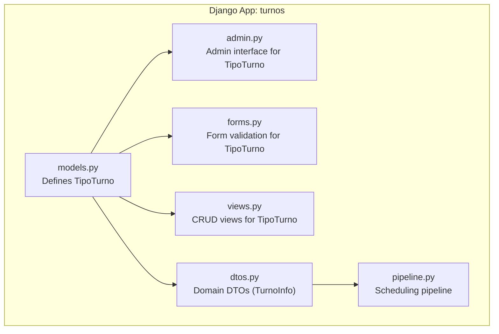
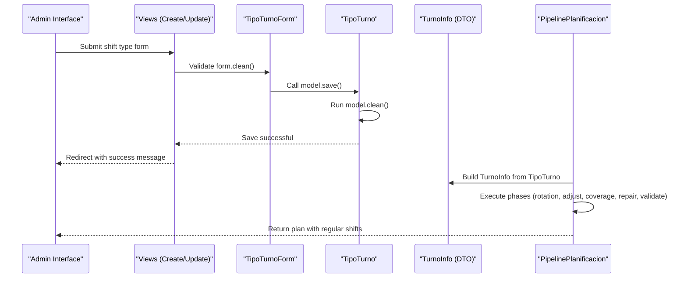
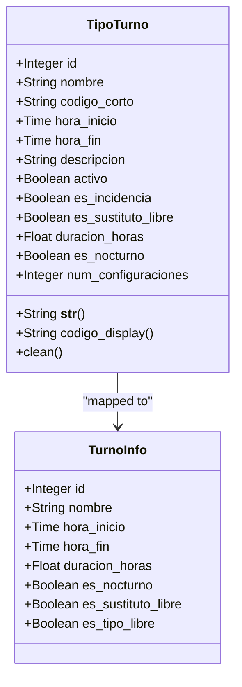
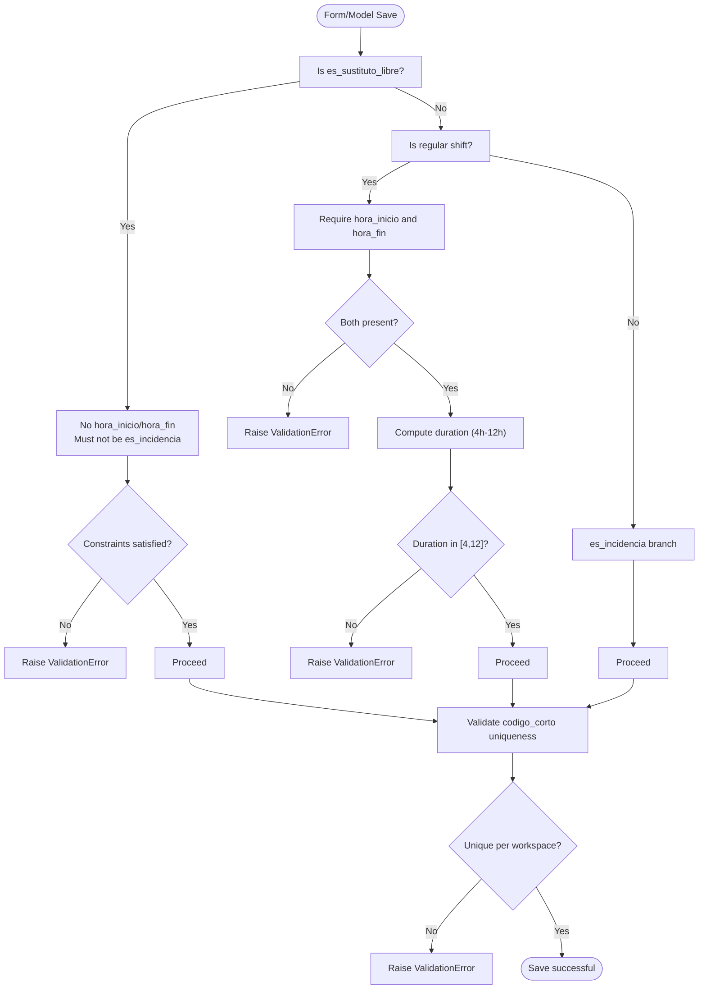
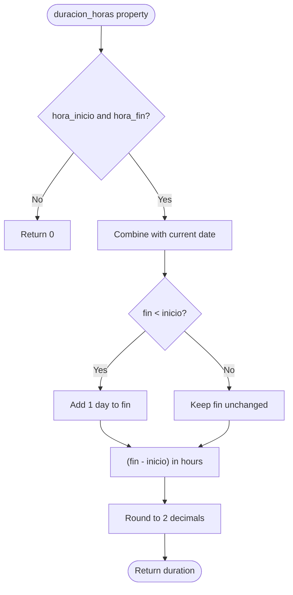
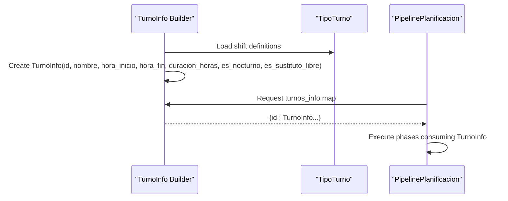
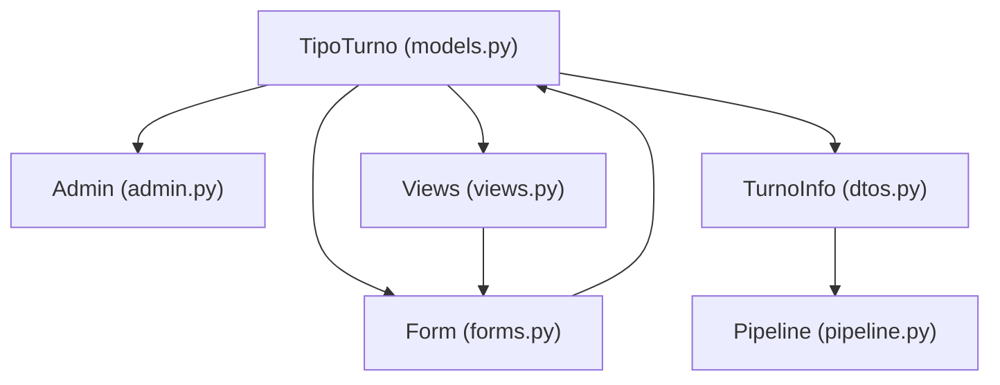

# TipoTurno Model

<cite>
**Referenced Files in This Document**
- [models.py](file://turnos/models.py)
- [admin.py](file://turnos/admin.py)
- [forms.py](file://turnos/forms.py)
- [views.py](file://turnos/views.py)
- [dtos.py](file://turnos/dominio/dtos.py)
- [pipeline.py](file://turnos/motor/pipeline.py)
- [0012_tipoturno_codigo_corto.py](file://turnos/migrations/0012_tipoturno_codigo_corto.py)
- [0014_tipoturno_sustituto_libre.py](file://turnos/migrations/0014_tipoturno_sustituto_libre.py)
</cite>

## Table of Contents
1. [Introduction](#introduction)
2. [Project Structure](#project-structure)
3. [Core Components](#core-components)
4. [Architecture Overview](#architecture-overview)
5. [Detailed Component Analysis](#detailed-component-analysis)
6. [Dependency Analysis](#dependency-analysis)
7. [Performance Considerations](#performance-considerations)
8. [Troubleshooting Guide](#troubleshooting-guide)
9. [Conclusion](#conclusion)

## Introduction
This document provides comprehensive documentation for the TipoTurno model, which defines shift types and their properties in the scheduling system. It covers model fields, validation logic, duration calculation, nocturnal shift detection, display formatting, and practical examples of creating different shift types (regular shifts, incidences, substitute free days) and their impact on the scheduling algorithm.

## Project Structure
The TipoTurno model resides in the turnos application and integrates with Django admin, forms, views, and the domain layer used by the scheduling pipeline. The model participates in the broader domain through DTOs and influences the scheduling process via the pipeline.

**Diagram sources**
- [models.py:60-208](file://turnos/models.py#L60-L208)
- [admin.py:16-58](file://turnos/admin.py#L16-L58)
- [forms.py:75-162](file://turnos/forms.py#L75-L162)
- [views.py:1112-1166](file://turnos/views.py#L1112-L1166)
- [dtos.py:43-58](file://turnos/dominio/dtos.py#L43-L58)
- [pipeline.py:31-102](file://turnos/motor/pipeline.py#L31-L102)

**Section sources**
- [models.py:60-208](file://turnos/models.py#L60-L208)
- [admin.py:16-58](file://turnos/admin.py#L16-L58)
- [forms.py:75-162](file://turnos/forms.py#L75-L162)
- [views.py:1112-1166](file://turnos/views.py#L1112-L1166)
- [dtos.py:43-58](file://turnos/dominio/dtos.py#L43-L58)
- [pipeline.py:31-102](file://turnos/motor/pipeline.py#L31-L102)

## Core Components
- Model definition and fields: nombre, codigo_corto, hora_inicio, hora_fin, descripcion, activo, es_incidencia, es_sustituto_libre.
- Validation logic in both model.clean() and form.clean() to enforce business rules.
- Helper properties: duracion_horas, es_nocturno, codigo_display, num_configuraciones.
- Admin interface and CRUD views for managing shift types.
- Domain integration via TurnoInfo DTO used by the scheduling pipeline.

**Section sources**
- [models.py:60-208](file://turnos/models.py#L60-L208)
- [forms.py:75-162](file://turnos/forms.py#L75-L162)
- [admin.py:16-58](file://turnos/admin.py#L16-L58)
- [views.py:1112-1166](file://turnos/views.py#L1112-L1166)
- [dtos.py:43-58](file://turnos/dominio/dtos.py#L43-L58)

## Architecture Overview
The scheduling pipeline orchestrates five phases: rotation base construction, hours adjustment, coverage analysis, repair with CP-SAT, and validation. The pipeline consumes normalized TurnoInfo objects derived from TipoTurno instances. Regular shifts contribute hours and timing constraints; incidences and substitute free days are applied separately after generation.

**Diagram sources**
- [forms.py:114-161](file://turnos/forms.py#L114-L161)
- [models.py:126-168](file://turnos/models.py#L126-L168)
- [views.py:1125-1141](file://turnos/views.py#L1125-L1141)
- [dtos.py:43-58](file://turnos/dominio/dtos.py#L43-L58)
- [pipeline.py:92-200](file://turnos/motor/pipeline.py#L92-L200)

## Detailed Component Analysis

### Model Fields and Constraints
- nombre: Unique per workspace constraint ensures distinct shift type names within a workspace.
- codigo_corto: Required and unique per workspace; defaults to first letter if empty during migration.
- hora_inicio, hora_fin: Optional for special types (Libre, Descanso); required for regular shifts.
- es_incidencia: Marks shift types as incidences (non-auto assignable).
- es_sustituto_libre: Treats the type as "Libre" (0 hours, no schedule) in planning.
- activo: Enables/disables shift type usage.
- Workspace foreign key: Isolates data per user workspace.

**Diagram sources**
- [models.py:60-208](file://turnos/models.py#L60-L208)
- [dtos.py:43-58](file://turnos/dominio/dtos.py#L43-L58)

**Section sources**
- [models.py:60-208](file://turnos/models.py#L60-L208)
- [0012_tipoturno_codigo_corto.py:6-18](file://turnos/migrations/0012_tipoturno_codigo_corto.py#L6-L18)
- [0014_tipoturno_sustituto_libre.py:12-18](file://turnos/migrations/0014_tipoturno_sustituto_libre.py#L12-L18)

### Validation Logic
Validation occurs at two levels:
- Model-level clean(): Enforces mutual exclusivity and completeness of fields, uniqueness of codigo_corto per workspace, and logical constraints for special types.
- Form-level clean(): Adds duration bounds for regular shifts and mirrors model validations.

Key rules:
- Substitute-free types cannot have a schedule and cannot be marked as incidences.
- Regular shifts require both hora_inicio and hora_fin and must have a duration between 4 and 12 hours.
- codigo_corto is mandatory and unique per workspace.
- Unique constraints on (workspace, nombre) and (workspace, codigo_corto).

**Diagram sources**
- [models.py:126-168](file://turnos/models.py#L126-L168)
- [forms.py:114-161](file://turnos/forms.py#L114-L161)

**Section sources**
- [models.py:126-168](file://turnos/models.py#L126-L168)
- [forms.py:114-161](file://turnos/forms.py#L114-L161)

### Duration Calculation Method
The model computes shift duration in hours:
- If hora_inicio or hora_fin is missing, duration is 0.
- Otherwise, it combines today's date with both times and adjusts for midnight crossing by adding one day to the end time when necessary.
- Duration is rounded to two decimal places.

**Diagram sources**
- [models.py:181-194](file://turnos/models.py#L181-L194)

**Section sources**
- [models.py:181-194](file://turnos/models.py#L181-L194)

### Nocturnal Shift Detection
A shift is considered nocturnal if hora_fin is earlier than hora_inicio, indicating it crosses midnight.

**Section sources**
- [models.py:196-202](file://turnos/models.py#L196-L202)

### Display Formatting
- __str__() shows nombre, optional codigo_corto, and formatted time range or "without specific schedule".
- codigo_display() returns codigo_corto if available, otherwise the first letter of nombre.
- Admin displays a color-coded preview badge for common shift names.

**Section sources**
- [models.py:169-179](file://turnos/models.py#L169-L179)
- [admin.py:40-57](file://turnos/admin.py#L40-L57)

### Examples of Creating Different Shift Types

#### Regular Shift (e.g., Morning)
- Fields: nombre, codigo_corto, hora_inicio, hora_fin, activo.
- Validation: Both hora_inicio and hora_fin required; duration must be between 4 and 12 hours.
- Impact: Contributes scheduled hours and timing constraints to the pipeline; affects coverage analysis and solver decisions.

#### Incidence (e.g., Vacation)
- Fields: nombre, codigo_corto, es_incidencia=True, activo.
- Validation: No schedule required; cannot be a substitute-free type.
- Impact: Not automatically assigned by the pipeline; applied later via overlay mechanisms.

#### Substitute Free Day (e.g., Coverage Replacement)
- Fields: nombre, codigo_corto, es_sustituto_libre=True, activo.
- Validation: Must not define hora_inicio or hora_fin; must not be an incidence.
- Impact: Acts as "Libre" in planning (0 hours, no schedule), affecting coverage calculations and solver feasibility.

**Section sources**
- [forms.py:114-161](file://turnos/forms.py#L114-L161)
- [models.py:126-168](file://turnos/models.py#L126-L168)
- [views.py:1168-1204](file://turnos/views.py#L1168-L1204)

### Integration with Scheduling Pipeline
- TurnoInfo is built from TipoTurno for internal processing.
- Regular shifts participate in rotation base construction, hours adjustment, and coverage analysis.
- Incidences and substitute free days are applied post-generation via overlay mechanisms, not during automatic generation.

**Diagram sources**
- [dtos.py:43-58](file://turnos/dominio/dtos.py#L43-L58)
- [pipeline.py:92-200](file://turnos/motor/pipeline.py#L92-L200)

**Section sources**
- [dtos.py:43-58](file://turnos/dominio/dtos.py#L43-L58)
- [pipeline.py:92-200](file://turnos/motor/pipeline.py#L92-L200)

## Dependency Analysis
- Internal dependencies: Model depends on Django ORM and validation utilities; admin and forms depend on the model; views depend on forms and admin; domain DTOs depend on model attributes.
- External dependencies: Django framework, Python datetime/time utilities.
- Migration dependencies: Initial model additions and subsequent field additions (codigo_corto, es_sustituto_libre).

**Diagram sources**
- [models.py:60-208](file://turnos/models.py#L60-L208)
- [admin.py:16-58](file://turnos/admin.py#L16-L58)
- [forms.py:75-162](file://turnos/forms.py#L75-L162)
- [views.py:1112-1166](file://turnos/views.py#L1112-L1166)
- [dtos.py:43-58](file://turnos/dominio/dtos.py#L43-L58)
- [pipeline.py:31-102](file://turnos/motor/pipeline.py#L31-L102)

**Section sources**
- [models.py:60-208](file://turnos/models.py#L60-L208)
- [admin.py:16-58](file://turnos/admin.py#L16-L58)
- [forms.py:75-162](file://turnos/forms.py#L75-L162)
- [views.py:1112-1166](file://turnos/views.py#L1112-L1166)
- [dtos.py:43-58](file://turnos/dominio/dtos.py#L43-L58)
- [pipeline.py:31-102](file://turnos/motor/pipeline.py#L31-L102)

## Performance Considerations
- Duration calculation uses datetime arithmetic; minimal overhead due to simple time comparisons and timedelta adjustments.
- Validation runs at both form and model levels; keep form validations concise to avoid redundant checks.
- Uniqueness constraints on workspace-scoped fields prevent accidental duplicates and support efficient lookups.

## Troubleshooting Guide
Common validation errors and resolutions:
- "Substitute-free types must not have a schedule and must not be incidences": Ensure es_sustituto_libre is True and both hora_inicio and hora_fin are empty; es_incidencia must be False.
- "Regular shifts must have both start and end times": Provide hora_inicio and hora_fin for non-substitute-free, non-incidence types.
- "Duration must be between 4 and 12 hours": Adjust hora_inicio and hora_fin so computed duration falls within bounds.
- "Code short is mandatory": Set a non-empty codigo_corto unique per workspace.
- "Duplicate code short per workspace": Change codigo_corto to a unique value within the workspace.

Impact on scheduling:
- Incorrect configurations can cause pipeline failures or infeasible plans; verify shift definitions before running the scheduler.
- Incidences and substitute free days should be applied post-generation via overlay mechanisms to avoid conflicts with automatic assignment.

**Section sources**
- [models.py:126-168](file://turnos/models.py#L126-L168)
- [forms.py:114-161](file://turnos/forms.py#L114-L161)
- [views.py:1150-1166](file://turnos/views.py#L1150-L1166)

## Conclusion
The TipoTurno model provides a flexible and validated foundation for defining shift types. Its constraints ensure data integrity, while helper properties enable accurate duration and nocturnal shift detection. Proper configuration of shift types—regular shifts, incidences, and substitute free days—directly impacts the scheduling pipeline outcomes. Adhering to validation rules and understanding the model's role in the domain layer leads to reliable and maintainable scheduling solutions.