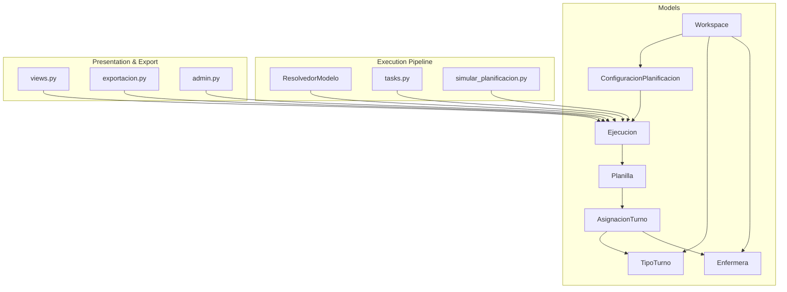
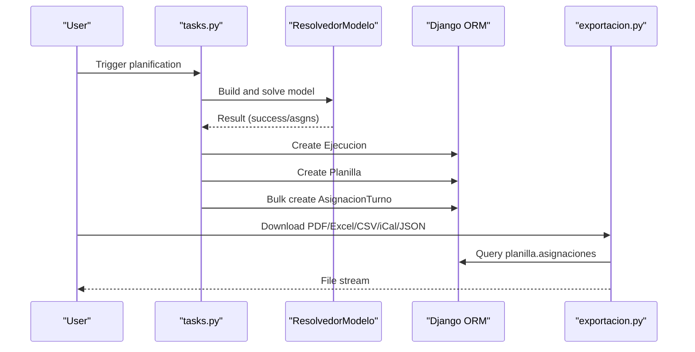
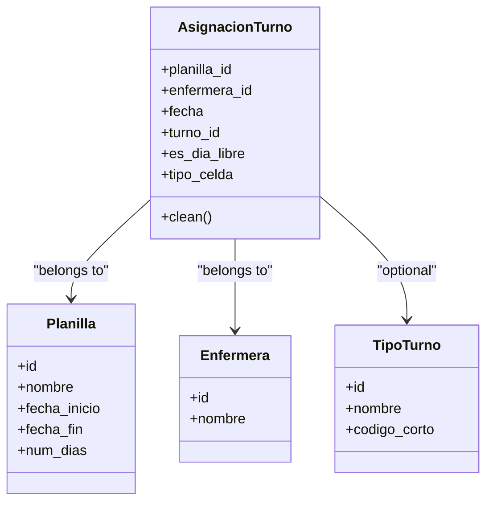
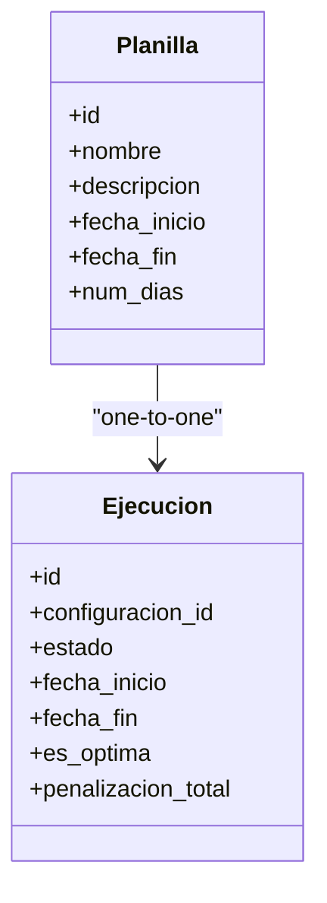
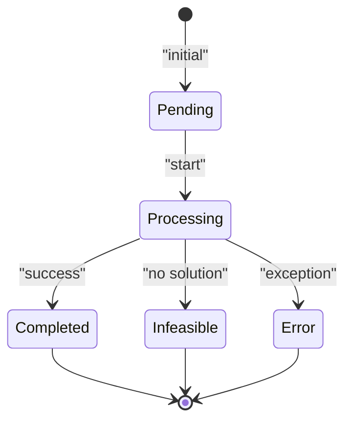
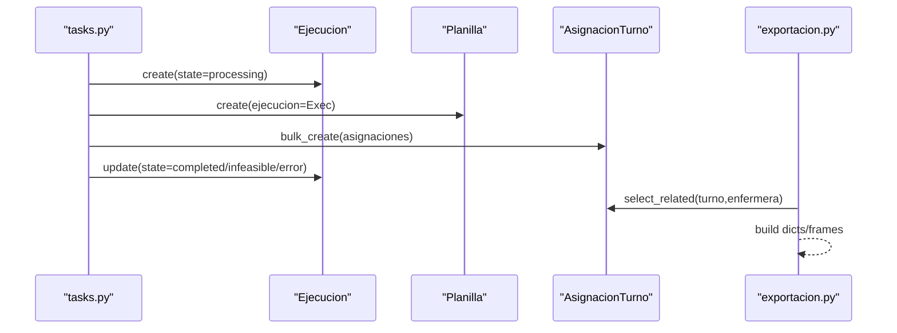
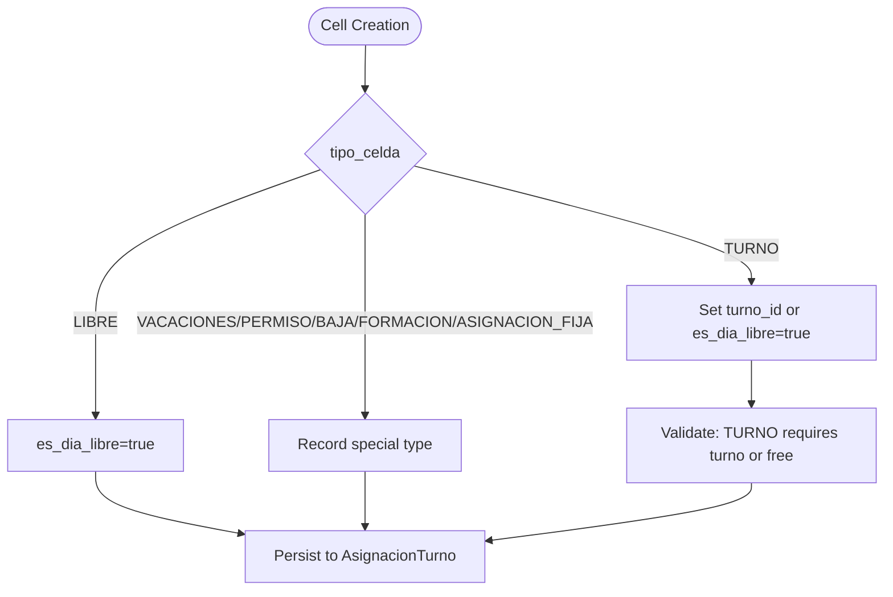
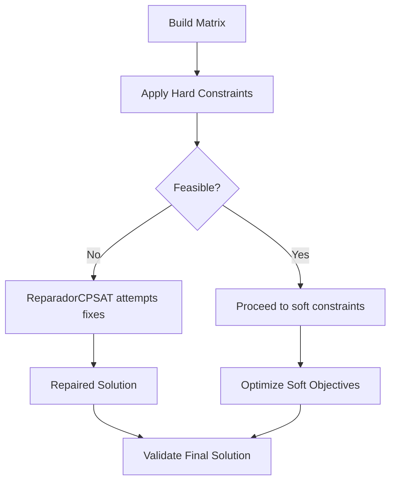
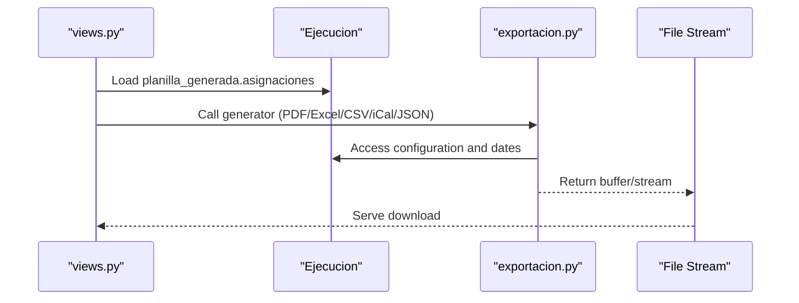
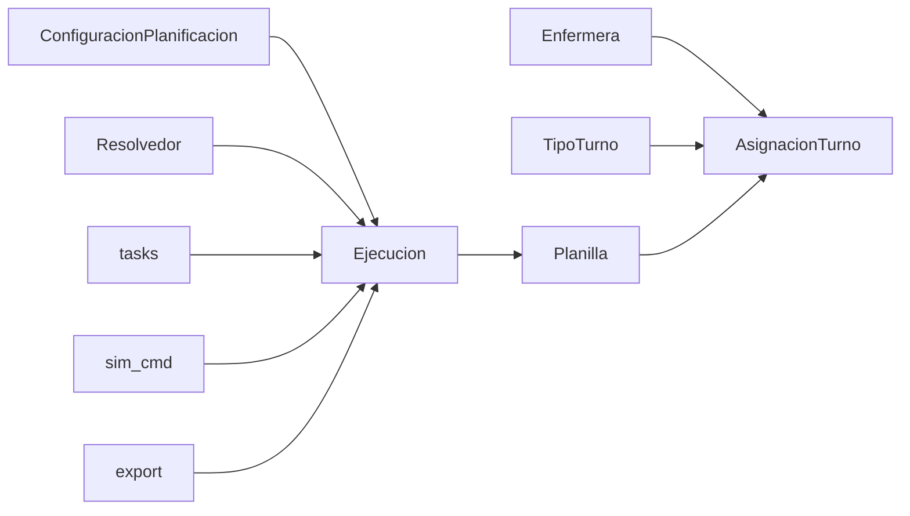

# Assignment and Scheduling Models

<cite>
**Referenced Files in This Document**
- [models.py](file://turnos/models.py)
- [tasks.py](file://turnos/tasks.py)
- [simular_planificacion.py](file://turnos/management/commands/simular_planificacion.py)
- [exportacion.py](file://turnos/utils/exportacion.py)
- [views.py](file://turnos/views.py)
- [admin.py](file://turnos/admin.py)
- [0009_add_domain_models.py](file://turnos/migrations/0009_add_domain_models.py)
- [0001_initial.py](file://turnos/migrations/0001_initial.py)
- [resolvedor.py](file://turnos/resolvedor.py)
- [generador_refactorizado.py](file://turnos/generador_refactorizado.py)
- [test_integracion_final.py](file://turnos/tests/test_motor/test_integracion_final.py)
- [test_reparador.py](file://turnos/tests/test_motor/test_reparador.py)
</cite>

## Table of Contents
1. [Introduction](#introduction)
2. [Project Structure](#project-structure)
3. [Core Components](#core-components)
4. [Architecture Overview](#architecture-overview)
5. [Detailed Component Analysis](#detailed-component-analysis)
6. [Dependency Analysis](#dependency-analysis)
7. [Performance Considerations](#performance-considerations)
8. [Troubleshooting Guide](#troubleshooting-guide)
9. [Conclusion](#conclusion)
10. [Appendices](#appendices)

## Introduction
This document explains the assignment and scheduling models that power the shift planning system. It focuses on three core models: AsignacionTurno (individual nurse assignments), Planilla (generated schedule), and Ejecucion (execution tracking for planning runs). It also covers how assignments are stored in the schedule matrix, planilla generation and management, execution status tracking, and the unique constraint system that prevents duplicate assignments. Additionally, it documents assignment types (turno, libre, incidencias), the relationship between executions and planillas, and assignment conflict resolution via the solver and validator pipeline.

## Project Structure
The assignment and scheduling domain is primarily implemented in the models module, orchestrated by Celery tasks and management commands, and surfaced through Django views and admin. Export utilities convert planilla data into various formats (PDF, Excel, CSV, iCal, JSON). Tests validate end-to-end execution and conflict resolution.

**Diagram sources**
- [models.py:12-825](file://turnos/models.py#L12-L825)
- [resolvedor.py:11-113](file://turnos/resolvedor.py#L11-L113)
- [tasks.py:125-190](file://turnos/tasks.py#L125-L190)
- [simular_planificacion.py:332-394](file://turnos/management/commands/simular_planificacion.py#L332-L394)
- [exportacion.py:515-626](file://turnos/utils/exportacion.py#L515-L626)
- [views.py:1209-1312](file://turnos/views.py#L1209-L1312)
- [admin.py:182-267](file://turnos/admin.py#L182-L267)

**Section sources**
- [models.py:12-825](file://turnos/models.py#L12-L825)
- [tasks.py:125-190](file://turnos/tasks.py#L125-L190)
- [simular_planificacion.py:332-394](file://turnos/management/commands/simular_planificacion.py#L332-L394)
- [exportacion.py:515-626](file://turnos/utils/exportacion.py#L515-L626)
- [views.py:1209-1312](file://turnos/views.py#L1209-L1312)
- [admin.py:182-267](file://turnos/admin.py#L182-L267)

## Core Components
- AsignacionTurno: Stores per-nurse, per-day assignments. Supports explicit assignment types (turno, libre, incidencias) and enforces uniqueness at the planilla level.
- Planilla: Represents a generated schedule linked to a single execution. Contains period metadata and a one-to-one relationship to Ejecucion.
- Ejecucion: Tracks a planning run’s lifecycle (pending, processing, completed, inviable, error), duration, optimality, penalties, and results/messages.

Key constraints and behaviors:
- Unique constraint on (planilla, enfermera, fecha) ensures a nurse has at most one assignment per day within a planilla.
- Assignment types include TURNO, LIBRE, VACACIONES, PERMISO, BAJA, FORMACION, ASIGNACION_FIJA.
- Ejecucion links to Planilla via a one-to-one relationship, ensuring canonical linkage.

**Section sources**
- [models.py:568-622](file://turnos/models.py#L568-L622)
- [models.py:534-565](file://turnos/models.py#L534-L565)
- [models.py:482-531](file://turnos/models.py#L482-L531)
- [0009_add_domain_models.py:14-18](file://turnos/migrations/0009_add_domain_models.py#L14-L18)
- [0001_initial.py:116-120](file://turnos/migrations/0001_initial.py#L116-L120)

## Architecture Overview
The system orchestrates planning runs from configuration to execution to planilla generation and export. The solver produces feasible/optimal solutions, which are validated and persisted into AsignacionTurno entries. Views and admin surfaces expose planilla details and export capabilities.

**Diagram sources**
- [tasks.py:125-190](file://turnos/tasks.py#L125-L190)
- [resolvedor.py:21-50](file://turnos/resolvedor.py#L21-L50)
- [simular_planificacion.py:332-394](file://turnos/management/commands/simular_planificacion.py#L332-L394)
- [exportacion.py:515-626](file://turnos/utils/exportacion.py#L515-L626)

## Detailed Component Analysis

### AsignacionTurno Model
AsignacionTurno stores the fundamental unit of the schedule: who works when. It supports:
- Explicit assignment type via tipo_celda with choices covering regular turns, days off, and special statuses.
- A unique constraint across (planilla, enfermera, fecha) to prevent duplicates.
- Clean validation ensuring TURNO cells either reference a TipoTurno or mark es_dia_libre.

**Diagram sources**
- [models.py:568-622](file://turnos/models.py#L568-L622)
- [models.py:534-565](file://turnos/models.py#L534-L565)
- [models.py:30-57](file://turnos/models.py#L30-L57)
- [models.py:60-107](file://turnos/models.py#L60-L107)

**Section sources**
- [models.py:568-622](file://turnos/models.py#L568-L622)
- [0009_add_domain_models.py:14-18](file://turnos/migrations/0009_add_domain_models.py#L14-L18)

### Planilla Model
Planilla encapsulates a generated schedule tied to a single Ejecucion. It holds period boundaries and a one-to-one relationship to Ejecucion, ensuring canonical linkage.

**Diagram sources**
- [models.py:534-565](file://turnos/models.py#L534-L565)
- [models.py:482-531](file://turnos/models.py#L482-L531)

**Section sources**
- [models.py:534-565](file://turnos/models.py#L534-L565)
- [0001_initial.py:99-120](file://turnos/migrations/0001_initial.py#L99-L120)

### Ejecucion Model
Ejecucion tracks the lifecycle of a planning run, including state transitions, timing, optimality, penalties, and structured results/messages. It links to Planilla via a one-to-one relationship.

**Diagram sources**
- [models.py:482-531](file://turnos/models.py#L482-L531)

**Section sources**
- [models.py:482-531](file://turnos/models.py#L482-L531)
- [0001_initial.py:86-97](file://turnos/migrations/0001_initial.py#L86-L97)

### Execution Pipeline and Planilla Generation
The execution pipeline builds the schedule, persists it, and exposes it for export:
- The solver resolves the model and validates results.
- Tasks create Ejecucion, Planilla, and bulk insert AsignacionTurno entries.
- Management command simulates the full pipeline and validates persistence and exports.
- Export utilities translate planilla data into multiple formats.

**Diagram sources**
- [tasks.py:125-190](file://turnos/tasks.py#L125-L190)
- [tasks.py:602-639](file://turnos/tasks.py#L602-L639)
- [simular_planificacion.py:332-394](file://turnos/management/commands/simular_planificacion.py#L332-L394)
- [exportacion.py:86-120](file://turnos/utils/exportacion.py#L86-L120)

**Section sources**
- [tasks.py:125-190](file://turnos/tasks.py#L125-L190)
- [tasks.py:602-639](file://turnos/tasks.py#L602-L639)
- [simular_planificacion.py:332-394](file://turnos/management/commands/simular_planificacion.py#L332-L394)
- [exportacion.py:86-120](file://turnos/utils/exportacion.py#L86-L120)

### Assignment Types and Incidencias
Assignment types distinguish regular work from days off and special statuses:
- TURNO: Regular shift assignment to a TipoTurno.
- LIBRE: Explicit day off.
- VACACIONES, PERMISO, BAJA, FORMACION, ASIGNACION_FIJA: Special statuses captured via tipo_celda.

Incidencias are separate events affecting planning (e.g., leaves, training), while AsignacionTurno records the resulting schedule cells.

**Diagram sources**
- [models.py:594-622](file://turnos/models.py#L594-L622)
- [0009_add_domain_models.py:40-56](file://turnos/migrations/0009_add_domain_models.py#L40-L56)

**Section sources**
- [models.py:594-622](file://turnos/models.py#L594-L622)
- [0009_add_domain_models.py:40-56](file://turnos/migrations/0009_add_domain_models.py#L40-L56)

### Unique Constraint System and Conflict Resolution
- Uniqueness: The unique_together constraint on (planilla, enfermera, fecha) prevents duplicate assignments per nurse per day within a planilla.
- Validation: AsignacionTurno.clean enforces that TURNO cells must specify a turno or be marked as libre.
- Conflict resolution: The solver (CP-SAT) finds feasible solutions; the validator checks hard constraints and computes penalties; tests confirm the repairer handles real-world conflicts and uses correct variables.

**Diagram sources**
- [resolvedor.py:21-50](file://turnos/resolvedor.py#L21-L50)
- [test_integracion_final.py:144-169](file://turnos/tests/test_motor/test_integracion_final.py#L144-L169)
- [test_reparador.py:83-120](file://turnos/tests/test_motor/test_reparador.py#L83-L120)

**Section sources**
- [models.py:606-622](file://turnos/models.py#L606-L622)
- [resolvedor.py:21-50](file://turnos/resolvedor.py#L21-L50)
- [test_integracion_final.py:144-169](file://turnos/tests/test_motor/test_integracion_final.py#L144-L169)
- [test_reparador.py:83-120](file://turnos/tests/test_motor/test_reparador.py#L83-L120)

### Planilla Export Workflows
Multiple export formats are supported:
- PDF: Horizontal matrix of nurses vs. days.
- Excel: Seven worksheets (vertical planilla, horizontal planilla, stats, per-enfermera, coverage, equity, validations).
- CSV: Vertical format aligned with configuration.
- iCal: Events for each shift.
- JSON: Structured planilla data.

**Diagram sources**
- [views.py:2036-2051](file://turnos/views.py#L2036-L2051)
- [exportacion.py:515-626](file://turnos/utils/exportacion.py#L515-L626)
- [exportacion.py:135-466](file://turnos/utils/exportacion.py#L135-L466)
- [exportacion.py:531-556](file://turnos/utils/exportacion.py#L531-L556)
- [exportacion.py:559-581](file://turnos/utils/exportacion.py#L559-L581)
- [exportacion.py:584-626](file://turnos/utils/exportacion.py#L584-L626)

**Section sources**
- [views.py:2036-2051](file://turnos/views.py#L2036-L2051)
- [exportacion.py:515-626](file://turnos/utils/exportacion.py#L515-L626)
- [exportacion.py:135-466](file://turnos/utils/exportacion.py#L135-L466)
- [exportacion.py:531-581](file://turnos/utils/exportacion.py#L531-L581)

## Dependency Analysis
- AsignacionTurno depends on Planilla, Enfermera, and optionally TipoTurno.
- Planilla depends on Ejecucion (one-to-one).
- Ejecucion depends on ConfiguracionPlanificacion and is the anchor for Planilla creation.
- Execution pipeline depends on the solver and validator modules.
- Export utilities depend on Ejecucion and Planilla relationships.

**Diagram sources**
- [models.py:30-57](file://turnos/models.py#L30-L57)
- [models.py:60-107](file://turnos/models.py#L60-L107)
- [models.py:534-565](file://turnos/models.py#L534-L565)
- [models.py:482-531](file://turnos/models.py#L482-L531)
- [resolvedor.py:11-113](file://turnos/resolvedor.py#L11-L113)
- [tasks.py:125-190](file://turnos/tasks.py#L125-L190)
- [simular_planificacion.py:332-394](file://turnos/management/commands/simular_planificacion.py#L332-L394)
- [exportacion.py:515-626](file://turnos/utils/exportacion.py#L515-L626)

**Section sources**
- [models.py:30-57](file://turnos/models.py#L30-L57)
- [models.py:60-107](file://turnos/models.py#L60-L107)
- [models.py:534-565](file://turnos/models.py#L534-L565)
- [models.py:482-531](file://turnos/models.py#L482-L531)
- [resolvedor.py:11-113](file://turnos/resolvedor.py#L11-L113)
- [tasks.py:125-190](file://turnos/tasks.py#L125-L190)
- [simular_planificacion.py:332-394](file://turnos/management/commands/simular_planificacion.py#L332-L394)
- [exportacion.py:515-626](file://turnos/utils/exportacion.py#L515-L626)

## Performance Considerations
- Solver configuration: Workers, timeout, and seed are configurable in Ejecucion-related logic and passed to the solver.
- Bulk creation: AsignacionTurno bulk inserts minimize database round-trips during planilla generation.
- Export efficiency: Exporters operate on prefetched relationships to avoid repeated queries.

[No sources needed since this section provides general guidance]

## Troubleshooting Guide
Common issues and resolutions:
- Duplicate assignment errors: Verify the unique_together constraint and ensure tipo_celda and turno/es_dia_libre are set correctly.
- Empty or missing planilla: Confirm Ejecucion state and that Planilla was created after successful solver results.
- Export failures: Validate availability of optional libraries (e.g., openpyxl, icalendar) and check logs for exceptions.
- Conflicts unresolved: Review solver status and validation reports; use the repairer tests as references for expected behavior.

**Section sources**
- [models.py:606-622](file://turnos/models.py#L606-L622)
- [tasks.py:125-190](file://turnos/tasks.py#L125-L190)
- [exportacion.py:515-626](file://turnos/utils/exportacion.py#L515-L626)
- [test_integracion_final.py:144-169](file://turnos/tests/test_motor/test_integracion_final.py#L144-L169)
- [test_reparador.py:83-120](file://turnos/tests/test_motor/test_reparador.py#L83-L120)

## Conclusion
The assignment and scheduling system centers on AsignacionTurno, Planilla, and Ejecucion, with robust constraints and a validated execution pipeline. The unique constraint prevents duplicate assignments, while explicit assignment types support diverse scheduling needs. The solver and validator pipeline resolve conflicts and produce optimized schedules, which are persisted and exported in multiple formats for operational use.

## Appendices

### Example Workflows
- Creating assignments programmatically: Use the execution pipeline to generate Ejecucion, Planilla, and AsignacionTurno entries.
- Generating a planilla: Trigger the pipeline; then export via views or utilities.
- Tracking execution status: Monitor Ejecucion state and duration; inspect results and penalties.

**Section sources**
- [tasks.py:125-190](file://turnos/tasks.py#L125-L190)
- [simular_planificacion.py:332-394](file://turnos/management/commands/simular_planificacion.py#L332-L394)
- [exportacion.py:515-626](file://turnos/utils/exportacion.py#L515-L626)
- [views.py:1209-1312](file://turnos/views.py#L1209-L1312)