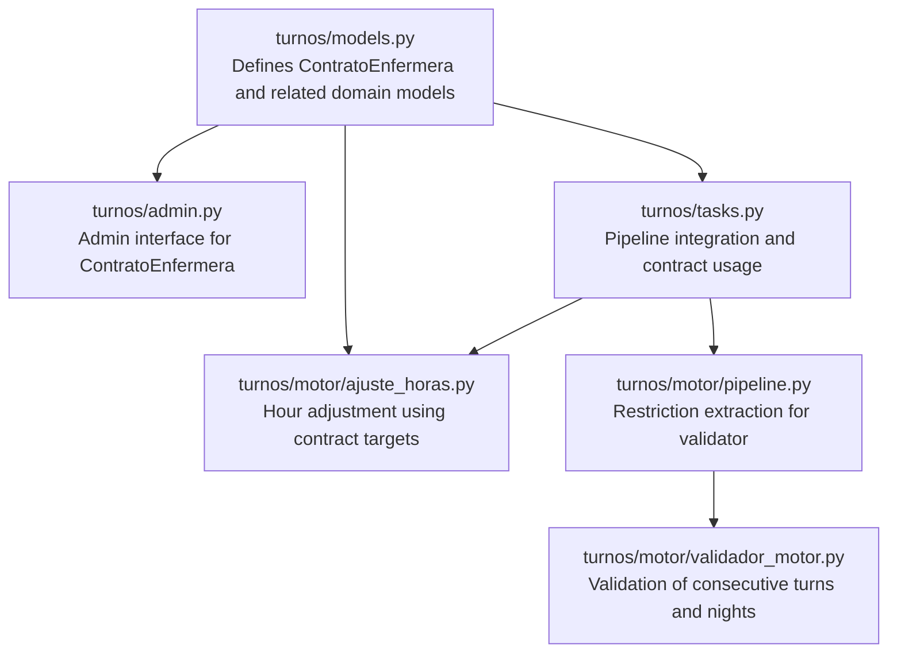
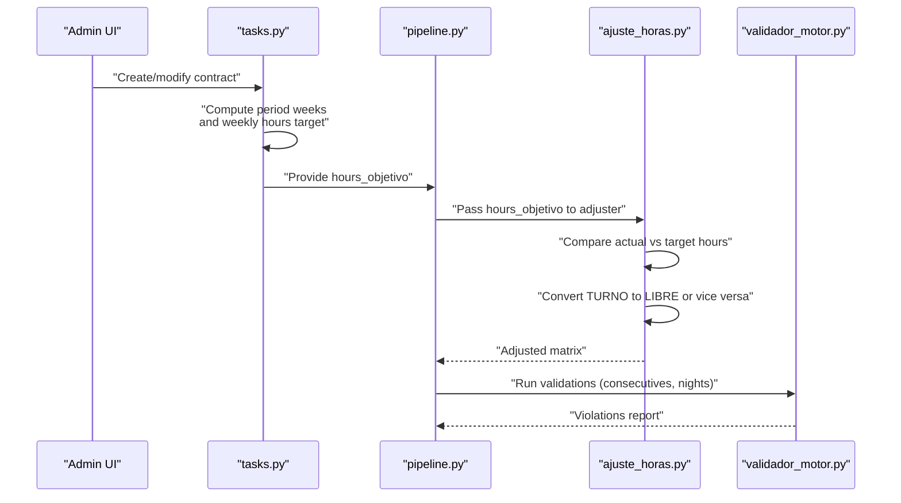
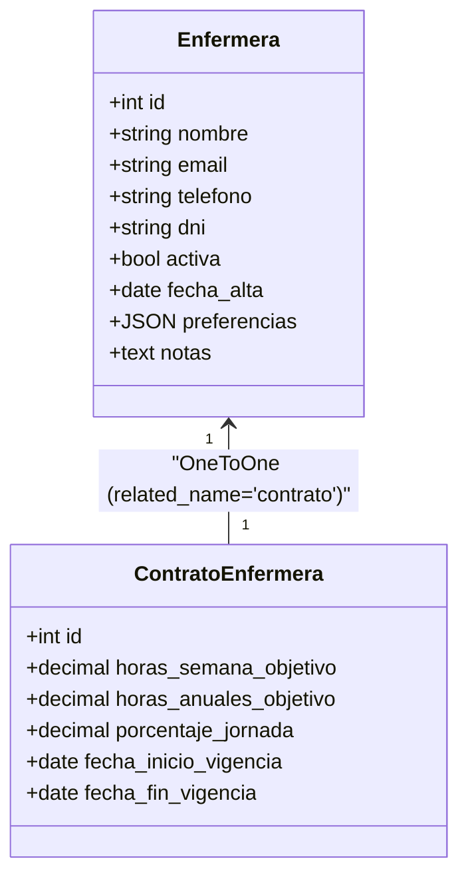
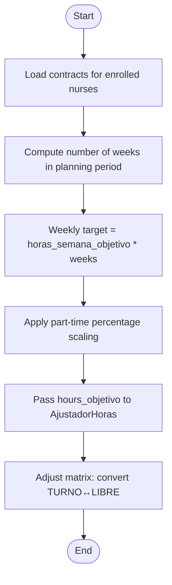
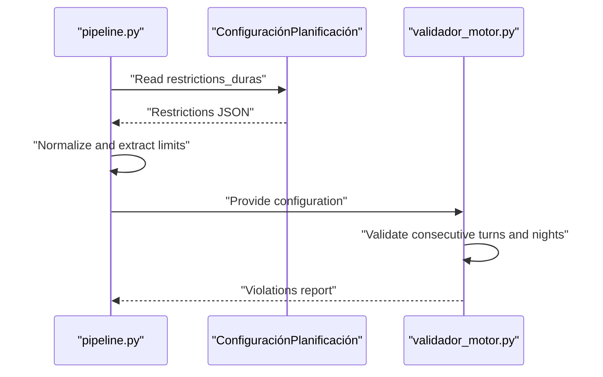
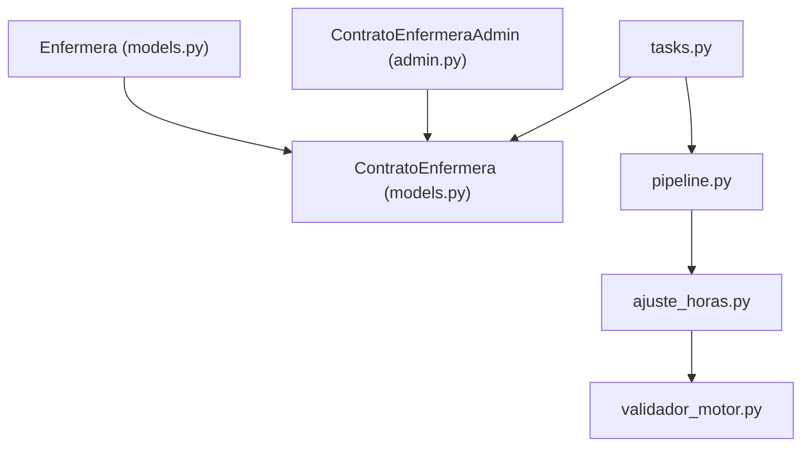

# Contract Model

<cite>
**Referenced Files in This Document**
- [models.py](file://turnos/models.py)
- [admin.py](file://turnos/admin.py)
- [ajuste_horas.py](file://turnos/motor/ajuste_horas.py)
- [tasks.py](file://turnos/tasks.py)
- [pipeline.py](file://turnos/motor/pipeline.py)
- [validador_motor.py](file://turnos/motor/validador_motor.py)
- [0009_add_domain_models.py](file://turnos/migrations/0009_add_domain_models.py)
</cite>

## Table of Contents
1. [Introduction](#introduction)
2. [Project Structure](#project-structure)
3. [Core Components](#core-components)
4. [Architecture Overview](#architecture-overview)
5. [Detailed Component Analysis](#detailed-component-analysis)
6. [Dependency Analysis](#dependency-analysis)
7. [Performance Considerations](#performance-considerations)
8. [Troubleshooting Guide](#troubleshooting-guide)
9. [Conclusion](#conclusion)

## Introduction
This document explains the ContratoEnfermera model that defines nurse working contracts within the system. It covers the one-to-one relationship with Enfermera, target weekly and annual hours configuration, part-time percentage settings, and contract validity periods. It also documents the contract lifecycle, validation rules for contract dates, and how contract parameters influence scheduling calculations. Examples of contract creation and modification scenarios are included, along with integration details with the planning system's hour adjustment mechanisms.

## Project Structure
The contract model is defined in the domain models alongside other planning-related entities. Administrative interfaces and integration points with the planning pipeline are implemented in separate modules.

**Diagram sources**
- [models.py:629-663](file://turnos/models.py#L629-L663)
- [admin.py:358-383](file://turnos/admin.py#L358-L383)
- [ajuste_horas.py:21-91](file://turnos/motor/ajuste_horas.py#L21-L91)
- [tasks.py:507-523](file://turnos/tasks.py#L507-L523)
- [pipeline.py:247-266](file://turnos/motor/pipeline.py#L247-L266)
- [validador_motor.py:129-156](file://turnos/motor/validador_motor.py#L129-L156)

**Section sources**
- [models.py:629-663](file://turnos/models.py#L629-L663)
- [admin.py:358-383](file://turnos/admin.py#L358-L383)

## Core Components
- ContratoEnfermera: Defines the contractual working regime for a single nurse, including weekly and annual hour targets, part-time percentage, and validity period.
- Enfermera: The nurse entity linked via a one-to-one relationship to the contract.
- Planning integration: The contract drives hour adjustments during the planning pipeline and influences solver objectives and validations.

Key attributes and relationships:
- One-to-one relationship with Enfermera via a unique constraint.
- Weekly and annual hour targets used to compute period-specific objectives.
- Part-time percentage to scale targets proportionally.
- Validity period (start and optional end date) to determine applicability.

**Section sources**
- [models.py:629-663](file://turnos/models.py#L629-L663)
- [models.py:30-54](file://turnos/models.py#L30-L54)

## Architecture Overview
The contract model integrates with the planning pipeline to ensure generated schedules align with contractual obligations. Hour adjustments are applied after deterministic rotation to meet weekly/annual targets, while solver objectives and validations consider consecutive work constraints.

**Diagram sources**
- [tasks.py:507-523](file://turnos/tasks.py#L507-L523)
- [pipeline.py:247-266](file://turnos/motor/pipeline.py#L247-L266)
- [ajuste_horas.py:46-88](file://turnos/motor/ajuste_horas.py#L46-L88)
- [validador_motor.py:129-156](file://turnos/motor/validador_motor.py#L129-L156)

## Detailed Component Analysis

### ContratoEnfermera Model
The contract model encapsulates the nurse's contractual working parameters and validity window. It is designed to be a unique, mandatory profile per nurse.

**Diagram sources**
- [models.py:30-54](file://turnos/models.py#L30-L54)
- [models.py:629-663](file://turnos/models.py#L629-L663)

Contract parameters and their roles:
- Weekly target hours: Used to compute the period-specific objective by multiplying by the number of weeks in the planning horizon.
- Annual target hours: Provides a high-level benchmark aligned with typical regulatory frameworks.
- Part-time percentage: Scales the weekly target proportionally to reflect reduced-time contracts.
- Validity period: Ensures the contract applies only during the specified range, enabling historical tracking and future planning.

Contract lifecycle:
- Creation: A contract is created for a nurse with initial targets and validity dates.
- Modification: Targets and validity can be adjusted; the planning pipeline consumes updated values.
- Historical tracking: Multiple contracts can coexist for the same nurse to reflect changes over time.

Contract validity rules:
- Start date is required.
- End date is optional; absence indicates an open-ended contract.
- The admin interface exposes a computed "Vigente" flag based on current date and end date.

**Section sources**
- [models.py:629-663](file://turnos/models.py#L629-L663)
- [admin.py:358-383](file://turnos/admin.py#L358-L383)

### Integration with Planning Hour Adjustment
The planning pipeline computes a period-specific weekly target from the contract and delegates hour balancing to the adjustment module.

**Diagram sources**
- [tasks.py:507-523](file://turnos/tasks.py#L507-L523)
- [ajuste_horas.py:46-88](file://turnos/motor/ajuste_horas.py#L46-L88)

How contract parameters influence scheduling:
- Weekly target drives the solver objective for monthly balances.
- Part-time percentage reduces the target proportionally, affecting the magnitude of adjustments.
- The adjustment process prioritizes minimal disruption by converting adjacent cells and preserving rotation patterns.

**Section sources**
- [tasks.py:507-523](file://turnos/tasks.py#L507-L523)
- [ajuste_horas.py:21-91](file://turnos/motor/ajuste_horas.py#L21-L91)

### Validation Rules and Restrictions
While the contract model itself does not define validation rules, the planning pipeline extracts restriction configurations that indirectly constrain scheduling behavior, including consecutive work limits and night limits.

**Diagram sources**
- [pipeline.py:247-266](file://turnos/motor/pipeline.py#L247-L266)
- [validador_motor.py:129-156](file://turnos/motor/validador_motor.py#L129-L156)

**Section sources**
- [pipeline.py:247-266](file://turnos/motor/pipeline.py#L247-L266)
- [validador_motor.py:129-156](file://turnos/motor/validador_motor.py#L129-L156)

### Examples and Scenarios

- Creating a contract:
  - Use the admin interface to select a nurse and set weekly and annual targets, part-time percentage, and validity dates.
  - The system persists the contract and makes it available to the planning pipeline.

- Modifying a contract mid-period:
  - Update the weekly target or part-time percentage; the pipeline recomputes the objective for the remaining period.
  - The adjustment module applies minimal changes to align with the new target.

- Contract expiration:
  - When the end date passes, the contract is considered inactive for scheduling decisions; a new contract should be created for continued planning.

- Integration with solver objectives:
  - The pipeline extracts configuration limits and passes them to the validator; the adjustment module ensures the schedule meets contractual targets.

**Section sources**
- [admin.py:358-383](file://turnos/admin.py#L358-L383)
- [tasks.py:507-523](file://turnos/tasks.py#L507-L523)
- [ajuste_horas.py:46-88](file://turnos/motor/ajuste_horas.py#L46-L88)
- [pipeline.py:247-266](file://turnos/motor/pipeline.py#L247-L266)

## Dependency Analysis
The contract model depends on the Enfermera entity and is consumed by the planning pipeline and adjustment modules. Administrative views expose contract data for management.

**Diagram sources**
- [models.py:30-54](file://turnos/models.py#L30-L54)
- [models.py:629-663](file://turnos/models.py#L629-L663)
- [admin.py:358-383](file://turnos/admin.py#L358-L383)
- [tasks.py:507-523](file://turnos/tasks.py#L507-L523)
- [pipeline.py:247-266](file://turnos/motor/pipeline.py#L247-L266)
- [ajuste_horas.py:21-91](file://turnos/motor/ajuste_horas.py#L21-L91)
- [validador_motor.py:129-156](file://turnos/motor/validador_motor.py#L129-L156)

**Section sources**
- [models.py:30-54](file://turnos/models.py#L30-L54)
- [models.py:629-663](file://turnos/models.py#L629-L663)
- [admin.py:358-383](file://turnos/admin.py#L358-L383)
- [tasks.py:507-523](file://turnos/tasks.py#L507-L523)
- [pipeline.py:247-266](file://turnos/motor/pipeline.py#L247-L266)
- [ajuste_horas.py:21-91](file://turnos/motor/ajuste_horas.py#L21-L91)
- [validador_motor.py:129-156](file://turnos/motor/validador_motor.py#L129-L156)

## Performance Considerations
- Contract retrieval and aggregation: The pipeline iterates over enrolled nurses to compute weekly targets; keep the number of enrolled nurses reasonable to avoid overhead.
- Adjustment granularity: The adjustment module limits the number of cells changed per nurse per iteration to minimize disruption and computation cost.
- Validation scope: Restriction-based validations operate on the resulting matrix; ensure configuration is concise to reduce validation time.

## Troubleshooting Guide
Common issues and resolutions:
- Missing contract for a nurse:
  - Symptom: Default weekly target is used for planning.
  - Resolution: Create a contract for the nurse with appropriate weekly target and validity dates.

- Excessive adjustments:
  - Symptom: Many TURNO to LIBRE conversions occur.
  - Resolution: Increase weekly target or part-time percentage incrementally; review consecutive work constraints.

- Contract not applying:
  - Symptom: Contract appears but has no effect on planning.
  - Resolution: Verify validity dates and ensure the nurse is enrolled in the current configuration.

**Section sources**
- [tasks.py:515-522](file://turnos/tasks.py#L515-L522)
- [ajuste_horas.py:46-88](file://turnos/motor/ajuste_horas.py#L46-L88)
- [admin.py:377-383](file://turnos/admin.py#L377-L383)

## Conclusion
The ContratoEnfermera model provides a robust foundation for defining nurse contractual working regimes. Its integration with the planning pipeline ensures schedules align with weekly and annual targets, while part-time percentages enable flexible configurations. Administrative controls and validation mechanisms support reliable contract lifecycle management and accurate scheduling outcomes.