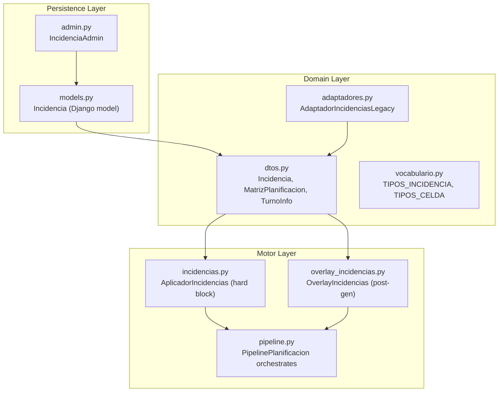
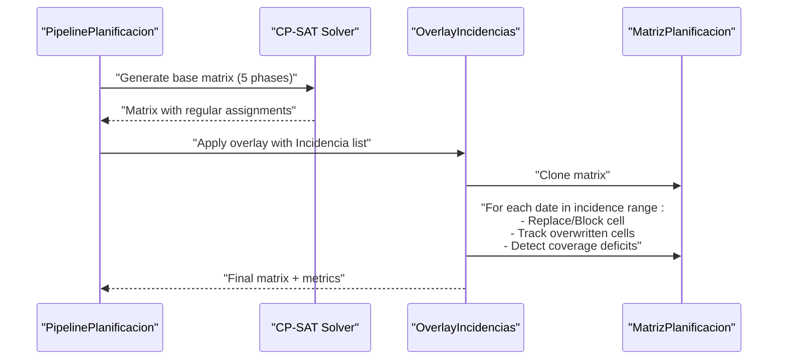
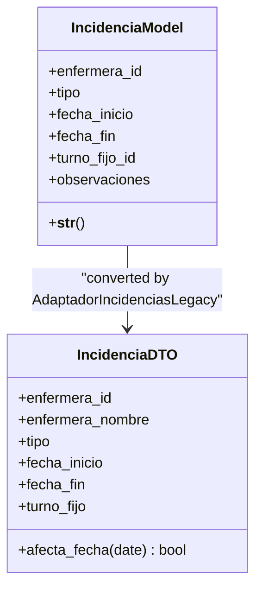
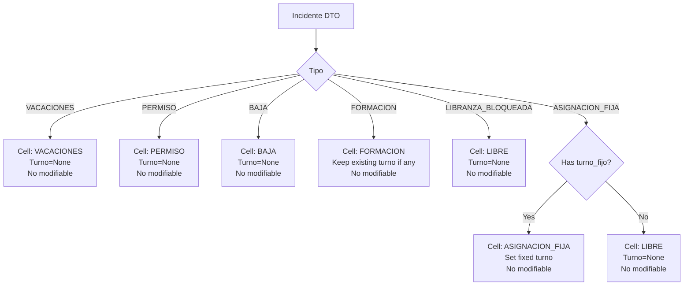
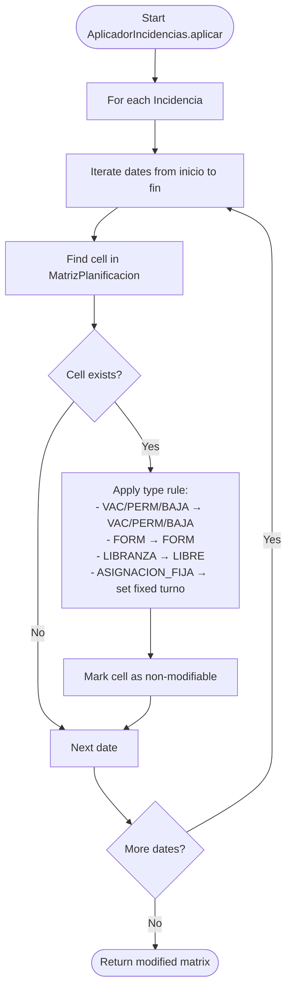
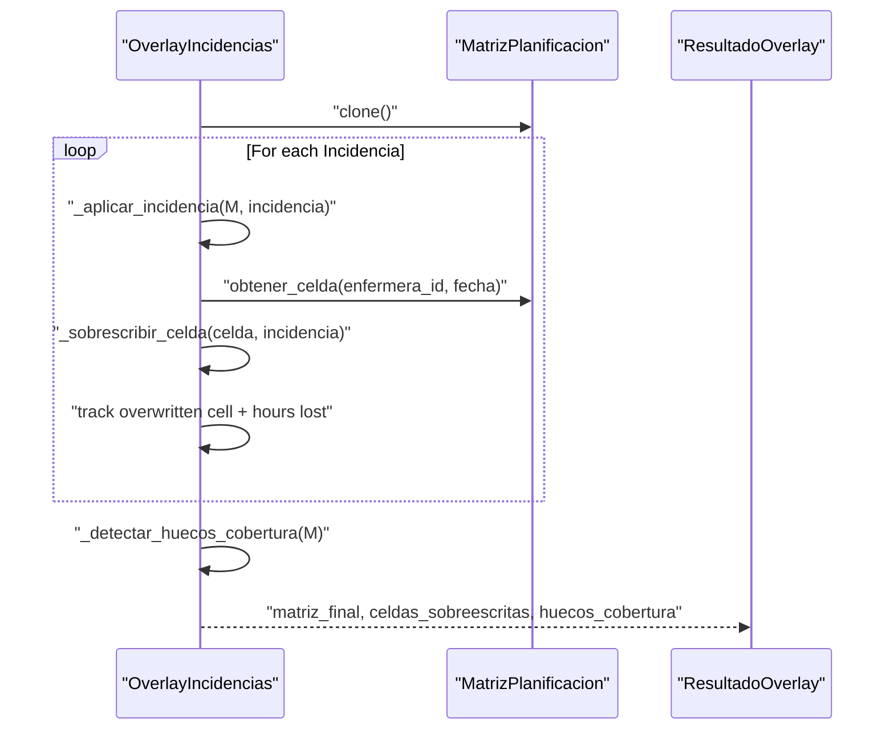
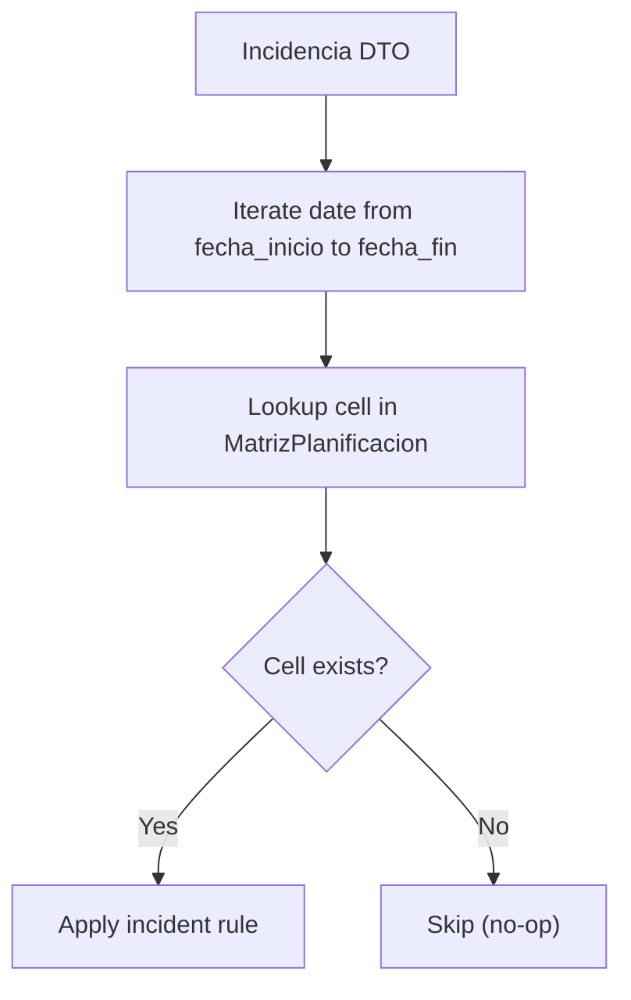
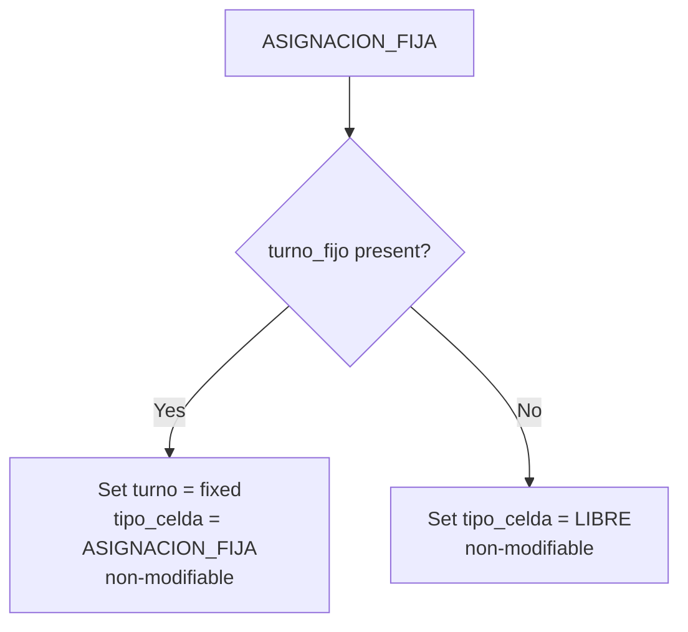
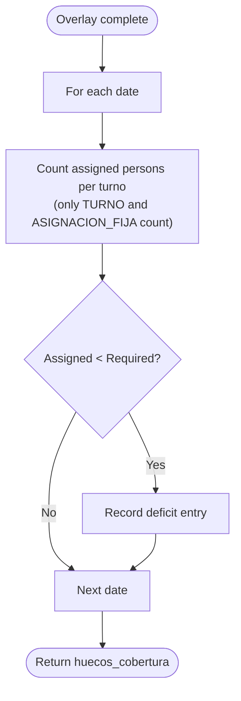
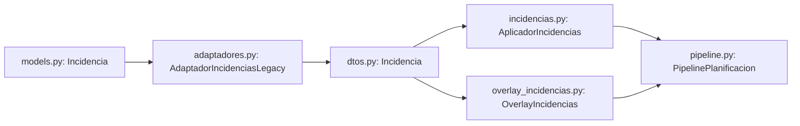

# Incident Management Model

<cite>
**Referenced Files in This Document**
- [models.py](file://turnos/models.py)
- [dtos.py](file://turnos/dominio/dtos.py)
- [vocabulario.py](file://turnos/dominio/vocabulario.py)
- [incidencias.py](file://turnos/motor/incidencias.py)
- [overlay_incidencias.py](file://turnos/motor/overlay_incidencias.py)
- [pipeline.py](file://turnos/motor/pipeline.py)
- [admin.py](file://turnos/admin.py)
- [adaptadores.py](file://turnos/dominio/adaptadores.py)
</cite>

## Table of Contents
1. [Introduction](#introduction)
2. [Project Structure](#project-structure)
3. [Core Components](#core-components)
4. [Architecture Overview](#architecture-overview)
5. [Detailed Component Analysis](#detailed-component-analysis)
6. [Dependency Analysis](#dependency-analysis)
7. [Performance Considerations](#performance-considerations)
8. [Troubleshooting Guide](#troubleshooting-guide)
9. [Conclusion](#conclusion)

## Introduction
This document explains the Incidencia model and its integration with the planning system. It covers the six incident types (vacaciones, permiso, baja médica, formación, libranza bloqueada, asignación fija), date range management, and how incidents override normal scheduling. It also documents fixed assignment scenarios, the post-generation overlay mechanism, and the impact on coverage calculations. Practical examples illustrate incident creation, conflict resolution with planned shifts, and incident-based schedule modifications.

## Project Structure
The incident management spans three layers:
- Domain model and DTOs define the canonical types and data structures.
- Motor (pipeline) applies hard constraints during generation and overlays soft overrides after generation.
- Django models persist incidents and expose them via admin and forms.

**Diagram sources**
- [dtos.py:169-181](file://turnos/dominio/dtos.py#L169-L181)
- [vocabulario.py:61-70](file://turnos/dominio/vocabulario.py#L61-L70)
- [incidencias.py:21-98](file://turnos/motor/incidencias.py#L21-L98)
- [overlay_incidencias.py:24-76](file://turnos/motor/overlay_incidencias.py#L24-L76)
- [pipeline.py:31-267](file://turnos/motor/pipeline.py#L31-L267)
- [models.py:749-784](file://turnos/models.py#L749-L784)
- [admin.py:386-415](file://turnos/admin.py#L386-L415)
- [adaptadores.py:149-203](file://turnos/dominio/adaptadores.py#L149-L203)

**Section sources**
- [models.py:749-784](file://turnos/models.py#L749-L784)
- [dtos.py:169-181](file://turnos/dominio/dtos.py#L169-L181)
- [vocabulario.py:61-70](file://turnos/dominio/vocabulario.py#L61-L70)
- [incidencias.py:21-98](file://turnos/motor/incidencias.py#L21-L98)
- [overlay_incidencias.py:24-76](file://turnos/motor/overlay_incidencias.py#L24-L76)
- [pipeline.py:31-267](file://turnos/motor/pipeline.py#L31-L267)
- [admin.py:386-415](file://turnos/admin.py#L386-L415)
- [adaptadores.py:149-203](file://turnos/dominio/adaptadores.py#L149-L203)

## Core Components
- Incidencia Django model: stores event metadata, links to a nurse, and optional fixed shift.
- DTO Incidencia: canonical domain representation used across the pipeline.
- AplicadorIncidencias: hard-blocks cells during generation (phase 2).
- OverlayIncidencias: post-generation deterministic overlay (phase 6) that replaces or blocks turns and detects coverage deficits.
- PipelinePlanificacion: orchestrates the five core phases; overlay is applied after solver completion.
- Vocabulary: canonical definitions for incident types and cell types.

Key responsibilities:
- Date range management: inclusive start and end dates per incident.
- Override behavior: hard block vs. soft overlay depending on phase.
- Fixed assignment: optional fixed shift for ASIGNACION_FIJA.
- Coverage impact: overlay detects deficits against configured minimum coverage.

**Section sources**
- [models.py:749-784](file://turnos/models.py#L749-L784)
- [dtos.py:169-181](file://turnos/dominio/dtos.py#L169-L181)
- [incidencias.py:21-98](file://turnos/motor/incidencias.py#L21-L98)
- [overlay_incidencias.py:24-76](file://turnos/motor/overlay_incidencias.py#L24-L76)
- [pipeline.py:31-267](file://turnos/motor/pipeline.py#L31-L267)
- [vocabulario.py:61-70](file://turnos/dominio/vocabulario.py#L61-L70)

## Architecture Overview
The pipeline separates hard constraints (during generation) from soft overrides (after generation). Incidents are not part of automatic generation; they are applied as a post-processing overlay.

**Diagram sources**
- [pipeline.py:92-234](file://turnos/motor/pipeline.py#L92-L234)
- [overlay_incidencias.py:45-75](file://turnos/motor/overlay_incidencias.py#L45-L75)

**Section sources**
- [pipeline.py:31-267](file://turnos/motor/pipeline.py#L31-L267)
- [overlay_incidencias.py:24-76](file://turnos/motor/overlay_incidencias.py#L24-L76)

## Detailed Component Analysis

### Incidencia Django Model
- Fields:
  - nurse relation, type choice, inclusive date range, optional fixed shift, free-text observations.
  - Ordered by start date for chronological processing.
- Behavior:
  - String representation includes nurse name, type, and date range.
  - Admin exposes duration in days and whether a fixed shift is set.

**Diagram sources**
- [models.py:749-784](file://turnos/models.py#L749-L784)
- [dtos.py:169-181](file://turnos/dominio/dtos.py#L169-L181)
- [adaptadores.py:149-203](file://turnos/dominio/adaptadores.py#L149-L203)

**Section sources**
- [models.py:749-784](file://turnos/models.py#L749-L784)
- [admin.py:386-415](file://turnos/admin.py#L386-L415)
- [adaptadores.py:149-203](file://turnos/dominio/adaptadores.py#L149-L203)

### Incident Types and Cell Types
- Canonical incident types: VACACIONES, PERMISO, BAJA, FORMACION, LIBRANZA_BLOQUEADA, ASIGNACION_FIJA.
- Canonical cell types: TURNO, LIBRE, VACACIONES, PERMISO, BAJA, FORMACION, ASIGNACION_FIJA.
- These definitions ensure consistent behavior across legacy conversions and overlay logic.

**Diagram sources**
- [dtos.py:33-41](file://turnos/dominio/dtos.py#L33-L41)
- [dtos.py:22-31](file://turnos/dominio/dtos.py#L22-L31)
- [overlay_incidencias.py:109-151](file://turnos/motor/overlay_incidencias.py#L109-L151)

**Section sources**
- [vocabulario.py:61-70](file://turnos/dominio/vocabulario.py#L61-L70)
- [dtos.py:33-41](file://turnos/dominio/dtos.py#L33-L41)
- [dtos.py:22-31](file://turnos/dominio/dtos.py#L22-L31)
- [overlay_incidencias.py:109-151](file://turnos/motor/overlay_incidencias.py#L109-L151)

### Hard Block During Generation (AplicadorIncidencias)
- Purpose: mark affected cells as non-modifiable and set cell type during generation (phase 2).
- Behavior:
  - Iterates over the date range for each incident.
  - Finds matching cell in the base matrix and applies type-specific rules.
  - Sets observaciones for traceability.

**Diagram sources**
- [incidencias.py:37-98](file://turnos/motor/incidencias.py#L37-L98)

**Section sources**
- [incidencias.py:21-98](file://turnos/motor/incidencias.py#L21-L98)

### Post-Generation Overlay (OverlayIncidencias)
- Purpose: apply deterministic overlay after solver completion (phase 6).
- Behavior:
  - Clones the matrix to avoid mutating the original.
  - For each incident date, overwrites or blocks the cell and records overwritten cells.
  - Computes hours lost per overwrite and detects coverage deficits compared to configured minimums.

**Diagram sources**
- [overlay_incidencias.py:45-75](file://turnos/motor/overlay_incidencias.py#L45-L75)
- [overlay_incidencias.py:77-94](file://turnos/motor/overlay_incidencias.py#L77-L94)
- [overlay_incidencias.py:96-164](file://turnos/motor/overlay_incidencias.py#L96-L164)
- [overlay_incidencias.py:166-205](file://turnos/motor/overlay_incidencias.py#L166-L205)

**Section sources**
- [overlay_incidencias.py:24-76](file://turnos/motor/overlay_incidencias.py#L24-L76)
- [overlay_incidencias.py:166-205](file://turnos/motor/overlay_incidencias.py#L166-L205)

### Date Range Management
- Both the Django model and the DTO store inclusive date ranges.
- The pipeline and overlay iterate from start to end date, applying the incident to each date in the range.
- Legacy adapters normalize old keys to canonical DTO types.

**Diagram sources**
- [dtos.py:179-181](file://turnos/dominio/dtos.py#L179-L181)
- [overlay_incidencias.py:83-94](file://turnos/motor/overlay_incidencias.py#L83-L94)
- [adaptadores.py:178-183](file://turnos/dominio/adaptadores.py#L178-L183)

**Section sources**
- [dtos.py:179-181](file://turnos/dominio/dtos.py#L179-L181)
- [overlay_incidencias.py:83-94](file://turnos/motor/overlay_incidencias.py#L83-L94)
- [adaptadores.py:178-183](file://turnos/dominio/adaptadores.py#L178-L183)

### Fixed Assignment Scenarios (ASIGNACION_FIJA)
- If a fixed shift is provided, the cell becomes ASIGNACION_FIJA and is non-modifiable.
- If no fixed shift is provided, the cell becomes LIBRE (blocked).
- Overlay preserves the intent: either a fixed shift is enforced or the day is blocked.

**Diagram sources**
- [overlay_incidencias.py:139-151](file://turnos/motor/overlay_incidencias.py#L139-L151)
- [incidencias.py:85-91](file://turnos/motor/incidencias.py#L85-L91)

**Section sources**
- [overlay_incidencias.py:139-151](file://turnos/motor/overlay_incidencias.py#L139-L151)
- [incidencias.py:85-91](file://turnos/motor/incidencias.py#L85-L91)

### Impact on Coverage Calculations
- Overlay detects coverage deficits by counting assigned persons per turno in each date and comparing to configured minimums.
- Deficit entries include date, turno_id, deficit, assigned, and required counts.

**Diagram sources**
- [overlay_incidencias.py:166-205](file://turnos/motor/overlay_incidencias.py#L166-L205)

**Section sources**
- [overlay_incidencias.py:166-205](file://turnos/motor/overlay_incidencias.py#L166-L205)

### Examples

#### Example: Creating an Incident
- Use the Django admin to create an Incidencia with:
  - Nurse, type, inclusive start and end dates.
  - Optional fixed shift for ASIGNACION_FIJA.
  - Observations for auditability.

Admin UI highlights:
- Duration in days computed automatically.
- Toggle for fixed shift presence.

**Section sources**
- [admin.py:386-415](file://turnos/admin.py#L386-L415)
- [models.py:749-784](file://turnos/models.py#L749-L784)

#### Example: Conflict Resolution with Planned Shifts
- If a planned shift conflicts with an incident (e.g., VACACIONES), the overlay replaces the planned shift with a VACACIONES cell and marks it non-modifiable.
- The solver’s prior decisions are preserved; overlay only affects cells that existed before.

**Section sources**
- [overlay_incidencias.py:109-114](file://turnos/motor/overlay_incidencias.py#L109-L114)
- [pipeline.py:92-102](file://turnos/motor/pipeline.py#L92-L102)

#### Example: Incident-Based Schedule Modification
- For FORMACION, if the nurse was scheduled for a shift, the overlay keeps the existing turno (they may be training while working).
- For LIBRANZA_BLOQUEADA, the overlay sets the cell to LIBRE and non-modifiable.
- For ASIGNACION_FIJA without a fixed shift, the overlay sets LIBRE; with a fixed shift, it sets ASIGNACION_FIJA.

**Section sources**
- [overlay_incidencias.py:127-131](file://turnos/motor/overlay_incidencias.py#L127-L131)
- [overlay_incidencias.py:133-151](file://turnos/motor/overlay_incidencias.py#L133-L151)

## Dependency Analysis
- The Django model Incidencia is converted to the DTO Incidencia for use in the pipeline.
- AplicadorIncidencias and OverlayIncidencias both depend on the DTO definitions for types and matrices.
- Pipeline orchestration does not include incidents in the solver; overlay is the separate post-generation step.

**Diagram sources**
- [models.py:749-784](file://turnos/models.py#L749-L784)
- [adaptadores.py:149-203](file://turnos/dominio/adaptadores.py#L149-L203)
- [dtos.py:169-181](file://turnos/dominio/dtos.py#L169-L181)
- [incidencias.py:21-98](file://turnos/motor/incidencias.py#L21-L98)
- [overlay_incidencias.py:24-76](file://turnos/motor/overlay_incidencias.py#L24-L76)
- [pipeline.py:31-267](file://turnos/motor/pipeline.py#L31-L267)

**Section sources**
- [models.py:749-784](file://turnos/models.py#L749-L784)
- [adaptadores.py:149-203](file://turnos/dominio/adaptadores.py#L149-L203)
- [dtos.py:169-181](file://turnos/dominio/dtos.py#L169-L181)
- [incidencias.py:21-98](file://turnos/motor/incidencias.py#L21-L98)
- [overlay_incidencias.py:24-76](file://turnos/motor/overlay_incidencias.py#L24-L76)
- [pipeline.py:31-267](file://turnos/motor/pipeline.py#L31-L267)

## Performance Considerations
- Overlay clones the matrix; memory usage scales with number of nurses × number of days.
- Overwrite detection and coverage deficit scanning are linear in the number of cells processed.
- Prefer limiting incident ranges to necessary periods to reduce iteration overhead.

## Troubleshooting Guide
- Incidents not applied:
  - Verify the incident date range overlaps with the planning period.
  - Confirm the nurse exists in the current planilla.
- Unexpected LIBRE cells:
  - Check if ASIGNACION_FIJA lacks a fixed shift; absence implies LIBRE.
- Coverage deficits:
  - Review configured minimum coverage per turno and compare to actual assignments after overlay.
- Audit trail:
  - Use observaciones and overwritten cells logs to track changes.

**Section sources**
- [overlay_incidencias.py:166-205](file://turnos/motor/overlay_incidencias.py#L166-L205)
- [overlay_incidencias.py:156-164](file://turnos/motor/overlay_incidencias.py#L156-L164)

## Conclusion
The Incidencia model integrates tightly with the planning pipeline by separating hard constraints during generation from soft overlays after generation. Six canonical incident types are supported, with clear override semantics and coverage impact detection. Admin and DTO layers ensure consistent behavior across legacy formats and runtime operations.