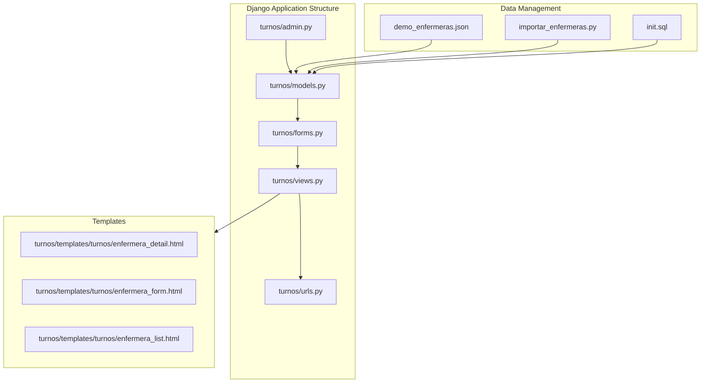
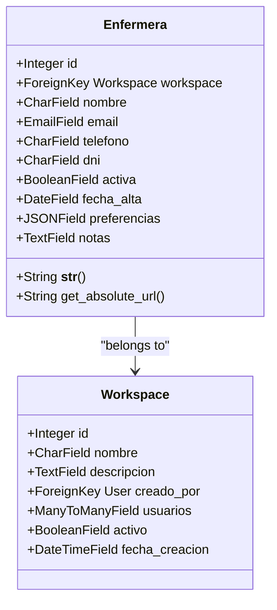
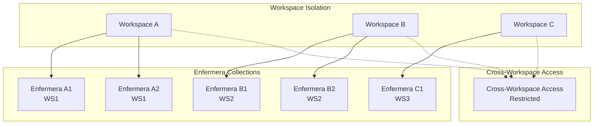
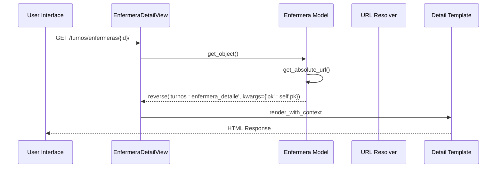
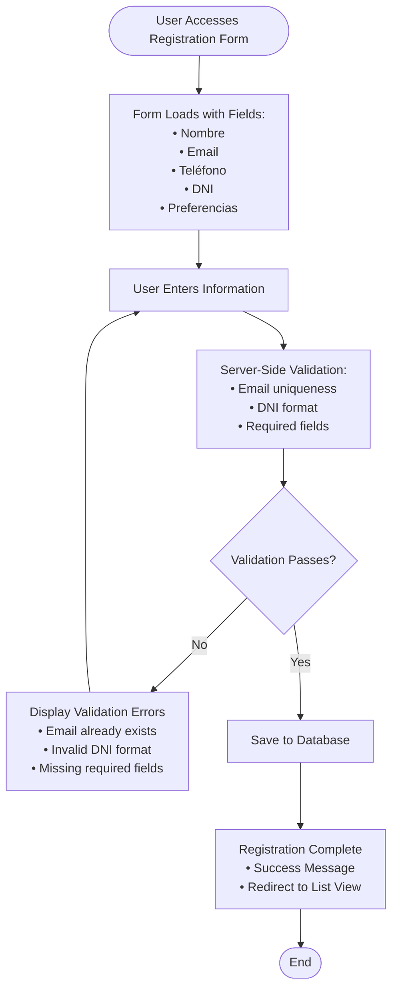
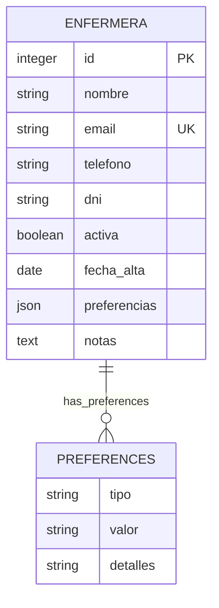
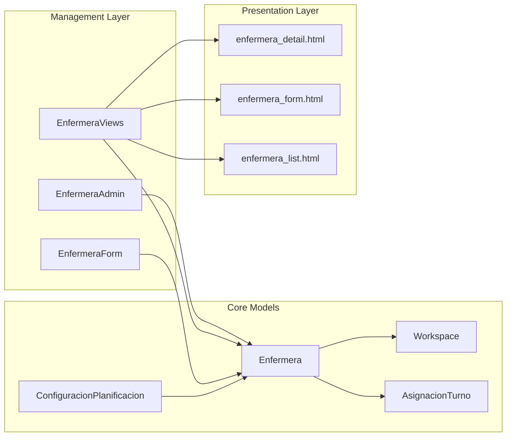

# Nurse Profile Model

<cite>
**Referenced Files in This Document**
- [models.py](file://turnos/models.py)
- [forms.py](file://turnos/forms.py)
- [views.py](file://turnos/views.py)
- [urls.py](file://turnos/urls.py)
- [admin.py](file://turnos/admin.py)
- [enfermera_detail.html](file://turnos/templates/turnos/enfermera_detail.html)
- [enfermera_form.html](file://turnos/templates/turnos/enfermera_form.html)
- [enfermera_list.html](file://turnos/templates/turnos/enfermera_list.html)
- [demo_enfermeras.json](file://turnos/fixtures/demo_enfermeras.json)
- [importar_enfermeras.py](file://turnos/management/commands/importar_enfermeras.py)
- [init.sql](file://docker/postgres/init.sql)
</cite>

## Table of Contents
1. [Introduction](#introduction)
2. [Project Structure](#project-structure)
3. [Core Components](#core-components)
4. [Architecture Overview](#architecture-overview)
5. [Detailed Component Analysis](#detailed-component-analysis)
6. [Dependency Analysis](#dependency-analysis)
7. [Performance Considerations](#performance-considerations)
8. [Troubleshooting Guide](#troubleshooting-guide)
9. [Conclusion](#conclusion)

## Introduction
This document provides comprehensive documentation for the Enfermera (Nurse) model that represents nurse profiles in the turnos system. The Enfermera model serves as the central entity for managing nurse information, employment status, preferences, and multi-tenancy isolation through Workspace relationships. This documentation covers the complete lifecycle of nurse profiles including registration, validation, URL generation, querying patterns, and integration with the broader scheduling system.

## Project Structure
The Enfermera model is part of the turnos Django application and integrates with several key components:



**Diagram sources**
- [models.py:30-58](file://turnos/models.py#L30-L58)
- [forms.py:14-73](file://turnos/forms.py#L14-L73)
- [views.py:814-968](file://turnos/views.py#L814-L968)

**Section sources**
- [models.py:1-825](file://turnos/models.py#L1-L825)
- [urls.py:1-108](file://turnos/urls.py#L1-L108)

## Core Components

### Enfermera Model Definition
The Enfermera model serves as the primary representation of nurse profiles with comprehensive field definitions and validation rules:



**Diagram sources**
- [models.py:30-58](file://turnos/models.py#L30-L58)
- [models.py:12-28](file://turnos/models.py#L12-L28)

### Key Field Specifications
The Enfermera model includes the following essential fields:

| Field | Type | Constraints | Description |
|-------|------|-------------|-------------|
| `nombre` | CharField | max_length=200 | Full name of the nurse |
| `email` | EmailField | unique=True | Contact email address |
| `telefono` | CharField | max_length=20, blank=True | Phone number |
| `dni` | CharField | max_length=20, unique=True, null=True, blank=True | Spanish national identity number |
| `activa` | BooleanField | default=True | Employment status flag |
| `fecha_alta` | DateField | auto_now_add=True | Registration date |
| `preferencias` | JSONField | default=dict, blank=True | Flexible preference storage |

**Section sources**
- [models.py:30-58](file://turnos/models.py#L30-L58)

## Architecture Overview

### Multi-Tenant Isolation Architecture
The system implements multi-tenancy through Workspace relationships, ensuring data isolation between different organizational units:



**Diagram sources**
- [models.py:32-38](file://turnos/models.py#L32-L38)
- [models.py:12-28](file://turnos/models.py#L12-L28)

### URL Generation and Navigation
The system generates dynamic URLs for nurse detail pages using Django's reverse URL resolution:



**Diagram sources**
- [models.py:56-57](file://turnos/models.py#L56-L57)
- [urls.py:55](file://turnos/urls.py#L55)
- [views.py:840-875](file://turnos/views.py#L840-L875)

**Section sources**
- [models.py:56-57](file://turnos/models.py#L56-L57)
- [urls.py:52-59](file://turnos/urls.py#L52-L59)

## Detailed Component Analysis

### Registration Process Workflow
The nurse registration process follows a structured workflow from form submission to database persistence:



**Diagram sources**
- [forms.py:14-73](file://turnos/forms.py#L14-L73)
- [views.py:878-907](file://turnos/views.py#L878-L907)

### Validation Rules Implementation
The system implements comprehensive validation rules at both form and model levels:

#### Email Validation
- Unique constraint enforcement
- Django's built-in email validation
- Cross-instance validation during updates

#### DNI Validation (Spanish Format)
- Length validation (9 characters)
- Format validation (8 digits + 1 letter)
- Case normalization and whitespace removal

#### Employment Status Tracking
- Boolean field with default True
- Filterable in admin interface
- Impact on scheduling eligibility

**Section sources**
- [forms.py:52-72](file://turnos/forms.py#L52-L72)
- [models.py:40-46](file://turnos/models.py#L40-L46)

### Preference Management Through JSONField
The `preferencias` field provides flexible storage for nurse preferences:



**Diagram sources**
- [models.py:45](file://turnos/models.py#L45)

The JSONField allows for storing various preference types including:
- Preferred shift patterns
- Available days off
- Special accommodations
- Training preferences

**Section sources**
- [models.py:45](file://turnos/models.py#L45)

### Staff Management Query Patterns
The system provides multiple query patterns for staff management scenarios:

#### Basic Filtering and Sorting
```python
# Active nurses only
active_nurses = Enfermera.objects.filter(activa=True)

# Search by name or email
search_results = Enfermera.objects.filter(
    Q(nombre__icontains=search_term) | 
    Q(email__icontains=search_term)
)

# Order by name
ordered_nurses = Enfermera.objects.order_by('nombre')
```

#### Advanced Filtering Scenarios
```python
# Nurses with specific availability
available_nurses = Enfermera.objects.filter(
    activa=True,
    preferencias__icontains='disponible'
)

# Recent hires
recent_hires = Enfermera.objects.filter(
    fecha_alta__gte=timezone.now().date() - timedelta(days=30)
)
```

**Section sources**
- [views.py:823-837](file://turnos/views.py#L823-L837)
- [admin.py:278-288](file://turnos/admin.py#L278-L288)

### URL Generation and Navigation
The system generates SEO-friendly URLs for nurse profiles:

#### URL Pattern Structure
- Pattern: `/turnos/enfermeras/{id}/`
- Named URL: `turnos:enfermera_detalle`
- Dynamic generation using `get_absolute_url()`

#### Template Integration
```html
<a href="">
    {{ enfermera.nombre }}
</a>
```

**Section sources**
- [models.py:56-57](file://turnos/models.py#L56-L57)
- [urls.py:55](file://turnos/urls.py#L55)
- [enfermera_list.html:85](file://turnos/templates/turnos/enfermera_list.html#L85)

## Dependency Analysis

### Component Relationships
The Enfermera model integrates with multiple system components:



**Diagram sources**
- [models.py:30-58](file://turnos/models.py#L30-L58)
- [models.py:568-623](file://turnos/models.py#L568-L623)
- [models.py:332-456](file://turnos/models.py#L332-L456)

### External Dependencies
- Django ORM for database operations
- Django forms framework for validation
- PostgreSQL JSONField for flexible data storage
- Django admin interface for management

**Section sources**
- [models.py:1-8](file://turnos/models.py#L1-L8)

## Performance Considerations

### Database Optimization
- Indexes on frequently queried fields (`nombre`, `email`, `dni`)
- JSONField optimization for preference queries
- Workspace foreign key indexing for multi-tenancy filtering

### Query Optimization Strategies
- Select-related for related model joins
- Prefetch-related for reverse relationships
- Pagination for large datasets
- Filter early in query chains

### Caching Considerations
- Template-level caching for frequently accessed lists
- Database-level query result caching
- Session-based user preference caching

## Troubleshooting Guide

### Common Validation Issues
#### Email Already Exists
**Symptom**: Form validation error when creating/updating nurse
**Cause**: Email violates unique constraint
**Solution**: Use unique email addresses for each nurse profile

#### Invalid DNI Format
**Symptom**: Validation error for DNI field
**Cause**: Incorrect format (length or character type)
**Solution**: Ensure 8 digits followed by 1 letter (e.g., "12345678A")

#### Missing Required Fields
**Symptom**: Form validation errors
**Cause**: Empty required fields (nombre, email)
**Solution**: Ensure all required fields are filled

### Multi-Tenant Isolation Issues
#### Data Contamination Between Workspaces
**Symptom**: Nurses appearing in wrong workspace
**Cause**: Missing workspace filtering
**Solution**: Always filter by current workspace context

#### Cross-Workspace Access Violations
**Symptom**: Permission errors accessing other workspace data
**Cause**: Insufficient workspace permissions
**Solution**: Verify user membership in target workspace

**Section sources**
- [forms.py:52-72](file://turnos/forms.py#L52-L72)
- [admin.py:278-288](file://turnos/admin.py#L278-L288)

## Conclusion
The Enfermera model provides a robust foundation for nurse profile management in the turnos system. Its comprehensive field definitions, multi-tenancy support, and flexible preference storage enable efficient staff management while maintaining data integrity and isolation. The integrated validation, URL generation, and query patterns ensure a smooth user experience for both administrators and end users.

The model's design supports future enhancements including advanced preference management, integration with external systems, and expanded reporting capabilities. The clear separation of concerns between models, forms, views, and templates ensures maintainability and extensibility of the nurse management functionality.