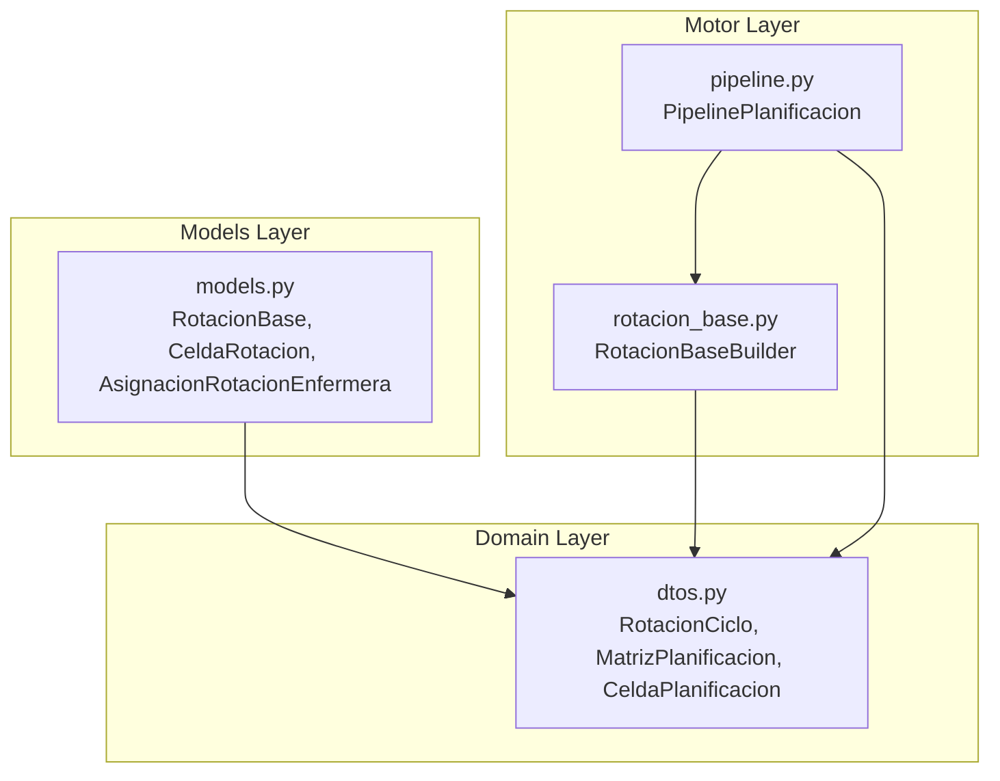
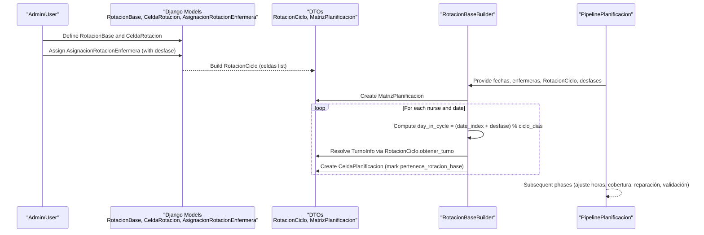
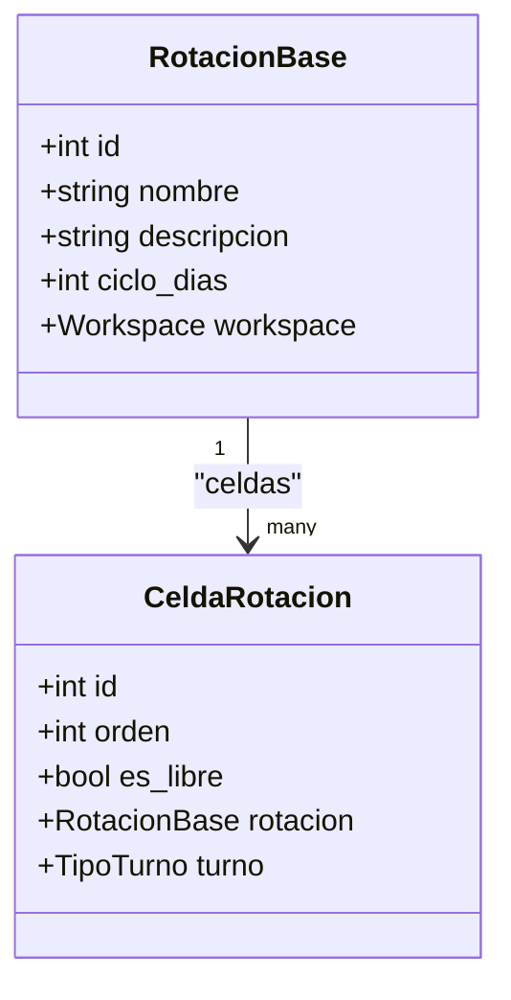
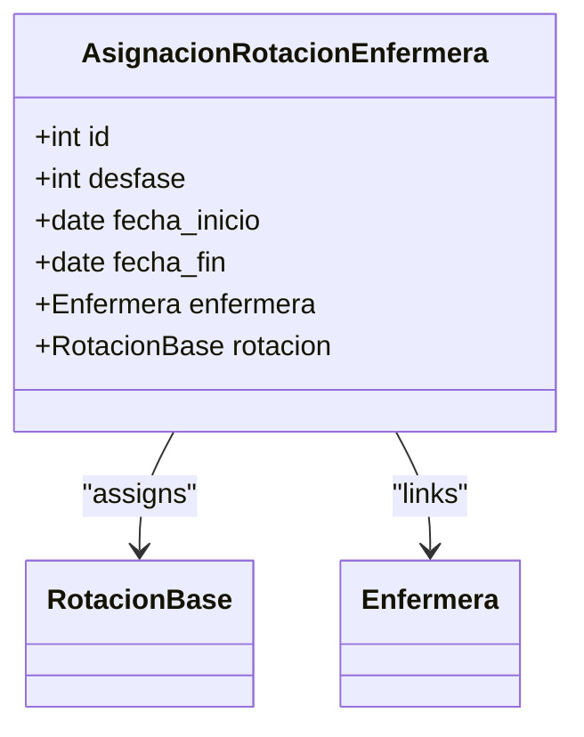
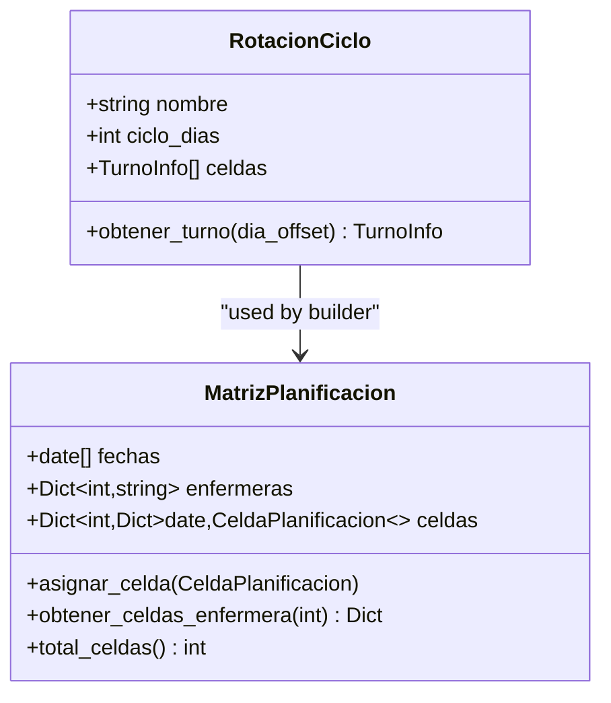
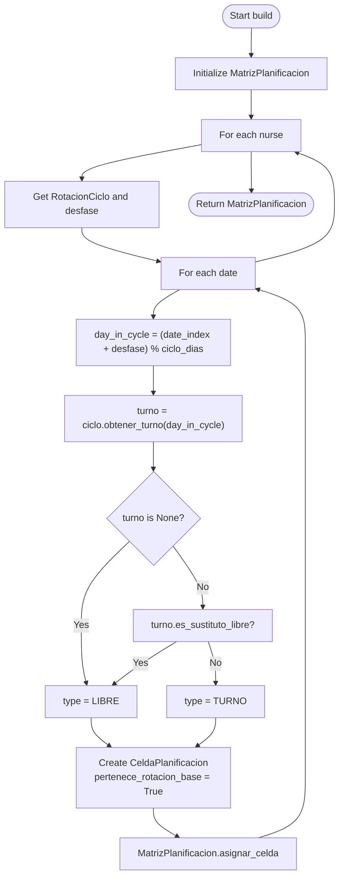
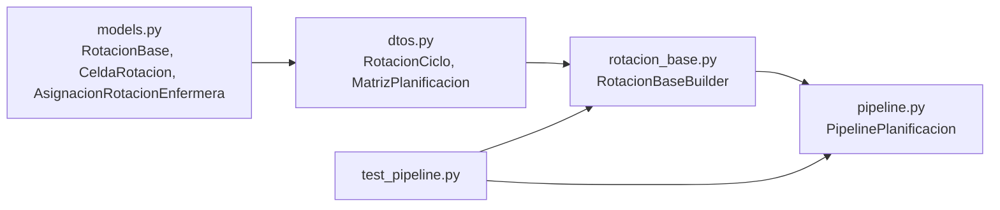

# Rotation System Models

<cite>
**Referenced Files in This Document**
- [rotacion_base.py](file://turnos/motor/rotacion_base.py)
- [models.py](file://turnos/models.py)
- [dtos.py](file://turnos/dominio/dtos.py)
- [pipeline.py](file://turnos/motor/pipeline.py)
- [test_pipeline.py](file://turnos/tests/test_motor/test_pipeline.py)
- [tasks.py](file://turnos/tasks.py)
</cite>

## Table of Contents
1. [Introduction](#introduction)
2. [Project Structure](#project-structure)
3. [Core Components](#core-components)
4. [Architecture Overview](#architecture-overview)
5. [Detailed Component Analysis](#detailed-component-analysis)
6. [Dependency Analysis](#dependency-analysis)
7. [Performance Considerations](#performance-considerations)
8. [Troubleshooting Guide](#troubleshooting-guide)
9. [Conclusion](#conclusion)

## Introduction
This document explains the rotation system models that define cyclic scheduling patterns for nurses. It covers:
- RotacionBase: explicit repeating rotation cycle definition
- CeldaRotacion: cells inside a rotation cycle
- AsignacionRotacionEnfermera: per-nurse assignment of a rotation with a day-phase offset
It also documents how the deterministic base rotation is constructed, how cycles repeat, how phase offsets are applied, and how rotation assignments override individual planning during later pipeline stages.

## Project Structure
The rotation system spans three layers:
- Domain DTOs: immutable data structures used internally by the planner
- Motor (pipeline): orchestration and deterministic construction of base rotation
- Models: persistent Django models for configuration and assignment

**Diagram sources**
- [dtos.py:184-238](file://turnos/dominio/dtos.py#L184-L238)
- [rotacion_base.py:21-94](file://turnos/motor/rotacion_base.py#L21-L94)
- [pipeline.py:31-267](file://turnos/motor/pipeline.py#L31-L267)
- [models.py:666-747](file://turnos/models.py#L666-L747)

**Section sources**
- [rotacion_base.py:1-94](file://turnos/motor/rotacion_base.py#L1-L94)
- [models.py:666-747](file://turnos/models.py#L666-L747)
- [dtos.py:184-238](file://turnos/dominio/dtos.py#L184-L238)
- [pipeline.py:31-267](file://turnos/motor/pipeline.py#L31-L267)

## Core Components
- RotacionBase: persistent model representing a repeating cycle (e.g., 8 days) and workspace scoping
- CeldaRotacion: ordered cells within a rotation cycle, each pointing to a specific turnotype or being free
- AsignacionRotacionEnfermera: assigns a specific rotation to a nurse with a day-phase offset (desfase)
- RotacionCiclo (DTO): runtime representation of a cycle used by the builder
- RotacionBaseBuilder: constructs the deterministic base matrix using cycles, dates, and per-nurse phase offsets
- MatrizPlanificacion/CeldaPlanificacion: internal matrix/cell structures used across the pipeline

Key behaviors:
- Cycle length defines periodicity; each day index maps to a specific turnotype or free day
- Phase offset rotates the starting position within the cycle for each nurse
- Free days are represented either by a null turnotype or by a dedicated “Libre” marker
- The builder marks cells as originating from the base rotation to support later adjustments

**Section sources**
- [models.py:666-747](file://turnos/models.py#L666-L747)
- [dtos.py:184-238](file://turnos/dominio/dtos.py#L184-L238)
- [rotacion_base.py:21-94](file://turnos/motor/rotacion_base.py#L21-L94)

## Architecture Overview
The rotation system integrates persistent models with a deterministic builder and a multi-stage pipeline.

**Diagram sources**
- [models.py:666-747](file://turnos/models.py#L666-L747)
- [dtos.py:184-238](file://turnos/dominio/dtos.py#L184-L238)
- [rotacion_base.py:41-94](file://turnos/motor/rotacion_base.py#L41-L94)
- [pipeline.py:92-234](file://turnos/motor/pipeline.py#L92-L234)

## Detailed Component Analysis

### RotacionBase and CeldaRotacion
RotacionBase defines the repeating pattern and workspace association. CeldaRotacion entries define the ordered sequence of turns and free days within the cycle. Together they form the canonical cycle used by the builder.

- Ordering: CeldaRotacion is ordered by position within the cycle
- Free days: either marked by a dedicated flag or by absence of a turnotype
- Persistence: cycles are persisted and reused across runs

**Diagram sources**
- [models.py:666-720](file://turnos/models.py#L666-L720)

**Section sources**
- [models.py:666-720](file://turnos/models.py#L666-L720)

### AsignacionRotacionEnfermera
This model ties a nurse to a specific rotation and applies a phase offset (days) to shift her starting position within the cycle.

- Desfase: positive/negative shifts the cycle start for that nurse
- Date bounds: optional period during which the assignment is active
- Multiple assignments can overlap periods; higher-priority logic applies during pipeline execution

**Diagram sources**
- [models.py:722-747](file://turnos/models.py#L722-L747)

**Section sources**
- [models.py:722-747](file://turnos/models.py#L722-L747)

### RotacionCiclo (DTO) and MatrizPlanificacion
RotacionCiclo encapsulates the runtime cycle used by the builder. MatrizPlanificacion holds the resulting matrix of nurse-by-date cells.

- Indexing: modulo operation maps any day index to a cycle position
- Matrix population: builder iterates dates and nurses to fill cells

**Diagram sources**
- [dtos.py:184-238](file://turnos/dominio/dtos.py#L184-L238)

**Section sources**
- [dtos.py:184-238](file://turnos/dominio/dtos.py#L184-L238)

### RotacionBaseBuilder: Base Rotation Construction
The builder creates a deterministic base matrix using:
- Fechas: list of dates for the planning horizon
- Enfermeras: mapping of nurse IDs to names
- Asignaciones: mapping of nurse ID to RotacionCiclo
- Desfases: mapping of nurse ID to phase offset (days)

- Modulo indexing ensures cyclic repetition
- Free days are normalized to LIBRE type
- All generated cells are flagged as originating from the base rotation

**Diagram sources**
- [rotacion_base.py:41-94](file://turnos/motor/rotacion_base.py#L41-L94)
- [dtos.py:61-132](file://turnos/dominio/dtos.py#L61-L132)

**Section sources**
- [rotacion_base.py:21-94](file://turnos/motor/rotacion_base.py#L21-L94)
- [dtos.py:61-132](file://turnos/dominio/dtos.py#L61-L132)

### Relationship Between Rotation Cycles and Scheduling
- Cycle defines repeating pattern: each cycle day maps to a specific turnotype or free day
- Scheduling horizon: builder repeats the cycle across the requested date range
- Phase offsets: nurses start at different positions within the cycle, creating staggered schedules
- Free days: represented consistently as LIBRE cells

Evidence from tests:
- A fixed 8-day cycle (2M-2T-2N-2L) produces predictable patterns across 10 days
- Different desfases rotate the pattern for each nurse while keeping reproducibility

**Section sources**
- [test_pipeline.py:47-81](file://turnos/tests/test_motor/test_pipeline.py#L47-L81)
- [test_pipeline.py:102-127](file://turnos/tests/test_motor/test_pipeline.py#L102-L127)

### Phase Calculation Algorithm
The builder computes the effective day within the cycle for each nurse-date pair:
- day_in_cycle = (date_index + desfase) % ciclo_dias
- Uses RotacionCiclo.obtener_turno to resolve the TurnoInfo for that position
- Marks the cell as LIBRE if turno is None or if turno indicates a substitute-free

This algorithm guarantees:
- Deterministic, reproducible patterns
- Consistent cycle wrapping
- Clear free-day semantics

**Section sources**
- [rotacion_base.py:67-78](file://turnos/motor/rotacion_base.py#L67-L78)
- [dtos.py:190-193](file://turnos/dominio/dtos.py#L190-L193)

### How Rotation Assignments Override Individual Planning
- Base rotation: generated deterministically in Phase 1
- Later phases (adjust hours, coverage, repair, validate) may modify cells if constraints require
- The builder preserves a snapshot of the original base turn (via metadata) to track deviations
- Cells originating from base rotation are explicitly marked to enable downstream adjustments

Pipeline behavior:
- Phase 1: RotacionBaseBuilder generates MatrizPlanificacion with pertenece_rotacion_base=True
- Phase 2: Adjust hours may change some cells if targets require
- Phase 3: Coverage analysis detects conflicts
- Phase 4: Repair adjusts only blocked cells to satisfy hard constraints
- Phase 5: Validation checks overall feasibility

**Section sources**
- [rotacion_base.py:85-90](file://turnos/motor/rotacion_base.py#L85-L90)
- [pipeline.py:108-234](file://turnos/motor/pipeline.py#L108-L234)
- [dtos.py:61-132](file://turnos/dominio/dtos.py#L61-L132)

## Dependency Analysis
The builder depends on DTOs for cycle and matrix structures. The pipeline orchestrates builder and subsequent phases. Tests validate reproducibility and correct behavior.

**Diagram sources**
- [models.py:666-747](file://turnos/models.py#L666-L747)
- [dtos.py:184-238](file://turnos/dominio/dtos.py#L184-L238)
- [rotacion_base.py:21-94](file://turnos/motor/rotacion_base.py#L21-L94)
- [pipeline.py:31-267](file://turnos/motor/pipeline.py#L31-L267)
- [test_pipeline.py:84-142](file://turnos/tests/test_motor/test_pipeline.py#L84-L142)

**Section sources**
- [rotacion_base.py:21-94](file://turnos/motor/rotacion_base.py#L21-L94)
- [pipeline.py:31-267](file://turnos/motor/pipeline.py#L31-L267)
- [test_pipeline.py:84-142](file://turnos/tests/test_motor/test_pipeline.py#L84-L142)

## Performance Considerations
- Complexity: O(N_enfermeras × N_días) for base construction
- Memory: MatrizPlanificacion stores one cell per nurse-date combination
- Optimization tips:
  - Keep cycles short and balanced to reduce conflicts
  - Use desfases to distribute workload evenly across nurses
  - Prefer free-day blocks to simplify coverage analysis

[No sources needed since this section provides general guidance]

## Troubleshooting Guide

Common issues and resolutions:
- No rotation configured for a nurse
  - Symptom: Warning logged and nurse skipped in base matrix
  - Resolution: Assign a rotation via AsignacionRotacionEnfermera
- Conflicts after coverage analysis
  - Symptom: Pipeline proceeds to repair; some cells may change
  - Resolution: Adjust rotation cycle, desfases, or hard constraints
- Unexpected LIBRE cells
  - Symptom: Some days appear free
  - Cause: Turnotype is None or marked as substitute-free
  - Resolution: Verify CeldaRotacion entries and turnotype definitions
- Reproducibility concerns
  - Symptom: Different results across runs
  - Resolution: Ensure identical inputs (dates, assignments, desfases) and deterministic orderings

Validation and tests:
- Reproducibility: Same inputs yield identical matrices
- Base cells: All generated cells are marked as belonging to base rotation
- Pipeline behavior: Does not automatically apply incidences; only generates regular shifts

**Section sources**
- [rotacion_base.py:48-64](file://turnos/motor/rotacion_base.py#L48-L64)
- [test_pipeline.py:102-127](file://turnos/tests/test_motor/test_pipeline.py#L102-L127)
- [test_pipeline.py:128-142](file://turnos/tests/test_motor/test_pipeline.py#L128-L142)
- [pipeline.py:92-234](file://turnos/motor/pipeline.py#L92-L234)

## Conclusion
The rotation system combines persistent cycle definitions with a deterministic builder to produce reproducible, phase-offset schedules. The pipeline preserves base rotation metadata to enable targeted adjustments while maintaining hard-constraint satisfaction. Proper configuration of cycles, cells, and assignments ensures predictable outcomes and simplifies conflict resolution.