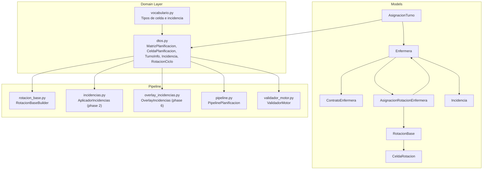
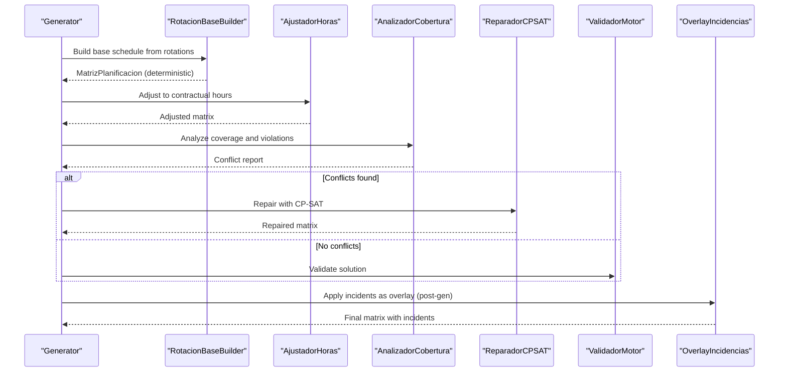
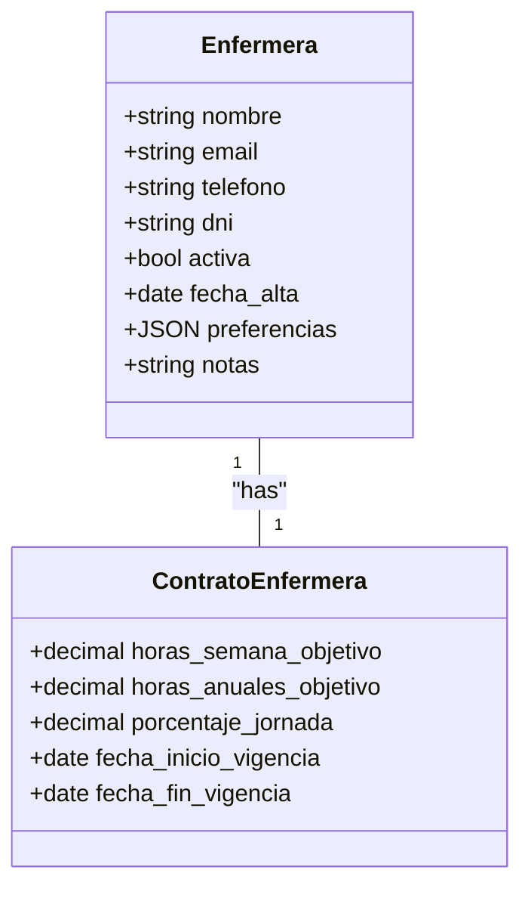
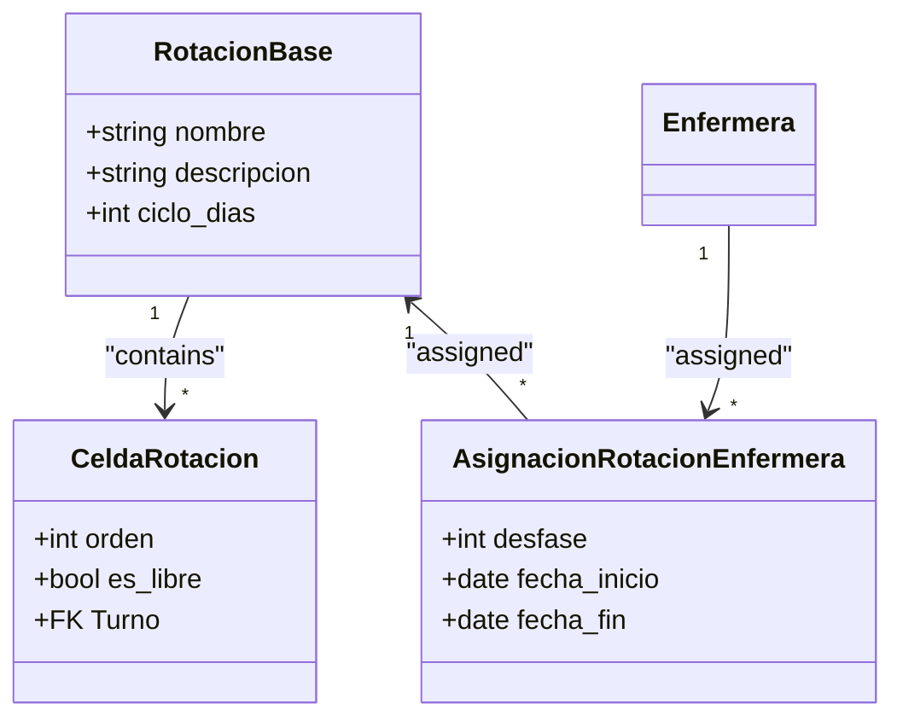
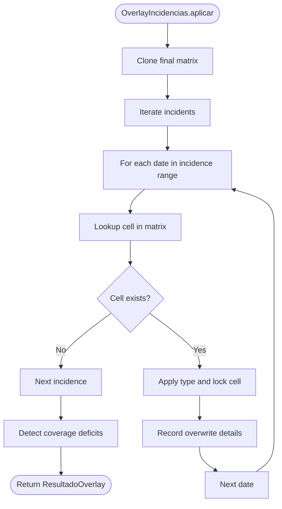
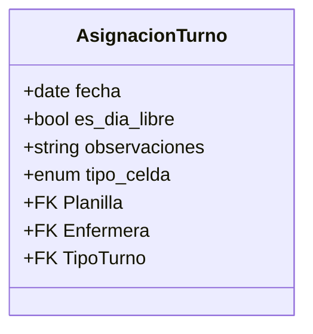
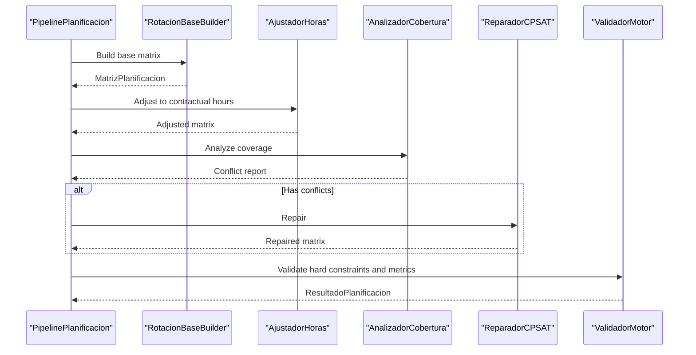
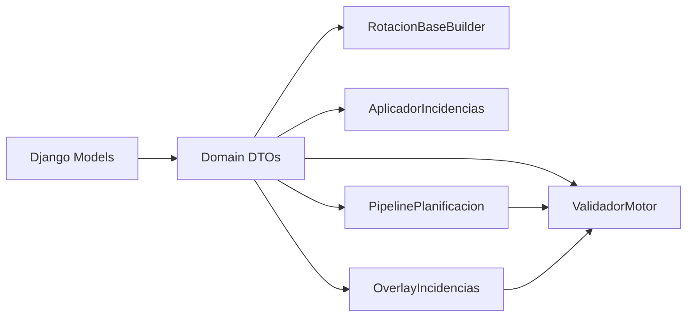

# Staff and Assignment Models

<cite>
**Referenced Files in This Document**
- [models.py](file://turnos/models.py)
- [0009_add_domain_models.py](file://turnos/migrations/0009_add_domain_models.py)
- [rotacion_base.py](file://turnos/motor/rotacion_base.py)
- [incidencias.py](file://turnos/motor/incidencias.py)
- [overlay_incidencias.py](file://turnos/motor/overlay_incidencias.py)
- [pipeline.py](file://turnos/motor/pipeline.py)
- [validador_motor.py](file://turnos/motor/validador_motor.py)
- [dtos.py](file://turnos/dominio/dtos.py)
- [vocabulario.py](file://turnos/dominio/vocabulario.py)
- [tasks.py](file://turnos/tasks.py)
- [simular_planificacion.py](file://turnos/management/commands/simular_planificacion.py)
- [test_pipeline.py](file://turnos/tests/test_motor/test_pipeline.py)
</cite>

## Table of Contents
1. [Introduction](#introduction)
2. [Project Structure](#project-structure)
3. [Core Components](#core-components)
4. [Architecture Overview](#architecture-overview)
5. [Detailed Component Analysis](#detailed-component-analysis)
6. [Dependency Analysis](#dependency-analysis)
7. [Performance Considerations](#performance-considerations)
8. [Troubleshooting Guide](#troubleshooting-guide)
9. [Conclusion](#conclusion)
10. [Appendices](#appendices)

## Introduction
This document explains the staff and assignment models that underpin the nursing scheduling system. It focuses on:
- Nurse profiles and contract definitions
- Rotation cycles and cell-based scheduling
- Individual assignments and incident overlays
- Validation rules, business constraints, and query patterns for staff management scenarios

It also documents the pipeline that generates deterministic base schedules, applies hard constraints, repairs conflicts with a constraint programming solver, and validates outcomes, followed by applying incidents as a post-processing overlay.

## Project Structure
The staff and assignment domain spans Django models, migration history, a domain layer with DTOs, and a pipeline orchestrating generation, adjustment, coverage analysis, repair, and validation.

**Diagram sources**
- [models.py:629-784](file://turnos/models.py#L629-L784)
- [dtos.py:43-274](file://turnos/dominio/dtos.py#L43-L274)
- [rotacion_base.py:21-94](file://turnos/motor/rotacion_base.py#L21-L94)
- [incidencias.py:21-98](file://turnos/motor/incidencias.py#L21-L98)
- [overlay_incidencias.py:24-205](file://turnos/motor/overlay_incidencias.py#L24-L205)
- [pipeline.py:31-267](file://turnos/motor/pipeline.py#L31-L267)
- [validador_motor.py:23-451](file://turnos/motor/validador_motor.py#L23-L451)
- [vocabulario.py:22-112](file://turnos/dominio/vocabulario.py#L22-L112)

**Section sources**
- [models.py:30-825](file://turnos/models.py#L30-L825)
- [0009_add_domain_models.py:13-122](file://turnos/migrations/0009_add_domain_models.py#L13-L122)

## Core Components
- Enfermera: Represents a nurse with profile attributes and lifecycle state.
- ContratoEnfermera: Defines contractual hours and workload regime per nurse.
- RotacionBase: Explicit repeating cycle of work days.
- CeldaRotacion: Cell inside a rotation cycle indicating a specific shift or a day off.
- AsignacionRotacionEnfermera: Assigns a rotation to a nurse with a day offset (desfase).
- Incidencia: Events modifying the schedule after generation (e.g., vacations, permissions, fixed assignments).
- AsignacionTurno: Final assignment of a shift or a typed cell (including free days) to a nurse on a given date.

These models integrate with the domain DTOs and pipeline to produce and validate schedules.

**Section sources**
- [models.py:629-784](file://turnos/models.py#L629-L784)
- [dtos.py:43-274](file://turnos/dominio/dtos.py#L43-L274)

## Architecture Overview
The system follows a five-phase deterministic-first pipeline plus an optional sixth-phase overlay for incidents:

**Diagram sources**
- [pipeline.py:92-246](file://turnos/motor/pipeline.py#L92-L246)
- [rotacion_base.py:41-94](file://turnos/motor/rotacion_base.py#L41-L94)
- [overlay_incidencias.py:45-75](file://turnos/motor/overlay_incidencias.py#L45-L75)

## Detailed Component Analysis

### Nurse Profile and Contract Management
- Enfermera: Stores personal and contact details, activity status, and metadata. Provides URLs for admin/detail views.
- ContratoEnfermera: One-to-one with Enfermera, defines target hours per week and year, percentage of full-time, and validity dates. Used to compute workload targets during planning.

**Diagram sources**
- [models.py:30-57](file://turnos/models.py#L30-L57)
- [models.py:629-663](file://turnos/models.py#L629-L663)

**Section sources**
- [models.py:30-663](file://turnos/models.py#L30-L663)
- [tasks.py:508-523](file://turnos/tasks.py#L508-L523)

### Rotation System and Cell-Based Scheduling
- RotacionBase: Named rotation with a cycle length in days.
- CeldaRotacion: Ordered cells within a rotation; each cell references a shift or marks a free day.
- AsignacionRotacionEnfermera: Assigns a rotation to a nurse with a day offset (desfase) and a validity period.

**Diagram sources**
- [models.py:666-746](file://turnos/models.py#L666-L746)
- [0009_add_domain_models.py:57-121](file://turnos/migrations/0009_add_domain_models.py#L57-L121)

**Section sources**
- [models.py:666-746](file://turnos/models.py#L666-L746)
- [rotacion_base.py:21-94](file://turnos/motor/rotacion_base.py#L21-L94)
- [simular_planificacion.py:226-259](file://turnos/management/commands/simular_planificacion.py#L226-L259)

### Incident Handling and Overlay Application
- Incidencia: Captures planned absences and fixed assignments with start/end dates and optional fixed shift.
- AplicadorIncidencias (phase 2): Marks affected cells as non-modifiable and sets typed cell values.
- OverlayIncidencias (phase 6): Applies incidents to the finalized matrix as a post-processing step, detecting coverage deficits caused by overlays.

**Diagram sources**
- [overlay_incidencias.py:45-205](file://turnos/motor/overlay_incidencias.py#L45-L205)
- [incidencias.py:37-98](file://turnos/motor/incidencias.py#L37-L98)

**Section sources**
- [models.py:749-784](file://turnos/models.py#L749-L784)
- [incidencias.py:21-98](file://turnos/motor/incidencias.py#L21-L98)
- [overlay_incidencias.py:24-205](file://turnos/motor/overlay_incidencias.py#L24-L205)

### Assignment Turn and Typed Cells
- AsignacionTurno: Links a nurse to a specific date and either a shift or a typed cell (free day, vacation, permission, etc.). Includes a unique constraint across (planilla, enfermera, fecha).

**Diagram sources**
- [models.py:568-624](file://turnos/models.py#L568-L624)

**Section sources**
- [models.py:568-624](file://turnos/models.py#L568-L624)

### Pipeline Orchestration and Validation
- PipelinePlanificacion: Executes five phases (rotation base → hours adjustment → coverage → optional repair → validation).
- ValidadorMotor: Enforces hard constraints (one shift/day, consecutive limits, minimum rest, coverage), checks data integrity, and computes balances.

**Diagram sources**
- [pipeline.py:92-246](file://turnos/motor/pipeline.py#L92-L246)
- [validador_motor.py:48-86](file://turnos/motor/validador_motor.py#L48-L86)

**Section sources**
- [pipeline.py:31-267](file://turnos/motor/pipeline.py#L31-L267)
- [validador_motor.py:23-451](file://turnos/motor/validador_motor.py#L23-L451)

## Dependency Analysis
- Domain DTOs decouple the pipeline from Django models, enabling deterministic construction and validation.
- Rotations and assignments feed the base matrix; incidents are applied afterward.
- Validations enforce canonical constraints and measure equity.

**Diagram sources**
- [dtos.py:43-274](file://turnos/dominio/dtos.py#L43-L274)
- [rotacion_base.py:21-94](file://turnos/motor/rotacion_base.py#L21-L94)
- [incidencias.py:21-98](file://turnos/motor/incidencias.py#L21-L98)
- [overlay_incidencias.py:24-205](file://turnos/motor/overlay_incidencias.py#L24-L205)
- [pipeline.py:31-267](file://turnos/motor/pipeline.py#L31-L267)
- [validador_motor.py:23-451](file://turnos/motor/validador_motor.py#L23-L451)

**Section sources**
- [dtos.py:43-274](file://turnos/dominio/dtos.py#L43-L274)
- [test_pipeline.py:116-141](file://turnos/tests/test_motor/test_pipeline.py#L116-L141)

## Performance Considerations
- Deterministic base generation avoids solver overhead for routine assignments, reserving CP-SAT repair only when coverage conflicts arise.
- Rotation cycles reduce recomputation by reusing shift sequences with offsets.
- Overlay application clones the matrix to preserve immutability of the solver’s base solution.

[No sources needed since this section provides general guidance]

## Troubleshooting Guide
Common issues and resolutions:
- Rotation mismatch: Verify that each nurse has an assigned rotation and a valid desfase; otherwise, those nurses will be skipped in base generation.
- Coverage deficits after overlay: Review the generated coverage deficits and adjust assignments or rotation patterns accordingly.
- Hard constraint violations: The validator reports violations such as consecutive shifts exceeding limits, insufficient rest between shifts, or missing coverage. Correct by adjusting rotations, contracts, or adding staff.
- Typed cell integrity: Ensure AsignacionTurno has a proper type and that free days are marked consistently.

**Section sources**
- [validador_motor.py:88-311](file://turnos/motor/validador_motor.py#L88-L311)
- [overlay_incidencias.py:166-205](file://turnos/motor/overlay_incidencias.py#L166-L205)

## Conclusion
The staff and assignment models provide a robust foundation for predictable, contract-aware scheduling with explicit rotation cycles and incident overlays. The pipeline ensures hard constraints are satisfied deterministically, repairs conflicts when necessary, and validates outcomes for fairness and compliance. This architecture supports scalable planning across diverse nursing regimes and incident scenarios.

[No sources needed since this section summarizes without analyzing specific files]

## Appendices

### Validation Rules and Business Constraints
- One shift per day per nurse.
- Maximum consecutive shifts and nights as configured.
- Minimum rest between shifts (real-world hours).
- Coverage requirements per shift per day.
- Typed cells for free days, vacations, permissions, illness, training, and fixed assignments.

**Section sources**
- [vocabulario.py:10-112](file://turnos/dominio/vocabulario.py#L10-L112)
- [validador_motor.py:88-311](file://turnos/motor/validador_motor.py#L88-L311)

### Query Patterns for Staff Management Scenarios
- Retrieve a nurse’s rotation assignments and desfases for a period.
- List all incidents affecting a nurse within a date range.
- Compute coverage deficits per shift and date after applying overlays.
- Summarize workload balances per nurse including historical accumulations.

**Section sources**
- [tasks.py:444-523](file://turnos/tasks.py#L444-L523)
- [overlay_incidencias.py:166-205](file://turnos/motor/overlay_incidencias.py#L166-L205)
- [validador_motor.py:389-438](file://turnos/motor/validador_motor.py#L389-L438)