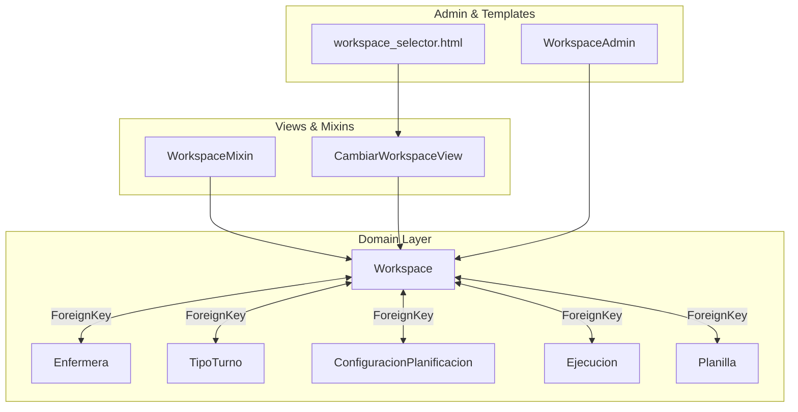
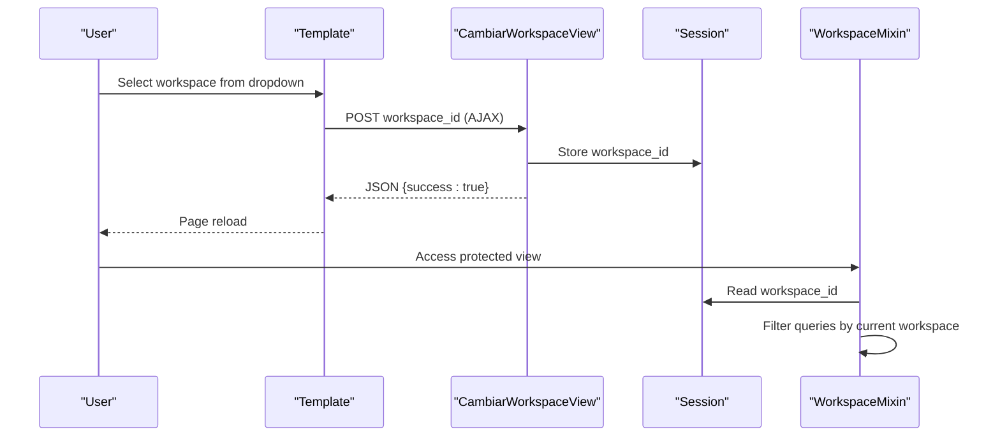
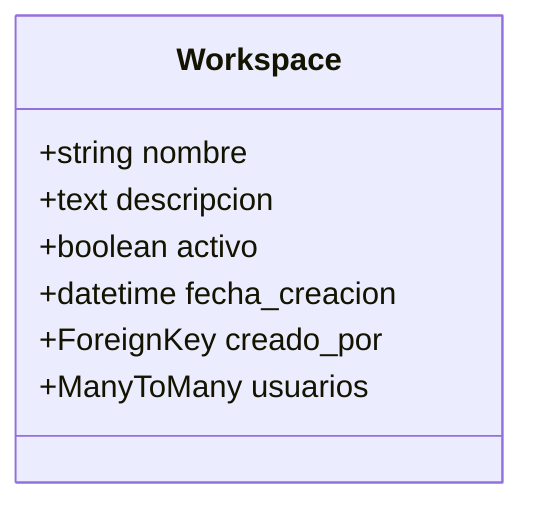
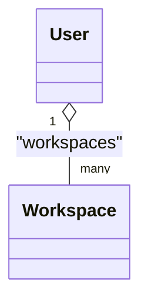
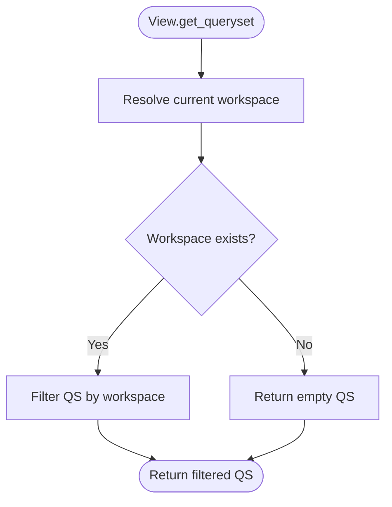
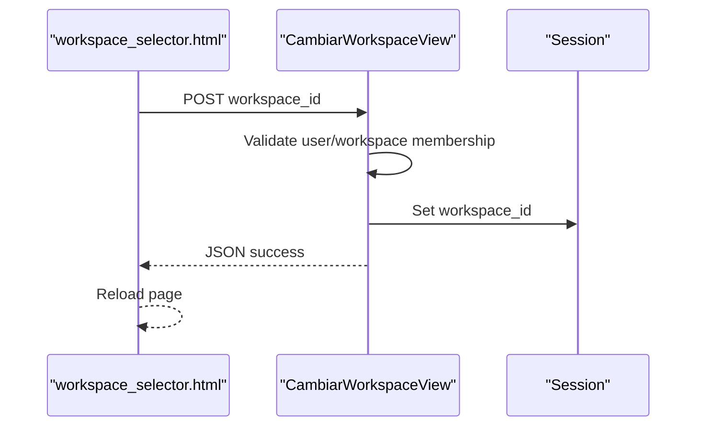
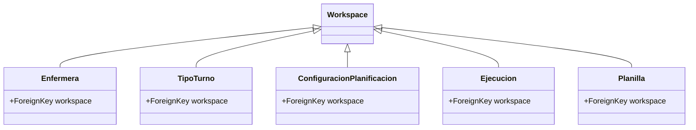
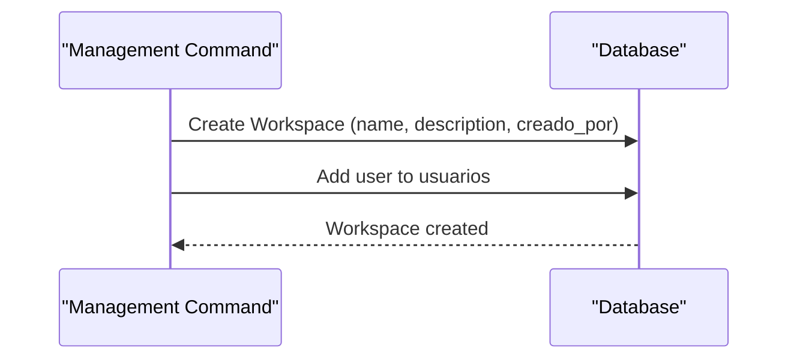
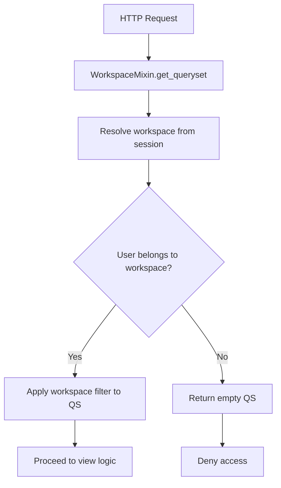
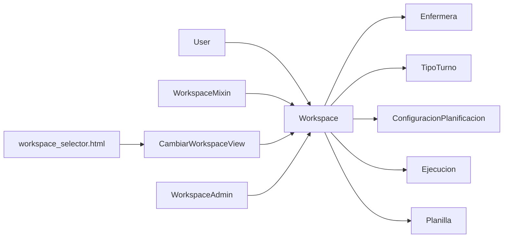

# Workspace Model

<cite>
**Referenced Files in This Document**
- [models.py](file://turnos/models.py)
- [views.py](file://turnos/views.py)
- [admin.py](file://turnos/admin.py)
- [workspace_selector.html](file://turnos/templates/includes/workspace_selector.html)
- [mixins.py](file://turnos/mixins.py)
- [settings.py](file://proyecto_turnos/settings.py)
- [logger_config.py](file://turnos/logger_config.py)
- [init.sql](file://docker/postgres/init.sql)
- [crear_tipos_turno.py](file://turnos/management/commands/crear_tipos_turno.py)
- [simular_planificacion.py](file://turnos/management/commands/simular_planificacion.py)
</cite>

## Table of Contents
1. [Introduction](#introduction)
2. [Project Structure](#project-structure)
3. [Core Components](#core-components)
4. [Architecture Overview](#architecture-overview)
5. [Detailed Component Analysis](#detailed-component-analysis)
6. [Dependency Analysis](#dependency-analysis)
7. [Performance Considerations](#performance-considerations)
8. [Troubleshooting Guide](#troubleshooting-guide)
9. [Conclusion](#conclusion)

## Introduction
This document describes the Workspace model that implements multi-tenancy in the turnos application. It explains how workspaces isolate data per organization or department, how users are associated with workspaces, and how the system enforces tenant boundaries. It also covers workspace creation, user membership, activation/deactivation, permission controls, and security considerations for production deployments.

## Project Structure
The Workspace model resides in the domain layer alongside related entities such as Enfermera, TipoTurno, ConfiguracionPlanificacion, Ejecucion, and Planilla. Views and mixins enforce tenant isolation via session-scoped workspace selection and per-request filtering. Administrative interfaces expose workspace management, while templates provide a selector UI for switching tenants.

**Diagram sources**
- [models.py:12-27](file://turnos/models.py#L12-L27)
- [models.py:30-55](file://turnos/models.py#L30-L55)
- [models.py:60-125](file://turnos/models.py#L60-L125)
- [models.py:332-424](file://turnos/models.py#L332-L424)
- [models.py:482-532](file://turnos/models.py#L482-L532)
- [models.py:534-566](file://turnos/models.py#L534-L566)
- [views.py:2079-2100](file://turnos/views.py#L2079-L2100)
- [admin.py:270-276](file://turnos/admin.py#L270-L276)
- [workspace_selector.html:1-18](file://turnos/templates/includes/workspace_selector.html#L1-L18)

**Section sources**
- [models.py:12-27](file://turnos/models.py#L12-L27)
- [views.py:2079-2100](file://turnos/views.py#L2079-L2100)
- [admin.py:270-276](file://turnos/admin.py#L270-L276)
- [workspace_selector.html:1-18](file://turnos/templates/includes/workspace_selector.html#L1-L18)

## Core Components
- Workspace: Multi-tenant boundary entity with name, description, creator, members, activation flag, and creation timestamp.
- WorkspaceMixin: Injects current workspace resolution and applies automatic tenant filtering to model queries.
- CambiarWorkspaceView: Updates the user’s active workspace in the session.
- WorkspaceAdmin: Admin interface for managing workspaces and member assignment.
- workspace_selector.html: Frontend selector that triggers workspace switching via AJAX.

Key tenant enforcement points:
- Session-scoped workspace selection via workspace_id.
- Automatic filtering of all downstream queries to the current workspace.
- Explicit permission checks ensuring users can only access workspaces they belong to.

**Section sources**
- [models.py:12-27](file://turnos/models.py#L12-L27)
- [views.py:2079-2100](file://turnos/views.py#L2079-L2100)
- [admin.py:270-276](file://turnos/admin.py#L270-L276)
- [workspace_selector.html:1-18](file://turnos/templates/includes/workspace_selector.html#L1-L18)

## Architecture Overview
The multi-tenancy architecture centers on the Workspace model and a set of middleware-like view behaviors that ensure data isolation:

- Data isolation: Each domain model (Enfermera, TipoTurno, ConfiguracionPlanificacion, Ejecucion, Planilla) includes a workspace foreign key.
- User membership: Users join workspaces via a many-to-many relationship; access is enforced at runtime.
- Tenant switching: Users select an active workspace stored in the session; subsequent requests filter by this workspace.
- Admin controls: WorkspaceAdmin allows assigning users and toggling activation.

**Diagram sources**
- [workspace_selector.html:1-18](file://turnos/templates/includes/workspace_selector.html#L1-L18)
- [views.py:2094-2100](file://turnos/views.py#L2094-L2100)
- [views.py:2079-2092](file://turnos/views.py#L2079-L2092)

## Detailed Component Analysis

### Workspace Model
- Purpose: Defines a tenant boundary for all related domain entities.
- Properties:
  - name: Unique within the application scope.
  - description: Optional free text.
  - creado_por: Creator user (required).
  - usuarios: Members granted access (many-to-many).
  - activo: Activation flag controlling visibility and access.
  - fecha_creacion: Automatic timestamp.
- Ordering and metadata: Ordered by creation date descending; translated verbose names.

Validation and constraints:
- Workspace does not define explicit model-level validations; validation occurs at the view and admin layers.

**Diagram sources**
- [models.py:12-27](file://turnos/models.py#L12-L27)

**Section sources**
- [models.py:12-27](file://turnos/models.py#L12-L27)

### Workspace Membership and Access Control
- Membership: Users are linked to workspaces via a many-to-many relationship.
- Access control: Views enforce that the requested workspace belongs to the current user; otherwise a 404 is returned.
- Ownership: Admins can assign/remove users; creators are tracked separately.

**Diagram sources**
- [models.py:16-17](file://turnos/models.py#L16-L17)
- [views.py:2080-2084](file://turnos/views.py#L2080-L2084)

**Section sources**
- [models.py:16-17](file://turnos/models.py#L16-L17)
- [views.py:2079-2084](file://turnos/views.py#L2079-L2084)

### Tenant Isolation via WorkspaceMixin
- Current workspace resolution:
  - Reads workspace_id from session.
  - Falls back to the user’s first workspace if none selected.
- Query filtering:
  - Applies workspace filter to all model queries in subclasses.
  - Returns empty queryset if no workspace is found.

**Diagram sources**
- [views.py:2079-2092](file://turnos/views.py#L2079-L2092)

**Section sources**
- [views.py:2079-2092](file://turnos/views.py#L2079-L2092)

### Workspace Switching Workflow
- Frontend selector emits a POST to the server with workspace_id.
- Server validates that the workspace belongs to the current user and stores it in the session.
- Response triggers a page reload to apply the new tenant context.

**Diagram sources**
- [workspace_selector.html:10-17](file://turnos/templates/includes/workspace_selector.html#L10-L17)
- [views.py:2094-2100](file://turnos/views.py#L2094-L2100)

**Section sources**
- [workspace_selector.html:1-18](file://turnos/templates/includes/workspace_selector.html#L1-L18)
- [views.py:2094-2100](file://turnos/views.py#L2094-L2100)

### Domain Entities and Workspace Relationship
All core domain entities reference a workspace, ensuring data segregation per tenant.

**Diagram sources**
- [models.py:32-38](file://turnos/models.py#L32-L38)
- [models.py:66-72](file://turnos/models.py#L66-L72)
- [models.py:334-340](file://turnos/models.py#L334-L340)
- [models.py:484-490](file://turnos/models.py#L484-L490)
- [models.py:536-542](file://turnos/models.py#L536-L542)

**Section sources**
- [models.py:30-55](file://turnos/models.py#L30-L55)
- [models.py:60-125](file://turnos/models.py#L60-L125)
- [models.py:332-424](file://turnos/models.py#L332-L424)
- [models.py:482-532](file://turnos/models.py#L482-L532)
- [models.py:534-566](file://turnos/models.py#L534-L566)

### Administrative Controls
- WorkspaceAdmin exposes:
  - List display: name, creator, activation, creation date.
  - Filterable list: activation and creation date.
  - Searchable by name and description.
  - Member assignment via filter_horizontal.

These controls enable administrators to manage membership and visibility.

**Section sources**
- [admin.py:270-276](file://turnos/admin.py#L270-L276)

### Workspace Creation and Lifecycle
- Creation:
  - Workspaces are created programmatically in management commands and tests.
  - Example: A simulation command creates a workspace and assigns the creator as a member.
- Lifecycle:
  - Activation flag controls whether a workspace is considered active.
  - There is no explicit deactivation endpoint shown; deactivation can be achieved via admin toggle or application logic.

**Diagram sources**
- [simular_planificacion.py:61-74](file://turnos/management/commands/simular_planificacion.py#L61-L74)
- [crear_tipos_turno.py:116-137](file://turnos/management/commands/crear_tipos_turno.py#L116-L137)

**Section sources**
- [simular_planificacion.py:59-76](file://turnos/management/commands/simular_planificacion.py#L59-L76)
- [crear_tipos_turno.py:116-137](file://turnos/management/commands/crear_tipos_turno.py#L116-L137)

### User Invitation Workflow
- Invitation is not implemented as a dedicated endpoint in the analyzed code.
- Current membership management relies on admin assignment via WorkspaceAdmin.
- To add a user to a workspace, use the admin interface to select the user under the workspace’s member list.

**Section sources**
- [admin.py:270-276](file://turnos/admin.py#L270-L276)

### Permission Management
- Built-in permissions:
  - SuperuserRequiredMixin and StaffRequiredMixin provide role-based access helpers.
  - OwnerRequiredMixin verifies ownership of objects (useful for enforcing per-object permissions).
- Workspace-level enforcement:
  - WorkspaceMixin ensures views operate within the current tenant.
  - Access checks validate that the workspace belongs to the requesting user.

**Diagram sources**
- [views.py:2079-2092](file://turnos/views.py#L2079-L2092)
- [mixins.py:11-48](file://turnos/mixins.py#L11-L48)

**Section sources**
- [mixins.py:11-48](file://turnos/mixins.py#L11-L48)
- [views.py:2079-2092](file://turnos/views.py#L2079-L2092)

### Examples of Queries and Relationships
- Workspace-to-user membership:
  - Query a user’s workspaces: user.workspaces.all().
  - Verify membership: workspace.usuarios.filter(user).
- Workspace-to-domain entities:
  - Filter all entities by workspace: model.objects.filter(workspace=current_workspace).
- Workspace creation and membership:
  - Create workspace and add user: Workspace.objects.create(...); workspace.usuarios.add(user).

Note: These examples describe the relationships and patterns; refer to the code paths above for precise implementation details.

**Section sources**
- [models.py:16-17](file://turnos/models.py#L16-L17)
- [views.py:2079-2092](file://turnos/views.py#L2079-L2092)

### Audit Trails and Logging
- Logging:
  - Centralized logger configuration supports file and console handlers.
  - Views use structured logging for operations like restriction management.
- Audit trail:
  - Several models include created_by and timestamps for provenance.
  - Ejecucion and Planilla capture execution metadata suitable for operational auditing.

**Section sources**
- [logger_config.py:6-23](file://turnos/logger_config.py#L6-L23)
- [models.py:410-413](file://turnos/models.py#L410-L413)
- [models.py:491-513](file://turnos/models.py#L491-L513)
- [models.py:543-554](file://turnos/models.py#L543-L554)

## Dependency Analysis
Workspace depends on the User model and is referenced by multiple domain entities. Views and mixins depend on Workspace for tenant isolation. Admin and templates depend on Workspace for membership and selection.

**Diagram sources**
- [models.py:16-17](file://turnos/models.py#L16-L17)
- [models.py:32-38](file://turnos/models.py#L32-L38)
- [models.py:66-72](file://turnos/models.py#L66-L72)
- [models.py:334-340](file://turnos/models.py#L334-L340)
- [models.py:484-490](file://turnos/models.py#L484-L490)
- [models.py:536-542](file://turnos/models.py#L536-L542)
- [views.py:2079-2100](file://turnos/views.py#L2079-L2100)
- [admin.py:270-276](file://turnos/admin.py#L270-L276)
- [workspace_selector.html:1-18](file://turnos/templates/includes/workspace_selector.html#L1-L18)

**Section sources**
- [models.py:12-27](file://turnos/models.py#L12-L27)
- [views.py:2079-2100](file://turnos/views.py#L2079-L2100)
- [admin.py:270-276](file://turnos/admin.py#L270-L276)
- [workspace_selector.html:1-18](file://turnos/templates/includes/workspace_selector.html#L1-L18)

## Performance Considerations
- Workspace filtering adds a single foreign-key equality check per request; keep workspace_id in session to avoid repeated lookups.
- Ensure database indexes exist on workspace foreign keys for domain entities to minimize query cost.
- Use pagination and selective field retrieval in views to reduce payload sizes.

## Troubleshooting Guide
Common issues and resolutions:
- Access denied to workspace:
  - Cause: User is not a member of the selected workspace.
  - Resolution: Assign user via WorkspaceAdmin or ensure correct membership.
- Empty results after switching:
  - Cause: Selected workspace has no matching records.
  - Resolution: Verify data exists within the workspace or switch to another workspace.
- Session not persisting workspace:
  - Cause: CSRF mismatch or AJAX failure.
  - Resolution: Confirm CSRF token presence and network response status.

Security and compliance:
- Enforce HTTPS and secure cookies in production.
- Limit workspace membership to authorized administrators.
- Monitor access logs and restrict read-only access where appropriate.

**Section sources**
- [views.py:2079-2100](file://turnos/views.py#L2079-L2100)
- [admin.py:270-276](file://turnos/admin.py#L270-L276)
- [settings.py:10-12](file://proyecto_turnos/settings.py#L10-L12)
- [init.sql:401-416](file://docker/postgres/init.sql#L401-L416)

## Conclusion
The Workspace model establishes a robust multi-tenancy foundation by isolating domain data per tenant and enforcing access via session-scoped workspace selection. Combined with WorkspaceMixin and WorkspaceAdmin, it provides a clear, maintainable pattern for tenant-aware operations. For production, pair this model with strong security configurations, strict access controls, and operational monitoring to ensure reliable and secure multi-tenant operation.