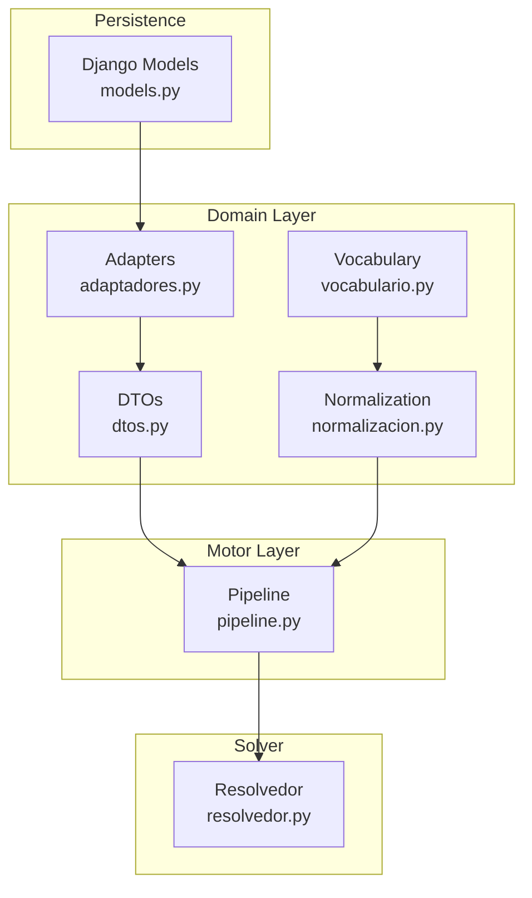
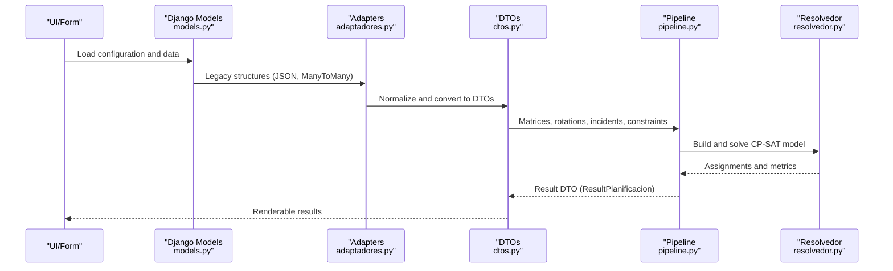
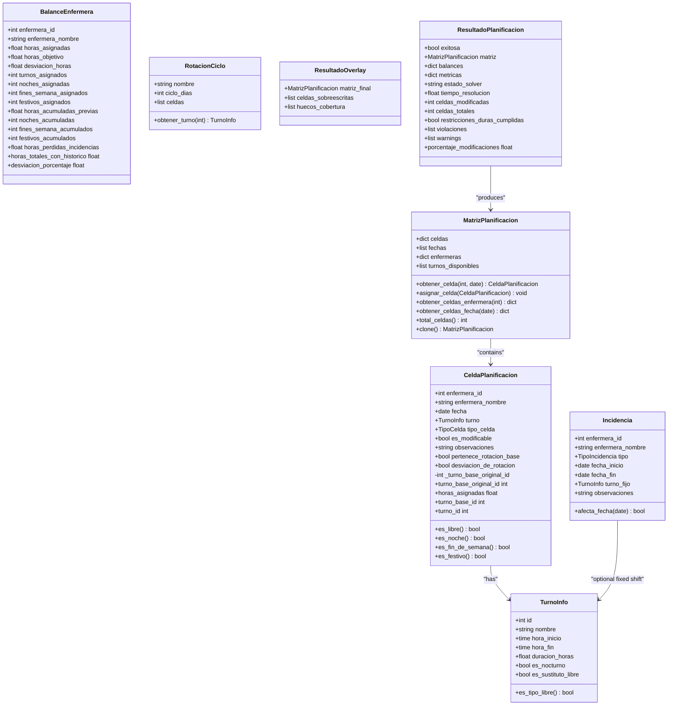
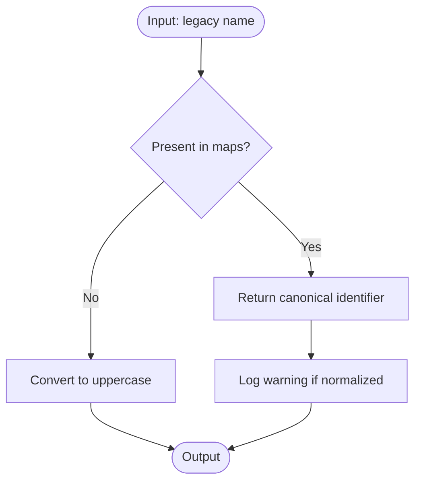
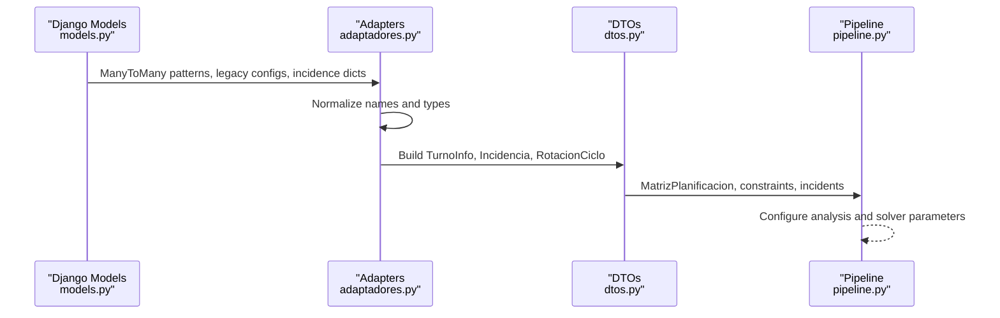
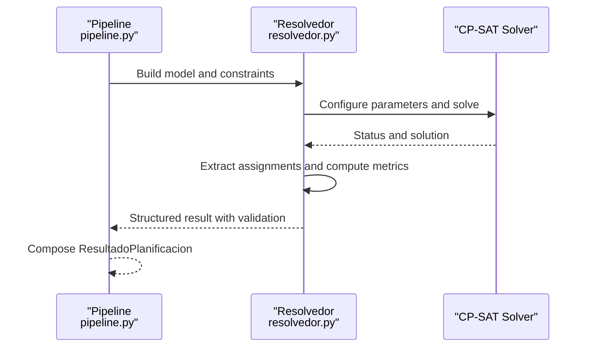
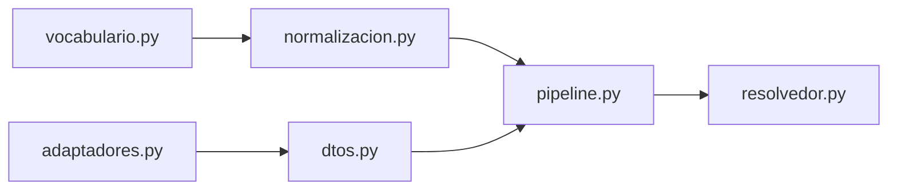

# DTO and Vocabulary System

<cite>
**Referenced Files in This Document**
- [dtos.py](file://turnos/dominio/dtos.py)
- [normalizacion.py](file://turnos/dominio/normalizacion.py)
- [vocabulario.py](file://turnos/dominio/vocabulario.py)
- [adaptadores.py](file://turnos/dominio/adaptadores.py)
- [pipeline.py](file://turnos/motor/pipeline.py)
- [resolvedor.py](file://turnos/resolvedor.py)
- [test_dtos.py](file://turnos/tests/test_dominio/test_dtos.py)
- [test_normalizacion.py](file://turnos/tests/test_dominio/test_normalizacion.py)
- [models.py](file://turnos/models.py)
</cite>

## Table of Contents
1. [Introduction](#introduction)
2. [Project Structure](#project-structure)
3. [Core Components](#core-components)
4. [Architecture Overview](#architecture-overview)
5. [Detailed Component Analysis](#detailed-component-analysis)
6. [Dependency Analysis](#dependency-analysis)
7. [Performance Considerations](#performance-considerations)
8. [Troubleshooting Guide](#troubleshooting-guide)
9. [Conclusion](#conclusion)

## Introduction
This document explains the Data Transfer Object (DTO) system and vocabulary normalization used in solver integration for nursing shift scheduling. It covers:
- The structure and purpose of DTO classes for constraint satisfaction problems
- The vocabulary normalization system that converts human-readable constraint names to solver-compatible formats
- The data transformation processes between Django models and solver input/output formats
- Examples of constraint definition patterns, normalization rules, and validation mechanisms
- The relationship between domain models and solver integration layers

## Project Structure
The DTO and vocabulary system resides in the domain layer and integrates with the motor pipeline and solver:
- Domain layer: DTOs, normalization, vocabulary, and adapters
- Motor layer: orchestration pipeline that consumes normalized DTOs and constraints
- Solver integration: CP-SAT solver invoked by the resolvedor module
- Django models: persistence and legacy compatibility

**Diagram sources**
- [dtos.py:1-274](file://turnos/dominio/dtos.py#L1-L274)
- [normalizacion.py:1-190](file://turnos/dominio/normalizacion.py#L1-L190)
- [vocabulario.py:1-112](file://turnos/dominio/vocabulario.py#L1-L112)
- [adaptadores.py:1-247](file://turnos/dominio/adaptadores.py#L1-L247)
- [pipeline.py:1-267](file://turnos/motor/pipeline.py#L1-L267)
- [resolvedor.py:1-113](file://turnos/resolvedor.py#L1-L113)
- [models.py:1-825](file://turnos/models.py#L1-L825)

**Section sources**
- [dtos.py:1-274](file://turnos/dominio/dtos.py#L1-L274)
- [normalizacion.py:1-190](file://turnos/dominio/normalizacion.py#L1-L190)
- [vocabulario.py:1-112](file://turnos/dominio/vocabulario.py#L1-L112)
- [adaptadores.py:1-247](file://turnos/dominio/adaptadores.py#L1-L247)
- [pipeline.py:1-267](file://turnos/motor/pipeline.py#L1-L267)
- [resolvedor.py:1-113](file://turnos/resolvedor.py#L1-L113)
- [models.py:1-825](file://turnos/models.py#L1-L825)

## Core Components
- DTOs: Typed data carriers for the planner’s internal domain without Django model dependencies. They encapsulate planning cells, nurse balances, incidents, rotation cycles, matrices, and solver results.
- Normalization: Converts legacy constraint/pattern names to canonical identifiers and logs warnings for backward compatibility.
- Vocabulary: Defines canonical identifiers and descriptions for constraints, patterns, cell types, incident types, and solver priority levels.
- Adapters: Bridge legacy configurations and formats (including ManyToMany patterns and JSON) into the normalized DTO structures.
- Pipeline: Orchestrates five phases (rotation base, hours adjustment, coverage analysis, CP-SAT repair, validation) using DTOs and normalized constraints.
- Resolvedor: Executes the CP-SAT solver and extracts assignments into a structured result dictionary.

**Section sources**
- [dtos.py:43-274](file://turnos/dominio/dtos.py#L43-L274)
- [normalizacion.py:68-190](file://turnos/dominio/normalizacion.py#L68-L190)
- [vocabulario.py:10-112](file://turnos/dominio/vocabulario.py#L10-L112)
- [adaptadores.py:22-247](file://turnos/dominio/adaptadores.py#L22-L247)
- [pipeline.py:31-267](file://turnos/motor/pipeline.py#L31-L267)
- [resolvedor.py:11-113](file://turnos/resolvedor.py#L11-L113)

## Architecture Overview
The system separates concerns across layers:
- Domain DTOs define the planner’s internal representation
- Normalization ensures consistent constraint/pattern identifiers
- Vocabulary defines canonical semantics
- Adapters translate legacy formats into DTOs
- Pipeline orchestrates the solution process using DTOs and normalized constraints
- Solver executes CP-SAT and returns assignment results validated by the pipeline

**Diagram sources**
- [models.py:332-400](file://turnos/models.py#L332-L400)
- [adaptadores.py:31-75](file://turnos/dominio/adaptadores.py#L31-L75)
- [dtos.py:197-274](file://turnos/dominio/dtos.py#L197-L274)
- [pipeline.py:92-234](file://turnos/motor/pipeline.py#L92-L234)
- [resolvedor.py:21-112](file://turnos/resolvedor.py#L21-L112)

## Detailed Component Analysis

### DTO Classes and Purpose
- TurnoInfo: Encapsulates shift metadata (id, name, start/end times, duration, nocturnal flag, substitute-free indicator).
- CeldaPlanificacion: Represents a single nurse-date cell, including assigned shift, type, modifiability, observability, rotation membership, deviation flags, immutable base shift snapshot, and computed helpers (free, hours, night, weekend, holiday).
- BalanceEnfermera: Tracks nurse workload and deviations (assigned vs. target hours, counts of nights, weekends, holidays, historical accumulations, losses from incidents).
- Incidencia: Captures absence/incident events (type, dates, optional fixed shift) and whether a given date falls under the event.
- RotacionCiclo: Defines explicit cyclic rotation sequences (name, cycle length, cells as TurnoInfo or None for free days).
- MatrizPlanificacion: Aggregates all cells per nurse and date, supports lookups, cloning, and totals.
- ResultadoOverlay: Overlay result with modified cells and coverage gaps.
- ResultadoPlanificacion: Final planner result with success flag, matrix, balances, metrics, solver state, timing, modification counts, validation flags, and warnings.

**Diagram sources**
- [dtos.py:43-274](file://turnos/dominio/dtos.py#L43-L274)

**Section sources**
- [dtos.py:43-274](file://turnos/dominio/dtos.py#L43-L274)
- [test_dtos.py:19-238](file://turnos/tests/test_dominio/test_dtos.py#L19-L238)

### Vocabulary Normalization System
- Purpose: Translate legacy constraint and pattern names to canonical UPPER_SNAKE_CASE identifiers and log warnings for backward compatibility.
- Mechanism:
  - Canonical maps for hard constraints, soft constraints, and patterns.
  - Functions normalize single names, dictionaries, lists, and remove duplicates when requested.
- Usage in pipeline: Extracts normalized identifiers to configure coverage analysis and solver parameters.

**Diagram sources**
- [normalizacion.py:68-93](file://turnos/dominio/normalizacion.py#L68-L93)
- [vocabulario.py:10-45](file://turnos/dominio/vocabulario.py#L10-L45)

**Section sources**
- [normalizacion.py:68-190](file://turnos/dominio/normalizacion.py#L68-L190)
- [vocabulario.py:10-112](file://turnos/dominio/vocabulario.py#L10-L112)
- [test_normalizacion.py:19-115](file://turnos/tests/test_dominio/test_normalizacion.py#L19-L115)

### Constraint Definition Patterns and Validation
- Pattern 1: Hard constraints (e.g., daily shift limit, consecutive shifts, rest between shifts, minimum/maximum coverage, annual free days, weekly rest, maximum consecutive nights).
- Pattern 2: Soft constraints (e.g., equity in shifts, minimizing nights, equity in weekends and holidays, minimizing abrupt changes, respecting nurse preferences).
- Pattern 3: Rotation and sequence patterns (e.g., mandatory sequences, cyclic rotation, post-shift rest, blocking transitions, minimum coverage, equitable distribution).
- Validation: Pipeline extracts normalized constraint names and parameters to configure analysis and solver behavior. Unknown names are uppercased and logged.

Examples of canonical identifiers and descriptions are defined in the vocabulary module.

**Section sources**
- [vocabulario.py:10-45](file://turnos/dominio/vocabulario.py#L10-L45)
- [pipeline.py:140-163](file://turnos/motor/pipeline.py#L140-L163)
- [pipeline.py:247-266](file://turnos/motor/pipeline.py#L247-L266)

### Data Transformation Between Django Models and Solver Formats
- Legacy ManyToMany patterns: Converted to normalized JSON with typed fields and normalized pattern types.
- Legacy configurations: Restriction names normalized in dictionaries before being consumed by the pipeline.
- Incidences: Legacy formats mapped to DTO Incidencia with type enums and date range checks.
- Rotation abstraction: Abstract pattern sequences converted to explicit cyclic rotations.

**Diagram sources**
- [adaptadores.py:83-112](file://turnos/dominio/adaptadores.py#L83-L112)
- [adaptadores.py:120-146](file://turnos/dominio/adaptadores.py#L120-L146)
- [adaptadores.py:154-203](file://turnos/dominio/adaptadores.py#L154-L203)
- [adaptadores.py:211-246](file://turnos/dominio/adaptadores.py#L211-L246)
- [dtos.py:43-194](file://turnos/dominio/dtos.py#L43-L194)
- [pipeline.py:92-234](file://turnos/motor/pipeline.py#L92-L234)

**Section sources**
- [adaptadores.py:22-247](file://turnos/dominio/adaptadores.py#L22-L247)
- [models.py:221-330](file://turnos/models.py#L221-L330)

### Solver Integration and Result Extraction
- The resolvedor module configures and runs the CP-SAT solver using parameters from the configuration (workers, timeout, seed).
- It extracts assignments into a structured dictionary containing nurse, date, shift, and free-day indicators.
- A validator checks feasibility and computes penalties and metrics.
- The pipeline composes the final ResultadoPlanificacion with balances, metrics, solver status, and validation outcomes.

**Diagram sources**
- [resolvedor.py:21-112](file://turnos/resolvedor.py#L21-L112)
- [pipeline.py:170-234](file://turnos/motor/pipeline.py#L170-L234)

**Section sources**
- [resolvedor.py:11-113](file://turnos/resolvedor.py#L11-L113)
- [pipeline.py:92-234](file://turnos/motor/pipeline.py#L92-L234)

## Dependency Analysis
- DTOs depend on Python dataclasses and enums; they are self-contained and independent of Django models.
- Normalization depends on vocabulary maps and logs warnings via the logging module.
- Adapters depend on normalization and vocabulary to transform legacy structures into DTOs.
- Pipeline orchestrates DTO consumption and uses normalization to interpret constraints.
- Resolver depends on CP-SAT and returns assignment dictionaries consumed by the pipeline.

**Diagram sources**
- [normalizacion.py:1-190](file://turnos/dominio/normalizacion.py#L1-L190)
- [vocabulario.py:1-112](file://turnos/dominio/vocabulario.py#L1-L112)
- [adaptadores.py:1-247](file://turnos/dominio/adaptadores.py#L1-L247)
- [dtos.py:1-274](file://turnos/dominio/dtos.py#L1-L274)
- [pipeline.py:1-267](file://turnos/motor/pipeline.py#L1-L267)
- [resolvedor.py:1-113](file://turnos/resolvedor.py#L1-L113)

**Section sources**
- [normalizacion.py:1-190](file://turnos/dominio/normalizacion.py#L1-L190)
- [vocabulario.py:1-112](file://turnos/dominio/vocabulario.py#L1-L112)
- [adaptadores.py:1-247](file://turnos/dominio/adaptadores.py#L1-L247)
- [dtos.py:1-274](file://turnos/dominio/dtos.py#L1-L274)
- [pipeline.py:1-267](file://turnos/motor/pipeline.py#L1-L267)
- [resolvedor.py:1-113](file://turnos/resolvedor.py#L1-L113)

## Performance Considerations
- DTO cloning and deep copying are used for matrix duplication; avoid unnecessary clones in hot loops.
- Normalization operates on dictionaries and lists; keep input sizes bounded and cache repeated lookups where appropriate.
- Pipeline phases include coverage analysis and optional CP-SAT repair; tune solver parameters (workers, timeout, seed) to balance quality and speed.
- Prefer batch operations for building matrices and extracting assignments to minimize overhead.

## Troubleshooting Guide
- Unknown constraint names: Normalization converts unknown names to uppercase; verify vocabulary canonicals and logs for warnings.
- Legacy ManyToMany patterns: Ensure pattern types are normalized; adapter logs conversion counts.
- Incidence types: Unknown legacy types are mapped to defaults with warnings; confirm enum mapping completeness.
- Coverage analysis failures: Review normalized constraint parameters and pipeline extraction logic for missing or invalid values.
- Solver timeouts or infeasibility: Adjust worker count, timeout, and seed; inspect validation reports for violated hard constraints.

**Section sources**
- [normalizacion.py:68-93](file://turnos/dominio/normalizacion.py#L68-L93)
- [adaptadores.py:108-112](file://turnos/dominio/adaptadores.py#L108-L112)
- [adaptadores.py:181-183](file://turnos/dominio/adaptadores.py#L181-L183)
- [pipeline.py:140-163](file://turnos/motor/pipeline.py#L140-L163)
- [resolvedor.py:25-48](file://turnos/resolvedor.py#L25-L48)

## Conclusion
The DTO and vocabulary system provides a robust, typed foundation for the planner’s domain logic, ensuring consistent constraint identification and seamless integration with the CP-SAT solver. Normalization and adapters preserve backward compatibility while enabling clear separation between legacy persistence and modern orchestration. Together, these components support reliable, maintainable solver integration for nursing shift scheduling.