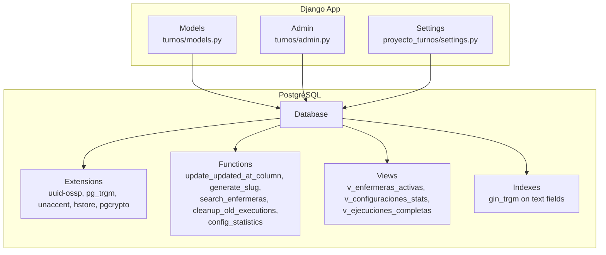
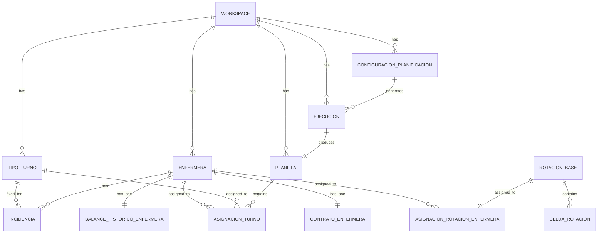
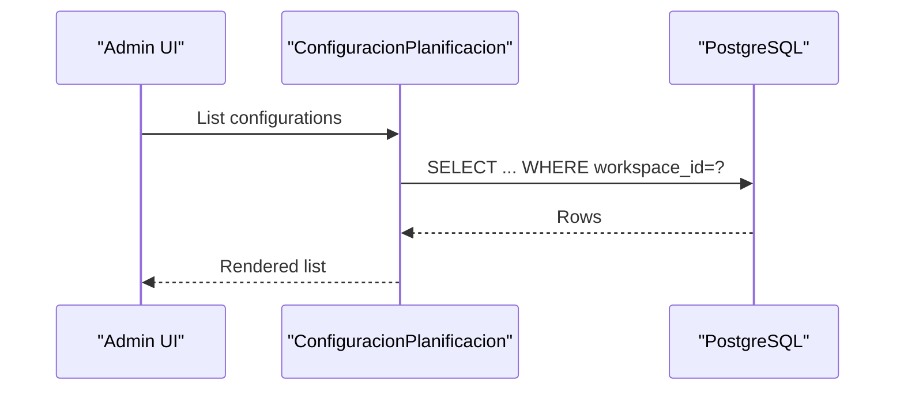
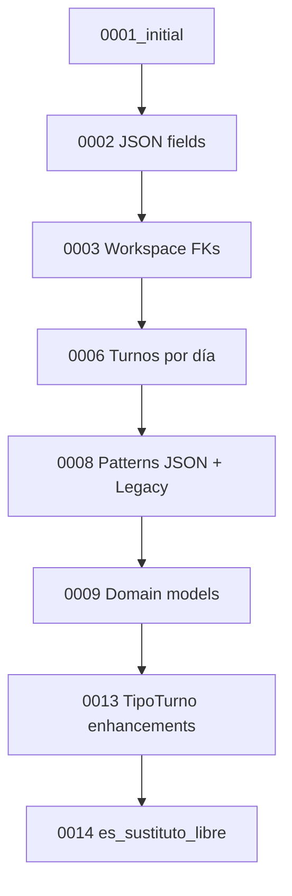
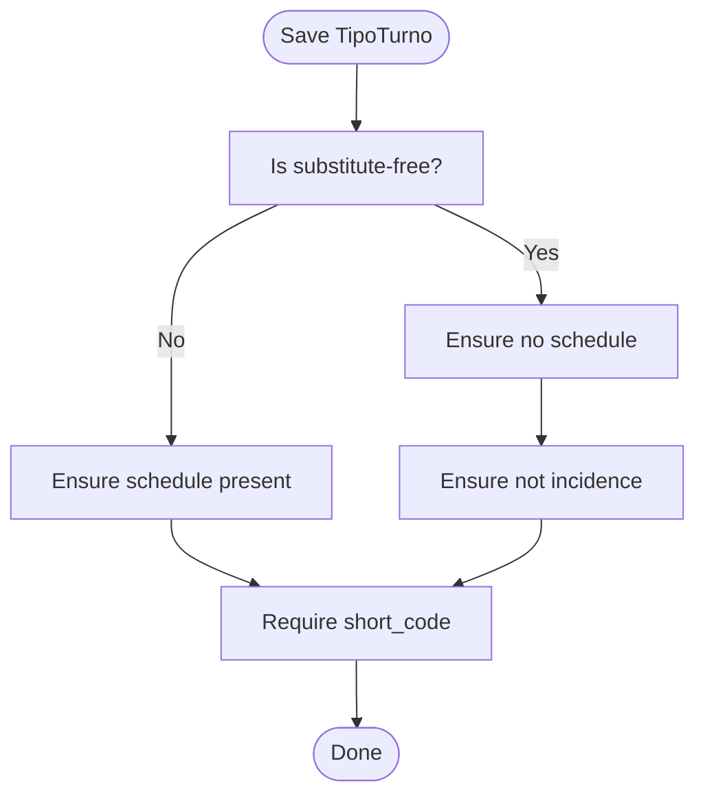
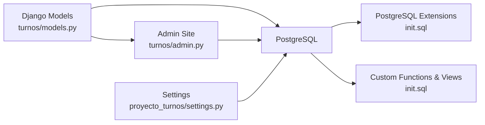

# Database Schema and Migrations

<cite>
**Referenced Files in This Document**
- [models.py](file://turnos/models.py)
- [admin.py](file://turnos/admin.py)
- [settings.py](file://proyecto_turnos/settings.py)
- [init.sql](file://docker/postgres/init.sql)
- [0001_initial.py](file://turnos/migrations/0001_initial.py)
- [0002_alter_configuracionplanificacion_demanda_por_turno_and_more.py](file://turnos/migrations/0002_alter_configuracionplanificacion_demanda_por_turno_and_more.py)
- [0003_alter_configuracionplanificacion_num_dias_workspace_and_more.py](file://turnos/migrations/0003_alter_configuracionplanificacion_num_dias_workspace_and_more.py)
- [0004_alter_configuracionplanificacion_restricciones_duras.py](file://turnos/migrations/0004_alter_configuracionplanificacion_restricciones_duras.py)
- [0005_alter_configuracionplanificacion_restricciones_blandas.py](file://turnos/migrations/0005_alter_configuracionplanificacion_restricciones_blandas.py)
- [0006_configuracionplanificacion_turnos_por_dia.py](file://turnos/migrations/0006_configuracionplanificacion_turnos_por_dia.py)
- [0008_configuracionplanificacion_patrones_turnos_json_and_more.py](file://turnos/migrations/0008_configuracionplanificacion_patrones_turnos_json_and_more.py)
- [0009_add_domain_models.py](file://turnos/migrations/0009_add_domain_models.py)
- [0013_tipoturno_dinamico.py](file://turnos/migrations/0013_tipoturno_dinamico.py)
- [0014_tipoturno_sustituto_libre.py](file://turnos/migrations/0014_tipoturno_sustituto_libre.py)
</cite>

## Table of Contents
1. [Introduction](#introduction)
2. [Project Structure](#project-structure)
3. [Core Components](#core-components)
4. [Architecture Overview](#architecture-overview)
5. [Detailed Component Analysis](#detailed-component-analysis)
6. [Dependency Analysis](#dependency-analysis)
7. [Performance Considerations](#performance-considerations)
8. [Troubleshooting Guide](#troubleshooting-guide)
9. [Conclusion](#conclusion)
10. [Appendices](#appendices)

## Introduction
This document describes the database schema design and migration strategy for the nursing shift planner application. It documents the complete table structure, primary keys, foreign keys, and indexes; explains the migration history and schema evolution; details the admin interface configuration and customizations; and covers performance considerations, indexing strategies, query optimization patterns, workspace-based data isolation, and database-level validation and constraints. It also provides examples of complex queries and their performance characteristics.

## Project Structure
The database layer is implemented via Django ORM models and managed through Django migrations. PostgreSQL is configured with extensions, custom functions, views, and maintenance routines. The admin site is customized to improve usability and operational visibility.

**Diagram sources**
- [models.py:12-825](file://turnos/models.py#L12-L825)
- [admin.py:1-449](file://turnos/admin.py#L1-L449)
- [settings.py:62-76](file://proyecto_turnos/settings.py#L62-L76)
- [init.sql:18-41](file://docker/postgres/init.sql#L18-L41)
- [init.sql:60-161](file://docker/postgres/init.sql#L60-L161)
- [init.sql:167-224](file://docker/postgres/init.sql#L167-L224)
- [init.sql:233-249](file://docker/postgres/init.sql#L233-L249)

**Section sources**
- [models.py:12-825](file://turnos/models.py#L12-L825)
- [admin.py:1-449](file://turnos/admin.py#L1-L449)
- [settings.py:62-76](file://proyecto_turnos/settings.py#L62-L76)
- [init.sql:1-508](file://docker/postgres/init.sql#L1-L508)

## Core Components
This section outlines the core relational schema and constraints. All models define primary keys implicitly via Django’s BigAutoField. Foreign keys are defined explicitly with related names and constraints. Unique constraints and indexes are declared at the model and migration levels.

- Workspace
  - Purpose: Isolate data per tenant/workspace.
  - Fields: name, description, created_by (User), users (ManyToMany), active, created_at.
  - Constraints: None explicit; isolation enforced at application level.
  - Indexes: None explicit; Django creates default indexes.

- Enfermera (Nurse)
  - Purpose: Represents a nurse with profile and preferences.
  - Fields: workspace (FK), name, email (unique), phone, dni (unique), active, hire_date, preferences (JSON), notes.
  - Constraints: Unique email; optional unique dni; ordering by name.
  - Indexes: Gin trigram indexes for name and email (see init.sql).

- TipoTurno (Shift Type)
  - Purpose: Defines shift types (Morning, Evening, Night, Free, Off, etc.) with optional schedule and metadata.
  - Fields: workspace (FK), name, short_code, start_time, end_time, description, active, is_incidence, is_substitute_free.
  - Constraints: Unique(name, workspace); Unique(short_code, workspace) when workspace is set.
  - Indexes: Gin trigram indexes for name and description (via model constraints and init.sql).

- PatronTurnos (Shift Pattern)
  - Purpose: Generic pattern definitions (sequences, rest after shifts, max consecutive, blocking transitions, coverage).
  - Fields: name, description, type, active, is_hard_constraint, weight_penalty, configuration (JSON), created_by (User), timestamps.
  - Indexes: Ordering by active and name.

- ConfiguracionPlanificacion (Planning Configuration)
  - Purpose: Stores planning period, participants, shift types, demand, hard/blind constraints, patterns, solver settings.
  - Fields: workspace (FK), name, description, active, num_days, start_date, nurses (M2M), shift_types (M2M), shift_types_per_day (M2M), demand_by_shift (JSON), hard_constraints (JSON), soft_constraints (JSON), patterns_json (JSON), patterns_legacy (M2M), workers, max_seconds, seed, created_by (User), timestamps.
  - Indexes: Ordering by start_date; unique constraints on JSON fields handled at application level.

- Ejecucion (Execution)
  - Purpose: Tracks a single planning run with status, timing, optimality, penalties, and results.
  - Fields: workspace (FK), configuration (FK), status, timestamps, optimal, total_penalty, results (JSON), messages (JSON), planilla (OneToOne).
  - Indexes: Ordering by start_date; status filterable.

- Planilla (Schedule)
  - Purpose: Stores the generated schedule for a run.
  - Fields: workspace (FK), name, description, execution (OneToOne), start_date, end_date, num_days.
  - Indexes: Ordering by start_date.

- AsignacionTurno (Shift Assignment)
  - Purpose: Daily assignment of a shift or free day to a nurse in a schedule.
  - Fields: planilla (FK), nurse (FK), date, shift_type (FK), is_free_day, observations, cell_type.
  - Constraints: unique_together(planilla, nurse, date).
  - Indexes: Ordering by date, nurse; unique index via constraint.

- Domain Models (Added later)
  - ContratoEnfermera: Nurse contract with weekly/yearly hours and percentage.
  - RotacionBase: Base rotation cycle with cycle length.
  - CeldaRotacion: Cell inside a rotation cycle (shift or free).
  - AsignacionRotacionEnfermera: Assigns a rotation to a nurse with offset.
  - Incidencia: Absences and fixed assignments (vacations, permission, illness, training, fixed assignment).
  - BalanceHistoricoEnfermera: Historical metrics for a nurse by month/year period.

**Section sources**
- [models.py:12-825](file://turnos/models.py#L12-L825)
- [0009_add_domain_models.py:14-122](file://turnos/migrations/0009_add_domain_models.py#L14-L122)
- [0013_tipoturno_dinamico.py:38-46](file://turnos/migrations/0013_tipoturno_dinamico.py#L38-L46)
- [0014_tipoturno_sustituto_libre.py:13-18](file://turnos/migrations/0014_tipoturno_sustituto_libre.py#L13-L18)

## Architecture Overview
The schema supports workspace-based multi-tenancy by adding workspace foreign keys to most domain entities. Application-level filtering ensures data isolation. PostgreSQL is extended with utilities for fuzzy search, statistics, and maintenance.

**Diagram sources**
- [models.py:12-825](file://turnos/models.py#L12-L825)
- [0009_add_domain_models.py:24-122](file://turnos/migrations/0009_add_domain_models.py#L24-L122)

**Section sources**
- [models.py:12-825](file://turnos/models.py#L12-L825)
- [init.sql:267-276](file://docker/postgres/init.sql#L267-L276)

## Detailed Component Analysis

### Workspace-Based Data Isolation
- Design: Each major entity (Enfermera, TipoTurno, ConfiguracionPlanificacion, Ejecucion, Planilla) has a workspace foreign key. This enables multi-tenancy within a single database.
- Enforcement: Django admin and application logic filter by current workspace. The admin site exposes workspace-aware lists and filters.
- Impact: Queries must include workspace conditions; otherwise, cross-tenant leakage occurs.

**Diagram sources**
- [admin.py:133-180](file://turnos/admin.py#L133-L180)
- [models.py:332-424](file://turnos/models.py#L332-L424)

**Section sources**
- [models.py:12-825](file://turnos/models.py#L12-L825)
- [admin.py:270-276](file://turnos/admin.py#L270-L276)

### Admin Interface Configuration and Customizations
- Customized displays:
  - TipoTurno: color badges, duration calculation, search by name/code.
  - PatronTurnos: contextual textarea for JSON configuration, readonly timestamps.
  - ConfiguracionPlanificacion: horizontal filters for many-to-many relations, readonly timestamps.
  - Ejecucion: colored state badges, links to results, readonly computed fields.
  - Planilla: inline count of assignments.
  - AsignacionTurno: date hierarchy, filters by date and shift.
  - Workspace: user membership management.
  - Domain models: inlines for rotation cells, computed “active” flags, durations.
- Site branding and titles.

```mermaid
classDiagram
class TipoTurnoAdmin
class PatronTurnosAdmin
class ConfiguracionPlanificacionAdmin
class EjecucionAdmin
class PlanillaAdmin
class AsignacionTurnoAdmin
class WorkspaceAdmin
class RotacionBaseAdmin
class AsignacionRotacionEnfermeraAdmin
class ContratoEnfermeraAdmin
class IncidenciaAdmin
class BalanceHistoricoEnfermeraAdmin
TipoTurnoAdmin --> TipoTurno
PatronTurnosAdmin --> PatronTurnos
ConfiguracionPlanificacionAdmin --> ConfiguracionPlanificacion
EjecucionAdmin --> Ejecucion
PlanillaAdmin --> Planilla
AsignacionTurnoAdmin --> AsignacionTurno
WorkspaceAdmin --> Workspace
RotacionBaseAdmin --> RotacionBase
AsignacionRotacionEnfermeraAdmin --> AsignacionRotacionEnfermera
ContratoEnfermeraAdmin --> ContratoEnfermera
IncidenciaAdmin --> Inc incidencia
BalanceHistoricoEnfermeraAdmin --> BalanceHistoricoEnfermera
```

**Diagram sources**
- [admin.py:16-449](file://turnos/admin.py#L16-L449)

**Section sources**
- [admin.py:16-449](file://turnos/admin.py#L16-L449)

### Migration History and Schema Evolution
The schema evolved from a minimal initial set of models to a richer domain model with workspace support and advanced planning features.

- Initial (0001): Enfermera, TipoTurno, ConfiguracionPlanificacion, Ejecucion, Planilla, AsignacionTurno.
- Early enhancements (0002, 0004, 0005): JSON fields for demand and constraints made nullable/blank.
- Workspace introduction (0003): Added Workspace model and FKs to core entities.
- Turnos por día (0006): Added M2M for shift types per day.
- Patterns JSON (0008): Introduced dynamic patterns via JSON plus legacy ManyToMany.
- Domain models (0009): Added contract, rotation, incidence, balance, and related entities.
- TipoTurno improvements (0013): Added is_incidence, is_substitute_free, unique constraints by workspace, nullable times.
- Substitute free flag (0014): Added es_sustituto_libre.

**Diagram sources**
- [0001_initial.py:1-140](file://turnos/migrations/0001_initial.py#L1-L140)
- [0002_alter_configuracionplanificacion_demanda_por_turno_and_more.py:1-29](file://turnos/migrations/0002_alter_configuracionplanificacion_demanda_por_turno_and_more.py#L1-L29)
- [0003_alter_configuracionplanificacion_num_dias_workspace_and_more.py:1-65](file://turnos/migrations/0003_alter_configuracionplanificacion_num_dias_workspace_and_more.py#L1-L65)
- [0006_configuracionplanificacion_turnos_por_dia.py:1-19](file://turnos/migrations/0006_configuracionplanificacion_turnos_por_dia.py#L1-L19)
- [0008_configuracionplanificacion_patrones_turnos_json_and_more.py:1-29](file://turnos/migrations/0008_configuracionplanificacion_patrones_turnos_json_and_more.py#L1-L29)
- [0009_add_domain_models.py:1-123](file://turnos/migrations/0009_add_domain_models.py#L1-L123)
- [0013_tipoturno_dinamico.py:1-47](file://turnos/migrations/0013_tipoturno_dinamico.py#L1-L47)
- [0014_tipoturno_sustituto_libre.py:1-19](file://turnos/migrations/0014_tipoturno_sustituto_libre.py#L1-L19)

**Section sources**
- [0001_initial.py:1-140](file://turnos/migrations/0001_initial.py#L1-L140)
- [0002_alter_configuracionplanificacion_demanda_por_turno_and_more.py:1-29](file://turnos/migrations/0002_alter_configuracionplanificacion_demanda_por_turno_and_more.py#L1-L29)
- [0003_alter_configuracionplanificacion_num_dias_workspace_and_more.py:1-65](file://turnos/migrations/0003_alter_configuracionplanificacion_num_dias_workspace_and_more.py#L1-L65)
- [0006_configuracionplanificacion_turnos_por_dia.py:1-19](file://turnos/migrations/0006_configuracionplanificacion_turnos_por_dia.py#L1-L19)
- [0008_configuracionplanificacion_patrones_turnos_json_and_more.py:1-29](file://turnos/migrations/0008_configuracionplanificacion_patrones_turnos_json_and_more.py#L1-L29)
- [0009_add_domain_models.py:1-123](file://turnos/migrations/0009_add_domain_models.py#L1-L123)
- [0013_tipoturno_dinamico.py:1-47](file://turnos/migrations/0013_tipoturno_dinamico.py#L1-L47)
- [0014_tipoturno_sustituto_libre.py:1-19](file://turnos/migrations/0014_tipoturno_sustituto_libre.py#L1-L19)

### Data Validation at Database Level and Constraint Enforcement
- Unique constraints:
  - Enfermera: unique email; optional unique dni.
  - TipoTurno: unique(name, workspace); unique(short_code, workspace) when workspace is set.
  - BalanceHistoricoEnfermera: unique(enfermera, periodo_referencia).
  - AsignacionTurno: unique(planilla, enfermera, fecha).
- Field-level validations:
  - TipoTurno: raises validation errors when substitute-free conflicts with schedule fields or vice versa; requires short_code; enforces presence of start/end for non-incidence, non-substitute-free types.
  - ConfiguracionPlanificacion: validates num_dias range and derived end date.
  - AsignacionTurno: requires a shift or free day when cell type is TURNO.
- Database-level checks:
  - PostgreSQL functions validate JSON configuration for patterns.
  - Unique constraints prevent duplicates at the database level.

**Diagram sources**
- [models.py:126-168](file://turnos/models.py#L126-L168)

**Section sources**
- [models.py:40-46](file://turnos/models.py#L40-L46)
- [models.py:113-124](file://turnos/models.py#L113-L124)
- [models.py:818-822](file://turnos/models.py#L818-L822)
- [models.py:609-623](file://turnos/models.py#L609-L623)
- [models.py:126-168](file://turnos/models.py#L126-L168)

### Complex Queries and Performance Characteristics
Below are representative query patterns and their likely performance characteristics. These are described conceptually to avoid exposing implementation details.

- Nurse search with fuzzy matching
  - Pattern: Search by name or email using trigram similarity and ILIKE fallback.
  - Performance: Uses gin_trgm_ops indexes on name/email; cost depends on similarity threshold and result limit.
  - Complexity: O(n) scan with index acceleration; limited by top-N selection.

- Execution statistics aggregation
  - Pattern: Aggregate counts, averages, and latest timestamps by configuration.
  - Performance: Aggregation over indexed foreign keys; efficient with proper WHERE clauses.

- Active nurses and usage stats
  - Pattern: Join nurses with many-to-many configuration participation and executions.
  - Performance: Indexes on foreign keys and M2M junction tables reduce join costs.

- Cleanup old executions
  - Pattern: Delete completed/error/canceled executions older than threshold.
  - Performance: Index on state and date reduces scan; batch deletes minimize locks.

- Reindex and analyze critical tables
  - Pattern: Periodic maintenance to refresh statistics and availability.
  - Performance: Concurrent reindex minimizes downtime; analyze improves query planner accuracy.

**Section sources**
- [init.sql:88-117](file://docker/postgres/init.sql#L88-L117)
- [init.sql:139-161](file://docker/postgres/init.sql#L139-L161)
- [init.sql:167-224](file://docker/postgres/init.sql#L167-L224)
- [init.sql:352-381](file://docker/postgres/init.sql#L352-L381)

## Dependency Analysis
- Django ORM models define relationships and constraints.
- Admin customization leverages model introspection and custom forms/widgets.
- PostgreSQL extensions and functions complement ORM capabilities for search, maintenance, and analytics.
- Settings configure the database backend and connection parameters.

**Diagram sources**
- [models.py:12-825](file://turnos/models.py#L12-L825)
- [admin.py:1-449](file://turnos/admin.py#L1-L449)
- [settings.py:62-76](file://proyecto_turnos/settings.py#L62-L76)
- [init.sql:18-41](file://docker/postgres/init.sql#L18-L41)
- [init.sql:60-161](file://docker/postgres/init.sql#L60-L161)

**Section sources**
- [models.py:12-825](file://turnos/models.py#L12-L825)
- [admin.py:1-449](file://turnos/admin.py#L1-L449)
- [settings.py:62-76](file://proyecto_turnos/settings.py#L62-L76)
- [init.sql:1-508](file://docker/postgres/init.sql#L1-L508)

## Performance Considerations
- Text search and similarity:
  - Enable pg_trgm and unaccent; create gin_trgm indexes on frequently searched text fields (e.g., name, email).
  - Configure default_text_search_config and similarity thresholds for balanced recall/precision.
- Maintenance:
  - Use periodic ANALYZE and concurrent REINDEX to keep query plans optimal.
  - Schedule cleanup functions for historical execution records to control table growth.
- Indexing strategy:
  - Leverage unique_together and unique constraints for fast lookups.
  - Add composite indexes on commonly filtered fields (e.g., workspace + date, state + timestamp).
- JSON fields:
  - Keep JSON structures normalized where frequent filtering is required; otherwise, use containment operators judiciously.
- Connection tuning:
  - Increase timeout for SQLite dev; ensure production uses appropriate pool settings.

[No sources needed since this section provides general guidance]

## Troubleshooting Guide
- Duplicate entries despite unique constraints:
  - Verify workspace-specific uniqueness constraints and that workspace is set during creation.
- Slow searches on nurses or configurations:
  - Confirm gin_trgm indexes exist and are being used; adjust similarity threshold if needed.
- Execution cleanup not removing old rows:
  - Check function existence and permissions; ensure scheduled jobs run.
- Admin filters not working:
  - Ensure workspace-aware admin lists are enabled and current workspace is selected.

**Section sources**
- [models.py:113-124](file://turnos/models.py#L113-L124)
- [init.sql:233-249](file://docker/postgres/init.sql#L233-L249)
- [init.sql:119-137](file://docker/postgres/init.sql#L119-L137)
- [admin.py:270-276](file://turnos/admin.py#L270-L276)

## Conclusion
The schema employs a robust workspace-based isolation strategy, complemented by PostgreSQL extensions and custom functions to enhance search, maintenance, and analytics. Migrations progressively enriched the domain model to support advanced planning features while preserving backward compatibility. Admin customizations streamline operations and improve visibility. Proper indexing and maintenance routines ensure sustained performance.

[No sources needed since this section summarizes without analyzing specific files]

## Appendices

### Appendix A: Migration Timeline and Milestones
- Initial models (0001): Core entities for planning.
- JSON constraints (0002, 0004, 0005): Enhanced flexibility for constraints and demand.
- Workspace (0003): Introduced multi-tenancy.
- Turnos por día (0006): Refined daily shift coverage modeling.
- Dynamic patterns (0008): Hybrid JSON + legacy ManyToMany patterns.
- Advanced domain (0009): Contracts, rotations, incidents, balances.
- TipoTurno enhancements (0013): Improved validation and uniqueness.
- Substitute free (0014): Specialized free-day type.

**Section sources**
- [0001_initial.py:1-140](file://turnos/migrations/0001_initial.py#L1-L140)
- [0002_alter_configuracionplanificacion_demanda_por_turno_and_more.py:1-29](file://turnos/migrations/0002_alter_configuracionplanificacion_demanda_por_turno_and_more.py#L1-L29)
- [0003_alter_configuracionplanificacion_num_dias_workspace_and_more.py:1-65](file://turnos/migrations/0003_alter_configuracionplanificacion_num_dias_workspace_and_more.py#L1-L65)
- [0006_configuracionplanificacion_turnos_por_dia.py:1-19](file://turnos/migrations/0006_configuracionplanificacion_turnos_por_dia.py#L1-L19)
- [0008_configuracionplanificacion_patrones_turnos_json_and_more.py:1-29](file://turnos/migrations/0008_configuracionplanificacion_patrones_turnos_json_and_more.py#L1-L29)
- [0009_add_domain_models.py:1-123](file://turnos/migrations/0009_add_domain_models.py#L1-L123)
- [0013_tipoturno_dinamico.py:1-47](file://turnos/migrations/0013_tipoturno_dinamico.py#L1-L47)
- [0014_tipoturno_sustituto_libre.py:1-19](file://turnos/migrations/0014_tipoturno_sustituto_libre.py#L1-L19)