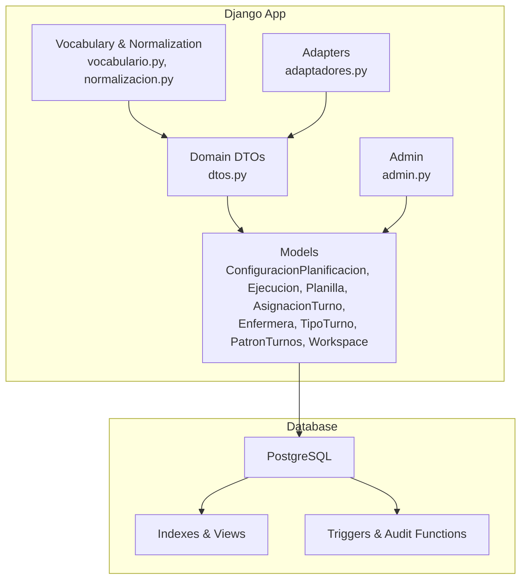
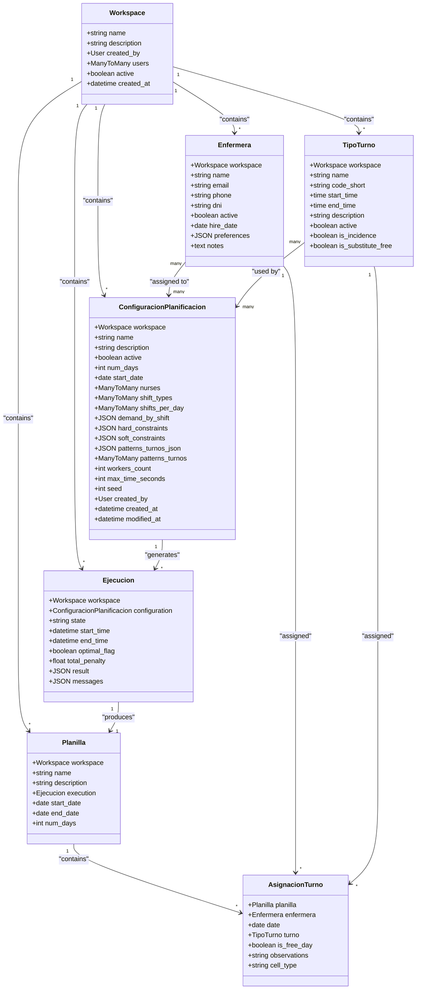
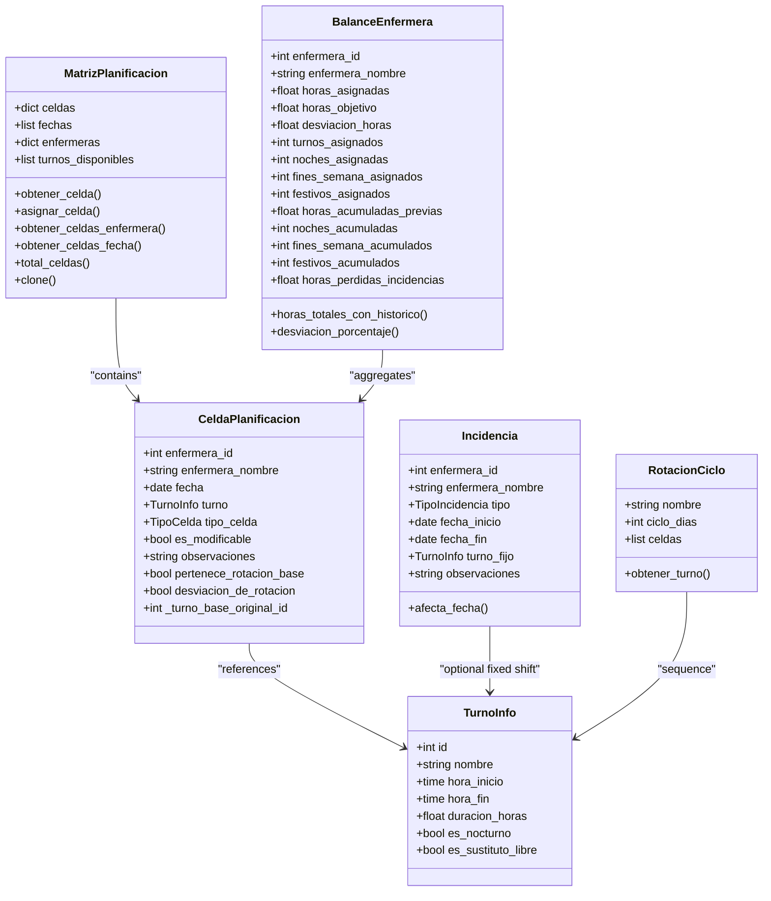
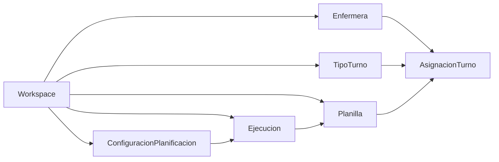
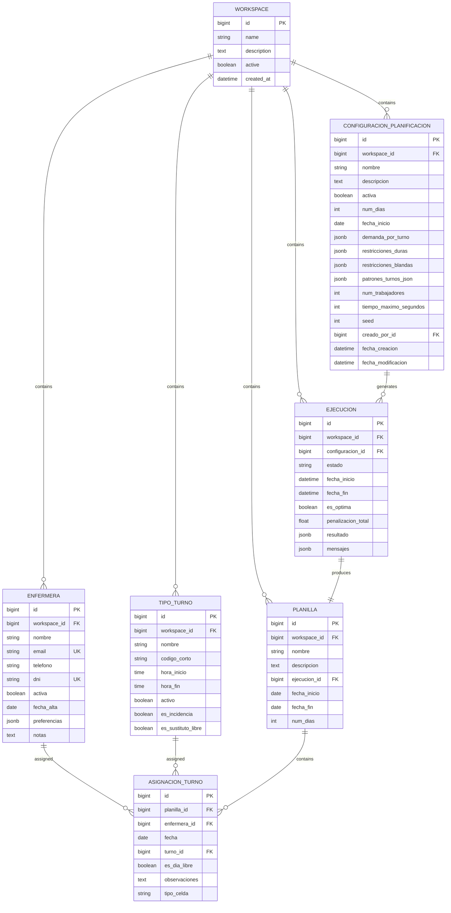

# Domain Models and Data Schema

<cite>
**Referenced Files in This Document**
- [models.py](file://turnos/models.py)
- [0009_add_domain_models.py](file://turnos/migrations/0009_add_domain_models.py)
- [0001_initial.py](file://turnos/migrations/0001_initial.py)
- [0013_tipoturno_dinamico.py](file://turnos/migrations/0013_tipoturno_dinamico.py)
- [0014_tipoturno_sustituto_libre.py](file://turnos/migrations/0014_tipoturno_sustituto_libre.py)
- [dtos.py](file://turnos/dominio/dtos.py)
- [vocabulario.py](file://turnos/dominio/vocabulario.py)
- [normalizacion.py](file://turnos/dominio/normalizacion.py)
- [adaptadores.py](file://turnos/dominio/adaptadores.py)
- [init.sql](file://docker/postgres/init.sql)
- [test_models.py](file://turnos/tests/test_models.py)
- [test_dominio/test_dtos.py](file://turnos/tests/test_dominio/test_dtos.py)
- [admin.py](file://turnos/admin.py)
- [workspace_selector.html](file://turnos/templates/includes/workspace_selector.html)
- [views.py](file://turnos/views.py)
</cite>

## Table of Contents
1. [Introduction](#introduction)
2. [Project Structure](#project-structure)
3. [Core Components](#core-components)
4. [Architecture Overview](#architecture-overview)
5. [Detailed Component Analysis](#detailed-component-analysis)
6. [Dependency Analysis](#dependency-analysis)
7. [Performance Considerations](#performance-considerations)
8. [Troubleshooting Guide](#troubleshooting-guide)
9. [Conclusion](#conclusion)
10. [Appendices](#appendices)

## Introduction
This document provides comprehensive domain model and database schema documentation for the nursing shift scheduling system. It focuses on the primary models ConfiguracionPlanificacion, Ejecucion, Planilla, AsignacionTurno, and supporting domain entities. It also documents the DTO structures used for solver integration, vocabulary normalization for constraint naming, migration history, validation patterns, access control, workspace isolation, and operational considerations such as data lifecycle and audit capabilities.

## Project Structure
The domain models are defined in the Django application’s models module and are persisted in PostgreSQL. Supporting domain objects (DTOs) live under the turnos/dominio package and are used by the planning engine. Migrations define the evolving schema, while PostgreSQL initialization scripts configure extensions, views, triggers, and maintenance functions.

**Diagram sources**
- [models.py:12-825](file://turnos/models.py#L12-L825)
- [dtos.py:1-274](file://turnos/dominio/dtos.py#L1-L274)
- [vocabulario.py:1-112](file://turnos/dominio/vocabulario.py#L1-L112)
- [normalizacion.py:1-190](file://turnos/dominio/normalizacion.py#L1-L190)
- [adaptadores.py:1-247](file://turnos/dominio/adaptadores.py#L1-L247)
- [admin.py:1-449](file://turnos/admin.py#L1-L449)
- [init.sql:1-508](file://docker/postgres/init.sql#L1-L508)

**Section sources**
- [models.py:12-825](file://turnos/models.py#L12-L825)
- [init.sql:1-508](file://docker/postgres/init.sql#L1-L508)

## Core Components
This section documents the primary domain entities and their fields, constraints, and behaviors.

- Workspace
  - Purpose: Isolates data per organization/team.
  - Key fields: name, description, created_by (User), users (ManyToMany), active, created_at.
  - Ordering: [-created_at].
  - Access control: Views restrict querysets to current workspace.

- Enfermera (Nurse)
  - Purpose: Represents a nurse resource.
  - Key fields: workspace (FK), name, email (unique), phone, dni (unique), active, hire_date, preferences (JSON), notes.
  - Ordering: [name].

- TipoTurno (Shift Type)
  - Purpose: Defines shift categories (Morning, Afternoon, Night, Free, Rest, etc.) with optional schedule and special flags.
  - Key fields: workspace (FK), name, code_short, start_time, end_time, description, active, is_incidence, is_substitute_free.
  - Constraints: Unique(name, workspace) and Unique(code_short, workspace) when workspace is not null.
  - Validation: Ensures substitute-free shifts have no schedule and are not marked as incidence; regular shifts require schedule.

- ConfiguracionPlanificacion (Planning Configuration)
  - Purpose: Encapsulates planning period, participants, shift types, demand, hard and soft constraints, solver settings, and combined patterns.
  - Key fields: workspace (FK), name, description, active, num_days, start_date, nurses (ManyToMany), shift_types (ManyToMany), shifts_per_day (ManyToMany), demand_by_shift (JSON), hard_constraints (JSON), soft_constraints (JSON), patterns_turnos_json (JSON), patterns_turnos (ManyToMany), workers_count, max_time_seconds, seed, created_by (User), created_at, modified_at.
  - Business rules: Period validated to be within min/max bounds; helper method merges JSON patterns with legacy ManyToMany patterns.

- Ejecucion (Planning Execution)
  - Purpose: Tracks a single planning run with status, timing, and results.
  - Key fields: workspace (FK), configuration (FK), state, start_time, end_time, optimal_flag, total_penalty, result (JSON), messages (JSON).
  - States: PENDING, PROCESSING, COMPLETED, INFEASIBLE, ERROR.

- Planilla (Schedule)
  - Purpose: Stores the generated schedule linked to an execution.
  - Key fields: workspace (FK), name, description, execution (OneToOne), start_date, end_date, num_days.

- AsignacionTurno (Shift Assignment)
  - Purpose: Assigns a shift or free day to a nurse for a given date.
  - Key fields: schedule (FK), nurse (FK), date, shift (FK), is_free_day, observations, cell_type (choice).
  - Uniqueness: (schedule, nurse, date).
  - Validation: If cell_type is TURN, either shift must be set or is_free_day must be true.

- Domain DTOs (Solver Integration)
  - TurnoInfo: Shift metadata for solver.
  - CeldaPlanificacion: Single cell in the planner matrix with nurse/date intersection.
  - MatrizPlanificacion: Full matrix of assignments with helpers.
  - BalanceEnfermera: Nurse workload metrics including historical totals.
  - Incidencia: Absences and fixed assignments affecting the plan.
  - RotacionCiclo: Explicit cyclic rotation pattern.
  - ResultadoPlanificacion: Solver outcome with metrics and validation info.

- Vocabulary and Normalization
  - Canonical identifiers for constraints, patterns, and priorities.
  - Legacy-to-canonical name normalization with logging.

**Section sources**
- [models.py:12-825](file://turnos/models.py#L12-L825)
- [dtos.py:1-274](file://turnos/dominio/dtos.py#L1-L274)
- [vocabulario.py:1-112](file://turnos/dominio/vocabulario.py#L1-L112)
- [normalizacion.py:1-190](file://turnos/dominio/normalizacion.py#L1-L190)

## Architecture Overview
The system separates persistence (Django models) from domain logic (DTOs). The vocabulary and normalization layer ensures consistent constraint and pattern names across legacy configurations and the solver. Workspace-based filtering and admin customization enforce access control and usability.

**Diagram sources**
- [models.py:12-825](file://turnos/models.py#L12-L825)

## Detailed Component Analysis

### ConfiguracionPlanificacion
- Purpose: Central configuration for a planning horizon.
- Fields and constraints:
  - Period validation: num_days bounded and computed end date checked.
  - Patterns: supports both dynamic JSON patterns and legacy ManyToMany patterns; helper merges both sources.
  - Solver tuning: worker count, timeout, seed.
- Business constraints:
  - Demand and constraints stored as JSON; normalization ensures canonical keys.
  - Unique constraints on workspace-scoped names/codes for shift types.

**Section sources**
- [models.py:332-480](file://turnos/models.py#L332-L480)
- [normalizacion.py:1-190](file://turnos/dominio/normalizacion.py#L1-L190)

### Ejecucion
- Purpose: Execution lifecycle tracking and solver outcomes.
- States and transitions: PENDING → PROCESSING → COMPLETED/INFEASIBLE/ERROR.
- Results: JSON result and messages; duration computed from timestamps.

**Section sources**
- [models.py:482-532](file://turnos/models.py#L482-L532)

### Planilla
- Purpose: Persisted schedule tied to a single execution.
- Derived from execution metadata and assignment records.

**Section sources**
- [models.py:534-566](file://turnos/models.py#L534-L566)

### AsignacionTurno
- Purpose: Atomic assignment of a shift or free day to a nurse on a specific date.
- Validation: Enforces that TURN cells have either a shift or are marked free.
- Indexing: Unique constraint on (planilla, enfermera, date) ensures one assignment per nurse per day per schedule.

**Section sources**
- [models.py:568-624](file://turnos/models.py#L568-L624)

### DTOs and Solver Integration
- TurnoInfo: Captures shift identity, schedule, and derived properties (nocturnal, free-type).
- CeldaPlanificacion: Core unit for solver matrices; includes metadata for rotations and snapshots.
- MatrizPlanificacion: Provides lookup, cloning, and aggregation helpers.
- BalanceEnfermera: Aggregates current and historical metrics for fairness and compliance.
- Incidencia: Supports absence types and fixed assignments.
- RotacionCiclo: Converts abstract patterns into explicit cycles.

**Diagram sources**
- [dtos.py:43-274](file://turnos/dominio/dtos.py#L43-L274)

**Section sources**
- [dtos.py:1-274](file://turnos/dominio/dtos.py#L1-L274)

### Vocabulary and Normalization
- Canonical constraint and pattern names ensure consistent solver behavior.
- Legacy names are normalized to canonical identifiers with logging.
- Priority lexicon defines solver weightings.

**Section sources**
- [vocabulario.py:1-112](file://turnos/dominio/vocabulario.py#L1-L112)
- [normalizacion.py:1-190](file://turnos/dominio/normalizacion.py#L1-L190)

### Access Control and Workspace Isolation
- Workspace model links users to isolated datasets.
- Admin restricts visibility to current workspace.
- Frontend workspace selector updates session and reloads page.
- Views filter querysets using current workspace.

**Section sources**
- [models.py:12-28](file://turnos/models.py#L12-L28)
- [admin.py:2079-2092](file://turnos/admin.py#L2079-L2092)
- [workspace_selector.html:1-18](file://turnos/templates/includes/workspace_selector.html#L1-L18)
- [views.py:2079-2092](file://turnos/views.py#L2079-L2092)

## Dependency Analysis
The following diagram shows key dependencies among models and the impact of migrations on schema evolution.

**Diagram sources**
- [models.py:12-825](file://turnos/models.py#L12-L825)

Additional migrations illustrate schema evolution:
- Initial creation of core models.
- Addition of domain models (contract, rotation, balance, incidence).
- Enhancements to TipoTurno (dynamic flags and constraints).

**Section sources**
- [0001_initial.py:1-140](file://turnos/migrations/0001_initial.py#L1-L140)
- [0009_add_domain_models.py:1-123](file://turnos/migrations/0009_add_domain_models.py#L1-L123)
- [0013_tipoturno_dinamico.py:1-47](file://turnos/migrations/0013_tipoturno_dinamico.py#L1-L47)
- [0014_tipoturno_sustituto_libre.py:1-19](file://turnos/migrations/0014_tipoturno_sustituto_libre.py#L1-L19)

## Performance Considerations
- PostgreSQL extensions and functions:
  - Extensions: uuid-ossp, pg_trgm, unaccent, hstore, pgcrypto.
  - Text search configuration for Spanish without accents.
  - Utility functions for slug generation, fuzzy search, statistics, cleanup, and reindexing.
- Indexing and views:
  - Additional GIN trigram indexes for searchable fields.
  - Useful views for active nurses, configuration stats, and execution details.
- Maintenance:
  - Autovacuum and analyze settings tuned for critical tables.
  - Scheduled maintenance functions for statistics and reindexing.

**Section sources**
- [init.sql:1-508](file://docker/postgres/init.sql#L1-L508)

## Troubleshooting Guide
- Model validation errors:
  - TipoTurno: Substitute-free shifts cannot have schedule or be marked as incidence; regular shifts require start/end times.
  - AsignacionTurno: TURN cells must specify a shift or mark as free.
  - ConfiguracionPlanificacion: Period must be within configured bounds.
- Admin and workspace:
  - Ensure current workspace is selected; otherwise filtered querysets return empty results.
  - Use admin actions to review execution results and statuses.
- Tests:
  - Unit tests validate shift duration computation and DTO behaviors.

**Section sources**
- [models.py:126-168](file://turnos/models.py#L126-L168)
- [models.py:617-623](file://turnos/models.py#L617-L623)
- [models.py:425-456](file://turnos/models.py#L425-L456)
- [admin.py:182-231](file://turnos/admin.py#L182-L231)
- [test_models.py:1-36](file://turnos/tests/test_models.py#L1-L36)
- [test_dominio/test_dtos.py:1-238](file://turnos/tests/test_dominio/test_dtos.py#L1-L238)

## Conclusion
The system’s domain model centers on planning configuration, execution, schedules, and assignments, with robust validation and normalization for constraints and patterns. Workspace isolation and admin controls ensure secure, tenant-aware operation. PostgreSQL enhancements and maintenance routines support scalability and operability. The DTO layer cleanly separates solver logic from persistence, enabling maintainable evolution of planning rules.

## Appendices

### Entity Relationship Diagram (ERD)

**Diagram sources**
- [models.py:12-825](file://turnos/models.py#L12-L825)
- [0001_initial.py:1-140](file://turnos/migrations/0001_initial.py#L1-L140)
- [0009_add_domain_models.py:1-123](file://turnos/migrations/0009_add_domain_models.py#L1-L123)

### Migration Strategy
- Initial schema established with core models.
- Domain models added via dedicated migration to introduce contract, rotation, balance, and incidence entities.
- TipoTurno evolved to support dynamic flags and uniqueness constraints scoped to workspace.

**Section sources**
- [0001_initial.py:1-140](file://turnos/migrations/0001_initial.py#L1-L140)
- [0009_add_domain_models.py:1-123](file://turnos/migrations/0009_add_domain_models.py#L1-L123)
- [0013_tipoturno_dinamico.py:1-47](file://turnos/migrations/0013_tipoturno_dinamico.py#L1-L47)
- [0014_tipoturno_sustituto_libre.py:1-19](file://turnos/migrations/0014_tipoturno_sustituto_libre.py#L1-L19)

### Data Lifecycle Management and Retention
- Cleanup function removes old executions after a configurable threshold.
- Statistics functions aggregate execution metrics for reporting.
- Reindexing and analyze functions support long-term performance.

**Section sources**
- [init.sql:119-138](file://docker/postgres/init.sql#L119-L138)
- [init.sql:139-161](file://docker/postgres/init.sql#L139-L161)
- [init.sql:352-382](file://docker/postgres/init.sql#L352-L382)

### Security and Audit
- Row Level Security (RLS) comments indicate policy readiness.
- Audit trigger captures create/update/delete events with user context.
- Read-only role provisioning included for safe reporting access.

**Section sources**
- [init.sql:265-276](file://docker/postgres/init.sql#L265-L276)
- [init.sql:281-347](file://docker/postgres/init.sql#L281-L347)
- [init.sql:398-417](file://docker/postgres/init.sql#L398-L417)