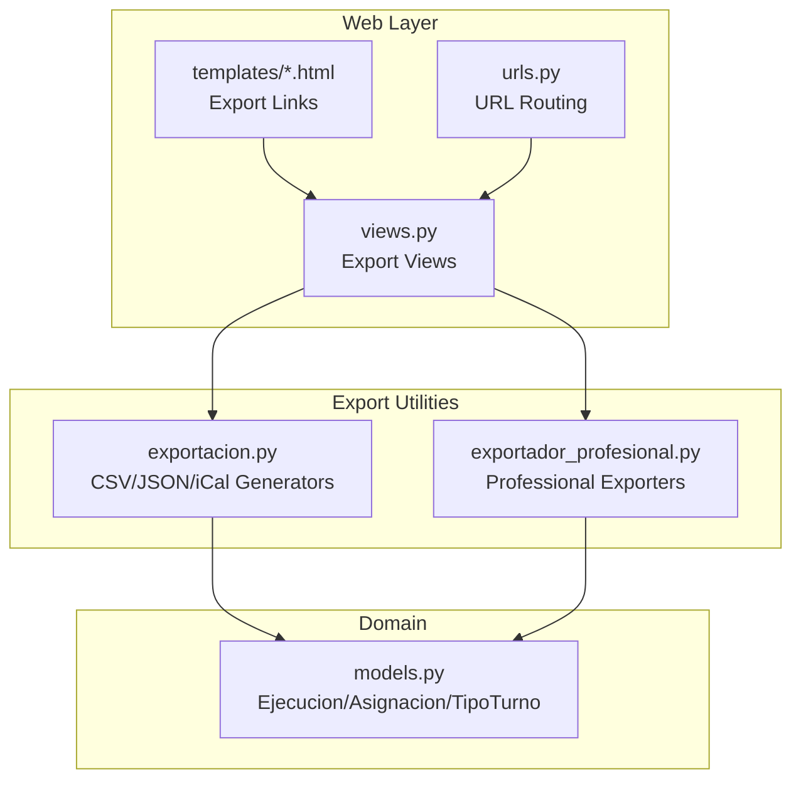
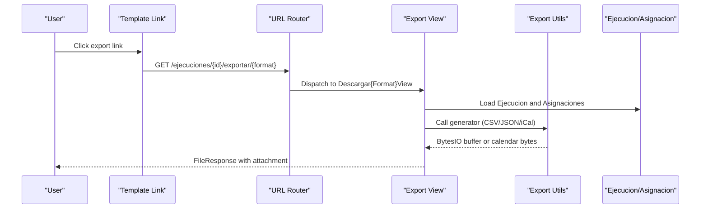
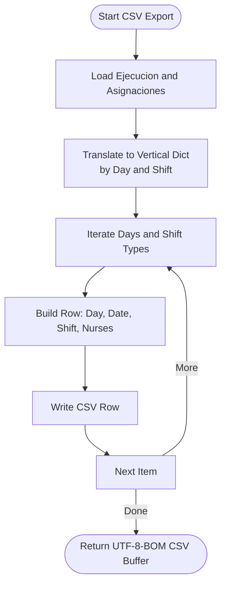
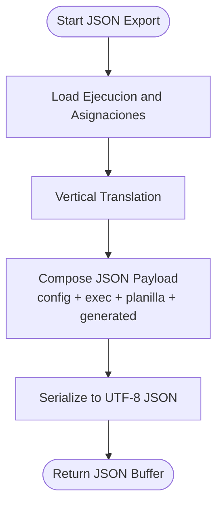
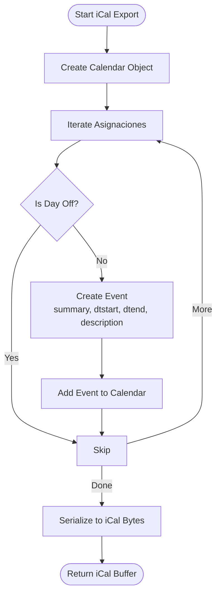
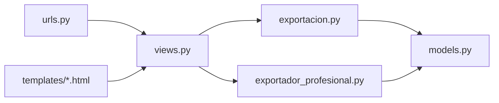

# CSV, JSON, and iCalendar Export

<cite>
**Referenced Files in This Document**
- [exportacion.py](file://turnos/utils/exportacion.py)
- [exportador_profesional.py](file://turnos/utils/exportador_profesional.py)
- [views.py](file://turnos/views.py)
- [urls.py](file://turnos/urls.py)
- [ejecucion_detail.html](file://turnos/templates/turnos/ejecucion_detail.html)
- [models.py](file://turnos/models.py)
</cite>

## Table of Contents
1. [Introduction](#introduction)
2. [Project Structure](#project-structure)
3. [Core Components](#core-components)
4. [Architecture Overview](#architecture-overview)
5. [Detailed Component Analysis](#detailed-component-analysis)
6. [Dependency Analysis](#dependency-analysis)
7. [Performance Considerations](#performance-considerations)
8. [Troubleshooting Guide](#troubleshooting-guide)
9. [Conclusion](#conclusion)
10. [Appendices](#appendices)

## Introduction
This document explains the alternative export formats supported by the system: CSV, JSON, and iCalendar (iCal). It covers:
- CSV export with semicolon delimiters and UTF-8 encoding, including data structure and formatting options
- JSON export with hierarchical data suitable for APIs and integrations
- iCalendar export for calendar applications, including event creation, timezone handling, and recurrence patterns
It also documents the data transformation processes, encoding considerations, and practical use cases with integration patterns for external systems.

## Project Structure
The export functionality is implemented in a small set of focused modules:
- Utility functions for export generation live in a dedicated module
- Web views orchestrate export requests and return appropriate HTTP responses
- URL routing exposes endpoints for each format
- Templates provide user-facing export links
- Domain models define the data used by exporters

**Diagram sources**
- [views.py:2294-2456](file://turnos/views.py#L2294-L2456)
- [urls.py:45-50](file://turnos/urls.py#L45-L50)
- [exportacion.py:531-627](file://turnos/utils/exportacion.py#L531-L627)
- [exportador_profesional.py:256-329](file://turnos/utils/exportador_profesional.py#L256-L329)
- [models.py:1-200](file://turnos/models.py#L1-L200)

**Section sources**
- [views.py:2294-2456](file://turnos/views.py#L2294-L2456)
- [urls.py:45-50](file://turnos/urls.py#L45-L50)
- [exportacion.py:531-627](file://turnos/utils/exportacion.py#L531-L627)
- [exportador_profesional.py:256-329](file://turnos/utils/exportador_profesional.py#L256-L329)
- [models.py:1-200](file://turnos/models.py#L1-L200)

## Core Components
- CSV exporter: Generates a semicolon-delimited CSV with UTF-8-BOM encoding, structured as day, date, shift, and assigned nurses
- JSON exporter: Produces a hierarchical JSON payload containing configuration, execution metadata, and transformed plan data
- iCalendar exporter: Creates calendar events for each shift assignment, handling midnight-crossing shifts and basic recurrence patterns

Key transformations:
- CSV: Uses a vertical translation of assignments into rows per day-shift combination
- JSON: Wraps the vertical translation plus configuration and execution metadata
- iCal: Converts each assignment into an event with start/end timestamps and descriptions

**Section sources**
- [exportacion.py:531-627](file://turnos/utils/exportacion.py#L531-L627)
- [views.py:2360-2456](file://turnos/views.py#L2360-L2456)

## Architecture Overview
The export pipeline follows a consistent pattern:
- A user triggers an export via a template link
- The URL routes to a view class
- The view retrieves the execution and delegates to a generator function
- The generator builds a buffer (CSV/JSON) or calendar object (iCal)
- The view wraps the buffer in a FileResponse or returns calendar content

**Diagram sources**
- [urls.py:45-50](file://turnos/urls.py#L45-L50)
- [views.py:2360-2456](file://turnos/views.py#L2360-L2456)
- [exportacion.py:531-627](file://turnos/utils/exportacion.py#L531-L627)

## Detailed Component Analysis

### CSV Export
- Purpose: Produce a human-readable, spreadsheet-friendly CSV for operational use
- Delimiter and encoding: Semicolon-delimited with UTF-8-BOM encoding
- Data structure:
  - Header row: Day, Date, Shift, Assigned Nurses
  - One row per day-shift combination
  - Shift values normalized to uppercase display names
  - Nurse lists separated by commas
- Transformation process:
  - Translates ORM assignments into a vertical dictionary keyed by day index and shift type
  - Iterates days and shift types to write rows
- Encoding considerations:
  - Text wrapper configured with UTF-8-BOM for compatibility with spreadsheet applications
- Use cases:
  - Manual review and reconciliation
  - Batch processing with external tools
  - Import into internal systems requiring delimited text

**Diagram sources**
- [exportacion.py:531-557](file://turnos/utils/exportacion.py#L531-L557)

**Section sources**
- [exportacion.py:531-557](file://turnos/utils/exportacion.py#L531-L557)
- [views.py:2360-2391](file://turnos/views.py#L2360-L2391)
- [ejecucion_detail.html:123-131](file://turnos/templates/turnos/ejecucion_detail.html#L123-L131)

### JSON Export
- Purpose: Provide a structured, hierarchical payload for API consumption and system integration
- Data structure:
  - Top-level keys: configuration, execution, planilla, generated
  - configuration: plan name and identifying attributes
  - execution: execution state and identifier
  - planilla: vertical translation of assignments suitable for downstream processing
  - generated: ISO timestamp of export
- Transformation process:
  - Reuses the vertical translation function
  - Wraps the result with configuration and execution metadata
  - Serializes to JSON with UTF-8 encoding
- Encoding considerations:
  - Ensures ASCII-safe serialization while preserving Unicode in fields
- Use cases:
  - Integrating with external planning systems
  - API-driven dashboards and analytics
  - Audit trails and change tracking

**Diagram sources**
- [exportacion.py:559-582](file://turnos/utils/exportacion.py#L559-L582)

**Section sources**
- [exportacion.py:559-582](file://turnos/utils/exportacion.py#L559-L582)
- [views.py:2393-2424](file://turnos/views.py#L2393-L2424)
- [ejecucion_detail.html:128-130](file://turnos/templates/turnos/ejecucion_detail.html#L128-L130)

### iCalendar (iCal) Export
- Purpose: Enable calendar application integration by exporting shift events
- Data structure:
  - Calendar product and version identifiers
  - Events per shift assignment
  - Event summary, start/end timestamps, and description
- Transformation process:
  - Builds a calendar object
  - Iterates assignments and creates events
  - Handles midnight-crossing shifts by extending the end date
  - Writes calendar bytes to a buffer
- Timezone handling:
  - Uses naive datetime objects combined with local dates
  - No explicit timezone property is set; consumers should interpret as local
- Recurrence patterns:
  - Events are individual instances; no recurring series are generated
- Use cases:
  - Import into Outlook, Google Calendar, etc.
  - Team-wide visibility of scheduled shifts
  - Integration with HR or scheduling tools that accept iCal

**Diagram sources**
- [exportacion.py:584-627](file://turnos/utils/exportacion.py#L584-L627)

**Section sources**
- [exportacion.py:584-627](file://turnos/utils/exportacion.py#L584-L627)
- [views.py:2426-2456](file://turnos/views.py#L2426-L2456)
- [models.py:60-200](file://turnos/models.py#L60-L200)

## Dependency Analysis
- Views depend on:
  - URL routing for dispatch
  - Export utility functions for buffer generation
  - Domain models for data retrieval
- Export utilities depend on:
  - ORM models for plan data
  - Third-party libraries for specialized formats (optional)
- Coupling and cohesion:
  - Export logic is centralized in utility functions, promoting reuse
  - Views remain thin, focusing on HTTP concerns
- External dependencies:
  - CSV and JSON rely on built-in libraries
  - iCal relies on the icalendar library if available

**Diagram sources**
- [views.py:2294-2456](file://turnos/views.py#L2294-L2456)
- [urls.py:45-50](file://turnos/urls.py#L45-L50)
- [exportacion.py:531-627](file://turnos/utils/exportacion.py#L531-L627)
- [exportador_profesional.py:256-329](file://turnos/utils/exportador_profesional.py#L256-L329)
- [models.py:1-200](file://turnos/models.py#L1-L200)

**Section sources**
- [views.py:2294-2456](file://turnos/views.py#L2294-L2456)
- [urls.py:45-50](file://turnos/urls.py#L45-L50)
- [exportacion.py:531-627](file://turnos/utils/exportacion.py#L531-L627)
- [exportador_profesional.py:256-329](file://turnos/utils/exportador_profesional.py#L256-L329)
- [models.py:1-200](file://turnos/models.py#L1-L200)

## Performance Considerations
- CSV and JSON:
  - Both iterate assignments once and stream writes; memory footprint scales linearly with the number of assignments
  - UTF-8-BOM for CSV ensures compatibility without significant overhead
- iCal:
  - Each assignment becomes an event; large plans produce proportionally larger calendar files
  - Midnight-crossing logic adds minimal computation
- Recommendations:
  - Prefer streaming responses for large exports
  - Consider pagination or filtering for very large datasets
  - Cache repeated exports when feasible

## Troubleshooting Guide
Common issues and resolutions:
- Missing optional dependencies:
  - Excel and PDF exports require additional packages; CSV and JSON do not
  - iCal export requires the icalendar package; otherwise, an import error is raised
- Execution not found:
  - Views redirect to the list/detail page with an error message when the execution does not exist
- Encoding problems:
  - CSV uses UTF-8-BOM via a text wrapper; ensure clients support BOM
  - JSON uses UTF-8; ensure consuming systems handle Unicode properly
- Calendar import issues:
  - Events are created as naive datetimes; confirm target calendar interprets them as local
  - Recurrence is not applied; if recurring series are required, transform events post-export

**Section sources**
- [exportacion.py:43-48](file://turnos/utils/exportacion.py#L43-L48)
- [views.py:2317-2324](file://turnos/views.py#L2317-L2324)
- [views.py:2383-2390](file://turnos/views.py#L2383-L2390)
- [views.py:2416-2423](file://turnos/views.py#L2416-L2423)
- [views.py:2449-2456](file://turnos/views.py#L2449-L2456)

## Conclusion
The system provides three complementary export formats:
- CSV for spreadsheets and batch processing
- JSON for APIs and integrations
- iCalendar for calendar applications

Each format leverages shared data transformations and is exposed through consistent URL endpoints and views. The exporters are modular, maintainable, and designed for real-world operational needs.

## Appendices

### Integration Patterns
- CSV:
  - Use semicolon-delimited files for importing into ERP or payroll systems
  - Validate UTF-8-BOM handling in your ingestion pipeline
- JSON:
  - Accept the hierarchical structure for programmatic consumption
  - Use the generated timestamp for audit and deduplication
- iCal:
  - Import into calendar clients; note that events are individual instances
  - For recurring series, apply client-specific recurrence rules after import

### Example Endpoints
- CSV: GET /ejecuciones/{id}/exportar/csv/
- JSON: GET /ejecuciones/{id}/exportar/json/
- iCal: GET /ejecuciones/{id}/exportar/ical/

These endpoints are routed through the view classes that load the execution, delegate to the appropriate generator, and return a downloadable file response.

**Section sources**
- [urls.py:45-50](file://turnos/urls.py#L45-L50)
- [views.py:2360-2456](file://turnos/views.py#L2360-L2456)