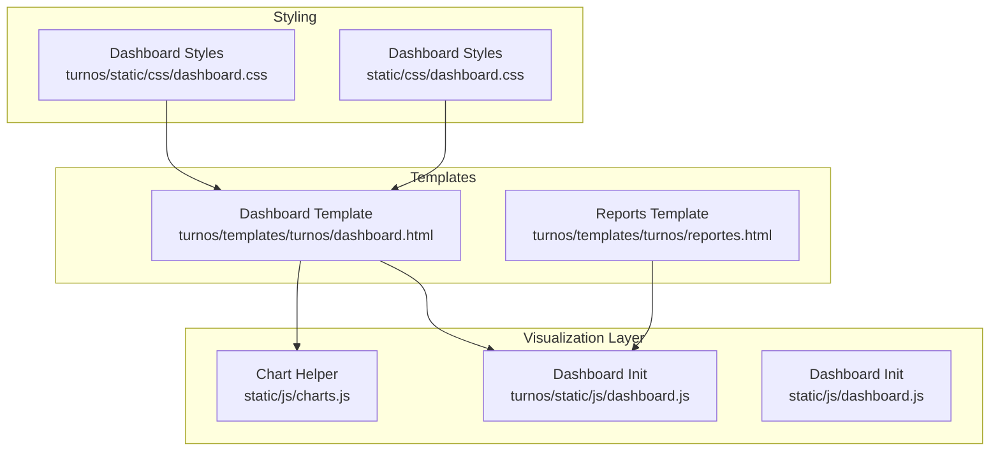
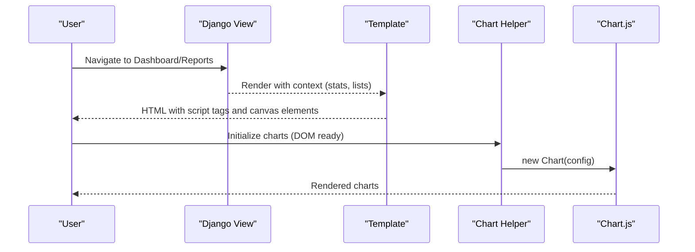
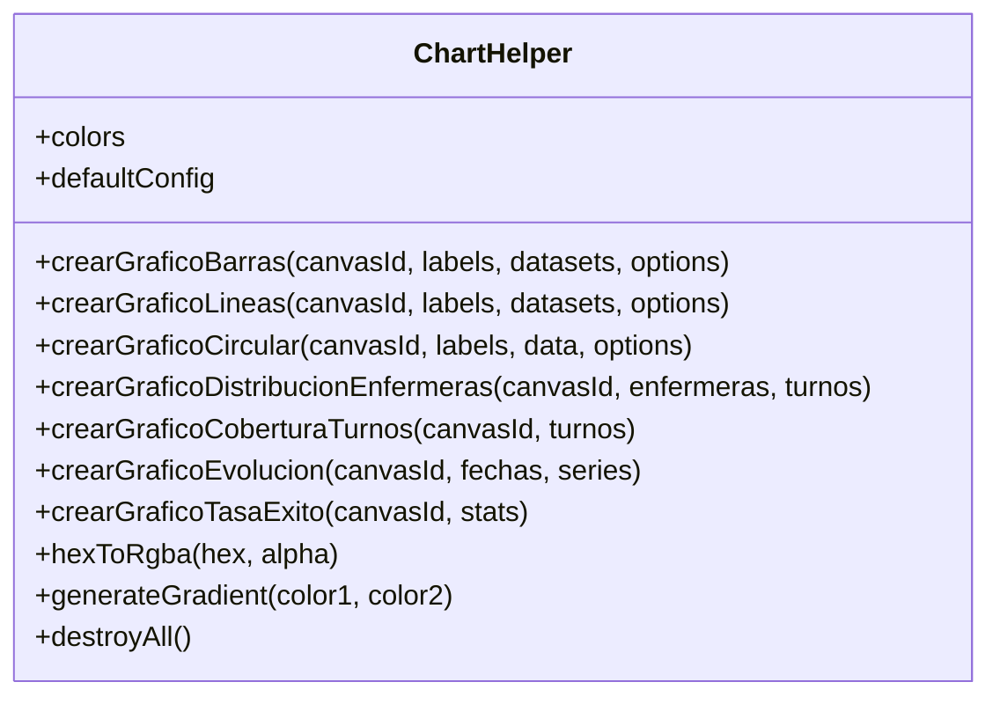
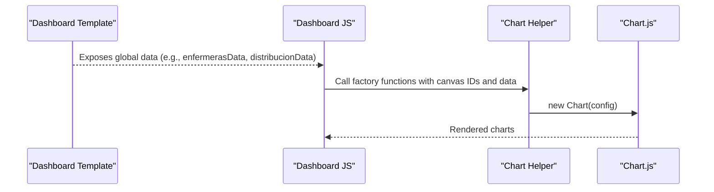
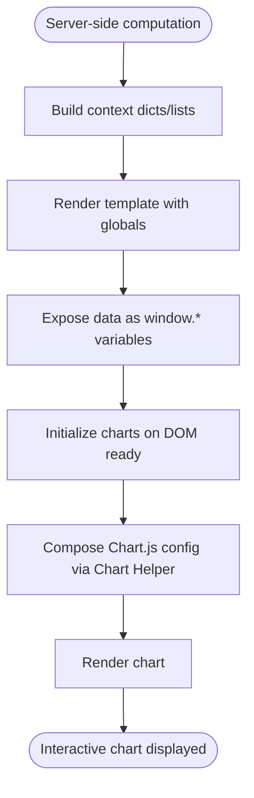
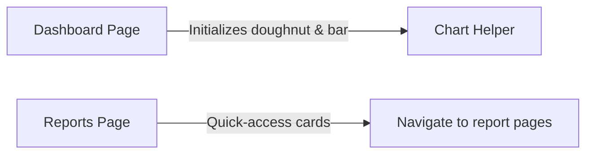
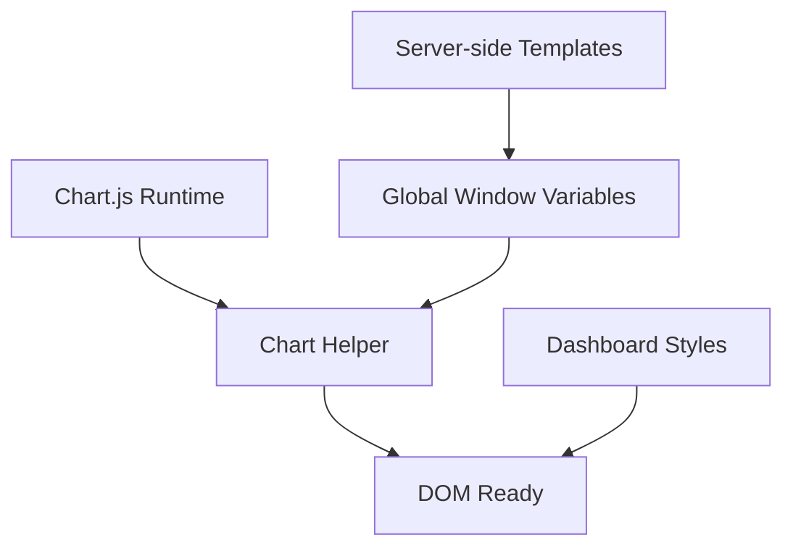

# Data Visualization and Charts

<cite>
**Referenced Files in This Document**
- [charts.js](file://static/js/charts.js)
- [charts.js](file://turnos/static/js/charts.js)
- [dashboard.js](file://static/js/dashboard.js)
- [dashboard.js](file://turnos/static/js/dashboard.js)
- [dashboard.html](file://turnos/templates/turnos/dashboard.html)
- [dashboard.css](file://static/css/dashboard.css)
- [dashboard.css](file://turnos/static/css/dashboard.css)
- [reportes.html](file://turnos/templates/turnos/reportes.html)
</cite>

## Table of Contents
1. [Introduction](#introduction)
2. [Project Structure](#project-structure)
3. [Core Components](#core-components)
4. [Architecture Overview](#architecture-overview)
5. [Detailed Component Analysis](#detailed-component-analysis)
6. [Dependency Analysis](#dependency-analysis)
7. [Performance Considerations](#performance-considerations)
8. [Troubleshooting Guide](#troubleshooting-guide)
9. [Conclusion](#conclusion)
10. [Appendices](#appendices)

## Introduction
This document describes the data visualization system built with Chart.js in the project. It explains how chart generation functions are structured, which chart types are supported (bar charts, pie/donut charts, line graphs), and how configuration options are applied. It also documents the data processing pipeline from execution results to chart-ready datasets, dashboard widget implementations, real-time update strategies, interactive features, customization options, responsive design, and integration points across pages and reports. Finally, it covers performance considerations for large datasets and browser compatibility.

## Project Structure
The visualization system is composed of:
- A reusable JavaScript helper module that encapsulates Chart.js configuration and creation functions.
- Dashboard-specific initialization scripts and templates.
- Stylesheets that define responsive layouts and chart containers.
- Report pages that present aggregated statistics and navigation to detailed charts.

**Diagram sources**
- [charts.js:1-275](file://static/js/charts.js#L1-L275)
- [charts.js:1-275](file://turnos/static/js/charts.js#L1-L275)
- [dashboard.js:1-61](file://turnos/static/js/dashboard.js#L1-L61)
- [dashboard.js:1-77](file://static/js/dashboard.js#L1-L77)
- [dashboard.html:1-189](file://turnos/templates/turnos/dashboard.html#L1-L189)
- [dashboard.css:1-607](file://turnos/static/css/dashboard.css#L1-L607)
- [dashboard.css:1-607](file://static/css/dashboard.css#L1-L607)
- [reportes.html:1-298](file://turnos/templates/turnos/reportes.html#L1-L298)

**Section sources**
- [charts.js:1-275](file://static/js/charts.js#L1-L275)
- [charts.js:1-275](file://turnos/static/js/charts.js#L1-L275)
- [dashboard.js:1-61](file://turnos/static/js/dashboard.js#L1-L61)
- [dashboard.js:1-77](file://static/js/dashboard.js#L1-L77)
- [dashboard.html:1-189](file://turnos/templates/turnos/dashboard.html#L1-L189)
- [dashboard.css:1-607](file://turnos/static/css/dashboard.css#L1-L607)
- [dashboard.css:1-607](file://static/css/dashboard.css#L1-L607)
- [reportes.html:1-298](file://turnos/templates/turnos/reportes.html#L1-L298)

## Core Components
- Chart Helper: Provides centralized configuration defaults and factory functions for bar, line, and pie/donut charts. Includes convenience functions for domain-specific charts such as distribution by nurse, coverage by shift type, evolution over time, and success rate.
- Dashboard Initialization: Initializes doughnut and bar charts on the dashboard page using global data exposed by the server-side template rendering.
- Templates and Styles: Define chart container elements and responsive layout rules for charts.

Key capabilities:
- Unified theme colors and typography for legends and tooltips.
- Responsive charts with maintainable aspect ratios.
- Predefined scales and grid behavior for numeric axes.
- Gradient generation placeholder and hex-to-RGB conversion helpers.
- Global destruction utility to clean up instances when needed.

**Section sources**
- [charts.js:8-275](file://static/js/charts.js#L8-L275)
- [charts.js:8-275](file://turnos/static/js/charts.js#L8-L275)
- [dashboard.js:4-60](file://turnos/static/js/dashboard.js#L4-L60)
- [dashboard.html:1-189](file://turnos/templates/turnos/dashboard.html#L1-L189)
- [dashboard.css:296-321](file://turnos/static/css/dashboard.css#L296-L321)

## Architecture Overview
The visualization architecture follows a layered pattern:
- Data preparation occurs server-side (Django views and templates) and is passed to client-side templates as global variables.
- The Chart Helper constructs Chart.js configurations and instantiates charts.
- Dashboard and report pages embed chart canvases and initialize charts after DOM ready.
- Styles define responsive containers and grid-based layouts.

**Diagram sources**
- [dashboard.js:4-60](file://turnos/static/js/dashboard.js#L4-L60)
- [charts.js:59-178](file://static/js/charts.js#L59-L178)
- [charts.js:59-178](file://turnos/static/js/charts.js#L59-L178)
- [dashboard.html:1-189](file://turnos/templates/turnos/dashboard.html#L1-L189)
- [reportes.html:1-298](file://turnos/templates/turnos/reportes.html#L1-L298)

## Detailed Component Analysis

### Chart Helper: Configuration and Factory Functions
The Chart Helper centralizes:
- Theme colors and default plugin configuration (legend and tooltip).
- Chart factories for bar, line, and pie/donut charts.
- Domain-specific chart creators for nurses’ distribution, shift coverage, evolution, and success rates.
- Utility functions for color conversions and instance cleanup.

**Diagram sources**
- [charts.js:8-275](file://static/js/charts.js#L8-L275)
- [charts.js:8-275](file://turnos/static/js/charts.js#L8-L275)

**Section sources**
- [charts.js:8-275](file://static/js/charts.js#L8-L275)
- [charts.js:8-275](file://turnos/static/js/charts.js#L8-L275)

### Bar Charts
- Purpose: Compare quantities across categories (e.g., number of shifts per nurse).
- Defaults: beginAtZero on Y-axis, stepped ticks, rounded bars, subtle grid lines.
- Options override: Accepts a configuration object to customize scales, plugins, and appearance.

**Section sources**
- [charts.js:59-99](file://static/js/charts.js#L59-L99)
- [charts.js:59-99](file://turnos/static/js/charts.js#L59-L99)

### Line Graphs
- Purpose: Show trends over time (e.g., metrics across dates).
- Defaults: Fill area under curve, curved lines (tension), point markers, semi-transparent fill.
- Options override: Same as bar charts, with axis-specific tuning.

**Section sources**
- [charts.js:104-144](file://static/js/charts.js#L104-L144)
- [charts.js:104-144](file://turnos/static/js/charts.js#L104-L144)

### Pie and Doughnut Charts
- Purpose: Show proportional distributions (e.g., shift coverage by type, success/failure rates).
- Defaults: Legend positioning, border colors, configurable inner radius for doughnuts.
- Options override: Type selection (pie or doughnut), custom color arrays.

**Section sources**
- [charts.js:149-178](file://static/js/charts.js#L149-L178)
- [charts.js:149-178](file://turnos/static/js/charts.js#L149-L178)

### Domain-Specific Chart Builders
- Distribution by nurse: Transforms nurse list into labels and totals, applies gradient placeholder.
- Coverage by shift: Uses predefined day/night colors for a doughnut chart.
- Evolution over time: Builds multiple series with indexed colors.
- Success rate: Maps counts to segments with semantic colors.

**Section sources**
- [charts.js:183-238](file://static/js/charts.js#L183-L238)
- [charts.js:183-238](file://turnos/static/js/charts.js#L183-L238)

### Dashboard Initialization
Two initialization scripts exist:
- A generic dashboard script initializes cards and counters.
- A Chart.js-focused script initializes doughnut and bar charts on the dashboard page using global data exposed by the template.

**Diagram sources**
- [dashboard.js:4-60](file://turnos/static/js/dashboard.js#L4-L60)
- [dashboard.html:1-189](file://turnos/templates/turnos/dashboard.html#L1-L189)

**Section sources**
- [dashboard.js:4-60](file://turnos/static/js/dashboard.js#L4-L60)
- [dashboard.js:5-77](file://static/js/dashboard.js#L5-L77)
- [dashboard.html:1-189](file://turnos/templates/turnos/dashboard.html#L1-L189)

### Data Processing Pipeline: From Execution Results to Chart-ready Datasets
- Server-side aggregation: Views compute statistics and lists (e.g., recent executions, nurse counts).
- Template exposure: Context variables expose arrays and counts to the client.
- Client-side transformation: Scripts map server data into Chart.js labels and datasets.
- Chart instantiation: Chart Helper composes configurations and renders charts.

**Diagram sources**
- [dashboard.html:56-95](file://turnos/templates/turnos/dashboard.html#L56-L95)
- [dashboard.js:4-60](file://turnos/static/js/dashboard.js#L4-L60)
- [charts.js:59-178](file://static/js/charts.js#L59-L178)

**Section sources**
- [dashboard.html:56-95](file://turnos/templates/turnos/dashboard.html#L56-L95)
- [dashboard.js:4-60](file://turnos/static/js/dashboard.js#L4-L60)
- [charts.js:59-178](file://static/js/charts.js#L59-L178)

### Interactive Features and Real-time Updates
- Clickable stat cards: Navigate to related pages on click.
- Hover effects: Cards scale slightly for interactivity.
- Placeholder for AJAX refresh: Function exists to reload statistics via AJAX.

Note: There is no active polling or WebSocket integration in the current implementation. Real-time updates would require adding periodic fetches and updating chart datasets.

**Section sources**
- [dashboard.js:46-77](file://static/js/dashboard.js#L46-L77)
- [dashboard.js:4-60](file://turnos/static/js/dashboard.js#L4-L60)

### Customization Options
- Colors: Centralized palette for primary, secondary, semantic statuses, and shift-specific hues.
- Typography: Consistent font sizes and families for legends and tooltips.
- Scales: Numeric axes configured with grid visibility and zero-based baseline.
- Tooltips and legends: Unified styling and positioning.
- Background fills: Semi-transparent fills for line charts; gradients are placeholders.

**Section sources**
- [charts.js:12-54](file://static/js/charts.js#L12-L54)
- [charts.js:12-54](file://turnos/static/js/charts.js#L12-L54)

### Responsive Design
- Grid-based chart containers: Responsive grid layout adapts to screen size.
- Container heights: Fixed heights with media queries for smaller screens.
- Axis grid toggles: X-axis grids disabled for cleaner looks on small screens.

**Section sources**
- [dashboard.css:296-321](file://turnos/static/css/dashboard.css#L296-L321)
- [dashboard.css:517-583](file://turnos/static/css/dashboard.css#L517-L583)
- [dashboard.css:517-583](file://static/css/dashboard.css#L517-L583)

### Integration Examples Across Pages and Reports
- Dashboard: Two charts initialized on the dashboard page using global data.
- Reports: A landing page with quick-access cards to specialized reports; animations and KPI cards.

**Diagram sources**
- [dashboard.js:4-60](file://turnos/static/js/dashboard.js#L4-L60)
- [reportes.html:124-176](file://turnos/templates/turnos/reportes.html#L124-L176)

**Section sources**
- [dashboard.js:4-60](file://turnos/static/js/dashboard.js#L4-L60)
- [reportes.html:124-176](file://turnos/templates/turnos/reportes.html#L124-L176)

## Dependency Analysis
- Chart.js runtime: The helper relies on Chart.js being loaded globally.
- DOM readiness: Chart instantiation occurs after DOMContentLoaded.
- Global data exposure: Server-side templates expose data as window-scoped variables for client consumption.
- Styling dependencies: Chart containers rely on CSS grid and fixed heights.

**Diagram sources**
- [charts.js:59-178](file://static/js/charts.js#L59-L178)
- [dashboard.js:4-60](file://turnos/static/js/dashboard.js#L4-L60)
- [dashboard.html:1-189](file://turnos/templates/turnos/dashboard.html#L1-L189)
- [dashboard.css:296-321](file://turnos/static/css/dashboard.css#L296-L321)

**Section sources**
- [charts.js:59-178](file://static/js/charts.js#L59-L178)
- [dashboard.js:4-60](file://turnos/static/js/dashboard.js#L4-L60)
- [dashboard.html:1-189](file://turnos/templates/turnos/dashboard.html#L1-L189)
- [dashboard.css:296-321](file://turnos/static/css/dashboard.css#L296-L321)

## Performance Considerations
- Large datasets: Prefer aggregating data server-side to reduce payload and client-side processing.
- Chart updates: Use dataset updates instead of recreating charts when possible.
- Destroy instances: Use the global destroy utility to free memory when navigating away from pages with many charts.
- Rendering frequency: Debounce resize handlers and avoid frequent re-renders during window resizes.
- Browser compatibility: Ensure Chart.js version supports target browsers; test on older environments if necessary.

[No sources needed since this section provides general guidance]

## Troubleshooting Guide
- Canvas not found: Ensure the canvas element exists and the ID matches the one passed to the factory function.
- No data rendered: Verify that labels and datasets are populated and that global data is exposed by the template.
- Styling issues: Confirm that chart containers have explicit heights and that responsive CSS is loaded.
- Tooltip/legend misalignment: Adjust defaultConfig overrides for plugins to match desired layout.
- Memory leaks: Call the destroy utility when unloading pages with charts.

**Section sources**
- [charts.js:59-99](file://static/js/charts.js#L59-L99)
- [charts.js:59-99](file://turnos/static/js/charts.js#L59-L99)
- [charts.js:262-266](file://static/js/charts.js#L262-L266)
- [dashboard.css:317-321](file://turnos/static/css/dashboard.css#L317-L321)

## Conclusion
The visualization system leverages a centralized Chart Helper to standardize configuration and simplify chart creation across bar, line, and pie/donut charts. The dashboard integrates charts using global data exposed by templates, while responsive styles ensure usability across devices. Extending the system involves adding new domain-specific builders, integrating AJAX-driven updates, and optimizing for performance with large datasets.

[No sources needed since this section summarizes without analyzing specific files]

## Appendices

### Supported Chart Types and Use Cases
- Bar charts: Compare discrete quantities (e.g., shifts per nurse).
- Line graphs: Display trends over time.
- Pie/Doughnut: Show proportions (coverage by shift type, success/failure breakdown).

**Section sources**
- [charts.js:59-178](file://static/js/charts.js#L59-L178)
- [charts.js:59-178](file://turnos/static/js/charts.js#L59-L178)

### Configuration Options Reference
- Default plugins: Legend position and tooltip styling.
- Scales: Y-axis begins at zero, grid toggles, tick steps.
- Colors: Centralized palette and hex-to-RGB conversion helper.
- Destroy utility: Cleans up all Chart.js instances.

**Section sources**
- [charts.js:27-54](file://static/js/charts.js#L27-L54)
- [charts.js:243-248](file://static/js/charts.js#L243-L248)
- [charts.js:262-266](file://static/js/charts.js#L262-L266)
- [charts.js:27-54](file://turnos/static/js/charts.js#L27-L54)
- [charts.js:243-248](file://turnos/static/js/charts.js#L243-L248)
- [charts.js:262-266](file://turnos/static/js/charts.js#L262-L266)