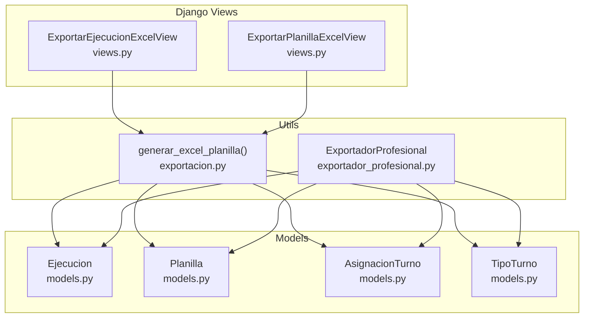
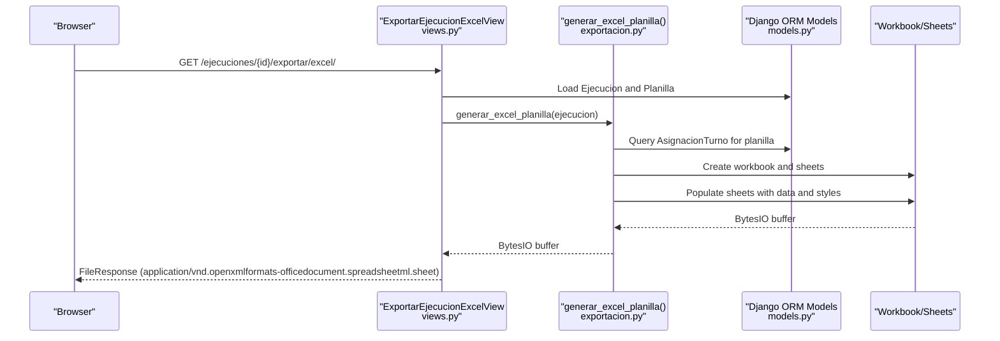
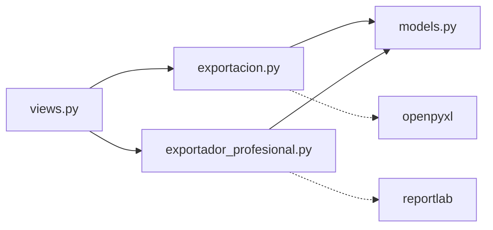

# Excel Export

<cite>
**Referenced Files in This Document**
- [README.md](file://README.md)
- [exportacion.py](file://turnos/utils/exportacion.py)
- [exportador_profesional.py](file://turnos/utils/exportador_profesional.py)
- [models.py](file://turnos/models.py)
- [views.py](file://turnos/views.py)
- [simular_planificacion.py](file://turnos/management/commands/simular_planificacion.py)
</cite>

## Table of Contents
1. [Introduction](#introduction)
2. [Project Structure](#project-structure)
3. [Core Components](#core-components)
4. [Architecture Overview](#architecture-overview)
5. [Detailed Component Analysis](#detailed-component-analysis)
6. [Dependency Analysis](#dependency-analysis)
7. [Performance Considerations](#performance-considerations)
8. [Troubleshooting Guide](#troubleshooting-guide)
9. [Conclusion](#conclusion)
10. [Appendices](#appendices)

## Introduction
This document explains the Excel export functionality for the professional 7-sheet Excel generator used by the nursing scheduling system. It covers how Django ORM models are transformed into structured datasets, how each of the seven sheets is produced, and how color coding, formatting, and styling are applied. It also documents the differences between the “7-sheet” exporter and the “professional” exporter, and provides guidance on interpreting each sheet’s insights for different stakeholders.

## Project Structure
The Excel export capability spans several modules:
- Views trigger export actions and pass Django ORM objects to exporters.
- Exporters transform ORM data into Excel worksheets with consistent styling and validations.
- Models define the data structures used by exporters (executions, planillas, assignments, and types of shifts).

**Diagram sources**
- [views.py:1732-1756](file://turnos/views.py#L1732-L1756)
- [exportacion.py:134-467](file://turnos/utils/exportacion.py#L134-L467)
- [exportador_profesional.py:256-330](file://turnos/utils/exportador_profesional.py#L256-L330)
- [models.py:482-599](file://turnos/models.py#L482-L599)

**Section sources**
- [README.md:1-111](file://README.md#L1-L111)
- [views.py:1732-1756](file://turnos/views.py#L1732-L1756)
- [exportacion.py:134-467](file://turnos/utils/exportacion.py#L134-L467)
- [exportador_profesional.py:256-330](file://turnos/utils/exportador_profesional.py#L256-L330)
- [models.py:482-599](file://turnos/models.py#L482-L599)

## Core Components
- Exporter for 7-sheet Excel: Converts a Django Execution and its Planilla into seven worksheets: Vertical schedule, Horizontal matrix, Statistics, Nurse distribution, Coverage analysis, Equity, and Validation report.
- Professional exporter: Generates a 6-sheet Excel with a different layout and richer styling, plus a PDF export option.
- Data translation helpers: Convert ORM objects into dictionaries suitable for Excel creation.

Key responsibilities:
- Transform ORM relations (execution → planilla → assignments) into tabular structures.
- Apply color coding and formatting per shift type.
- Compute statistics and validations for coverage and equity.
- Produce multiple output formats (Excel, PDF, CSV, JSON, iCal) depending on the chosen exporter.

**Section sources**
- [exportacion.py:134-467](file://turnos/utils/exportacion.py#L134-L467)
- [exportador_profesional.py:256-330](file://turnos/utils/exportador_profesional.py#L256-L330)
- [models.py:482-599](file://turnos/models.py#L482-L599)

## Architecture Overview
The export pipeline starts from a Django view that receives an Execution ID, validates the presence of a generated Planilla, and delegates to an exporter. The exporter reads assignment records and builds worksheets accordingly.

**Diagram sources**
- [views.py:1732-1756](file://turnos/views.py#L1732-L1756)
- [exportacion.py:134-467](file://turnos/utils/exportacion.py#L134-L467)
- [models.py:534-599](file://turnos/models.py#L534-L599)

## Detailed Component Analysis

### 7-Sheet Excel Exporter
The 7-sheet exporter produces:
- Sheet 1: Vertical schedule
- Sheet 2: Horizontal matrix
- Sheet 3: Statistics
- Sheet 4: Nurse distribution
- Sheet 5: Coverage analysis
- Sheet 6: Equity
- Sheet 7: Validation report

Data transformation steps:
- Extract period dates and number of days from the Execution’s configuration.
- Build a dictionary of assignments grouped by day and shift type (vertical).
- Build a matrix of nurses × days (horizontal).
- Compute counts and percentages for statistics and distribution.
- Aggregate daily coverage per shift type.
- Compute equity metrics (mean, min, max, std dev).
- Generate validation report based on coverage and equity thresholds.

Formatting and styling:
- Header rows use a branded blue background with white text.
- Shift types are colored according to a predefined palette.
- Borders and centered alignment improve readability.
- Column widths are tuned for optimal display.

Sheet-specific purposes:
- Vertical schedule: Lists days, dates, shift type, and assigned nurses for each shift slot.
- Horizontal matrix: Presents a nurse-by-day matrix with shift codes and colors.
- Statistics: Summarizes execution metadata and counts.
- Nurse distribution: Shows totals, free days, shift counts per nurse, occupancy percentage, and status.
- Coverage analysis: Shows daily counts per shift type and totals.
- Equity: Computes mean/min/max/difference/std deviation and highlights top-heavy and underloaded nurses.
- Validation report: Reports on execution status, optimality, and coverage gaps.

**Section sources**
- [exportacion.py:134-467](file://turnos/utils/exportacion.py#L134-L467)
- [models.py:482-599](file://turnos/models.py#L482-L599)

### Professional Exporter (6-sheet + PDF)
The professional exporter focuses on:
- Sheet 1: Planificación (Vertical schedule)
- Sheet 2: Estadísticas
- Sheet 3: Por Enfermera
- Sheet 4: Cobertura
- Sheet 5: Equidad
- Sheet 6: Validaciones

It also supports exporting a PDF with a horizontal matrix layout. It computes richer statistics and validations, and applies a consistent color scheme and typography.

Key differences from the 7-sheet exporter:
- Uses a different internal data structure derived from the Execution object.
- Applies more advanced styling and uses ReportLab for PDF generation.
- Provides a dedicated validation report with formatted text.

**Section sources**
- [exportador_profesional.py:256-330](file://turnos/utils/exportador_profesional.py#L256-L330)
- [exportador_profesional.py:386-741](file://turnos/utils/exportador_profesional.py#L386-L741)
- [exportador_profesional.py:742-766](file://turnos/utils/exportador_profesional.py#L742-L766)
- [exportador_profesional.py:922-958](file://turnos/utils/exportador_profesional.py#L922-L958)

### Data Transformation from Django ORM
The exporters rely on these model relationships:
- Ejecucion → Planilla (one-to-one)
- Planilla → AsignacionTurno (many-to-many via planilla.asignaciones)
- AsignacionTurno → Enfermera (many-to-one)
- AsignacionTurno → TipoTurno (many-to-one)

Transformation logic:
- Vertical dictionary: Group assignments by day index and shift type, aggregating nurse names.
- Horizontal matrix: For each nurse, collect shift codes per date.
- Statistics: Count penalties, optimality flag, duration, and state.
- Distribution: Sum shift counts per nurse and compute occupancy percentage.
- Coverage: Count assignments per day and shift type.
- Equity: Compute mean, min, max, difference, and standard deviation.
- Validation: Check coverage gaps and equity thresholds.

**Section sources**
- [exportacion.py:78-128](file://turnos/utils/exportacion.py#L78-L128)
- [exportacion.py:254-423](file://turnos/utils/exportacion.py#L254-L423)
- [exportacion.py:473-512](file://turnos/utils/exportacion.py#L473-L512)
- [models.py:534-599](file://turnos/models.py#L534-L599)

### Color Coding and Styling
- Shift types mapped to colors:
  - MAÑANA: Yellow
  - TARDE: Cyan
  - NOCHE: Purple
  - LIBRE: Light gray
- Header rows use a branded blue background with white text.
- Borders are thin and applied consistently.
- Text alignment is centered for cells containing codes or counts.
- Occupancy percentage and totals are emphasized with bold or special backgrounds.

**Section sources**
- [exportacion.py:55-61](file://turnos/utils/exportacion.py#L55-L61)
- [exportacion.py:152-196](file://turnos/utils/exportacion.py#L152-L196)
- [exportacion.py:214-249](file://turnos/utils/exportacion.py#L214-L249)
- [exportacion.py:361-371](file://turnos/utils/exportacion.py#L361-L371)
- [exportacion.py:432-453](file://turnos/utils/exportacion.py#L432-L453)
- [exportacion.py:500-511](file://turnos/utils/exportacion.py#L500-L511)
- [exportacion.py:577-583](file://turnos/utils/exportacion.py#L577-L583)
- [exportacion.py:645-650](file://turnos/utils/exportacion.py#L645-L650)
- [exportacion.py:706-718](file://turnos/utils/exportacion.py#L706-L718)
- [exportador_profesional.py:49-55](file://turnos/utils/exportador_profesional.py#L49-L55)
- [exportador_profesional.py:69-73](file://turnos/utils/exportador_profesional.py#L69-L73)
- [exportador_profesional.py:367-372](file://turnos/utils/exportador_profesional.py#L367-L372)
- [exportador_profesional.py:448-452](file://turnos/utils/exportador_profesional.py#L448-L452)
- [exportador_profesional.py:501-505](file://turnos/utils/exportador_profesional.py#L501-L505)
- [exportador_profesional.py:578-582](file://turnos/utils/exportador_profesional.py#L578-L582)
- [exportador_profesional.py:649-650](file://turnos/utils/exportador_profesional.py#L649-L650)
- [exportador_profesional.py:708-718](file://turnos/utils/exportador_profesional.py#L708-L718)

### Sheet Interpretation Guide
- Vertical schedule: Use to verify which nurses are assigned to which shifts per day.
- Horizontal matrix: Use to quickly scan a nurse’s weekly schedule and identify free days.
- Statistics: Use to confirm execution quality (optimality, penalties, duration).
- Nurse distribution: Use to balance workload and identify overworked or underused nurses.
- Coverage analysis: Use to ensure adequate staffing per shift type across the period.
- Equity: Use to assess fairness and detect significant imbalances.
- Validation report: Use to identify missing coverage and equity issues.

**Section sources**
- [exportacion.py:146-200](file://turnos/utils/exportacion.py#L146-L200)
- [exportacion.py:206-253](file://turnos/utils/exportacion.py#L206-L253)
- [exportacion.py:254-324](file://turnos/utils/exportacion.py#L254-L324)
- [exportacion.py:325-377](file://turnos/utils/exportacion.py#L325-L377)
- [exportacion.py:378-423](file://turnos/utils/exportacion.py#L378-L423)
- [exportacion.py:424-462](file://turnos/utils/exportacion.py#L424-L462)
- [exportador_profesional.py:386-458](file://turnos/utils/exportador_profesional.py#L386-L458)
- [exportador_profesional.py:459-538](file://turnos/utils/exportador_profesional.py#L459-L538)
- [exportador_profesional.py:539-597](file://turnos/utils/exportador_profesional.py#L539-L597)
- [exportador_profesional.py:598-677](file://turnos/utils/exportador_profesional.py#L598-L677)
- [exportador_profesional.py:678-741](file://turnos/utils/exportador_profesional.py#L678-L741)

## Dependency Analysis
- Views depend on exporters to produce downloadable files.
- Exporters depend on Django ORM models to extract data.
- Exporters depend on external libraries (openpyxl, reportlab) for formatting and PDF generation.
- The professional exporter additionally depends on internal helper functions to convert Execution objects into the expected dictionary format.

**Diagram sources**
- [views.py:1732-1756](file://turnos/views.py#L1732-L1756)
- [exportacion.py:134-467](file://turnos/utils/exportacion.py#L134-L467)
- [exportador_profesional.py:256-330](file://turnos/utils/exportador_profesional.py#L256-L330)
- [models.py:482-599](file://turnos/models.py#L482-L599)

**Section sources**
- [views.py:1732-1756](file://turnos/views.py#L1732-L1756)
- [exportacion.py:134-467](file://turnos/utils/exportacion.py#L134-L467)
- [exportador_profesional.py:256-330](file://turnos/utils/exportador_profesional.py#L256-L330)
- [models.py:482-599](file://turnos/models.py#L482-L599)

## Performance Considerations
- Prefer select_related and order_by to minimize database queries and ensure deterministic ordering.
- Use defaultdict for efficient aggregation of assignments.
- Avoid excessive formatting loops; batch style updates where possible.
- For large periods, consider streaming or chunked processing to reduce memory usage.

[No sources needed since this section provides general guidance]

## Troubleshooting Guide
Common issues and resolutions:
- Missing planilla: Ensure the Execution has a generated Planilla before exporting.
- Missing openpyxl or reportlab: Install the required packages to enable Excel/PDF exports.
- Incorrect shift codes: Verify that AssignmentTurno entries have either a valid shift or are marked as free day.
- Equity thresholds exceeded: Review distribution and adjust assignments to reduce imbalance.
- Coverage gaps: Confirm that each day has at least one assignment per required shift type.

**Section sources**
- [views.py:1738-1742](file://turnos/views.py#L1738-L1742)
- [exportacion.py:137-139](file://turnos/utils/exportacion.py#L137-L139)
- [exportador_profesional.py:216-249](file://turnos/utils/exportador_profesional.py#L216-L249)

## Conclusion
The Excel export system transforms Execution and Planilla data into two complementary formats: a 7-sheet Excel for quick scanning and a professional 6-sheet Excel plus PDF for detailed reporting. Both exporters apply consistent color coding and formatting, compute meaningful statistics and validations, and support stakeholder-driven interpretation of scheduling outcomes.

[No sources needed since this section summarizes without analyzing specific files]

## Appendices

### Example Workflows
- Trigger Excel export from the execution detail page.
- Use the professional exporter to generate a polished Excel and PDF for management review.
- Download CSV for external systems integration.

**Section sources**
- [views.py:1732-1756](file://turnos/views.py#L1732-L1756)
- [exportador_profesional.py:922-958](file://turnos/utils/exportador_profesional.py#L922-L958)
- [exportacion.py:531-557](file://turnos/utils/exportacion.py#L531-L557)

### Command-line Simulation
The simulation command demonstrates both exporters in action, saving Excel and PDF artifacts for inspection.

**Section sources**
- [simular_planificacion.py:525-545](file://turnos/management/commands/simular_planificacion.py#L525-L545)