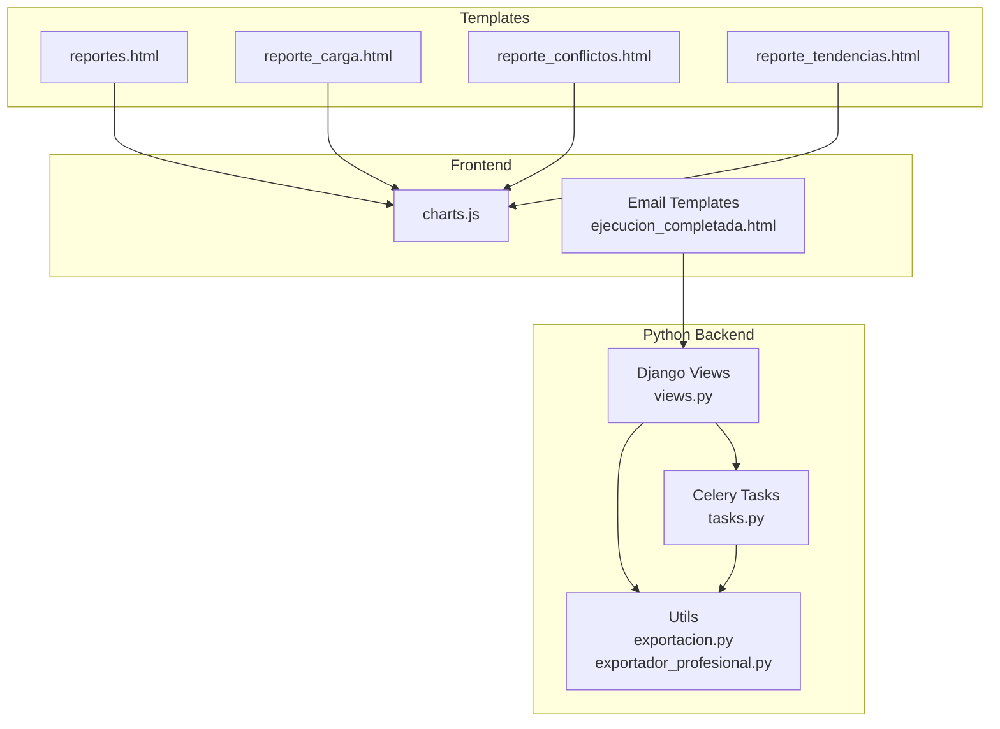
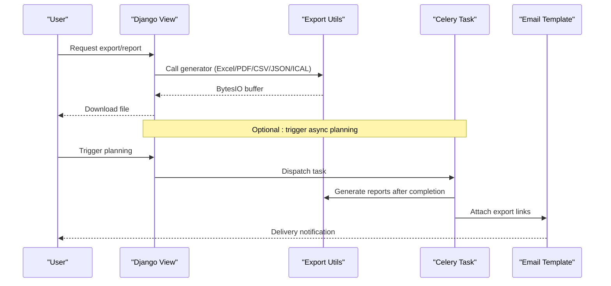
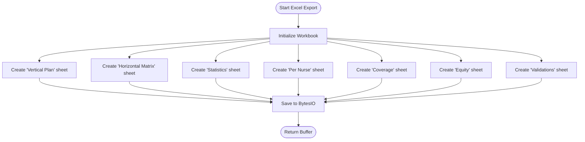
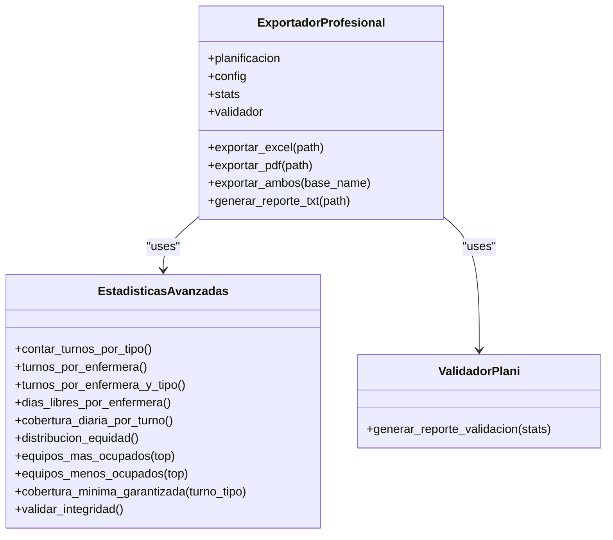
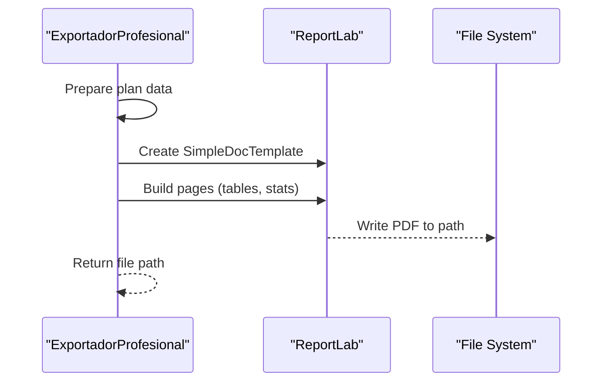
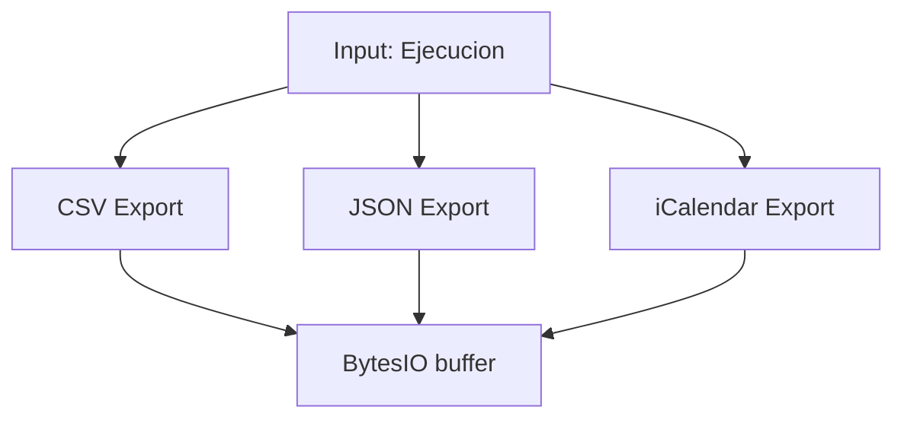
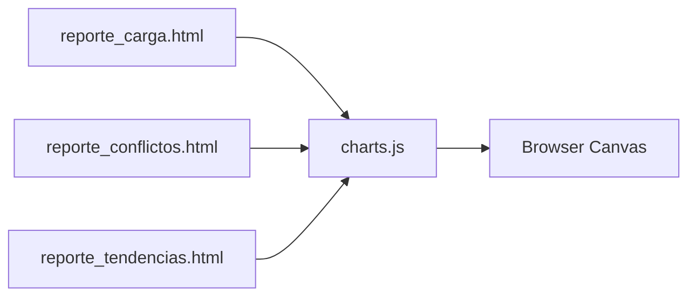
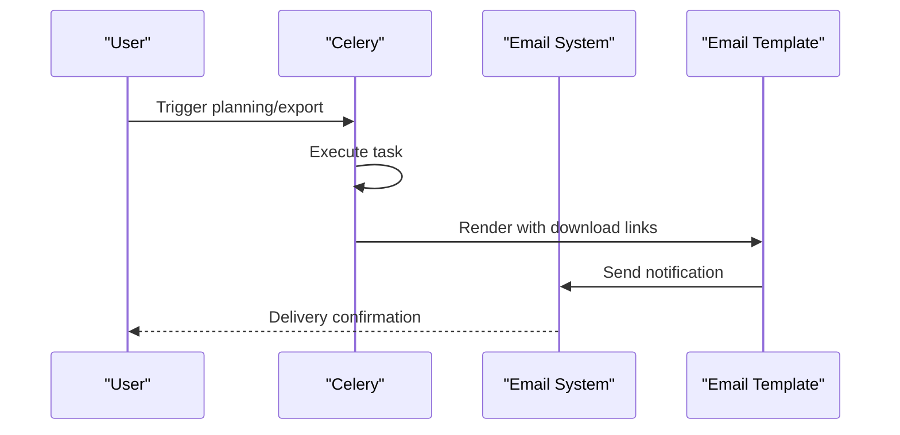
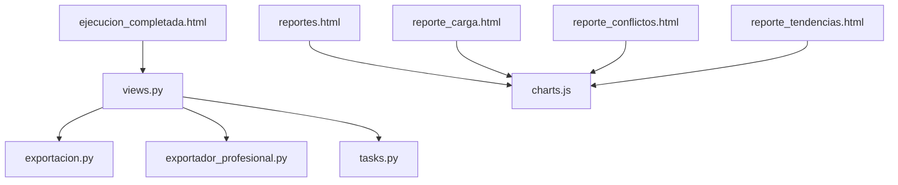

# Export and Reporting

<cite>
**Referenced Files in This Document**
- [exportacion.py](file://turnos/utils/exportacion.py)
- [exportador_profesional.py](file://turnos/utils/exportador_profesional.py)
- [views.py](file://turnos/views.py)
- [tasks.py](file://turnos/tasks.py)
- [reportes.html](file://turnos/templates/turnos/reportes.html)
- [reporte_carga.html](file://turnos/templates/turnos/reporte_carga.html)
- [reporte_conflictos.html](file://turnos/templates/turnos/reporte_conflictos.html)
- [reporte_tendencias.html](file://turnos/templates/turnos/reporte_tendencias.html)
- [charts.js](file://turnos/static/js/charts.js)
- [ejecucion_completada.html](file://turnos/templates/emails/ejecucion_completada.html)
</cite>

## Table of Contents
1. [Introduction](#introduction)
2. [Project Structure](#project-structure)
3. [Core Components](#core-components)
4. [Architecture Overview](#architecture-overview)
5. [Detailed Component Analysis](#detailed-component-analysis)
6. [Dependency Analysis](#dependency-analysis)
7. [Performance Considerations](#performance-considerations)
8. [Troubleshooting Guide](#troubleshooting-guide)
9. [Conclusion](#conclusion)
10. [Appendices](#appendices)

## Introduction
This document describes the export and reporting system for the turn scheduling application. It covers:
- Multiple output formats: Excel (XLSX), PDF, CSV, JSON, and iCalendar (ICS)
- Professional export pipelines and templates
- Statistical reporting and visualization using Chart.js
- Dashboard widgets and report pages
- PDF generation pipeline and automated delivery via email
- Scheduling capabilities and automated delivery mechanisms

## Project Structure
The export and reporting system spans Python utilities, Django views, Celery tasks, HTML templates, and client-side JavaScript:
- Utilities: export generators for Excel, PDF, CSV, JSON, and iCalendar
- Views: orchestrate export requests and render report pages
- Tasks: asynchronous execution of planning and reporting
- Templates: report dashboards and exportable pages
- Charts: client-side visualization helpers

**Diagram sources**
- [exportacion.py:135-665](file://turnos/utils/exportacion.py#L135-L665)
- [exportador_profesional.py:256-990](file://turnos/utils/exportador_profesional.py#L256-L990)
- [views.py:27-29](file://turnos/views.py#L27-L29)
- [tasks.py:17-240](file://turnos/tasks.py#L17-L240)
- [reportes.html:1-298](file://turnos/templates/turnos/reportes.html#L1-L298)
- [reporte_carga.html:1-271](file://turnos/templates/turnos/reporte_carga.html#L1-L271)
- [reporte_conflictos.html:1-241](file://turnos/templates/turnos/reporte_conflictos.html#L1-L241)
- [reporte_tendencias.html:1-180](file://turnos/templates/turnos/reporte_tendencias.html#L1-L180)
- [charts.js:1-275](file://turnos/static/js/charts.js#L1-L275)
- [ejecucion_completada.html:133-156](file://turnos/templates/emails/ejecucion_completada.html#L133-L156)

**Section sources**
- [exportacion.py:1-665](file://turnos/utils/exportacion.py#L1-L665)
- [exportador_profesional.py:1-990](file://turnos/utils/exportador_profesional.py#L1-L990)
- [views.py:27-29](file://turnos/views.py#L27-L29)
- [tasks.py:17-240](file://turnos/tasks.py#L17-L240)
- [reportes.html:1-298](file://turnos/templates/turnos/reportes.html#L1-L298)
- [reporte_carga.html:1-271](file://turnos/templates/turnos/reporte_carga.html#L1-L271)
- [reporte_conflictos.html:1-241](file://turnos/templates/turnos/reporte_conflictos.html#L1-L241)
- [reporte_tendencias.html:1-180](file://turnos/templates/turnos/reporte_tendencias.html#L1-L180)
- [charts.js:1-275](file://turnos/static/js/charts.js#L1-L275)
- [ejecucion_completada.html:133-156](file://turnos/templates/emails/ejecucion_completada.html#L133-L156)

## Core Components
- Excel exporter: generates XLSX with multiple sheets (vertical/horizontal plan, stats, per-nurse, coverage, equity, validations)
- PDF exporter: produces professional PDFs from plan data
- CSV/JSON/iCalendar exporters: lightweight exports for interoperability
- Professional export suite: advanced Excel/PDF with charts, validations, and branding
- Report pages: KPI dashboards and filters for workload, conflicts, and trends
- Visualization: Chart.js helpers for bar, line, and doughnut charts
- Automated delivery: Celery tasks and email templates for scheduled notifications

**Section sources**
- [exportacion.py:135-665](file://turnos/utils/exportacion.py#L135-L665)
- [exportador_profesional.py:256-990](file://turnos/utils/exportador_profesional.py#L256-L990)
- [reporte_carga.html:22-44](file://turnos/templates/turnos/reporte_carga.html#L22-L44)
- [charts.js:8-275](file://turnos/static/js/charts.js#L8-L275)
- [ejecucion_completada.html:133-156](file://turnos/templates/emails/ejecucion_completada.html#L133-L156)

## Architecture Overview
The export pipeline integrates backend generation with frontend visualization and asynchronous processing.

**Diagram sources**
- [views.py:27-29](file://turnos/views.py#L27-L29)
- [exportacion.py:135-665](file://turnos/utils/exportacion.py#L135-L665)
- [exportador_profesional.py:256-990](file://turnos/utils/exportador_profesional.py#L256-L990)
- [tasks.py:17-240](file://turnos/tasks.py#L17-L240)
- [ejecucion_completada.html:133-156](file://turnos/templates/emails/ejecucion_completada.html#L133-L156)

## Detailed Component Analysis

### Excel Export (Multiple Sheets)
The Excel exporter creates a comprehensive workbook with seven sheets:
- Planilla Vertical: day-by-day assignments
- Planilla Horizontal: nurse-by-day matrix
- Estadísticas: summary metrics
- Por Enfermera: distribution per nurse
- Cobertura: daily coverage counts
- Equidad: equity analytics
- Validaciones: validation outcomes

Key features:
- Color-coded turn cells
- Automatic column sizing
- Robust error handling and logging
- Support for exporting lists of nurses

**Diagram sources**
- [exportacion.py:135-467](file://turnos/utils/exportacion.py#L135-L467)

**Section sources**
- [exportacion.py:135-467](file://turnos/utils/exportacion.py#L135-L467)

### Professional Export Suite (Excel + PDF)
The professional exporter builds on plan data to produce:
- Excel with six analytical sheets (plan matrix, stats, per-nurse, coverage, equity, validations)
- PDF with tabular and statistical pages
- Validation reports and convenience functions

**Diagram sources**
- [exportador_profesional.py:256-990](file://turnos/utils/exportador_profesional.py#L256-L990)

**Section sources**
- [exportador_profesional.py:256-990](file://turnos/utils/exportador_profesional.py#L256-L990)

### PDF Generation Pipeline
PDF generation uses ReportLab to create:
- Landscape letter-sized documents
- Tabular and statistical pages
- Consistent styling and branding

**Diagram sources**
- [exportador_profesional.py:742-766](file://turnos/utils/exportador_profesional.py#L742-L766)

**Section sources**
- [exportador_profesional.py:742-766](file://turnos/utils/exportador_profesional.py#L742-L766)

### CSV, JSON, and iCalendar Exports
- CSV: semicolon-separated, vertical layout
- JSON: structured plan data with metadata
- iCalendar: events per day/shift with descriptions

**Diagram sources**
- [exportacion.py:531-627](file://turnos/utils/exportacion.py#L531-L627)

**Section sources**
- [exportacion.py:531-627](file://turnos/utils/exportacion.py#L531-L627)

### Report Pages and Visualization
Report dashboards provide filtering and export options:
- Workload report: per-nurse distribution, totals, and charts
- Conflict report: severity filters and remediation suggestions
- Trends report: monthly comparisons and success rates

Visualization helpers:
- Chart.js wrapper for bars, lines, and doughnuts
- Theme-aware colors and tooltips
- Responsive layouts

**Diagram sources**
- [reporte_carga.html:125-135](file://turnos/templates/turnos/reporte_carga.html#L125-L135)
- [reporte_conflictos.html:132-139](file://turnos/templates/turnos/reporte_conflictos.html#L132-L139)
- [reporte_tendencias.html:85-95](file://turnos/templates/turnos/reporte_tendencias.html#L85-L95)
- [charts.js:59-178](file://turnos/static/js/charts.js#L59-L178)

**Section sources**
- [reporte_carga.html:1-271](file://turnos/templates/turnos/reporte_carga.html#L1-L271)
- [reporte_conflictos.html:1-241](file://turnos/templates/turnos/reporte_conflictos.html#L1-L241)
- [reporte_tendencias.html:1-180](file://turnos/templates/turnos/reporte_tendencias.html#L1-L180)
- [charts.js:1-275](file://turnos/static/js/charts.js#L1-L275)

### Automated Delivery Mechanisms
- Celery tasks handle long-running planning and reporting
- Email templates include export options (Excel, PDF, CSV, JSON, iCalendar)
- Scheduled statistics reports can be generated programmatically

**Diagram sources**
- [tasks.py:17-240](file://turnos/tasks.py#L17-L240)
- [ejecucion_completada.html:133-156](file://turnos/templates/emails/ejecucion_completada.html#L133-L156)

**Section sources**
- [tasks.py:17-240](file://turnos/tasks.py#L17-L240)
- [ejecucion_completada.html:133-156](file://turnos/templates/emails/ejecucion_completada.html#L133-L156)

## Dependency Analysis
- Export utilities depend on third-party libraries (openpyxl, reportlab, icalendar)
- Views delegate to export utilities and coordinate with Celery tasks
- Templates rely on Chart.js for rendering
- Email templates reference export options for automated delivery

**Diagram sources**
- [views.py:27-29](file://turnos/views.py#L27-L29)
- [exportacion.py:135-665](file://turnos/utils/exportacion.py#L135-L665)
- [exportador_profesional.py:256-990](file://turnos/utils/exportador_profesional.py#L256-L990)
- [tasks.py:17-240](file://turnos/tasks.py#L17-L240)
- [reportes.html:1-298](file://turnos/templates/turnos/reportes.html#L1-L298)
- [reporte_carga.html:1-271](file://turnos/templates/turnos/reporte_carga.html#L1-L271)
- [reporte_conflictos.html:1-241](file://turnos/templates/turnos/reporte_conflictos.html#L1-L241)
- [reporte_tendencias.html:1-180](file://turnos/templates/turnos/reporte_tendencias.html#L1-L180)
- [charts.js:1-275](file://turnos/static/js/charts.js#L1-L275)
- [ejecucion_completada.html:133-156](file://turnos/templates/emails/ejecucion_completada.html#L133-L156)

**Section sources**
- [views.py:27-29](file://turnos/views.py#L27-L29)
- [exportacion.py:135-665](file://turnos/utils/exportacion.py#L135-L665)
- [exportador_profesional.py:256-990](file://turnos/utils/exportador_profesional.py#L256-L990)
- [tasks.py:17-240](file://turnos/tasks.py#L17-L240)
- [charts.js:1-275](file://turnos/static/js/charts.js#L1-L275)

## Performance Considerations
- Excel generation: avoid excessive sheet updates; batch writes and reuse styles
- PDF generation: minimize table creation overhead; cache repeated styles
- CSV/JSON: stream large datasets to reduce memory footprint
- iCalendar: limit event creation loops; precompute time ranges
- Visualization: defer heavy computations until filtered data arrives
- Asynchronous tasks: offload CPU-intensive work to Celery workers

## Troubleshooting Guide
Common issues and resolutions:
- Missing optional dependencies:
  - openpyxl: required for Excel exports
  - reportlab: required for PDF exports
  - icalendar: required for iCalendar exports
- Logging:
  - Utilities log warnings and errors during export failures
  - Celery tasks capture exceptions and mark execution status accordingly
- Data validation:
  - Ensure plan data completeness before generating reports
  - Verify turn types and nurse assignments

**Section sources**
- [exportacion.py:22-48](file://turnos/utils/exportacion.py#L22-L48)
- [tasks.py:204-240](file://turnos/tasks.py#L204-L240)

## Conclusion
The export and reporting system provides robust, multi-format output with professional templates, statistical insights, and visualization. It supports both interactive dashboards and automated delivery, enabling stakeholders to share actionable insights efficiently.

## Appendices

### Supported Formats and Capabilities
- Excel (XLSX): Seven-sheet plan, statistics, per-nurse, coverage, equity, validations
- PDF: Professional plan and statistics
- CSV: Lightweight day-by-day assignments
- JSON: Structured plan data
- iCalendar: Events per shift/day

**Section sources**
- [exportacion.py:135-665](file://turnos/utils/exportacion.py#L135-L665)
- [exportador_profesional.py:256-990](file://turnos/utils/exportador_profesional.py#L256-L990)
- [reporte_carga.html:22-44](file://turnos/templates/turnos/reporte_carga.html#L22-L44)

### Example Scenarios
- Manager review: Excel with per-nurse and coverage sheets
- Compliance audit: PDF with validations and equity metrics
- Operational handover: CSV for integration systems
- Staff calendar: iCalendar for personal schedules
- Automated weekly digest: Celery task generating monthly stats and emailing results

**Section sources**
- [tasks.py:272-314](file://turnos/tasks.py#L272-L314)
- [ejecucion_completada.html:133-156](file://turnos/templates/emails/ejecucion_completada.html#L133-L156)