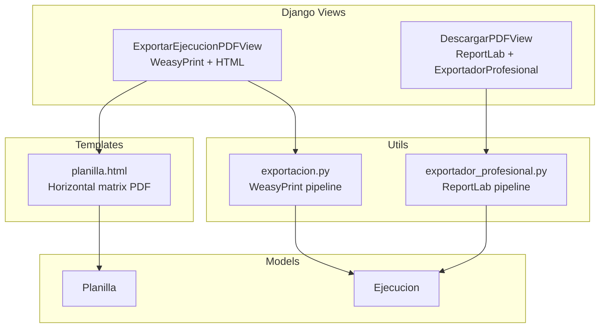
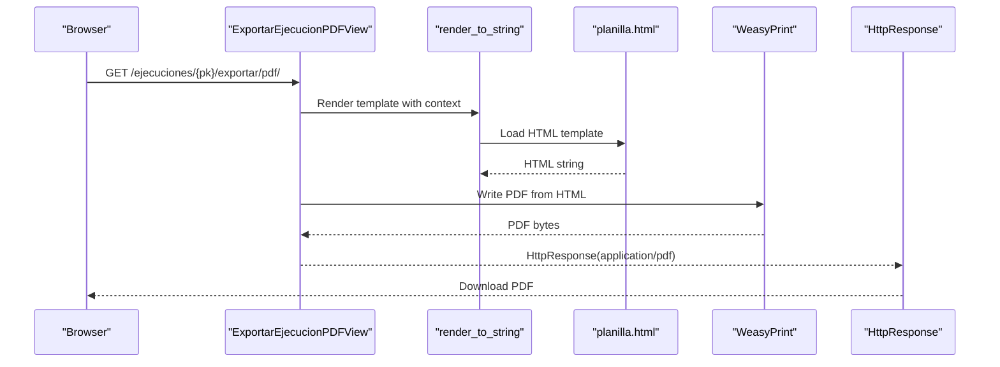
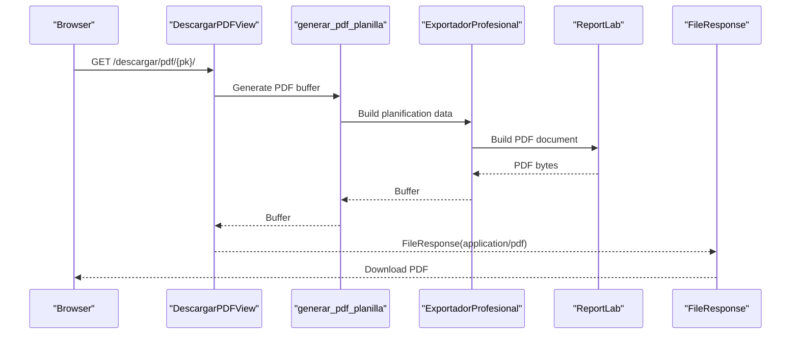
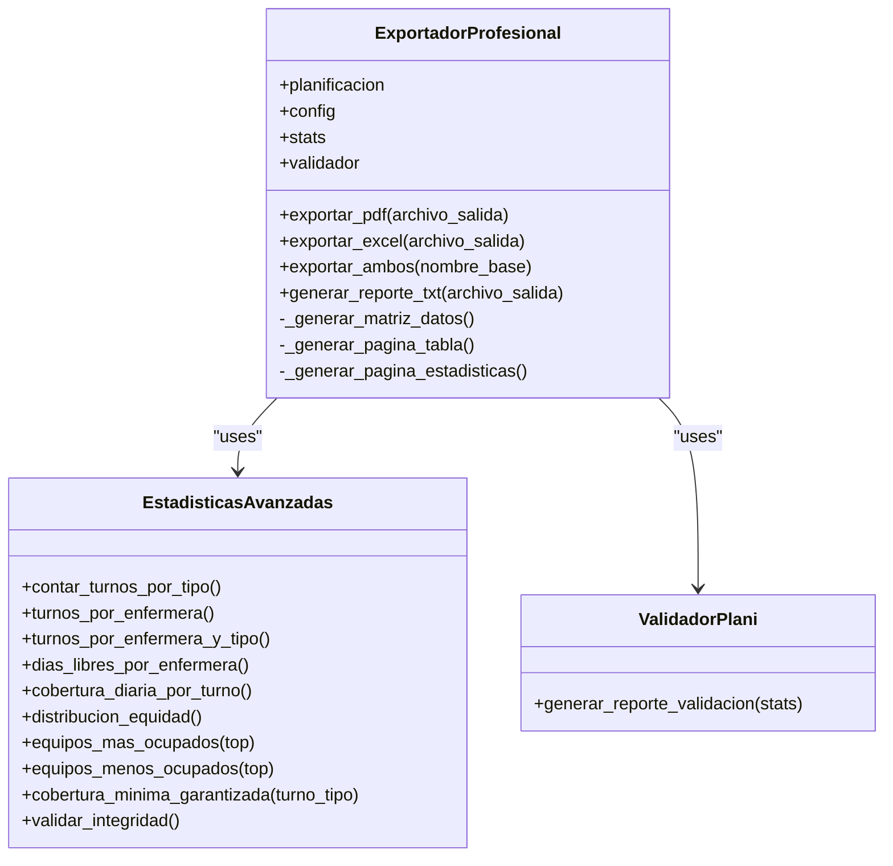
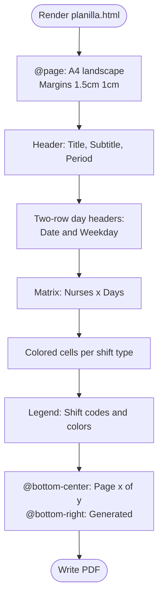
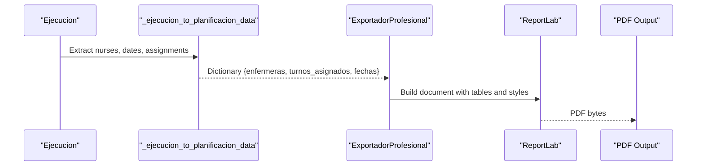
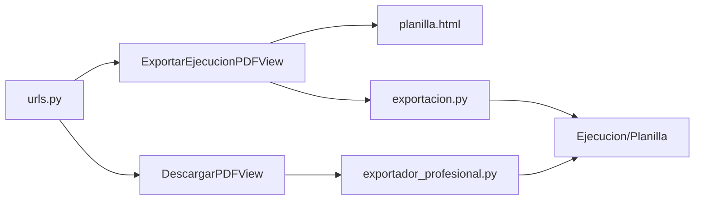

# PDF Export

<cite>
**Referenced Files in This Document**
- [exportador_profesional.py](file://turnos/utils/exportador_profesional.py)
- [exportacion.py](file://turnos/utils/exportacion.py)
- [planilla.html](file://turnos/templates/turnos/pdf/planilla.html)
- [views.py](file://turnos/views.py)
- [urls.py](file://turnos/urls.py)
- [simular_planificacion.py](file://turnos/management/commands/simular_planificacion.py)
</cite>

## Table of Contents
1. [Introduction](#introduction)
2. [Project Structure](#project-structure)
3. [Core Components](#core-components)
4. [Architecture Overview](#architecture-overview)
5. [Detailed Component Analysis](#detailed-component-analysis)
6. [Dependency Analysis](#dependency-analysis)
7. [Performance Considerations](#performance-considerations)
8. [Troubleshooting Guide](#troubleshooting-guide)
9. [Conclusion](#conclusion)
10. [Appendices](#appendices)

## Introduction
This document explains the professional-grade PDF export system for the turn scheduling application. It focuses on the ExportadorProfesional class and its integration with ReportLab to produce formatted PDF documents. It covers the PDF template structure, page layouts, styling options, and the conversion process from execution data to PDF format, including table generation, header styling, and color schemes. It also documents customization options for branding, page orientation, and layout modifications, and provides examples of generated PDFs along with guidance on adapting the export format for different organizational requirements.

## Project Structure
The PDF export functionality spans several modules:
- ExportadorProfesional: A comprehensive exporter that generates both Excel and PDF reports with advanced statistics and validations.
- exportacion.py: A complementary exporter module that provides a different PDF template rendered via WeasyPrint and HTML/CSS.
- planilla.html: An HTML template for a horizontal matrix-style PDF using WeasyPrint.
- views.py: Django views that orchestrate PDF generation and serve the resulting files.
- urls.py: URL routing for export endpoints.
- simular_planificacion.py: Management command demonstrating programmatic PDF generation.

**Diagram sources**
- [views.py:1759-1784](file://turnos/views.py#L1759-L1784)
- [views.py:2327-2348](file://turnos/views.py#L2327-L2348)
- [exportacion.py:515-528](file://turnos/utils/exportacion.py#L515-L528)
- [exportador_profesional.py:742-766](file://turnos/utils/exportador_profesional.py#L742-L766)
- [planilla.html:1-283](file://turnos/templates/turnos/pdf/planilla.html#L1-L283)

**Section sources**
- [urls.py:46-50](file://turnos/urls.py#L46-L50)
- [urls.py:99-104](file://turnos/urls.py#L99-L104)

## Core Components
- ExportadorProfesional: Provides professional-grade PDF generation using ReportLab, including:
  - Matrix table generation from execution data
  - Header styling and color schemes
  - Statistical summaries and quality checks
  - Two-page layout: table and statistics
- exportacion.py: Provides a WeasyPrint-based PDF using an HTML template:
  - Horizontal matrix layout with CSS styling
  - Turn code mapping and legend
  - Footer and page numbering
- planilla.html: HTML template for the WeasyPrint pipeline, rendering a horizontal matrix of nurses vs days with color-coded cells.
- Django Views: Orchestrate PDF generation and serve the files to users.
- URLs: Expose endpoints for exporting and downloading PDFs.

Key capabilities:
- Conversion from execution data to structured dictionaries
- Table generation with ReportLab Table and TableStyle
- Color schemes aligned with shift types
- Page layout with margins and orientation
- Validation and reporting integration

**Section sources**
- [exportador_profesional.py:256-272](file://turnos/utils/exportador_profesional.py#L256-L272)
- [exportador_profesional.py:742-766](file://turnos/utils/exportador_profesional.py#L742-L766)
- [exportador_profesional.py:839-892](file://turnos/utils/exportador_profesional.py#L839-L892)
- [exportacion.py:515-528](file://turnos/utils/exportacion.py#L515-L528)
- [planilla.html:1-283](file://turnos/templates/turnos/pdf/planilla.html#L1-L283)
- [views.py:1759-1784](file://turnos/views.py#L1759-L1784)
- [views.py:2327-2348](file://turnos/views.py#L2327-L2348)

## Architecture Overview
Two distinct PDF pipelines coexist:
- ReportLab pipeline (ExportadorProfesional): Produces a two-page PDF with a table and statistics.
- WeasyPrint pipeline (HTML template): Produces a horizontally scrollable matrix PDF with a legend.

**Diagram sources**
- [views.py:1759-1784](file://turnos/views.py#L1759-L1784)
- [planilla.html:1-283](file://turnos/templates/turnos/pdf/planilla.html#L1-L283)

**Diagram sources**
- [views.py:2327-2348](file://turnos/views.py#L2327-L2348)
- [exportacion.py:515-528](file://turnos/utils/exportacion.py#L515-L528)
- [exportador_profesional.py:742-766](file://turnos/utils/exportador_profesional.py#L742-L766)

## Detailed Component Analysis

### ExportadorProfesional
The ExportadorProfesional class encapsulates professional-grade PDF generation with ReportLab. It builds a two-page document:
- Page 1: A matrix table of nurses vs days with colored cells representing shifts.
- Page 2: Statistics and equity analysis.

Key implementation highlights:
- Data preparation: Generates a matrix of headers and rows from execution data.
- Table styling: Uses ReportLab’s Table and TableStyle to apply background colors, borders, and alignment.
- Color scheme: Maps shift types to hex colors for visual consistency.
- Layout: Landscape A4 with tight margins; uses paragraphs for headers and spacing.

**Diagram sources**
- [exportador_profesional.py:80-210](file://turnos/utils/exportador_profesional.py#L80-L210)
- [exportador_profesional.py:256-272](file://turnos/utils/exportador_profesional.py#L256-L272)
- [exportador_profesional.py:742-766](file://turnos/utils/exportador_profesional.py#L742-L766)
- [exportador_profesional.py:839-892](file://turnos/utils/exportador_profesional.py#L839-L892)

**Section sources**
- [exportador_profesional.py:256-272](file://turnos/utils/exportador_profesional.py#L256-L272)
- [exportador_profesional.py:742-766](file://turnos/utils/exportador_profesional.py#L742-L766)
- [exportador_profesional.py:839-892](file://turnos/utils/exportador_profesional.py#L839-L892)

### PDF Template Structure (WeasyPrint)
The WeasyPrint pipeline renders an HTML template to PDF. The template defines:
- Page size and margins
- Header with period and configuration metadata
- A two-row day header (date and weekday)
- A matrix of nurse rows with colored cells for shifts
- A footer with page numbers and generation date
- A legend mapping codes to shift types

**Diagram sources**
- [planilla.html:6-20](file://turnos/templates/turnos/pdf/planilla.html#L6-L20)
- [planilla.html:34-55](file://turnos/templates/turnos/pdf/planilla.html#L34-L55)
- [planilla.html:219-262](file://turnos/templates/turnos/pdf/planilla.html#L219-L262)
- [planilla.html:264-279](file://turnos/templates/turnos/pdf/planilla.html#L264-L279)

**Section sources**
- [planilla.html:1-283](file://turnos/templates/turnos/pdf/planilla.html#L1-L283)

### Conversion Process from Execution Data to PDF
Both pipelines convert Django ORM objects into structured dictionaries:
- exportacion.py: Converts Ejecucion to a dictionary suitable for ExportadorProfesional.
- views.py: Builds a context for the HTML template, mapping shift types to short codes and CSS classes.

**Diagram sources**
- [exportacion.py:473-512](file://turnos/utils/exportacion.py#L473-L512)
- [exportador_profesional.py:742-766](file://turnos/utils/exportador_profesional.py#L742-L766)

**Section sources**
- [exportacion.py:473-512](file://turnos/utils/exportacion.py#L473-L512)
- [views.py:1786-1902](file://turnos/views.py#L1786-L1902)

### Table Generation and Styling Options
- ReportLab pipeline:
  - Headers: Blue background, white text, centered alignment.
  - Nurse rows: Light blue background for identity columns.
  - Shift cells: Background color mapped from shift type; night shifts use white text for contrast.
  - Borders and grid: Thin black borders for readability.
- WeasyPrint pipeline:
  - CSS-driven styling with fixed widths and responsive layout.
  - Color-coded classes for shift types and special statuses.
  - Footer with page counters and generation timestamp.

Customization hooks:
- Color scheme: Modify color mappings for shift types.
- Fonts and sizes: Adjust paragraph styles and table cell fonts.
- Orientation and margins: Change page size and margins in the document builder.

**Section sources**
- [exportador_profesional.py:807-834](file://turnos/utils/exportador_profesional.py#L807-L834)
- [planilla.html:57-103](file://turnos/templates/turnos/pdf/planilla.html#L57-L103)
- [planilla.html:113-174](file://turnos/templates/turnos/pdf/planilla.html#L113-L174)

### Validation and Reporting Integration
ExportadorProfesional computes:
- Shift counts by type
- Distribution by nurse and by day
- Equity metrics (mean, min, max, std dev)
- Coverage guarantees per shift type
It also generates a textual validation report summarizing findings.

**Section sources**
- [exportador_profesional.py:80-210](file://turnos/utils/exportador_profesional.py#L80-L210)
- [exportador_profesional.py:907-915](file://turnos/utils/exportador_profesional.py#L907-L915)

## Dependency Analysis
- Views depend on:
  - exportacion.py for the ReportLab pipeline
  - planilla.html for the WeasyPrint pipeline
- exportacion.py depends on:
  - Django ORM models (Ejecucion, Planilla)
  - ReportLab for PDF generation
  - OpenPyXL for Excel generation
- exportador_profesional.py depends on:
  - ReportLab for PDF generation
  - OpenPyXL for Excel generation
- URLs route requests to the appropriate views.

**Diagram sources**
- [urls.py:46-50](file://turnos/urls.py#L46-L50)
- [urls.py:99-104](file://turnos/urls.py#L99-L104)
- [views.py:1759-1784](file://turnos/views.py#L1759-L1784)
- [views.py:2327-2348](file://turnos/views.py#L2327-L2348)
- [exportacion.py:515-528](file://turnos/utils/exportacion.py#L515-L528)
- [exportador_profesional.py:742-766](file://turnos/utils/exportador_profesional.py#L742-L766)

**Section sources**
- [urls.py:46-50](file://turnos/urls.py#L46-L50)
- [urls.py:99-104](file://turnos/urls.py#L99-L104)
- [views.py:1759-1784](file://turnos/views.py#L1759-L1784)
- [views.py:2327-2348](file://turnos/views.py#L2327-L2348)
- [exportacion.py:515-528](file://turnos/utils/exportacion.py#L515-L528)
- [exportador_profesional.py:742-766](file://turnos/utils/exportador_profesional.py#L742-L766)

## Performance Considerations
- ReportLab pipeline:
  - Table building and styling can be expensive for large matrices. Consider reducing the number of days or optimizing style application.
  - Using repeatRows in Table can improve readability but adds overhead.
- WeasyPrint pipeline:
  - Rendering large HTML tables can be memory-intensive. Prefer narrower periods or limit special statuses to reduce DOM size.
  - CSS calculations and page breaks can impact rendering time.
- Data conversion:
  - Minimize repeated conversions by caching intermediate dictionaries when feasible.

[No sources needed since this section provides general guidance]

## Troubleshooting Guide
Common issues and resolutions:
- Missing dependencies:
  - ReportLab: Ensure ReportLab is installed for PDF generation.
  - WeasyPrint: Ensure WeasyPrint is installed for HTML-to-PDF rendering.
  - OpenPyXL: Required for Excel exports; missing imports are handled gracefully.
- Incorrect shift types:
  - Verify that shift names match expected keys in color mappings.
- Empty or missing planilla:
  - Views handle missing planilla gracefully with user-friendly messages.
- Large PDFs:
  - Reduce the number of days or remove special statuses to decrease output size.

**Section sources**
- [exportacion.py:22-49](file://turnos/utils/exportacion.py#L22-L49)
- [views.py:1768-1774](file://turnos/views.py#L1768-L1774)
- [views.py:2350-2357](file://turnos/views.py#L2350-L2357)

## Conclusion
The PDF export system offers two complementary pipelines:
- A professional ReportLab-based PDF with a two-page layout and embedded statistics.
- A WeasyPrint-based HTML template producing a horizontally scrollable matrix with a legend.

Both pipelines transform execution data into visually consistent, branded PDFs suitable for distribution. The system supports customization of colors, fonts, and layout while maintaining robust validation and reporting capabilities.

[No sources needed since this section summarizes without analyzing specific files]

## Appendices

### How to Generate a PDF Programmatically
- Using the ReportLab pipeline:
  - Instantiate ExportadorProfesional with execution data.
  - Call exportar_pdf with a file path or BytesIO buffer.
- Using the WeasyPrint pipeline:
  - Use the view or the generator function to render planilla.html and write the PDF.

**Section sources**
- [exportador_profesional.py:742-766](file://turnos/utils/exportador_profesional.py#L742-L766)
- [exportacion.py:515-528](file://turnos/utils/exportacion.py#L515-L528)
- [simular_planificacion.py:525-535](file://turnos/management/commands/simular_planificacion.py#L525-L535)

### Customization Examples
- Branding:
  - Modify header colors and fonts in the ReportLab pipeline.
  - Adjust CSS colors and fonts in planilla.html.
- Page orientation and margins:
  - Change page size and margins in the ReportLab document builder.
  - Adjust @page size and margins in planilla.html.
- Layout modifications:
  - Add totals or legends in the ReportLab table.
  - Extend the HTML template with additional sections or CSS classes.

**Section sources**
- [exportador_profesional.py:746-753](file://turnos/utils/exportador_profesional.py#L746-L753)
- [planilla.html:6-20](file://turnos/templates/turnos/pdf/planilla.html#L6-L20)