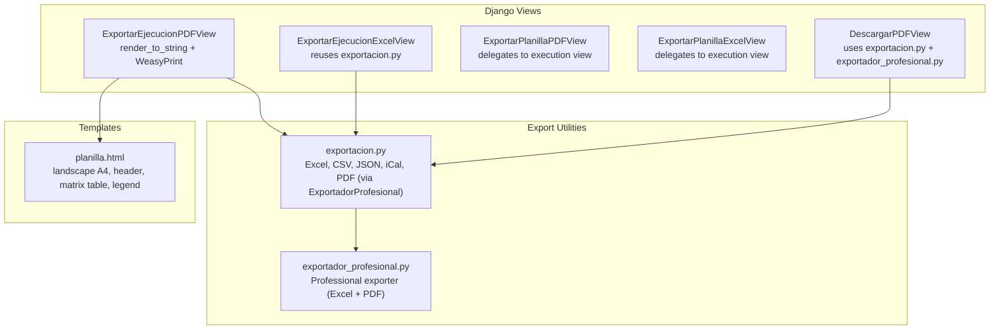
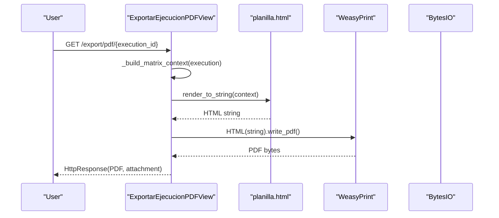
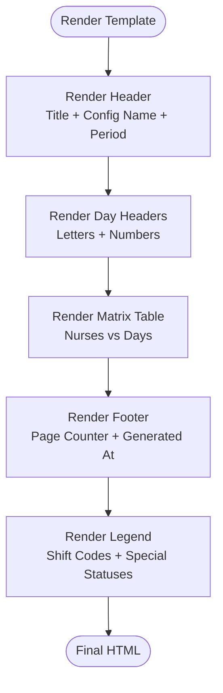
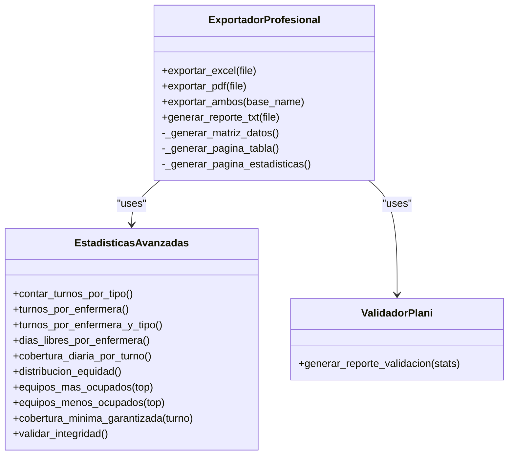
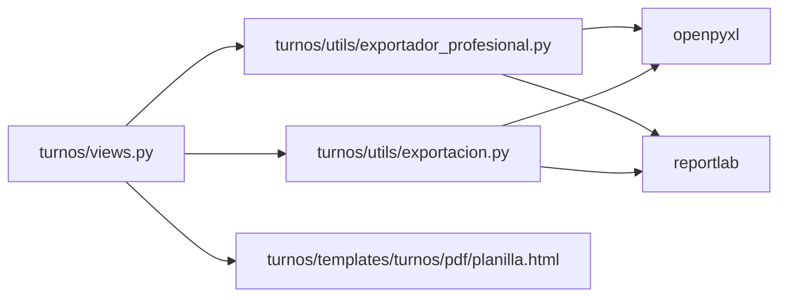

# Report Generation and Templates

<cite>
**Referenced Files in This Document**
- [exportacion.py](file://turnos/utils/exportacion.py)
- [exportador_profesional.py](file://turnos/utils/exportador_profesional.py)
- [planilla.html](file://turnos/templates/turnos/pdf/planilla.html)
- [views.py](file://turnos/views.py)
- [tasks.py](file://turnos/tasks.py)
- [reportes.html](file://turnos/templates/turnos/reportes.html)
- [models.py](file://turnos/models.py)
</cite>

## Table of Contents
1. [Introduction](#introduction)
2. [Project Structure](#project-structure)
3. [Core Components](#core-components)
4. [Architecture Overview](#architecture-overview)
5. [Detailed Component Analysis](#detailed-component-analysis)
6. [Dependency Analysis](#dependency-analysis)
7. [Performance Considerations](#performance-considerations)
8. [Troubleshooting Guide](#troubleshooting-guide)
9. [Conclusion](#conclusion)
10. [Appendices](#appendices)

## Introduction
This document explains the report generation system, focusing on professional PDF templates and multi-format export capabilities. It covers:
- Template structure for header, data tables, and footers
- Customization and branding options
- Integration between Django templates and export functions
- Report scheduling via asynchronous tasks and batch processing
- Examples of report types and guidance for creating custom templates

## Project Structure
The report generation system spans three layers:
- Django views orchestrate export requests and build context
- Export utilities transform execution data into Excel, PDF, CSV, JSON, and iCalendar
- Django templates render printable PDFs with consistent branding

**Diagram sources**
- [views.py:1759-1810](file://turnos/views.py#L1759-L1810)
- [views.py:2036-2052](file://turnos/views.py#L2036-L2052)
- [views.py:2327-2348](file://turnos/views.py#L2327-L2348)
- [exportacion.py:515-528](file://turnos/utils/exportacion.py#L515-L528)
- [exportador_profesional.py:256-272](file://turnos/utils/exportador_profesional.py#L256-L272)
- [planilla.html:1-283](file://turnos/templates/turnos/pdf/planilla.html#L1-L283)

**Section sources**
- [views.py:1759-1810](file://turnos/views.py#L1759-L1810)
- [views.py:2036-2052](file://turnos/views.py#L2036-L2052)
- [views.py:2327-2348](file://turnos/views.py#L2327-L2348)
- [exportacion.py:515-528](file://turnos/utils/exportacion.py#L515-L528)
- [exportador_profesional.py:256-272](file://turnos/utils/exportador_profesional.py#L256-L272)
- [planilla.html:1-283](file://turnos/templates/turnos/pdf/planilla.html#L1-L283)

## Core Components
- Professional Excel exporter: Generates a single workbook with seven sheets covering vertical/horizontal matrices, statistics, per-nurse distribution, daily coverage, equity metrics, and validation outcomes.
- Professional PDF exporter: Produces a two-page PDF with a matrix table and statistics using ReportLab.
- Django PDF template: Renders a printable, branded matrix layout with page footers and legends.
- Multi-format export utilities: Provide CSV, JSON, iCalendar, and Excel exports for a given execution.
- Asynchronous scheduling: Celery tasks execute planning and produce downloadable reports.

Key responsibilities:
- Data translation: Transform ORM-backed assignments into export-friendly structures.
- Formatting: Apply consistent colors, borders, and typography across formats.
- Validation: Include integrity checks and coverage diagnostics.

**Section sources**
- [exportacion.py:135-467](file://turnos/utils/exportacion.py#L135-L467)
- [exportacion.py:515-582](file://turnos/utils/exportacion.py#L515-L582)
- [exportador_profesional.py:256-915](file://turnos/utils/exportador_profesional.py#L256-L915)
- [planilla.html:1-283](file://turnos/templates/turnos/pdf/planilla.html#L1-L283)

## Architecture Overview
The system integrates Django views, export utilities, and templates to deliver reports.

**Diagram sources**
- [views.py:1759-1784](file://turnos/views.py#L1759-L1784)
- [planilla.html:1-283](file://turnos/templates/turnos/pdf/planilla.html#L1-L283)

## Detailed Component Analysis

### Professional PDF Template (planilla.html)
Structure and styling:
- Header section with title, configuration name, and period range
- Two-row day headers: letters and numeric days
- Matrix table: first column for nurse names, subsequent columns for days
- Footer with page number and generation timestamp
- Color-coded cells for shift types and special statuses
- Legend for shift codes and special statuses

Customization and branding:
- Colors and typography are embedded in the stylesheet
- Page size is A4 in landscape orientation
- Footer content is templated for dynamic generation date

**Diagram sources**
- [planilla.html:213-283](file://turnos/templates/turnos/pdf/planilla.html#L213-L283)

**Section sources**
- [planilla.html:1-283](file://turnos/templates/turnos/pdf/planilla.html#L1-L283)

### Export Utilities: Excel, PDF, CSV, JSON, iCal
Excel exporter:
- Seven-sheet workbook: vertical matrix, horizontal matrix, statistics, per-nurse summary, coverage, equity, validations
- Uses openpyxl for styling, colors, and sheet creation
- Translates ORM assignments into dictionaries for tabular representation

PDF exporter:
- Two-page PDF: matrix table and statistics
- Uses ReportLab for tables, styles, and page breaks
- Integrates with the professional exporter for consistent visuals

CSV/JSON/iCal exporters:
- CSV: vertical matrix format with semicolon-separated values
- JSON: structured export of configuration and planilla data
- iCal: calendar events per shift with start/end times

**Diagram sources**
- [exportador_profesional.py:80-210](file://turnos/utils/exportador_profesional.py#L80-L210)
- [exportador_profesional.py:256-915](file://turnos/utils/exportador_profesional.py#L256-L915)

**Section sources**
- [exportacion.py:135-467](file://turnos/utils/exportacion.py#L135-L467)
- [exportacion.py:515-582](file://turnos/utils/exportacion.py#L515-L582)
- [exportador_profesional.py:256-915](file://turnos/utils/exportador_profesional.py#L256-L915)

### Django Views: Export Orchestration
- ExportarEjecucionPDFView: renders a printable PDF using the Django template and WeasyPrint
- ExportarEjecucionExcelView: generates Excel via exportacion.py
- ExportarPlanillaPDFView and ExportarPlanillaExcelView: convenience wrappers delegating to execution-level views
- DescargarPDFView: generates PDF using exportacion.py and exportador_profesional.py

Context processing:
- Builds a matrix context with nurses, days, totals, and special statuses
- Passes dynamic metadata such as generation date and period

**Section sources**
- [views.py:1759-1810](file://turnos/views.py#L1759-L1810)
- [views.py:2036-2052](file://turnos/views.py#L2036-L2052)
- [views.py:2327-2348](file://turnos/views.py#L2327-L2348)

### Report Types and Examples
- Execution-level exports: PDF, Excel, CSV, JSON, iCal
- Professional exporter: Excel with six sheets plus PDF with matrix and statistics
- Report cards: KPI dashboards for workload, conflicts, and trends

Examples:
- Horizontal matrix: nurse rows × day columns
- Vertical matrix: day × shift × nurse aggregation
- Statistics: counts, percentages, and coverage diagnostics
- Equity: deviation metrics and top/bottom loaded nurses
- Validations: integrity checks and coverage guarantees

**Section sources**
- [exportacion.py:135-467](file://turnos/utils/exportacion.py#L135-L467)
- [exportador_profesional.py:256-915](file://turnos/utils/exportador_profesional.py#L256-L915)
- [reportes.html:1-298](file://turnos/templates/turnos/reportes.html#L1-L298)

### Creating Custom Report Templates
Guidance:
- Extend the existing planilla.html pattern: header, day headers, matrix, footer, legend
- Use consistent color codes for shift types and special statuses
- Keep typography small and readable for dense matrices
- Add optional branding elements (logo, colors) within the stylesheet
- For new formats, mirror the view-to-template-to-export pattern

**Section sources**
- [planilla.html:1-283](file://turnos/templates/turnos/pdf/planilla.html#L1-L283)
- [views.py:1759-1784](file://turnos/views.py#L1759-L1784)

## Dependency Analysis
Inter-module dependencies:
- Views depend on export utilities and templates
- Export utilities depend on ORM models and third-party libraries
- Professional exporter depends on both Excel and PDF engines

**Diagram sources**
- [views.py:1759-1810](file://turnos/views.py#L1759-L1810)
- [exportacion.py:31-48](file://turnos/utils/exportacion.py#L31-L48)
- [exportador_profesional.py:26-42](file://turnos/utils/exportador_profesional.py#L26-L42)
- [planilla.html:1-283](file://turnos/templates/turnos/pdf/planilla.html#L1-L283)

**Section sources**
- [views.py:1759-1810](file://turnos/views.py#L1759-L1810)
- [exportacion.py:31-48](file://turnos/utils/exportacion.py#L31-L48)
- [exportador_profesional.py:26-42](file://turnos/utils/exportador_profesional.py#L26-L42)

## Performance Considerations
- Excel generation: Uses openpyxl with explicit styling; large periods increase memory usage. Consider reducing sheet count or splitting exports for very long periods.
- PDF generation: ReportLab builds tables and styles; avoid excessive repetition rows. The professional exporter consolidates into two pages.
- CSV/JSON: Lightweight; suitable for large datasets.
- iCal: Creates one event per shift-day; keep periods reasonable to limit event count.
- Asynchronous processing: Celery tasks offload heavy computation; ensure queue capacity matches workload.

[No sources needed since this section provides general guidance]

## Troubleshooting Guide
Common issues and resolutions:
- Missing dependencies: Ensure openpyxl, reportlab, and icalendar are installed for full export support.
- Empty or missing planilla: Verify the execution has a generated planilla and assigned assignments.
- Large downloads: For very long periods, prefer CSV or split exports into smaller chunks.
- Styling inconsistencies: Confirm color hex codes and font sizes match template expectations.

**Section sources**
- [exportacion.py:22-48](file://turnos/utils/exportacion.py#L22-L48)
- [exportador_profesional.py:26-42](file://turnos/utils/exportador_profesional.py#L26-L42)

## Conclusion
The report generation system combines robust export utilities with reusable Django templates to produce professional, branded reports. It supports multiple formats, integrates seamlessly with the planning pipeline, and offers customization hooks for diverse organizational needs. Asynchronous task execution enables scalable batch processing and scheduled deliveries.

[No sources needed since this section summarizes without analyzing specific files]

## Appendices

### Report Scheduling and Automated Delivery
- Asynchronous execution: Celery tasks run planning and expose downloadable artifacts.
- Batch processing: Tasks for cleaning old executions and generating monthly statistics.
- Email notifications: Completion and error notifications include export options.

**Section sources**
- [tasks.py:17-240](file://turnos/tasks.py#L17-L240)
- [tasks.py:242-314](file://turnos/tasks.py#L242-L314)
- [tasks.py:333-696](file://turnos/tasks.py#L333-L696)

### Data Models Involved in Reports
- Execution and Planilla: container for planning results and assignments
- Enfermera and TipoTurno: source of identities and shift definitions
- AsignacionTurno: assignment records linking nurses, shifts, and dates

**Section sources**
- [models.py:1-200](file://turnos/models.py#L1-L200)