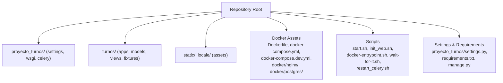
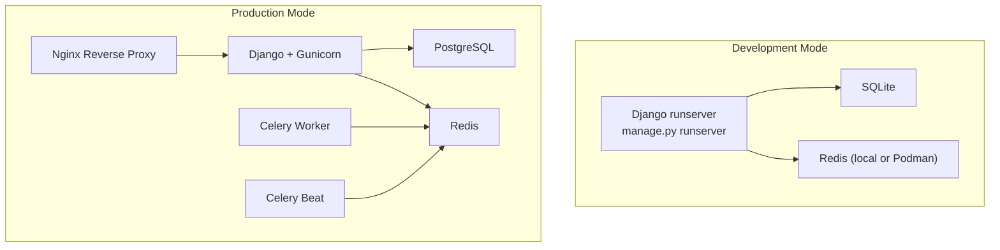
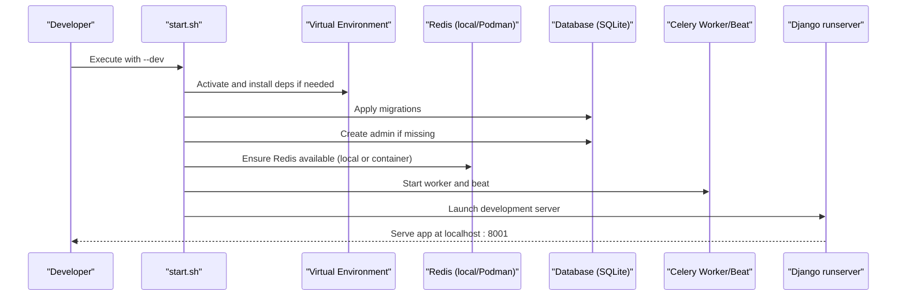
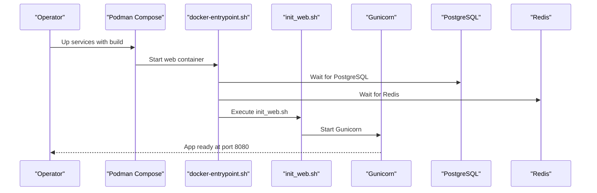
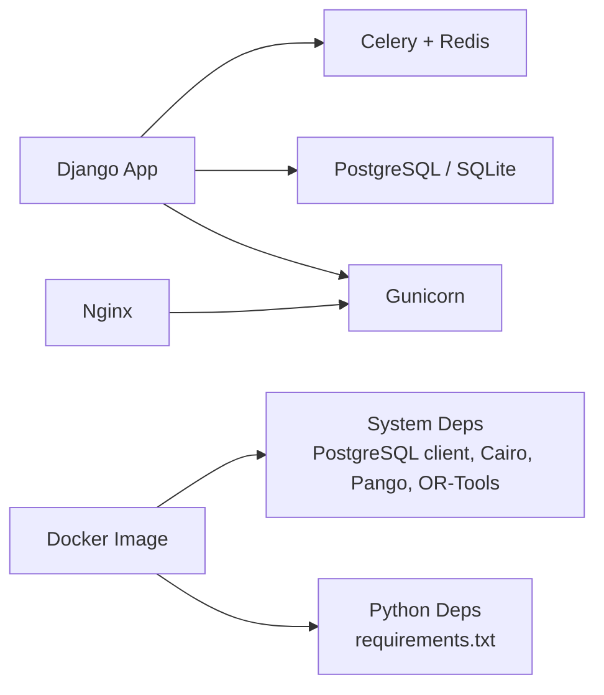

# Getting Started

<cite>
**Referenced Files in This Document**
- [README.md](file://README.md)
- [start.sh](file://start.sh)
- [init_web.sh](file://init_web.sh)
- [docker-entrypoint.sh](file://docker-entrypoint.sh)
- [wait-for-it.sh](file://wait-for-it.sh)
- [docker-compose.yml](file://docker-compose.yml)
- [docker-compose.dev.yml](file://docker-compose.dev.yml)
- [Dockerfile](file://Dockerfile)
- [requirements.txt](file://requirements.txt)
- [manage.py](file://manage.py)
- [proyecto_turnos/settings.py](file://proyecto_turnos/settings.py)
- [restart_celery.sh](file://restart_celery.sh)
</cite>

## Table of Contents
1. [Introduction](#introduction)
2. [Project Structure](#project-structure)
3. [Core Components](#core-components)
4. [Architecture Overview](#architecture-overview)
5. [Detailed Component Analysis](#detailed-component-analysis)
6. [Dependency Analysis](#dependency-analysis)
7. [Performance Considerations](#performance-considerations)
8. [Troubleshooting Guide](#troubleshooting-guide)
9. [Conclusion](#conclusion)
10. [Appendices](#appendices)

## Introduction
This guide helps you install, configure, and run the Nursing Shift Planner locally and in production. It covers:
- Cloning the repository
- Setting up a Python virtual environment
- Installing dependencies
- Running database migrations
- Starting the development server
- Using automated startup scripts
- Initial admin account creation and default credentials
- First-time configuration steps
- Deployment options (development and production) with Docker/Podman
- Troubleshooting and verification steps

## Project Structure
Key directories and files involved in setup and deployment:
- Application code: proyecto_turnos/, turnos/
- Static assets: static/, locale/
- Docker assets: Dockerfile, docker-compose.yml, docker-compose.dev.yml, docker/nginx/, docker/postgres/
- Scripts: start.sh, init_web.sh, docker-entrypoint.sh, wait-for-it.sh, restart_celery.sh
- Settings and requirements: proyecto_turnos/settings.py, requirements.txt
- Management: manage.py

**Section sources**
- [README.md:17-56](file://README.md#L17-L56)

## Core Components
- Django application with integrated Celery and Redis for async tasks
- PostgreSQL in production, SQLite in development
- Nginx reverse proxy serving static/media in production
- Automated startup scripts for development and production modes

**Section sources**
- [README.md:58-68](file://README.md#L58-L68)
- [proyecto_turnos/settings.py:62-76](file://proyecto_turnos/settings.py#L62-L76)
- [docker-compose.yml:44-151](file://docker-compose.yml#L44-L151)

## Architecture Overview
High-level runtime architecture for development and production:

**Diagram sources**
- [README.md:19-56](file://README.md#L19-L56)
- [docker-compose.yml:44-151](file://docker-compose.yml#L44-L151)
- [Dockerfile:82-86](file://Dockerfile#L82-L86)

**Section sources**
- [README.md:19-56](file://README.md#L19-L56)
- [docker-compose.yml:44-151](file://docker-compose.yml#L44-L151)
- [Dockerfile:82-86](file://Dockerfile#L82-L86)

## Detailed Component Analysis

### Installation and Setup (Local Development)
Follow these steps to set up the project locally using a virtual environment and SQLite.

- Clone the repository and enter the directory
- Create and activate a Python virtual environment
- Install dependencies from requirements.txt
- Apply database migrations
- Create standard shift types and sample data
- Create a superuser (admin)
- Run the development server

Verification:
- Access the app at the configured development URL
- Log in with the default admin credentials

**Section sources**
- [README.md:17-44](file://README.md#L17-L44)
- [manage.py:7-18](file://manage.py#L7-L18)

### Automated Startup Scripts
Two primary scripts streamline setup and operation:

- start.sh: Orchestrates development and production modes
  - Development mode: sets up Redis (local or Podman), runs migrations, ensures admin exists, starts Celery worker/beat, and launches Django runserver
  - Production mode: uses Podman/Podman Compose to build and start containers
- init_web.sh: Runs inside the production container to apply migrations, collect static files, create admin if missing, load fixtures, and start Gunicorn
- docker-entrypoint.sh: Waits for dependent services (PostgreSQL, Redis) before launching the main process
- wait-for-it.sh: Utility to wait for TCP hosts/ports with optional timeout
- restart_celery.sh: Utility to stop previous Celery processes, clear caches, and restart worker/beat

**Diagram sources**
- [start.sh:62-211](file://start.sh#L62-L211)

**Section sources**
- [start.sh:1-256](file://start.sh#L1-L256)
- [init_web.sh:1-26](file://init_web.sh#L1-L26)
- [docker-entrypoint.sh:1-15](file://docker-entrypoint.sh#L1-L15)
- [wait-for-it.sh:1-105](file://wait-for-it.sh#L1-L105)
- [restart_celery.sh:1-45](file://restart_celery.sh#L1-L45)

### Production Deployment with Docker/Podman
Production uses Docker/Podman Compose to orchestrate:
- PostgreSQL database
- Redis cache/scheduling backend
- Django web service with Gunicorn
- Celery worker and beat
- Nginx reverse proxy

Key steps:
- Copy .env.example to .env and set secure secrets
- Bring up services with Podman Compose or Docker Compose
- Verify service health and access the app via the configured port

**Diagram sources**
- [docker-compose.yml:44-151](file://docker-compose.yml#L44-L151)
- [docker-entrypoint.sh:4-11](file://docker-entrypoint.sh#L4-L11)
- [init_web.sh:4-25](file://init_web.sh#L4-L25)

**Section sources**
- [README.md:45-56](file://README.md#L45-L56)
- [docker-compose.yml:1-168](file://docker-compose.yml#L1-L168)
- [Dockerfile:16-86](file://Dockerfile#L16-L86)

### Development Containerization (Optional)
For a pure-containerized development environment, use the dedicated compose file to run web, db, redis, and a development worker with mounted volumes.

**Section sources**
- [docker-compose.dev.yml:1-68](file://docker-compose.dev.yml#L1-L68)

### Initial Administrative Account and Default Credentials
- Default admin credentials are provided for quick access during first run
- The scripts ensure the admin user exists and is ready to log in

Access details and credentials are documented in the repository’s quick start section.

**Section sources**
- [README.md:43](file://README.md#L43)
- [start.sh:86-96](file://start.sh#L86-L96)
- [init_web.sh:10-19](file://init_web.sh#L10-L19)

### First-Time Configuration Steps
- After migrations, the system creates standard shift types and loads initial data
- Use the admin interface to configure workspaces, staff, and scheduling rules
- For production, set environment variables in .env and confirm database/Redis connectivity

**Section sources**
- [init_web.sh:21-22](file://init_web.sh#L21-L22)
- [proyecto_turnos/settings.py:62-76](file://proyecto_turnos/settings.py#L62-L76)

## Dependency Analysis
External dependencies and runtime components:
- Python packages managed via requirements.txt
- Django settings support both SQLite (dev) and PostgreSQL (prod) via DATABASE_URL
- Celery configured with Redis as broker/result backend
- Docker images include system-level dependencies for PostgreSQL client, Cairo/Pango for PDF generation, and OR-Tools

**Diagram sources**
- [requirements.txt:1-67](file://requirements.txt#L1-L67)
- [Dockerfile:19-40](file://Dockerfile#L19-L40)
- [proyecto_turnos/settings.py:62-76](file://proyecto_turnos/settings.py#L62-L76)
- [docker-compose.yml:44-151](file://docker-compose.yml#L44-L151)

**Section sources**
- [requirements.txt:1-67](file://requirements.txt#L1-L67)
- [Dockerfile:19-40](file://Dockerfile#L19-L40)
- [proyecto_turnos/settings.py:62-76](file://proyecto_turnos/settings.py#L62-L76)

## Performance Considerations
- Use SQLite for local development; switch to PostgreSQL for production
- Configure Celery concurrency and timeouts per workload
- Enable WhiteNoise for static files in production
- Scale workers and threads according to CPU cores and memory

[No sources needed since this section provides general guidance]

## Troubleshooting Guide
Common setup issues and remedies:

- Django import errors
  - Cause: Missing or unactivated virtual environment
  - Fix: Recreate and activate the virtual environment; reinstall dependencies
  - Reference: [manage.py:10-17](file://manage.py#L10-L17)

- Missing SECRET_KEY or misconfigured environment
  - Symptom: Settings load failure or unexpected defaults
  - Fix: Set SECRET_KEY and other environment variables in .env
  - Reference: [proyecto_turnos/settings.py:10-12](file://proyecto_turnos/settings.py#L10-L12)

- Database connection failures
  - Symptom: Migration or startup errors
  - Fix: Confirm DATABASE_URL or SQLite path; for production, verify PostgreSQL availability
  - Reference: [proyecto_turnos/settings.py:62-76](file://proyecto_turnos/settings.py#L62-L76)

- Redis connectivity issues
  - Symptom: Celery worker/beat fail to start
  - Fix: Ensure Redis is running locally or in a container; adjust broker URLs accordingly
  - References: [start.sh:100-156](file://start.sh#L100-L156), [restart_celery.sh:8-18](file://restart_celery.sh#L8-L18)

- Port conflicts
  - Symptom: Services fail to bind to ports
  - Fix: Change ports in scripts or compose files as needed
  - References: [start.sh:44-51](file://start.sh#L44-L51), [docker-compose.yml:57-142](file://docker-compose.yml#L57-L142)

- Container readiness
  - Symptom: Web container starts before DB/Redis are ready
  - Fix: Entrypoint waits for dependencies before launching main process
  - References: [docker-entrypoint.sh:4-11](file://docker-entrypoint.sh#L4-L11), [wait-for-it.sh:31-55](file://wait-for-it.sh#L31-L55)

- Health checks and logs
  - Use container health checks and logs to diagnose issues
  - References: [Dockerfile:78-80](file://Dockerfile#L78-L80), [docker-compose.yml:20-24](file://docker-compose.yml#L20-L24), [docker-compose.yml:74-79](file://docker-compose.yml#L74-L79), [docker-compose.yml:147-151](file://docker-compose.yml#L147-L151)

**Section sources**
- [manage.py:10-17](file://manage.py#L10-L17)
- [proyecto_turnos/settings.py:10-12](file://proyecto_turnos/settings.py#L10-L12)
- [proyecto_turnos/settings.py:62-76](file://proyecto_turnos/settings.py#L62-L76)
- [start.sh:100-156](file://start.sh#L100-L156)
- [restart_celery.sh:8-18](file://restart_celery.sh#L8-L18)
- [docker-entrypoint.sh:4-11](file://docker-entrypoint.sh#L4-L11)
- [wait-for-it.sh:31-55](file://wait-for-it.sh#L31-L55)
- [Dockerfile:78-80](file://Dockerfile#L78-L80)
- [docker-compose.yml:20-24](file://docker-compose.yml#L20-L24)
- [docker-compose.yml:74-79](file://docker-compose.yml#L74-L79)
- [docker-compose.yml:147-151](file://docker-compose.yml#L147-L151)

## Conclusion
You now have the essentials to install, configure, and run the Nursing Shift Planner in development or production. Use the automated scripts to accelerate setup, verify environment variables, and ensure dependencies are healthy. For production, rely on Docker/Podman orchestration and external services for database and caching.

[No sources needed since this section summarizes without analyzing specific files]

## Appendices

### Step-by-Step Verification Checklist
- Local development
  - Virtual environment activated
  - Dependencies installed
  - Migrations applied
  - Admin user present
  - Server reachable at the expected URL
  - Celery worker/beat running
- Production
  - Containers healthy
  - Nginx proxy serving the app
  - Database and Redis reachable
  - Static/media served correctly

**Section sources**
- [README.md:17-44](file://README.md#L17-L44)
- [README.md:45-56](file://README.md#L45-L56)
- [docker-compose.yml:74-79](file://docker-compose.yml#L74-L79)
- [docker-compose.yml:147-151](file://docker-compose.yml#L147-L151)