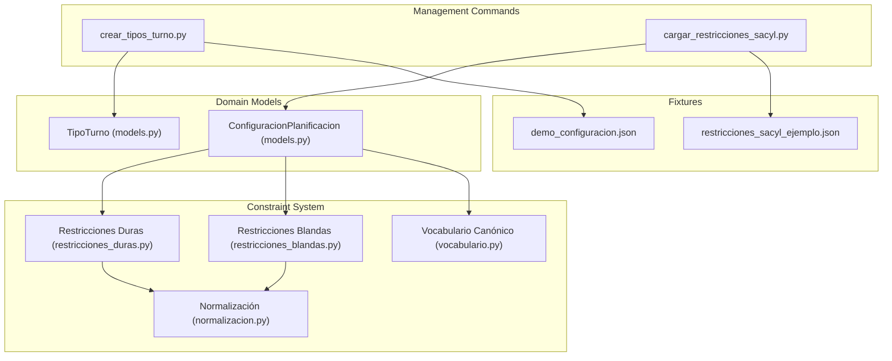
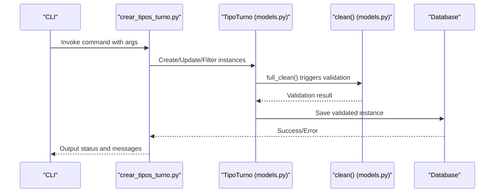
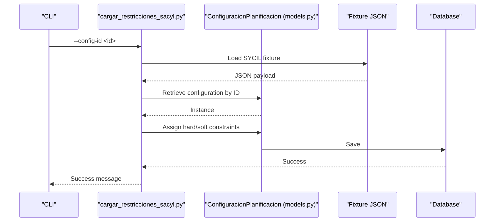
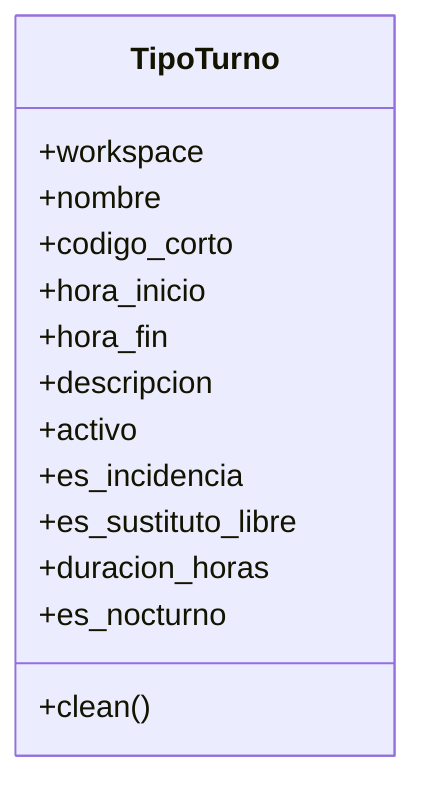
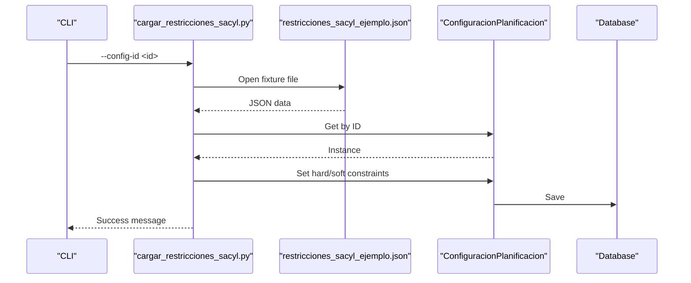
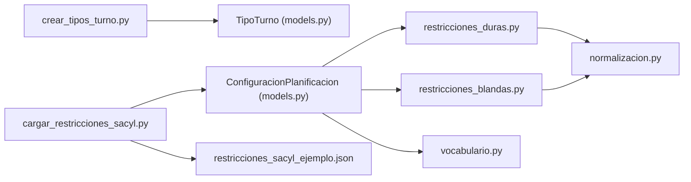

# Configuration and Setup Commands

<cite>
**Referenced Files in This Document**
- [crear_tipos_turno.py](file://turnos/management/commands/crear_tipos_turno.py)
- [cargar_restricciones_sacyl.py](file://turnos/management/commands/cargar_restricciones_sacyl.py)
- [models.py](file://turnos/models.py)
- [vocabulario.py](file://turnos/dominio/vocabulario.py)
- [restricciones_duras.py](file://turnos/restricciones_duras.py)
- [restricciones_blandas.py](file://turnos/restricciones_blandas.py)
- [normalizacion.py](file://turnos/dominio/normalizacion.py)
- [restricciones_sacyl_ejemplo.json](file://turnos/fixtures/restricciones_sacyl_ejemplo.json)
- [demo_configuracion.json](file://turnos/fixtures/demo_configuracion.json)
- [README.md](file://README.md)
- [load_all_fixtures.py](file://turnos/management/commands/load_all_fixtures.py)
</cite>

## Table of Contents
1. [Introduction](#introduction)
2. [Project Structure](#project-structure)
3. [Core Components](#core-components)
4. [Architecture Overview](#architecture-overview)
5. [Detailed Component Analysis](#detailed-component-analysis)
6. [Dependency Analysis](#dependency-analysis)
7. [Performance Considerations](#performance-considerations)
8. [Troubleshooting Guide](#troubleshooting-guide)
9. [Conclusion](#conclusion)
10. [Appendices](#appendices)

## Introduction
This document focuses on two Django management commands that enable configuration and setup of the shift type system and regional constraint configurations for the nursing scheduling platform. It explains:
- How to create and manage shift type configurations using the command-line interface
- How to load regional constraint configurations specific to the SYCIL region
- Parameter definitions, validation rules, and integration with the constraint management system
- Workflows, examples, and troubleshooting tips for constraint loading operations

## Project Structure
The configuration and setup commands live under the management/commands package and integrate with the domain models and constraint systems.

**Diagram sources**
- [crear_tipos_turno.py:1-345](file://turnos/management/commands/crear_tipos_turno.py#L1-L345)
- [cargar_restricciones_sacyl.py:1-26](file://turnos/management/commands/cargar_restricciones_sacyl.py#L1-L26)
- [models.py:60-208](file://turnos/models.py#L60-L208)
- [vocabulario.py:1-112](file://turnos/dominio/vocabulario.py#L1-L112)
- [restricciones_duras.py:1-156](file://turnos/restricciones_duras.py#L1-L156)
- [restricciones_blandas.py:1-138](file://turnos/restricciones_blandas.py#L1-L138)
- [normalizacion.py:1-190](file://turnos/dominio/normalizacion.py#L1-L190)
- [restricciones_sacyl_ejemplo.json:1-21](file://turnos/fixtures/restricciones_sacyl_ejemplo.json#L1-L21)
- [demo_configuracion.json:1-152](file://turnos/fixtures/demo_configuracion.json#L1-L152)

**Section sources**
- [README.md:1-111](file://README.md#L1-L111)

## Core Components
- Shift Type Management Command: Creates, lists, updates, and recreates shift types with validation and workspace scoping.
- Regional Constraint Loader: Loads SYCIL regional constraints into a selected configuration.

Key responsibilities:
- Validate shift type constraints (e.g., uniqueness, mandatory short code, mutual exclusivity of special flags)
- Persist configuration changes to the database
- Normalize constraint identifiers for downstream solver logic
- Integrate with the constraint management system for hard and soft constraints

**Section sources**
- [crear_tipos_turno.py:1-345](file://turnos/management/commands/crear_tipos_turno.py#L1-L345)
- [cargar_restricciones_sacyl.py:1-26](file://turnos/management/commands/cargar_restricciones_sacyl.py#L1-L26)
- [models.py:60-208](file://turnos/models.py#L60-L208)
- [normalizacion.py:68-93](file://turnos/dominio/normalizacion.py#L68-L93)

## Architecture Overview
The commands orchestrate model-level operations and integrate with the constraint system through normalized identifiers.

**Diagram sources**
- [crear_tipos_turno.py:116-234](file://turnos/management/commands/crear_tipos_turno.py#L116-L234)
- [models.py:126-168](file://turnos/models.py#L126-L168)

**Diagram sources**
- [cargar_restricciones_sacyl.py:11-26](file://turnos/management/commands/cargar_restricciones_sacyl.py#L11-L26)
- [models.py:332-480](file://turnos/models.py#L332-L480)
- [restricciones_sacyl_ejemplo.json:1-21](file://turnos/fixtures/restricciones_sacyl_ejemplo.json#L1-L21)

## Detailed Component Analysis

### Shift Type Configuration Command: crear_tipos_turno.py
Purpose:
- Create standard shift types (Morning, Afternoon, Night) with default schedules
- Create custom shift types with optional schedule or “no schedule” semantics
- List existing shift types with status and classification
- Update existing shift types (including activation/deactivation)
- Recreate standard shift types by deleting and re-creating

Key parameters and behaviors:
- Workspace scoping: optional workspace ID to isolate configurations
- Standard creation: creates Morning, Afternoon, Night with predefined hours
- Custom creation: requires name and short code; either “no schedule” or explicit start/end times
- Classification flags:
  - Incidence: marks as non-auto-assignable
  - Substitute for Free: marks as zero-hours, no schedule day
- Listing: prints formatted table with status and optional description
- Updating: supports updating code, schedule, description, and activation state
- Recreation: deletes all and re-creates standard types after confirmation

Validation rules enforced:
- Unique constraints per workspace for name and short code
- Mandatory short code length ≤ 5 characters
- Mutually exclusive flags:
  - Substitute for Free cannot have a schedule or be marked as incidence
  - Regular turn types must have both start and end times
- Model-level validation raises errors for invalid combinations

Integration with the shift type system:
- Uses the TipoTurno model with workspace foreign key
- Applies Django’s full_clean() and save() lifecycle
- Supports workspace isolation for multi-tenant environments

Example workflows:
- Create standard types for a workspace:
  - Run the standard creation option with a workspace ID
- Add custom types (e.g., “On-call” or “Day off”):
  - Use custom creation with either “no schedule” flag or explicit hours
- Update an existing type:
  - Provide the target name and desired updates (code, hours, description, activation)
- Recreate standard types:
  - Confirm deletion and re-creation of standard types

**Section sources**
- [crear_tipos_turno.py:1-345](file://turnos/management/commands/crear_tipos_turno.py#L1-L345)
- [models.py:60-208](file://turnos/models.py#L60-L208)

#### Class-level view of shift type model

**Diagram sources**
- [models.py:60-208](file://turnos/models.py#L60-L208)

### Regional Constraint Configuration Loader: cargar_restricciones_sacyl.py
Purpose:
- Load SYCIL regional constraint examples into a given configuration
- Populate both hard and soft constraints from a fixture file

Key parameters:
- Required: configuration ID to update

Behavior:
- Locates the SYCIL fixture file in the fixtures directory
- Reads JSON payload containing hard and soft constraints
- Retrieves the target configuration by ID
- Assigns hard and soft constraints arrays to the configuration
- Saves the configuration

Regional customization scenarios:
- Use the loader to apply SYCIL-specific hard constraints (e.g., minimum rest between shifts, coverage requirements)
- Apply soft constraints (e.g., equity on holidays) to guide the solver toward fair distributions

**Section sources**
- [cargar_restricciones_sacyl.py:1-26](file://turnos/management/commands/cargar_restricciones_sacyl.py#L1-L26)
- [restricciones_sacyl_ejemplo.json:1-21](file://turnos/fixtures/restricciones_sacyl_ejemplo.json#L1-L21)
- [models.py:332-480](file://turnos/models.py#L332-L480)

#### Sequence of constraint loading

**Diagram sources**
- [cargar_restricciones_sacyl.py:11-26](file://turnos/management/commands/cargar_restricciones_sacyl.py#L11-L26)
- [restricciones_sacyl_ejemplo.json:1-21](file://turnos/fixtures/restricciones_sacyl_ejemplo.json#L1-L21)
- [models.py:332-480](file://turnos/models.py#L332-L480)

### Constraint Management Integration
Normalization and vocabulary:
- Canonical identifiers define the official names for constraints and patterns
- Normalization converts legacy names to canonical forms and logs warnings for legacy usage
- The solver consumes normalized identifiers to enforce hard and soft constraints

Hard and soft constraints:
- Hard constraints are mandatory and prevent infeasible solutions
- Soft constraints are weighted penalties guiding the solver toward preferred outcomes
- Both are stored in the configuration model and later applied during planning

**Section sources**
- [vocabulario.py:1-112](file://turnos/dominio/vocabulario.py#L1-L112)
- [normalizacion.py:68-93](file://turnos/dominio/normalizacion.py#L68-L93)
- [restricciones_duras.py:25-36](file://turnos/restricciones_duras.py#L25-L36)
- [restricciones_blandas.py:24-35](file://turnos/restricciones_blandas.py#L24-L35)
- [models.py:332-480](file://turnos/models.py#L332-L480)

## Dependency Analysis
- Shift type command depends on:
  - TipoTurno model for persistence and validation
  - Workspace scoping for multi-tenancy
- Constraint loader depends on:
  - ConfiguracionPlanificacion model for persistence
  - Fixture JSON for regional constraints
- Both commands integrate with the constraint system through:
  - Canonical vocabulary and normalization utilities
  - Downstream constraint applicators (hard and soft)

**Diagram sources**
- [crear_tipos_turno.py:1-345](file://turnos/management/commands/crear_tipos_turno.py#L1-L345)
- [cargar_restricciones_sacyl.py:1-26](file://turnos/management/commands/cargar_restricciones_sacyl.py#L1-L26)
- [models.py:60-208](file://turnos/models.py#L60-L208)
- [restricciones_duras.py:1-156](file://turnos/restricciones_duras.py#L1-L156)
- [restricciones_blandas.py:1-138](file://turnos/restricciones_blandas.py#L1-L138)
- [normalizacion.py:1-190](file://turnos/dominio/normalizacion.py#L1-L190)
- [vocabulario.py:1-112](file://turnos/dominio/vocabulario.py#L1-L112)
- [restricciones_sacyl_ejemplo.json:1-21](file://turnos/fixtures/restricciones_sacyl_ejemplo.json#L1-L21)

**Section sources**
- [crear_tipos_turno.py:1-345](file://turnos/management/commands/crear_tipos_turno.py#L1-L345)
- [cargar_restricciones_sacyl.py:1-26](file://turnos/management/commands/cargar_restricciones_sacyl.py#L1-L26)
- [models.py:60-208](file://turnos/models.py#L60-L208)
- [restricciones_duras.py:1-156](file://turnos/restricciones_duras.py#L1-L156)
- [restricciones_blandas.py:1-138](file://turnos/restricciones_blandas.py#L1-L138)
- [normalizacion.py:1-190](file://turnos/dominio/normalizacion.py#L1-L190)
- [vocabulario.py:1-112](file://turnos/dominio/vocabulario.py#L1-L112)
- [restricciones_sacyl_ejemplo.json:1-21](file://turnos/fixtures/restricciones_sacyl_ejemplo.json#L1-L21)

## Performance Considerations
- Batch operations:
  - Standard creation and recreation operate on small fixed sets; performance impact is minimal
  - Loading constraints from fixtures is fast due to JSON parsing and direct assignment
- Validation overhead:
  - Model-level validation ensures data integrity but adds minimal cost for typical batch sizes
- Workspace scoping:
  - Filtering by workspace reduces query scope and improves performance in multi-tenant setups

## Troubleshooting Guide
Common issues and resolutions:
- Workspace does not exist:
  - Ensure the workspace ID exists before running shift type operations
- Invalid time format:
  - Use HH:MM format for start and end times; otherwise, the command raises an error
- Conflicting flags:
  - Substitute for Free cannot have a schedule or be marked as incidence
  - Regular turn types require both start and end times
- Unique constraint violations:
  - Short code must be unique per workspace; change the code if a conflict occurs
- Configuration not found:
  - Verify the configuration ID exists before loading SYCIL constraints
- Fixture missing:
  - Ensure the fixture file exists in the fixtures directory before loading

Validation requirements:
- Short code length ≤ 5 characters
- Unique name and short code per workspace
- Mutually exclusive flags for special types
- Presence of schedule for regular turn types

Persistence behavior:
- Shift types are persisted with full_clean() and save()
- Constraints are persisted directly into the configuration’s JSON fields

**Section sources**
- [crear_tipos_turno.py:235-286](file://turnos/management/commands/crear_tipos_turno.py#L235-L286)
- [models.py:126-168](file://turnos/models.py#L126-L168)
- [cargar_restricciones_sacyl.py:11-26](file://turnos/management/commands/cargar_restricciones_sacyl.py#L11-L26)

## Conclusion
These commands provide robust mechanisms to configure shift types and regional constraints:
- The shift type command offers flexible creation, listing, updating, and recreation with strong validation
- The constraint loader enables quick adoption of SYCIL regional standards into any configuration
- Together, they integrate seamlessly with the constraint system through canonical identifiers and normalization

## Appendices

### Example Workflows
- Create standard shift types for a workspace:
  - Run the standard creation option with a workspace ID
- Add custom types:
  - Use custom creation with either “no schedule” flag or explicit hours
- Load SYCIL constraints:
  - Run the loader with a valid configuration ID to populate hard and soft constraints

**Section sources**
- [crear_tipos_turno.py:13-30](file://turnos/management/commands/crear_tipos_turno.py#L13-L30)
- [cargar_restricciones_sacyl.py:8-10](file://turnos/management/commands/cargar_restricciones_sacyl.py#L8-L10)
- [restricciones_sacyl_ejemplo.json:1-21](file://turnos/fixtures/restricciones_sacyl_ejemplo.json#L1-L21)
- [demo_configuracion.json:1-152](file://turnos/fixtures/demo_configuracion.json#L1-L152)