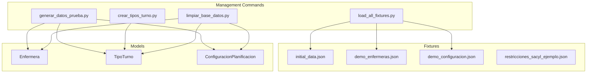
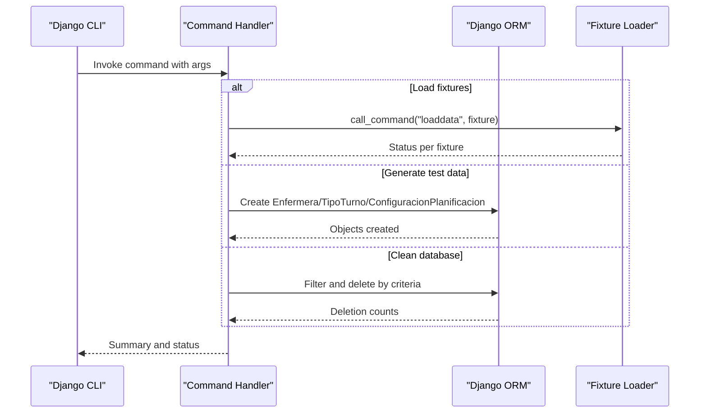
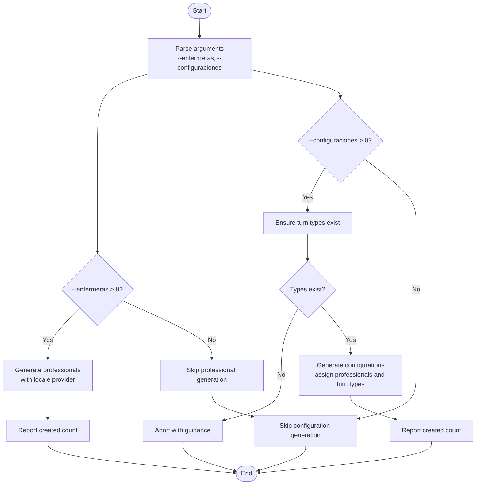
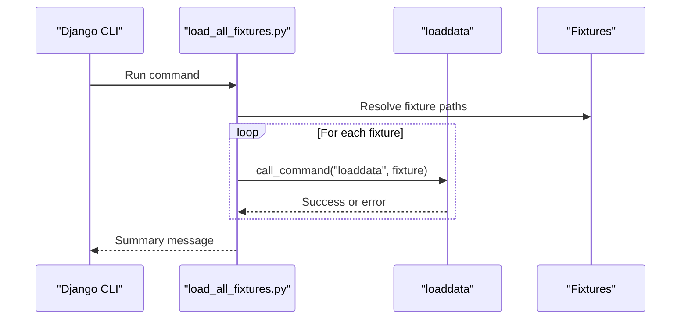
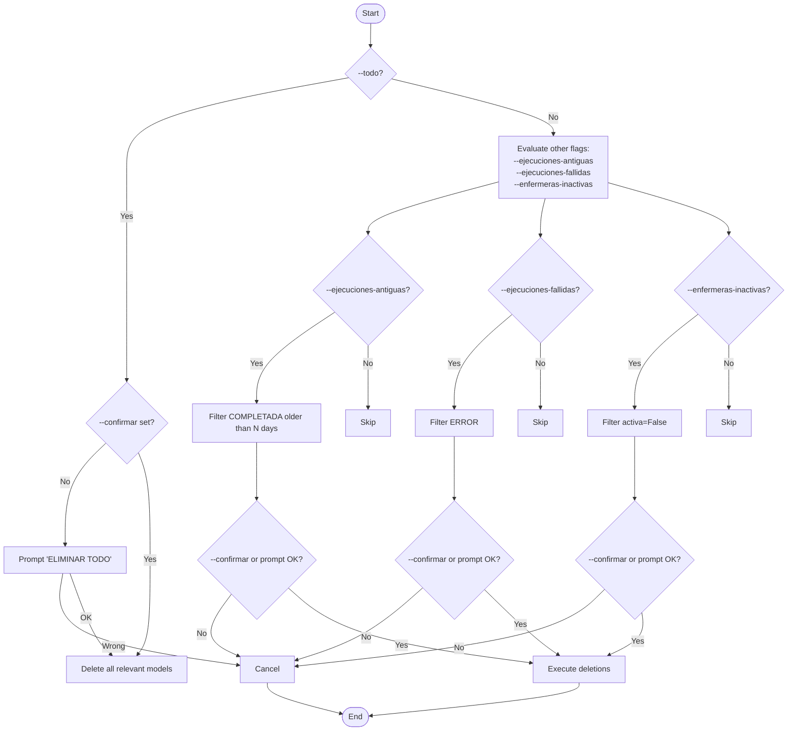
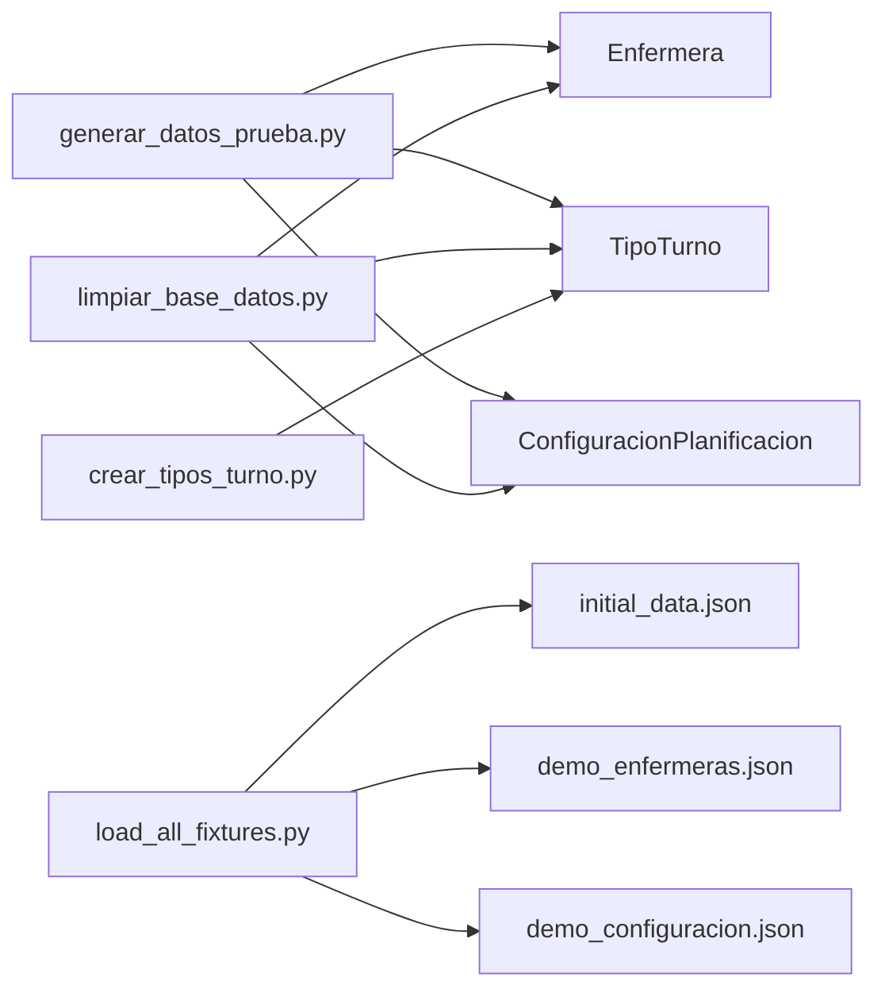

# Data Management Commands

<cite>
**Referenced Files in This Document**
- [generar_datos_prueba.py](file://turnos/management/commands/generar_datos_prueba.py)
- [load_all_fixtures.py](file://turnos/management/commands/load_all_fixtures.py)
- [limpiar_base_datos.py](file://turnos/management/commands/limpiar_base_datos.py)
- [crear_tipos_turno.py](file://turnos/management/commands/crear_tipos_turno.py)
- [initial_data.json](file://turnos/fixtures/initial_data.json)
- [demo_enfermeras.json](file://turnos/fixtures/demo_enfermeras.json)
- [demo_configuracion.json](file://turnos/fixtures/demo_configuracion.json)
- [restricciones_sacyl_ejemplo.json](file://turnos/fixtures/restricciones_sacyl_ejemplo.json)
- [models.py](file://turnos/models.py)
</cite>

## Table of Contents
1. [Introduction](#introduction)
2. [Project Structure](#project-structure)
3. [Core Components](#core-components)
4. [Architecture Overview](#architecture-overview)
5. [Detailed Component Analysis](#detailed-component-analysis)
6. [Dependency Analysis](#dependency-analysis)
7. [Performance Considerations](#performance-considerations)
8. [Troubleshooting Guide](#troubleshooting-guide)
9. [Conclusion](#conclusion)
10. [Appendices](#appendices)

## Introduction
This document explains the data management and initialization commands used to prepare and maintain the system’s dataset. It covers:
- Generating synthetic test data
- Loading demonstration fixtures
- Cleaning up the database according to policies
It also documents command parameters, validation behaviors, and integration with Django’s fixture system. Practical workflows, bulk operations, and administrative scenarios are included, along with data integrity considerations, backup and recovery guidance, and troubleshooting tips.

## Project Structure
The data management commands live under the Django app’s management commands package and leverage Django’s built-in fixture system. Fixtures are JSON files located under the fixtures directory.

**Diagram sources**
- [generar_datos_prueba.py:1-100](file://turnos/management/commands/generar_datos_prueba.py#L1-L100)
- [load_all_fixtures.py:1-24](file://turnos/management/commands/load_all_fixtures.py#L1-L24)
- [limpiar_base_datos.py:1-149](file://turnos/management/commands/limpiar_base_datos.py#L1-L149)
- [crear_tipos_turno.py:1-345](file://turnos/management/commands/crear_tipos_turno.py#L1-L345)
- [initial_data.json:1-36](file://turnos/fixtures/initial_data.json#L1-L36)
- [demo_enfermeras.json:1-197](file://turnos/fixtures/demo_enfermeras.json#L1-L197)
- [demo_configuracion.json:1-152](file://turnos/fixtures/demo_configuracion.json#L1-L152)
- [restricciones_sacyl_ejemplo.json:1-21](file://turnos/fixtures/restricciones_sacyl_ejemplo.json#L1-L21)
- [models.py:30-200](file://turnos/models.py#L30-L200)

**Section sources**
- [generar_datos_prueba.py:1-100](file://turnos/management/commands/generar_datos_prueba.py#L1-L100)
- [load_all_fixtures.py:1-24](file://turnos/management/commands/load_all_fixtures.py#L1-L24)
- [limpiar_base_datos.py:1-149](file://turnos/management/commands/limpiar_base_datos.py#L1-L149)
- [crear_tipos_turno.py:1-345](file://turnos/management/commands/crear_tipos_turno.py#L1-L345)
- [initial_data.json:1-36](file://turnos/fixtures/initial_data.json#L1-L36)
- [demo_enfermeras.json:1-197](file://turnos/fixtures/demo_enfermeras.json#L1-L197)
- [demo_configuracion.json:1-152](file://turnos/fixtures/demo_configuracion.json#L1-L152)
- [restricciones_sacyl_ejemplo.json:1-21](file://turnos/fixtures/restricciones_sacyl_ejemplo.json#L1-L21)
- [models.py:30-200](file://turnos/models.py#L30-L200)

## Core Components
- Test data generator: Creates synthetic professionals and scheduling configurations using a locale-aware provider.
- Fixture loader: Loads curated datasets for initial setup and demos.
- Database cleaner: Applies selective or wholesale cleanup with safety prompts and safeguards.
- Turn type manager: Ensures turn types exist and are configured before dependent operations.

Key capabilities:
- Bulk creation of entities
- Validation via model-level constraints
- Integration with Django’s loaddata and shell operations
- Safety checks and user prompts for destructive actions

**Section sources**
- [generar_datos_prueba.py:10-32](file://turnos/management/commands/generar_datos_prueba.py#L10-L32)
- [load_all_fixtures.py:8-23](file://turnos/management/commands/load_all_fixtures.py#L8-L23)
- [limpiar_base_datos.py:12-69](file://turnos/management/commands/limpiar_base_datos.py#L12-L69)
- [crear_tipos_turno.py:32-137](file://turnos/management/commands/crear_tipos_turno.py#L32-L137)

## Architecture Overview
The commands orchestrate data lifecycle operations around the domain models. They rely on Django’s ORM and management command framework.

**Diagram sources**
- [generar_datos_prueba.py:24-99](file://turnos/management/commands/generar_datos_prueba.py#L24-L99)
- [load_all_fixtures.py:8-23](file://turnos/management/commands/load_all_fixtures.py#L8-L23)
- [limpiar_base_datos.py:40-148](file://turnos/management/commands/limpiar_base_datos.py#L40-L148)

## Detailed Component Analysis

### Test Data Generator: generar_datos_prueba.py
Purpose:
- Generate randomized professional and scheduling configuration records for testing and demos.

Key behaviors:
- Accepts numeric arguments to control quantities for professionals and configurations.
- Uses a locale-aware provider to produce realistic attributes.
- Validates prerequisites before creating configurations (e.g., turn types and minimum active professionals).
- Provides granular feedback and error handling per record.

Parameters:
- --enfermeras: Number of professionals to create.
- --configuraciones: Number of scheduling configurations to create.

Validation and prerequisites:
- Requires turn types to exist before creating configurations.
- Warns when fewer than a recommended number of active professionals are present.

Output:
- Progress messages and success counts; warnings for individual failures.

Usage example:
- Generate 20 professionals and 5 configurations:
  - python manage.py generar_datos_prueba --enfermeras 20 --configuraciones 5

**Diagram sources**
- [generar_datos_prueba.py:10-32](file://turnos/management/commands/generar_datos_prueba.py#L10-L32)
- [generar_datos_prueba.py:33-55](file://turnos/management/commands/generar_datos_prueba.py#L33-L55)
- [generar_datos_prueba.py:57-99](file://turnos/management/commands/generar_datos_prueba.py#L57-L99)

**Section sources**
- [generar_datos_prueba.py:10-32](file://turnos/management/commands/generar_datos_prueba.py#L10-L32)
- [generar_datos_prueba.py:33-55](file://turnos/management/commands/generar_datos_prueba.py#L33-L55)
- [generar_datos_prueba.py:57-99](file://turnos/management/commands/generar_datos_prueba.py#L57-L99)

### Fixture Loader: load_all_fixtures.py
Purpose:
- Streamline loading of curated demonstration datasets.

Behavior:
- Iterates through a predefined list of fixtures and invokes Django’s loaddata command for each.
- Reports per-fixture status and overall completion.

Fixtures loaded:
- initial_data: Standard turn types (morning, afternoon, night).
- demo_enfermeras: Sample professionals with realistic attributes.
- demo_configuracion: A complete scheduling configuration with demands and constraints.

**Diagram sources**
- [load_all_fixtures.py:8-23](file://turnos/management/commands/load_all_fixtures.py#L8-L23)
- [initial_data.json:1-36](file://turnos/fixtures/initial_data.json#L1-L36)
- [demo_enfermeras.json:1-197](file://turnos/fixtures/demo_enfermeras.json#L1-L197)
- [demo_configuracion.json:1-152](file://turnos/fixtures/demo_configuracion.json#L1-L152)

**Section sources**
- [load_all_fixtures.py:8-23](file://turnos/management/commands/load_all_fixtures.py#L8-L23)
- [initial_data.json:1-36](file://turnos/fixtures/initial_data.json#L1-L36)
- [demo_enfermeras.json:1-197](file://turnos/fixtures/demo_enfermeras.json#L1-L197)
- [demo_configuracion.json:1-152](file://turnos/fixtures/demo_configuracion.json#L1-L152)

### Database Cleaner: limpiar_base_datos.py
Purpose:
- Safely remove stale or unwanted data based on operational criteria.

Supported operations:
- Remove old completed executions older than N days.
- Remove failed executions.
- Remove inactive professionals.
- Full cleanup (with explicit confirmation).

Safety mechanisms:
- Interactive confirmation prompts for destructive actions unless --confirmar is used.
- Clear reporting of affected records per operation.

**Diagram sources**
- [limpiar_base_datos.py:40-148](file://turnos/management/commands/limpiar_base_datos.py#L40-L148)

**Section sources**
- [limpiar_base_datos.py:12-69](file://turnos/management/commands/limpiar_base_datos.py#L12-L69)
- [limpiar_base_datos.py:70-148](file://turnos/management/commands/limpiar_base_datos.py#L70-L148)

### Turn Type Manager: crear_tipos_turno.py
Purpose:
- Manage turn types required by scheduling configurations.

Capabilities:
- Create standard turn types (morning, afternoon, night).
- Create custom turn types with optional hours or “without schedule” semantics.
- List existing turn types with status and durations.
- Update existing turn types (code, hours, description, activation).
- Recreate standard types after deleting all.

Integration:
- Ensures prerequisite turn types exist before dependent operations (e.g., configuration generation).

**Section sources**
- [crear_tipos_turno.py:32-137](file://turnos/management/commands/crear_tipos_turno.py#L32-L137)
- [crear_tipos_turno.py:167-234](file://turnos/management/commands/crear_tipos_turno.py#L167-L234)
- [crear_tipos_turno.py:235-286](file://turnos/management/commands/crear_tipos_turno.py#L235-L286)
- [crear_tipos_turno.py:287-322](file://turnos/management/commands/crear_tipos_turno.py#L287-L322)
- [crear_tipos_turno.py:323-334](file://turnos/management/commands/crear_tipos_turno.py#L323-L334)

## Dependency Analysis
The commands depend on the domain models and Django’s management utilities. Fixtures define canonical baseline data.

**Diagram sources**
- [generar_datos_prueba.py:1-10](file://turnos/management/commands/generar_datos_prueba.py#L1-L10)
- [load_all_fixtures.py:1-3](file://turnos/management/commands/load_all_fixtures.py#L1-L3)
- [limpiar_base_datos.py:1-7](file://turnos/management/commands/limpiar_base_datos.py#L1-L7)
- [crear_tipos_turno.py:1-4](file://turnos/management/commands/crear_tipos_turno.py#L1-L4)
- [initial_data.json:1-36](file://turnos/fixtures/initial_data.json#L1-L36)
- [demo_enfermeras.json:1-197](file://turnos/fixtures/demo_enfermeras.json#L1-L197)
- [demo_configuracion.json:1-152](file://turnos/fixtures/demo_configuracion.json#L1-L152)

**Section sources**
- [generar_datos_prueba.py:1-10](file://turnos/management/commands/generar_datos_prueba.py#L1-L10)
- [load_all_fixtures.py:1-3](file://turnos/management/commands/load_all_fixtures.py#L1-L3)
- [limpiar_base_datos.py:1-7](file://turnos/management/commands/limpiar_base_datos.py#L1-L7)
- [crear_tipos_turno.py:1-4](file://turnos/management/commands/crear_tipos_turno.py#L1-L4)

## Performance Considerations
- Bulk operations: Prefer single ORM calls to minimize round-trips; the commands already batch-create and set many-to-many relations efficiently.
- Validation overhead: Model-level validations (e.g., turn type constraints) are enforced during creation; keep fixtures minimal and correct to avoid repeated errors.
- Timezone-aware filtering: Cleanup operations compute cutoff dates using timezone-aware utilities to avoid off-by-one issues.
- I/O and memory: Fixture loading is efficient for small to medium datasets; for very large fixtures, consider splitting or streaming approaches.

## Troubleshooting Guide
Common issues and resolutions:
- Missing turn types when generating configurations:
  - Ensure turn types exist by running the turn type manager before generating configurations.
- Not enough active professionals:
  - The generator warns when fewer than a recommended threshold exists; add professionals first.
- Conflicts during fixture loading:
  - Verify fixture IDs do not collide with existing records; remove duplicates or adjust fixture primary keys.
- Destructive cleanup risks:
  - Use interactive prompts or --confirmar explicitly; always back up before full cleanup.
- Timezone-related date comparisons:
  - Ensure server timezone is correctly configured to avoid unexpected cutoff dates in cleanup operations.

**Section sources**
- [generar_datos_prueba.py:60-68](file://turnos/management/commands/generar_datos_prueba.py#L60-L68)
- [limpiar_base_datos.py:42-49](file://turnos/management/commands/limpiar_base_datos.py#L42-L49)
- [limpiar_base_datos.py:86-90](file://turnos/management/commands/limpiar_base_datos.py#L86-L90)
- [limpiar_base_datos.py:104-108](file://turnos/management/commands/limpiar_base_datos.py#L104-L108)
- [limpiar_base_datos.py:122-126](file://turnos/management/commands/limpiar_base_datos.py#L122-L126)

## Conclusion
These commands provide a robust toolkit for initializing, validating, and maintaining the system’s dataset. By combining fixture-based loads with targeted generation and cautious cleanup, teams can reliably bootstrap environments, run tests, and keep staging systems tidy while preserving production data integrity.

## Appendices

### Data Initialization Workflows
- Demo setup:
  - Create standard turn types.
  - Load initial fixtures.
  - Generate additional test data as needed.
- Quick iteration:
  - Load demo fixtures.
  - Generate a small batch of professionals and configurations.
- Reset to baseline:
  - Load initial fixtures.
  - Optionally generate a controlled amount of synthetic data.

**Section sources**
- [crear_tipos_turno.py:167-234](file://turnos/management/commands/crear_tipos_turno.py#L167-L234)
- [load_all_fixtures.py:8-23](file://turnos/management/commands/load_all_fixtures.py#L8-L23)
- [generar_datos_prueba.py:24-32](file://turnos/management/commands/generar_datos_prueba.py#L24-L32)

### Administrative Data Management Scenarios
- Periodic cleanup of stale runs:
  - Remove completed runs older than N days.
- Housekeeping of failed runs:
  - Remove all failed runs.
- Archive inactive professionals:
  - Remove inactivated profiles.
- Full reset (development only):
  - Confirm and wipe all relevant models except users.

**Section sources**
- [limpiar_base_datos.py:12-38](file://turnos/management/commands/limpiar_base_datos.py#L12-L38)
- [limpiar_base_datos.py:40-69](file://turnos/management/commands/limpiar_base_datos.py#L40-L69)
- [limpiar_base_datos.py:132-148](file://turnos/management/commands/limpiar_base_datos.py#L132-L148)

### Backup and Recovery Procedures
- Back up the database before running full cleanup.
- Keep fixture snapshots for quick restoration.
- Use transactional operations where possible; for large deletions, consider staged removals.
- Validate post-operation state against expected counts for key models.

[No sources needed since this section provides general guidance]