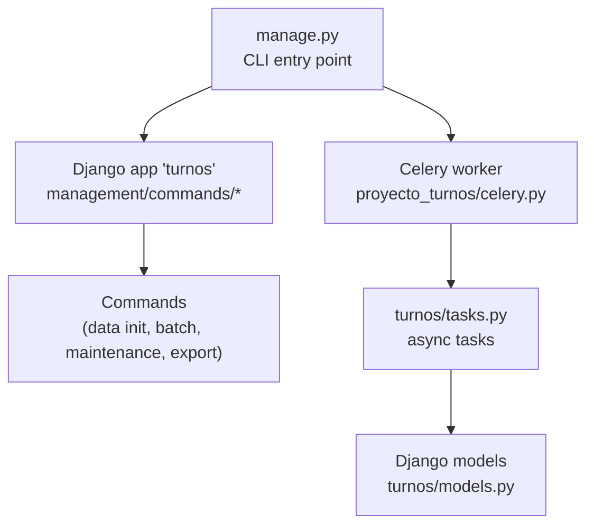
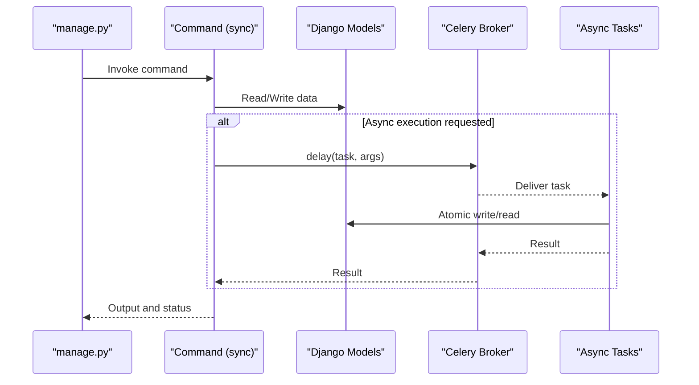
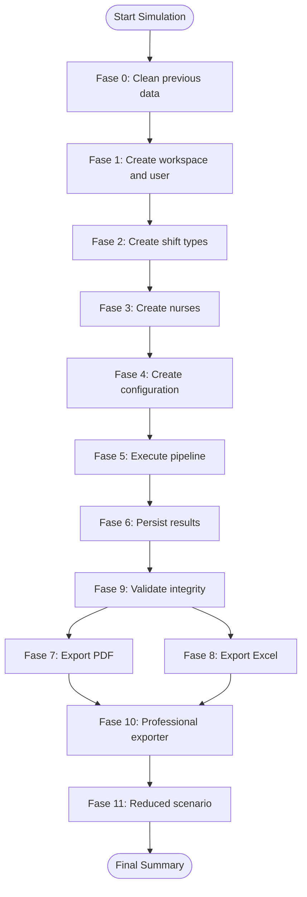
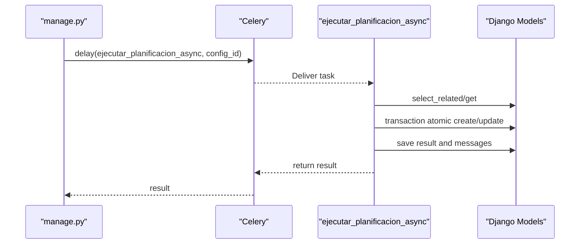
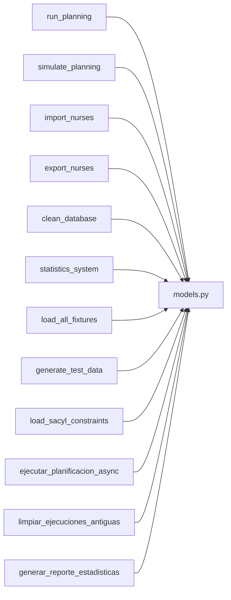

# Management Commands

<cite>
**Referenced Files in This Document**
- [manage.py](file://manage.py)
- [celery.py](file://proyecto_turnos/celery.py)
- [settings.py](file://proyecto_turnos/settings.py)
- [tasks.py](file://turnos/tasks.py)
- [run_planificacion.py](file://turnos/management/commands/run_planificacion.py)
- [simular_planificacion.py](file://turnos/management/commands/simular_planificacion.py)
- [load_all_fixtures.py](file://turnos/management/commands/load_all_fixtures.py)
- [limpiar_base_datos.py](file://turnos/management/commands/limpiar_base_datos.py)
- [generar_datos_prueba.py](file://turnos/management/commands/generar_datos_prueba.py)
- [crear_tipos_turno.py](file://turnos/management/commands/crear_tipos_turno.py)
- [estadisticas_sistema.py](file://turnos/management/commands/estadisticas_sistema.py)
- [exportar_enfermeras.py](file://turnos/management/commands/exportar_enfermeras.py)
- [importar_enfermeras.py](file://turnos/management/commands/importar_enfermeras.py)
- [cargar_restricciones_sacyl.py](file://turnos/management/commands/cargar_restricciones_sacyl.py)
- [models.py](file://turnos/models.py)
- [restricciones_sacyl_ejemplo.json](file://turnos/fixtures/restricciones_sacyl_ejemplo.json)
</cite>

## Table of Contents
1. [Introduction](#introduction)
2. [Project Structure](#project-structure)
3. [Core Components](#core-components)
4. [Architecture Overview](#architecture-overview)
5. [Detailed Component Analysis](#detailed-component-analysis)
6. [Dependency Analysis](#dependency-analysis)
7. [Performance Considerations](#performance-considerations)
8. [Troubleshooting Guide](#troubleshooting-guide)
9. [Conclusion](#conclusion)
10. [Appendices](#appendices)

## Introduction
This document describes the Django management commands and CLI utilities for the turn scheduling system. It covers data initialization, batch processing, system maintenance, and export operations. It also explains command parameters, usage patterns, and integration with the asynchronous task system powered by Celery. Examples of administrative workflows and automation scenarios are included, along with guidance on command-line arguments, output formatting, and error handling strategies.

## Project Structure
The management commands live under the Django app’s management/commands directory. They are invoked via the Django entry point script manage.py. The asynchronous task system is implemented with Celery and integrates with Django models and the application’s core scheduling logic.

**Diagram sources**
- [manage.py:1-23](file://manage.py#L1-L23)
- [celery.py:1-14](file://proyecto_turnos/celery.py#L1-L14)
- [tasks.py:1-20](file://turnos/tasks.py#L1-L20)

**Section sources**
- [manage.py:1-23](file://manage.py#L1-L23)
- [celery.py:1-14](file://proyecto_turnos/celery.py#L1-L14)

## Core Components
- Data initialization and setup:
  - create_types_of_shifts: Create standard or custom shift types with configurable codes and optional schedules.
  - load_all_fixtures: Load demonstration datasets.
  - generate_test_data: Generate randomized test data for nurses and planning configurations.
  - import_nurses: Import nurse records from CSV with validation and optional updates.
  - export_nurses: Export nurse records to CSV with filtering options.
  - load_sacyl_constraints: Load example regional constraints into a planning configuration.
- Planning execution:
  - run_planning: Execute planning synchronously for a given configuration.
  - simulate_planning: Comprehensive simulation covering workspace creation, shift types, nurses, configuration, pipeline execution, persistence, validation, and exports.
- System maintenance:
  - clean_database: Clean old or failed executions, inactive nurses, or entire dataset with safety prompts.
  - statistics_system: Print system-wide statistics (counts, completion rates, averages).
- Task queue integration:
  - Async planning tasks: Execute planning asynchronously and persist results.
  - Periodic cleanup and reporting tasks: Cleanup old executions and generate monthly statistics.

**Section sources**
- [crear_tipos_turno.py:1-345](file://turnos/management/commands/crear_tipos_turno.py#L1-L345)
- [load_all_fixtures.py:1-24](file://turnos/management/commands/load_all_fixtures.py#L1-L24)
- [generar_datos_prueba.py:1-100](file://turnos/management/commands/generar_datos_prueba.py#L1-L100)
- [importar_enfermeras.py:1-167](file://turnos/management/commands/importar_enfermeras.py#L1-L167)
- [exportar_enfermeras.py:1-58](file://turnos/management/commands/exportar_enfermeras.py#L1-L58)
- [cargar_restricciones_sacyl.py:1-26](file://turnos/management/commands/cargar_restricciones_sacyl.py#L1-L26)
- [run_planificacion.py:1-40](file://turnos/management/commands/run_planificacion.py#L1-L40)
- [simular_planificacion.py:1-773](file://turnos/management/commands/simular_planificacion.py#L1-L773)
- [limpiar_base_datos.py:1-149](file://turnos/management/commands/limpiar_base_datos.py#L1-L149)
- [estadisticas_sistema.py:1-98](file://turnos/management/commands/estadisticas_sistema.py#L1-L98)
- [tasks.py:17-240](file://turnos/tasks.py#L17-L240)

## Architecture Overview
The CLI commands integrate with Django models and optionally trigger Celery tasks for asynchronous execution. The Celery app is configured to use Django settings and autodiscovers tasks from the app.

**Diagram sources**
- [manage.py:1-23](file://manage.py#L1-L23)
- [tasks.py:17-240](file://turnos/tasks.py#L17-L240)
- [celery.py:1-14](file://proyecto_turnos/celery.py#L1-L14)

## Detailed Component Analysis

### Data Initialization and Setup

#### create_types_of_shifts
- Purpose: Manage shift types per workspace, including standard creation, custom creation, listing, updating, activation/deactivation, and recreation.
- Key parameters:
  - --workspace-id: Target workspace identifier.
  - --create-standard, --create NAME CODE [--hours HH:MM HH:MM | --without-schedule], --incidence, --substitute-free-day, --description TEXT, --list, --update NAME, --activate, --deactivate, --recreate.
- Behavior:
  - Creates standard shifts (Morning, Afternoon, Night) with codes and schedules.
  - Supports custom shift types with optional schedule or “without schedule” semantics.
  - Validates constraints (e.g., substitute-free days cannot have schedules).
  - Lists existing types with status and descriptions.
  - Updates existing types and toggles activation.
  - Recreates all standard types after user confirmation.

**Section sources**
- [crear_tipos_turno.py:1-345](file://turnos/management/commands/crear_tipos_turno.py#L1-L345)
- [models.py:60-200](file://turnos/models.py#L60-L200)

#### load_all_fixtures
- Purpose: Load demonstration datasets in order.
- Behavior:
  - Calls Django’s loaddata for initial_data, demo_enfermeras, and demo_configuracion.
  - Reports success/failure per fixture.

**Section sources**
- [load_all_fixtures.py:1-24](file://turnos/management/commands/load_all_fixtures.py#L1-L24)

#### generate_test_data
- Purpose: Generate randomized test data for nurses and planning configurations.
- Key parameters:
  - --nurses COUNT, --configurations COUNT.
- Behavior:
  - Generates nurses with realistic attributes.
  - Generates planning configurations with random durations, dates, and selected shift types/enfermeras.
  - Provides warnings when prerequisites are missing.

**Section sources**
- [generar_datos_prueba.py:1-100](file://turnos/management/commands/generar_datos_prueba.py#L1-L100)

#### import_nurses
- Purpose: Import nurse records from CSV with validation and optional updates.
- Key parameters:
  - archivo_csv PATH, --update, --example.
- Behavior:
  - Validates required fields (name, email).
  - Accepts multiple date formats and flexible boolean values for active status.
  - Uses email to update-or-create records when requested.
  - Summarizes created, updated, and errored rows.

**Section sources**
- [importar_enfermeras.py:1-167](file://turnos/management/commands/importar_enfermeras.py#L1-L167)

#### export_nurses
- Purpose: Export nurse records to CSV with optional filtering.
- Key parameters:
  - --file FILENAME, --active-only.
- Behavior:
  - Writes header and iterates ordered records.
  - Handles encoding and optional filter for active nurses.

**Section sources**
- [exportar_enfermeras.py:1-58](file://turnos/management/commands/exportar_enfermeras.py#L1-L58)

#### load_sacyl_constraints
- Purpose: Load example regional constraints into a planning configuration.
- Key parameters:
  - --config-id ID.
- Behavior:
  - Reads fixture JSON and updates the configuration’s hard and soft constraints.

**Section sources**
- [cargar_restricciones_sacyl.py:1-26](file://turnos/management/commands/cargar_restricciones_sacyl.py#L1-L26)
- [restricciones_sacyl_ejemplo.json:1-21](file://turnos/fixtures/restricciones_sacyl_ejemplo.json#L1-L21)

### Planning Execution

#### run_planning
- Purpose: Execute planning synchronously for a given configuration ID.
- Key parameters:
  - config_id INT.
- Behavior:
  - Loads configuration, runs generator, prints success/warnings/errors, and reports number of assignments.

**Section sources**
- [run_planificacion.py:1-40](file://turnos/management/commands/run_planificacion.py#L1-L40)

#### simulate_planning
- Purpose: Comprehensive simulation including workspace, shift types, nurses, configuration, pipeline execution, persistence, validation, and exports.
- Behavior:
  - Fase 0–11: Cleans prior data, creates workspace/user, shift types, nurses, configuration, executes pipeline, persists results, validates integrity, exports PDF/Excel, and runs reduced scenario.
  - Outputs pass/fail per phase and a final summary.

**Diagram sources**
- [simular_planificacion.py:49-766](file://turnos/management/commands/simular_planificacion.py#L49-L766)

**Section sources**
- [simular_planificacion.py:1-773](file://turnos/management/commands/simular_planificacion.py#L1-L773)

### System Maintenance

#### clean_database
- Purpose: Clean database according to criteria with safety prompts.
- Key parameters:
  - --executions-old DIAS, --executions-failed, --inactive-nurses, --all, --confirm.
- Behavior:
  - Deletes old completed executions, failed executions, or inactive nurses.
  - Dangerous --all option requires explicit confirmation and lists counts per model.

**Section sources**
- [limpiar_base_datos.py:1-149](file://turnos/management/commands/limpiar_base_datos.py#L1-L149)

#### statistics_system
- Purpose: Print system-wide statistics.
- Behavior:
  - Counts and aggregates across nurses, shift types, configurations, executions, and users.
  - Computes success rate, average penalty, and average duration for completed executions.

**Section sources**
- [estadisticas_sistema.py:1-98](file://turnos/management/commands/estadisticas_sistema.py#L1-L98)

### Task Queue Integration (Celery)

#### Celery Configuration
- The Celery app is configured to use Django settings and autodiscovers tasks.
- Settings define broker, result backend, serialization, timezone, and worker/task limits.

**Section sources**
- [celery.py:1-14](file://proyecto_turnos/celery.py#L1-L14)
- [settings.py:134-159](file://proyecto_turnos/settings.py#L134-L159)

#### Async Planning Tasks
- ejecutar_planificacion_async:
  - Executes planning asynchronously for a configuration ID.
  - Manages execution lifecycle, atomic writes, retries, and result logging.
- ejecutar_planificacion_motor_async:
  - New motor pipeline execution with rotation, coverage, and historical balances.
  - Persists planilla and updated balances.
- limpiar_ejecuciones_antiguas:
  - Deletes old completed/error executions older than N days.
- generar_reporte_estadisticas:
  - Generates monthly statistics for completed executions and planillas.

**Diagram sources**
- [tasks.py:17-240](file://turnos/tasks.py#L17-L240)

**Section sources**
- [tasks.py:17-240](file://turnos/tasks.py#L17-L240)
- [tasks.py:242-268](file://turnos/tasks.py#L242-L268)
- [tasks.py:271-314](file://turnos/tasks.py#L271-L314)
- [tasks.py:333-696](file://turnos/tasks.py#L333-L696)

## Dependency Analysis
- Commands depend on Django models and the application’s domain logic.
- Async tasks depend on Celery configuration and Django ORM within atomic transactions.
- Fixture loading depends on JSON files packaged with the repository.

**Diagram sources**
- [run_planificacion.py:1-40](file://turnos/management/commands/run_planificacion.py#L1-L40)
- [simular_planificacion.py:1-773](file://turnos/management/commands/simular_planificacion.py#L1-L773)
- [importar_enfermeras.py:1-167](file://turnos/management/commands/importar_enfermeras.py#L1-L167)
- [exportar_enfermeras.py:1-58](file://turnos/management/commands/exportar_enfermeras.py#L1-L58)
- [limpiar_base_datos.py:1-149](file://turnos/management/commands/limpiar_base_datos.py#L1-L149)
- [estadisticas_sistema.py:1-98](file://turnos/management/commands/estadisticas_sistema.py#L1-L98)
- [load_all_fixtures.py:1-24](file://turnos/management/commands/load_all_fixtures.py#L1-L24)
- [generar_datos_prueba.py:1-100](file://turnos/management/commands/generar_datos_prueba.py#L1-L100)
- [cargar_restricciones_sacyl.py:1-26](file://turnos/management/commands/cargar_restricciones_sacyl.py#L1-L26)
- [tasks.py:17-240](file://turnos/tasks.py#L17-L240)

**Section sources**
- [models.py:1-200](file://turnos/models.py#L1-L200)
- [tasks.py:17-240](file://turnos/tasks.py#L17-L240)

## Performance Considerations
- Bulk operations: Prefer bulk creation for assignments to minimize database round-trips.
- Transactions: Use atomic blocks around execution and persistence to maintain consistency.
- Retry policies: Asynchronous tasks include retry logic with exponential backoff-like delays.
- Timeouts: Celery task limits are configured to prevent long-running tasks from blocking workers.
- Logging: Tasks log compressed JSON for diagnostics and AI analysis.

[No sources needed since this section provides general guidance]

## Troubleshooting Guide
- Command errors:
  - Use --help for each command to review available options.
  - Many commands print warnings or errors to stdout/stderr and exit with non-zero status on failure.
- Safety prompts:
  - The clean_database command with --all requires explicit confirmation.
- CSV import:
  - Ensure required fields (name, email) are present.
  - Acceptable date formats and flexible boolean values are supported.
- Fixture loading:
  - Verify fixture path and configuration existence before loading constraints.
- Async tasks:
  - Confirm Celery broker/result backend connectivity and that the worker is running.
  - Inspect task logs for retried attempts and final error messages.

**Section sources**
- [limpiar_base_datos.py:42-52](file://turnos/management/commands/limpiar_base_datos.py#L42-L52)
- [importar_enfermeras.py:45-48](file://turnos/management/commands/importar_enfermeras.py#L45-L48)
- [cargar_restricciones_sacyl.py:15-25](file://turnos/management/commands/cargar_restricciones_sacyl.py#L15-L25)
- [tasks.py:204-240](file://turnos/tasks.py#L204-L240)

## Conclusion
The management commands provide a comprehensive toolkit for initializing data, running simulations, maintaining the system, exporting information, and integrating with Celery for asynchronous planning execution. By combining CLI-driven workflows with robust task queues and model-backed persistence, administrators can automate routine operations and scale planning tasks efficiently.

[No sources needed since this section summarizes without analyzing specific files]

## Appendices

### Administrative Workflows and Automation Scenarios
- Initial setup:
  - Create shift types, load fixtures, import nurses, and generate test configurations.
- Routine maintenance:
  - Periodically clean old or failed executions and inactive nurses.
- Reporting:
  - Use system statistics to monitor completion rates and performance metrics.
- Export operations:
  - Export nurse lists for HR or payroll systems with optional filters.
- Full automation:
  - Schedule Celery tasks for nightly planning runs and monthly cleanup/reporting.

[No sources needed since this section provides general guidance]