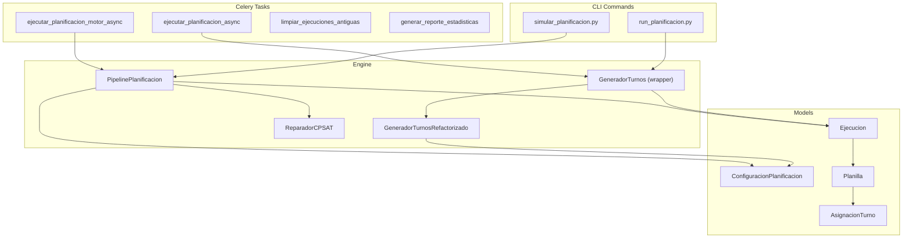
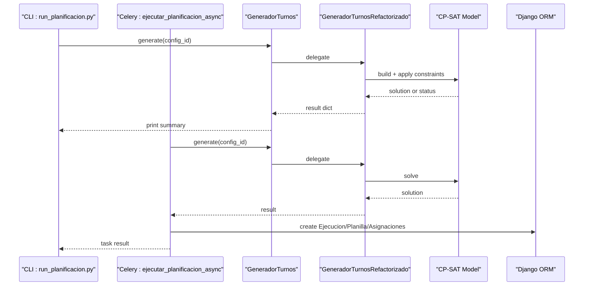
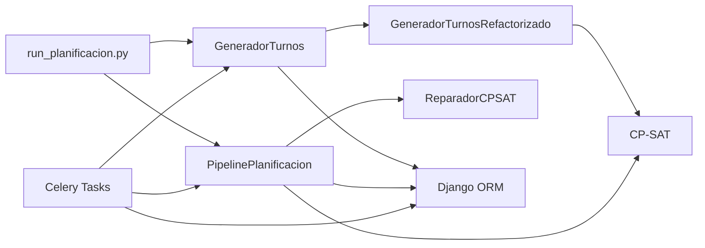

# Planning and Execution Commands

<cite>
**Referenced Files in This Document**
- [run_planificacion.py](file://turnos/management/commands/run_planificacion.py)
- [simular_planificacion.py](file://turnos/management/commands/simular_planificacion.py)
- [tasks.py](file://turnos/tasks.py)
- [celery.py](file://proyecto_turnos/celery.py)
- [generador.py](file://turnos/generador.py)
- [generador_refactorizado.py](file://turnos/generador_refactorizado.py)
- [pipeline.py](file://turnos/motor/pipeline.py)
- [reparador.py](file://turnos/motor/reparador.py)
- [models.py](file://turnos/models.py)
</cite>

## Table of Contents
1. [Introduction](#introduction)
2. [Project Structure](#project-structure)
3. [Core Components](#core-components)
4. [Architecture Overview](#architecture-overview)
5. [Detailed Component Analysis](#detailed-component-analysis)
6. [Dependency Analysis](#dependency-analysis)
7. [Performance Considerations](#performance-considerations)
8. [Troubleshooting Guide](#troubleshooting-guide)
9. [Conclusion](#conclusion)
10. [Appendices](#appendices)

## Introduction
This document explains the planning and execution commands for generating nurse schedules. It covers:
- The run_planificacion.py command for executing the constraint satisfaction algorithm against a selected configuration.
- The simular_planificacion.py command for end-to-end simulation of the planning pipeline, including persistence, exports, and validation.
- Background processing via Celery tasks for asynchronous execution.
- Integration with the CP-SAT solver and the modern planning pipeline.
- Practical examples, parameter configuration, result interpretation, performance tips, and troubleshooting.

## Project Structure
The planning commands live under Django’s management commands and integrate with Celery tasks and the planning engine:
- Management commands: turnos/management/commands/
- Background tasks: turnos/tasks.py
- Celery app: proyecto_turnos/celery.py
- Planning engine: turnos/generador.py and turnos/generador_refactorizado.py
- New pipeline: turnos/motor/pipeline.py and supporting modules
- Domain models: turnos/models.py

**Diagram sources**
- [run_planificacion.py:1-40](file://turnos/management/commands/run_planificacion.py#L1-L40)
- [simular_planificacion.py:1-773](file://turnos/management/commands/simular_planificacion.py#L1-L773)
- [tasks.py:17-240](file://turnos/tasks.py#L17-L240)
- [generador.py:26-65](file://turnos/generador.py#L26-L65)
- [generador_refactorizado.py:17-140](file://turnos/generador_refactorizado.py#L17-L140)
- [pipeline.py:31-200](file://turnos/motor/pipeline.py#L31-L200)
- [reparador.py:24-96](file://turnos/motor/reparador.py#L24-L96)
- [models.py:332-532](file://turnos/models.py#L332-L532)

**Section sources**
- [run_planificacion.py:1-40](file://turnos/management/commands/run_planificacion.py#L1-L40)
- [simular_planificacion.py:1-773](file://turnos/management/commands/simular_planificacion.py#L1-L773)
- [tasks.py:17-240](file://turnos/tasks.py#L17-L240)
- [generador.py:26-65](file://turnos/generador.py#L26-L65)
- [generador_refactorizado.py:17-140](file://turnos/generador_refactorizado.py#L17-L140)
- [pipeline.py:31-200](file://turnos/motor/pipeline.py#L31-L200)
- [reparador.py:24-96](file://turnos/motor/reparador.py#L24-L96)
- [models.py:332-532](file://turnos/models.py#L332-L532)

## Core Components
- run_planificacion.py: Executes the legacy generator against a given configuration ID and prints results and violations.
- simular_planificacion.py: Full-stack simulation: creates workspace/user, types of shifts, nurses, configuration, runs the new pipeline, persists results, validates, and exports PDF/Excel.
- Celery tasks: Asynchronous execution of planning, with retries, persistence, and reporting.
- Engine: Legacy wrapper delegates to the refactored generator; the refactored generator orchestrates CP-SAT constraints and resolution. The new pipeline adds rotation, hours adjustment, coverage analysis, CP-SAT repair, and validation.

Key execution modes:
- CLI synchronous: run_planificacion.py
- CLI simulation: simular_planificacion.py
- Async via Celery: tasks for legacy and new pipeline

**Section sources**
- [run_planificacion.py:10-39](file://turnos/management/commands/run_planificacion.py#L10-L39)
- [simular_planificacion.py:768-773](file://turnos/management/commands/simular_planificacion.py#L768-L773)
- [tasks.py:17-240](file://turnos/tasks.py#L17-L240)
- [generador.py:26-65](file://turnos/generador.py#L26-L65)
- [generador_refactorizado.py:17-140](file://turnos/generador_refactorizado.py#L17-L140)
- [pipeline.py:31-200](file://turnos/motor/pipeline.py#L31-L200)

## Architecture Overview
The planning process integrates configuration-driven constraints with CP-SAT. The legacy path uses a single-phase CP-SAT model; the new pipeline splits work into five orchestrated phases.

**Diagram sources**
- [run_planificacion.py:13-39](file://turnos/management/commands/run_planificacion.py#L13-L39)
- [tasks.py:17-240](file://turnos/tasks.py#L17-L240)
- [generador.py:26-65](file://turnos/generador.py#L26-L65)
- [generador_refactorizado.py:105-139](file://turnos/generador_refactorizado.py#L105-L139)
- [models.py:482-532](file://turnos/models.py#L482-L532)

## Detailed Component Analysis

### Command: run_planificacion.py
Purpose:
- Execute the legacy constraint satisfaction algorithm for a given configuration ID.
- Print success, number of assignments, and any hard constraint violations found during validation.

Parameters:
- config_id: integer ID of the configuration to run.

Behavior:
- Loads ConfiguracionPlanificacion by ID.
- Instantiates GeneradorTurnos and calls generate().
- Interprets the returned dictionary to print outcomes and warnings.
- Handles missing configuration and unexpected errors.

Integration with CP-SAT:
- Delegates to GeneradorTurnosRefactorizado, which builds CP-SAT constraints and resolves the model.

Results interpretation:
- success: whether a feasible solution was found.
- num_asignaciones: total assignments created.
- validacion.violaciones: list of hard constraint violations detected after solving.

Common scenarios:
- Successful run: prints success message and assignment count.
- Violations present: prints violation entries.
- Configuration not found: prints error.
- Unexpected error: logs exception and prints generic error.

**Section sources**
- [run_planificacion.py:10-39](file://turnos/management/commands/run_planificacion.py#L10-L39)
- [generador.py:26-65](file://turnos/generador.py#L26-L65)
- [generador_refactorizado.py:105-139](file://turnos/generador_refactorizado.py#L105-L139)

### Command: simular_planificacion.py
Purpose:
- End-to-end simulation of the planning pipeline:
  - Clean previous simulation data.
  - Create workspace and user.
  - Create shift types (M/T/N) with short codes.
  - Create sample nurses.
  - Create a configuration for a full month with demand, hard and soft constraints, and solver settings.
  - Run the new PipelinePlanificacion.
  - Persist Ejecucion, Planilla, and AsignacionTurno.
  - Validate data integrity.
  - Export PDF and Excel.
  - Export professional PDF/Excel.
  - Run a reduced scenario (smaller workforce) to validate scaling.

Key steps:
- Fase 0–1: Cleanup and workspace creation.
- Fase 2: Shift types with short codes and verification.
- Fase 3: Sample nurses.
- Fase 4: Configuration with demand, constraints, and solver parameters.
- Fase 5: Pipeline execution and statistics.
- Fase 6: Persistence of execution, planilla, and assignments.
- Fase 7–8: PDF and Excel export.
- Fase 9: Integrity checks on persisted data.
- Fase 10: Professional export.
- Fase 11: Reduced scenario.

Solver configuration in simulation:
- Uses PipelinePlanificacion with turnos_info, demand-derived coverage_minima, and solver-related parameters.

Validation:
- Ensures all cells are either TURNO with a shift or LIBRE.
- Ensures all assigned shifts have a short code.
- Counts totals per shift type and free days.

Exports:
- PDF and Excel generated via exportation utilities.
- Professional exporter produces compact, branded documents.

**Section sources**
- [simular_planificacion.py:49-773](file://turnos/management/commands/simular_planificacion.py#L49-L773)
- [pipeline.py:92-200](file://turnos/motor/pipeline.py#L92-L200)

### Celery Integration and Background Processing
Tasks:
- ejecutar_planificacion_async: Legacy generator path. Validates ID, loads configuration, updates Ejecucion state, solves, persists Planilla and Asignaciones, and returns structured results. Includes retry logic.
- ejecutar_planificacion_motor_async: New pipeline path. Builds matrices, applies rotation/hours/coverage, repairs conflicts with CP-SAT, validates, persists results, and updates historical balances.
- limpiar_ejecuciones_antiguas: Periodic cleanup of old completed/error executions.
- generar_reporte_estadisticas: Monthly statistics aggregation.

Progress tracking:
- Ejecucion tracks state (PENDING, PROCESSING, COMPLETED, INVIABLE, ERROR), timestamps, duration, optimality flag, penalties, and messages.
- Results include counts, solver status, and validation metadata.

Background execution:
- Celery app configured with Django settings and autodiscover_tasks.
- Tasks decorated with shared_task and optional bind=True for retries.

**Section sources**
- [tasks.py:17-240](file://turnos/tasks.py#L17-L240)
- [tasks.py:242-314](file://turnos/tasks.py#L242-L314)
- [tasks.py:333-697](file://turnos/tasks.py#L333-L697)
- [celery.py:1-14](file://proyecto_turnos/celery.py#L1-L14)
- [models.py:482-532](file://turnos/models.py#L482-L532)

### Constraint Satisfaction and CP-SAT Integration
Legacy generator:
- GeneradorTurnos wraps GeneradorTurnosRefactorizado.
- The refactored generator builds CP-SAT variables and constraints, then resolves the model.
- Validation runs after solving to collect hard constraint violations.

New pipeline:
- PipelinePlanificacion orchestrates five phases: rotation base, hours adjustment, coverage analysis, CP-SAT repair, and validation.
- Repairer (ReparadorCPSAT) modifies conflicted cells respecting hard constraints and proximity to base rotation.
- Solver parameters include timeout and worker count.

**Section sources**
- [generador.py:26-65](file://turnos/generador.py#L26-L65)
- [generador_refactorizado.py:17-140](file://turnos/generador_refactorizado.py#L17-L140)
- [pipeline.py:31-200](file://turnos/motor/pipeline.py#L31-L200)
- [reparador.py:24-96](file://turnos/motor/reparador.py#L24-L96)

### Data Models Involved in Execution
- ConfiguracionPlanificacion: stores planning configuration, constraints, solver parameters, and selected resources.
- Ejecucion: lifecycle of a planning run with state, timing, optimality, penalties, and results.
- Planilla: generated schedule linked to an execution.
- AsignacionTurno: daily assignment records with shift, free day marker, and cell type.

**Section sources**
- [models.py:332-532](file://turnos/models.py#L332-L532)
- [models.py:568-623](file://turnos/models.py#L568-L623)
- [models.py:629-825](file://turnos/models.py#L629-L825)

## Dependency Analysis
High-level dependencies:
- CLI commands depend on GeneradorTurnos (legacy) or PipelinePlanificacion (new).
- Celery tasks depend on models and orchestrate persistence.
- Both paths converge on CP-SAT for constraint satisfaction.

**Diagram sources**
- [run_planificacion.py:13-39](file://turnos/management/commands/run_planificacion.py#L13-L39)
- [generador.py:26-65](file://turnos/generador.py#L26-L65)
- [generador_refactorizado.py:105-139](file://turnos/generador_refactorizado.py#L105-L139)
- [pipeline.py:92-200](file://turnos/motor/pipeline.py#L92-L200)
- [reparador.py:63-96](file://turnos/motor/reparador.py#L63-L96)
- [tasks.py:17-240](file://turnos/tasks.py#L17-L240)

**Section sources**
- [run_planificacion.py:13-39](file://turnos/management/commands/run_planificacion.py#L13-L39)
- [generador.py:26-65](file://turnos/generador.py#L26-L65)
- [generador_refactorizado.py:105-139](file://turnos/generador_refactorizado.py#L105-L139)
- [pipeline.py:92-200](file://turnos/motor/pipeline.py#L92-L200)
- [reparador.py:63-96](file://turnos/motor/reparador.py#L63-L96)
- [tasks.py:17-240](file://turnos/tasks.py#L17-L240)

## Performance Considerations
- Solver parameters:
  - num_trabajadores (parallel workers) and tiempo_maximo_segundos control CPU and time limits.
  - New pipeline sets solver timeouts and worker counts for repair phase.
- Coverage analysis and repair:
  - Detects conflicts early and repairs only affected regions, minimizing unnecessary solving.
- Bulk creation:
  - AsignacionTurno bulk_create reduces database round trips.
- Historical balances:
  - Updated efficiently per period to avoid recomputation overhead.
- Recommendations:
  - Tune tiempo_maximo_segundos based on dataset size.
  - Prefer the new pipeline for complex constraints and large periods.
  - Use smaller test scenarios (like the reduced scenario in the simulator) to calibrate parameters.

[No sources needed since this section provides general guidance]

## Troubleshooting Guide
Common issues and resolutions:
- Configuration not found:
  - Ensure the config_id exists and is active.
  - Verify workspace membership and selection of nurses/shifts.
- Infeasible solution:
  - Review hard constraints and demand vs. available staff.
  - Reduce restrictions or adjust demand expectations.
- Violations reported:
  - Inspect the validation messages attached to Ejecucion.mensajes.
  - Adjust constraints or increase staffing.
- Export failures:
  - Check permissions and temporary storage paths.
  - Validate that all assigned shifts have short codes.
- Celery task errors:
  - Inspect task logs and Ejecucion.mensajes for error details.
  - Retries are automatic up to a limit; investigate underlying causes.
- Data integrity:
  - Use the simulator’s validation routines to check totals and types.

**Section sources**
- [run_planificacion.py:35-39](file://turnos/management/commands/run_planificacion.py#L35-L39)
- [tasks.py:204-240](file://turnos/tasks.py#L204-L240)
- [simular_planificacion.py:443-506](file://turnos/management/commands/simular_planificacion.py#L443-L506)

## Conclusion
The planning subsystem offers both a quick CLI execution path and a comprehensive simulation workflow. For production, Celery tasks enable robust, asynchronous scheduling with persistence and reporting. The new pipeline improves reliability and maintainability by separating concerns across distinct phases and integrating CP-SAT repair. Proper configuration of constraints, solver parameters, and resource selection ensures efficient and feasible schedules.

[No sources needed since this section summarizes without analyzing specific files]

## Appendices

### Command Execution Examples
- Run a specific configuration (CLI):
  - python manage.py run_planificacion <config_id>
- Run the full simulation:
  - python manage.py simular_planificacion
- Trigger async execution (legacy generator):
  - Celery task: ejecutar_planificacion_async(config_id)
- Trigger async execution (new pipeline):
  - Celery task: ejecutar_planificacion_motor_async(config_id)

Interpret results:
- CLI: success flag, assignment count, and validation violations.
- Celery: structured result with success, execution ID, planilla ID, state, optimality, and metrics.

**Section sources**
- [run_planificacion.py:10-39](file://turnos/management/commands/run_planificacion.py#L10-L39)
- [simular_planificacion.py:768-773](file://turnos/management/commands/simular_planificacion.py#L768-L773)
- [tasks.py:17-240](file://turnos/tasks.py#L17-L240)

### Parameter Specifications and Configuration Requirements
- ConfiguracionPlanificacion fields:
  - num_dias, fecha_inicio, enfermeras, turnos, demanda_por_turno, restricciones_duras, restricciones_blandas, num_trabajadores, tiempo_maximo_segundos, seed.
- Pipeline-specific inputs:
  - fechas, enfermeras_dict, asignaciones_rotacion, desfases, horas_objetivo, cobertura_minima, turnos_info, restricciones_duras/blandas, balances_historicos.
- CP-SAT solver parameters:
  - Timeout and worker count influence performance and feasibility detection.

**Section sources**
- [models.py:332-456](file://turnos/models.py#L332-L456)
- [pipeline.py:47-91](file://turnos/motor/pipeline.py#L47-L91)
- [reparador.py:74-78](file://turnos/motor/reparador.py#L74-L78)