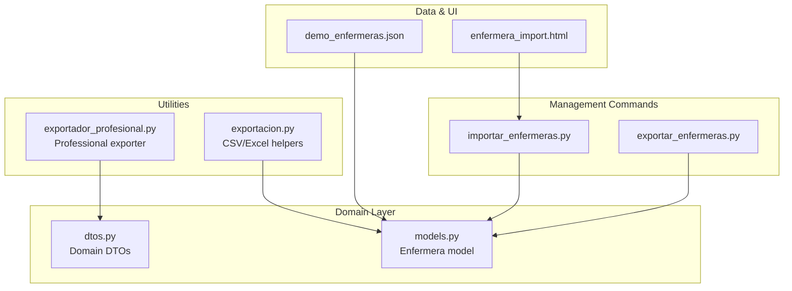
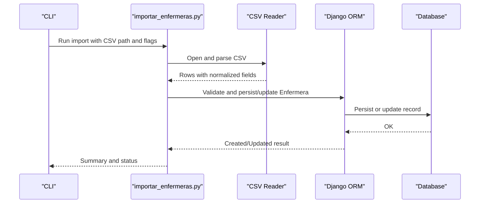
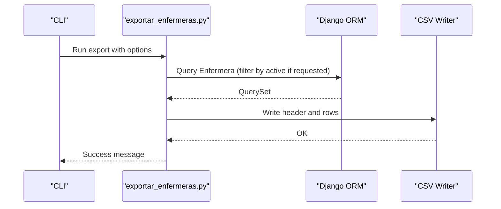
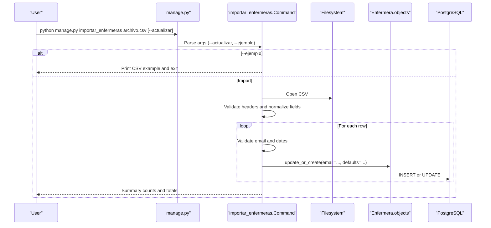
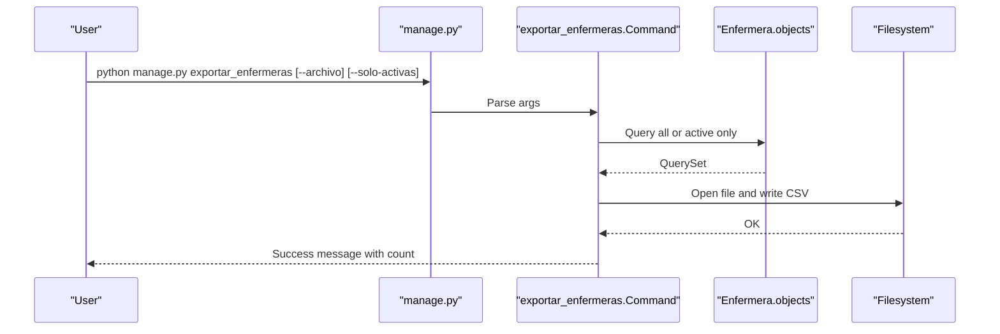
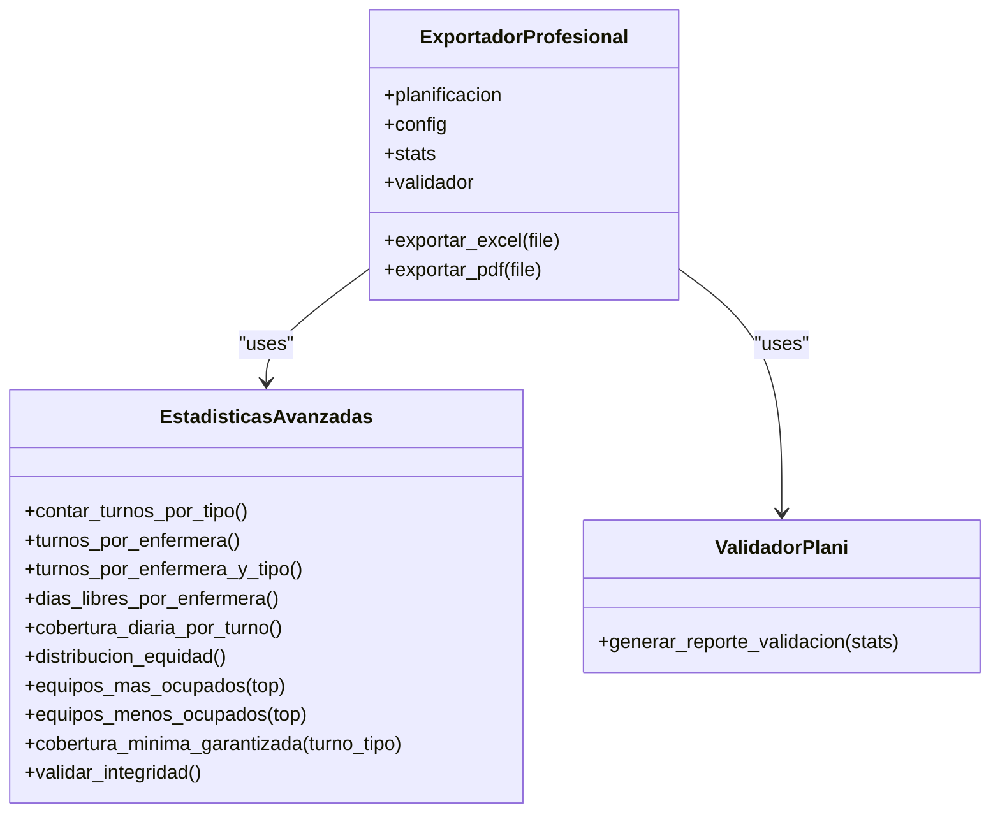
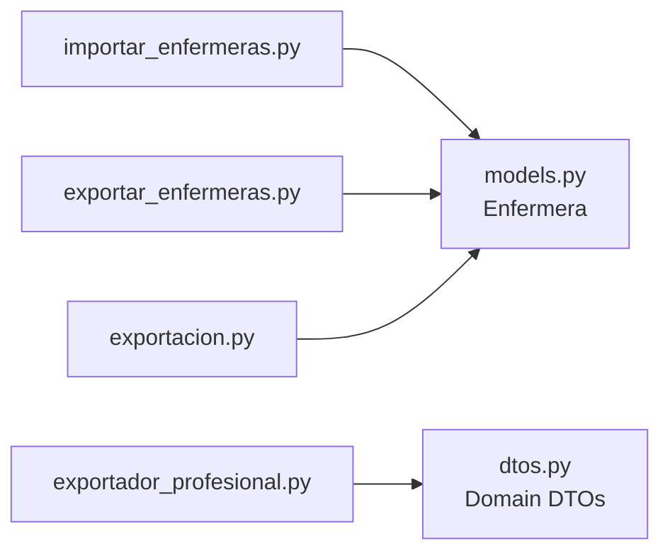

# Staff and Professional Management Commands

<cite>
**Referenced Files in This Document**
- [importar_enfermeras.py](file://turnos/management/commands/importar_enfermeras.py)
- [exportar_enfermeras.py](file://turnos/management/commands/exportar_enfermeras.py)
- [exportador_profesional.py](file://turnos/utils/exportador_profesional.py)
- [models.py](file://turnos/models.py)
- [dtos.py](file://turnos/dominio/dtos.py)
- [demo_enfermeras.json](file://turnos/fixtures/demo_enfermeras.json)
- [exportacion.py](file://turnos/utils/exportacion.py)
- [enfermera_import.html](file://turnos/templates/turnos/enfermera_import.html)
- [README.md](file://README.md)
</cite>

## Table of Contents
1. [Introduction](#introduction)
2. [Project Structure](#project-structure)
3. [Core Components](#core-components)
4. [Architecture Overview](#architecture-overview)
5. [Detailed Component Analysis](#detailed-component-analysis)
6. [Dependency Analysis](#dependency-analysis)
7. [Performance Considerations](#performance-considerations)
8. [Troubleshooting Guide](#troubleshooting-guide)
9. [Conclusion](#conclusion)
10. [Appendices](#appendices)

## Introduction
This document explains the staff and professional management commands focused on importing and exporting nursing staff data. It covers:
- The import command for bulk ingestion of staff records from CSV
- The export command for generating CSV reports of staff
- Integration with the professional export utility for advanced analytics
- Data validation rules, mapping configurations, and error handling
- Practical workflows, batch processing scenarios, and privacy considerations

## Project Structure
The relevant components for staff management are organized under:
- Management commands for CLI operations
- Domain models for staff representation
- Utilities for advanced export and analytics
- Templates and fixtures for UI and demo data

**Diagram sources**
- [importar_enfermeras.py:1-167](file://turnos/management/commands/importar_enfermeras.py#L1-L167)
- [exportar_enfermeras.py:1-58](file://turnos/management/commands/exportar_enfermeras.py#L1-L58)
- [models.py:30-57](file://turnos/models.py#L30-L57)
- [dtos.py:43-132](file://turnos/dominio/dtos.py#L43-L132)
- [exportador_profesional.py:256-329](file://turnos/utils/exportador_profesional.py#L256-L329)
- [exportacion.py:629-665](file://turnos/utils/exportacion.py#L629-L665)
- [demo_enfermeras.json:1-197](file://turnos/fixtures/demo_enfermeras.json#L1-L197)
- [enfermera_import.html:1-86](file://turnos/templates/turnos/enfermera_import.html#L1-L86)

**Section sources**
- [importar_enfermeras.py:1-167](file://turnos/management/commands/importar_enfermeras.py#L1-L167)
- [exportar_enfermeras.py:1-58](file://turnos/management/commands/exportar_enfermeras.py#L1-L58)
- [models.py:30-57](file://turnos/models.py#L30-L57)
- [exportador_profesional.py:256-329](file://turnos/utils/exportador_profesional.py#L256-L329)
- [exportacion.py:629-665](file://turnos/utils/exportacion.py#L629-L665)
- [demo_enfermeras.json:1-197](file://turnos/fixtures/demo_enfermeras.json#L1-L197)
- [enfermera_import.html:1-86](file://turnos/templates/turnos/enfermera_import.html#L1-L86)

## Core Components
- Import command: Reads a CSV file, validates headers and rows, parses dates and booleans, and persists records using Django ORM. Supports updating existing records by email.
- Export command: Writes a CSV file containing staff attributes, with optional filtering for active staff only.
- Professional exporter: Advanced export utility for planning results (Excel/PDF) with statistics and validations; complements staff export for reporting.
- Domain model: Defines the Enfermera entity with unique constraints and optional fields.
- Demo fixture and template: Provide example data and UI for staff import.

**Section sources**
- [importar_enfermeras.py:12-167](file://turnos/management/commands/importar_enfermeras.py#L12-L167)
- [exportar_enfermeras.py:10-58](file://turnos/management/commands/exportar_enfermeras.py#L10-L58)
- [models.py:30-57](file://turnos/models.py#L30-L57)
- [exportador_profesional.py:256-329](file://turnos/utils/exportador_profesional.py#L256-L329)
- [demo_enfermeras.json:1-197](file://turnos/fixtures/demo_enfermeras.json#L1-L197)
- [enfermera_import.html:1-86](file://turnos/templates/turnos/enfermera_import.html#L1-L86)

## Architecture Overview
The import/export commands operate at the management command layer and interact with Django models. The professional exporter resides in a separate utility module and targets planning results rather than raw staff records.

**Diagram sources**
- [importar_enfermeras.py:29-151](file://turnos/management/commands/importar_enfermeras.py#L29-L151)
- [models.py:30-57](file://turnos/models.py#L30-L57)

**Diagram sources**
- [exportar_enfermeras.py:23-57](file://turnos/management/commands/exportar_enfermeras.py#L23-L57)
- [models.py:30-57](file://turnos/models.py#L30-L57)

## Detailed Component Analysis

### Import Command: importar_enfermeras.py
Purpose:
- Bulk import of nursing staff from a CSV file into the database.
- Validates required fields, email format, date formats, and boolean flags.
- Supports creation or update of records keyed by email.

Key behaviors:
- Arguments:
  - Required: CSV file path
  - Optional flags: --actualizar (update existing), --ejemplo (print CSV format example)
- Header validation: Requires at least “nombre” and “email”
- Field parsing:
  - Normalizes whitespace and lowercases email
  - Date parsing supports two formats: YYYY-MM-DD and DD/MM/YYYY
  - Boolean parsing accepts multiple variants for “activa”
- Persistence: Uses update_or_create(email=...) to create or update
- Output: Row-by-row feedback and a final summary

Validation and error handling:
- Raises explicit errors for missing headers, invalid email, invalid date formats, file not found, and general exceptions
- Reports counts for created, updated, and errored rows

Data transformation:
- Strips and normalizes text fields
- Converts boolean-like strings to Python booleans
- Formats dates to date objects or skips invalid entries

Privacy considerations:
- Emails are normalized to lowercase and used as unique keys
- Personal identifiers (DNI) are stored as provided; ensure compliance with local data protection regulations

Integration with professional management:
- The professional exporter focuses on planning results; staff import/export here feeds the Enfermera model used by planning workflows

**Section sources**
- [importar_enfermeras.py:12-167](file://turnos/management/commands/importar_enfermeras.py#L12-L167)
- [models.py:30-57](file://turnos/models.py#L30-L57)

#### Import Workflow Sequence

**Diagram sources**
- [importar_enfermeras.py:29-151](file://turnos/management/commands/importar_enfermeras.py#L29-L151)
- [models.py:105-115](file://turnos/models.py#L105-L115)

### Export Command: exportar_enfermeras.py
Purpose:
- Export all staff records to a CSV file with standardized headers.
- Optionally export only active staff.

Key behaviors:
- Arguments:
  - --archivo: output filename (default includes timestamp)
  - --solo-activas: filter by active=true
- Sorting: Results ordered by name
- Output: CSV with fields id, nombre, email, telefono, dni, fecha_alta, activa, notas

Data transformation:
- Dates formatted as YYYY-MM-DD
- Boolean stored as “true” or “false”

Error handling:
- Catches and reports exceptions during file write

Integration with professional management:
- The professional exporter (Excel/PDF) targets planning outcomes; this export targets staff metadata for administrative or reporting purposes

**Section sources**
- [exportar_enfermeras.py:10-58](file://turnos/management/commands/exportar_enfermeras.py#L10-L58)
- [models.py:30-57](file://turnos/models.py#L30-L57)

#### Export Workflow Sequence

**Diagram sources**
- [exportar_enfermeras.py:23-57](file://turnos/management/commands/exportar_enfermeras.py#L23-L57)

### Professional Export Utility: exportador_profesional.py
Purpose:
- Advanced export for planning results (Excel with multiple sheets and charts, PDF with tables and statistics).
- Provides statistical analysis, coverage checks, and validation reports.

Scope:
- Not a staff export; operates on planning data structures and DTOs.
- Integrates with domain DTOs for planning matrices and balances.

Integration points:
- Works with MatrizPlanificacion and related DTOs
- Generates Excel sheets for planning, statistics, distribution, coverage, equity, and validations
- Generates PDF summaries

**Section sources**
- [exportador_profesional.py:256-329](file://turnos/utils/exportador_profesional.py#L256-L329)
- [dtos.py:197-238](file://turnos/dominio/dtos.py#L197-L238)

#### Professional Export Class Diagram

**Diagram sources**
- [exportador_profesional.py:256-329](file://turnos/utils/exportador_profesional.py#L256-L329)
- [exportador_profesional.py:80-209](file://turnos/utils/exportador_profesional.py#L80-L209)
- [exportador_profesional.py:212-249](file://turnos/utils/exportador_profesional.py#L212-L249)

### Supporting Components

#### Staff Model: Enfermera
- Unique constraints: email, dni (nullable)
- Fields: nombre, email, telefono, dni, activa, fecha_alta, preferencias, notas
- Ordering: by name

**Section sources**
- [models.py:30-57](file://turnos/models.py#L30-L57)

#### Demo Fixture: demo_enfermeras.json
- Provides sample staff records for testing and development
- Includes fields aligned with the Enfermera model

**Section sources**
- [demo_enfermeras.json:1-197](file://turnos/fixtures/demo_enfermeras.json#L1-L197)

#### Import UI Template: enfermera_import.html
- Provides a web interface for uploading Excel files for staff import
- Lists required columns and accepted formats

**Section sources**
- [enfermera_import.html:1-86](file://turnos/templates/turnos/enfermera_import.html#L1-L86)

#### Additional Export Helper: exportacion.py
- Contains export helpers for Excel and CSV; includes exportar_enfermeras_excel
- Used in views for web-based exports

**Section sources**
- [exportacion.py:629-665](file://turnos/utils/exportacion.py#L629-L665)

## Dependency Analysis
- importar_enfermeras.py depends on:
  - Django’s BaseCommand and CommandError
  - CSV parsing and datetime parsing
  - Django’s validate_email and ValidationError
  - Enfermera model for persistence
- exportar_enfermeras.py depends on:
  - Django’s BaseCommand
  - Enfermera model and datetime formatting
- exportador_profesional.py depends on:
  - openpyxl and reportlab
  - Domain DTOs for planning data structures

**Diagram sources**
- [importar_enfermeras.py:1-10](file://turnos/management/commands/importar_enfermeras.py#L1-L10)
- [exportar_enfermeras.py:1-6](file://turnos/management/commands/exportar_enfermeras.py#L1-L6)
- [exportador_profesional.py:26-43](file://turnos/utils/exportador_profesional.py#L26-L43)
- [models.py:30-57](file://turnos/models.py#L30-L57)
- [dtos.py:43-132](file://turnos/dominio/dtos.py#L43-L132)
- [exportacion.py:629-665](file://turnos/utils/exportacion.py#L629-L665)

**Section sources**
- [importar_enfermeras.py:1-10](file://turnos/management/commands/importar_enfermeras.py#L1-L10)
- [exportar_enfermeras.py:1-6](file://turnos/management/commands/exportar_enfermeras.py#L1-L6)
- [exportador_profesional.py:26-43](file://turnos/utils/exportador_profesional.py#L26-L43)
- [models.py:30-57](file://turnos/models.py#L30-L57)
- [dtos.py:43-132](file://turnos/dominio/dtos.py#L43-L132)
- [exportacion.py:629-665](file://turnos/utils/exportacion.py#L629-L665)

## Performance Considerations
- CSV parsing: The import command reads the entire file sequentially; for very large datasets, consider batching or streaming approaches.
- Validation overhead: Email validation and date parsing occur per row; ensure CSV formatting is consistent to minimize retries.
- ORM updates: update_or_create is efficient but still performs per-row operations; for massive imports, consider bulk operations or database-level COPY alternatives.
- Export sorting: Sorting by name adds O(n log n) cost; acceptable for typical staff lists but worth noting for very large datasets.

[No sources needed since this section provides general guidance]

## Troubleshooting Guide
Common issues and resolutions:
- Missing required headers:
  - Ensure CSV contains at least “nombre” and “email”
- Invalid email format:
  - Use valid email addresses; the command validates via Django’s validator
- Invalid date formats:
  - Use either YYYY-MM-DD or DD/MM/YYYY for “fecha_alta”; otherwise, the command logs a warning and proceeds
- Duplicate email:
  - Existing records are updated when --actualizar is used; otherwise, a warning is issued
- File not found:
  - Verify the CSV path and permissions
- Encoding issues:
  - The import expects UTF-8; ensure the CSV is saved with UTF-8 encoding

**Section sources**
- [importar_enfermeras.py:41-93](file://turnos/management/commands/importar_enfermeras.py#L41-L93)
- [importar_enfermeras.py:148-151](file://turnos/management/commands/importar_enfermeras.py#L148-L151)

## Conclusion
The staff management commands provide robust, validated ingestion and export capabilities for nursing staff data. They integrate cleanly with the Django ORM and support both CLI-driven and UI-driven workflows. While the professional exporter focuses on planning results, the import/export commands ensure accurate and secure maintenance of staff records, enabling reliable planning operations.

[No sources needed since this section summarizes without analyzing specific files]

## Appendices

### File Format Specifications

- Import CSV (headers):
  - Required: nombre, email
  - Optional: telefono, dni, fecha_alta, activa, notas
  - Encoding: UTF-8
  - Date formats: YYYY-MM-DD or DD/MM/YYYY
  - Boolean for activa: accepts multiple variants (e.g., true/false, 1/0, si/no, yes/no)

- Export CSV (headers):
  - id, nombre, email, telefono, dni, fecha_alta, activa, notas
  - Date format: YYYY-MM-DD
  - Boolean: “true” or “false”

- Example CSV (from import command):
  - The import command prints a sample CSV and notes when invoked with --ejemplo

**Section sources**
- [importar_enfermeras.py:42-48](file://turnos/management/commands/importar_enfermeras.py#L42-L48)
- [importar_enfermeras.py:153-167](file://turnos/management/commands/importar_enfermeras.py#L153-L167)
- [exportar_enfermeras.py:35-51](file://turnos/management/commands/exportar_enfermeras.py#L35-L51)

### Command Parameters Summary

- importar_enfermeras.py
  - Positional: archivo_csv
  - Flags: --actualizar, --ejemplo

- exportar_enfermeras.py
  - Flags: --archivo, --solo-activas

**Section sources**
- [importar_enfermeras.py:12-27](file://turnos/management/commands/importar_enfermeras.py#L12-L27)
- [exportar_enfermeras.py:10-21](file://turnos/management/commands/exportar_enfermeras.py#L10-L21)

### Data Privacy Considerations
- Email normalization to lowercase ensures consistent uniqueness and avoids duplicates caused by case differences.
- Personal identifiers (DNI) are stored as provided; ensure compliance with applicable data protection laws.
- Exported CSV files may contain sensitive data; restrict access and retention according to organizational policies.

**Section sources**
- [importar_enfermeras.py:60-77](file://turnos/management/commands/importar_enfermeras.py#L60-L77)
- [models.py:40-42](file://turnos/models.py#L40-L42)

### Batch Processing Scenarios
- Large CSV import:
  - Split the dataset into smaller chunks by department or location
  - Use --actualizar to reconcile changes incrementally
- Scheduled exports:
  - Automate daily or weekly exports using cron or task schedulers
  - Filter with --solo-activas for HR reporting

**Section sources**
- [importar_enfermeras.py:18-22](file://turnos/management/commands/importar_enfermeras.py#L18-L22)
- [exportar_enfermeras.py:17-21](file://turnos/management/commands/exportar_enfermeras.py#L17-L21)

### Integration with Professional Management System
- Staff import/export maintains the Enfermera model used by planning workflows.
- The professional exporter (Excel/PDF) generates planning reports; staff data is a prerequisite for accurate planning.

**Section sources**
- [models.py:30-57](file://turnos/models.py#L30-L57)
- [exportador_profesional.py:256-329](file://turnos/utils/exportador_profesional.py#L256-L329)