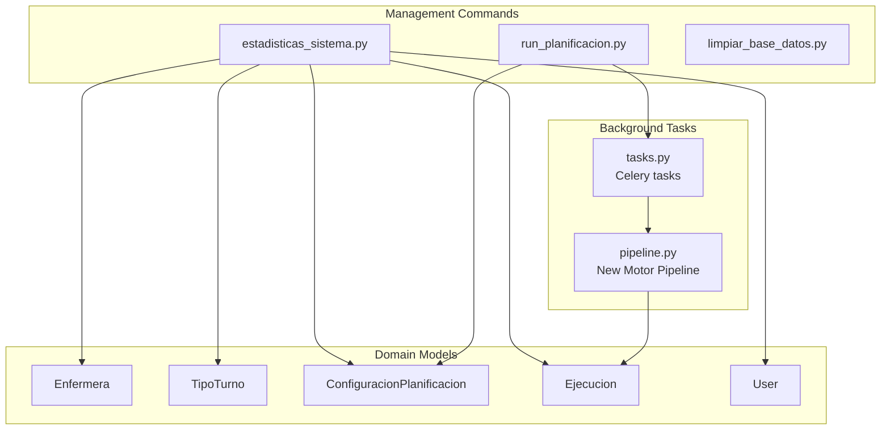
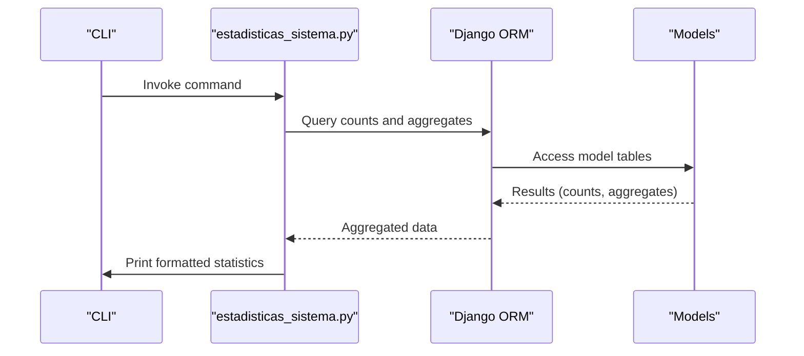
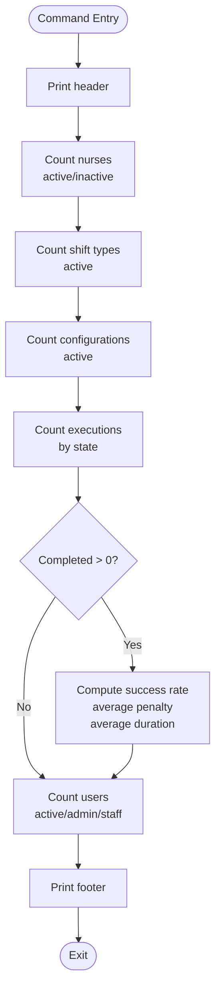
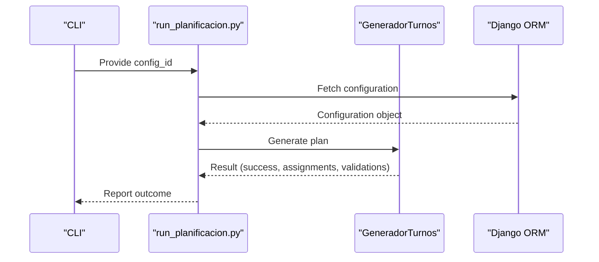
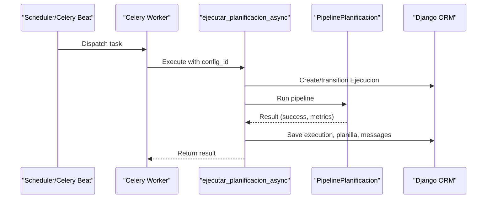
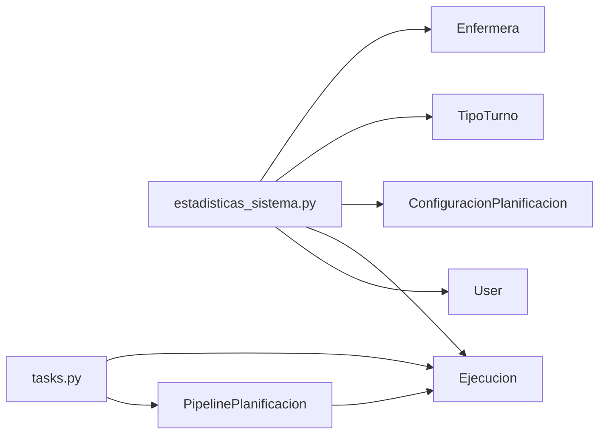

# System Maintenance Commands

<cite>
**Referenced Files in This Document**
- [estadisticas_sistema.py](file://turnos/management/commands/estadisticas_sistema.py)
- [models.py](file://turnos/models.py)
- [tasks.py](file://turnos/tasks.py)
- [pipeline.py](file://turnos/motor/pipeline.py)
- [settings.py](file://proyecto_turnos/settings.py)
- [celery.py](file://proyecto_turnos/celery.py)
- [logger_config.py](file://turnos/logger_config.py)
- [restart_celery.sh](file://restart_celery.sh)
- [start.sh](file://start.sh)
- [run_planificacion.py](file://turnos/management/commands/run_planificacion.py)
- [limpiar_base_datos.py](file://turnos/management/commands/limpiar_base_datos.py)
</cite>

## Table of Contents
1. [Introduction](#introduction)
2. [Project Structure](#project-structure)
3. [Core Components](#core-components)
4. [Architecture Overview](#architecture-overview)
5. [Detailed Component Analysis](#detailed-component-analysis)
6. [Dependency Analysis](#dependency-analysis)
7. [Performance Considerations](#performance-considerations)
8. [Troubleshooting Guide](#troubleshooting-guide)
9. [Conclusion](#conclusion)
10. [Appendices](#appendices)

## Introduction
This document focuses on system maintenance and diagnostic commands, with special emphasis on the estadisticas_sistema.py command. It explains how to collect system statistics and performance metrics, interpret the output, integrate with monitoring systems, and use the command within maintenance workflows. It also covers related maintenance commands and scripts that support system health checks, performance analysis, and operational scheduling.

## Project Structure
The maintenance-related components are organized under Django’s management commands and Celery tasks, with supporting models and configuration files. The estadisticas_sistema command resides in the management commands package and reports on domain entities such as nurses, shift types, planning configurations, executions, and users.

**Diagram sources**
- [estadisticas_sistema.py:1-98](file://turnos/management/commands/estadisticas_sistema.py#L1-L98)
- [models.py:30-825](file://turnos/models.py#L30-L825)
- [tasks.py:17-240](file://turnos/tasks.py#L17-L240)
- [pipeline.py:31-267](file://turnos/motor/pipeline.py#L31-L267)

**Section sources**
- [estadisticas_sistema.py:1-98](file://turnos/management/commands/estadisticas_sistema.py#L1-L98)
- [models.py:30-825](file://turnos/models.py#L30-L825)

## Core Components
- estadisticas_sistema.py: Collects and prints counts and derived metrics for nurses, shift types, planning configurations, executions, and users. It computes success rate and average penalty for completed executions and average duration for completed runs.
- Related maintenance commands:
  - run_planificacion.py: Executes a single planning run for a given configuration ID and reports outcomes.
  - limpiar_base_datos.py: Provides safe cleanup options for old or failed executions and inactive nurses.
- Background tasks and monitoring:
  - tasks.py: Implements Celery tasks for asynchronous planning, statistics reporting, and database maintenance.
  - pipeline.py: New planning pipeline used by Celery tasks to compute results and metrics.
  - logger_config.py: Centralized logging configuration for the application.
  - settings.py and celery.py: Celery configuration and broker/result backend settings.

**Section sources**
- [estadisticas_sistema.py:10-98](file://turnos/management/commands/estadisticas_sistema.py#L10-L98)
- [run_planificacion.py:7-40](file://turnos/management/commands/run_planificacion.py#L7-L40)
- [limpiar_base_datos.py:9-149](file://turnos/management/commands/limpiar_base_datos.py#L9-L149)
- [tasks.py:17-240](file://turnos/tasks.py#L17-L240)
- [pipeline.py:31-267](file://turnos/motor/pipeline.py#L31-L267)
- [logger_config.py:6-33](file://turnos/logger_config.py#L6-L33)
- [settings.py:134-160](file://proyecto_turnos/settings.py#L134-L160)
- [celery.py:1-14](file://proyecto_turnos/celery.py#L1-L14)

## Architecture Overview
The estadisticas_sistema command reads from Django ORM models and prints human-readable summaries. It complements Celery-based planning tasks that persist execution metadata (duration, penalties, status) used by the command for derived metrics.

**Diagram sources**
- [estadisticas_sistema.py:13-98](file://turnos/management/commands/estadisticas_sistema.py#L13-L98)
- [models.py:30-825](file://turnos/models.py#L30-L825)

## Detailed Component Analysis

### estadisticas_sistema.py
- Purpose: Provide a quick system-wide health snapshot.
- Data sources:
  - Nurses: total, active, inactive.
  - Shift types: total, active.
  - Planning configurations: total, active.
  - Executions: total, completed, failed, pending, processing; success rate; average penalty for completed runs; average duration for completed runs.
  - Users: total, active, administrators, staff.
- Output format: Human-readable summary blocks with section headers and key-value pairs.
- Derived metrics:
  - Success rate: completed / total × 100.
  - Average penalty: computed from completed execution penalties.
  - Average duration: computed from completed execution durations.

**Diagram sources**
- [estadisticas_sistema.py:13-98](file://turnos/management/commands/estadisticas_sistema.py#L13-L98)

**Section sources**
- [estadisticas_sistema.py:10-98](file://turnos/management/commands/estadisticas_sistema.py#L10-L98)
- [models.py:30-825](file://turnos/models.py#L30-L825)

### run_planificacion.py
- Purpose: Execute a single planning run for a given configuration ID and report results.
- Behavior:
  - Validates configuration existence.
  - Invokes the generator to produce assignments.
  - Reports success, number of assignments, and violations if any.
- Typical use: Diagnostic run for a specific configuration to validate inputs and detect constraint violations.

**Diagram sources**
- [run_planificacion.py:13-40](file://turnos/management/commands/run_planificacion.py#L13-L40)
- [tasks.py:17-240](file://turnos/tasks.py#L17-L240)

**Section sources**
- [run_planificacion.py:7-40](file://turnos/management/commands/run_planificacion.py#L7-L40)

### limpiar_base_datos.py
- Purpose: Safely remove stale or problematic data to maintain system health.
- Options:
  - Remove old completed executions older than N days.
  - Remove all failed executions.
  - Remove inactive nurses.
  - Dangerous “remove everything” option guarded by confirmation.
- Typical use: Routine maintenance to keep the database lean and improve query performance.

**Section sources**
- [limpiar_base_datos.py:9-149](file://turnos/management/commands/limpiar_base_datos.py#L9-L149)

### Celery Tasks and Monitoring Integration
- Tasks.py implements:
  - Asynchronous planning execution with robust error handling and retries.
  - Statistics reporting for monthly execution trends.
  - Database cleanup for old executions.
  - Logging of execution outcomes, durations, and validation results.
- These tasks persist execution metadata (duration, penalties, status) that estadisticas_sistema uses for derived metrics.

**Diagram sources**
- [tasks.py:17-240](file://turnos/tasks.py#L17-L240)
- [pipeline.py:92-246](file://turnos/motor/pipeline.py#L92-L246)

**Section sources**
- [tasks.py:17-240](file://turnos/tasks.py#L17-L240)
- [pipeline.py:31-267](file://turnos/motor/pipeline.py#L31-L267)

## Dependency Analysis
- estadisticas_sistema depends on:
  - Django ORM to query counts and aggregates for Enfermera, TipoTurno, ConfiguracionPlanificacion, Ejecucion, and User.
  - Ejecucion.duracion property for runtime duration calculation.
- Celery tasks depend on:
  - Django ORM for persistence of Ejecucion and Planilla.
  - PipelinePlanificacion for computation and metrics.
  - Logging subsystem for audit trails.

**Diagram sources**
- [estadisticas_sistema.py:4-7](file://turnos/management/commands/estadisticas_sistema.py#L4-L7)
- [models.py:30-825](file://turnos/models.py#L30-L825)
- [tasks.py:17-240](file://turnos/tasks.py#L17-L240)
- [pipeline.py:31-267](file://turnos/motor/pipeline.py#L31-L267)

**Section sources**
- [estadisticas_sistema.py:1-98](file://turnos/management/commands/estadisticas_sistema.py#L1-L98)
- [models.py:30-825](file://turnos/models.py#L30-L825)
- [tasks.py:17-240](file://turnos/tasks.py#L17-L240)
- [pipeline.py:31-267](file://turnos/motor/pipeline.py#L31-L267)

## Performance Considerations
- estadisticas_sistema performs straightforward COUNT and AVG queries; it is efficient for typical datasets.
- For very large datasets, consider:
  - Indexing frequently filtered fields (e.g., Ejecucion.estado).
  - Limiting aggregation windows (e.g., last N days) when extending the command.
- Celery tasks already persist execution durations; use these for trend analysis and alert thresholds.

[No sources needed since this section provides general guidance]

## Troubleshooting Guide
- Command execution issues:
  - Ensure Django settings are loaded and database is reachable.
  - Verify that required models exist and have data.
- Celery-related problems:
  - Confirm broker and result backend URLs in settings.
  - Use restart_celery.sh to reload workers and beat.
- Logging:
  - Centralized logging configured in logger_config.py; check log files for errors.
  - Tasks write structured logs for execution outcomes and durations.

**Section sources**
- [settings.py:134-160](file://proyecto_turnos/settings.py#L134-L160)
- [celery.py:1-14](file://proyecto_turnos/celery.py#L1-L14)
- [restart_celery.sh:1-45](file://restart_celery.sh#L1-L45)
- [logger_config.py:6-33](file://turnos/logger_config.py#L6-L33)
- [tasks.py:204-240](file://turnos/tasks.py#L204-L240)

## Conclusion
The estadisticas_sistema command offers a concise system health snapshot, leveraging persisted execution metadata from Celery tasks. Combined with maintenance commands and scripts, it supports ongoing diagnostics, performance analysis, and operational maintenance. Extend the command with additional metrics and integrate with monitoring dashboards by consuming the persisted execution data.

[No sources needed since this section summarizes without analyzing specific files]

## Appendices

### Command Reference: estadisticas_sistema.py
- Invocation: Execute via Django management interface.
- Output: Printed summary blocks for nurses, shift types, configurations, executions, and users, including derived metrics when applicable.
- Typical usage: Periodic system health checks, pre/post maintenance verification, and performance trend assessment.

**Section sources**
- [estadisticas_sistema.py:10-98](file://turnos/management/commands/estadisticas_sistema.py#L10-L98)

### Maintenance Workflows and Examples
- System health check:
  - Run estadisticas_sistema to review counts and success rates.
  - Use run_planificacion for a targeted run on a specific configuration.
- Performance analysis:
  - Monitor Celery task durations and penalties from tasks.py logs.
  - Use limpiar_base_datos to remove stale data and improve query performance.
- Maintenance scheduling:
  - Use start.sh to launch development or production environments.
  - Use restart_celery.sh to reload Celery after code changes.

**Section sources**
- [run_planificacion.py:7-40](file://turnos/management/commands/run_planificacion.py#L7-L40)
- [limpiar_base_datos.py:9-149](file://turnos/management/commands/limpiar_base_datos.py#L9-L149)
- [start.sh:1-256](file://start.sh#L1-L256)
- [restart_celery.sh:1-45](file://restart_celery.sh#L1-L45)

### Metric Interpretation and Thresholds
- Success rate: Target high; drops below baseline indicate configuration or constraint issues.
- Average penalty: Lower is better; rising penalties suggest increasing constraint violations.
- Average duration: Stable runtimes indicate consistent performance; spikes may signal resource contention or data anomalies.
- Thresholds: Define organization-specific targets for success rate, penalty, and duration; alert on sustained deviations.

[No sources needed since this section provides general guidance]

### Integration with Monitoring and Alerting
- Logging: Use logger_config.py to capture logs to file and console; parse logs for alerts.
- Celery metrics: Track task execution times and outcomes from tasks.py logs.
- Dashboards: Export execution statistics periodically and feed to monitoring dashboards.

**Section sources**
- [logger_config.py:6-33](file://turnos/logger_config.py#L6-L33)
- [tasks.py:17-240](file://turnos/tasks.py#L17-L240)