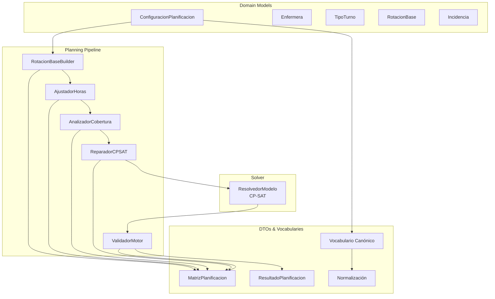
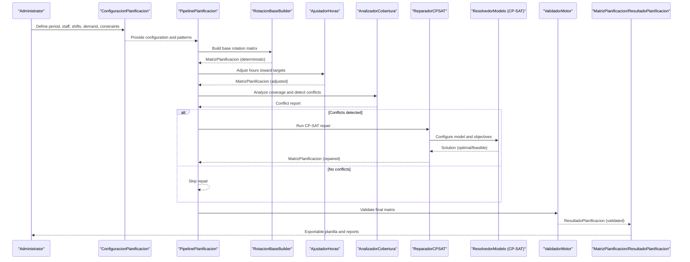
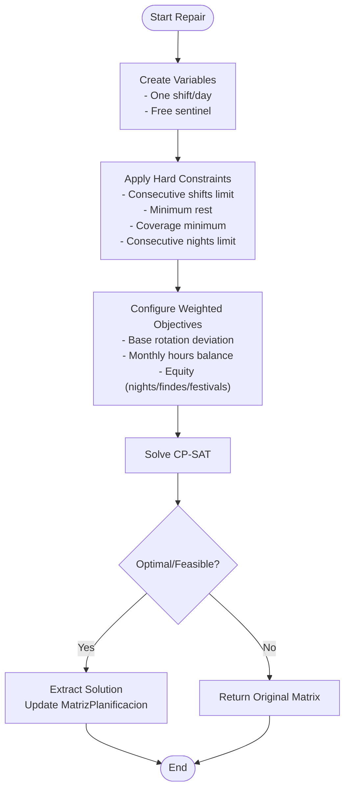
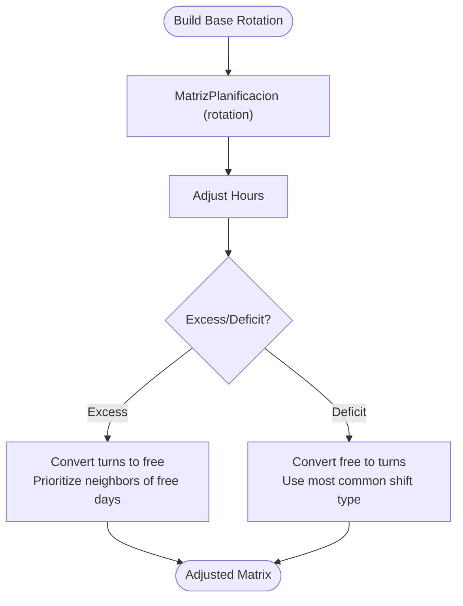
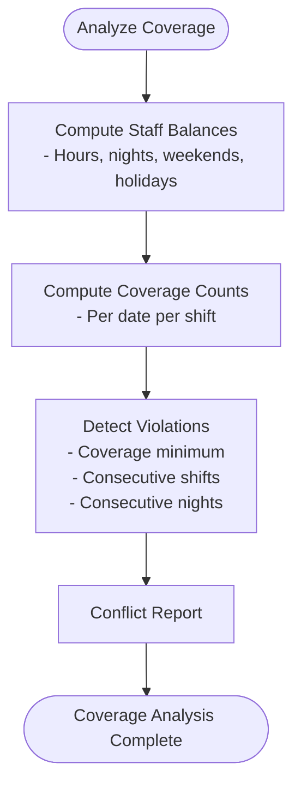
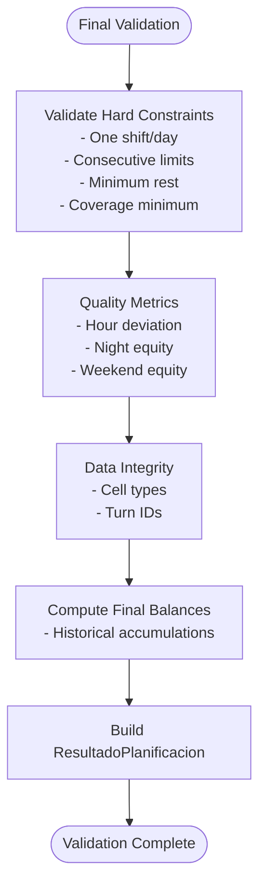
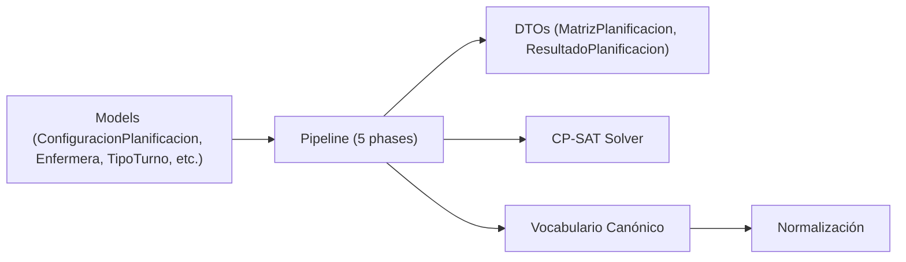

# Introduction and Purpose

<cite>
**Referenced Files in This Document**
- [README.md](file://README.md)
- [models.py](file://turnos/models.py)
- [dtos.py](file://turnos/dominio/dtos.py)
- [pipeline.py](file://turnos/motor/pipeline.py)
- [rotacion_base.py](file://turnos/motor/rotacion_base.py)
- [ajuste_horas.py](file://turnos/motor/ajuste_horas.py)
- [cobertura.py](file://turnos/motor/cobertura.py)
- [reparador.py](file://turnos/motor/reparador.py)
- [resolvedor.py](file://turnos/resolvedor.py)
- [vocabulario.py](file://turnos/dominio/vocabulario.py)
- [normalizacion.py](file://turnos/dominio/normalizacion.py)
</cite>

## Table of Contents
1. [Introduction](#introduction)
2. [Project Structure](#project-structure)
3. [Core Components](#core-components)
4. [Architecture Overview](#architecture-overview)
5. [Detailed Component Analysis](#detailed-component-analysis)
6. [Dependency Analysis](#dependency-analysis)
7. [Performance Considerations](#performance-considerations)
8. [Troubleshooting Guide](#troubleshooting-guide)
9. [Conclusion](#conclusion)

## Introduction
This nursing shift scheduling system is an intelligent, automatic planner that generates monthly “ward-style” rotating schedules using Google OR-Tools CP-SAT constraint satisfaction technology. Its mission is to reduce manual scheduling overhead, ensure fair and compliant coverage distribution, and optimize staff satisfaction by preserving predictable rotation patterns while respecting hard constraints and soft preferences.

For healthcare administrators, the system delivers:
- Reduced administrative burden through fully automated planning
- Predictable, equitable coverage aligned with labor regulations and organizational policies
- Transparency and auditability via structured configuration, validation, and reporting

For developers and implementers, the system offers:
- A robust, modular pipeline that separates deterministic base rotation from CP-SAT repair and validation
- Clear DTOs and canonical vocabularies for constraints, patterns, and objectives
- Extensible configuration of hard and soft constraints, with weighted objectives and historical balancing

The system’s core artifacts include:
- ConfiguracionPlanificacion: the configuration container that defines period length, staff, shifts, demand, and constraints
- MatrizPlanificacion: the internal matrix representation of assignments across staff, dates, and shifts
- ResultadoPlanificacion: the final validated result with balances, metrics, and solver status

Practical use cases include:
- Hospital staff scheduling across departments with rotating shifts
- Emergency department rotations with strict consecutive-day and night limits
- Intensive care unit coverage requiring minimal deficit and balanced weekend/festival workload

## Project Structure
At a high level, the system is organized around:
- Domain models and configuration (ConfiguracionPlanificacion, Enfermera, TipoTurno, RotacionBase, Incidencia)
- A planning pipeline that orchestrates deterministic rotation, hours adjustment, coverage analysis, CP-SAT repair, and validation
- Constraint satisfaction via OR-Tools CP-SAT with weighted objectives
- Canonical vocabularies and normalization utilities for constraints and patterns

**Diagram sources**
- [models.py:332-480](file://turnos/models.py#L332-L480)
- [rotacion_base.py:21-94](file://turnos/motor/rotacion_base.py#L21-L94)
- [ajuste_horas.py:21-233](file://turnos/motor/ajuste_horas.py#L21-L233)
- [cobertura.py:21-208](file://turnos/motor/cobertura.py#L21-L208)
- [reparador.py:24-609](file://turnos/motor/reparador.py#L24-L609)
- [resolvedor.py:11-113](file://turnos/resolvedor.py#L11-L113)
- [dtos.py:197-274](file://turnos/dominio/dtos.py#L197-L274)
- [vocabulario.py:10-112](file://turnos/dominio/vocabulario.py#L10-L112)
- [normalizacion.py:68-190](file://turnos/dominio/normalizacion.py#L68-L190)

**Section sources**
- [README.md:1-111](file://README.md#L1-L111)
- [models.py:332-480](file://turnos/models.py#L332-L480)

## Core Components
- ConfiguracionPlanificacion: encapsulates the planning configuration, including period, staff, shifts, demand, hard and soft constraints, and solver parameters. It also aggregates dynamic and legacy patterns.
- MatrizPlanificacion: the internal matrix of assignments across staff, dates, and shifts, with helpers to query and clone.
- ResultadoPlanificacion: the final validated result containing solution status, balances, metrics, and validation outcomes.

These components are central to the system’s ability to separate configuration from computation, preserve rotation patterns during repair, and validate compliance with labor constraints.

**Section sources**
- [models.py:332-480](file://turnos/models.py#L332-L480)
- [dtos.py:197-274](file://turnos/dominio/dtos.py#L197-L274)

## Architecture Overview
The system follows a five-phase pipeline:
1. Deterministic base rotation from configured cycles
2. Hours adjustment to match contractual targets
3. Coverage analysis and conflict detection
4. CP-SAT repair to resolve conflicts while minimizing deviations from the base rotation
5. Final validation and balance calculation

**Diagram sources**
- [pipeline.py:92-246](file://turnos/motor/pipeline.py#L92-L246)
- [rotacion_base.py:41-94](file://turnos/motor/rotacion_base.py#L41-L94)
- [ajuste_horas.py:46-88](file://turnos/motor/ajuste_horas.py#L46-L88)
- [cobertura.py:46-73](file://turnos/motor/cobertura.py#L46-L73)
- [reparador.py:63-96](file://turnos/motor/reparador.py#L63-L96)
- [resolvedor.py:21-51](file://turnos/resolvedor.py#L21-L51)
- [validador_motor.py:48-86](file://turnos/motor/validador_motor.py#L48-L86)
- [dtos.py:197-274](file://turnos/dominio/dtos.py#L197-L274)

## Detailed Component Analysis

### Constraint Satisfaction Approach with OR-Tools CP-SAT
The system uses CP-SAT to repair conflicts while preserving the base rotation and honoring hard constraints. The repair process:
- Creates Boolean variables for each cell and shift combination (including a dedicated sentinel for “free” days)
- Applies hard constraints (one shift per day, maximum consecutive shifts, minimum rest between shifts, minimum coverage, maximum consecutive nights)
- Defines weighted objectives (priority to base rotation deviation, then monthly hours balance, then equity across nights/findes/festivals)
- Extracts the solution and updates the matrix

**Diagram sources**
- [reparador.py:63-96](file://turnos/motor/reparador.py#L63-L96)
- [reparador.py:133-296](file://turnos/motor/reparador.py#L133-L296)
- [reparador.py:297-334](file://turnos/motor/reparador.py#L297-L334)
- [reparador.py:581-609](file://turnos/motor/reparador.py#L581-L609)
- [resolvedor.py:21-51](file://turnos/resolvedor.py#L21-L51)

**Section sources**
- [reparador.py:24-609](file://turnos/motor/reparador.py#L24-L609)
- [resolvedor.py:11-113](file://turnos/resolvedor.py#L11-L113)

### Deterministic Base Rotation and Hours Adjustment
- Base rotation: Uses explicit cyclic patterns to deterministically assign shifts across the planning horizon, respecting staggered offsets per staff member.
- Hours adjustment: Compares generated hours against contractual targets and minimally modifies cells to approach targets, prioritizing adjacency to free days or common shift types.

**Diagram sources**
- [rotacion_base.py:41-94](file://turnos/motor/rotacion_base.py#L41-L94)
- [ajuste_horas.py:46-88](file://turnos/motor/ajuste_horas.py#L46-L88)
- [ajuste_horas.py:98-150](file://turnos/motor/ajuste_horas.py#L98-L150)
- [ajuste_horas.py:152-213](file://turnos/motor/ajuste_horas.py#L152-L213)

**Section sources**
- [rotacion_base.py:21-94](file://turnos/motor/rotacion_base.py#L21-L94)
- [ajuste_horas.py:21-233](file://turnos/motor/ajuste_horas.py#L21-L233)

### Coverage Analysis and Conflict Detection
- Computes per-staff totals and per-shift-per-date counts
- Detects violations of minimum coverage, maximum consecutive shifts, and maximum consecutive nights
- Provides conflict lists for downstream repair

**Diagram sources**
- [cobertura.py:46-73](file://turnos/motor/cobertura.py#L46-L73)
- [cobertura.py:75-124](file://turnos/motor/cobertura.py#L75-L124)
- [cobertura.py:126-137](file://turnos/motor/cobertura.py#L126-L137)
- [cobertura.py:139-207](file://turnos/motor/cobertura.py#L139-L207)

**Section sources**
- [cobertura.py:21-208](file://turnos/motor/cobertura.py#L21-L208)

### Validation and Balance Persistence
- Validates hard constraints and quality metrics
- Persists final balances including historical accumulations
- Generates ResultadoPlanificacion with status, penalties, and warnings

**Diagram sources**
- [validador_motor.py:48-86](file://turnos/motor/validador_motor.py#L48-L86)
- [validador_motor.py:88-105](file://turnos/motor/validador_motor.py#L88-L105)
- [validador_motor.py:312-364](file://turnos/motor/validador_motor.py#L312-L364)
- [validador_motor.py:366-388](file://turnos/motor/validador_motor.py#L366-L388)
- [validador_motor.py:389-438](file://turnos/motor/validador_motor.py#L389-L438)

**Section sources**
- [validador_motor.py:23-451](file://turnos/motor/validador_motor.py#L23-L451)

### Practical Use Cases
- Hospital staff scheduling: define shifts, weekly demand, and hard constraints (minimum rest, maximum consecutive shifts), then run the pipeline to generate a rotating schedule.
- Emergency department rotations: enforce strict consecutive-night limits and minimum rest between shifts; the CP-SAT repair ensures coverage while minimizing disruption to base rotation.
- ICU coverage: configure coverage minimums per shift and apply equity objectives for weekend/holiday work; the validator ensures compliance and highlights imbalances.

These scenarios leverage:
- ConfiguracionPlanificacion for period, staff, shifts, and constraints
- MatrizPlanificacion as the internal representation
- ResultadoPlanificacion for validation and export

**Section sources**
- [models.py:332-480](file://turnos/models.py#L332-L480)
- [dtos.py:197-274](file://turnos/dominio/dtos.py#L197-L274)

## Dependency Analysis
The system’s core dependencies are:
- Domain models and configuration (ConfiguracionPlanificacion, Enfermera, TipoTurno, RotacionBase, Incidencia)
- Pipeline orchestration (RotacionBaseBuilder, AjustadorHoras, AnalizadorCobertura, ReparadorCPSAT, ValidadorMotor)
- CP-SAT solver (ResolvedorModelo)
- DTOs and canonical vocabularies (MatrizPlanificacion, ResultadoPlanificacion, Vocabulario Canónico, Normalización)

**Diagram sources**
- [models.py:332-480](file://turnos/models.py#L332-L480)
- [pipeline.py:31-246](file://turnos/motor/pipeline.py#L31-L246)
- [dtos.py:197-274](file://turnos/dominio/dtos.py#L197-L274)
- [vocabulario.py:10-112](file://turnos/dominio/vocabulario.py#L10-L112)
- [normalizacion.py:68-190](file://turnos/dominio/normalizacion.py#L68-L190)
- [resolvedor.py:11-113](file://turnos/resolvedor.py#L11-L113)

**Section sources**
- [models.py:332-480](file://turnos/models.py#L332-L480)
- [pipeline.py:31-246](file://turnos/motor/pipeline.py#L31-L246)
- [dtos.py:197-274](file://turnos/dominio/dtos.py#L197-L274)
- [vocabulario.py:10-112](file://turnos/dominio/vocabulario.py#L10-L112)
- [normalizacion.py:68-190](file://turnos/dominio/normalizacion.py#L68-L190)
- [resolvedor.py:11-113](file://turnos/resolvedor.py#L11-L113)

## Performance Considerations
- The pipeline is designed to minimize solver usage to conflict-prone areas, preserving the base rotation and reducing search space.
- Weighted objectives prioritize base rotation preservation, followed by monthly hours balance and equity metrics.
- Coverage analysis and validation provide early detection of infeasibilities, reducing wasted solver time.

[No sources needed since this section provides general guidance]

## Troubleshooting Guide
Common issues and resolutions:
- Infeasible solutions: Review hard constraints (coverage minimums, consecutive limits, minimum rest) and adjust to realistic values.
- Excessive modifications: If the solver repairs too many cells, tighten constraints or increase weights for base rotation preservation.
- Imbalanced workload: Increase emphasis on equity objectives (nights, weekends, holidays) and review historical balances.

Validation warnings and violations are captured in ResultadoPlanificacion and logged during the final validation phase.

**Section sources**
- [validador_motor.py:48-86](file://turnos/motor/validador_motor.py#L48-L86)
- [validador_motor.py:118-140](file://turnos/motor/validador_motor.py#L118-L140)
- [validador_motor.py:141-162](file://turnos/motor/validador_motor.py#L141-L162)
- [validador_motor.py:164-202](file://turnos/motor/validador_motor.py#L164-L202)
- [validador_motor.py:279-310](file://turnos/motor/validador_motor.py#L279-L310)

## Conclusion
This system automates complex nursing shift scheduling by combining deterministic rotation patterns with CP-SAT constraint satisfaction. It reduces manual effort, ensures fair and compliant coverage, and preserves predictable schedules while optimizing staff satisfaction. Administrators gain transparency and control through structured configuration and validation; developers benefit from a modular, extensible pipeline and canonical vocabularies for constraints and objectives.