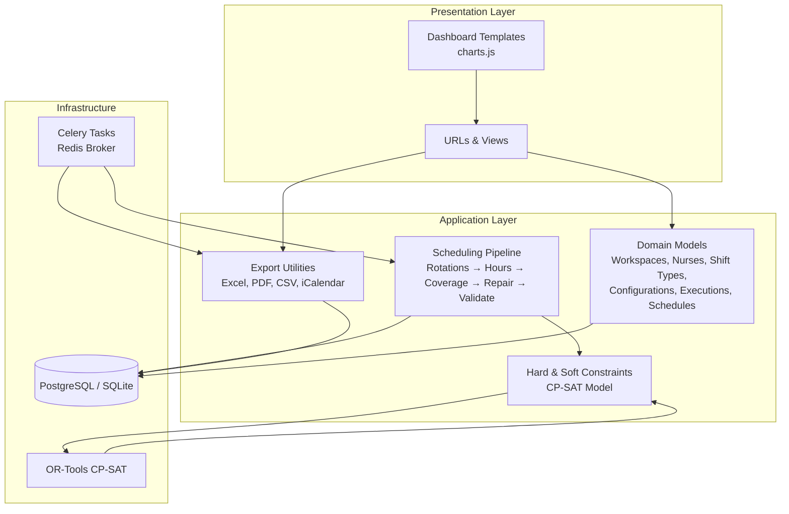
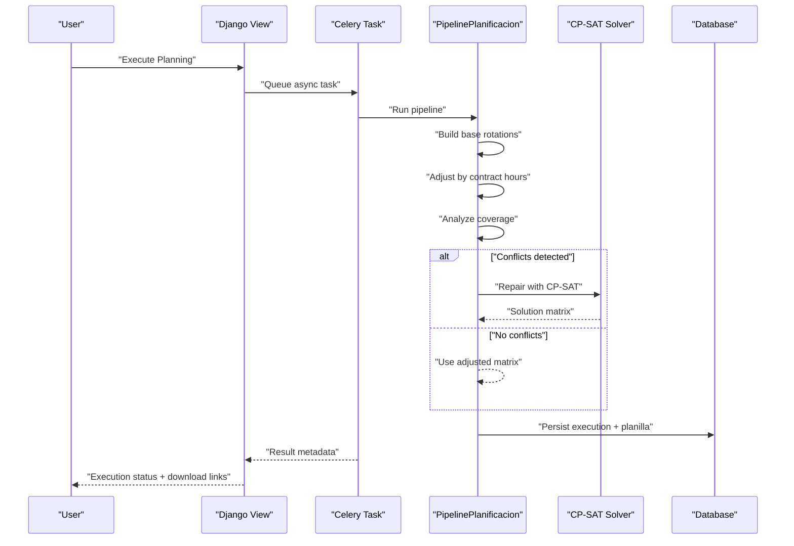
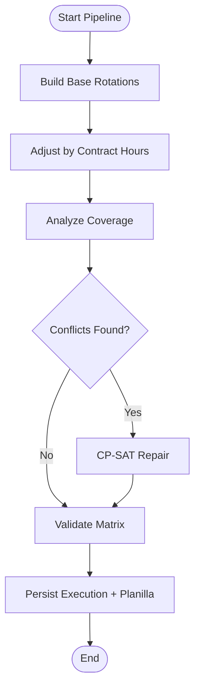
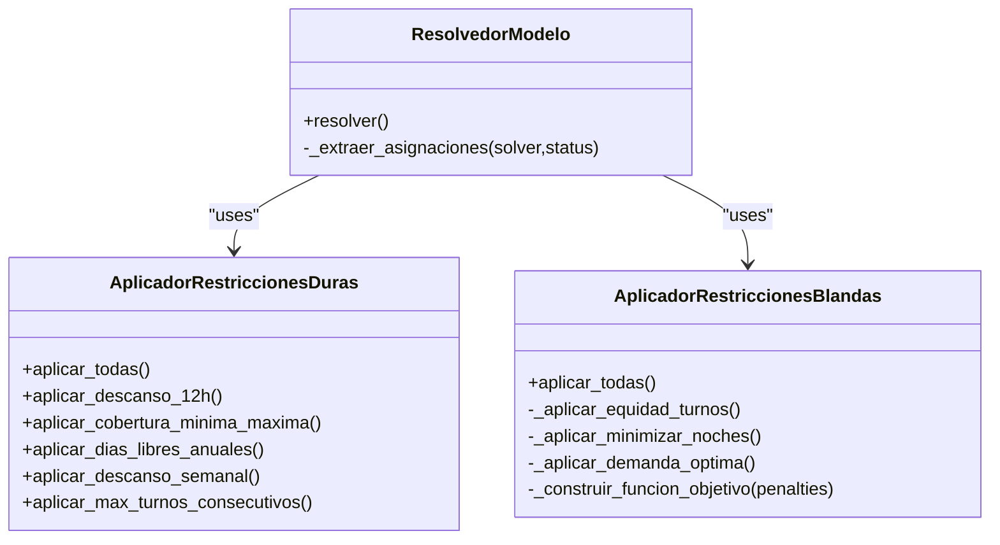
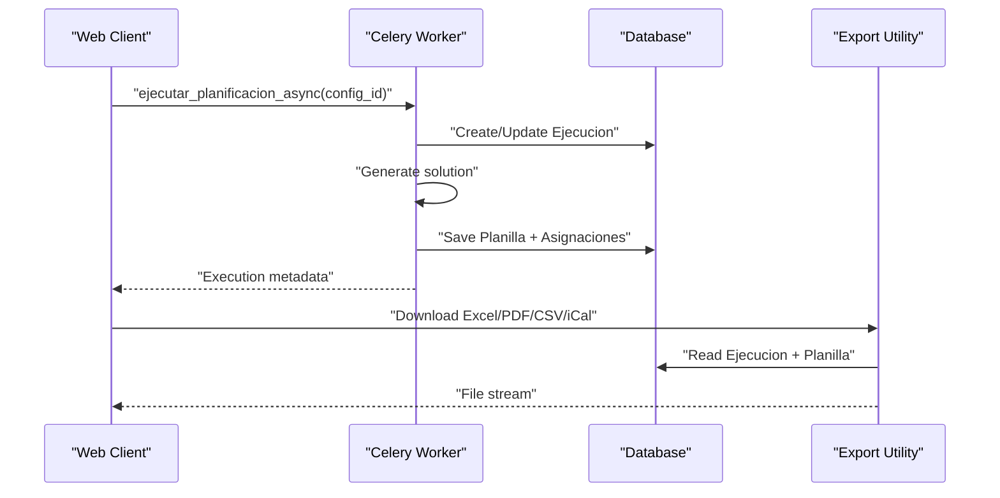
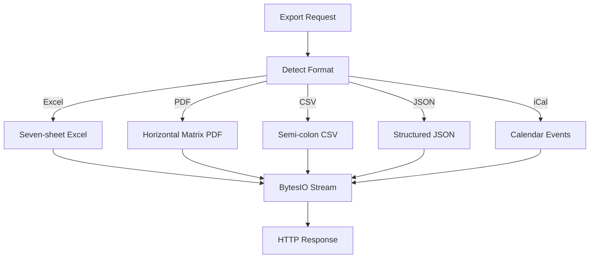
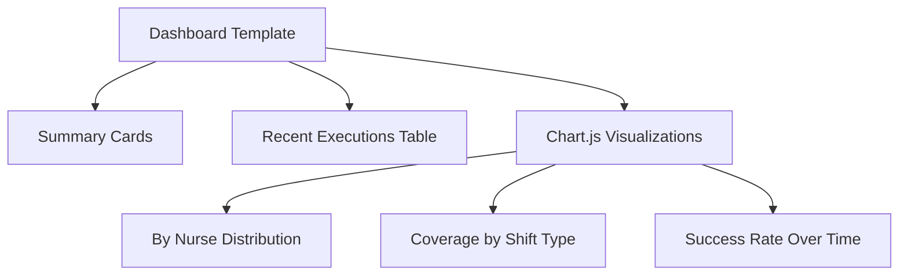
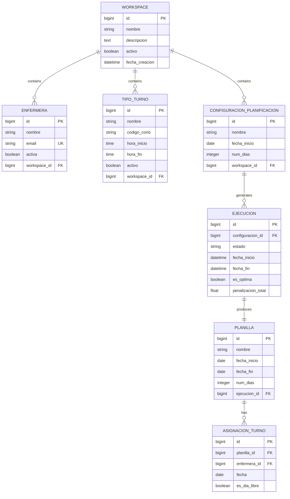
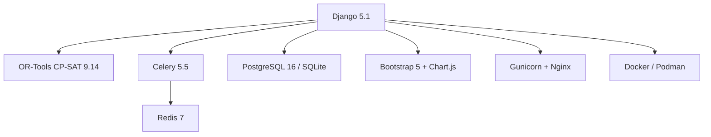
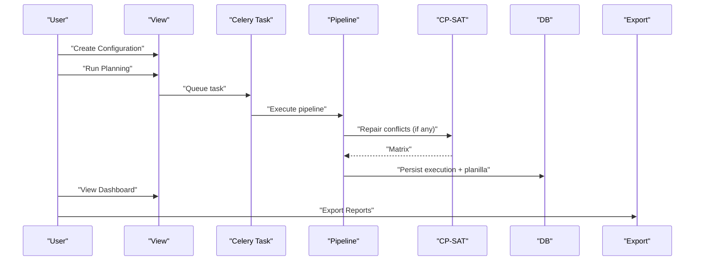

# Key Features and Capabilities

<cite>
**Referenced Files in This Document**
- [README.md](file://README.md)
- [settings.py](file://proyecto_turnos/settings.py)
- [models.py](file://turnos/models.py)
- [resolvedor.py](file://turnos/resolvedor.py)
- [tasks.py](file://turnos/tasks.py)
- [pipeline.py](file://turnos/motor/pipeline.py)
- [restricciones_duras.py](file://turnos/restricciones_duras.py)
- [restricciones_blandas.py](file://turnos/restricciones_blandas.py)
- [exportacion.py](file://turnos/utils/exportacion.py)
- [dashboard.html](file://turnos/templates/turnos/dashboard.html)
- [charts.js](file://turnos/static/js/charts.js)
- [urls.py](file://turnos/urls.py)
- [main.js](file://turnos/static/js/main.js)
</cite>

## Table of Contents
1. [Introduction](#introduction)
2. [Project Structure](#project-structure)
3. [Core Components](#core-components)
4. [Architecture Overview](#architecture-overview)
5. [Detailed Component Analysis](#detailed-component-analysis)
6. [Dependency Analysis](#dependency-analysis)
7. [Performance Considerations](#performance-considerations)
8. [Troubleshooting Guide](#troubleshooting-guide)
9. [Conclusion](#conclusion)
10. [Appendices](#appendices)

## Introduction
This document highlights the system’s key features and competitive advantages for automated nursing shift planning. It explains how the platform generates monthly rosters with cyclic rotation patterns, leverages the Google OR-Tools CP-SAT constraint satisfaction engine, handles hard and soft constraints, executes asynchronous planning via Celery + Redis, exports multi-format reports (Excel, PDF, CSV, iCalendar), presents interactive dashboards with visualizations and statistics, and supports multi-workspace architecture for multiple organizations. It also provides technical specifications, performance characteristics, scalability considerations, and integration capabilities with existing healthcare IT systems.

## Project Structure
The system follows a layered Django architecture with specialized modules for modeling, constraint handling, scheduling pipeline, asynchronous execution, and presentation. Key areas:
- Domain models define Workspaces, Nurses, Shift Types, Configurations, Executions, Schedules, and Assignments.
- Constraint engines apply hard and soft constraints to the CP-SAT model.
- The scheduling pipeline orchestrates deterministic base rotations, contract-based hours adjustments, coverage analysis, CP-SAT repair, and validation.
- Celery + Redis handle asynchronous planning execution.
- Export utilities support Excel, PDF, CSV, JSON, and iCalendar formats.
- Frontend integrates Bootstrap 5 and Chart.js for dashboards and visualizations.

**Diagram sources**
- [models.py:12-825](file://turnos/models.py#L12-L825)
- [pipeline.py:31-200](file://turnos/motor/pipeline.py#L31-L200)
- [restricciones_duras.py:10-156](file://turnos/restricciones_duras.py#L10-L156)
- [restricciones_blandas.py:9-138](file://turnos/restricciones_blandas.py#L9-L138)
- [exportacion.py:135-665](file://turnos/utils/exportacion.py#L135-L665)
- [tasks.py:17-240](file://turnos/tasks.py#L17-L240)
- [settings.py:134-160](file://proyecto_turnos/settings.py#L134-L160)

**Section sources**
- [README.md:5-16](file://README.md#L5-L16)
- [settings.py:1-160](file://proyecto_turnos/settings.py#L1-L160)
- [urls.py:1-108](file://turnos/urls.py#L1-L108)

## Core Components
- Monthly Roster Generation with Cyclic Rotation Patterns
  - Uses deterministic base rotations per nurse with configurable cycles and offsets, then adjusts to contractual hours and validates coverage.
  - Supports historical balances to maintain equitable distribution over time.
- CP-SAT Constraint Satisfaction Engine
  - Applies hard constraints (non-negotiable) and soft constraints (penalized objectives) to find feasible or optimal solutions.
  - Integrates with Google OR-Tools CP-SAT solver for efficient combinatorial optimization.
- Hard and Soft Constraint Handling
  - Hard constraints enforce mandatory rules (e.g., minimum 12-hour rest between shifts, weekly days-off, maximum consecutive shifts).
  - Soft constraints minimize penalties (e.g., equity, night shifts, demand targets).
- Asynchronous Processing with Celery + Redis
  - Executes planning tasks asynchronously, tracks progress, retries failures, and persists results.
- Multi-format Export Capabilities
  - Generates Excel (with multiple sheets), PDF, CSV, JSON, and iCalendar files for distribution and integration.
- Dashboard with Visualizations and Statistics
  - Presents summary cards, recent executions, and interactive charts built with Chart.js.
- Multi-workspace Architecture
  - Isolates data per organization/workspace with user membership controls.

**Section sources**
- [models.py:12-825](file://turnos/models.py#L12-L825)
- [pipeline.py:31-200](file://turnos/motor/pipeline.py#L31-L200)
- [restricciones_duras.py:10-156](file://turnos/restricciones_duras.py#L10-L156)
- [restricciones_blandas.py:9-138](file://turnos/restricciones_blandas.py#L9-L138)
- [resolvedor.py:11-113](file://turnos/resolvedor.py#L11-L113)
- [tasks.py:17-240](file://turnos/tasks.py#L17-L240)
- [exportacion.py:135-665](file://turnos/utils/exportacion.py#L135-L665)
- [dashboard.html:12-189](file://turnos/templates/turnos/dashboard.html#L12-L189)
- [charts.js:1-275](file://turnos/static/js/charts.js#L1-L275)

## Architecture Overview
The system orchestrates planning through a five-phase pipeline, ensuring deterministic base rotations, contract-driven hours, coverage analysis, optional CP-SAT repair, and validation. Asynchronous execution decouples user actions from heavy computation, while robust export utilities enable seamless sharing and integration.

**Diagram sources**
- [tasks.py:333-686](file://turnos/tasks.py#L333-L686)
- [pipeline.py:92-200](file://turnos/motor/pipeline.py#L92-L200)
- [resolvedor.py:21-51](file://turnos/resolvedor.py#L21-L51)
- [models.py:482-566](file://turnos/models.py#L482-L566)

## Detailed Component Analysis

### Monthly Roster Generation with Cyclic Rotations
- Deterministic base rotations are constructed per nurse with configurable cycles and daily offsets.
- Contract-based hours adjustment ensures target weekly/yearly hours are met.
- Coverage analysis identifies imbalances; CP-SAT repairs only when conflicts are found.
- Historical balances are updated post-execution to inform future planning fairness.

**Diagram sources**
- [pipeline.py:92-200](file://turnos/motor/pipeline.py#L92-L200)
- [models.py:666-784](file://turnos/models.py#L666-L784)

**Section sources**
- [pipeline.py:31-200](file://turnos/motor/pipeline.py#L31-L200)
- [models.py:666-784](file://turnos/models.py#L666-L784)

### CP-SAT Constraint Satisfaction Engine
- Hard constraints are enforced as mandatory rules (e.g., 12-hour rest, weekly days-off, maximum consecutive shifts).
- Soft constraints are transformed into penalties (e.g., equity, minimizing night shifts, targeting demand).
- The solver is configured with worker count, time limits, and seed for reproducibility.

**Diagram sources**
- [resolvedor.py:11-113](file://turnos/resolvedor.py#L11-L113)
- [restricciones_duras.py:10-156](file://turnos/restricciones_duras.py#L10-L156)
- [restricciones_blandas.py:9-138](file://turnos/restricciones_blandas.py#L9-L138)

**Section sources**
- [resolvedor.py:11-113](file://turnos/resolvedor.py#L11-L113)
- [restricciones_duras.py:10-156](file://turnos/restricciones_duras.py#L10-L156)
- [restricciones_blandas.py:9-138](file://turnos/restricciones_blandas.py#L9-L138)

### Asynchronous Processing with Celery + Redis
- Planning tasks are queued and executed asynchronously to avoid blocking the web interface.
- Results are persisted with execution state, duration, and validation outcomes.
- Tasks include plan generation, cleanup of old executions, and statistical reporting.

**Diagram sources**
- [tasks.py:17-240](file://turnos/tasks.py#L17-L240)
- [exportacion.py:135-665](file://turnos/utils/exportacion.py#L135-L665)
- [models.py:482-566](file://turnos/models.py#L482-L566)

**Section sources**
- [tasks.py:17-240](file://turnos/tasks.py#L17-L240)
- [settings.py:134-160](file://proyecto_turnos/settings.py#L134-L160)

### Multi-format Export Capabilities
- Excel: Seven worksheets (Vertical Plan, Horizontal Plan, Stats, By Nurse, Coverage, Equity, Validations).
- PDF: Professional horizontal matrix layout.
- CSV: Semi-colon separated values for external tools.
- JSON: Structured plan data for integrations.
- iCalendar: Events for calendar applications.

**Diagram sources**
- [exportacion.py:135-665](file://turnos/utils/exportacion.py#L135-L665)

**Section sources**
- [exportacion.py:135-665](file://turnos/utils/exportacion.py#L135-L665)

### Dashboard with Visualizations and Statistics
- Summary cards show total configurations, successful executions, active nurses, and scheduled days.
- Recent executions table displays status, duration, and quick actions.
- Charts integrate with Chart.js to visualize distributions, coverage, trends, and success rates.

**Diagram sources**
- [dashboard.html:12-189](file://turnos/templates/turnos/dashboard.html#L12-L189)
- [charts.js:1-275](file://turnos/static/js/charts.js#L1-L275)

**Section sources**
- [dashboard.html:12-189](file://turnos/templates/turnos/dashboard.html#L12-L189)
- [charts.js:1-275](file://turnos/static/js/charts.js#L1-L275)

### Multi-workspace Architecture
- Workspaces isolate data per organization; users belong to one or more workspaces.
- Models explicitly link entities (Nurses, Shift Types, Configurations, Executions, Schedules) to a workspace.
- Access control and filtering ensure data privacy across organizations.

**Diagram sources**
- [models.py:12-825](file://turnos/models.py#L12-L825)

**Section sources**
- [models.py:12-825](file://turnos/models.py#L12-L825)

## Dependency Analysis
- Backend framework: Django 5.1.
- Solver: OR-Tools CP-SAT 9.14 (Google).
- Asynchronous tasks: Celery 5.5 + Redis 7.
- Database: PostgreSQL 16 (production) / SQLite (development).
- Frontend: Bootstrap 5 + Chart.js.
- Server stack: Gunicorn + Nginx.
- Containerization: Docker / Podman (rootless).

**Diagram sources**
- [README.md:58-69](file://README.md#L58-L69)

**Section sources**
- [README.md:58-69](file://README.md#L58-L69)

## Performance Considerations
- Parallel workers and time limits: The CP-SAT solver is configured with worker count and maximum runtime to balance quality and speed.
- Asynchronous execution: Heavy computations run off the main thread, improving responsiveness.
- Coverage-first approach: Only repairs via CP-SAT when coverage conflicts are detected, reducing unnecessary solver overhead.
- Batch creation: Assignments are bulk-created to minimize database round-trips.
- Scalability: Use multiple Celery workers behind a Redis broker; scale horizontally by adding workers and nodes.

[No sources needed since this section provides general guidance]

## Troubleshooting Guide
- Execution errors: Celery tasks capture exceptions, mark execution as error, and retry up to configured limits.
- Validation feedback: Execution records include validation messages and violation counts.
- Database connectivity: Dedicated tasks verify DB connectivity and log counts.
- Export availability: Missing libraries (e.g., openpyxl, reportlab, icalendar) raise import errors; ensure optional dependencies are installed.

**Section sources**
- [tasks.py:204-240](file://turnos/tasks.py#L204-L240)
- [tasks.py:317-332](file://turnos/tasks.py#L317-L332)
- [exportacion.py:22-49](file://turnos/utils/exportacion.py#L22-L49)

## Conclusion
This system delivers a robust, scalable, and user-friendly solution for nursing shift planning. Its combination of deterministic base rotations, CP-SAT enforcement of hard and soft constraints, asynchronous execution, and comprehensive export capabilities makes it suitable for real-world healthcare environments. The multi-workspace architecture ensures organizational isolation, while the dashboard and visualizations provide actionable insights. Integration with existing IT systems is facilitated through standardized export formats and a clear separation of concerns across layers.

[No sources needed since this section summarizes without analyzing specific files]

## Appendices

### Technical Specifications
- OR-Tools CP-SAT solver version: 9.14 (Google)
- Supported databases: PostgreSQL 16 (production), SQLite (development)
- Frontend frameworks: Bootstrap 5 + Chart.js
- Asynchronous stack: Celery 5.5 + Redis 7
- Server stack: Gunicorn + Nginx
- Containerization: Docker / Podman (rootless)

**Section sources**
- [README.md:58-69](file://README.md#L58-L69)

### Example: How Features Work Together
- A user configures a monthly schedule with shift types, demand, and constraints.
- The system builds base rotations per nurse, adjusts for contractual hours, checks coverage, repairs conflicts with CP-SAT if needed, and validates the result.
- The execution is stored, and the user can download Excel/PDF/CSV/iCalendar reports.
- The dashboard visualizes recent executions and key metrics.

**Diagram sources**
- [tasks.py:17-240](file://turnos/tasks.py#L17-L240)
- [pipeline.py:92-200](file://turnos/motor/pipeline.py#L92-L200)
- [exportacion.py:135-665](file://turnos/utils/exportacion.py#L135-L665)