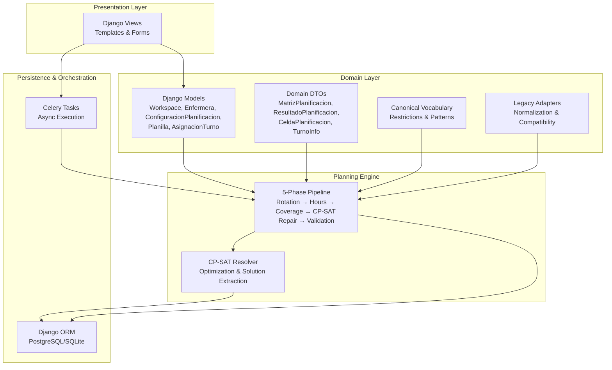
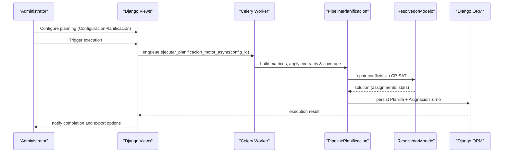
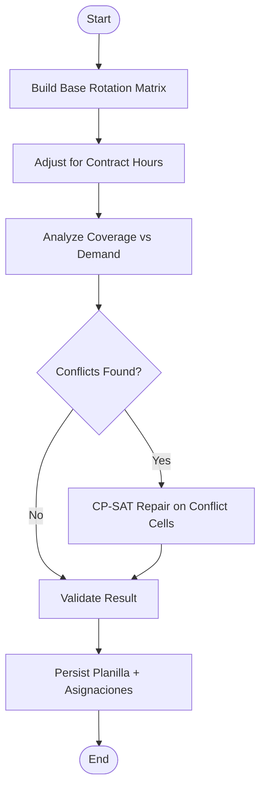
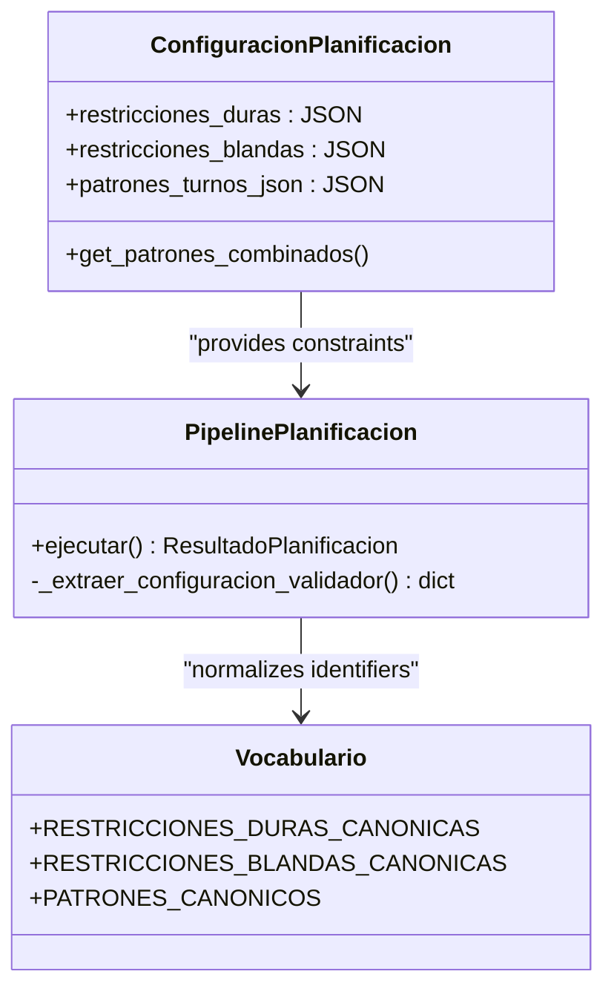
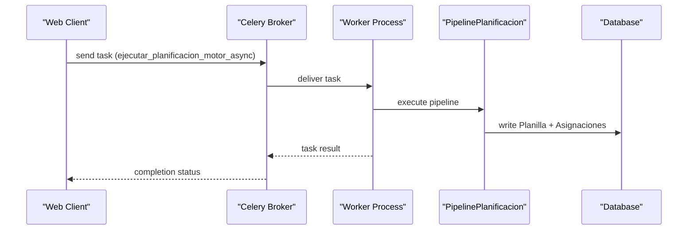
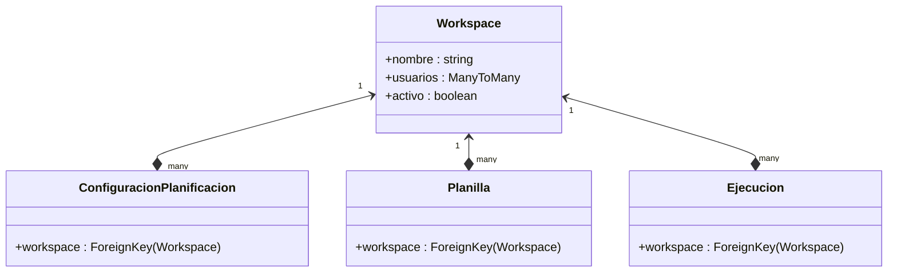
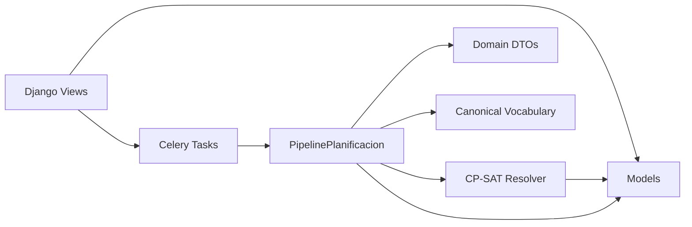

# Project Overview

<cite>
**Referenced Files in This Document**
- [README.md](file://README.md)
- [WIKI.md](file://docs/WIKI.md)
- [settings.py](file://proyecto_turnos/settings.py)
- [models.py](file://turnos/models.py)
- [pipeline.py](file://turnos/motor/pipeline.py)
- [resolvedor.py](file://turnos/resolvedor.py)
- [tasks.py](file://turnos/tasks.py)
- [dtos.py](file://turnos/dominio/dtos.py)
- [vocabulario.py](file://turnos/dominio/vocabulario.py)
- [adaptadores.py](file://turnos/dominio/adaptadores.py)
- [restricciones_sacyl_ejemplo.json](file://turnos/fixtures/restricciones_sacyl_ejemplo.json)
- [workspace_selector.html](file://turnos/templates/includes/workspace_selector.html)
</cite>

## Table of Contents
1. [Introduction](#introduction)
2. [Project Structure](#project-structure)
3. [Core Components](#core-components)
4. [Architecture Overview](#architecture-overview)
5. [Detailed Component Analysis](#detailed-component-analysis)
6. [Dependency Analysis](#dependency-analysis)
7. [Performance Considerations](#performance-considerations)
8. [Troubleshooting Guide](#troubleshooting-guide)
9. [Conclusion](#conclusion)
10. [Appendices](#appendices)

## Introduction
The Nursing Shift Scheduling System is an intelligent, automatic shift planning platform designed specifically for nursing staff. It leverages Google OR-Tools CP-SAT constraint satisfaction to generate robust, cyclic monthly rosters while balancing hard and soft constraints, optimizing workload equity, and ensuring fair coverage distribution across departments such as hospitals, emergency departments, and intensive care units.

Key value propositions:
- Reduces administrative burden by automating complex scheduling logic
- Ensures predictable, cyclic rotations aligned with real-world nursing patterns
- Balances hard constraints (legal limits, coverage minimums) with soft objectives (equity, preferences)
- Provides asynchronous execution for scalability and responsiveness
- Supports multi-workspace isolation for multiple organizations or departments

## Project Structure
At a high level, the system is organized into:
- Presentation layer (Django views, templates, forms)
- Domain layer (Django models, DTOs, normalization, canonical vocabulary)
- Planning engine (5-phase pipeline, CP-SAT repair, validation)
- Persistence and orchestration (Django ORM, Celery tasks, Redis)

**Diagram sources**
- [WIKI.md: System Architecture:84-122](file://docs/WIKI.md#L84-L122)
- [models.py: Core Models:12-566](file://turnos/models.py#L12-L566)
- [pipeline.py: Pipeline Orchestrator:31-246](file://turnos/motor/pipeline.py#L31-L246)
- [resolvedor.py: CP-SAT Resolver:11-113](file://turnos/resolvedor.py#L11-L113)
- [tasks.py: Celery Tasks:17-240](file://turnos/tasks.py#L17-L240)

**Section sources**
- [WIKI.md: System Architecture:84-122](file://docs/WIKI.md#L84-L122)
- [README.md: Features:5-16](file://README.md#L5-L16)

## Core Components
- ConfiguracionPlanificacion (ConfiguracionPlanificacion): Central configuration entity encapsulating planning horizon, selected nurses and shifts, demand per shift, hard/soft constraints, solver parameters, and dynamic turn patterns. It also exposes combined pattern sources (JSON + legacy ManyToMany).
- MatrizPlanificacion (MatrizPlanificacion): The core domain matrix holding assignments as {nurse_id: {date: CeldaPlanificacion}}. It supports cloning, lookup, and enumeration of cells.
- ResultadoPlanificacion (ResultadoPlanificacion): Final structured result containing success flag, matrix, balances, solver metrics, validation outcomes, and counts of modifications.
- PipelinePlanificacion (PipelinePlanificacion): The 5-phase orchestrator that builds a deterministic base rotation, adjusts for contractual hours, analyzes coverage, repairs conflicts with CP-SAT, and validates outcomes.
- CP-SAT Resolver (ResolvedorModelo): Wraps OR-Tools CP-SAT solving, extracts assignments, and validates results.
- Celery Tasks (tasks.py): Asynchronous execution of planning, with retry logic, cleanup, and reporting.

Practical implications:
- Monthly roster generation is cyclic and deterministic, grounded in explicit rotation patterns and contractual obligations.
- Hard constraints are enforced first; soft objectives minimize deviations and improve equity.
- Results are persisted as Planilla and AsignacionTurno records for auditability and export.

**Section sources**
- [models.py: ConfiguracionPlanificacion:332-480](file://turnos/models.py#L332-L480)
- [dtos.py: MatrizPlanificacion:197-238](file://turnos/dominio/dtos.py#L197-L238)
- [dtos.py: ResultadoPlanificacion:251-274](file://turnos/dominio/dtos.py#L251-L274)
- [pipeline.py: PipelinePlanificacion:31-246](file://turnos/motor/pipeline.py#L31-L246)
- [resolvedor.py: ResolvedorModelo:11-113](file://turnos/resolvedor.py#L11-L113)
- [tasks.py: ejecutar_planificacion_async:17-240](file://turnos/tasks.py#L17-L240)

## Architecture Overview
The system follows a layered architecture:
- Presentation: Web UI with guided configuration wizard and dashboards
- Domain: Rich domain models and DTOs with canonical vocabulary and normalization
- Planning Engine: Deterministic base rotation plus CP-SAT repair for conflicts
- Persistence: Django ORM with asynchronous task execution via Celery and Redis

**Diagram sources**
- [tasks.py: ejecutar_planificacion_motor_async:334-686](file://turnos/tasks.py#L334-L686)
- [pipeline.py: PipelinePlanificacion:92-246](file://turnos/motor/pipeline.py#L92-L246)
- [resolvedor.py: ResolvedorModelo:21-113](file://turnos/resolvedor.py#L21-L113)
- [models.py: Planilla & AsignacionTurno:534-623](file://turnos/models.py#L534-L623)

## Detailed Component Analysis

### Monthly Roster Generation and Cyclic Rotation Patterns
- Base rotation construction: The pipeline builds a deterministic rotation matrix using configured cycles and optional nurse-specific offsets.
- Contract-driven adjustments: Target weekly/monthly/yearly hours adjust the base rotation to meet contractual obligations.
- Coverage analysis: Conflicts are detected against demand and hard constraints; CP-SAT repairs only the affected cells.
- Pattern integration: Both JSON-defined patterns and legacy database patterns are supported and merged.

**Diagram sources**
- [pipeline.py: PipelinePlanificacion:108-246](file://turnos/motor/pipeline.py#L108-L246)

**Section sources**
- [pipeline.py: PipelinePlanificacion:92-246](file://turnos/motor/pipeline.py#L92-L246)
- [models.py: ConfiguracionPlanificacion.get_patrones_combinados:457-479](file://turnos/models.py#L457-L479)

### Hard and Soft Constraint Handling
- Hard constraints: Non-negotiable rules such as daily single assignment, minimum rest between shifts, maximum consecutive days, weekly rest, and coverage minimums. These are prioritized lexically.
- Soft constraints: Objectives to minimize deviations (e.g., equitable night work, weekend/festival distribution, preference adherence) with tunable weights.
- Canonical vocabulary: Restriction identifiers and patterns are normalized to a canonical set for consistent interpretation across configuration, pipeline, and solver.

**Diagram sources**
- [models.py: ConfiguracionPlanificacion:332-480](file://turnos/models.py#L332-L480)
- [pipeline.py: PipelinePlanificacion:247-267](file://turnos/motor/pipeline.py#L247-L267)
- [vocabulario.py: Canonical Restrictions & Patterns:10-45](file://turnos/dominio/vocabulario.py#L10-L45)

**Section sources**
- [vocabulario.py: Canonical Restrictions & Patterns:10-45](file://turnos/dominio/vocabulario.py#L10-L45)
- [pipeline.py: PipelinePlanificacion:143-163](file://turnos/motor/pipeline.py#L143-L163)

### Asynchronous Processing Capabilities
- Celery tasks: Dedicated tasks for planning execution, cleanup, and statistics, with retries and error handling.
- Task orchestration: The planner runs inside a Celery worker; results are persisted and notifications are generated.
- Scalability: Parallel workers and configurable solver parameters enable handling larger planning horizons efficiently.

**Diagram sources**
- [tasks.py: ejecutar_planificacion_motor_async:334-686](file://turnos/tasks.py#L334-L686)
- [settings.py: Celery Configuration:134-160](file://proyecto_turnos/settings.py#L134-L160)

**Section sources**
- [tasks.py: ejecutar_planificacion_async:17-240](file://turnos/tasks.py#L17-L240)
- [tasks.py: ejecutar_planificacion_motor_async:334-686](file://turnos/tasks.py#L334-L686)
- [settings.py: Celery Settings:134-160](file://proyecto_turnos/settings.py#L134-L160)

### Multi-Workspace Architecture
- Workspace model isolates data for different organizations or departments.
- UI selector allows switching workspaces per session.
- All planning entities (ConfiguracionPlanificacion, Planilla, Ejecucion, etc.) are scoped to a workspace.

**Diagram sources**
- [models.py: Workspace:12-27](file://turnos/models.py#L12-L27)
- [models.py: ConfiguracionPlanificacion:332-424](file://turnos/models.py#L332-L424)
- [models.py: Planilla:534-566](file://turnos/models.py#L534-L566)
- [models.py: Ejecucion:482-532](file://turnos/models.py#L482-L532)

**Section sources**
- [models.py: Workspace:12-27](file://turnos/models.py#L12-L27)
- [workspace_selector.html: Workspace Selector UI:1-18](file://turnos/templates/includes/workspace_selector.html#L1-L18)

### Practical Examples and Use Cases
- Hospital staff scheduling: Define shifts (e.g., Morning, Afternoon, Night), set coverage demands per shift, and configure hard constraints (daily single assignment, minimum rest). Soft constraints can balance equity across nurses.
- Emergency Department rotations: Use cyclic patterns to maintain consistent team compositions, enforce maximum consecutive shifts, and distribute nights and weekends fairly.
- Intensive Care Unit coverage: Apply stricter coverage minimums for high-acuity shifts, incorporate contractual limits on overtime, and ensure adequate rest periods between long shifts.

These scenarios leverage:
- ConfiguracionPlanificacion for defining the planning window, selected staff, shifts, and constraints
- MatrizPlanificacion for representing the resulting schedule
- PipelinePlanificacion for deterministic base rotation and CP-SAT repair
- Export capabilities for sharing schedules in Excel, PDF, CSV, and iCalendar formats

**Section sources**
- [models.py: ConfiguracionPlanificacion:332-480](file://turnos/models.py#L332-L480)
- [dtos.py: MatrizPlanificacion:197-238](file://turnos/dominio/dtos.py#L197-L238)
- [pipeline.py: PipelinePlanificacion:92-246](file://turnos/motor/pipeline.py#L92-L246)
- [README.md: Export Formats:13-13](file://README.md#L13-L13)

## Dependency Analysis
The system’s internal dependencies emphasize separation of concerns:
- Views and templates depend on models and tasks for orchestration
- Domain DTOs decouple presentation from persistence
- Pipeline consumes canonical vocabulary and adapters for compatibility
- CP-SAT resolver operates independently of Django models

**Diagram sources**
- [views.py: Dashboard & Config Views:52-146](file://turnos/views.py#L52-L146)
- [models.py: Core Models:12-566](file://turnos/models.py#L12-L566)
- [tasks.py: Celery Tasks:17-240](file://turnos/tasks.py#L17-L240)
- [pipeline.py: PipelinePlanificacion:31-246](file://turnos/motor/pipeline.py#L31-L246)
- [dtos.py: DTOs:1-274](file://turnos/dominio/dtos.py#L1-L274)
- [vocabulario.py: Canonical Vocabulary:1-112](file://turnos/dominio/vocabulario.py#L1-L112)
- [resolvedor.py: CP-SAT Resolver:11-113](file://turnos/resolvedor.py#L11-L113)

**Section sources**
- [views.py: Views Overview:52-146](file://turnos/views.py#L52-L146)
- [models.py: Models Overview:12-566](file://turnos/models.py#L12-L566)
- [tasks.py: Tasks Overview:17-240](file://turnos/tasks.py#L17-L240)
- [pipeline.py: Pipeline Overview:31-246](file://turnos/motor/pipeline.py#L31-L246)
- [dtos.py: DTOs Overview:1-274](file://turnos/dominio/dtos.py#L1-L274)
- [vocabulario.py: Vocabulary Overview:1-112](file://turnos/dominio/vocabulario.py#L1-L112)
- [resolvedor.py: Resolver Overview:11-113](file://turnos/resolvedor.py#L11-L113)

## Performance Considerations
- Solver tuning: num_trabajadores, tiempo_maximo_segundos, and seed influence solution quality and speed.
- Coverage analysis reduces CP-SAT repair scope by limiting repairs to conflict cells.
- Batch creation of assignments minimizes database roundtrips during persistence.
- Asynchronous execution prevents UI blocking and enables concurrent planning jobs.

[No sources needed since this section provides general guidance]

## Troubleshooting Guide
Common issues and resolutions:
- Infeasible solutions: Review hard constraints and coverage demands; reduce maximum consecutive shifts or increase staffing.
- Excessive repairs: Tight constraints may cause frequent CP-SAT repairs; relax some soft constraints or adjust coverage targets.
- Workspace isolation: Verify the active workspace selection and ensure entities are scoped to the intended workspace.
- Task failures: Inspect Celery logs and task metadata; the task includes retry logic and error messaging.

**Section sources**
- [resolvedor.py: Resolver Status Handling:32-48](file://turnos/resolvedor.py#L32-L48)
- [tasks.py: Error Handling & Retries:204-240](file://turnos/tasks.py#L204-L240)
- [workspace_selector.html: Workspace Switching:1-18](file://turnos/templates/includes/workspace_selector.html#L1-L18)

## Conclusion
The Nursing Shift Scheduling System delivers a robust, scalable solution for generating fair, cyclic, and legally compliant monthly rosters. By combining deterministic base rotations with CP-SAT repair, it ensures predictable patterns while optimizing equity and meeting organizational needs. Its asynchronous execution, multi-workspace support, and comprehensive export capabilities make it suitable for diverse healthcare environments.

[No sources needed since this section summarizes without analyzing specific files]

## Appendices

### Example Configuration Fixture
The fixture demonstrates canonical hard and soft constraints for a regional health authority context.

**Section sources**
- [restricciones_sacyl_ejemplo.json: Example Constraints:1-21](file://turnos/fixtures/restricciones_sacyl_ejemplo.json#L1-L21)